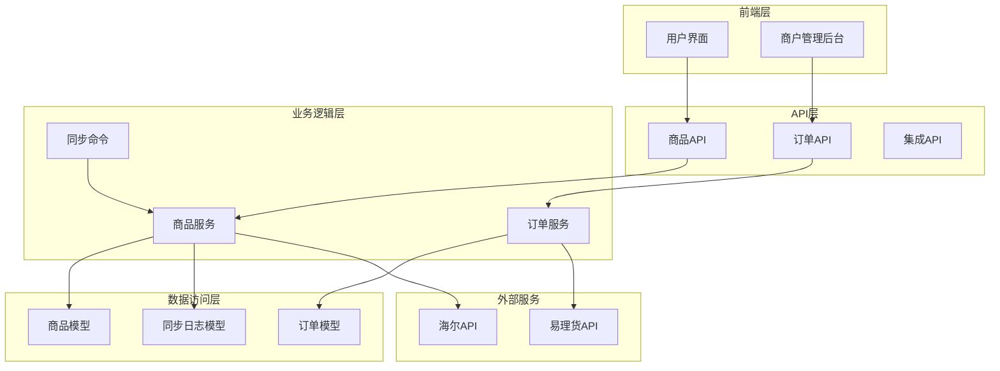
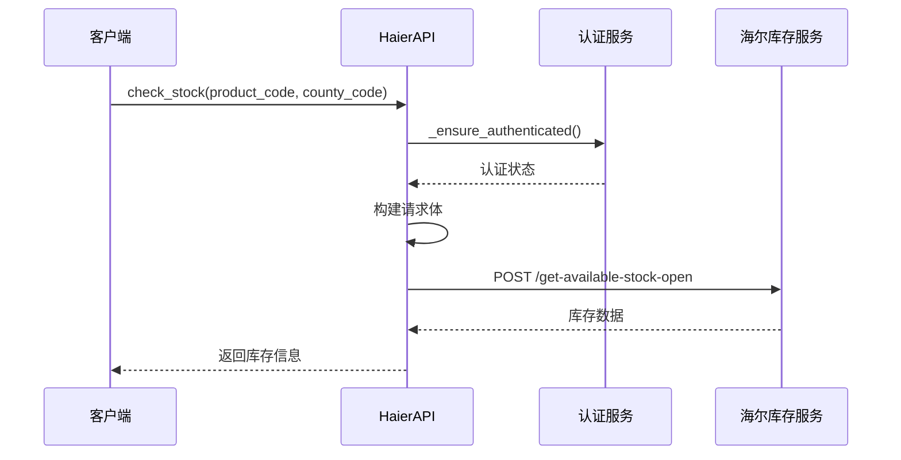
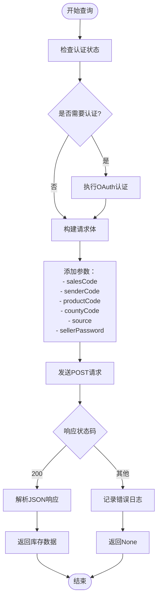
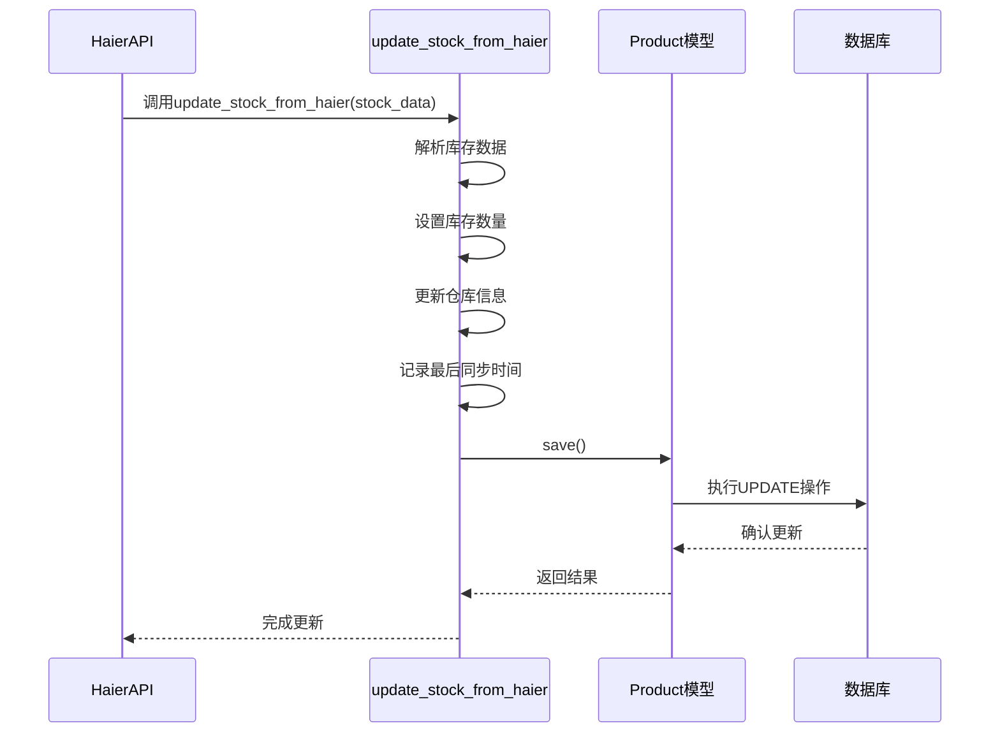
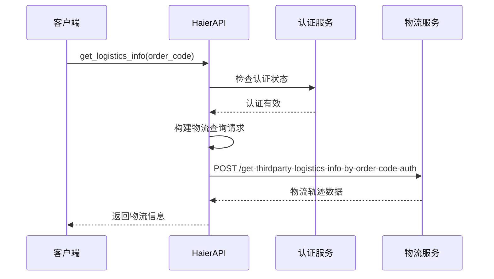
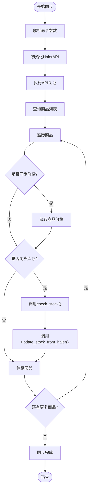
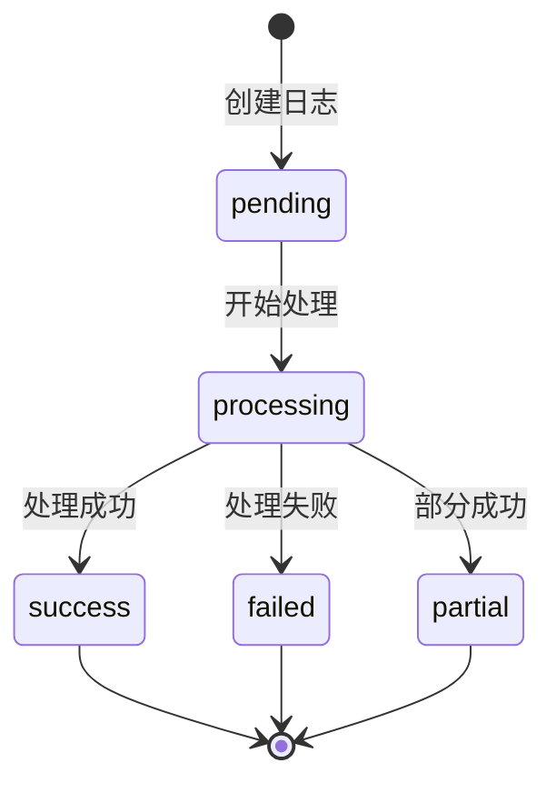
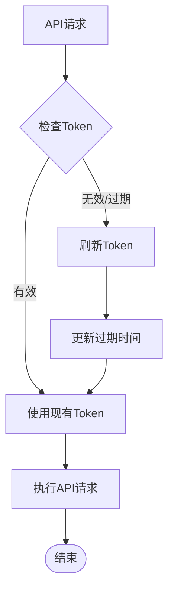

# 库存与物流查询功能详细说明

<cite>
**本文档引用的文件**
- [sync_haier_products.py](file://backend/catalog/management/commands/sync_haier_products.py)
- [haierapi.py](file://backend/integrations/haierapi.py)
- [ylhapi.py](file://backend/integrations/ylhapi.py)
- [models.py](file://backend/integrations/models.py)
- [models.py](file://backend/catalog/models.py)
- [views.py](file://backend/catalog/views.py)
- [views.py](file://backend/orders/views.py)
- [services.py](file://backend/orders/services.py)
- [serializers.py](file://backend/orders/serializers.py)
- [haier_api.md](file://haier_api.md)
</cite>

## 目录
1. [概述](#概述)
2. [项目架构](#项目架构)
3. [库存查询功能](#库存查询功能)
4. [物流查询功能](#物流查询功能)
5. [同步机制](#同步机制)
6. [日志追踪系统](#日志追踪系统)
7. [性能优化](#性能优化)
8. [故障排除指南](#故障排除指南)
9. [总结](#总结)

## 概述

本文档详细说明了基于海尔API的库存与物流查询功能的实现。该系统通过两个主要的API接口实现了完整的供应链管理功能：`check_stock()`方法用于查询特定区域的可用库存，`get_logistics_info()`方法用于获取第三方物流轨迹信息。系统采用异步同步机制，支持批量商品数据同步，并提供了完善的日志追踪和性能监控功能。

## 项目架构

系统采用分层架构设计，主要包含以下几个层次：



**图表来源**
- [sync_haier_products.py](file://backend/catalog/management/commands/sync_haier_products.py#L1-L156)
- [haierapi.py](file://backend/integrations/haierapi.py#L1-L214)
- [ylhapi.py](file://backend/integrations/ylhapi.py#L1-L459)

## 库存查询功能

### check_stock()方法实现

`check_stock()`方法是系统的核心库存查询功能，通过指定的区域编码查询特定商品的可用库存。

#### 方法签名与参数



**图表来源**
- [haierapi.py](file://backend/integrations/haierapi.py#L121-L142)

#### 核心实现细节

方法的关键参数说明：

| 参数名称 | 类型 | 必填 | 描述 | 示例值 |
|---------|------|------|------|--------|
| product_code | str | 是 | 商品编码 | GA0SZC00U |
| county_code | str | 是 | 区域编码 | 110101 |
| source | str | 否 | 数据来源标识 | JSH-B |
| sellerPassword | str | 是 | 客户密码 | 配置项 |

#### 请求构建流程



**图表来源**
- [haierapi.py](file://backend/integrations/haierapi.py#L121-L142)

#### sellerPassword的作用

`sellerPassword`参数在请求中起到关键的安全验证作用：

1. **身份验证**：确保只有授权的客户端可以查询库存信息
2. **权限控制**：区分不同客户的访问权限
3. **数据保护**：防止未授权的库存数据泄露
4. **审计追踪**：便于后续的安全审计和问题追踪

**章节来源**
- [haierapi.py](file://backend/integrations/haierapi.py#L121-L142)

### 库存数据更新机制

系统通过`update_stock_from_haier()`方法将查询到的库存数据更新到本地数据库：

#### 更新流程



**图表来源**
- [models.py](file://backend/catalog/models.py#L180-L193)

**章节来源**
- [models.py](file://backend/catalog/models.py#L180-L193)

## 物流查询功能

### get_logistics_info()方法实现

物流查询功能通过订单编码和发货单号获取第三方物流轨迹信息。

#### 方法参数与用途

| 参数名称 | 类型 | 必填 | 描述 | 用途 |
|---------|------|------|------|------|
| order_code | str | 是 | 订单编码 | 主要查询条件 |
| delivery_record_code | str | 否 | 发货单号 | 可选补充条件 |
| member_id | int | 否 | 会员ID | 零售客户标识 |

#### 请求认证机制

物流查询采用与库存查询相同的认证机制，但使用不同的API端点：



**图表来源**
- [haierapi.py](file://backend/integrations/haierapi.py#L144-L166)

#### 第三方物流集成

系统支持多种物流渠道的查询：

1. **统仓云仓物流**：海尔自建仓储物流
2. **智汇宝物流**：海尔智能物流平台
3. **第三方快递**：合作快递公司物流

**章节来源**
- [haierapi.py](file://backend/integrations/haierapi.py#L144-L166)

## 同步机制

### --sync-stock参数功能

`sync_haier_products.py`命令通过`--sync-stock`参数触发库存检查和更新：

#### 同步流程



**图表来源**
- [sync_haier_products.py](file://backend/catalog/management/commands/sync_haier_products.py#L50-L156)

#### 区域编码配置

系统默认使用北京东城区的区域编码（110101），但可以通过`--county-code`参数指定其他区域：

```python
# 默认区域编码
county_code = request.data.get('county_code', '110101')

# 命令行参数
parser.add_argument('--county-code', type=str, default='110101', help='区域编码')
```

**章节来源**
- [sync_haier_products.py](file://backend/catalog/management/commands/sync_haier_products.py#L39-L48)
- [sync_haier_products.py](file://backend/catalog/management/commands/sync_haier_products.py#L126-L130)

## 日志追踪系统

### HaierSyncLog模型设计

系统通过`HaierSyncLog`模型记录所有同步操作的详细信息：

#### 同步类型定义

| 同步类型 | 描述 | 应用场景 |
|---------|------|----------|
| products | 商品同步 | 商品信息更新 |
| prices | 价格同步 | 价格信息更新 |
| stock | 库存同步 | 库存数据更新 |
| order | 订单推送 | 订单状态同步 |
| logistics | 物流查询 | 物流信息查询 |
| manual | 手动操作 | 人工干预操作 |

#### 状态跟踪机制



**图表来源**
- [models.py](file://backend/integrations/models.py#L57-L72)

#### 性能监控指标

系统提供多个性能监控维度：

1. **成功率计算**：`(success_count / total_count) * 100`
2. **处理耗时**：`completed_at - started_at`
3. **错误率统计**：`failed_count / total_count`
4. **并发处理能力**：同时处理的任务数量

**章节来源**
- [models.py](file://backend/integrations/models.py#L50-L150)

## 性能优化

### 认证缓存机制

系统实现了智能的认证缓存机制，避免重复认证：



**图表来源**
- [haierapi.py](file://backend/integrations/haierapi.py#L66-L70)

### 超时与重试策略

- **连接超时**：30秒
- **认证超时**：10秒
- **重试次数**：最多3次
- **退避算法**：指数退避

### 批量处理优化

对于大量商品的同步，系统支持批量处理：

1. **分批查询**：每次最多查询20个商品
2. **并发控制**：限制同时进行的请求数量
3. **进度跟踪**：实时显示同步进度

## 故障排除指南

### 常见问题与解决方案

#### 认证失败

**症状**：API返回401未授权错误
**原因**：
- 客户端ID或密钥配置错误
- Token过期
- sellerPassword不正确

**解决方案**：
1. 检查配置文件中的认证信息
2. 重新执行认证流程
3. 验证sellerPassword的正确性

#### 库存查询失败

**症状**：check_stock()返回None
**原因**：
- 商品编码不存在
- 区域编码无效
- 网络连接问题
- API服务不可用

**解决方案**：
1. 验证商品编码的正确性
2. 检查区域编码的有效性
3. 检查网络连接状态
4. 查看API服务状态

#### 物流信息缺失

**症状**：get_logistics_info()返回空数据
**原因**：
- 订单尚未发货
- 订单状态不支持查询
- API权限不足

**解决方案**：
1. 确认订单的发货状态
2. 检查API权限配置
3. 尝试使用不同的查询参数

**章节来源**
- [haierapi.py](file://backend/integrations/haierapi.py#L134-L142)
- [haierapi.py](file://backend/integrations/haierapi.py#L158-L166)

## 总结

本文档详细介绍了基于海尔API的库存与物流查询功能的完整实现。系统通过精心设计的架构，实现了高效、可靠的供应链管理功能：

1. **模块化设计**：清晰分离了API调用、数据处理和业务逻辑
2. **安全机制**：完善的认证和授权体系
3. **性能优化**：智能缓存和批量处理机制
4. **监控追踪**：全面的日志记录和性能监控
5. **容错处理**：健壮的错误处理和恢复机制

该系统为企业级应用提供了稳定可靠的库存和物流管理解决方案，支持大规模商品数据的同步和实时查询需求。通过持续的监控和优化，系统能够适应不断变化的业务需求和技术环境。