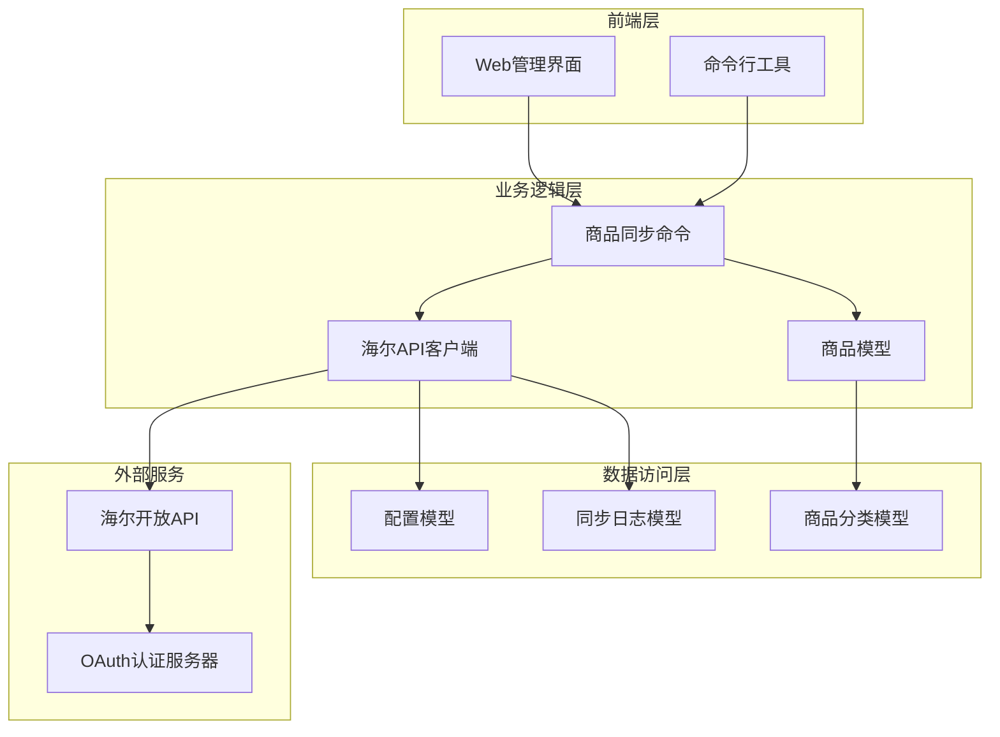
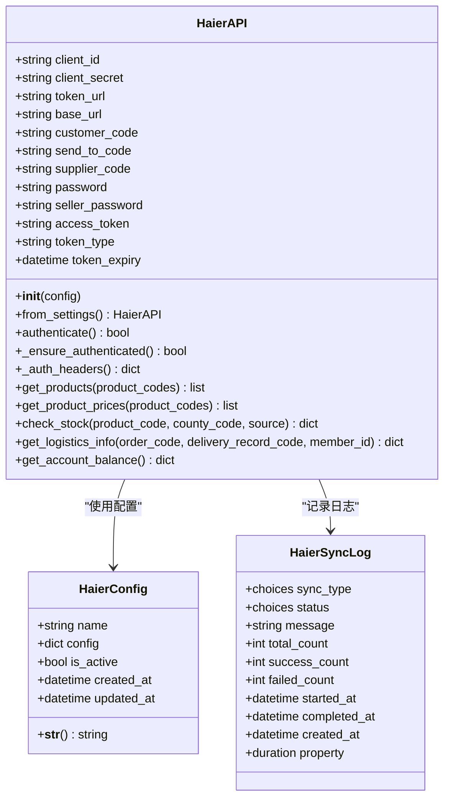
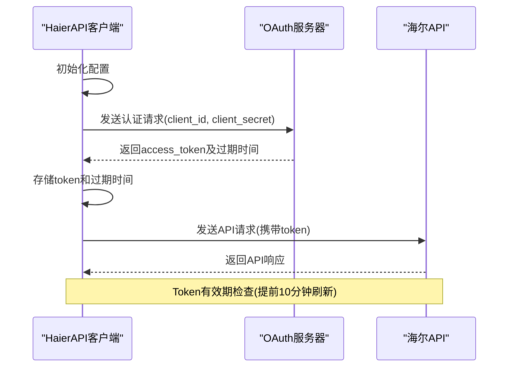
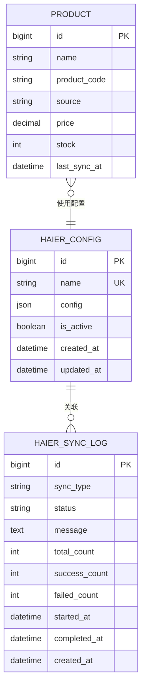
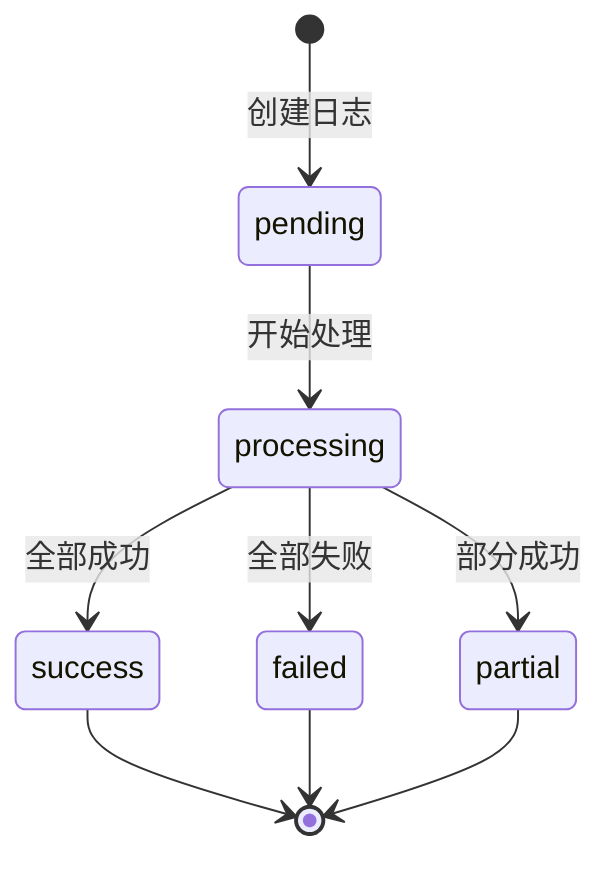
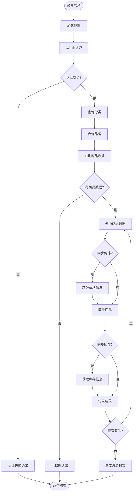
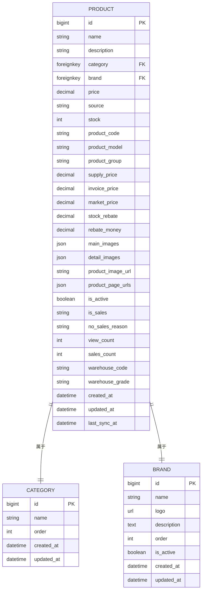
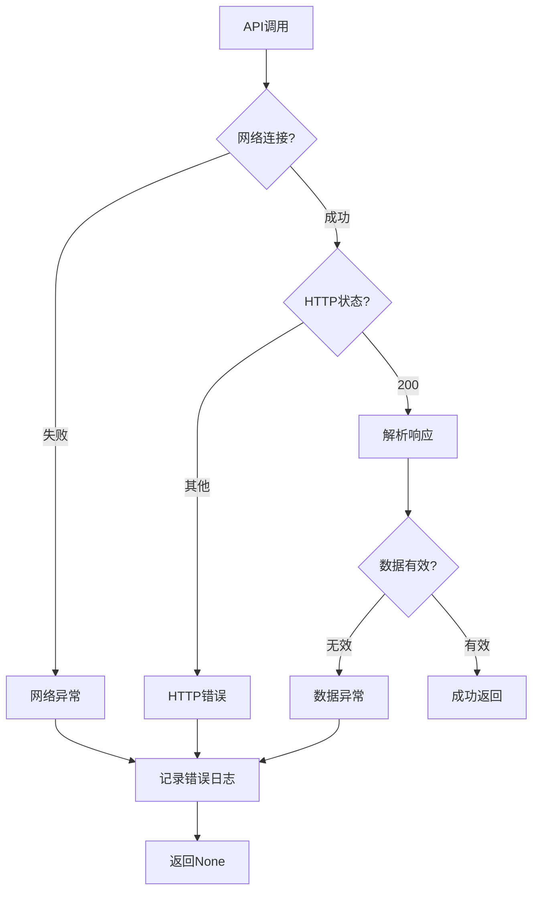

# 海尔API集成机制详细文档

<cite>
**本文档引用的文件**
- [haierapi.py](file://backend/integrations/haierapi.py)
- [models.py](file://backend/integrations/models.py)
- [sync_haier_products.py](file://backend/catalog/management/commands/sync_haier_products.py)
- [admin.py](file://backend/integrations/admin.py)
- [migrations/0002_haierconfig_haiersynclog_delete_supplierconfig_and_more.py](file://backend/integrations/migrations/0002_haierconfig_haiersynclog_delete_supplierconfig_and_more.py)
- [catalog/models.py](file://backend/catalog/models.py)
- [settings/base.py](file://backend/backend/settings/base.py)
- [env_config.py](file://backend/backend/settings/env_config.py)
</cite>

## 目录
1. [概述](#概述)
2. [系统架构](#系统架构)
3. [HaierAPI类核心实现](#haierapi类核心实现)
4. [配置管理系统](#配置管理系统)
5. [同步日志机制](#同步日志机制)
6. [商品数据同步管理命令](#商品数据同步管理命令)
7. [数据模型设计](#数据模型设计)
8. [异常处理与超时机制](#异常处理与超时机制)
9. [集成层设计模式](#集成层设计模式)
10. [最佳实践与优化建议](#最佳实践与优化建议)

## 概述

海尔API集成为电商平台提供了与海尔开放平台进行数据交互的能力，支持商品信息同步、价格查询、库存检查、物流信息获取和账户余额查询等核心功能。该集成系统采用模块化设计，通过OAuth2认证机制确保安全性，并提供完善的日志记录和错误处理机制。

### 核心功能特性

- **OAuth2认证流程**：基于client_id/client_secret的标准化认证
- **自动令牌刷新**：智能令牌管理，提前10分钟刷新
- **多接口支持**：商品同步、价格查询、库存检查、物流查询、账户余额
- **配置管理**：数据库驱动的多环境配置管理
- **日志审计**：完整的同步操作记录和状态跟踪
- **错误处理**：完善的异常捕获和重试机制

## 系统架构



**架构图来源**
- [haierapi.py](file://backend/integrations/haierapi.py#L10-L214)
- [sync_haier_products.py](file://backend/catalog/management/commands/sync_haier_products.py#L13-L156)
- [models.py](file://backend/integrations/models.py#L4-L150)

## HaierAPI类核心实现

### 类结构设计

HaierAPI类是整个集成系统的核心组件，负责与海尔开放平台的所有API交互。该类采用面向对象的设计模式，封装了认证、请求发送、响应处理等核心功能。



**类图来源**
- [haierapi.py](file://backend/integrations/haierapi.py#L10-L214)
- [models.py](file://backend/integrations/models.py#L4-L150)

### OAuth2认证流程

系统实现了标准的OAuth2客户端凭证授权流程，确保与海尔开放平台的安全通信。



**序列图来源**
- [haierapi.py](file://backend/integrations/haierapi.py#L41-L64)
- [haierapi.py](file://backend/integrations/haierapi.py#L66-L69)

### 自动令牌刷新机制

系统实现了智能的令牌刷新机制，在令牌即将过期前自动重新获取新的访问令牌。

**关键特性：**
- **提前刷新**：在令牌到期前10分钟自动刷新
- **智能判断**：根据当前时间和令牌过期时间决定是否需要刷新
- **异常处理**：刷新失败时继续使用现有令牌直到完全过期

**节源码**
- [haierapi.py](file://backend/integrations/haierapi.py#L66-L69)
- [haierapi.py](file://backend/integrations/haierapi.py#L59-L60)

### 核心API接口实现

#### 商品同步接口(get_products)

商品同步接口负责从海尔平台获取可采购的商品信息，支持按产品编码筛选和批量查询。

**主要功能：**
- 支持单个或多个产品编码查询
- 自动处理分页和数据格式转换
- 集成品牌和分类信息匹配

**节源码**
- [haierapi.py](file://backend/integrations/haierapi.py#L74-L97)

#### 价格查询接口(get_product_prices)

价格查询接口提供实时的商品价格信息，支持批量查询以提高效率。

**关键特性：**
- 批量查询支持最多20个产品编码
- 支持多种价格类型的查询
- 实时价格数据获取

**节源码**
- [haierapi.py](file://backend/integrations/haierapi.py#L99-L119)

#### 库存检查接口(check_stock)

库存检查接口提供精确的库存信息查询，支持按区域和仓库等级筛选。

**查询参数：**
- `product_code`：产品编码
- `county_code`：区域编码
- `source`：数据来源标识

**节源码**
- [haierapi.py](file://backend/integrations/haierapi.py#L121-L142)

#### 物流信息获取接口(get_logistics_info)

物流信息接口提供订单相关的物流状态查询功能。

**支持查询类型：**
- 订单物流信息
- 运单详情
- 物流状态追踪

**节源码**
- [haierapi.py](file://backend/integrations/haierapi.py#L144-L166)

#### 账户余额查询接口(get_account_balance)

账户余额接口提供海尔平台账户的财务信息查询。

**查询内容：**
- 可用余额
- 冻结金额
- 待结算金额

**节源码**
- [haierapi.py](file://backend/integrations/haierapi.py#L168-L185)

## 配置管理系统

### HaierConfig模型设计

HaierConfig模型采用JSONField存储配置信息，支持灵活的配置结构和多环境管理。



**实体关系图来源**
- [models.py](file://backend/integrations/models.py#L4-L150)
- [catalog/models.py](file://backend/catalog/models.py#L43-L200)

### 多环境配置管理

系统支持通过Django设置模块进行环境变量配置，支持开发和生产环境的不同配置需求。

**配置项说明：**

| 配置项 | 描述 | 默认值 | 必需 |
|--------|------|--------|------|
| HAIER_CLIENT_ID | OAuth客户端ID | '' | 是 |
| HAIER_CLIENT_SECRET | OAuth客户端密钥 | '' | 是 |
| HAIER_TOKEN_URL | OAuth令牌获取地址 | 测试环境URL | 是 |
| HAIER_BASE_URL | API基础地址 | 测试环境URL | 是 |
| HAIER_CUSTOMER_CODE | 客户编码 | '' | 是 |
| HAIER_SEND_TO_CODE | 发货编码 | '' | 否 |
| HAIER_SUPPLIER_CODE | 供应商编码 | '1001' | 否 |
| HAIER_PASSWORD | 通用密码 | '' | 是 |
| HAIER_SELLER_PASSWORD | 卖家密码 | '' | 是 |

**节源码**
- [settings/base.py](file://backend/backend/settings/base.py#L238-L246)
- [env_config.py](file://backend/backend/settings/env_config.py#L1-L252)

### 配置管理界面

系统提供了Django Admin界面用于配置管理，支持配置的增删改查和状态控制。

**管理界面特性：**
- 配置列表视图
- 激活/禁用状态切换
- 创建和更新时间显示
- 搜索和过滤功能

**节源码**
- [admin.py](file://backend/integrations/admin.py#L5-L12)

## 同步日志机制

### HaierSyncLog模型设计

HaierSyncLog模型提供了完整的同步操作审计功能，记录每次同步操作的详细信息。



**状态定义：**

| 状态 | 描述 | 用途 |
|------|------|------|
| pending | 待处理 | 日志刚创建时的状态 |
| processing | 处理中 | 正在执行同步操作 |
| success | 成功 | 同步操作全部成功 |
| failed | 失败 | 同步操作全部失败 |
| partial | 部分成功 | 同步操作部分成功部分失败 |

**同步类型：**

| 类型 | 描述 |
|------|------|
| products | 商品同步 |
| prices | 价格同步 |
| stock | 库存同步 |
| order | 订单推送 |
| logistics | 物流查询 |
| manual | 手动操作 |

**节源码**
- [models.py](file://backend/integrations/models.py#L50-L150)

### 日志记录策略

系统在每个同步操作的关键节点都会记录详细的日志信息，包括：

- **操作类型**：明确的操作类别
- **执行状态**：成功、失败或部分成功
- **统计信息**：处理总数、成功数、失败数
- **执行时间**：开始时间、结束时间和耗时
- **错误信息**：详细的错误描述和堆栈信息

**节源码**
- [sync_haier_products.py](file://backend/catalog/management/commands/sync_haier_products.py#L147-L156)

### 索引优化设计

为了提高日志查询性能，系统在HaierSyncLog模型中添加了复合索引：

- `(status, created_at)`：按状态和时间查询
- `(sync_type, created_at)`：按类型和时间查询

**节源码**
- [migrations/0002_haierconfig_haiersynclog_delete_supplierconfig_and_more.py](file://backend/integrations/migrations/0002_haierconfig_haiersynclog_delete_supplierconfig_and_more.py#L55-L62)

## 商品数据同步管理命令

### sync_haier_products命令设计

sync_haier_products是一个Django管理命令，专门用于从海尔API同步商品数据到本地数据库。



**流程图来源**
- [sync_haier_products.py](file://backend/catalog/management/commands/sync_haier_products.py#L50-L156)

### 命令行参数支持

系统提供了丰富的命令行参数，支持灵活的商品同步策略：

**核心参数：**

| 参数 | 类型 | 描述 | 默认值 |
|------|------|------|--------|
| --product-codes | 字符串列表 | 指定要同步的产品编码 | 全部 |
| --category | 字符串 | 指定商品分类名称 | 无 |
| --brand | 字符串 | 指定品牌名称 | 无 |
| --sync-prices | 布尔 | 同步价格信息 | False |
| --sync-stock | 布尔 | 同步库存信息 | False |
| --county-code | 字符串 | 区域编码 | '110101' |

**节源码**
- [sync_haier_products.py](file://backend/catalog/management/commands/sync_haier_products.py#L16-L49)

### 数据同步流程

#### 商品数据同步

系统通过Product.sync_from_haier方法实现商品数据的本地同步，该方法负责：

1. **数据验证**：检查产品编码的有效性
2. **商品创建/更新**：基于产品编码获取或创建商品记录
3. **信息填充**：同步商品的基本信息、价格信息和品牌信息
4. **状态标记**：标记商品来源为海尔商品
5. **时间戳更新**：记录最后同步时间

**节源码**
- [catalog/models.py](file://backend/catalog/models.py#L119-L179)

#### 库存信息同步

库存同步通过Product.update_stock_from_haier方法实现，该方法更新商品的库存数量和仓库信息。

**更新字段：**
- `stock`：库存数量
- `warehouse_code`：库位编码
- `warehouse_grade`：仓库等级
- `last_sync_at`：最后同步时间

**节源码**
- [catalog/models.py](file://backend/catalog/models.py#L181-L195)

### 错误处理与重试机制

系统实现了完善的错误处理机制：

1. **认证失败处理**：认证失败时立即终止后续操作
2. **API调用异常**：捕获网络异常和API响应异常
3. **数据解析错误**：处理API返回数据格式不正确的情况
4. **本地数据错误**：处理商品创建和更新过程中的数据库异常

**节源码**
- [sync_haier_products.py](file://backend/catalog/management/commands/sync_haier_products.py#L147-L151)

### 日志记录策略

命令执行过程中会记录详细的日志信息：

- **进度信息**：显示当前处理的商品编号
- **成功信息**：记录成功的同步操作
- **警告信息**：记录库存查询失败等非致命问题
- **错误信息**：记录完整的错误堆栈信息
- **总结信息**：生成最终的同步统计报告

**节源码**
- [sync_haier_products.py](file://backend/catalog/management/commands/sync_haier_products.py#L104-L156)

## 数据模型设计

### 商品模型扩展

系统在原有的Product模型基础上增加了海尔API相关的字段，实现了与海尔平台的数据映射。



**实体关系图来源**
- [catalog/models.py](file://backend/catalog/models.py#L43-L200)

### 数据映射转换逻辑

系统实现了完整的数据映射转换逻辑，确保海尔API数据能够正确转换为本地商品模型：

**字段映射规则：**

| 海尔API字段 | 本地字段 | 映射规则 | 备注 |
|-------------|----------|----------|------|
| productCode | product_code | 直接映射 | 主键字段 |
| productModel | product_model | 直接映射 | 商品型号 |
| productImageUrl | product_image_url | 直接映射 | 主图URL |
| productLageUrls | product_page_urls | JSON数组映射 | 拉页URL列表 |
| supplyPrice | supply_price | 直接映射 | 供价 |
| invoicePrice | invoice_price | 直接映射 | 开票价 |
| isSales | is_sales | 直接映射 | 是否可采 |
| noSalesReason | no_sales_reason | 直接映射 | 不可采原因 |

**节源码**
- [catalog/models.py](file://backend/catalog/models.py#L149-L178)

### 本地商品模型一致性保证

系统通过以下机制确保与本地商品模型的一致性：

1. **唯一性约束**：基于product_code建立唯一约束
2. **默认值设置**：为必填字段设置合理的默认值
3. **数据验证**：在保存前进行数据完整性检查
4. **版本控制**：通过last_sync_at字段跟踪数据版本

**节源码**
- [catalog/models.py](file://backend/catalog/models.py#L138-L147)

## 异常处理与超时机制

### 超时设置策略

系统在所有API调用中都设置了合理的超时时间，确保系统的响应性和稳定性。

**超时配置：**
- **认证请求**：10秒超时
- **业务API调用**：30秒超时

这种分级超时策略考虑了不同操作的复杂度和网络延迟：

- **认证请求**：相对简单的HTTP POST请求，10秒足够
- **业务API**：涉及复杂数据处理和网络传输，30秒更合适

**节源码**
- [haierapi.py](file://backend/integrations/haierapi.py#L48-L48)
- [haierapi.py](file://backend/integrations/haierapi.py#L89-L89)

### 异常捕获机制

系统实现了多层次的异常捕获机制：



**异常类型处理：**

1. **网络异常**：连接超时、DNS解析失败等
2. **HTTP异常**：4xx客户端错误、5xx服务器错误
3. **数据异常**：JSON解析失败、数据格式不正确
4. **认证异常**：令牌过期、权限不足

**节源码**
- [haierapi.py](file://backend/integrations/haierapi.py#L59-L64)
- [haierapi.py](file://backend/integrations/haierapi.py#L95-L97)
- [haierapi.py](file://backend/integrations/haierapi.py#L118-L119)

### 错误恢复策略

系统采用渐进式的错误恢复策略：

1. **即时重试**：对于临时性网络问题，系统会自动重试
2. **降级处理**：当某些功能不可用时，系统会降级到可用的功能
3. **状态标记**：记录失败的操作以便后续重试
4. **用户通知**：通过日志和管理界面通知管理员

**节源码**
- [sync_haier_products.py](file://backend/catalog/management/commands/sync_haier_products.py#L147-L151)

## 集成层设计模式

### 单一职责原则

HaierAPI类严格遵循单一职责原则，每个方法只负责一个特定的功能：

- **认证相关**：authenticate、_ensure_authenticated、_auth_headers
- **API调用**：get_products、get_product_prices、check_stock、get_logistics_info、get_account_balance
- **配置管理**：__init__、from_settings

这种设计使得代码更易于测试、维护和扩展。

### 开放封闭原则

系统设计遵循开放封闭原则：

- **对扩展开放**：可以通过继承HaierAPI类添加新的API接口
- **对修改关闭**：核心认证和请求处理逻辑不需要修改即可支持新功能

### 依赖注入模式

系统采用依赖注入的方式管理配置和外部依赖：

```python
# 配置注入示例
def __init__(self, config: Dict[str, Any]):
    self.client_id = config.get('client_id')
    self.client_secret = config.get('client_secret')
    # ... 其他配置项
```

这种方式使得系统更容易进行单元测试和配置管理。

**节源码**
- [haierapi.py](file://backend/integrations/haierapi.py#L11-L19)

### 工厂模式应用

系统使用工厂模式创建HaierAPI实例：

```python
@classmethod
def from_settings(cls):
    from django.conf import settings
    return cls({
        'client_id': getattr(settings, 'HAIER_CLIENT_ID', ''),
        # ... 其他配置项
    })
```

这种设计简化了API实例的创建过程，同时保持了配置的灵活性。

**节源码**
- [haierapi.py](file://backend/integrations/haierapi.py#L26-L39)

## 最佳实践与优化建议

### 性能优化建议

1. **批量操作**：利用API的批量查询能力，减少网络请求次数
2. **缓存策略**：对不经常变化的数据实施缓存机制
3. **并发控制**：在高并发场景下实施适当的并发限制
4. **连接池**：使用连接池管理HTTP连接

### 安全最佳实践

1. **敏感信息保护**：确保client_secret等敏感信息的安全存储
2. **HTTPS强制**：所有API通信必须使用HTTPS协议
3. **访问控制**：实施适当的访问控制和审计机制
4. **定期轮换**：定期轮换API密钥和访问令牌

### 监控和告警

建议实施以下监控指标：

- **API响应时间**：监控各个API接口的响应时间
- **错误率统计**：跟踪各类错误的发生频率
- **认证成功率**：监控OAuth2认证的成功率
- **数据同步频率**：跟踪商品数据的同步频率和完整性

### 故障排查指南

1. **认证失败**：检查client_id和client_secret配置
2. **API调用失败**：检查网络连接和目标服务状态
3. **数据同步异常**：检查本地数据库连接和数据格式
4. **性能问题**：分析慢查询和网络延迟

### 扩展性考虑

系统设计具有良好的扩展性：

- **新API支持**：可以轻松添加新的海尔API接口
- **多平台支持**：可以扩展支持其他电商平台的API
- **插件机制**：可以实现插件化的API适配器
- **配置驱动**：通过配置文件可以快速切换不同的API环境

通过以上设计和实现，海尔API集成为电商平台提供了稳定、高效、安全的第三方数据集成解决方案，能够满足企业级应用的需求。