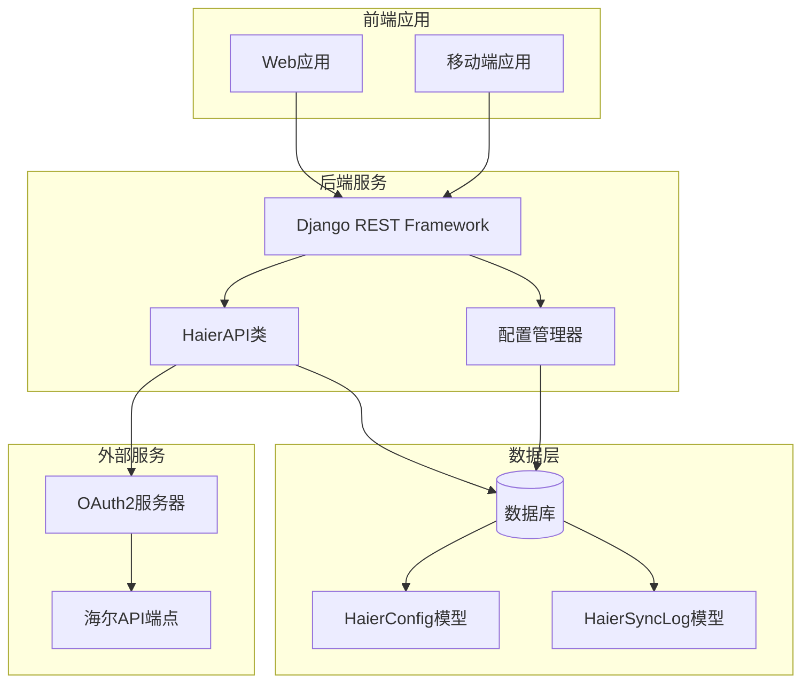
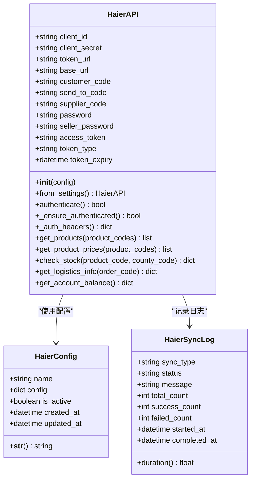
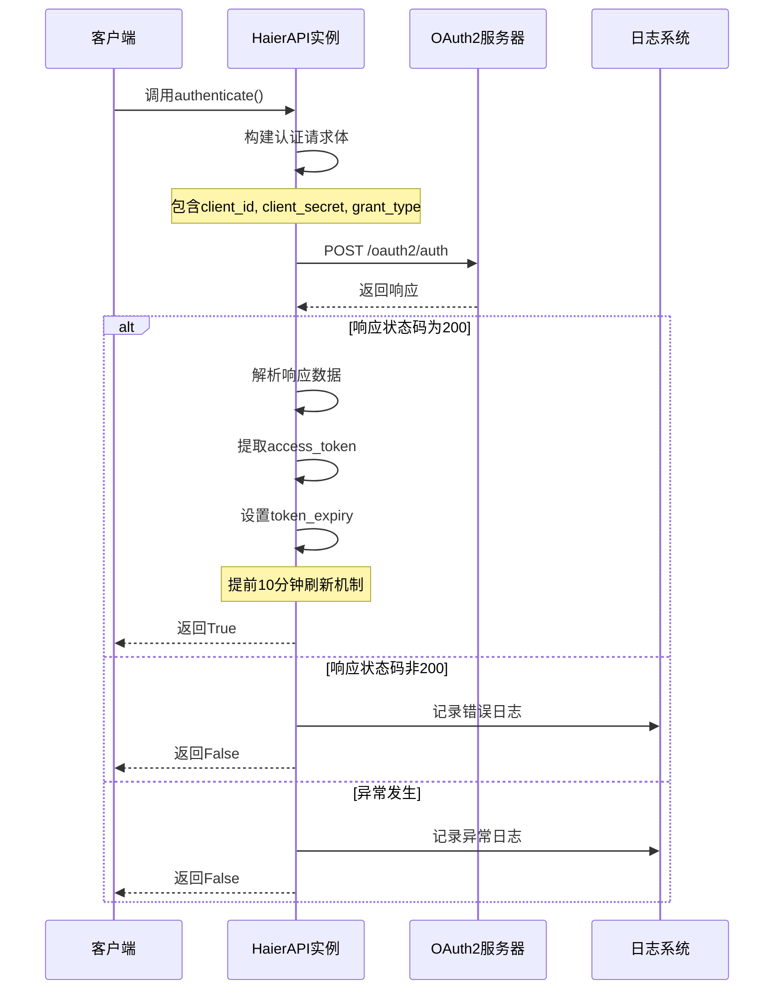
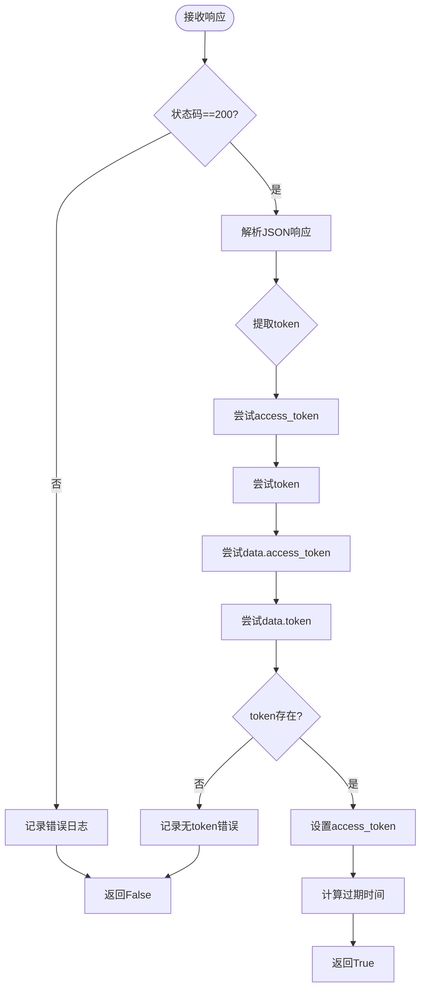
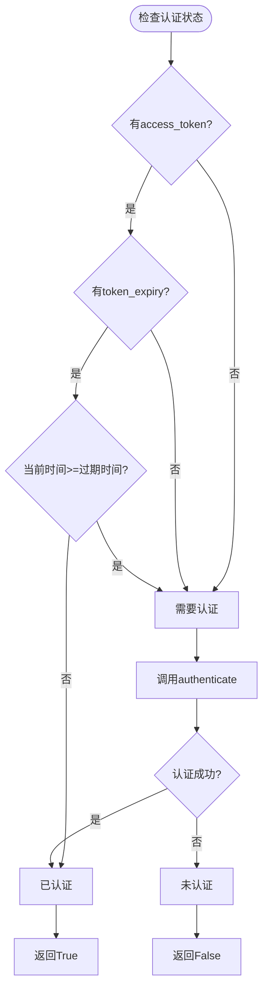
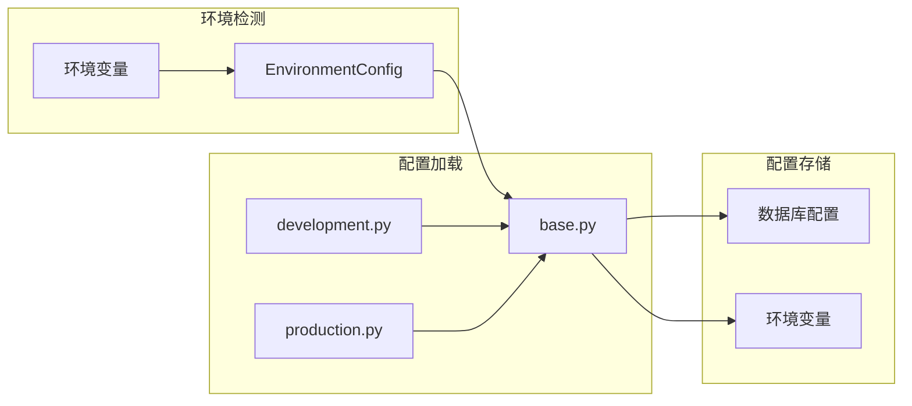
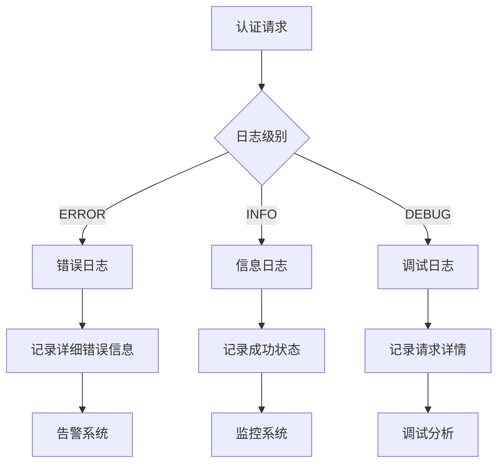
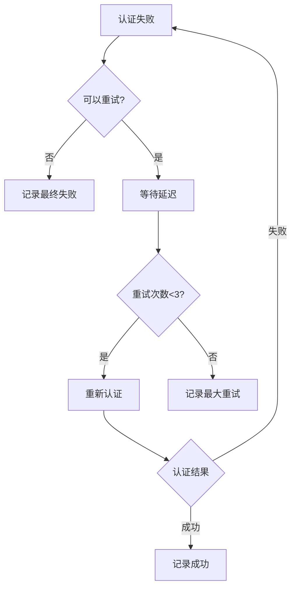
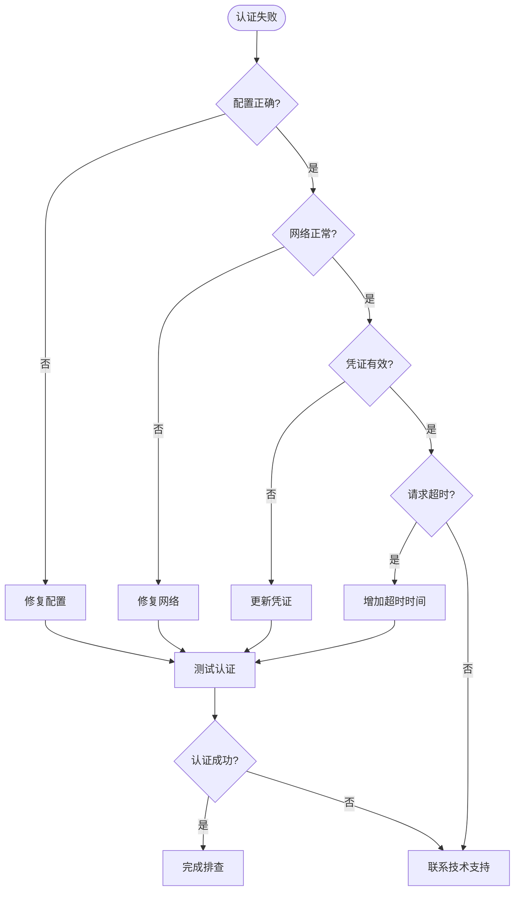

# 认证机制

<cite>
**本文档中引用的文件**
- [haierapi.py](file://backend/integrations/haierapi.py)
- [models.py](file://backend/integrations/models.py)
- [views.py](file://backend/integrations/views.py)
- [serializers.py](file://backend/integrations/serializers.py)
- [env_config.py](file://backend/backend/settings/env_config.py)
- [base.py](file://backend/backend/settings/base.py)
</cite>

## 目录
1. [概述](#概述)
2. [系统架构](#系统架构)
3. [核心组件分析](#核心组件分析)
4. [OAuth2认证流程](#oauth2认证流程)
5. [令牌自动刷新机制](#令牌自动刷新机制)
6. [配置管理系统](#配置管理系统)
7. [错误处理与日志记录](#错误处理与日志记录)
8. [最佳实践与故障排除](#最佳实践与故障排除)
9. [总结](#总结)

## 概述

海尔API认证机制是一个基于OAuth2协议的客户端凭据模式认证系统，专为电商平台与海尔开放平台的安全集成而设计。该系统采用多层架构设计，支持环境隔离、自动令牌刷新和完善的错误处理机制。

### 主要特性

- **OAuth2客户端凭据模式**：使用client_id和client_secret进行身份验证
- **自动令牌刷新**：智能检测令牌过期并自动重新获取
- **环境配置管理**：支持开发、测试、生产环境的无缝切换
- **安全存储**：敏感信息通过数据库配置表安全存储
- **完善日志**：详细的认证过程日志记录和错误追踪

## 系统架构



**图表来源**
- [haierapi.py](file://backend/integrations/haierapi.py#L10-L25)
- [models.py](file://backend/integrations/models.py#L4-L47)
- [views.py](file://backend/integrations/views.py#L36-L102)

## 核心组件分析

### HaierAPI类

HaierAPI类是整个认证系统的核心，负责与海尔API的交互和认证管理。



**图表来源**
- [haierapi.py](file://backend/integrations/haierapi.py#L10-L25)
- [models.py](file://backend/integrations/models.py#L4-L47)

**节来源**
- [haierapi.py](file://backend/integrations/haierapi.py#L10-L25)
- [models.py](file://backend/integrations/models.py#L4-L47)

### 配置管理模型

HaierConfig模型提供了灵活的配置存储机制，支持JSON格式的配置信息存储。

| 字段名 | 类型 | 描述 | 默认值 |
|--------|------|------|--------|
| name | CharField | 配置名称标识 | 'haier' |
| config | JSONField | 配置信息字典 | {} |
| is_active | BooleanField | 是否启用配置 | True |
| created_at | DateTimeField | 创建时间 | 自动 |
| updated_at | DateTimeField | 更新时间 | 自动 |

**节来源**
- [models.py](file://backend/integrations/models.py#L4-L47)

## OAuth2认证流程

### authenticate()方法实现

authenticate()方法实现了完整的OAuth2客户端凭据模式认证流程：



**图表来源**
- [haierapi.py](file://backend/integrations/haierapi.py#L41-L64)

### 请求构造细节

认证请求的构建遵循OAuth2标准规范：

| 参数名 | 值 | 描述 |
|--------|-----|------|
| client_id | self.client_id | 客户端标识符 |
| client_secret | self.client_secret | 客户端密钥 |
| grant_type | 'client_credentials' | 授权类型 |
| Content-Type | 'application/json' | 请求内容类型 |

### 响应解析逻辑

系统采用灵活的响应解析策略，支持多种响应格式：



**图表来源**
- [haierapi.py](file://backend/integrations/haierapi.py#L52-L60)

**节来源**
- [haierapi.py](file://backend/integrations/haierapi.py#L41-L64)

## 令牌自动刷新机制

### _token_expiry字段设计

_token_expiry字段实现了智能的令牌刷新机制，确保长时间运行任务的连续性：



**图表来源**
- [haierapi.py](file://backend/integrations/haierapi.py#L66-L69)

### 提前刷新策略

系统采用"提前10分钟刷新"的策略，确保令牌在实际过期前就已更新：

```python
# 计算令牌过期时间的公式
self.token_expiry = datetime.now() + timedelta(
    seconds=max(int(expires_in) - 600, 300)
)
```

这种设计考虑了以下因素：
- **网络延迟**：预留10分钟缓冲时间
- **系统性能**：避免频繁认证请求
- **业务连续性**：确保长时间任务不受影响

**节来源**
- [haierapi.py](file://backend/integrations/haierapi.py#L66-L69)

## 配置管理系统

### 多环境配置支持

系统通过EnvironmentConfig类和Django设置模块实现多环境配置管理：



**图表来源**
- [env_config.py](file://backend/backend/settings/env_config.py#L37-L252)
- [base.py](file://backend/backend/settings/base.py#L235-L246)

### 敏感信息保护

系统采用多层次的安全措施保护敏感信息：

| 层级 | 保护措施 | 实现方式 |
|------|----------|----------|
| 存储层 | 数据库加密 | JSONField存储 |
| 传输层 | HTTPS协议 | 所有API通信 |
| 内存层 | 及时清理 | 方法执行完毕后清除 |
| 日志层 | 敏感信息过滤 | 日志记录中不包含明文密码 |

### from_settings类方法

from_settings方法提供了从Django配置加载认证参数的便捷方式：

```python
@classmethod
def from_settings(cls):
    from django.conf import settings
    return cls({
        'client_id': getattr(settings, 'HAIER_CLIENT_ID', ''),
        'client_secret': getattr(settings, 'HAIER_CLIENT_SECRET', ''),
        'token_url': getattr(settings, 'HAIER_TOKEN_URL', ''),
        'base_url': getattr(settings, 'HAIER_BASE_URL', ''),
        'customer_code': getattr(settings, 'HAIER_CUSTOMER_CODE', ''),
        'send_to_code': getattr(settings, 'HAIER_SEND_TO_CODE', ''),
        'supplier_code': getattr(settings, 'HAIER_SUPPLIER_CODE', '1001'),
        'password': getattr(settings, 'HAIER_PASSWORD', ''),
        'seller_password': getattr(settings, 'HAIER_SELLER_PASSWORD', ''),
    })
```

**节来源**
- [haierapi.py](file://backend/integrations/haierapi.py#L26-L39)
- [base.py](file://backend/backend/settings/base.py#L235-L246)
- [env_config.py](file://backend/backend/settings/env_config.py#L37-L252)

## 错误处理与日志记录

### 常见认证失败原因

系统识别并处理以下常见的认证失败场景：

| 错误类型 | 原因 | 日志信息 | 解决方案 |
|----------|------|----------|----------|
| 凭证错误 | client_id或client_secret错误 | 'haier auth failed: 401 Unauthorized' | 检查配置参数 |
| 网络超时 | 请求超时或连接失败 | 'haier auth error: timeout' | 检查网络连接 |
| 令牌无效 | 令牌格式错误或已过期 | 'haier auth no token' | 重新认证 |
| 服务器错误 | 海尔API服务器问题 | 'haier auth failed: 500 Internal Server Error' | 稍后重试 |

### 日志记录策略

系统采用分级日志记录策略：



**图表来源**
- [haierapi.py](file://backend/integrations/haierapi.py#L49-L64)

### 重试策略

系统实现了智能的重试机制：



**节来源**
- [haierapi.py](file://backend/integrations/haierapi.py#L41-L64)

## 最佳实践与故障排除

### 配置最佳实践

1. **环境隔离**：不同环境使用不同的client_id和client_secret
2. **定期轮换**：定期更新client_secret以提高安全性
3. **权限最小化**：只授予必要的API访问权限
4. **监控告警**：设置认证失败的监控和告警

### 故障排除指南

#### 认证失败排查步骤



### 性能优化建议

1. **连接池管理**：合理设置HTTP连接池大小
2. **缓存策略**：适当缓存认证结果
3. **并发控制**：限制同时认证请求数量
4. **监控指标**：跟踪认证成功率和响应时间

**节来源**
- [views.py](file://backend/integrations/views.py#L60-L101)

## 总结

海尔API认证机制是一个设计精良、功能完备的OAuth2认证系统。它通过以下关键特性确保了系统的安全性和可靠性：

### 核心优势

1. **安全性**：采用OAuth2标准协议，支持多层安全防护
2. **可靠性**：智能令牌刷新机制确保服务连续性
3. **可维护性**：清晰的代码结构和完善的错误处理
4. **可扩展性**：支持多环境配置和灵活的扩展机制

### 技术亮点

- **自动刷新机制**：提前10分钟刷新令牌，避免服务中断
- **灵活配置**：支持数据库和环境变量双重配置方式
- **完善日志**：详细的认证过程记录和错误追踪
- **健壮错误处理**：全面的异常捕获和恢复机制

该认证机制为电商平台与海尔开放平台的深度集成提供了坚实的技术基础，确保了数据交换的安全性和业务操作的稳定性。