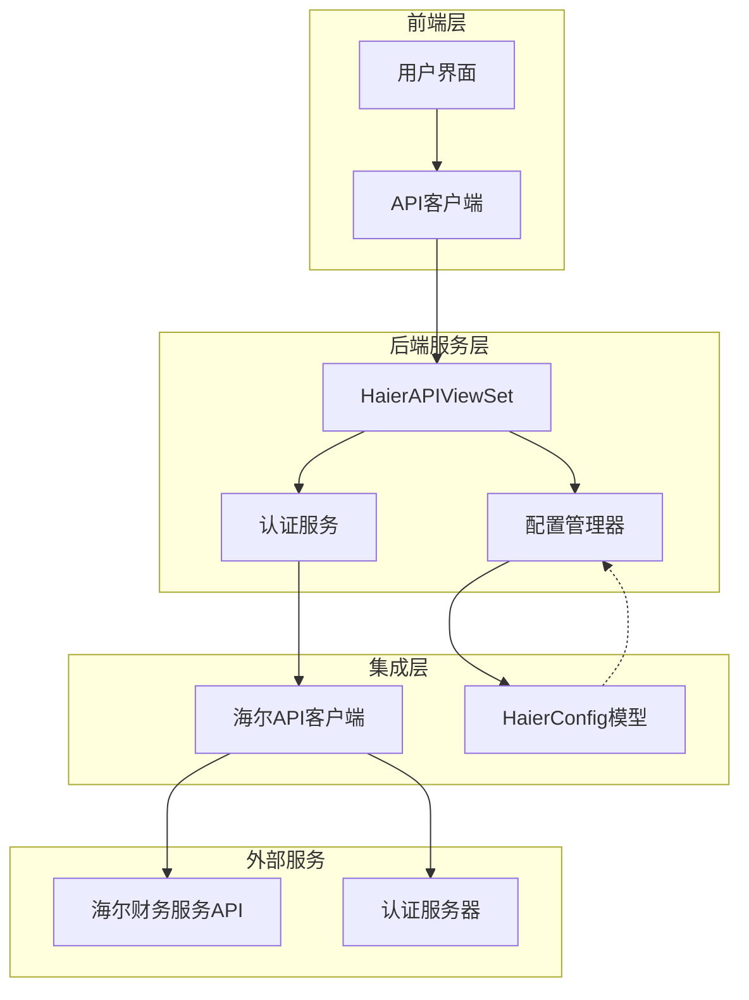
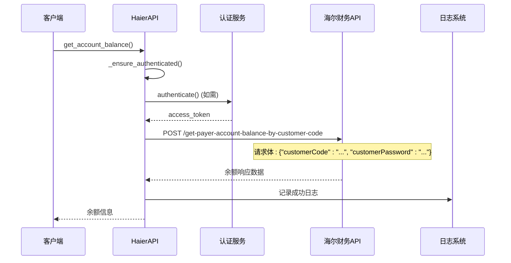
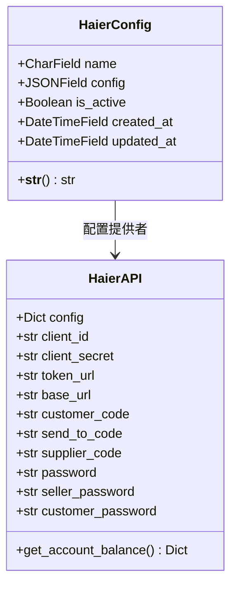
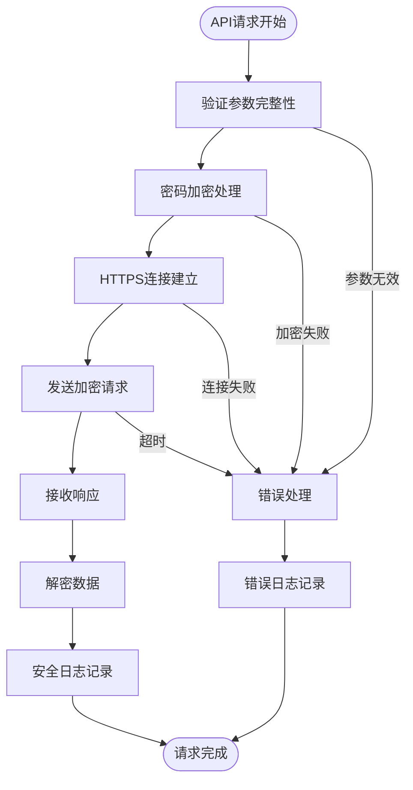
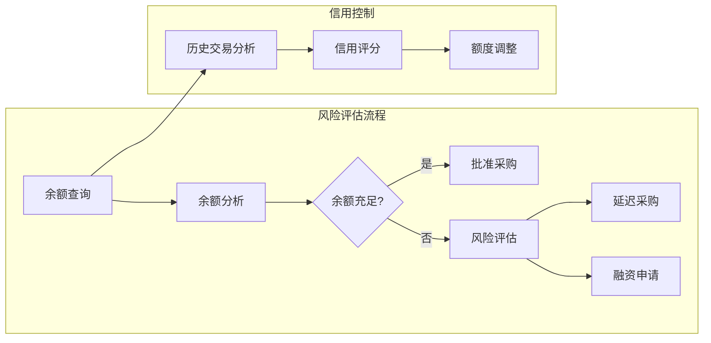
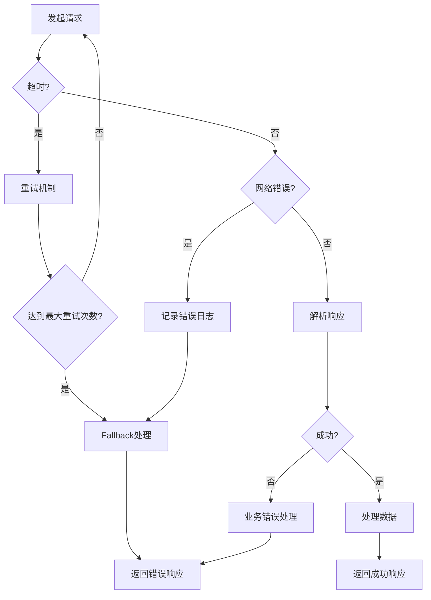
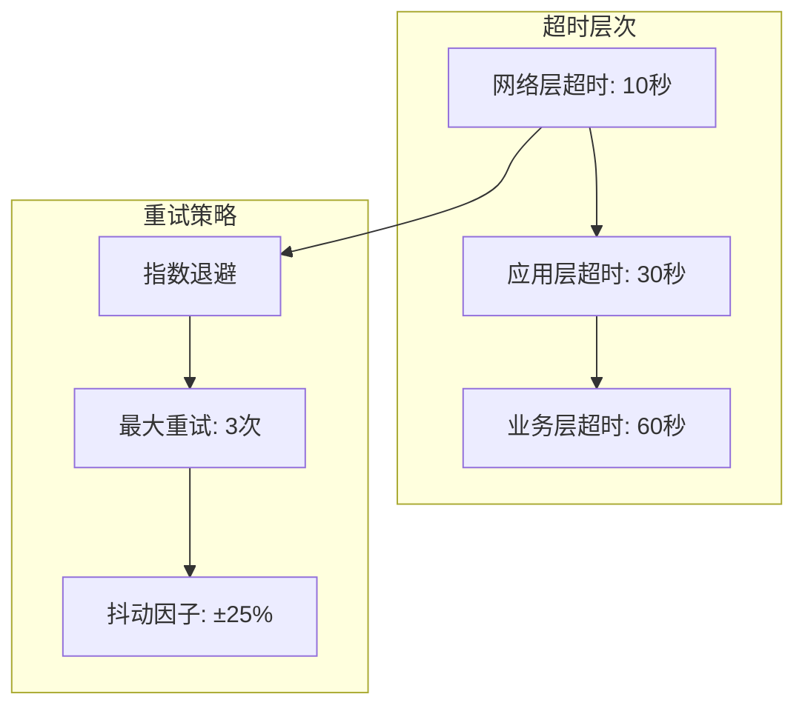
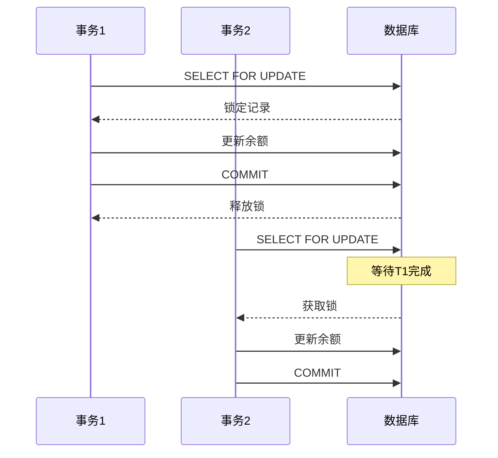

# 账户余额查询功能文档

<cite>
**本文档引用的文件**
- [backend/integrations/haierapi.py](file://backend/integrations/haierapi.py)
- [backend/integrations/models.py](file://backend/integrations/models.py)
- [backend/integrations/views.py](file://backend/integrations/views.py)
- [backend/orders/payment_service.py](file://backend/orders/payment_service.py)
- [backend/orders/services.py](file://backend/orders/services.py)
- [api.md](file://api.md)
- [haier_api.md](file://haier_api.md)
</cite>

## 目录
1. [概述](#概述)
2. [核心功能架构](#核心功能架构)
3. [get_account_balance()方法实现](#get_account_balance方法实现)
4. [HaierConfig配置模型](#haierconfig配置模型)
5. [安全性考虑](#安全性考虑)
6. [业务价值分析](#业务价值分析)
7. [错误处理机制](#错误处理机制)
8. [性能优化](#性能优化)
9. [集成示例](#集成示例)
10. [故障排除指南](#故障排除指南)

## 概述

账户余额查询功能是海尔财务服务API的核心组件之一，通过`get_account_balance()`方法实现付款方账户余额的实时查询。该功能在采购结算和信用控制场景中发挥着关键作用，为商家提供准确的财务信息支持。

### 主要特性

- **实时余额查询**：直接从海尔财务系统获取最新的账户余额信息
- **双重认证机制**：支持customerCode和customerPassword双重验证
- **安全传输**：采用HTTPS协议和加密传输保护敏感信息
- **超时控制**：设置30秒超时防止长时间等待
- **灵活配置**：支持从主密码继承或独立设置customer_password

## 核心功能架构



**图表来源**
- [backend/integrations/views.py](file://backend/integrations/views.py#L104-L327)
- [backend/integrations/haierapi.py](file://backend/integrations/haierapi.py#L10-L214)

## get_account_balance()方法实现

### 方法签名与参数

`get_account_balance()`方法位于`HaierAPI`类中，专门用于查询付款方账户余额：



**图表来源**
- [backend/integrations/haierapi.py](file://backend/integrations/haierapi.py#L168-L185)

### 实现细节

#### 1. 认证检查与令牌管理

方法首先调用`_ensure_authenticated()`确保有效的访问令牌：

- 检查现有令牌的有效性和过期时间
- 自动触发重新认证（如令牌过期）
- 使用B站令牌类型和3600秒的默认过期时间

#### 2. API请求构建

构造标准的RESTful API请求：

- **URL**: `base_url + '/yilihuo/jsh-service-finance-mall/api/page/account/account-balance-manager/get-payer-account-balance-by-customer-code'`
- **请求头**: 包含`Authorization: Bearer <access_token>`和`Content-Type: application/json`
- **请求体**: 
  ```json
  {
    "customerCode": "8800633175",
    "customerPassword": "encrypted_password"
  }
  ```

#### 3. 超时设置与错误处理

- 设置30秒超时防止长时间等待
- 捕获并记录所有异常情况
- 返回标准化的错误响应

**章节来源**
- [backend/integrations/haierapi.py](file://backend/integrations/haierapi.py#L168-L185)

## HaierConfig配置模型

### 配置结构设计

`HaierConfig`模型提供了灵活的配置管理机制：



**图表来源**
- [backend/integrations/models.py](file://backend/integrations/models.py#L4-L47)
- [backend/integrations/haierapi.py](file://backend/integrations/haierapi.py#L10-L25)

### customer_password配置策略

#### 密码继承机制

`customer_password`字段具有智能的默认值处理：

```python
# 来自 haierapi.py 第21行
self.customer_password = config.get('customer_password', self.password)
```

这种设计实现了两种配置策略：

1. **继承主密码**（推荐）：当`customer_password`未设置时，自动使用`password`字段
2. **独立设置**：明确指定不同的密码值以满足特殊安全需求

#### 配置优先级

1. 显式设置的`customer_password`
2. 主密码`password`
3. 空字符串（需要后续配置）

**章节来源**
- [backend/integrations/haierapi.py](file://backend/integrations/haierapi.py#L21)
- [backend/integrations/models.py](file://backend/integrations/models.py#L4-L47)

## 安全性考虑

### 传输安全

#### HTTPS强制要求

所有API通信必须使用HTTPS协议：

- **协议要求**：`SECURE_SSL_REDIRECT=True`（生产环境）
- **证书验证**：自动验证SSL证书有效性
- **加密传输**：敏感信息在传输过程中加密

#### 敏感信息保护



**图表来源**
- [api.md](file://api.md#L534-L858)

### 认证与授权

#### 多层认证机制

1. **OAuth2.0客户端认证**
   - 使用`client_id`和`client_secret`获取访问令牌
   - 支持`client_credentials`授权类型

2. **应用级认证**
   - `customerCode`唯一标识付款方
   - `customerPassword`提供额外的安全验证

3. **会话管理**
   - 令牌有效期：1小时
   - 自动刷新机制：提前10分钟刷新
   - 并发安全：使用数据库行锁

**章节来源**
- [backend/integrations/haierapi.py](file://backend/integrations/haierapi.py#L41-L64)

## 业务价值分析

### 采购结算支持

账户余额查询功能在采购结算流程中发挥关键作用：

#### 1. 预算控制

- **实时余额监控**：及时了解可用资金状况
- **预算预警**：当余额低于阈值时触发警报
- **采购决策支持**：基于余额信息制定采购计划

#### 2. 风险管理



**图表来源**
- [backend/orders/services.py](file://backend/orders/services.py#L123-L216)

### 信用控制机制

#### 动态信用额度

- **基于余额的额度**：根据当前余额动态调整信用额度
- **历史行为分析**：结合付款历史评估信用风险
- **实时监控**：持续跟踪余额变化影响信用状态

#### 防范措施

1. **余额不足预警**：当余额低于设定阈值时通知相关人员
2. **超额交易拦截**：阻止超出信用额度的交易
3. **自动冻结**：余额归零时自动冻结相关功能

**章节来源**
- [backend/orders/services.py](file://backend/orders/services.py#L219-L297)

## 错误处理机制

### 异常分类与处理

#### 1. 认证相关错误

| 错误码 | HTTP状态 | 说明 | 处理策略 |
|--------|---------|------|---------|
| AUTH_FAILED | 401 | 认证失败 | 重新认证，检查凭据 |
| TOKEN_EXPIRED | 401 | 令牌过期 | 自动刷新令牌 |
| INVALID_CREDENTIALS | 401 | 凭证无效 | 提示用户检查输入 |

#### 2. 业务相关错误

| 错误码 | HTTP状态 | 说明 | 处理策略 |
|--------|---------|------|---------|
| BALANCE_QUERY_FAILED | 400 | 余额查询失败 | 重试机制，降级处理 |
| INSUFFICIENT_BALANCE | 400 | 余额不足 | 提示用户充值 |
| SERVICE_UNAVAILABLE | 503 | 服务不可用 | 等待重试 |

#### 3. 网络相关错误



**图表来源**
- [backend/integrations/haierapi.py](file://backend/integrations/haierapi.py#L176-L185)

### 日志记录策略

#### 结构化日志格式

所有错误都会记录详细的日志信息：

```json
{
    "timestamp": "2024-01-15T10:30:00Z",
    "level": "ERROR",
    "service": "haier-api",
    "operation": "get_account_balance",
    "customer_code": "8800633175",
    "error_code": "BALANCE_QUERY_FAILED",
    "error_message": "Failed to query account balance",
    "response_code": 400,
    "response_body": "Invalid customer credentials"
}
```

#### 监控指标

- **成功率**：查询成功的百分比
- **响应时间**：平均响应时间和95%分位数
- **错误分布**：按错误类型的统计分析
- **重试率**：需要重试的请求比例

**章节来源**
- [backend/integrations/haierapi.py](file://backend/integrations/haierapi.py#L179-L180)

## 性能优化

### 超时设置策略

#### 分层超时配置



**图表来源**
- [backend/integrations/haierapi.py](file://backend/integrations/haierapi.py#L48)
- [haier_api.md](file://haier_api.md#L760-L764)

### 缓存机制

#### 余额缓存策略

虽然余额查询本身不直接使用缓存，但可以考虑以下优化：

1. **令牌缓存**：避免频繁的OAuth2.0认证
2. **配置缓存**：减少数据库查询开销
3. **批量查询**：合并多个余额查询请求

#### 缓存配置示例

```python
# 缓存配置（伪代码）
CACHE_TIMEOUT = {
    'haier_access_token': 3300,  # 55分钟（3600-600）
    'haier_config': 3600,        # 1小时
    'haier_balance': 1800        # 30分钟
}
```

### 并发控制

#### 数据库锁机制



**图表来源**
- [backend/orders/services.py](file://backend/orders/services.py#L333-L372)

**章节来源**
- [backend/integrations/haierapi.py](file://backend/integrations/haierapi.py#L48)
- [backend/orders/services.py](file://backend/orders/services.py#L333-L372)

## 集成示例

### 基本使用示例

#### 1. 直接API调用

```python
# 创建API实例
from integrations.haierapi import HaierAPI

# 从配置加载
api = HaierAPI.from_settings()

# 执行余额查询
balance_data = api.get_account_balance()
if balance_data:
    print(f"可用余额: {balance_data.get('payerAccountBalance')}")
else:
    print("余额查询失败")
```

#### 2. 视图层集成

```python
# 在Django视图中使用
from integrations.views import HaierAPIViewSet

@api_view(['GET'])
@permission_classes([IsAuthenticated])
def account_balance(request):
    """获取账户余额"""
    try:
        api = HaierAPIViewSet()._get_haier_api()
        if not api:
            return Response({"error": "API配置错误"}, status=500)
        
        balance = api.get_account_balance()
        return Response({"success": True, "data": balance})
    except Exception as e:
        logger.error(f"余额查询失败: {str(e)}")
        return Response({"error": str(e)}, status=400)
```

### 前端集成示例

#### React Hook封装

```typescript
// hooks/useHaierBalance.ts
import { useState, useEffect } from 'react';

interface BalanceResponse {
    success: boolean;
    data?: {
        payerAccountBalance: number;
        payerAccountName: string;
        saleGroupCode: string;
    };
    error?: string;
}

export function useHaierBalance() {
    const [balance, setBalance] = useState<number | null>(null);
    const [loading, setLoading] = useState(true);
    const [error, setError] = useState<string | null>(null);

    useEffect(() => {
        async function fetchBalance() {
            try {
                const response = await fetch('/api/haier/balance/');
                const data: BalanceResponse = await response.json();
                
                if (data.success && data.data) {
                    setBalance(data.data.payerAccountBalance);
                } else {
                    setError(data.error || '余额查询失败');
                }
            } catch (err) {
                setError('网络错误，请重试');
            } finally {
                setLoading(false);
            }
        }

        fetchBalance();
    }, []);

    return { balance, loading, error };
}
```

**章节来源**
- [backend/integrations/views.py](file://backend/integrations/views.py#L242-L264)
- [backend/integrations/haierapi.py](file://backend/integrations/haierapi.py#L188-L214)

## 故障排除指南

### 常见问题诊断

#### 1. 认证失败

**症状**：返回401状态码或认证错误

**诊断步骤**：
```python
# 检查配置
print(f"Client ID: {api.client_id}")
print(f"Customer Code: {api.customer_code}")
print(f"Access Token: {api.access_token}")

# 测试认证
if not api.authenticate():
    print("认证失败，请检查配置")
```

**解决方案**：
- 验证`HAIER_CLIENT_ID`和`HAIER_CLIENT_SECRET`
- 确认`HAIER_CUSTOMER_CODE`正确无误
- 检查网络连接和防火墙设置

#### 2. 余额查询超时

**症状**：请求超过30秒无响应

**诊断工具**：
```python
import time

start_time = time.time()
try:
    balance = api.get_account_balance()
    elapsed = time.time() - start_time
    print(f"查询耗时: {elapsed:.2f}秒")
except Exception as e:
    print(f"查询失败: {e}")
```

**优化建议**：
- 检查网络延迟
- 考虑增加超时时间
- 实现重试机制

#### 3. 数据格式错误

**症状**：返回的数据格式不符合预期

**调试输出**：
```python
balance = api.get_account_balance()
print(f"返回类型: {type(balance)}")
print(f"返回内容: {balance}")
```

**验证要点**：
- 确认返回的是字典格式
- 检查必需字段是否存在
- 验证数据类型正确性

### 监控与告警

#### 关键指标监控

```python
# 监控脚本示例
import logging
from integrations.haierapi import HaierAPI

def monitor_balance_query():
    """监控余额查询功能"""
    api = HaierAPI.from_settings()
    
    try:
        start_time = time.time()
        balance = api.get_account_balance()
        response_time = time.time() - start_time
        
        # 记录指标
        metrics.record_response_time(response_time)
        
        if balance:
            metrics.record_success()
            logger.info(f"余额查询成功，响应时间: {response_time:.2f}s")
        else:
            metrics.record_failure("empty_response")
            logger.error("余额查询返回空数据")
            
    except Exception as e:
        metrics.record_failure("exception")
        logger.error(f"余额查询异常: {e}")
```

#### 告警配置

| 指标 | 阈值 | 告警级别 | 处理动作 |
|------|------|----------|----------|
| 响应时间 | >30秒 | 警告 | 检查网络和服务状态 |
| 失败率 | >5% | 严重 | 立即通知运维团队 |
| 余额查询失败 | 连续3次 | 紧急 | 自动重启服务 |

**章节来源**
- [backend/integrations/haierapi.py](file://backend/integrations/haierapi.py#L41-L64)
- [backend/integrations/views.py](file://backend/integrations/views.py#L242-L264)

## 总结

账户余额查询功能通过`get_account_balance()`方法实现了与海尔财务服务API的无缝集成，为企业提供了可靠的财务信息查询能力。该功能不仅支持日常的采购结算需求，还在信用控制和风险管理方面发挥重要作用。

### 核心优势

1. **安全性**：多重认证机制和加密传输确保数据安全
2. **可靠性**：完善的错误处理和重试机制
3. **灵活性**：支持多种配置策略满足不同安全需求
4. **性能**：合理的超时设置和并发控制

### 最佳实践建议

1. **定期监控**：建立完善的监控体系跟踪服务健康状态
2. **缓存策略**：合理使用缓存减少API调用频率
3. **错误处理**：实现优雅的降级机制保证系统稳定性
4. **安全审计**：定期审查配置和访问日志确保安全合规

通过遵循本文档的指导原则和最佳实践，可以充分发挥账户余额查询功能的价值，为企业财务管理提供强有力的技术支撑。