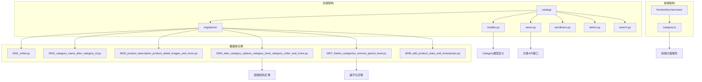
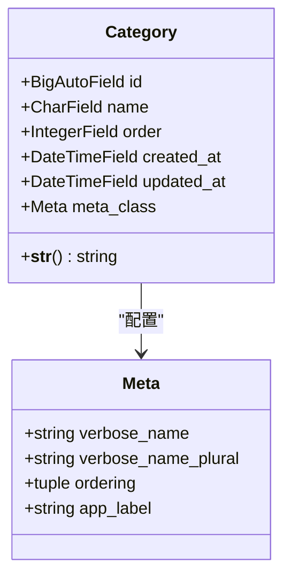
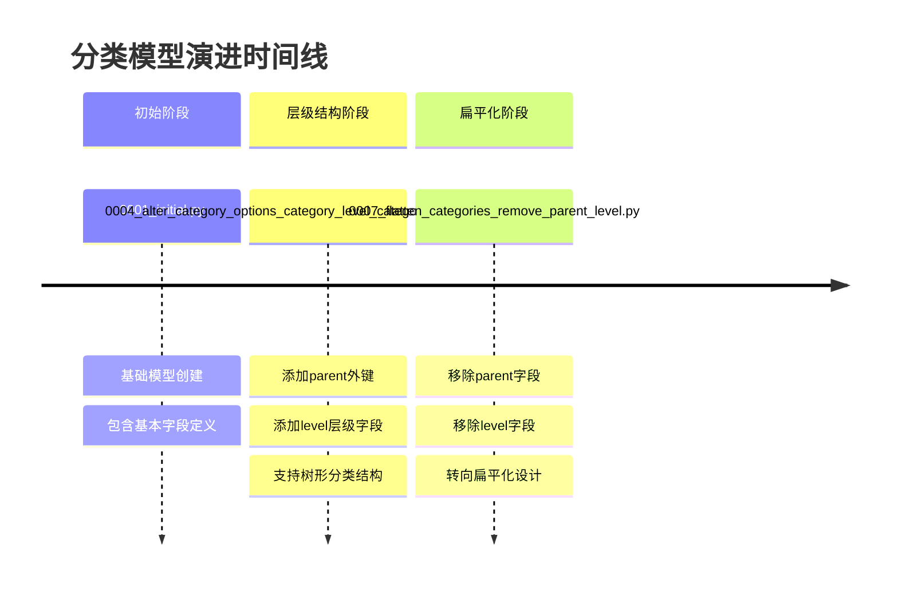
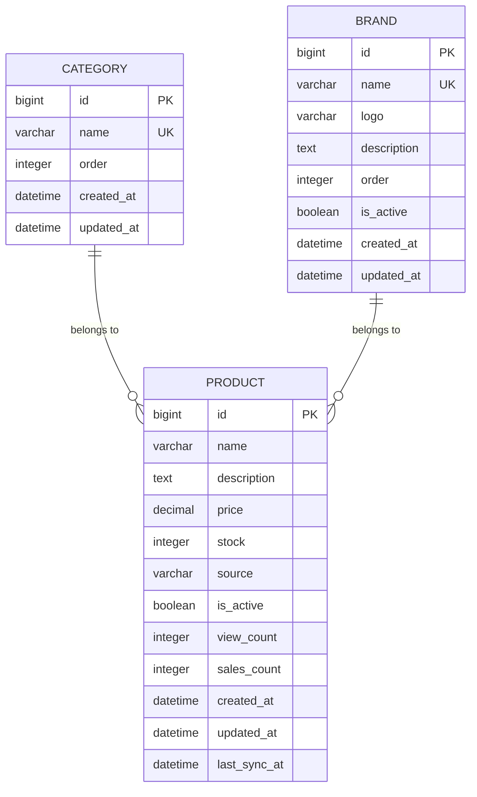
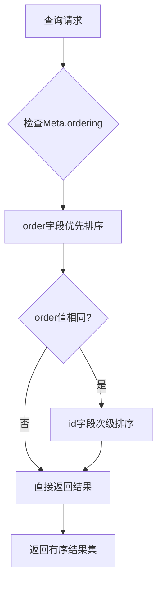
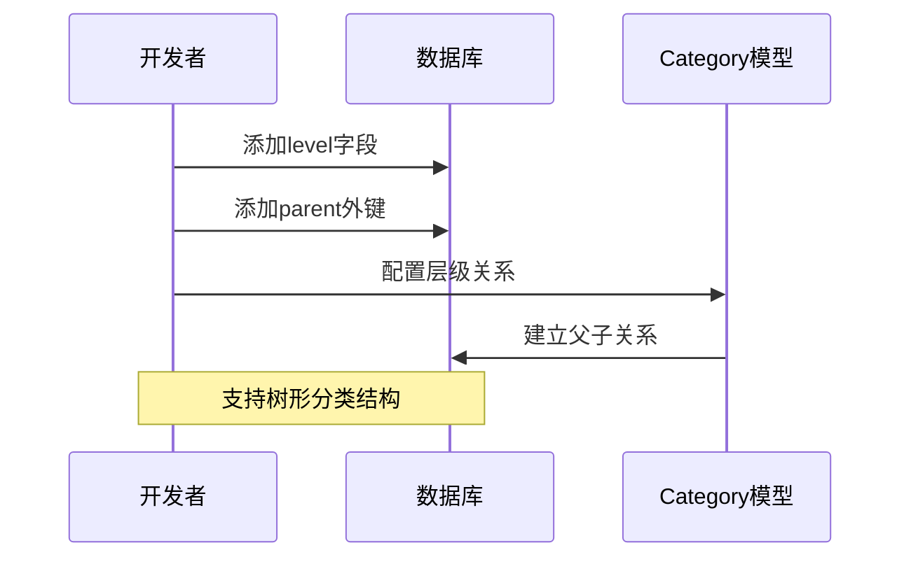
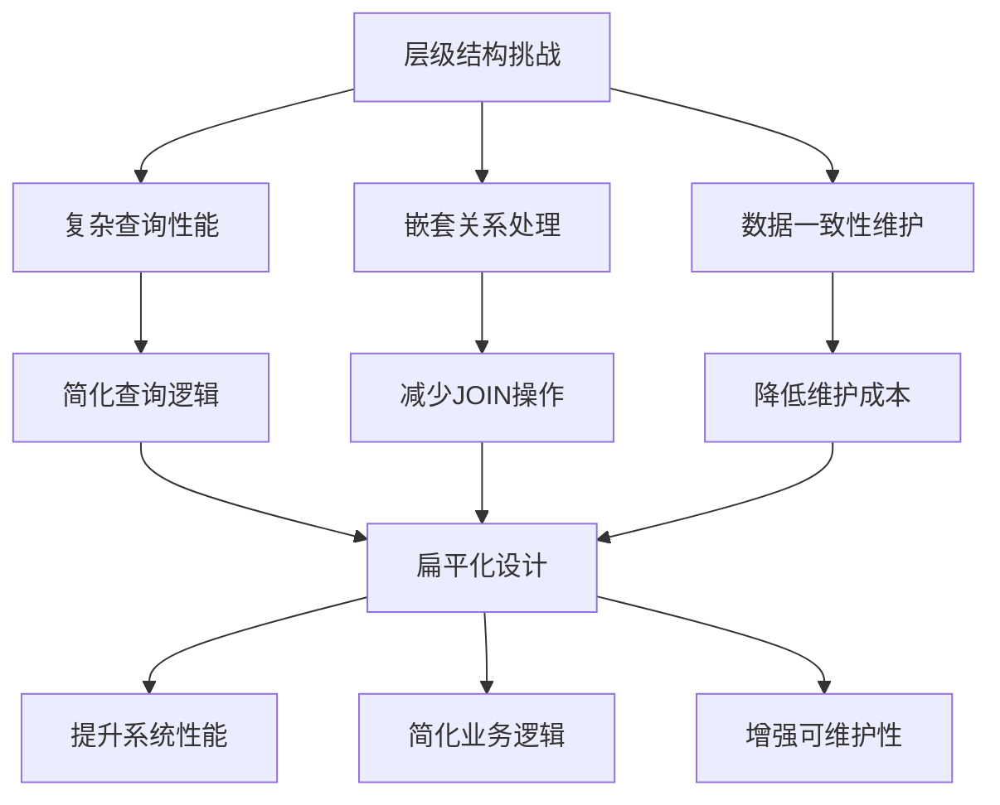
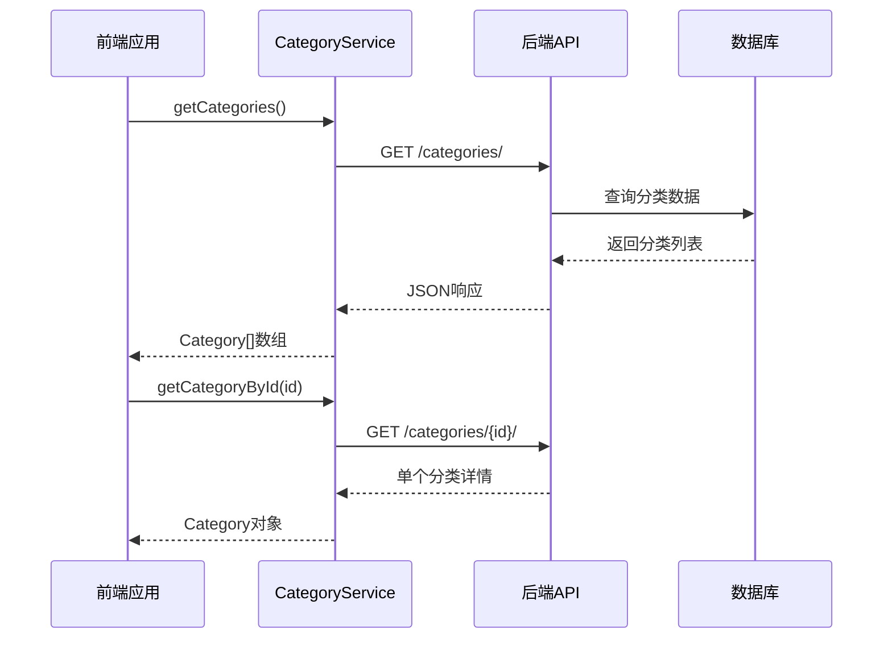
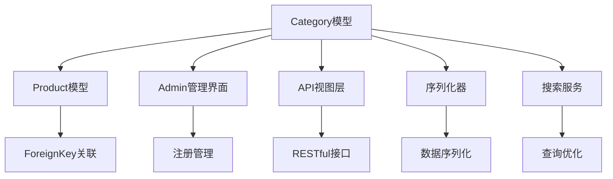

# 分类模型

<cite>
**本文档引用的文件**
- [models.py](file://backend/catalog/models.py)
- [admin.py](file://backend/catalog/admin.py)
- [views.py](file://backend/catalog/views.py)
- [serializers.py](file://backend/catalog/serializers.py)
- [category.ts](file://frontend/src/services/category.ts)
- [0001_initial.py](file://backend/catalog/migrations/0001_initial.py)
- [0002_category_name_alter_category_id.py](file://backend/catalog/migrations/0002_category_name_alter_category_id.py)
- [0003_product_description_product_detail_images_and_more.py](file://backend/catalog/migrations/0003_product_description_product_detail_images_and_more.py)
- [0004_alter_category_options_category_level_category_order_and_more.py](file://backend/catalog/migrations/0004_alter_category_options_category_level_category_order_and_more.py)
- [0007_flatten_categories_remove_parent_level.py](file://backend/catalog/migrations/0007_flatten_categories_remove_parent_level.py)
- [0008_add_product_stats_and_timestamps.py](file://backend/catalog/migrations/0008_add_product_stats_and_timestamps.py)
- [search.py](file://backend/catalog/search.py)
</cite>

## 目录
1. [简介](#简介)
2. [项目结构](#项目结构)
3. [核心组件](#核心组件)
4. [架构概览](#架构概览)
5. [详细组件分析](#详细组件分析)
6. [依赖关系分析](#依赖关系分析)
7. [性能考虑](#性能考虑)
8. [故障排除指南](#故障排除指南)
9. [结论](#结论)

## 简介

分类模型（Category Model）是电商品台系统中的核心数据模型之一，负责管理商品的分类体系。该模型经历了从层级结构到扁平化设计的重要演进过程，体现了系统架构设计的优化思路。本文档将深入分析Category模型的核心属性、演进历程、技术决策及其在系统中的应用。

## 项目结构

电商品台的分类模型主要分布在以下目录结构中：



**图表来源**
- [models.py](file://backend/catalog/models.py#L1-L312)
- [views.py](file://backend/catalog/views.py#L1-L980)
- [category.ts](file://frontend/src/services/category.ts#L1-L16)

**章节来源**
- [models.py](file://backend/catalog/models.py#L1-L312)
- [admin.py](file://backend/catalog/admin.py#L1-L27)

## 核心组件

### Category模型核心属性

Category模型包含以下关键属性：

| 字段名 | 类型 | 默认值 | 业务含义 | 数据库约束 |
|--------|------|--------|----------|------------|
| id | BigAutoField | - | 主键标识符 | 自增，主键 |
| name | CharField | '默认分类' | 分类名称 | 长度100，唯一 |
| order | IntegerField | 0 | 排序权重 | 整数，用于排序 |
| created_at | DateTimeField | auto_now_add | 创建时间 | 自动设置，只读 |
| updated_at | DateTimeField | auto_now | 更新时间 | 自动更新，只读 |

### 模型元信息配置



**图表来源**
- [models.py](file://backend/catalog/models.py#L5-L18)

**章节来源**
- [models.py](file://backend/catalog/models.py#L5-L18)

## 架构概览

### 分类模型演进历程

分类模型经历了三个重要阶段的演进：



**图表来源**
- [0001_initial.py](file://backend/catalog/migrations/0001_initial.py#L1-L40)
- [0004_alter_category_options_category_level_category_order_and_more.py](file://backend/catalog/migrations/0004_alter_category_options_category_level_category_order_and_more.py#L1-L44)
- [0007_flatten_categories_remove_parent_level.py](file://backend/catalog/migrations/0007_flatten_categories_remove_parent_level.py#L1-L19)

### 分类与商品关联关系



**图表来源**
- [models.py](file://backend/catalog/models.py#L43-L116)

**章节来源**
- [models.py](file://backend/catalog/models.py#L43-L116)

## 详细组件分析

### 字段业务含义深度解析

#### name字段 - 分类标识核心
- **业务含义**: 商品分类的唯一标识，用于前端展示和用户识别
- **技术特性**: 长度限制100字符，确保命名规范性；设置unique=True保证分类名称唯一性
- **默认值**: '默认分类'，为新分类提供初始名称
- **应用场景**: 分类筛选、商品归类、前端导航展示

#### order字段 - 排序控制机制
- **业务含义**: 控制分类在前端展示顺序的权重值
- **技术实现**: IntegerField，默认值为0，支持正负整数
- **排序逻辑**: Meta.ordering配置为['order', 'id']，优先按order排序，相同order时按id排序
- **应用价值**: 实现灵活的分类展示顺序控制，支持动态调整

#### 时间戳字段 - 数据生命周期管理
- **created_at**: 自动记录创建时间，auto_now_add=True确保只在创建时设置
- **updated_at**: 自动记录更新时间，auto_now=True确保每次保存时更新
- **业务价值**: 支持数据版本控制、审计追踪、性能优化

### 分类排序逻辑与数据库索引

#### Meta.ordering配置分析



**图表来源**
- [models.py](file://backend/catalog/models.py#L15)

#### 数据库索引配置

| 索引类型 | 字段组合 | 性能收益 | 应用场景 |
|----------|----------|----------|----------|
| 主键索引 | id | 唯一标识查询 | 基础CRUD操作 |
| 唯一索引 | name | 分类名称查询 | 唯一性验证 |
| 排序索引 | order, id | 分类列表查询 | 分页排序显示 |
| 时间索引 | created_at | 时间范围查询 | 数据统计分析 |

**章节来源**
- [models.py](file://backend/catalog/models.py#L12-L18)

### 迁移历史与技术决策

#### 0004层級结构迁移分析

该迁移实现了从扁平结构到层级结构的转变：



**图表来源**
- [0004_alter_category_options_category_level_category_order_and_more.py](file://backend/catalog/migrations/0004_alter_category_options_category_level_category_order_and_more.py#L18-L32)

#### 0007扁平化迁移决策

扁平化迁移的核心技术决策：



**图表来源**
- [0007_flatten_categories_remove_parent_level.py](file://backend/catalog/migrations/0007_flatten_categories_remove_parent_level.py#L11-L18)

**章节来源**
- [0004_alter_category_options_category_level_category_order_and_more.py](file://backend/catalog/migrations/0004_alter_category_options_category_level_category_order_and_more.py#L1-L44)
- [0007_flatten_categories_remove_parent_level.py](file://backend/catalog/migrations/0007_flatten_categories_remove_parent_level.py#L1-L19)

### ORM操作示例与最佳实践

#### 典型查询模式

```mermaid
flowchart LR
A[分类查询] --> B[按名称查找]
A --> C[按排序获取]
A --> D[批量查询]
B --> E[Category.objects.get(name='家电')]
C --> F[Category.objects.all().order_by('order')]
D --> G[Category.objects.filter(id__in=[1,2,3])]
```

#### 分类管理典型操作

| 操作类型 | ORM方法 | 查询条件 | 性能特点 |
|----------|---------|----------|----------|
| 单个分类获取 | get() | name唯一值 | 快速定位，唯一约束 |
| 分类列表获取 | all() | 无过滤条件 | 支持排序，分页友好 |
| 条件查询 | filter() | 多字段组合 | 索引优化，性能稳定 |
| 排序查询 | order_by() | order字段 | 数据库层面排序 |

**章节来源**
- [views.py](file://backend/catalog/views.py#L202-L243)
- [search.py](file://backend/catalog/search.py#L112)

### 前端分类服务集成

#### 前端服务接口设计



**图表来源**
- [category.ts](file://frontend/src/services/category.ts#L6-L14)

**章节来源**
- [category.ts](file://frontend/src/services/category.ts#L1-L16)

## 依赖关系分析

### 模型间依赖关系



**图表来源**
- [models.py](file://backend/catalog/models.py#L47)
- [admin.py](file://backend/catalog/admin.py#L5)
- [views.py](file://backend/catalog/views.py#L202-L243)

### 外部依赖分析

| 依赖类型 | 组件名称 | 版本要求 | 功能作用 |
|----------|----------|----------|----------|
| Django框架 | django.db.models | >=5.2.7 | ORM功能支持 |
| 前端框架 | React/Taro | 最新版 | 小程序前端渲染 |
| 数据库 | PostgreSQL/MySQL | 通用版本 | 数据持久化 |
| API工具 | Django REST Framework | 最新版 | RESTful API构建 |

**章节来源**
- [models.py](file://backend/catalog/models.py#L1-L3)
- [category.ts](file://frontend/src/services/category.ts#L1)

## 性能考虑

### 查询性能优化策略

1. **索引优化**: 在order字段建立复合索引，支持高效排序查询
2. **缓存策略**: 利用Django缓存机制减少数据库访问频率
3. **分页处理**: 对大量分类数据实施分页查询，避免内存溢出
4. **批量操作**: 支持批量查询和更新操作，提高效率

### 内存使用优化

- **惰性加载**: 使用QuerySet的惰性特性，仅在需要时执行数据库查询
- **字段选择**: 通过only()和defer()方法控制查询字段，减少内存占用
- **连接池**: 配置数据库连接池，提高并发处理能力

## 故障排除指南

### 常见问题与解决方案

#### 分类查询性能问题

**问题描述**: 分类列表查询响应缓慢

**排查步骤**:
1. 检查数据库索引是否正确创建
2. 分析查询执行计划，确认索引使用情况
3. 检查是否有大量并发查询导致锁竞争

**解决方案**:
- 确保order字段有适当的索引
- 实施查询缓存机制
- 优化查询条件，避免全表扫描

#### 分类层级显示异常

**问题描述**: 分类层级结构显示错误

**排查步骤**:
1. 检查parent字段数据完整性
2. 验证层级计算逻辑
3. 确认前端渲染逻辑

**解决方案**:
- 执行数据清理和修复脚本
- 重新生成分类层级关系
- 更新前端渲染逻辑

**章节来源**
- [0004_alter_category_options_category_level_category_order_and_more.py](file://backend/catalog/migrations/0004_alter_category_options_category_level_category_order_and_more.py#L14-L16)
- [0007_flatten_categories_remove_parent_level.py](file://backend/catalog/migrations/0007_flatten_categories_remove_parent_level.py#L11-L18)

## 结论

分类模型（Category Model）作为电商品台的核心数据模型，展现了从复杂层级结构到简洁扁平化设计的演进历程。这一演进反映了系统架构设计中对性能、可维护性和用户体验的综合考量。

### 关键技术成就

1. **演进路径清晰**: 从基础模型到层级结构，再到扁平化设计，每一步都有明确的技术目标
2. **性能持续优化**: 通过合理的索引设计和查询优化，确保大规模数据下的良好性能
3. **前后端协同**: 完善的API设计和前端服务集成，提供了良好的开发体验
4. **扩展性强**: 扁平化设计为未来的功能扩展奠定了坚实基础

### 最佳实践总结

- **字段设计**: 合理的字段类型选择和约束设置
- **索引策略**: 针对查询模式的优化索引配置
- **迁移管理**: 渐进式的架构演进，最小化风险
- **测试覆盖**: 完善的单元测试和集成测试保障

分类模型的成功实践为整个电商品台系统的数据建模提供了宝贵经验，其设计理念和实现方式值得在类似项目中借鉴和应用。