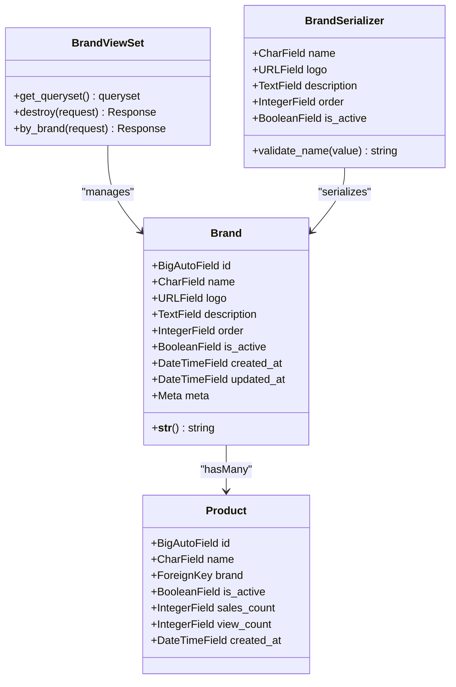
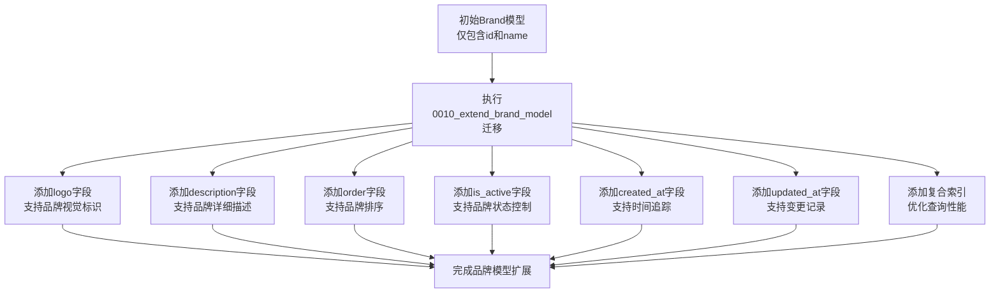
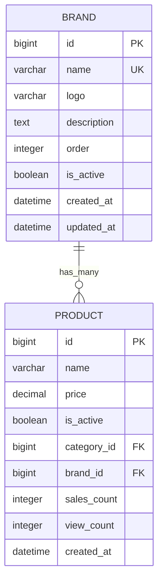
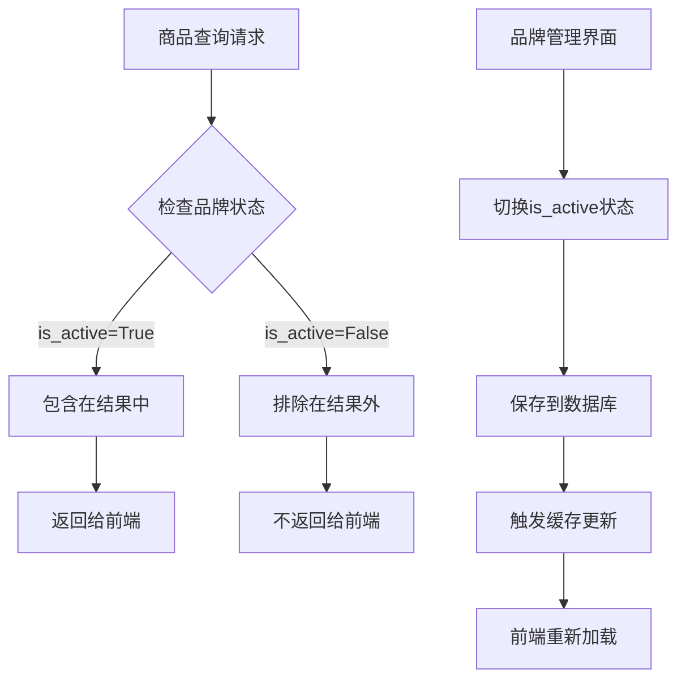
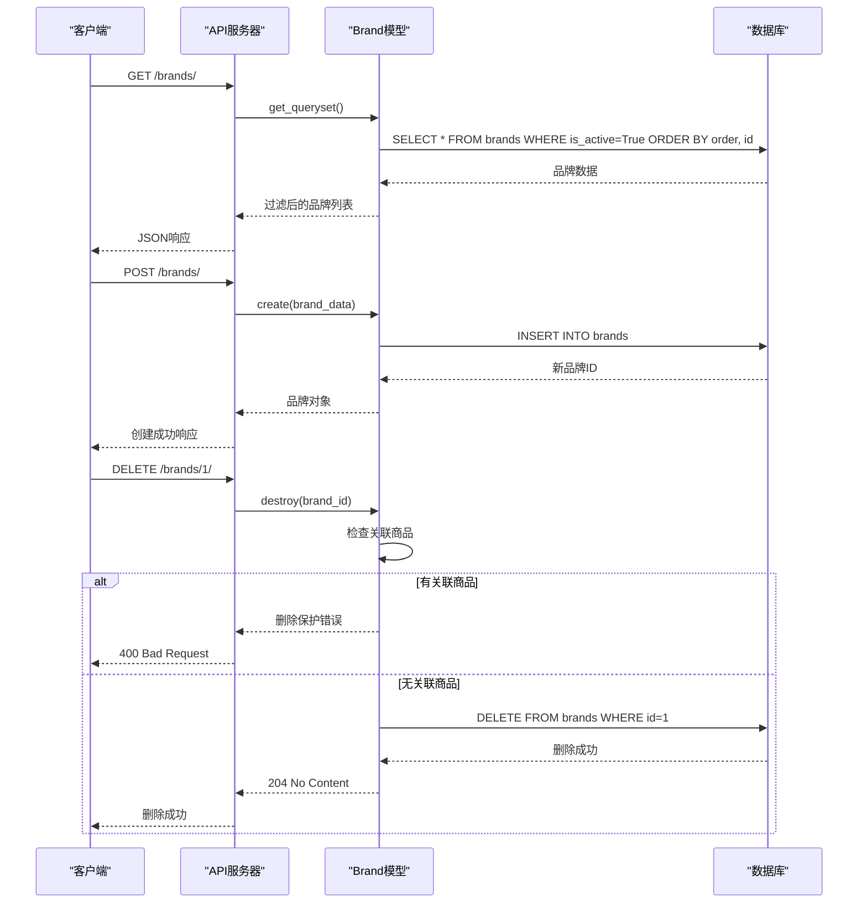
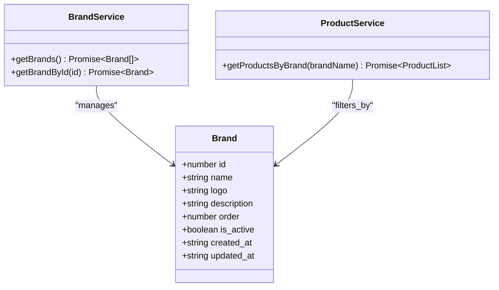
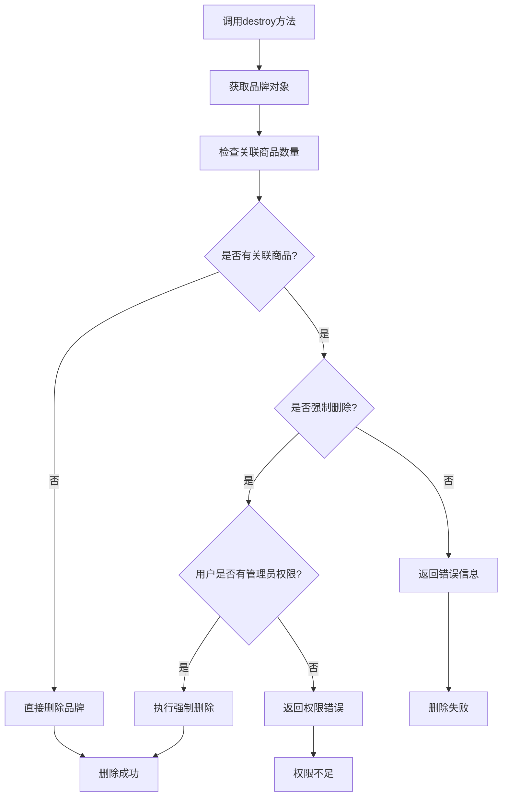
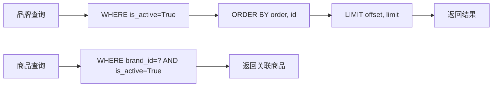

# 品牌模型

<cite>
**本文档中引用的文件**
- [models.py](file://backend/catalog/models.py)
- [0010_extend_brand_model.py](file://backend/catalog/migrations/0010_extend_brand_model.py)
- [views.py](file://backend/catalog/views.py)
- [serializers.py](file://backend/catalog/serializers.py)
- [admin.py](file://backend/catalog/admin.py)
- [urls.py](file://backend/catalog/urls.py)
- [brand.ts](file://frontend/src/services/brand.ts)
- [index.tsx](file://frontend/src/pages/brand/index.tsx)
- [index.ts](file://frontend/src/types/index.ts)
- [api.ts](file://merchant/src/services/api.ts)
- [index.tsx](file://merchant/src/pages/Brands/index.tsx)
</cite>

## 目录
1. [简介](#简介)
2. [模型结构](#模型结构)
3. [字段详解](#字段详解)
4. [迁移历史](#迁移历史)
5. [数据库索引](#数据库索引)
6. [品牌与商品关系](#品牌与商品关系)
7. [品牌状态管理](#品牌状态管理)
8. [API接口设计](#api接口设计)
9. [前端集成](#前端集成)
10. [删除保护机制](#删除保护机制)
11. [性能优化](#性能优化)
12. [最佳实践](#最佳实践)

## 简介

Brand模型是电小二商城系统中的核心业务模型之一，负责管理商品品牌的完整信息。该模型不仅包含品牌的基本属性，还提供了品牌状态控制、排序功能以及与商品的关联关系管理。通过精心设计的字段结构和约束机制，确保了品牌数据的一致性和系统的稳定性。

## 模型结构



**图表来源**
- [models.py](file://backend/catalog/models.py#L21-L40)
- [views.py](file://backend/catalog/views.py#L589-L674)
- [serializers.py](file://backend/catalog/serializers.py#L22-L47)

**章节来源**
- [models.py](file://backend/catalog/models.py#L21-L40)
- [serializers.py](file://backend/catalog/serializers.py#L22-L47)

## 字段详解

### 核心字段

#### name（品牌名称）
- **类型**: `CharField(max_length=100, unique=True)`
- **用途**: 品牌的唯一标识名称
- **验证**: 必填字段，不能为空或仅包含空白字符
- **业务意义**: 作为品牌的主要识别标识，在商品分类和搜索中发挥关键作用

#### logo（品牌Logo）
- **类型**: `URLField(max_length=500, blank=True, default='')`
- **用途**: 品牌的视觉标识，存储图片URL地址
- **长度限制**: 最大500字符的URL
- **业务意义**: 支持品牌展示和用户识别，可为空但推荐设置

#### description（品牌描述）
- **类型**: `TextField(blank=True, default='')`
- **用途**: 品牌的详细介绍和说明
- **业务意义**: 提供品牌背景信息，支持SEO优化和用户体验提升

### 排序与状态字段

#### order（排序）
- **类型**: `IntegerField(default=0)`
- **用途**: 控制品牌在列表中的显示顺序
- **排序规则**: 与`created_at`字段配合使用，实现多维度排序
- **业务意义**: 允许管理员自定义品牌展示顺序，支持营销策略

#### is_active（启用状态）
- **类型**: `BooleanField(default=True)`
- **用途**: 控制品牌是否在前台展示
- **过滤作用**: 在商品展示时自动过滤掉未启用的品牌
- **业务意义**: 提供灵活的品牌状态管理，支持临时下线和维护

### 时间戳字段

#### created_at（创建时间）
- **类型**: `DateTimeField(auto_now_add=True, null=True, blank=True)`
- **用途**: 记录品牌创建的时间戳
- **自动设置**: 创建时自动设置当前时间

#### updated_at（更新时间）
- **类型**: `DateTimeField(auto_now=True, null=True, blank=True)`
- **用途**: 记录品牌最后更新的时间戳
- **自动更新**: 每次保存时自动更新为当前时间

**章节来源**
- [models.py](file://backend/catalog/models.py#L21-L40)

## 迁移历史

### 0010_extend_brand_model迁移

该迁移是品牌模型的重要演进节点，从基础模型扩展为完整的业务模型：



**图表来源**
- [0010_extend_brand_model.py](file://backend/catalog/migrations/0010_extend_brand_model.py#L13-L51)

### 迁移背景

该迁移的主要目的是：
1. **增强品牌展示能力**: 添加logo和description字段支持品牌视觉和文字介绍
2. **提升管理灵活性**: 引入order和is_active字段支持品牌管理和状态控制
3. **完善数据追踪**: 添加时间戳字段支持审计和变更追踪
4. **优化查询性能**: 添加复合索引支持高效的查询操作

**章节来源**
- [0010_extend_brand_model.py](file://backend/catalog/migrations/0010_extend_brand_model.py#L1-L52)

## 数据库索引

### 复合索引设计

```mermaid
erDiagram
BRAND {
bigint id PK
varchar name UK
varchar logo
text description
integer order
boolean is_active
datetime created_at
datetime updated_at
}
BRAND_INDEXES {
index_name "catalog_bra_is_acti_817f78_idx"
fields "is_active, order"
type "BTREE"
}
BRAND ||--|| BRAND_INDEXES : "has_index"
```

**图表来源**
- [models.py](file://backend/catalog/models.py#L35-L37)
- [0010_extend_brand_model.py](file://backend/catalog/migrations/0010_extend_brand_model.py#L47-L51)

### 索引优化策略

#### 主要索引
- **复合索引**: `is_active, order`
- **字段组合**: `(is_active, order)`
- **用途**: 优化品牌列表查询和排序操作
- **查询场景**: 前台展示时按启用状态和排序字段查询

#### 排序规则
- **主排序**: `is_active`（启用状态优先）
- **次排序**: `order`（数字越小越靠前）
- **第三排序**: `id`（保证唯一性）

**章节来源**
- [models.py](file://backend/catalog/models.py#L35-L37)

## 品牌与商品关系

### 外键关联设计



**图表来源**
- [models.py](file://backend/catalog/models.py#L43-L49)

### 关联关系特性

#### CASCADE删除保护
- **删除策略**: `on_delete=models.CASCADE`
- **影响范围**: 当品牌被删除时，所有关联商品也会被级联删除
- **业务意义**: 确保数据一致性，避免孤立商品的存在

#### 反向查询
- **访问方式**: `brand.products.all()` 或 `brand.products.filter(...)`
- **应用场景**: 查找品牌下的所有商品，支持批量操作

**章节来源**
- [models.py](file://backend/catalog/models.py#L43-L49)

## 品牌状态管理

### is_active字段的作用

#### 商品展示过滤


**图表来源**
- [views.py](file://backend/catalog/views.py#L290-L293)
- [search.py](file://backend/catalog/search.py#L98)

#### 状态控制机制
- **默认值**: `True`（启用状态）
- **过滤条件**: 自动应用于所有涉及品牌的查询
- **管理方式**: 通过管理界面或API进行状态切换

**章节来源**
- [views.py](file://backend/catalog/views.py#L290-L293)
- [search.py](file://backend/catalog/search.py#L98)

## API接口设计

### RESTful API架构



**图表来源**
- [views.py](file://backend/catalog/views.py#L589-L674)
- [urls.py](file://backend/catalog/urls.py#L6-L9)

### 主要API端点

#### 品牌列表接口
- **端点**: `GET /brands/`
- **功能**: 获取品牌列表，支持搜索和分页
- **参数**: `search`（品牌名称搜索）、`page`（页码）、`page_size`（每页数量）

#### 品牌详情接口
- **端点**: `GET /brands/{id}/`
- **功能**: 获取指定品牌详情
- **响应**: 包含品牌所有字段的完整信息

#### 品牌管理接口
- **创建**: `POST /brands/`
- **更新**: `PATCH /brands/{id}/`
- **删除**: `DELETE /brands/{id}/`

**章节来源**
- [views.py](file://backend/catalog/views.py#L589-L674)
- [urls.py](file://backend/catalog/urls.py#L6-L9)

## 前端集成

### 品牌服务层



**图表来源**
- [brand.ts](file://frontend/src/services/brand.ts#L4-L15)
- [index.ts](file://frontend/src/types/index.ts#L58-L66)

### 品牌页面集成

#### 品牌详情页面
- **路由**: `/brand/:brand`
- **功能**: 展示特定品牌的商品列表
- **数据流**: 通过品牌名称查询商品，支持分页加载

#### 品牌管理界面
- **组件**: `Brands` 页面
- **功能**: 品牌的CRUD操作
- **交互**: 支持强制删除、状态切换等高级功能

**章节来源**
- [brand.ts](file://frontend/src/services/brand.ts#L4-L15)
- [index.tsx](file://frontend/src/pages/brand/index.tsx#L1-L79)

## 删除保护机制

### 销毁方法实现



**图表来源**
- [views.py](file://backend/catalog/views.py#L634-L674)

### 保护机制特性

#### 自动检测
- **关联检查**: 自动统计品牌关联的商品数量
- **状态提示**: 明确告知用户关联的商品数量

#### 权限控制
- **强制删除权限**: 仅管理员用户可执行强制删除
- **安全验证**: 验证用户权限，防止误操作

#### 用户体验
- **友好提示**: 提供清晰的操作建议
- **确认机制**: 对于强制删除提供二次确认

**章节来源**
- [views.py](file://backend/catalog/views.py#L634-L674)
- [index.tsx](file://merchant/src/pages/Brands/index.tsx#L13-L33)

## 性能优化

### 查询优化策略

#### 索引利用
- **复合索引**: `is_active, order` 优化品牌列表查询
- **选择性过滤**: 利用 `is_active` 字段减少扫描数据量
- **排序优化**: 索引支持多字段排序，避免额外排序操作

#### 查询模式


**图表来源**
- [models.py](file://backend/catalog/models.py#L34-L37)
- [views.py](file://backend/catalog/views.py#L290-L293)

### 缓存策略
- **品牌列表缓存**: 缓存常用的品牌列表数据
- **状态缓存**: 缓存品牌启用状态信息
- **关联计数缓存**: 缓存品牌关联商品数量

**章节来源**
- [models.py](file://backend/catalog/models.py#L34-L37)

## 最佳实践

### 开发建议

#### 字段使用规范
1. **品牌名称**: 使用唯一且有意义的品牌名称
2. **Logo地址**: 使用可靠的CDN服务存储品牌Logo
3. **描述内容**: 提供准确的品牌介绍信息
4. **排序设置**: 合理设置order值以优化展示效果

#### 状态管理
1. **启用状态**: 正常运营的品牌应保持 `is_active=True`
2. **停用处理**: 不再经营的品牌应及时设置为停用状态
3. **删除准备**: 删除品牌前确保无关联商品或已妥善处理

#### 性能考虑
1. **批量操作**: 对大量品牌进行批量状态修改
2. **索引利用**: 充分利用数据库索引提高查询效率
3. **缓存策略**: 合理使用缓存减少数据库压力

### 维护指南

#### 定期检查
- **关联清理**: 定期检查并清理无效的品牌关联
- **状态审核**: 定期审核品牌启用状态的合理性
- **数据质量**: 确保品牌数据的完整性和准确性

#### 监控指标
- **品牌数量**: 监控品牌总数变化趋势
- **关联商品**: 跟踪品牌关联商品的数量分布
- **查询性能**: 监控品牌相关查询的响应时间

**章节来源**
- [views.py](file://backend/catalog/views.py#L589-L674)
- [serializers.py](file://backend/catalog/serializers.py#L22-L47)