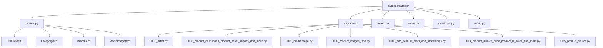
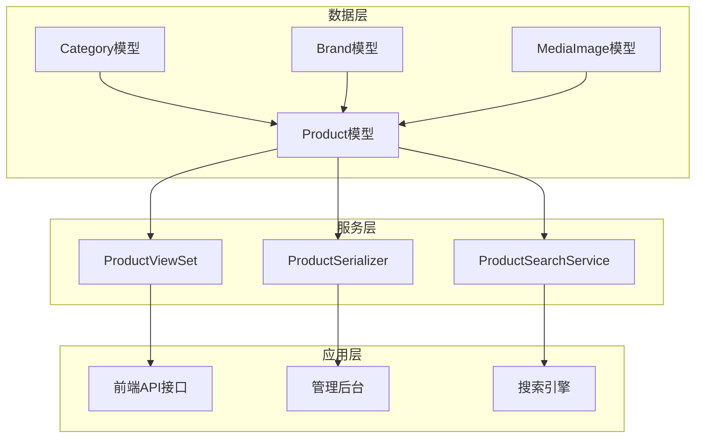
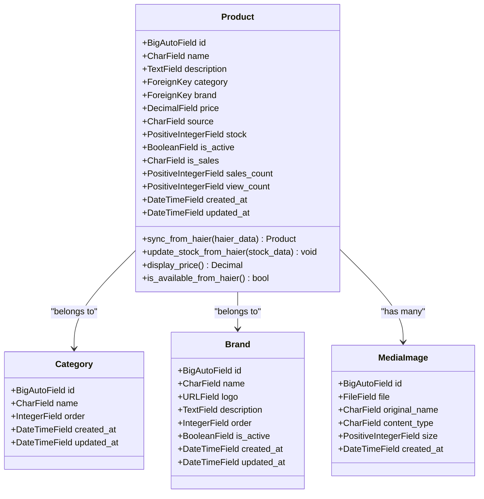
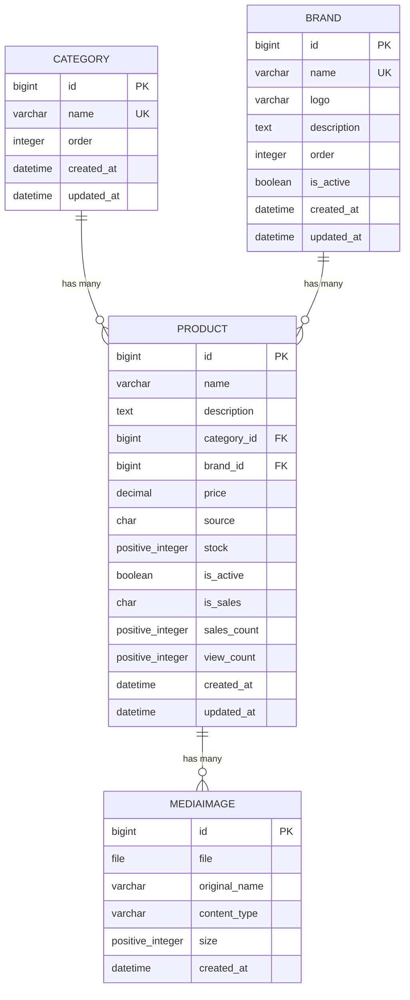
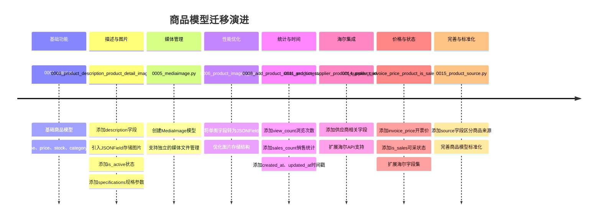
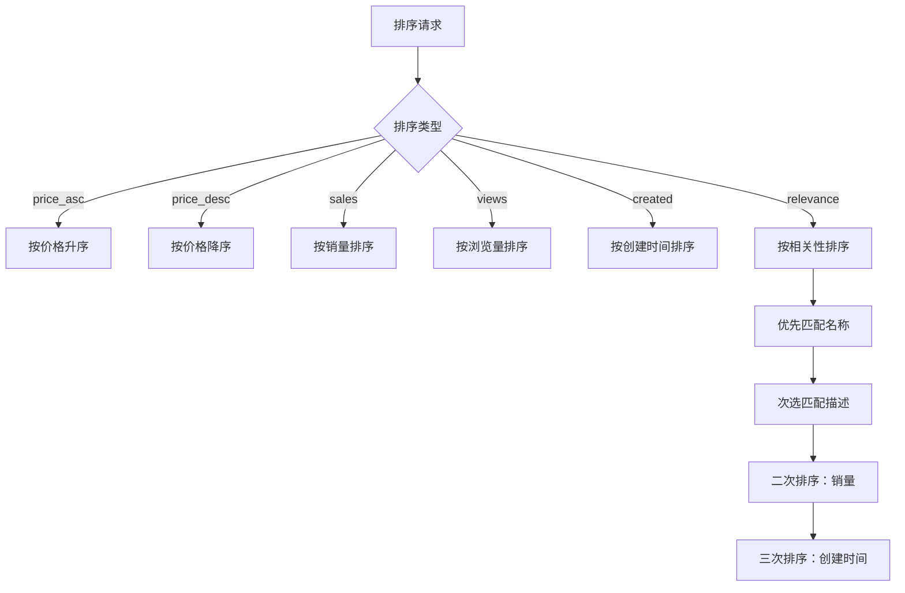

# 商品模型

<cite>
**本文档中引用的文件**
- [models.py](file://backend/catalog/models.py)
- [0001_initial.py](file://backend/catalog/migrations/0001_initial.py)
- [0003_product_description_product_detail_images_and_more.py](file://backend/catalog/migrations/0003_product_description_product_detail_images_and_more.py)
- [0005_mediaimage.py](file://backend/catalog/migrations/0005_mediaimage.py)
- [0006_product_images_json.py](file://backend/catalog/migrations/0006_product_images_json.py)
- [0008_add_product_stats_and_timestamps.py](file://backend/catalog/migrations/0008_add_product_stats_and_timestamps.py)
- [0011_product_supplier_product_supplier_code_and_more.py](file://backend/catalog/migrations/0011_product_supplier_product_supplier_code_and_more.py)
- [0014_product_invoice_price_product_is_sales_and_more.py](file://backend/catalog/migrations/0014_product_invoice_price_product_is_sales_and_more.py)
- [0015_product_source.py](file://backend/catalog/migrations/0015_product_source.py)
- [search.py](file://backend/catalog/search.py)
- [views.py](file://backend/catalog/views.py)
- [serializers.py](file://backend/catalog/serializers.py)
- [admin.py](file://backend/catalog/admin.py)
</cite>

## 目录
1. [简介](#简介)
2. [项目结构](#项目结构)
3. [核心组件](#核心组件)
4. [架构概览](#架构概览)
5. [详细组件分析](#详细组件分析)
6. [迁移历史分析](#迁移历史分析)
7. [查询与过滤](#查询与过滤)
8. [性能考虑](#性能考虑)
9. [故障排除指南](#故障排除指南)
10. [结论](#结论)

## 简介

本文档详细描述了电商系统中的商品数据模型（Product模型），包括其核心属性、演进过程、业务逻辑以及与其他模型的关系。Product模型是整个电商系统的核心实体，承载着商品的基本信息、价格体系、库存管理、统计分析等功能。

该模型经历了从基础的商品信息到复杂的海尔API集成的完整演进过程，支持本地商品管理和海尔商品的统一管理，具备完善的查询过滤机制和统计分析能力。

## 项目结构

商品模型相关的文件组织结构如下：

**图表来源**
- [models.py](file://backend/catalog/models.py#L1-L312)
- [0001_initial.py](file://backend/catalog/migrations/0001_initial.py#L1-L40)

**章节来源**
- [models.py](file://backend/catalog/models.py#L1-L312)
- [0001_initial.py](file://backend/catalog/migrations/0001_initial.py#L1-L40)

## 核心组件

### Product模型核心属性

Product模型包含以下核心业务字段：

#### 价格相关字段
- **price**: 商品售价，decimal(10,2)，验证器确保非负数
- **supply_price**: 普通供价，用于海尔API集成
- **invoice_price**: 开票价，特殊计费用途
- **market_price**: 市场价，参考价格
- **stock_rebate**: 直扣金额
- **rebate_money**: 台返金额

#### 库存与状态字段
- **stock**: 库存数量，正整数
- **is_active**: 是否上架，布尔值，默认True
- **is_sales**: 海尔是否可采（1可采，0不可采）

#### 商品来源与标识
- **source**: 商品来源，枚举类型（local/haier）
- **product_code**: 海尔产品编码，唯一标识
- **product_model**: 海尔产品型号
- **product_group**: 海尔产品组

#### 统计与时间字段
- **sales_count**: 销售数量
- **view_count**: 浏览次数
- **created_at**: 创建时间
- **updated_at**: 更新时间
- **last_sync_at**: 最后同步时间

**章节来源**
- [models.py](file://backend/catalog/models.py#L43-L116)

## 架构概览

商品模型的整体架构采用三层设计模式：

**图表来源**
- [models.py](file://backend/catalog/models.py#L43-L116)
- [search.py](file://backend/catalog/search.py#L19-L287)
- [views.py](file://backend/catalog/views.py#L29-L200)

## 详细组件分析

### Product模型详细分析

#### 类型定义与常量

Product模型定义了多个枚举类型和常量：

**图表来源**
- [models.py](file://backend/catalog/models.py#L5-L116)
- [models.py](file://backend/catalog/models.py#L177-L312)

#### JSONField使用场景

Product模型中使用了两个重要的JSONField字段：

1. **main_images**: 主图URL列表，存储商品的主要展示图片
2. **detail_images**: 详情图列表，存储商品的详细说明图片

这些字段的设计允许：
- 存储多张图片的URL列表
- 支持动态添加和删除图片
- 提高查询效率，避免频繁的图片表关联
- 支持不同格式的图片URL（本地上传、外部链接）

#### 外键关系分析

Product模型与Category、Brand的外键关系：

**图表来源**
- [models.py](file://backend/catalog/models.py#L5-L116)
- [models.py](file://backend/catalog/models.py#L207-L229)

**章节来源**
- [models.py](file://backend/catalog/models.py#L43-L116)

### MediaImage模型分析

MediaImage模型专门用于管理上传的媒体文件：

#### 核心特性
- 文件存储：支持本地文件系统存储
- 元数据管理：自动记录文件大小、内容类型、原始名称
- 时间戳：自动记录创建时间
- 安全性：支持文件类型验证和大小限制

#### 与Product的关联方式
MediaImage通过JSONField字段与Product建立关联：
- main_images: 主图列表
- detail_images: 详情图列表

这种设计的优势：
- 避免了多对多关系的复杂性
- 提高了查询性能
- 支持灵活的图片管理

**章节来源**
- [models.py](file://backend/catalog/models.py#L207-L229)

### 海尔API集成

Product模型支持与海尔API的深度集成：

#### 海尔专用字段
- **product_code**: 海尔产品唯一编码
- **product_model**: 海尔产品型号
- **product_group**: 海尔产品组
- **supply_price**: 普通供价
- **invoice_price**: 开票价
- **market_price**: 市场价
- **stock_rebate**: 直扣政策
- **rebate_money**: 台返金额

#### 同步机制
Product模型提供了两个关键方法：
1. **sync_from_haier()**: 从海尔API数据同步商品信息
2. **update_stock_from_haier()**: 从海尔API更新库存信息

**章节来源**
- [models.py](file://backend/catalog/models.py#L118-L205)

## 迁移历史分析

### 从0001_initial到0015_product_source的演进

商品模型的迁移历史反映了业务需求的逐步完善：

#### 初始版本（0001_initial.py）
- 基础商品结构：name、price、stock、category、brand
- 最小化设计，满足基本商品管理需求

#### 功能扩展阶段

**图表来源**
- [0001_initial.py](file://backend/catalog/migrations/0001_initial.py#L1-L40)
- [0003_product_description_product_detail_images_and_more.py](file://backend/catalog/migrations/0003_product_description_product_detail_images_and_more.py#L1-L39)
- [0005_mediaimage.py](file://backend/catalog/migrations/0005_mediaimage.py#L1-L30)
- [0006_product_images_json.py](file://backend/catalog/migrations/0006_product_images_json.py#L1-L37)
- [0008_add_product_stats_and_timestamps.py](file://backend/catalog/migrations/0008_add_product_stats_and_timestamps.py#L1-L58)
- [0014_product_invoice_price_product_is_sales_and_more.py](file://backend/catalog/migrations/0014_product_invoice_price_product_is_sales_and_more.py#L1-L97)
- [0015_product_source.py](file://backend/catalog/migrations/0015_product_source.py#L1-L19)

#### 关键迁移节点分析

1. **0003版本**：引入JSONField存储图片，支持多图展示
2. **0005版本**：创建独立的MediaImage模型，实现媒体文件管理
3. **0008版本**：添加统计字段和时间戳，支持数据分析
4. **0014版本**：扩展海尔API支持，添加价格和状态字段
5. **0015版本**：添加source字段，区分本地商品和海尔商品

**章节来源**
- [0001_initial.py](file://backend/catalog/migrations/0001_initial.py#L1-L40)
- [0003_product_description_product_detail_images_and_more.py](file://backend/catalog/migrations/0003_product_description_product_detail_images_and_more.py#L1-L39)
- [0005_mediaimage.py](file://backend/catalog/migrations/0005_mediaimage.py#L1-L30)
- [0006_product_images_json.py](file://backend/catalog/migrations/0006_product_images_json.py#L1-L37)
- [0008_add_product_stats_and_timestamps.py](file://backend/catalog/migrations/0008_add_product_stats_and_timestamps.py#L1-L58)
- [0014_product_invoice_price_product_is_sales_and_more.py](file://backend/catalog/migrations/0014_product_invoice_price_product_is_sales_and_more.py#L1-L97)
- [0015_product_source.py](file://backend/catalog/migrations/0015_product_source.py#L1-L19)

## 查询与过滤

### ProductSearchService高级搜索

ProductSearchService提供了强大的搜索和过滤功能：

#### 支持的查询参数
- **keyword**: 关键词搜索（产品名称和描述）
- **category**: 分类过滤
- **brand**: 品牌过滤
- **min_price/max_price**: 价格范围过滤
- **sort_by**: 排序策略
- **page/page_size**: 分页控制

#### 排序策略

**图表来源**
- [search.py](file://backend/catalog/search.py#L36-L44)
- [search.py](file://backend/catalog/search.py#L161-L202)

#### 典型ORM查询示例

以下是几种常见的查询模式：

1. **基础查询**：获取所有活跃商品
2. **条件过滤**：按分类和品牌过滤
3. **价格范围查询**：筛选指定价格区间
4. **组合查询**：多条件组合搜索

**章节来源**
- [search.py](file://backend/catalog/search.py#L47-L158)
- [views.py](file://backend/catalog/views.py#L90-L131)

### 视图层查询优化

ProductViewSet提供了多种查询接口：

#### 主要查询接口
1. **list()**: 基础列表查询，支持搜索和过滤
2. **by_category()**: 按分类查询商品
3. **by_brand()**: 按品牌查询商品
4. **search_suggestions()**: 搜索建议
5. **hot_keywords()**: 热门搜索词

#### 查询优化策略
- **select_related()**: 预加载关联的Category和Brand
- **索引优化**: 多个复合索引支持高效查询
- **分页处理**: 支持大数据量分页
- **缓存策略**: 利用Django缓存提高性能

**章节来源**
- [views.py](file://backend/catalog/views.py#L29-L200)

## 性能考虑

### 数据库索引设计

Product模型建立了多个复合索引以优化查询性能：

| 索引名称 | 字段组合 | 用途 |
|---------|----------|------|
| catalog_pro_is_acti_ed6a39_idx | is_active, -created_at | 按上架状态和创建时间查询 |
| catalog_pro_categor_891fe8_idx | category, is_active | 按分类和状态查询 |
| catalog_pro_brand_i_ca0f3c_idx | brand, is_active | 按品牌和状态查询 |
| catalog_pro_price_2d2a4c_idx | price | 按价格查询 |
| catalog_pro_sales_c_9ac6ba_idx | -sales_count | 按销量排序 |
| catalog_pro_product_ac7085_idx | product_code | 按海尔编码查询 |
| catalog_pro_is_sale_6a3584_idx | is_sales | 按可采状态查询 |

### 查询优化策略

1. **预加载关联对象**: 使用select_related减少数据库查询
2. **批量操作**: JSONField支持批量图片处理
3. **缓存机制**: 利用Django缓存存储热门商品数据
4. **分页处理**: 避免大量数据一次性加载

### 内存优化

- JSONField存储图片URL，避免创建大量关联记录
- 定期清理无用的搜索日志和库存日志
- 使用流式处理大文件上传

## 故障排除指南

### 常见问题与解决方案

#### 1. 图片显示问题
**问题**: 商品图片无法正常显示
**解决方案**:
- 检查图片URL格式是否正确
- 验证MEDIA_URL配置
- 确认文件权限设置

#### 2. 海尔API同步失败
**问题**: 海尔商品信息同步不成功
**解决方案**:
- 检查网络连接和API访问权限
- 验证product_code唯一性
- 查看同步日志和错误信息

#### 3. 查询性能问题
**问题**: 大数据量查询响应缓慢
**解决方案**:
- 使用适当的索引
- 实施分页查询
- 考虑添加查询缓存

#### 4. JSONField数据损坏
**问题**: 图片列表数据格式异常
**解决方案**:
- 使用迁移脚本进行数据修复
- 实施数据验证机制
- 定期备份重要数据

**章节来源**
- [models.py](file://backend/catalog/models.py#L118-L205)
- [search.py](file://backend/catalog/search.py#L204-L287)

## 结论

Product模型作为电商系统的核心实体，展现了良好的架构设计和业务适应性。从最初的简单结构发展到支持海尔API集成的复杂模型，体现了系统对业务需求变化的快速响应能力。

### 主要优势

1. **灵活性**: JSONField支持动态数据结构
2. **扩展性**: 渐进式功能添加，不影响现有系统
3. **性能**: 合理的索引设计和查询优化
4. **完整性**: 支持本地和第三方商品管理
5. **可维护性**: 清晰的迁移历史和模块化设计

### 发展方向

1. **AI推荐**: 基于商品特征的商品推荐
2. **多语言支持**: 国际化商品信息管理
3. **实时同步**: 更高效的海尔API数据同步
4. **数据分析**: 深度挖掘商品销售数据

该模型为电商系统的稳定运行提供了坚实的基础，同时为未来的功能扩展预留了充足的空间。