# 商品统计与库存管理

<cite>
**本文档引用的文件**
- [backend/catalog/models.py](file://backend/catalog/models.py)
- [backend/catalog/views.py](file://backend/catalog/views.py)
- [backend/catalog/management/commands/sync_haier_products.py](file://backend/catalog/management/commands/sync_haier_products.py)
- [backend/integrations/models.py](file://backend/integrations/models.py)
- [backend/integrations/haierapi.py](file://backend/integrations/haierapi.py)
- [backend/orders/models.py](file://backend/orders/models.py)
- [backend/orders/analytics.py](file://backend/orders/analytics.py)
- [backend/orders/services.py](file://backend/orders/services.py)
- [backend/orders/state_machine.py](file://backend/orders/state_machine.py)
</cite>

## 目录
1. [概述](#概述)
2. [核心数据模型](#核心数据模型)
3. [商品统计机制](#商品统计机制)
4. [库存管理系统](#库存管理系统)
5. [海尔API集成](#海尔api集成)
6. [库存审计与日志](#库存审计与日志)
7. [数据库索引优化](#数据库索引优化)
8. [系统配置与管理](#系统配置与管理)
9. [性能监控与缓存策略](#性能监控与缓存策略)
10. [最佳实践建议](#最佳实践建议)

## 概述

本系统实现了完整的商品统计与库存管理解决方案，主要围绕`view_count`（浏览次数）、`sales_count`（销售数量）、`stock`（库存数量）和`last_sync_at`（最后同步时间）等核心字段构建。系统采用多层次的统计机制，包括实时更新、批量统计和缓存优化，同时通过海尔API实现与外部供应链系统的无缝集成。

### 核心特性

- **实时统计更新**：商品浏览量和销量的即时更新机制
- **智能库存管理**：基于事务的库存锁定、释放和调整功能
- **API集成能力**：完整的海尔API对接，支持商品、价格和库存同步
- **审计追踪**：详细的库存变更日志和操作记录
- **性能优化**：多层缓存策略和数据库索引优化

## 核心数据模型

### Product模型架构

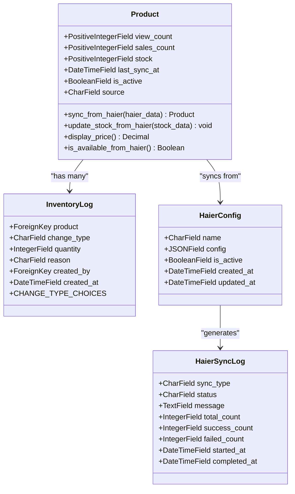

**图表来源**
- [backend/catalog/models.py](file://backend/catalog/models.py#L43-L113)
- [backend/catalog/models.py](file://backend/catalog/models.py#L267-L312)
- [backend/integrations/models.py](file://backend/integrations/models.py#L4-L47)

### 关键字段说明

| 字段名 | 类型 | 默认值 | 描述 | 业务意义 |
|--------|------|--------|------|----------|
| `view_count` | PositiveIntegerField | 0 | 商品浏览次数 | 统计商品受欢迎程度的重要指标 |
| `sales_count` | PositiveIntegerField | 0 | 商品销售数量 | 直接反映商品的销售业绩 |
| `stock` | PositiveIntegerField | 0 | 当前库存数量 | 实时库存水平的关键指标 |
| `last_sync_at` | DateTimeField | null | 最后同步时间 | 海尔数据同步的时间戳 |
| `is_active` | BooleanField | True | 商品是否上架 | 控制商品的可见性和销售状态 |
| `source` | CharField | 'local' | 商品来源标识 | 区分本地商品和海尔商品 |

**章节来源**
- [backend/catalog/models.py](file://backend/catalog/models.py#L89-L100)

## 商品统计机制

### 浏览量统计更新

系统通过多种场景自动更新商品的浏览次数：

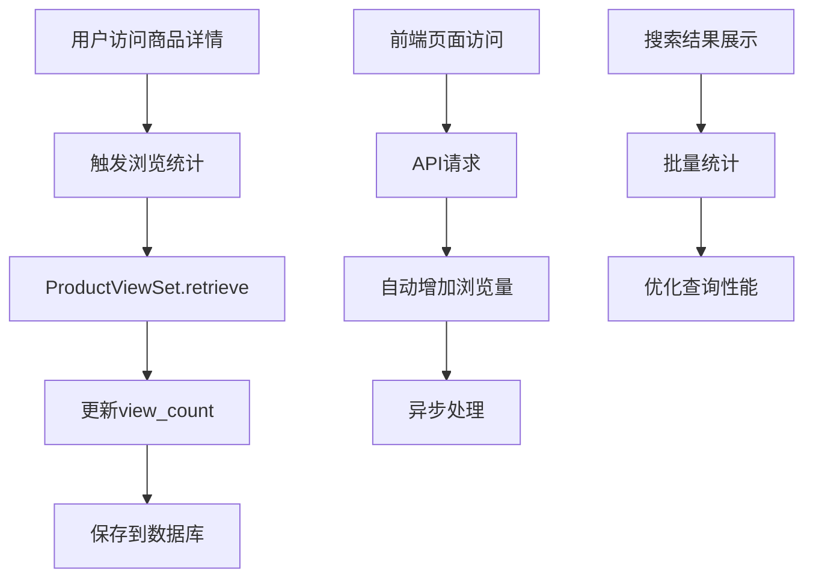

**图表来源**
- [backend/catalog/views.py](file://backend/catalog/views.py#L387-L396)

### 销量统计更新机制

销量统计通过订单状态机进行精确控制：

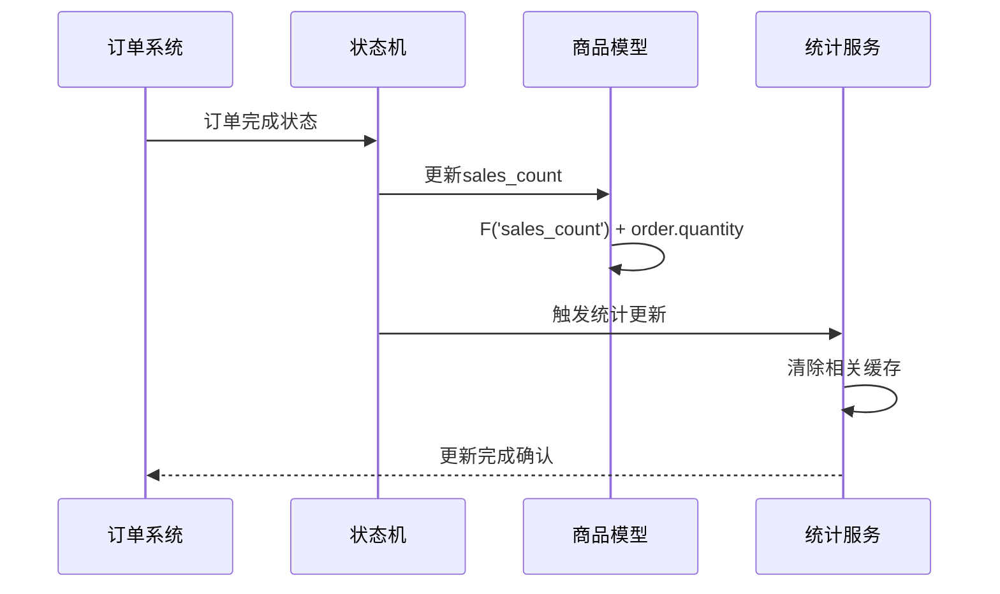

**图表来源**
- [backend/orders/state_machine.py](file://backend/orders/state_machine.py#L235-L252)

### 统计数据聚合

系统提供了丰富的统计数据聚合功能：

| 统计类型 | 数据源 | 更新频率 | 缓存策略 | 应用场景 |
|----------|--------|----------|----------|----------|
| 日活统计 | 用户访问日志 | 实时 | 无缓存 | 实时监控 |
| 销售汇总 | 订单表 | 实时 | 5分钟缓存 | 营销决策 |
| 热销排行 | 订单商品关联 | 实时 | 5分钟缓存 | 推荐算法 |
| 库存状态 | 库存日志 | 实时 | 无缓存 | 库存管理 |

**章节来源**
- [backend/orders/analytics.py](file://backend/orders/analytics.py#L18-L72)

## 库存管理系统

### 库存操作类型

系统定义了三种核心的库存变更类型：

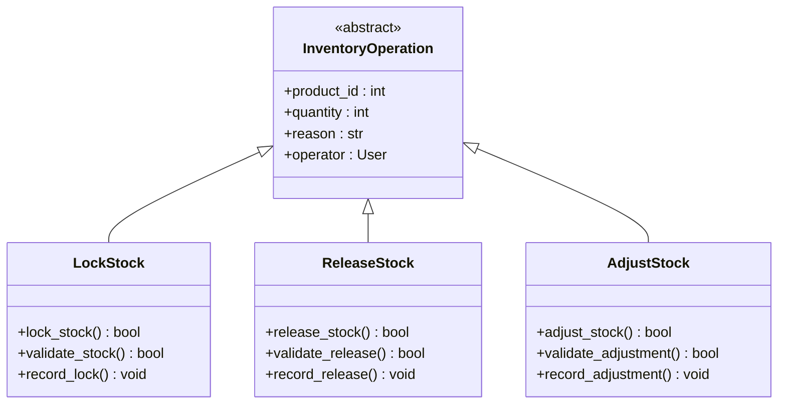

**图表来源**
- [backend/orders/services.py](file://backend/orders/services.py#L330-L452)

### 库存锁定机制

库存锁定采用数据库行锁确保并发安全性：

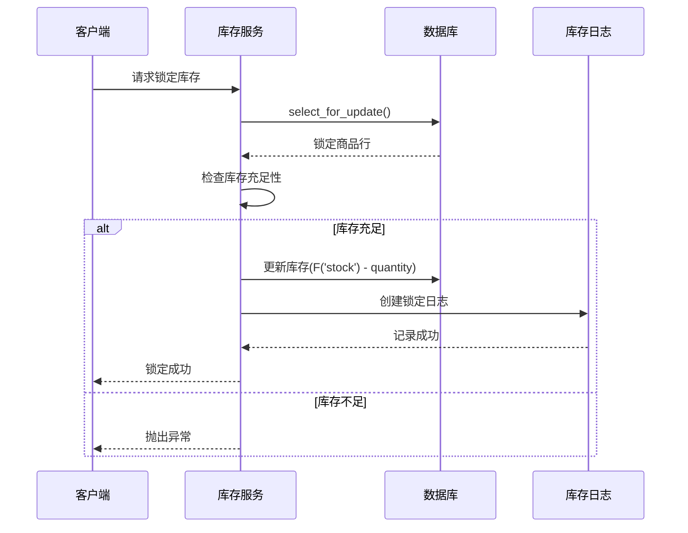

**图表来源**
- [backend/orders/services.py](file://backend/orders/services.py#L333-L371)

### 库存释放与调整

系统提供了灵活的库存调整功能：

| 操作类型 | 触发条件 | 库存变化 | 日志记录 | 权限要求 |
|----------|----------|----------|----------|----------|
| 锁定库存 | 订单创建 | -quantity | 锁定记录 | 无特殊要求 |
| 释放库存 | 订单取消/退款 | +quantity | 释放记录 | 无特殊要求 |
| 调整库存 | 管理员操作 | ±quantity | 调整记录 | 管理员权限 |

**章节来源**
- [backend/orders/services.py](file://backend/orders/services.py#L375-L451)

## 海尔API集成

### API配置管理

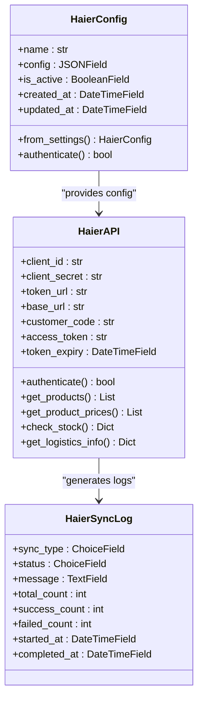

**图表来源**
- [backend/integrations/models.py](file://backend/integrations/models.py#L4-L47)
- [backend/integrations/haierapi.py](file://backend/integrations/haierapi.py#L10-L214)

### 商品同步流程

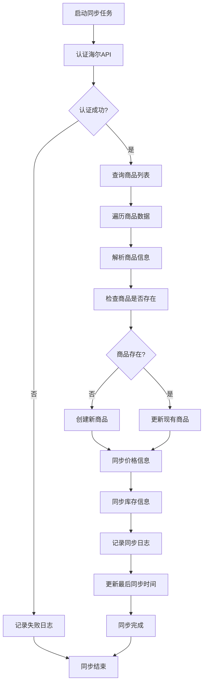

**图表来源**
- [backend/catalog/management/commands/sync_haier_products.py](file://backend/catalog/management/commands/sync_haier_products.py#L50-L156)

### 库存同步方法

`update_stock_from_haier`方法负责从海尔API更新库存信息：

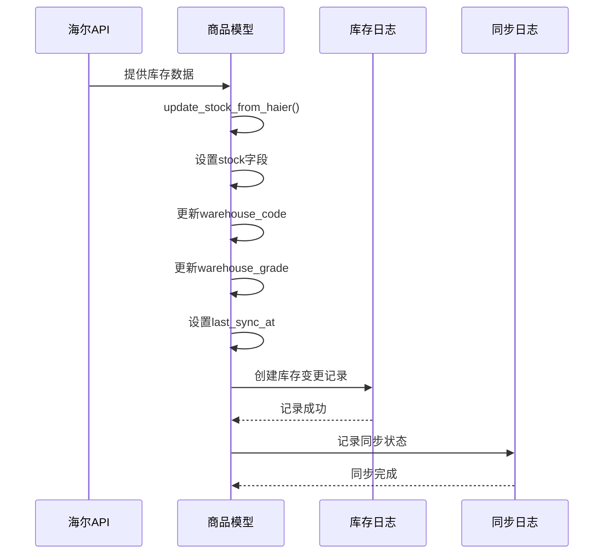

**图表来源**
- [backend/catalog/models.py](file://backend/catalog/models.py#L181-L195)

**章节来源**
- [backend/integrations/haierapi.py](file://backend/integrations/haierapi.py#L121-L142)

## 库存审计与日志

### InventoryLog模型设计

库存日志系统提供了完整的审计追踪功能：

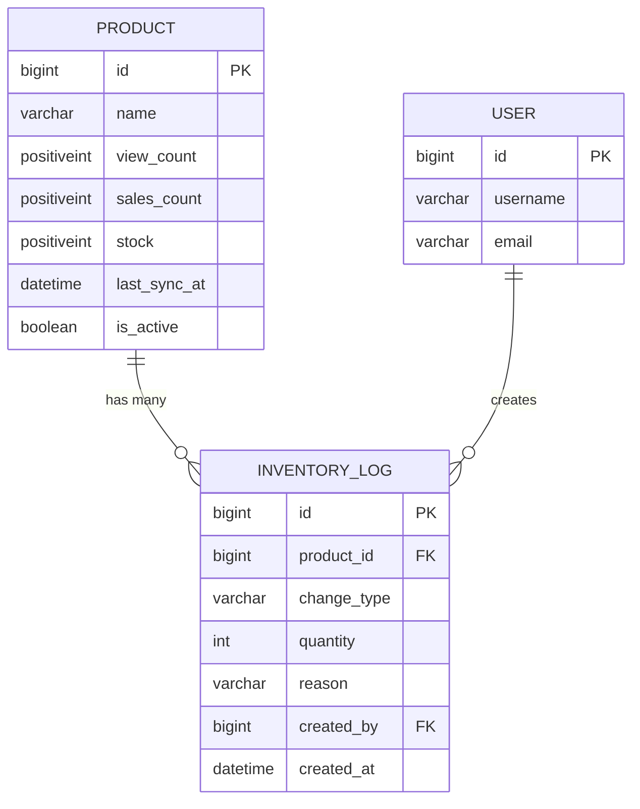

**图表来源**
- [backend/catalog/models.py](file://backend/catalog/models.py#L267-L312)

### 变更类型详解

| 变更类型 | 枚举值 | 中文描述 | 数值变化 | 使用场景 |
|----------|--------|----------|----------|----------|
| 锁定 | lock | 库存锁定 | -quantity | 订单创建时锁定库存 |
| 释放 | release | 库存释放 | +quantity | 订单取消或退款时释放库存 |
| 调整 | adjust | 库存调整 | ±quantity | 管理员手动调整库存 |

### 审计追踪流程

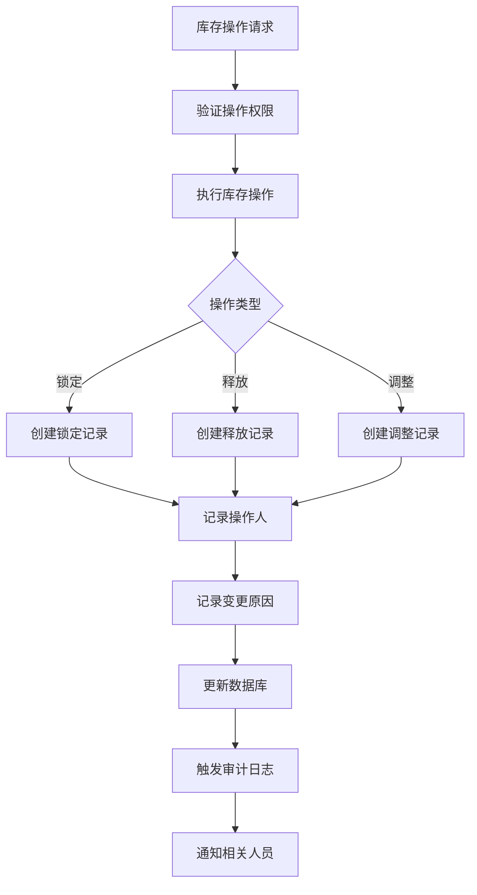

**图表来源**
- [backend/orders/services.py](file://backend/orders/services.py#L364-L449)

**章节来源**
- [backend/catalog/models.py](file://backend/catalog/models.py#L267-L312)

## 数据库索引优化

### Product模型索引策略

系统为Product模型设计了多层索引优化策略：

| 索引类型 | 字段组合 | 用途 | 性能收益 |
|----------|----------|------|----------|
| 单字段索引 | `is_active` | 快速过滤上架商品 | 减少扫描行数 |
| 复合索引 | `is_active, -sales_count` | 热销商品排行 | 支持排序优化 |
| 复合索引 | `is_active, -view_count` | 浏览量排行 | 提升查询速度 |
| 复合索引 | `category, is_active` | 分类商品查询 | 减少全表扫描 |
| 复合索引 | `brand, is_active` | 品牌商品查询 | 优化品牌筛选 |
| 单字段索引 | `-created_at` | 新品推荐 | 支持时间排序 |
| 单字段索引 | `product_code` | 海尔商品匹配 | 加速API同步 |
| 单字段索引 | `is_sales` | 可销售商品筛选 | 提升查询效率 |

### InventoryLog模型索引

```mermaid
erDiagram
INVENTORY_LOG {
bigint id PK
bigint product_id FK
varchar change_type
datetime created_at
}
INDEXES {
"catalog_inv_product_55e4e1_idx" : "product, created_at"
"catalog_inv_change__9a36ba_idx" : "change_type"
}
INVENTORY_LOG ||--o{ INDEXES : "uses"
```

**图表来源**
- [backend/catalog/models.py](file://backend/catalog/models.py#L105-L113)

### 查询性能优化

系统采用多种策略提升查询性能：

1. **预加载优化**：使用`select_related`避免N+1查询
2. **批量操作**：通过F表达式实现原子性更新
3. **缓存策略**：关键统计数据采用Redis缓存
4. **索引覆盖**：确保常用查询走索引而非全表扫描

**章节来源**
- [backend/catalog/models.py](file://backend/catalog/models.py#L105-L113)

## 系统配置与管理

### HaierConfig配置管理

海尔API配置采用灵活的JSON结构存储：

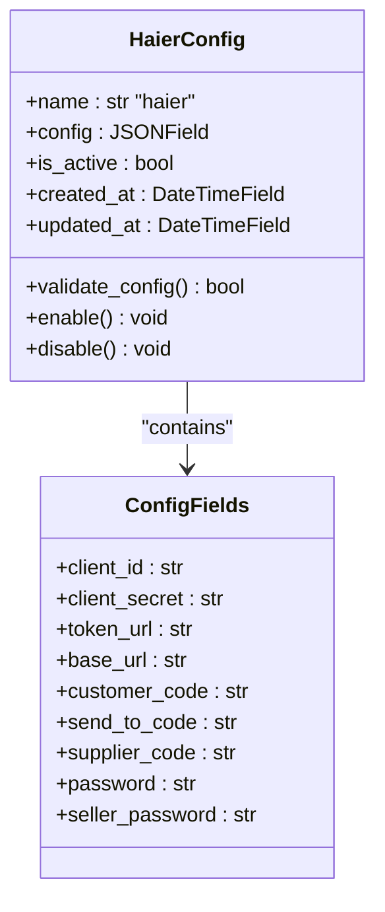

**图表来源**
- [backend/integrations/models.py](file://backend/integrations/models.py#L4-L47)

### 自动化管理命令

系统提供了完整的自动化管理工具：

| 命令 | 功能 | 参数 | 使用场景 |
|------|------|------|----------|
| `sync_haier_products` | 同步海尔商品 | `--product-codes`, `--sync-prices`, `--sync-stock` | 定期数据同步 |
| `cancel_unpaid_orders` | 取消超时订单 | `--timeout`, `--batch-size` | 订单清理 |
| `invalidate_cache` | 清除统计缓存 | `--cache-keys` | 缓存维护 |

### 配置最佳实践

1. **环境隔离**：开发、测试、生产环境使用不同配置
2. **密钥管理**：敏感信息通过环境变量或加密存储
3. **配置验证**：启动时验证配置完整性
4. **降级策略**：API不可用时的备用方案

**章节来源**
- [backend/catalog/management/commands/sync_haier_products.py](file://backend/catalog/management/commands/sync_haier_products.py#L13-L156)

## 性能监控与缓存策略

### 缓存架构设计

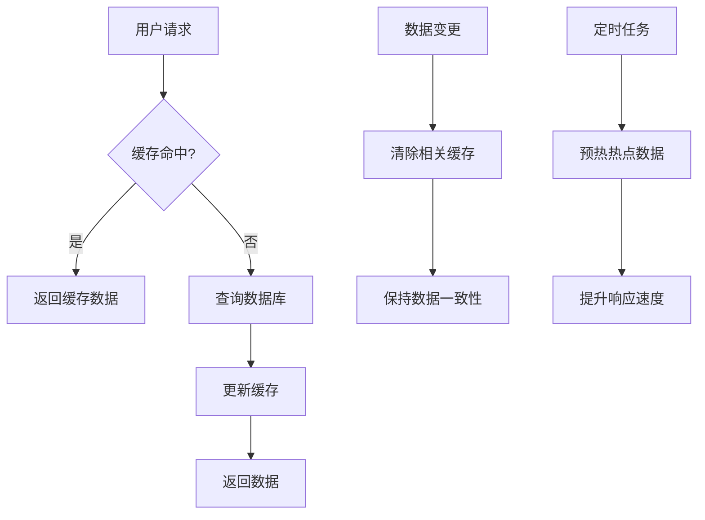

### 缓存策略详解

| 缓存类型 | 过期时间 | 生效范围 | 更新策略 | 适用场景 |
|----------|----------|----------|----------|----------|
| 销售汇总 | 5分钟 | 全局 | 实时更新 | 管理面板 |
| 热销排行 | 5分钟 | 全局 | 实时更新 | 推荐系统 |
| 每日销售 | 5分钟 | 全局 | 实时更新 | 数据分析 |
| 用户增长 | 5分钟 | 全局 | 实时更新 | 用户分析 |
| 订单状态 | 5分钟 | 全局 | 实时更新 | 状态监控 |

### 性能监控指标

系统监控以下关键性能指标：

1. **响应时间**：API接口平均响应时间
2. **吞吐量**：每秒处理的请求数量
3. **错误率**：各类操作的成功率
4. **缓存命中率**：Redis缓存的有效性
5. **数据库连接**：活跃连接数和等待时间

**章节来源**
- [backend/orders/analytics.py](file://backend/orders/analytics.py#L18-L322)

## 最佳实践建议

### 开发建议

1. **事务管理**：库存操作必须在事务中进行
2. **并发控制**：使用数据库行锁防止超卖
3. **错误处理**：完善的异常捕获和恢复机制
4. **日志记录**：关键操作必须记录详细日志
5. **性能测试**：定期进行压力测试和性能评估

### 运维建议

1. **监控告警**：设置关键指标的告警阈值
2. **备份策略**：定期备份重要统计数据
3. **容量规划**：根据业务增长预测资源需求
4. **安全防护**：实施适当的安全措施保护敏感数据
5. **版本管理**：严格的版本控制和发布流程

### 业务建议

1. **数据准确性**：定期核对库存数据准确性
2. **用户体验**：优化商品详情页的加载速度
3. **营销策略**：基于统计数据制定精准营销
4. **供应链协同**：与海尔系统保持紧密协作
5. **成本控制**：合理控制缓存和计算资源消耗

通过这套完整的商品统计与库存管理系统，企业能够实现高效的库存管理、准确的销售统计和可靠的API集成，为电商业务的稳定运行提供坚实的技术保障。