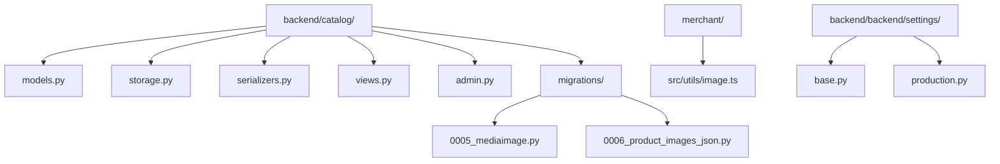
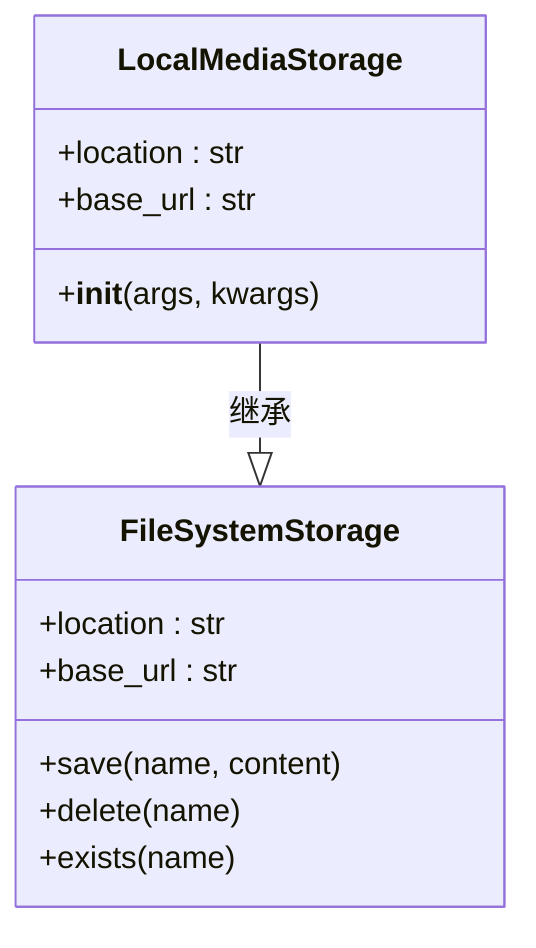
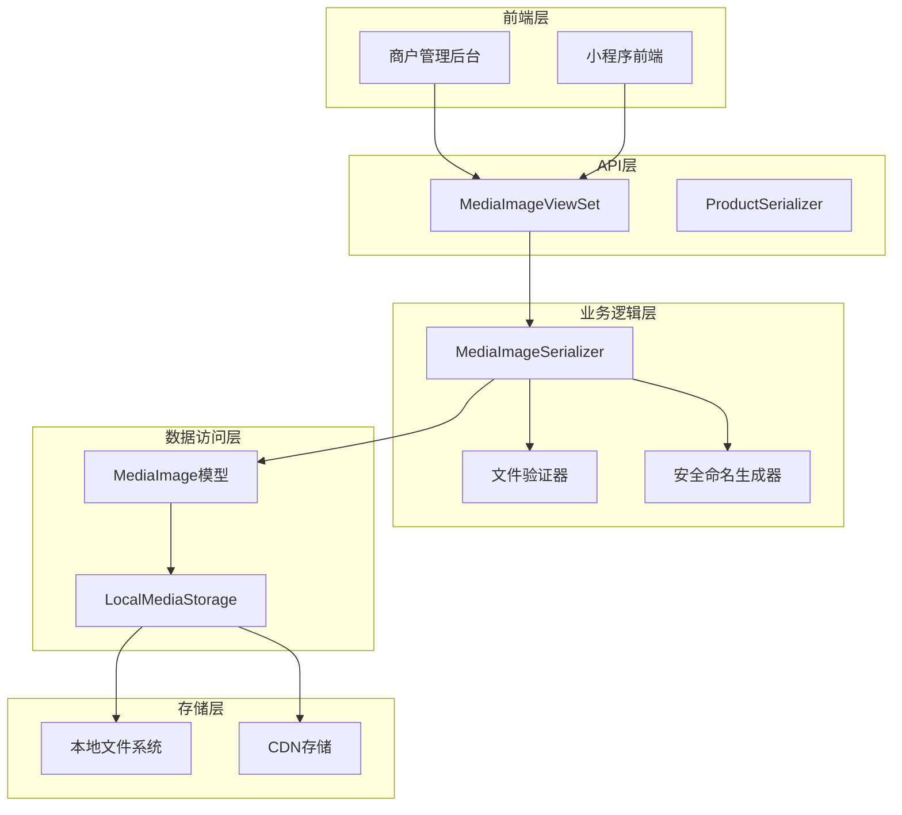
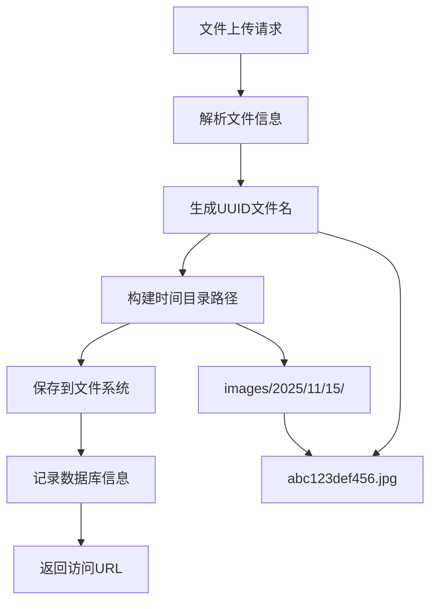
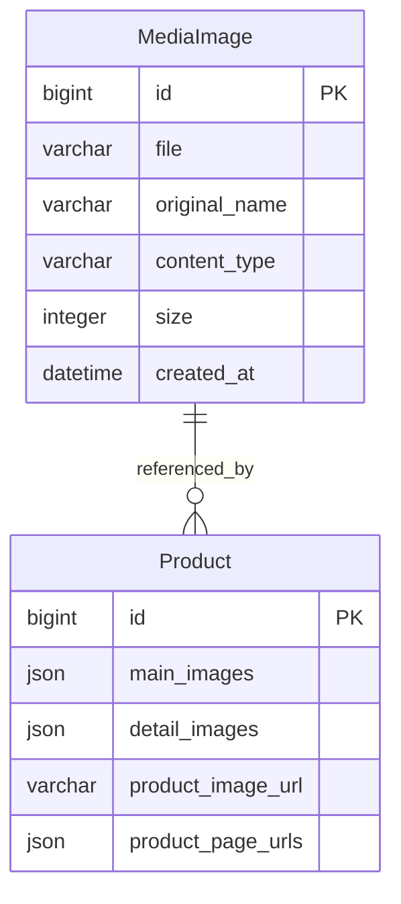
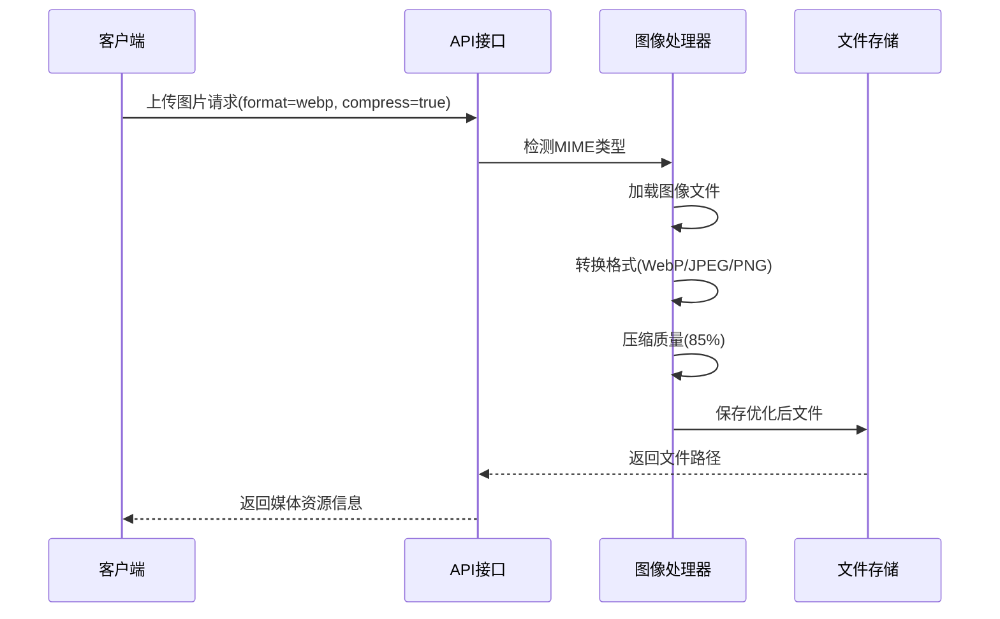
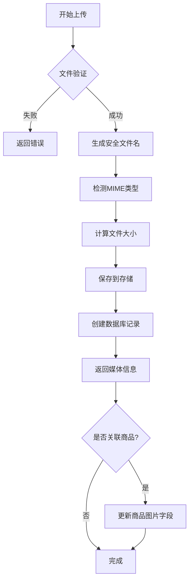
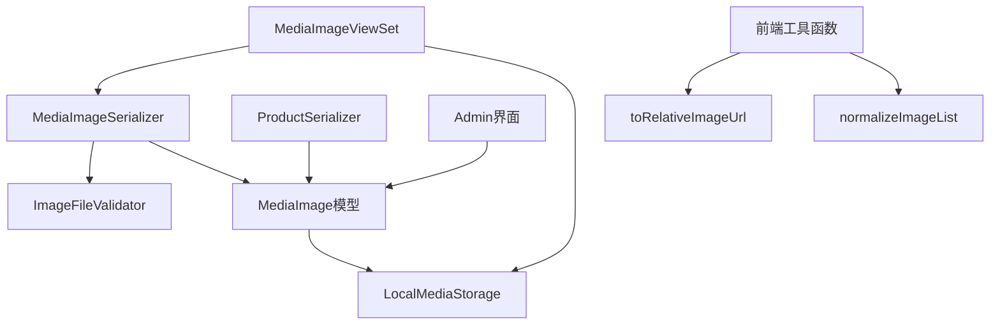
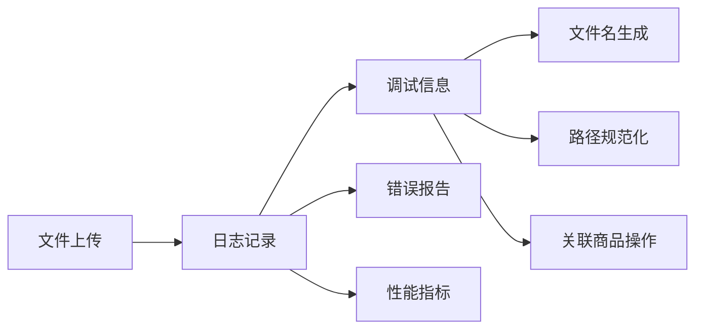

# 媒体资源管理

<cite>
**本文档中引用的文件**
- [backend/catalog/models.py](file://backend/catalog/models.py)
- [backend/catalog/storage.py](file://backend/catalog/storage.py)
- [backend/catalog/serializers.py](file://backend/catalog/serializers.py)
- [backend/catalog/views.py](file://backend/catalog/views.py)
- [backend/catalog/admin.py](file://backend/catalog/admin.py)
- [backend/catalog/migrations/0005_mediaimage.py](file://backend/catalog/migrations/0005_mediaimage.py)
- [backend/catalog/migrations/0006_product_images_json.py](file://backend/catalog/migrations/0006_product_images_json.py)
- [backend/backend/settings/base.py](file://backend/backend/settings/base.py)
- [merchant/src/utils/image.ts](file://merchant/src/utils/image.ts)
</cite>

## 目录
1. [简介](#简介)
2. [项目结构](#项目结构)
3. [核心组件](#核心组件)
4. [架构概览](#架构概览)
5. [详细组件分析](#详细组件分析)
6. [依赖关系分析](#依赖关系分析)
7. [性能考虑](#性能考虑)
8. [故障排除指南](#故障排除指南)
9. [结论](#结论)

## 简介

媒体资源管理模块是电动小程序电商平台的核心功能之一，负责处理所有图片文件的上传、存储、管理和访问。该模块采用安全的文件管理系统，支持多种图片格式，提供完整的生命周期管理，并通过URL引用的方式与商品系统进行解耦。

## 项目结构

媒体资源管理模块主要分布在以下目录结构中：

**图表来源**
- [backend/catalog/models.py](file://backend/catalog/models.py#L1-L312)
- [backend/catalog/storage.py](file://backend/catalog/storage.py#L1-L15)
- [backend/catalog/migrations/0005_mediaimage.py](file://backend/catalog/migrations/0005_mediaimage.py#L1-L30)

**章节来源**
- [backend/catalog/models.py](file://backend/catalog/models.py#L1-L312)
- [backend/catalog/storage.py](file://backend/catalog/storage.py#L1-L15)
- [backend/catalog/migrations/0005_mediaimage.py](file://backend/catalog/migrations/0005_mediaimage.py#L1-L30)

## 核心组件

### MediaImage模型

MediaImage模型是媒体资源管理的核心数据结构，专门设计用于安全地存储和管理上传的图片文件。

#### 字段设计与用途

| 字段名 | 数据类型 | 长度限制 | 默认值 | 描述 | 安全特性 |
|--------|----------|----------|--------|------|----------|
| id | BigAutoField | - | - | 主键标识符 | 自动递增，唯一标识 |
| file | FileField | - | - | 文件存储字段 | 使用自定义存储后端，支持UUID命名 |
| original_name | CharField | 255字符 | '' | 原始文件名 | 保留用户上传时的文件名 |
| content_type | CharField | 100字符 | '' | 内容类型 | MIME类型检测，防止恶意文件 |
| size | PositiveIntegerField | - | 0 | 文件大小 | 字节单位，防止超大文件 |
| created_at | DateTimeField | - | - | 创建时间 | 自动记录，支持时间索引 |

#### 设计特点

1. **安全性优先**：所有字段都包含适当的验证和限制
2. **可追溯性**：保留原始文件名和内容类型
3. **性能优化**：添加了时间索引以支持快速查询
4. **扩展性**：支持未来字段扩展

**章节来源**
- [backend/catalog/models.py](file://backend/catalog/models.py#L207-L229)

### LocalMediaStorage自定义存储后端

LocalMediaStorage是基于Django FileSystemStorage的自定义存储后端，专门为开发环境设计的安全文件存储解决方案。

#### 实现原理

**图表来源**
- [backend/catalog/storage.py](file://backend/catalog/storage.py#L5-L15)

#### 安全性考虑

1. **路径隔离**：使用settings.MEDIA_ROOT作为根目录
2. **URL前缀**：通过settings.MEDIA_URL提供统一访问入口
3. **权限控制**：基于Django文件系统的标准权限机制
4. **环境适配**：开发环境专用，生产环境可替换为云存储

**章节来源**
- [backend/catalog/storage.py](file://backend/catalog/storage.py#L1-L15)
- [backend/backend/settings/base.py](file://backend/backend/settings/base.py#L204-L206)

## 架构概览

媒体资源管理采用分层架构设计，确保安全性和可维护性：

**图表来源**
- [backend/catalog/views.py](file://backend/catalog/views.py#L749-L772)
- [backend/catalog/serializers.py](file://backend/catalog/serializers.py#L255-L279)
- [backend/catalog/storage.py](file://backend/catalog/storage.py#L5-L15)

## 详细组件分析

### 文件上传与处理流程

#### 上传路径组织策略

文件上传采用时间分层目录结构，路径格式为：`images/%Y/%m/%d/`，这种设计具有以下优势：

**图表来源**
- [backend/catalog/views.py](file://backend/catalog/views.py#L773-L792)

#### 安全文件命名机制

系统使用UUID.hex生成唯一文件名，防止文件名冲突和路径遍历攻击：

| 安全措施 | 实现方式 | 防护目标 |
|----------|----------|----------|
| UUID命名 | uuid.uuid4().hex | 防止文件覆盖和碰撞 |
| 时间分层 | %Y/%m/%d目录结构 | 支持文件清理和归档 |
| 扩展名映射 | MIME类型检测 | 防止恶意文件执行 |
| 路径规范化 | urlparse处理 | 防止路径遍历攻击 |

**章节来源**
- [backend/catalog/views.py](file://backend/catalog/views.py#L773-L811)

### 媒体资源与商品的关联方式

#### URL引用模式

系统采用URL引用而非直接外键关联的方式管理媒体资源与商品的关系：

**图表来源**
- [backend/catalog/models.py](file://backend/catalog/models.py#L43-L95)

#### 关联优势

1. **解耦设计**：媒体资源独立于商品模型
2. **灵活性**：支持跨商品复用同一图片
3. **性能**：避免复杂的外键查询
4. **可维护性**：媒体资源删除不影响商品数据

**章节来源**
- [backend/catalog/models.py](file://backend/catalog/models.py#L79-L95)

### 文件处理与优化功能

#### 图像压缩与格式转换

系统支持多种图像处理功能，提升用户体验和性能：

**图表来源**
- [backend/catalog/views.py](file://backend/catalog/views.py#L875-L907)

#### 支持的图像格式

| 格式 | 扩展名 | 特点 | 使用场景 |
|------|--------|------|----------|
| JPEG | jpg | 有损压缩，适合照片 | 商品主图、详情图 |
| PNG | png | 无损压缩，支持透明 | Logo、图标 |
| WebP | webp | 现代格式，高压缩比 | 新版浏览器优化 |
| GIF | gif | 动画支持 | 表情、动态效果 |
| BMP | bmp | 无压缩，文件大 | 内部处理 |

**章节来源**
- [backend/catalog/views.py](file://backend/catalog/views.py#L793-L811)

### 生命周期管理

#### 文件上传完整流程

**图表来源**
- [backend/catalog/views.py](file://backend/catalog/views.py#L840-L932)

#### 清理与维护策略

1. **定期清理**：基于created_at字段的自动清理
2. **空间监控**：监控存储空间使用情况
3. **备份策略**：重要图片的备份机制
4. **缓存管理**：CDN缓存的失效处理

**章节来源**
- [backend/catalog/views.py](file://backend/catalog/views.py#L840-L932)

## 依赖关系分析

### 组件间依赖关系

**图表来源**
- [backend/catalog/serializers.py](file://backend/catalog/serializers.py#L255-L279)
- [backend/catalog/views.py](file://backend/catalog/views.py#L749-L772)
- [backend/catalog/storage.py](file://backend/catalog/storage.py#L5-L15)

### 外部依赖

| 依赖项 | 版本要求 | 用途 | 可选性 |
|--------|----------|------|--------|
| Pillow | >= 8.0.0 | 图像处理和格式转换 | 必需（图像处理功能） |
| django-storages | >= 1.13.0 | 云存储集成 | 可选（生产环境推荐） |
| boto3 | >= 1.20.0 | AWS S3存储 | 可选（云存储方案） |

**章节来源**
- [backend/catalog/views.py](file://backend/catalog/views.py#L749-L772)

## 性能考虑

### 查询优化

1. **索引策略**：在created_at字段上建立索引，支持时间范围查询
2. **批量操作**：支持批量上传和更新媒体资源
3. **缓存机制**：对频繁访问的图片URL进行缓存
4. **CDN集成**：支持CDN加速静态资源访问

### 存储优化

1. **分层存储**：热数据和冷数据分离存储
2. **压缩存储**：自动压缩和格式转换
3. **去重机制**：相同内容的文件只存储一份
4. **清理策略**：定期清理未使用的媒体资源

## 故障排除指南

### 常见问题及解决方案

#### 文件上传失败

**问题症状**：上传图片时返回400错误

**可能原因**：
1. 文件格式不支持
2. 文件大小超过限制
3. 权限不足
4. 存储空间不足

**解决步骤**：
1. 检查文件格式是否在支持列表中
2. 验证文件大小是否符合要求
3. 确认MEDIA_ROOT目录权限
4. 检查磁盘空间使用情况

#### 图片显示异常

**问题症状**：上传的图片无法正常显示

**可能原因**：
1. URL路径错误
2. 文件损坏
3. MIME类型检测失败
4. 缓存问题

**解决步骤**：
1. 验证文件路径是否正确
2. 重新上传图片文件
3. 检查文件完整性
4. 清除浏览器缓存

**章节来源**
- [backend/catalog/views.py](file://backend/catalog/views.py#L840-L932)
- [backend/catalog/serializers.py](file://backend/catalog/serializers.py#L255-L328)

### 监控与日志

系统提供详细的日志记录功能，便于问题诊断：

**图表来源**
- [backend/catalog/views.py](file://backend/catalog/views.py#L923-L932)

## 结论

媒体资源管理模块通过精心设计的架构和安全机制，为电动小程序电商平台提供了可靠、高效的图片管理解决方案。其主要优势包括：

1. **安全性**：多重验证和防护机制确保文件安全
2. **可扩展性**：模块化设计支持功能扩展
3. **性能优化**：合理的存储结构和缓存策略
4. **易于维护**：清晰的代码结构和完善的文档

该模块不仅满足了当前的功能需求，还为未来的扩展和优化奠定了坚实的基础。通过持续的监控和维护，可以确保系统的稳定运行和良好的用户体验。