# 数据模型

<cite>
**本文档引用的文件**
- [backend/users/models.py](file://backend/users/models.py)
- [backend/catalog/models.py](file://backend/catalog/models.py)
- [backend/orders/models.py](file://backend/orders/models.py)
- [backend/integrations/models.py](file://backend/integrations/models.py)
- [backend/orders/state_machine.py](file://backend/orders/state_machine.py)
- [backend/orders/analytics.py](file://backend/orders/analytics.py)
- [backend/users/migrations/0009_user_last_login_at_user_user_type_alter_user_openid.py](file://backend/users/migrations/0009_user_last_login_at_user_user_type_alter_user_openid.py)
- [backend/catalog/migrations/0015_product_source.py](file://backend/catalog/migrations/0015_product_source.py)
- [backend/orders/migrations/0001_initial.py](file://backend/orders/migrations/0001_initial.py)
- [backend/orders/migrations/0005_payment.py](file://backend/orders/migrations/0005_payment.py)
- [backend/users/migrations/0001_initial.py](file://backend/users/migrations/0001_initial.py)
- [backend/catalog/migrations/0001_initial.py](file://backend/catalog/migrations/0001_initial.py)
- [backend/integrations/migrations/0001_initial.py](file://backend/integrations/migrations/0001_initial.py)
</cite>

## 目录
1. [简介](#简介)
2. [项目结构概览](#项目结构概览)
3. [核心实体模型](#核心实体模型)
4. [实体关系架构](#实体关系架构)
5. [模型演进历程](#模型演进历程)
6. [状态机设计](#状态机设计)
7. [数据完整性约束](#数据完整性约束)
8. [性能优化考虑](#性能优化考虑)
9. [总结](#总结)

## 简介

本文档详细描述了电商业务系统的核心数据模型，包括用户(User)、商品(Product)、订单(Order)和支付(Payment)等核心实体的设计理念、字段含义、关系映射以及模型演进过程。系统采用Django ORM构建，支持微信小程序和Web双端业务场景，具备完整的订单状态管理、商品来源区分、支付集成等功能。

## 项目结构概览

系统采用模块化架构，主要包含以下应用：

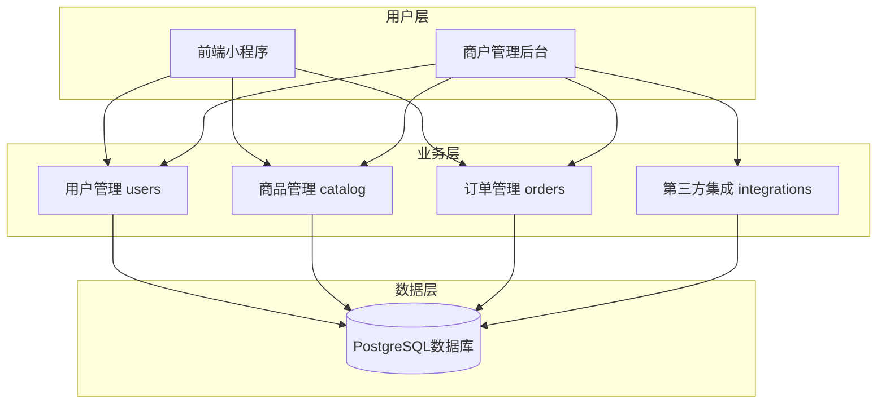

**图表来源**
- [backend/users/models.py](file://backend/users/models.py#L1-L95)
- [backend/catalog/models.py](file://backend/catalog/models.py#L1-L312)
- [backend/orders/models.py](file://backend/orders/models.py#L1-L322)
- [backend/integrations/models.py](file://backend/integrations/models.py#L1-L150)

## 核心实体模型

### User模型 - 用户实体

User模型是系统的核心身份实体，支持微信小程序和管理员两种用户类型。

#### 关键字段设计

| 字段名 | 类型 | 约束 | 设计意图 |
|--------|------|------|----------|
| `openid` | CharField(64) | unique, nullable | 微信小程序用户唯一标识，支持匿名用户 |
| `username` | CharField(150) | unique, nullable | Django认证用户名，自动生成唯一值 |
| `user_type` | CharField(20) | choices: wechat/admin | 用户类型区分，支持多角色体系 |
| `last_login_at` | DateTimeField | nullable | 登录时间记录，支持用户活跃度分析 |
| `avatar_url` | URLField(200) | default gravatar | 头像链接，支持个性化界面 |
| `phone` | CharField(20) | nullable | 手机号码，支持营销和通知 |
| `email` | EmailField | nullable | 电子邮箱，支持账户找回和通知 |

#### 用户类型设计

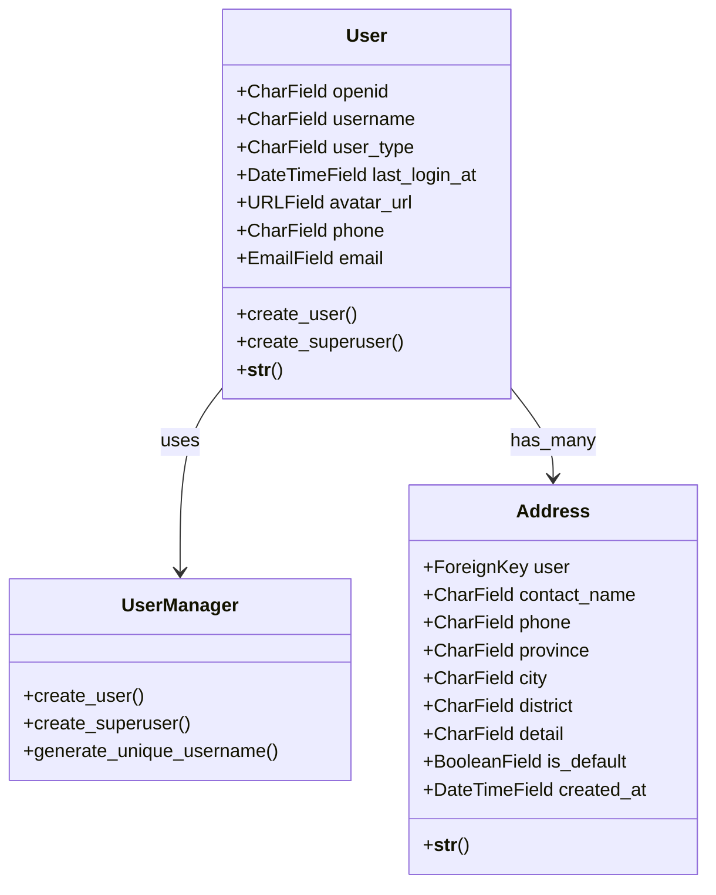

**图表来源**
- [backend/users/models.py](file://backend/users/models.py#L31-L95)

**章节来源**
- [backend/users/models.py](file://backend/users/models.py#L31-L95)

### Product模型 - 商品实体

Product模型是商品管理的核心实体，支持本地商品和海尔API商品两种来源。

#### 关键属性设计

| 属性名 | 类型 | 默认值 | 设计意图 |
|--------|------|--------|----------|
| `price` | Decimal(10,2) | - | 商品售价，支持精确到分 |
| `stock` | PositiveIntegerField | 0 | 库存数量，支持实时库存管理 |
| `sales_count` | PositiveIntegerField | 0 | 销售数量，用于销量统计 |
| `is_active` | BooleanField | True | 上架状态，控制商品可见性 |
| `source` | CharField(20) | local | 商品来源(local/haier) |
| `is_sales` | CharField(1) | '1' | 海尔可采状态(1可采,0不可采) |
| `view_count` | PositiveIntegerField | 0 | 浏览次数，用于热度分析 |

#### 商品来源策略

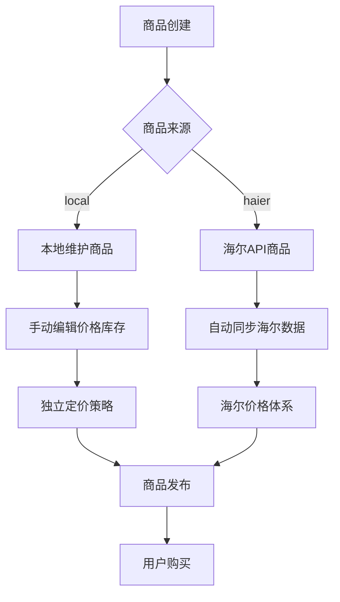

**图表来源**
- [backend/catalog/models.py](file://backend/catalog/models.py#L43-L312)

**章节来源**
- [backend/catalog/models.py](file://backend/catalog/models.py#L43-L312)

### Order模型 - 订单实体

Order模型实现了完整的电商订单生命周期管理，包含状态机驱动的状态流转。

#### 订单状态机设计

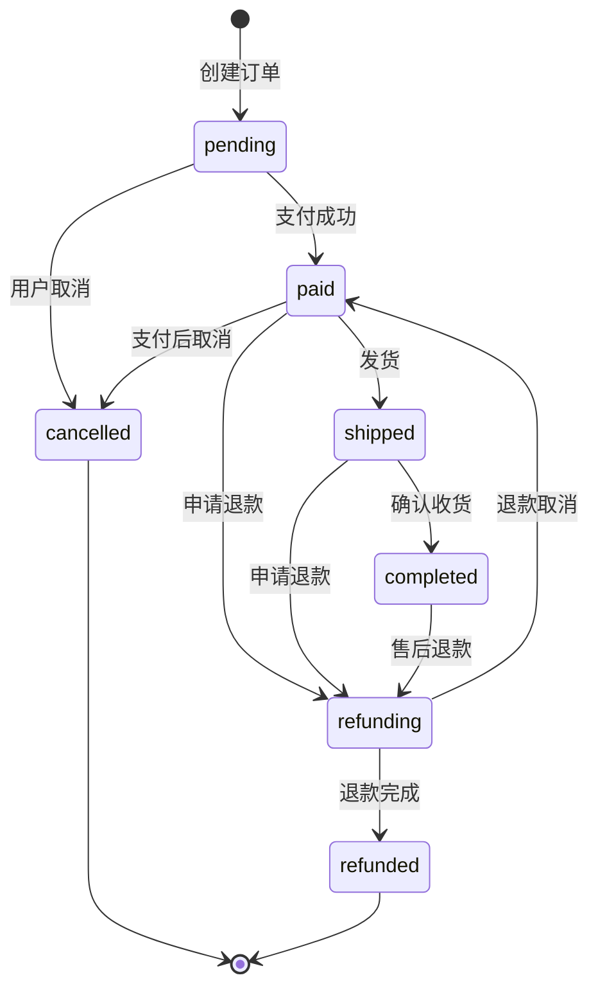

**图表来源**
- [backend/orders/state_machine.py](file://backend/orders/state_machine.py#L34-L57)

#### 订单金额计算逻辑

| 字段 | 计算方式 | 业务意义 |
|------|----------|----------|
| `total_amount` | `product.price * quantity` | 商品总价 |
| `discount_amount` | `total_amount - actual_amount` | 折扣优惠金额 |
| `actual_amount` | `total_amount - discount_amount` | 实际支付金额 |

**章节来源**
- [backend/orders/models.py](file://backend/orders/models.py#L13-L322)
- [backend/orders/state_machine.py](file://backend/orders/state_machine.py#L1-L289)

### Payment模型 - 支付实体

Payment模型管理订单的支付过程，支持多种支付方式和状态跟踪。

#### 支付状态流转

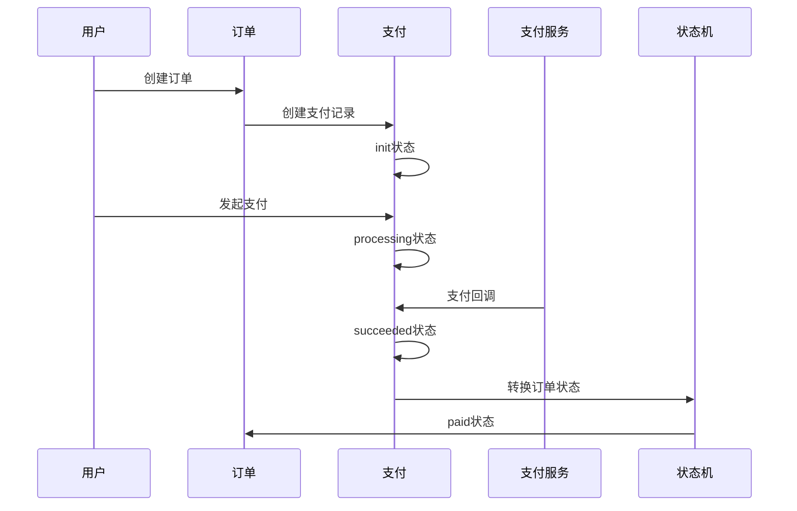

**图表来源**
- [backend/orders/models.py](file://backend/orders/models.py#L186-L235)

**章节来源**
- [backend/orders/models.py](file://backend/orders/models.py#L186-L235)

## 实体关系架构

### 主要实体关系图

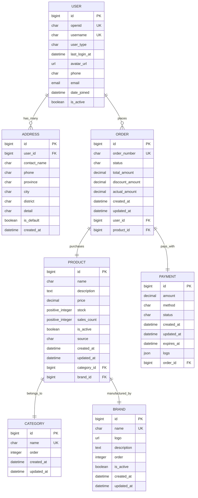

**图表来源**
- [backend/users/models.py](file://backend/users/models.py#L77-L95)
- [backend/catalog/models.py](file://backend/catalog/models.py#L5-L312)
- [backend/orders/models.py](file://backend/orders/models.py#L13-L322)

### 多对多关系设计

系统使用中间表实现复杂的多对多关系：

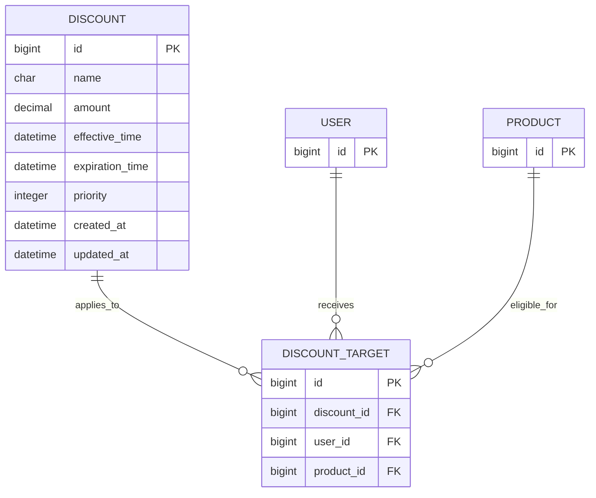

**图表来源**
- [backend/orders/models.py](file://backend/orders/models.py#L238-L290)

**章节来源**
- [backend/users/models.py](file://backend/users/models.py#L77-L95)
- [backend/catalog/models.py](file://backend/catalog/models.py#L5-L312)
- [backend/orders/models.py](file://backend/orders/models.py#L13-L322)

## 模型演进历程

### User模型演进

从初始版本到当前版本，User模型经历了多次重要演进：

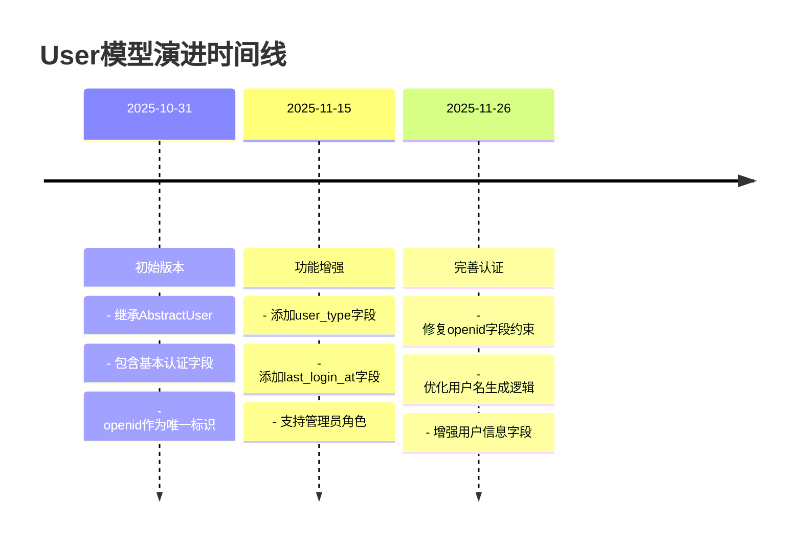

**图表来源**
- [backend/users/migrations/0001_initial.py](file://backend/users/migrations/0001_initial.py#L1-L41)
- [backend/users/migrations/0009_user_last_login_at_user_user_type_alter_user_openid.py](file://backend/users/migrations/0009_user_last_login_at_user_user_type_alter_user_openid.py#L1-L29)

### Product模型演进

Product模型从基础的商品信息扩展到完整的商品管理体系：

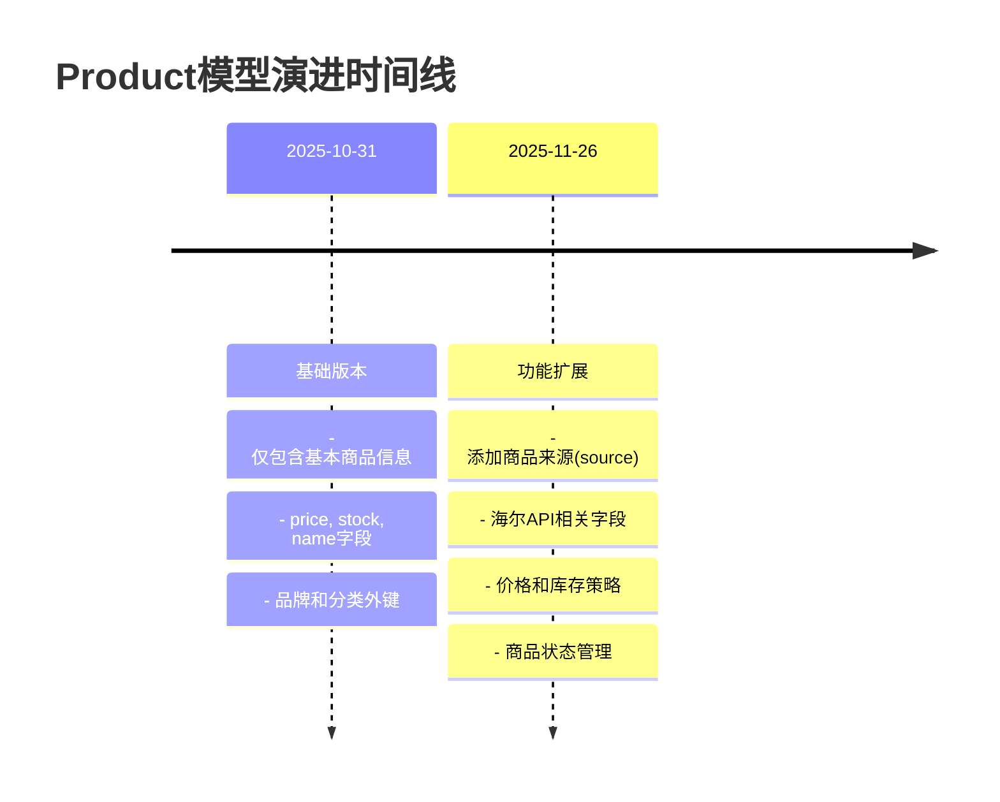

**图表来源**
- [backend/catalog/migrations/0001_initial.py](file://backend/catalog/migrations/0001_initial.py#L1-L40)
- [backend/catalog/migrations/0015_product_source.py](file://backend/catalog/migrations/0015_product_source.py#L1-L19)

### Order模型演进

Order模型经历了从简单订单到复杂业务流程的演进：

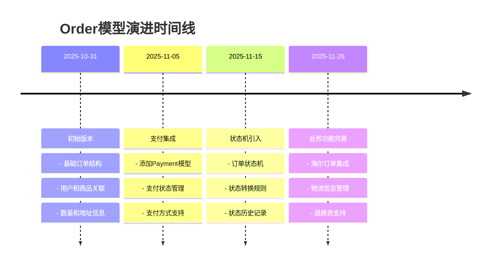

**图表来源**
- [backend/orders/migrations/0001_initial.py](file://backend/orders/migrations/0001_initial.py#L1-L32)
- [backend/orders/migrations/0005_payment.py](file://backend/orders/migrations/0005_payment.py#L1-L33)

**章节来源**
- [backend/users/migrations/0001_initial.py](file://backend/users/migrations/0001_initial.py#L1-L41)
- [backend/catalog/migrations/0001_initial.py](file://backend/catalog/migrations/0001_initial.py#L1-L40)
- [backend/orders/migrations/0001_initial.py](file://backend/orders/migrations/0001_initial.py#L1-L32)

## 状态机设计

### 订单状态机实现

系统采用状态机模式严格管理订单状态流转，确保业务逻辑的正确性：

#### 状态转换规则

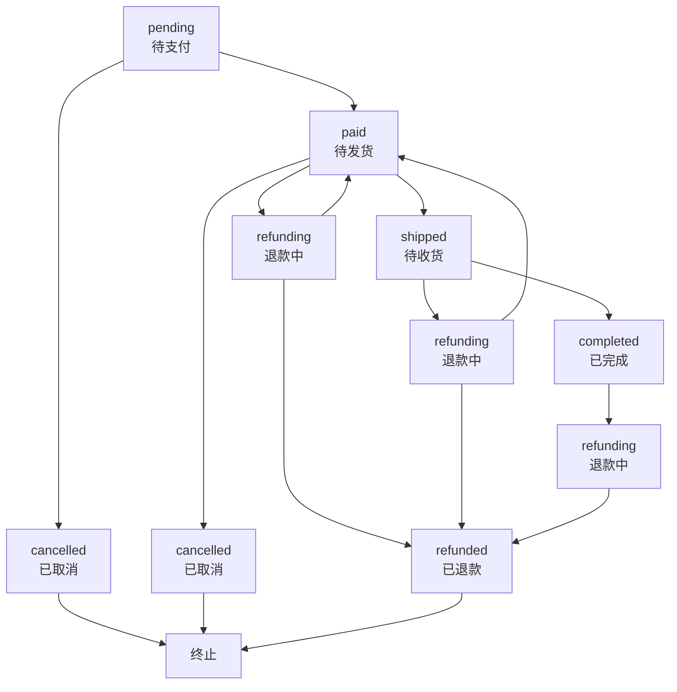

**图表来源**
- [backend/orders/state_machine.py](file://backend/orders/state_machine.py#L34-L57)

#### 状态转换验证机制

状态机提供了严格的转换验证，防止非法状态流转：

```python
# 状态转换验证示例
if not OrderStateMachine.can_transition(current_status, target_status):
    raise ValueError(f"不允许从状态 '{current_status}' 转换到 '{target_status}'")
```

**章节来源**
- [backend/orders/state_machine.py](file://backend/orders/state_machine.py#L1-L289)

### 支付状态机

支付模块同样采用状态机管理支付流程：

#### 支付状态流转

| 初始状态 | 目标状态 | 触发条件 | 业务动作 |
|----------|----------|----------|----------|
| init | processing | 用户发起支付 | 开始支付流程 |
| processing | succeeded | 支付成功回调 | 更新订单状态 |
| processing | failed | 支付失败回调 | 记录失败原因 |
| processing | expired | 支付超时 | 自动取消订单 |
| succeeded | - | 不允许转换 | 支付成功后保持成功状态 |

**章节来源**
- [backend/orders/models.py](file://backend/orders/models.py#L186-L235)

## 数据完整性约束

### 外键约束设计

系统通过外键约束确保数据一致性：

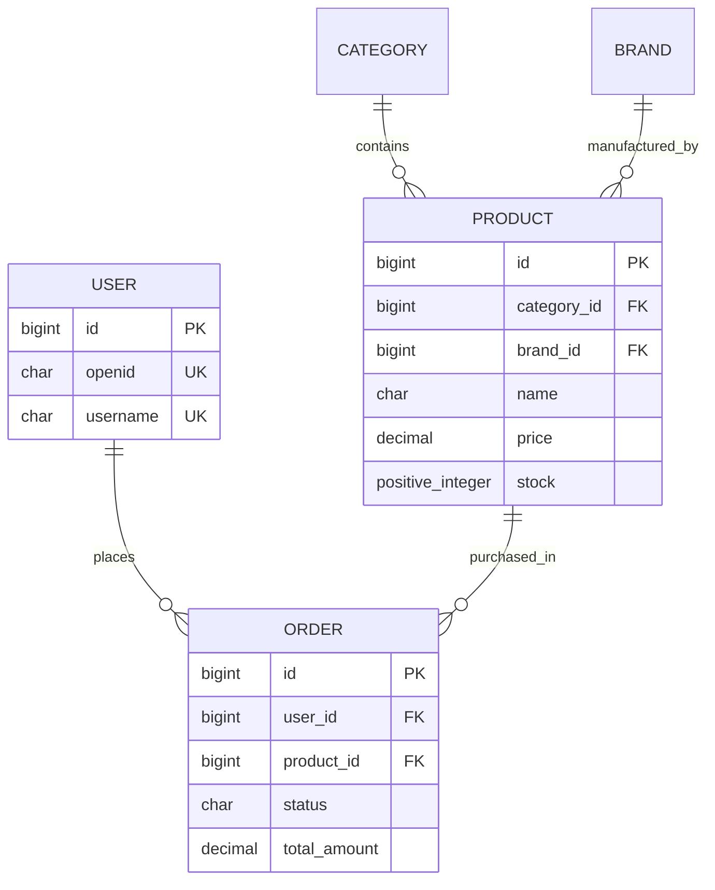

**图表来源**
- [backend/users/models.py](file://backend/users/models.py#L77-L95)
- [backend/catalog/models.py](file://backend/catalog/models.py#L47-L50)
- [backend/orders/models.py](file://backend/orders/models.py#L28-L30)

### 索引优化策略

各模型都建立了针对性的索引以提升查询性能：

#### Product模型索引策略

| 索引字段 | 类型 | 用途 |
|----------|------|------|
| `is_active, -sales_count` | 复合索引 | 热销商品查询 |
| `is_active, -view_count` | 复合索引 | 热门商品推荐 |
| `category, is_active` | 复合索引 | 分类商品筛选 |
| `brand, is_active` | 复合索引 | 品牌商品筛选 |
| `product_code` | 单列索引 | 海尔商品匹配 |

#### Order模型索引策略

| 索引字段 | 类型 | 用途 |
|----------|------|------|
| `status` | 单列索引 | 订单状态统计 |
| `created_at` | 单列索引 | 时间序列查询 |
| `user` | 单列索引 | 用户订单查询 |
| `haier_order_no` | 单列索引 | 海尔订单关联 |

**章节来源**
- [backend/catalog/models.py](file://backend/catalog/models.py#L105-L113)
- [backend/orders/models.py](file://backend/orders/models.py#L75-L81)

## 性能优化考虑

### 缓存策略

系统在数据分析模块实现了多层缓存策略：

#### 缓存层级设计

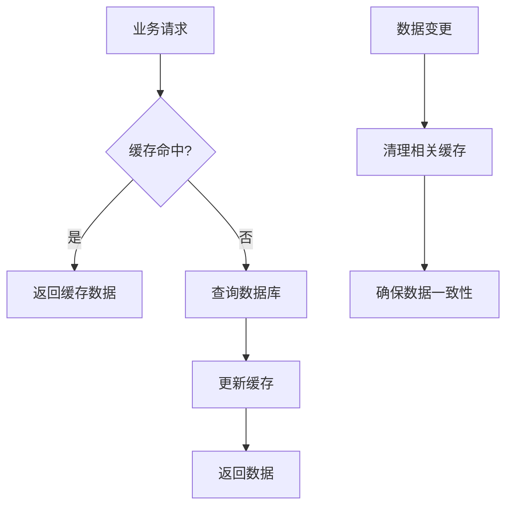

**图表来源**
- [backend/orders/analytics.py](file://backend/orders/analytics.py#L17-L322)

#### 缓存失效机制

系统实现了智能的缓存失效机制，在数据变更时自动清理相关缓存：

```python
# 数据变更时的缓存清理
@classmethod
def on_order_status_changed(cls, order_id: int):
    cls.invalidate_cache()  # 清除所有统计缓存
```

**章节来源**
- [backend/orders/analytics.py](file://backend/orders/analytics.py#L17-L322)

### 查询优化

#### 批量操作优化

系统支持批量订单创建和支付处理，减少数据库交互次数：

```python
# 批量订单处理示例
with transaction.atomic():
    for product_id, quantity in product_quantities.items():
        order = create_order(user, product_id, quantity)
        payment = Payment.create_for_order(order)
```

#### 聚合查询优化

数据分析模块使用聚合查询减少数据传输：

```python
# 销售汇总查询
result = queryset.aggregate(
    total_orders=Count('id'),
    total_amount=Sum('total_amount'),
    avg_amount=Avg('total_amount')
)
```

**章节来源**
- [backend/orders/analytics.py](file://backend/orders/analytics.py#L24-L72)

## 总结

本文档详细描述了电商业务系统的核心数据模型设计，涵盖了：

1. **核心实体设计**：User、Product、Order、Payment等实体的字段设计和业务含义
2. **关系映射**：通过ForeignKey、ManyToManyField等实现的复杂业务关系
3. **状态机驱动**：订单和支付的状态流转管理
4. **模型演进**：从基础功能到完整业务流程的演进历程
5. **性能优化**：索引设计、缓存策略和查询优化
6. **数据完整性**：外键约束和业务规则保证

该数据模型设计充分考虑了电商业务的复杂性和扩展性需求，通过合理的实体设计、严格的状态管理和完善的性能优化策略，为系统的稳定运行提供了坚实的数据基础。同时，模块化的架构设计也为未来的功能扩展预留了充足的空间。