# 用户模型

<cite>
**本文档引用的文件**
- [backend/users/models.py](file://backend/users/models.py)
- [backend/users/migrations/0001_initial.py](file://backend/users/migrations/0001_initial.py)
- [backend/users/migrations/0009_user_last_login_at_user_user_type_alter_user_openid.py](file://backend/users/migrations/0009_user_last_login_at_user_user_type_alter_user_openid.py)
- [backend/users/admin.py](file://backend/users/admin.py)
- [backend/users/serializers.py](file://backend/users/serializers.py)
- [backend/users/services.py](file://backend/users/services.py)
- [backend/users/views.py](file://backend/users/views.py)
- [backend/orders/models.py](file://backend/orders/models.py)
</cite>

## 目录
1. [简介](#简介)
2. [项目结构](#项目结构)
3. [核心组件](#核心组件)
4. [架构概览](#架构概览)
5. [详细组件分析](#详细组件分析)
6. [迁移演进分析](#迁移演进分析)
7. [依赖关系分析](#依赖关系分析)
8. [性能考虑](#性能考虑)
9. [故障排除指南](#故障排除指南)
10. [结论](#结论)

## 简介

本文档详细描述了电商业务小程序中用户数据模型的设计与实现。该系统采用Django框架构建，实现了基于微信小程序的双认证机制，支持管理员和普通用户的差异化管理。用户模型继承自Django的AbstractUser，扩展了openid、用户类型、最后登录时间等关键字段，为整个电商系统的用户管理提供了坚实的基础。

## 项目结构

用户模块位于`backend/users/`目录下，包含以下核心文件：

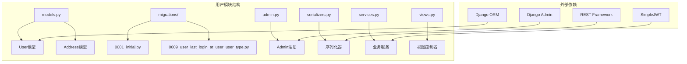

**图表来源**
- [backend/users/models.py](file://backend/users/models.py#L1-L95)
- [backend/users/migrations/0001_initial.py](file://backend/users/migrations/0001_initial.py#L1-L41)

**章节来源**
- [backend/users/models.py](file://backend/users/models.py#L1-L95)
- [backend/users/migrations/0001_initial.py](file://backend/users/migrations/0001_initial.py#L1-L41)

## 核心组件

### User模型设计

User模型是整个用户系统的核心，继承自Django的AbstractUser类，扩展了微信小程序认证所需的特殊字段：

#### 主要字段说明

| 字段名 | 数据类型 | 业务含义 | 默认值 | 约束条件 |
|--------|----------|----------|--------|----------|
| openid | CharField(64) | 微信小程序唯一标识 | null | 唯一，可为空 |
| username | CharField(150) | 用户名 | 自动生成 | 唯一，可为空 |
| avatar_url | URLField(200) | 头像链接 | Gravatar默认头像 | 可为空 |
| phone | CharField(20) | 手机号码 | null | 可为空 |
| user_type | CharField(20) | 用户类型 | 'wechat' | 枚举：wechat/admin |
| last_login_at | DateTimeField | 最后登录时间 | null | 可为空 |

#### 自定义用户管理器

系统实现了专门的UserManager，支持两种认证模式：

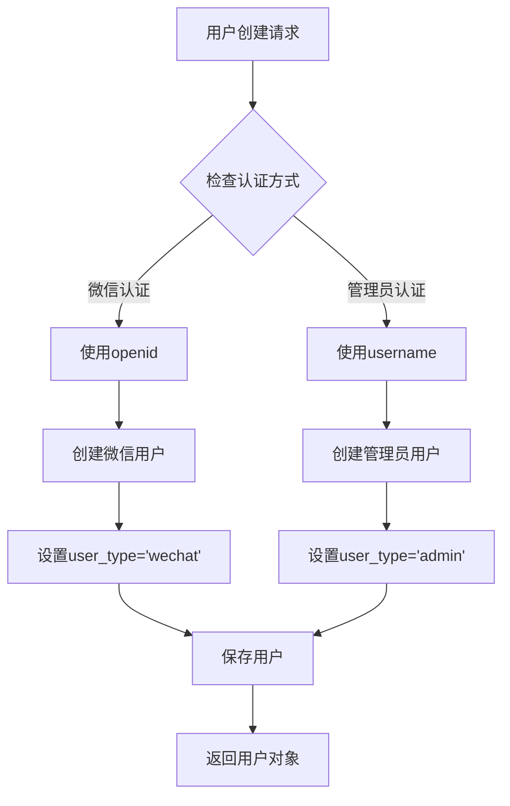

**图表来源**
- [backend/users/models.py](file://backend/users/models.py#L6-L22)
- [backend/users/services.py](file://backend/users/services.py#L5-L6)

**章节来源**
- [backend/users/models.py](file://backend/users/models.py#L31-L76)

### Address模型设计

Address模型与User模型建立了一对多的关系，用于存储用户的收货地址信息：

#### 地址字段结构

| 字段名 | 数据类型 | 业务含义 | 约束条件 |
|--------|----------|----------|----------|
| user | ForeignKey | 关联用户 | CASCADE删除 |
| contact_name | CharField(50) | 联系人姓名 | 必填 |
| phone | CharField(20) | 联系电话 | 必填 |
| province | CharField(20) | 省份 | 必填 |
| city | CharField(20) | 城市 | 必填 |
| district | CharField(20) | 区县 | 必填 |
| detail | CharField(200) | 详细地址 | 必填 |
| is_default | BooleanField | 是否默认地址 | 默认False |
| created_at | DateTimeField | 创建时间 | auto_now_add |

**章节来源**
- [backend/users/models.py](file://backend/users/models.py#L77-L95)

## 架构概览

系统采用分层架构设计，清晰分离了数据模型、业务逻辑和服务接口：

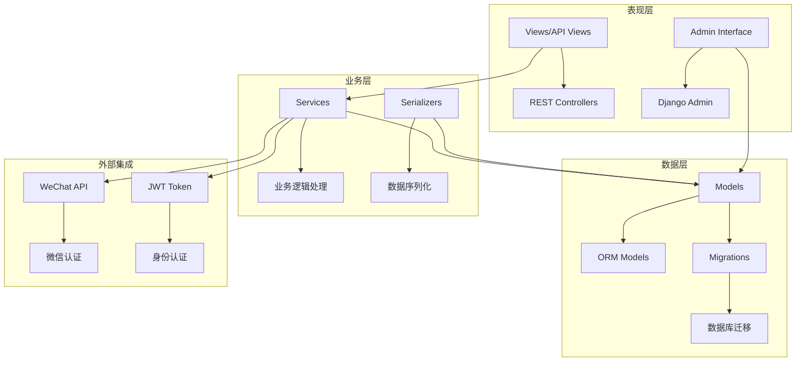

**图表来源**
- [backend/users/views.py](file://backend/users/views.py#L1-L200)
- [backend/users/services.py](file://backend/users/services.py#L1-L55)
- [backend/users/models.py](file://backend/users/models.py#L1-L95)

## 详细组件分析

### User模型详细分析

#### 类继承关系

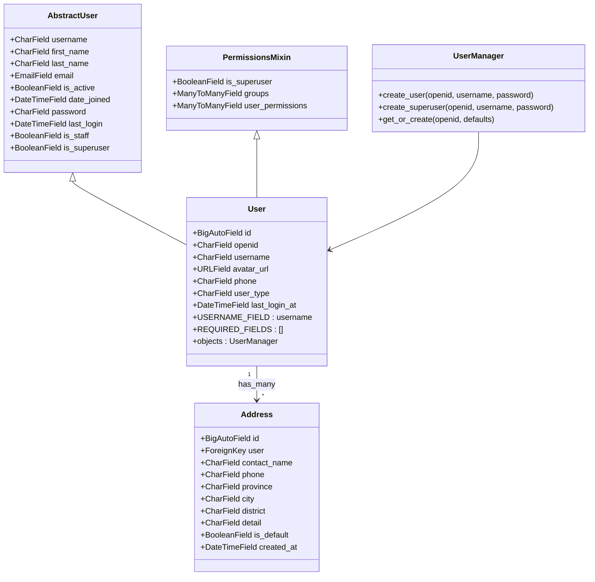

**图表来源**
- [backend/users/models.py](file://backend/users/models.py#L31-L95)

#### 认证机制设计

系统实现了双重认证机制，支持微信小程序和传统用户名密码两种登录方式：

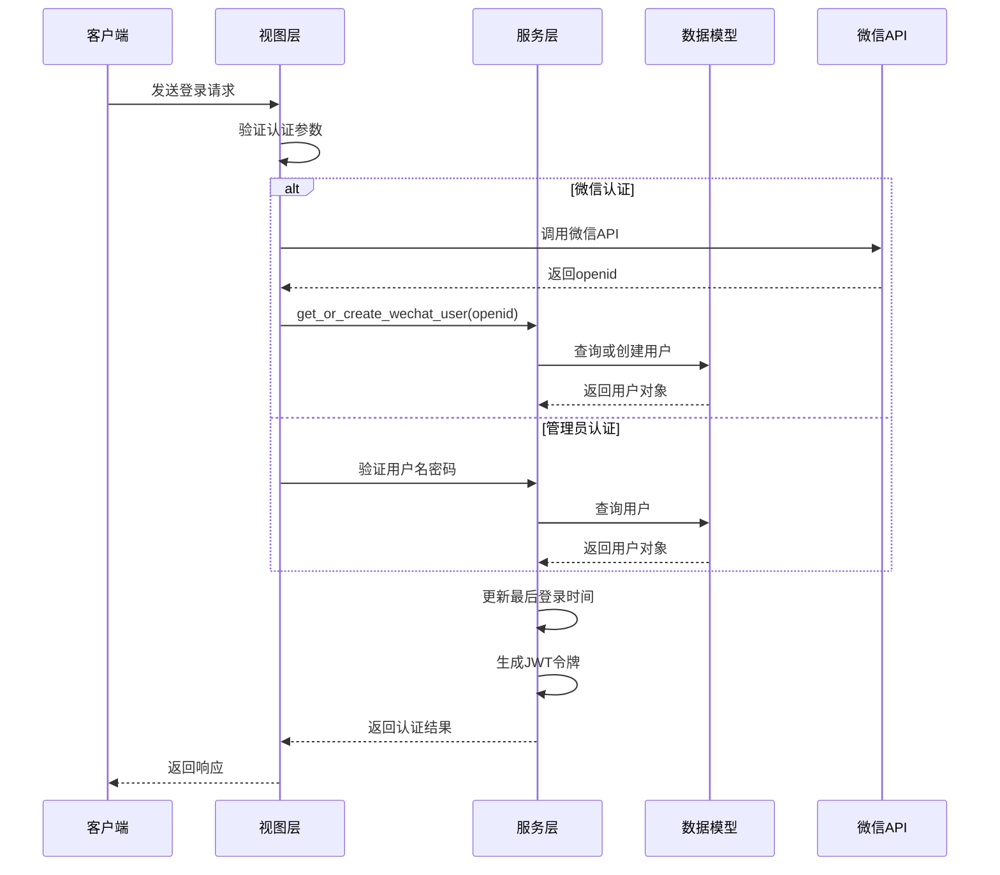

**图表来源**
- [backend/users/views.py](file://backend/users/views.py#L22-L154)
- [backend/users/services.py](file://backend/users/services.py#L5-L20)

**章节来源**
- [backend/users/models.py](file://backend/users/models.py#L31-L76)
- [backend/users/views.py](file://backend/users/views.py#L22-L154)

### Address模型详细分析

#### 外键关联设计

Address模型与User模型建立了标准的一对多关系，通过外键约束确保数据完整性：

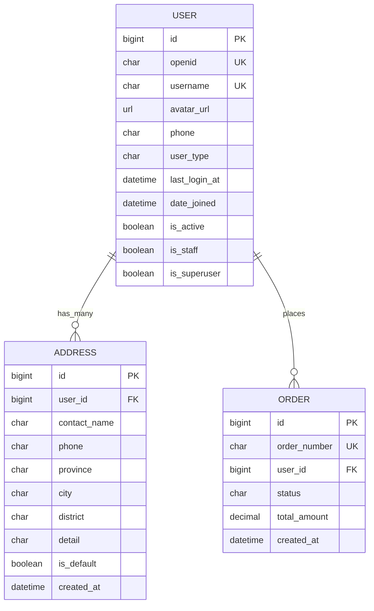

**图表来源**
- [backend/users/models.py](file://backend/users/models.py#L77-L95)
- [backend/orders/models.py](file://backend/orders/models.py#L27-L28)

#### 地址管理业务逻辑

系统实现了智能的地址管理功能，包括默认地址自动切换和验证机制：

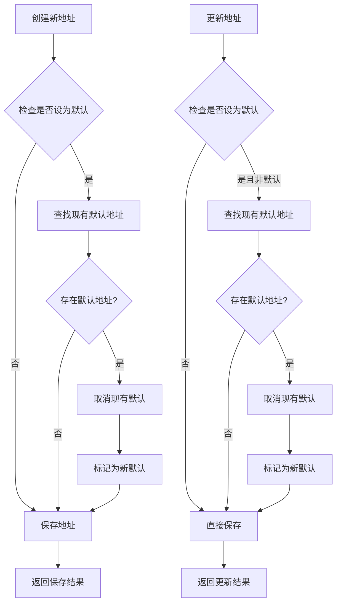

**图表来源**
- [backend/users/serializers.py](file://backend/users/serializers.py#L78-L91)

**章节来源**
- [backend/users/models.py](file://backend/users/models.py#L77-L95)
- [backend/users/serializers.py](file://backend/users/serializers.py#L56-L91)

### 序列化器设计

#### 用户序列化器层次结构

系统实现了多层次的用户数据序列化器，满足不同场景的需求：

| 序列化器 | 用途 | 包含字段 | 特殊功能 |
|----------|------|----------|----------|
| UserSerializer | 完整用户信息 | 所有字段 + 统计字段 | 订单统计缓存 |
| UserProfileSerializer | 用户资料 | 基本个人信息 | 密码验证 |
| AddressSerializer | 收货地址 | 地址详情 | 默认地址管理 |

**章节来源**
- [backend/users/serializers.py](file://backend/users/serializers.py#L6-L91)

### 服务层业务逻辑

#### 用户管理服务函数

系统提供了完整的用户管理服务，包括用户创建、权限管理和认证支持：

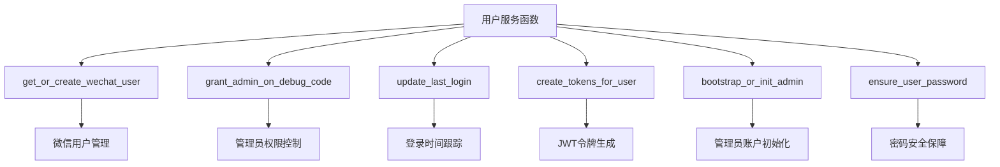

**图表来源**
- [backend/users/services.py](file://backend/users/services.py#L5-L55)

**章节来源**
- [backend/users/services.py](file://backend/users/services.py#L1-L55)

## 迁移演进分析

### 初始迁移(0001_initial.py)

初始迁移创建了基础的用户模型，包含了Django标准用户模型的所有字段：

#### 初始字段结构

| 字段名 | 类型 | 约束 | 说明 |
|--------|------|------|------|
| password | CharField | max_length=128 | 密码字段 |
| last_login | DateTimeField | null=True | 最后登录时间 |
| is_superuser | BooleanField | default=False | 超级用户标志 |
| first_name | CharField | max_length=150, blank=True | 名字 |
| last_name | CharField | max_length=150, blank=True | 姓氏 |
| email | EmailField | max_length=254, blank=True | 电子邮箱 |
| is_staff | BooleanField | default=False | 管理员标志 |
| is_active | BooleanField | default=True | 活跃状态 |
| date_joined | DateTimeField | default=timezone.now | 注册时间 |
| id | BigAutoField | primary_key=True | 主键 |
| openid | CharField | max_length=64, unique=True | 微信openid |
| username | CharField | max_length=150, unique=True, null=True | 用户名 |

**章节来源**
- [backend/users/migrations/0001_initial.py](file://backend/users/migrations/0001_initial.py#L16-L33)

### 关键迁移演进(0009_user_last_login_at_user_user_type.py)

第9次迁移引入了两个关键字段，标志着用户模型的重大升级：

#### 新增字段详解

1. **last_login_at字段**
   - 类型：DateTimeField
   - 约束：null=True, blank=True
   - 用途：精确记录用户的最后登录时间
   - 业务价值：支持用户活跃度分析和登录统计

2. **user_type字段**
   - 类型：CharField
   - 选项：('wechat', '微信用户'), ('admin', '管理员')
   - 默认值：'wechat'
   - 用途：区分用户认证类型
   - 业务价值：支持双认证机制和权限管理

3. **openid字段修改**
   - 约束变更：从必需变为可选（null=True）
   - 原因：支持管理员用户无需openid的情况

**章节来源**
- [backend/users/migrations/0009_user_last_login_at_user_user_type_alter_user_openid.py](file://backend/users/migrations/0009_user_last_login_at_user_user_type_alter_user_openid.py#L13-L27)

### 迁移演进时间线

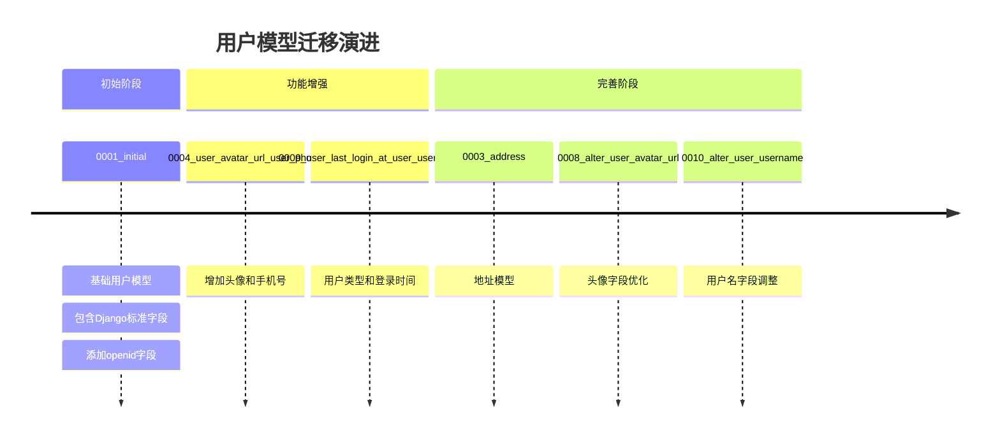

**图表来源**
- [backend/users/migrations/0001_initial.py](file://backend/users/migrations/0001_initial.py#L1-L41)
- [backend/users/migrations/0009_user_last_login_at_user_user_type_alter_user_openid.py](file://backend/users/migrations/0009_user_last_login_at_user_user_type_alter_user_openid.py#L1-L29)

## 依赖关系分析

### 内部模块依赖

系统各模块间形成了清晰的依赖关系：

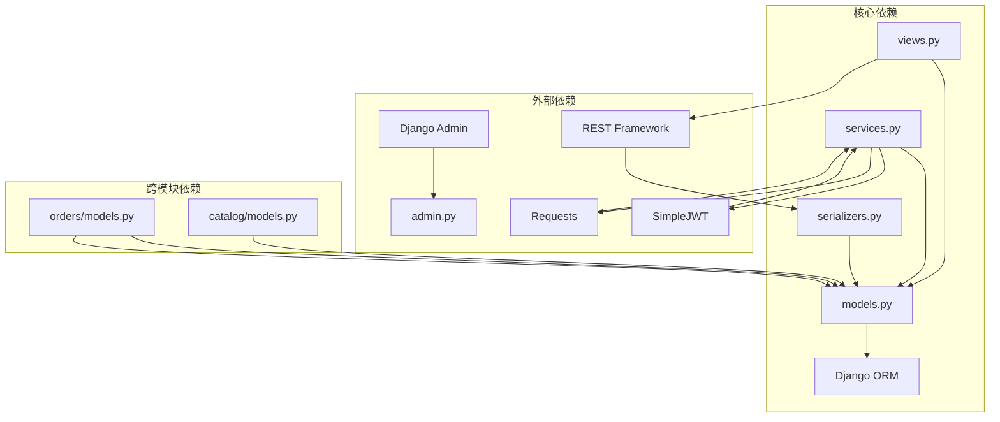

**图表来源**
- [backend/users/models.py](file://backend/users/models.py#L1-L3)
- [backend/users/views.py](file://backend/users/views.py#L1-L18)
- [backend/users/serializers.py](file://backend/users/serializers.py#L1-L4)

### 外部系统集成

#### 微信小程序集成

系统与微信小程序平台建立了深度集成：

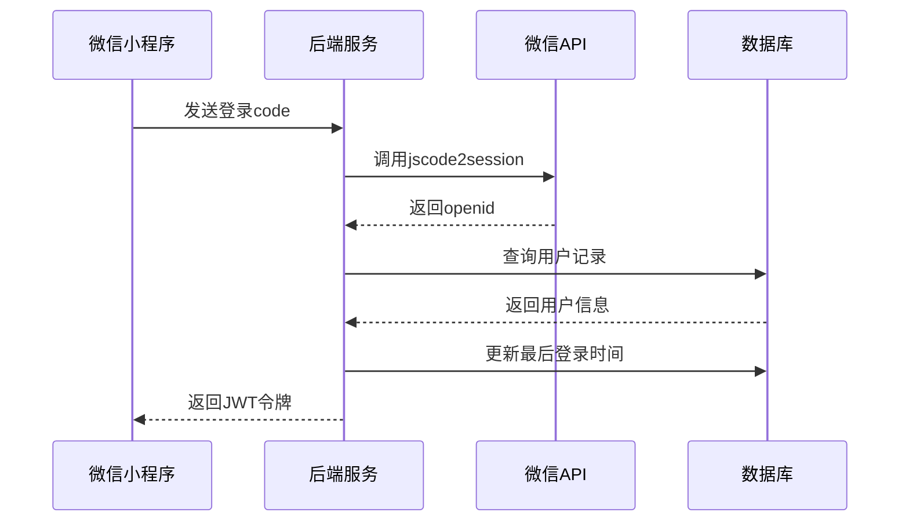

**图表来源**
- [backend/users/views.py](file://backend/users/views.py#L22-L154)

**章节来源**
- [backend/users/views.py](file://backend/users/views.py#L22-L154)
- [backend/users/services.py](file://backend/users/services.py#L1-L55)

## 性能考虑

### 查询优化策略

#### 索引设计

用户模型的关键字段都设置了适当的索引：

| 字段 | 索引类型 | 用途 |
|------|----------|------|
| openid | 唯一索引 | 微信认证快速查找 |
| username | 唯一索引 | 用户名查找 |
| id | 主键索引 | 主键查询优化 |
| user_type | 普通索引 | 用户类型筛选 |
| last_login_at | 普通索引 | 登录时间排序 |

#### 缓存策略

系统实现了智能的缓存机制来提升性能：

```mermaid
flowchart TD
A[用户查询] --> B{检查缓存}
B --> |命中| C[返回缓存数据]
B --> |未命中| D[查询数据库]
D --> E[更新缓存]
E --> F[返回数据]
G[订单统计] --> H[缓存键:user_orders_count_{user_id}]
I[完成订单统计] --> J[缓存键:user_completed_orders_count_{user_id}]
H --> K[缓存有效期: 5分钟]
J --> K
```

**图表来源**
- [backend/users/serializers.py](file://backend/users/serializers.py#L21-L41)

### 批量操作优化

对于大量用户的批量操作，系统采用了以下优化策略：

1. **预取查询**：使用`select_related`和`prefetch_related`减少数据库查询次数
2. **批量更新**：对于地址默认状态的修改，使用批量更新而非逐条更新
3. **事务管理**：在复杂操作中使用数据库事务保证数据一致性

## 故障排除指南

### 常见问题及解决方案

#### 用户认证问题

| 问题描述 | 可能原因 | 解决方案 |
|----------|----------|----------|
| 微信登录失败 | 微信API配置错误 | 检查WECHAT_APPID和WECHAT_SECRET |
| 用户名重复 | 并发创建用户 | 使用unique约束和重试机制 |
| 权限不足 | 用户类型配置错误 | 检查user_type字段设置 |
| 密码验证失败 | 密码未正确设置 | 使用set_password方法 |

#### 数据库迁移问题

| 问题描述 | 可能原因 | 解决方案 |
|----------|----------|----------|
| 迁移失败 | 字段约束冲突 | 检查字段定义和现有数据 |
| 性能问题 | 缺少索引 | 为常用查询字段添加索引 |
| 数据不一致 | 迁移顺序错误 | 重新运行相关迁移 |

#### 性能优化建议

1. **监控查询性能**：使用Django Debug Toolbar监控慢查询
2. **定期清理数据**：清理过期的登录记录和临时数据
3. **缓存策略优化**：根据实际使用情况调整缓存过期时间

**章节来源**
- [backend/users/services.py](file://backend/users/services.py#L8-L20)
- [backend/users/serializers.py](file://backend/users/serializers.py#L21-L41)

## 结论

电商业务小程序的用户数据模型设计体现了现代Web应用的最佳实践。通过继承Django的AbstractUser并扩展必要的字段，系统成功实现了微信小程序和传统认证方式的双轨制支持。关键特性包括：

1. **灵活的认证机制**：支持微信小程序openid和用户名密码两种认证方式
2. **完善的用户管理**：包含用户类型区分、权限控制和活跃度跟踪
3. **丰富的业务功能**：支持收货地址管理、订单关联和统计分析
4. **良好的扩展性**：模块化设计便于功能扩展和维护

该用户模型为整个电商系统奠定了坚实的数据基础，支持了从用户注册、登录到订单管理的完整业务流程。通过合理的迁移策略和性能优化措施，确保了系统的稳定性和可扩展性。