# 折扣模型

<cite>
**本文档引用的文件**
- [backend/orders/models.py](file://backend/orders/models.py)
- [backend/orders/migrations/0006_discount_discounttarget_discount_products_and_more.py](file://backend/orders/migrations/0006_discount_discounttarget_discount_products_and_more.py)
- [backend/orders/serializers.py](file://backend/orders/serializers.py)
- [backend/orders/views.py](file://backend/orders/views.py)
- [backend/orders/services.py](file://backend/orders/services.py)
- [backend/catalog/serializers.py](file://backend/catalog/serializers.py)
- [merchant/src/pages/Discounts/index.tsx](file://merchant/src/pages/Discounts/index.tsx)
- [frontend/src/components/ProductCard/index.tsx](file://frontend/src/components/ProductCard/index.tsx)
- [backend/orders/urls.py](file://backend/orders/urls.py)
</cite>

## 目录
1. [简介](#简介)
2. [核心模型设计](#核心模型设计)
3. [折扣计算机制](#折扣计算机制)
4. [商户后台管理](#商户后台管理)
5. [前端展示逻辑](#前端展示逻辑)
6. [缓存策略优化](#缓存策略优化)
7. [API接口设计](#api接口设计)
8. [性能优化分析](#性能优化分析)
9. [最佳实践指南](#最佳实践指南)

## 简介

折扣系统是电商业务中的核心功能模块，负责管理针对特定用户和商品的优惠策略。本系统采用灵活的多对多关联设计，支持复杂的折扣规则配置，包括生效时间、优先级、适用范围等维度的精细化控制。

系统主要包含三个核心模型：
- **Discount（折扣规则）**：定义折扣的基本属性和生效条件
- **DiscountTarget（折扣目标）**：建立用户-商品的关联关系
- **DiscountProduct（折扣商品）**：扩展的商品折扣信息

## 核心模型设计

### Discount模型架构

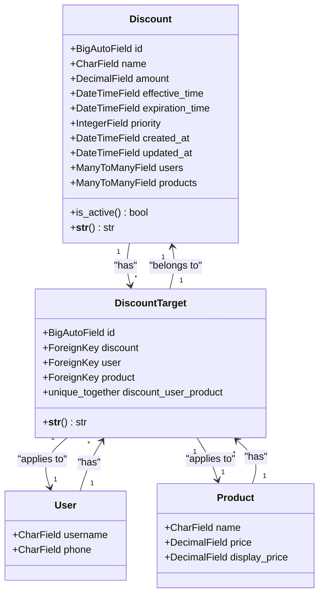

**图表来源**
- [backend/orders/models.py](file://backend/orders/models.py#L237-L290)

### Discount模型属性详解

| 字段名 | 类型 | 约束 | 说明 |
|--------|------|------|------|
| `id` | BigAutoField | 主键 | 折扣规则唯一标识 |
| `name` | CharField | max_length=100, blank=True | 折扣名称，用于管理识别 |
| `amount` | DecimalField | decimal_places=2, validators=[MinValueValidator(0)] | 折扣金额，支持小数精度 |
| `effective_time` | DateTimeField | 必填 | 折扣生效时间 |
| `expiration_time` | DateTimeField | 必填 | 折扣过期时间 |
| `priority` | IntegerField | default=0 | 优先级数值，数值越大优先级越高 |
| `created_at` | DateTimeField | auto_now_add=True | 创建时间 |
| `updated_at` | DateTimeField | auto_now=True | 更新时间 |

### DiscountTarget模型设计

DiscountTarget模型采用三元组设计，建立Discount、User和Product之间的多对多关系：

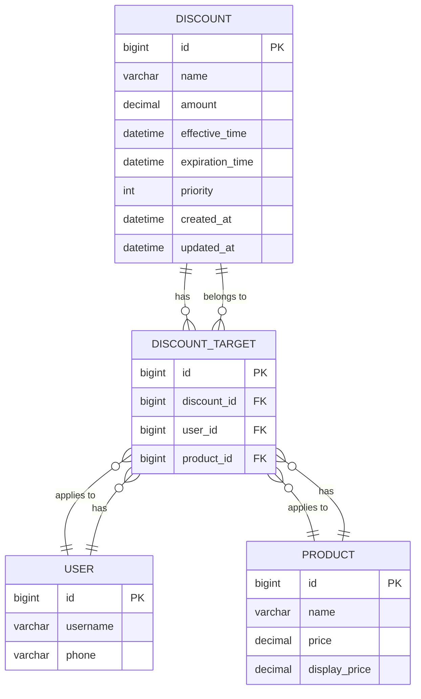

**图表来源**
- [backend/orders/migrations/0006_discount_discounttarget_discount_products_and_more.py](file://backend/orders/migrations/0006_discount_discounttarget_discount_products_and_more.py#L18-L69)

**章节来源**
- [backend/orders/models.py](file://backend/orders/models.py#L237-L290)
- [backend/orders/migrations/0006_discount_discounttarget_discount_products_and_more.py](file://backend/orders/migrations/0006_discount_discounttarget_discount_products_and_more.py#L18-L69)

## 折扣计算机制

### 优先级匹配算法

折扣计算采用双重优先级策略，确保最合适的折扣被应用：

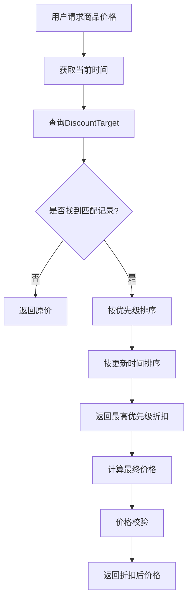

**图表来源**
- [backend/orders/services.py](file://backend/orders/services.py#L11-L41)

### 折扣金额计算逻辑

折扣金额计算遵循以下规则：

1. **基础价格获取**：优先使用`display_price`，否则使用`price`
2. **折扣金额限制**：确保折扣金额不超过基础价格
3. **最小值保护**：确保折扣金额不小于0
4. **优先级排序**：`-discount__priority` > `-discount__updated_at`

### 订单创建时的折扣应用

在订单创建过程中，系统会自动计算最优折扣：

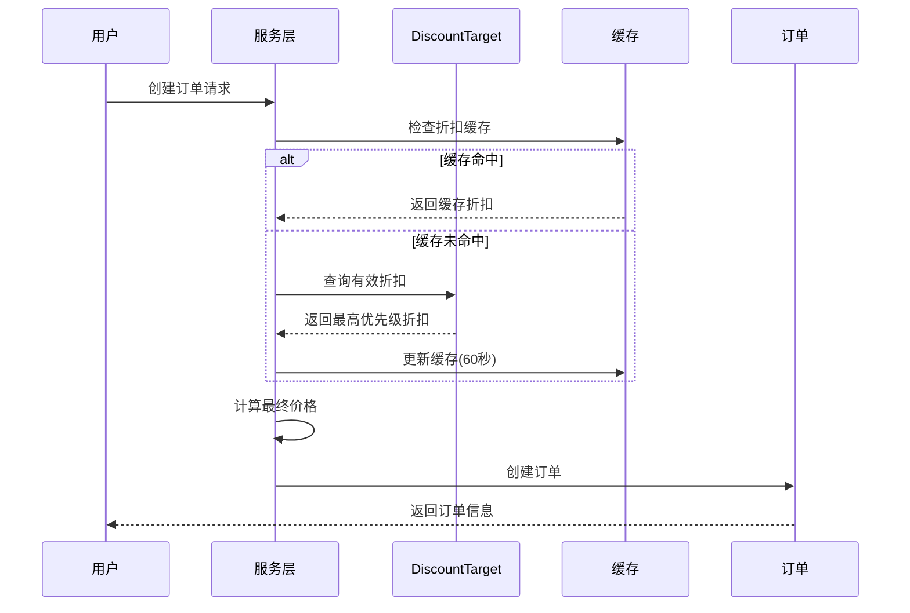

**图表来源**
- [backend/orders/services.py](file://backend/orders/services.py#L11-L41)
- [backend/orders/views.py](file://backend/orders/views.py#L258-L262)

**章节来源**
- [backend/orders/services.py](file://backend/orders/services.py#L11-L41)
- [backend/orders/views.py](file://backend/orders/views.py#L258-L262)

## 商户后台管理

### 后台界面架构

商户后台提供完整的折扣管理界面，支持实时查看、编辑和监控折扣状态：

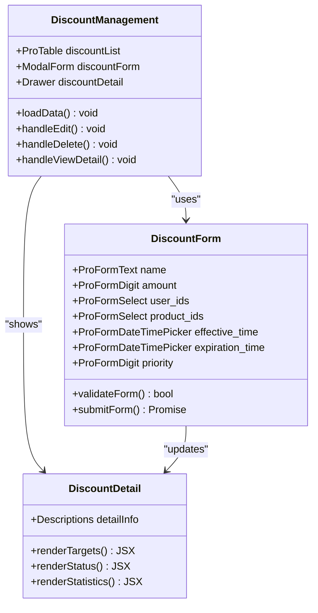

**图表来源**
- [merchant/src/pages/Discounts/index.tsx](file://merchant/src/pages/Discounts/index.tsx#L1-L368)

### 折扣状态监控

系统提供实时的状态监控功能：

| 状态 | 颜色 | 说明 |
|------|------|------|
| 生效中 | 绿色 | 当前时间在生效时间和过期时间之间 |
| 已失效 | 红色 | 当前时间已超过过期时间或未达到生效时间 |

### 批量操作功能

商户后台支持多种批量操作：

1. **批量创建折扣**：为指定用户群体制作商品折扣
2. **批量更新适用范围**：快速调整折扣的适用用户和商品
3. **批量查询折扣**：获取一组商品的当前有效折扣

**章节来源**
- [merchant/src/pages/Discounts/index.tsx](file://merchant/src/pages/Discounts/index.tsx#L1-L368)

## 前端展示逻辑

### 商品卡片折扣显示

前端通过ProductCard组件展示折扣信息：

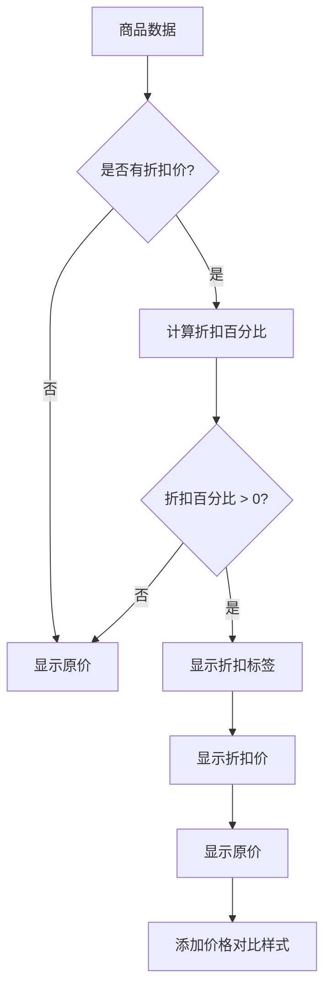

**图表来源**
- [frontend/src/components/ProductCard/index.tsx](file://frontend/src/components/ProductCard/index.tsx#L1-L84)

### 折扣标签渲染规则

1. **折扣百分比计算**：`(1 - discounted_price / original_price) * 100`
2. **显示条件**：只有当折扣百分比大于0时才显示
3. **样式设计**：采用醒目的红色背景和白色文字
4. **价格对比**：同时显示折扣价和原价，形成视觉对比

### 商品序列化中的折扣计算

在商品序列化过程中，系统会动态计算折扣价：

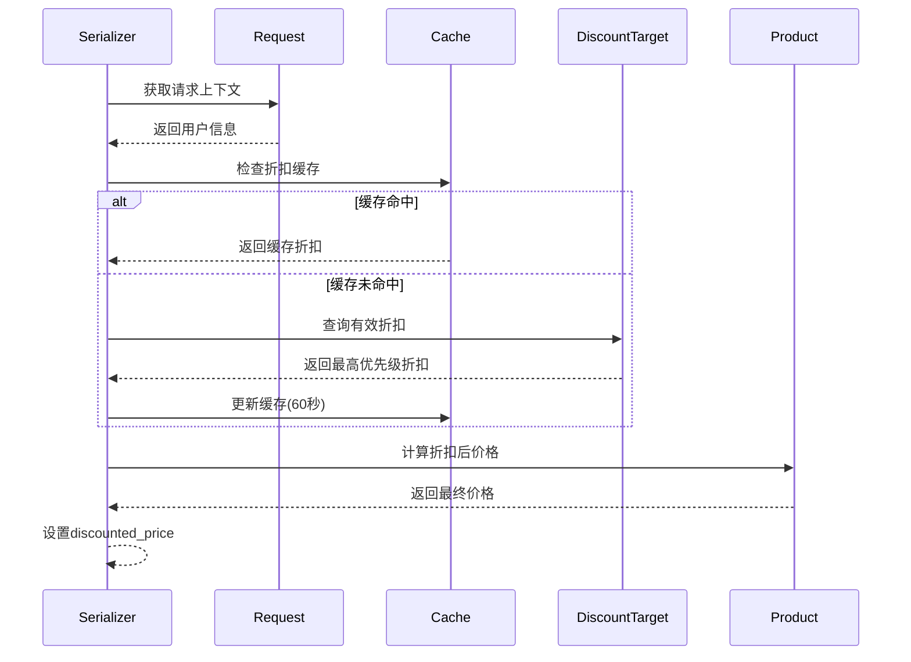

**图表来源**
- [backend/catalog/serializers.py](file://backend/catalog/serializers.py#L211-L251)

**章节来源**
- [frontend/src/components/ProductCard/index.tsx](file://frontend/src/components/ProductCard/index.tsx#L1-L84)
- [backend/catalog/serializers.py](file://backend/catalog/serializers.py#L211-L251)

## 缓存策略优化

### 多层缓存架构

系统采用多层缓存策略来优化折扣查询性能：

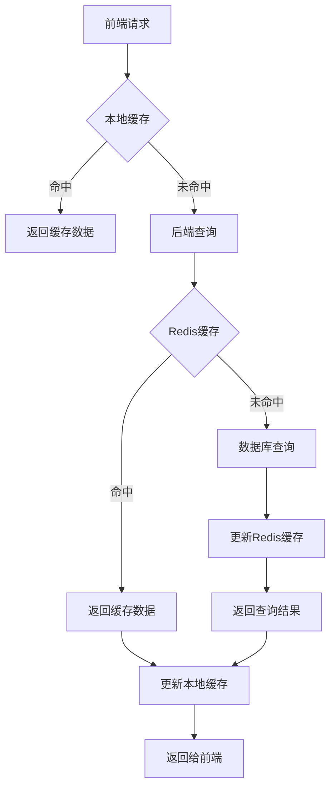

### 缓存键设计

缓存键采用统一格式：`discount:{user_id}:{product_id}`

| 组件 | TTL | 作用 |
|------|-----|------|
| Redis缓存 | 60秒 | 减少数据库查询次数 |
| 前端缓存 | 30秒 | 提升用户体验 |
| 本地存储 | 10秒 | 最大化响应速度 |

### 缓存失效策略

1. **主动失效**：当折扣规则更新时立即清除相关缓存
2. **被动失效**：基于TTL自动过期
3. **批量失效**：针对大规模折扣变更的批量清理

**章节来源**
- [backend/orders/services.py](file://backend/orders/services.py#L11-L41)
- [backend/catalog/serializers.py](file://backend/catalog/serializers.py#L211-L251)

## API接口设计

### 核心API端点

系统提供完整的折扣管理API接口：

| 方法 | 端点 | 权限 | 功能 |
|------|------|------|------|
| GET | `/api/discounts/` | IsAuthenticated | 获取折扣规则列表 |
| POST | `/api/discounts/` | IsAdminOrReadOnly | 创建折扣规则 |
| GET | `/api/discounts/{id}/` | IsAuthenticated | 获取折扣详情 |
| PATCH | `/api/discounts/{id}/` | IsAdminOrReadOnly | 更新折扣规则 |
| DELETE | `/api/discounts/{id}/` | IsAdminOrReadOnly | 删除折扣规则 |
| GET | `/api/discounts/query_user_products/` | IsAuthenticated | 查询用户商品折扣 |
| POST | `/api/discounts/batch_set/` | IsAdminOrReadOnly | 批量设置折扣 |

### API响应格式

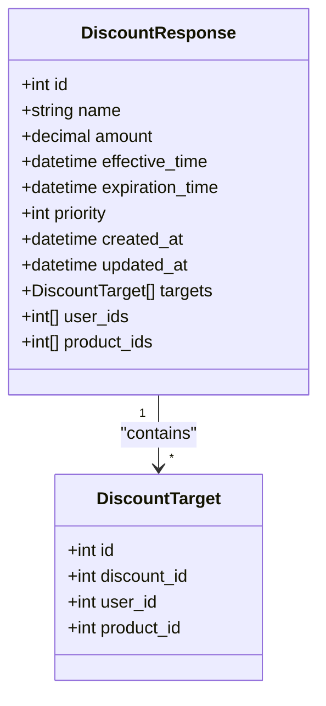

**图表来源**
- [backend/orders/serializers.py](file://backend/orders/serializers.py#L175-L230)

### 批量查询接口

`/api/discounts/query_user_products/`接口支持批量查询：

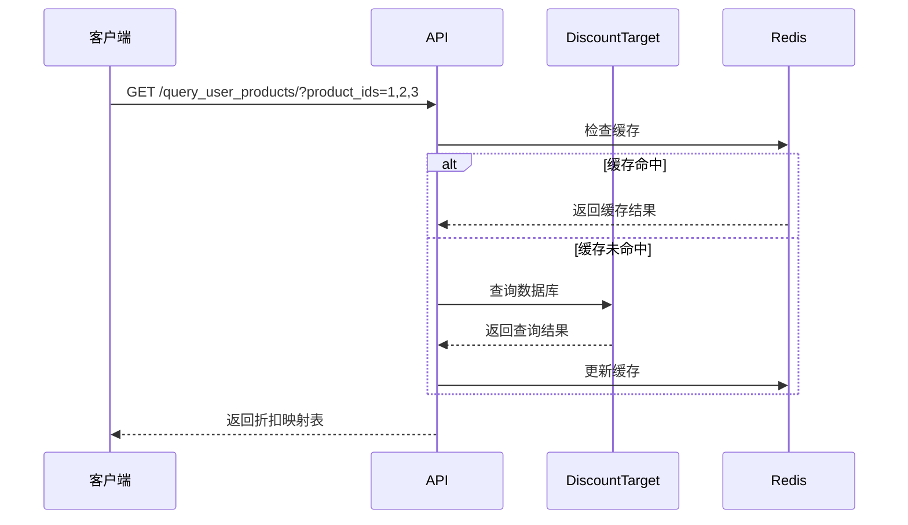

**图表来源**
- [backend/orders/views.py](file://backend/orders/views.py#L1078-L1104)

**章节来源**
- [backend/orders/serializers.py](file://backend/orders/serializers.py#L175-L230)
- [backend/orders/views.py](file://backend/orders/views.py#L1050-L1104)
- [backend/orders/urls.py](file://backend/orders/urls.py#L1-L16)

## 性能优化分析

### 查询性能优化

系统采用多种策略优化查询性能：

1. **索引优化**：
   - `effective_time` 和 `expiration_time` 组合索引
   - `priority` 单列索引
   - `user` 和 `product` 组合索引

2. **查询优化**：
   - 使用`select_related`预加载关联对象
   - 采用`only`和`defer`减少查询字段
   - 实施分页查询避免大数据集

3. **缓存优化**：
   - Redis缓存热点数据
   - 前端本地缓存
   - 多级缓存架构

### 并发控制机制

系统实现了完善的并发控制：

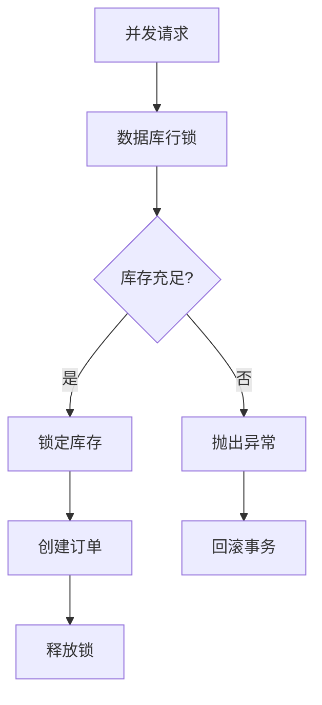

**图表来源**
- [backend/orders/services.py](file://backend/orders/services.py#L333-L372)

### 批量操作优化

对于大批量的折扣操作，系统采用以下优化策略：

1. **批量插入**：使用`bulk_create`减少数据库交互
2. **批量查询**：使用`in`查询减少SQL语句数量
3. **异步处理**：对于超大批次的操作采用异步队列

**章节来源**
- [backend/orders/models.py](file://backend/orders/models.py#L259-L262)
- [backend/orders/services.py](file://backend/orders/services.py#L333-L372)

## 最佳实践指南

### 折扣规则设计原则

1. **明确性原则**：每个折扣规则都应该有清晰的目的和适用范围
2. **优先级管理**：合理设置优先级，避免规则冲突
3. **时间控制**：严格控制生效时间和过期时间
4. **测试验证**：在正式上线前充分测试各种场景

### 性能监控指标

| 指标 | 目标值 | 监控方法 |
|------|--------|----------|
| 折扣查询响应时间 | < 50ms | APM工具监控 |
| 缓存命中率 | > 90% | Redis监控 |
| 数据库查询次数 | < 10次/请求 | SQL日志分析 |
| 并发处理能力 | > 1000 QPS | 压力测试 |

### 故障排查指南

1. **折扣未生效**：
   - 检查生效时间和过期时间
   - 验证用户和商品的关联关系
   - 确认优先级设置

2. **性能问题**：
   - 检查缓存配置
   - 分析慢查询日志
   - 监控数据库连接池

3. **并发问题**：
   - 检查事务隔离级别
   - 验证锁机制
   - 分析死锁日志

### 扩展性考虑

1. **多维度折扣**：未来可扩展支持品类、时间段等更多维度
2. **动态定价**：集成机器学习算法实现智能定价
3. **跨平台同步**：支持多终端折扣数据同步
4. **国际化支持**：支持多币种和多语言折扣

通过这套完整的折扣模型设计，系统能够灵活应对各种复杂的业务场景，同时保持良好的性能和可维护性。商户可以通过直观的后台界面轻松管理折扣策略，用户可以在前端获得流畅的折扣体验，系统则通过多层缓存和优化策略确保高性能运行。