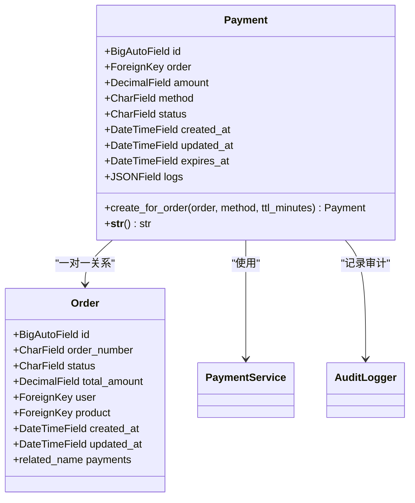
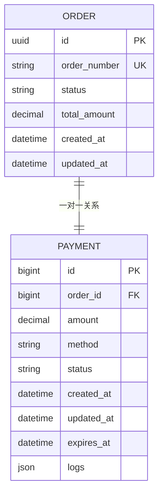
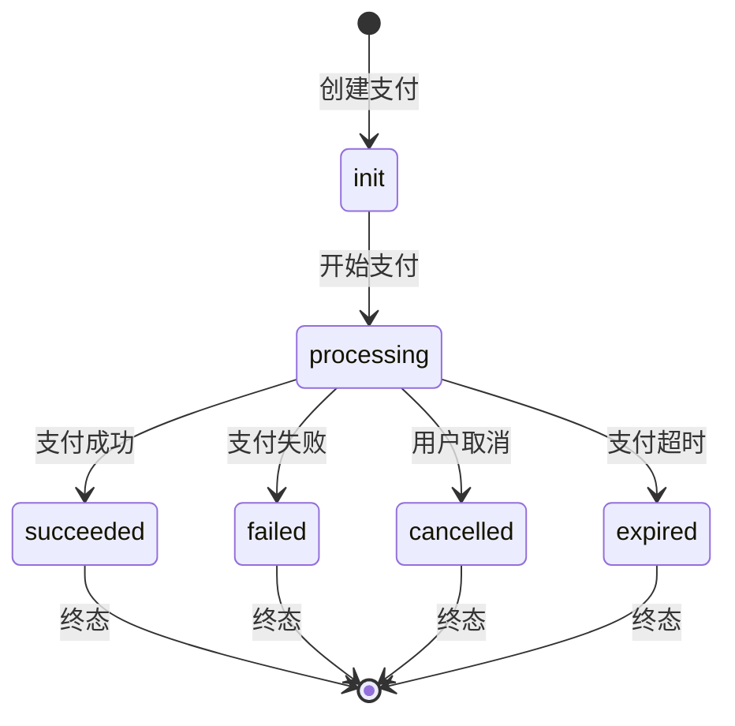
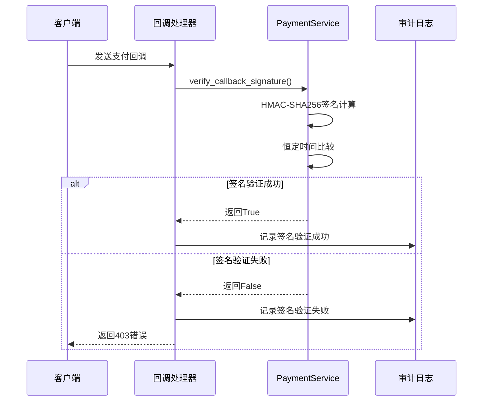
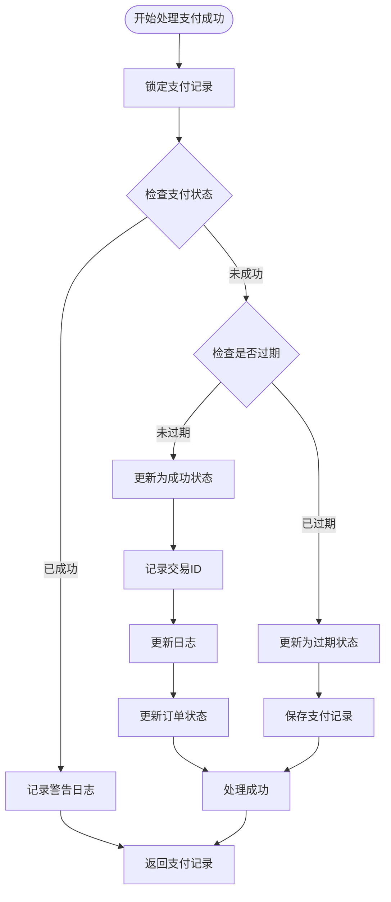
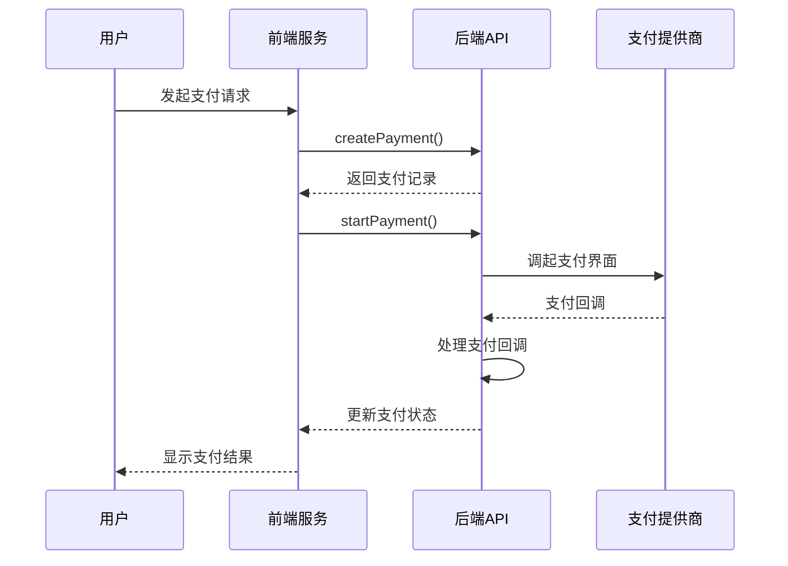
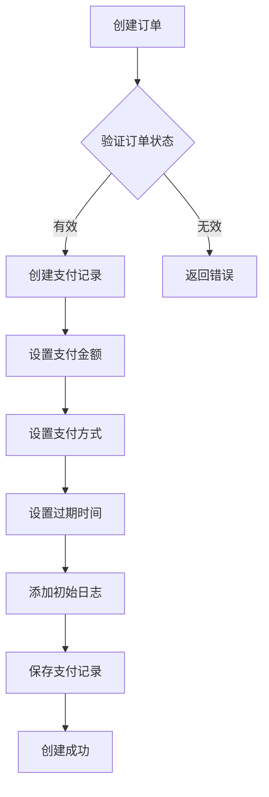
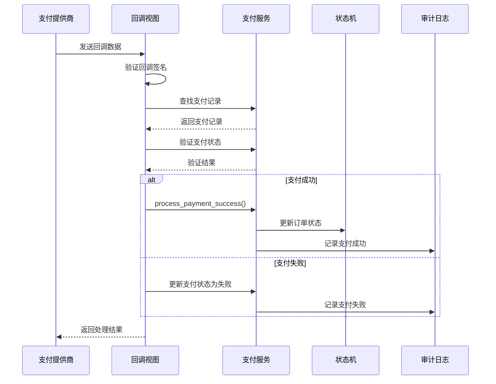
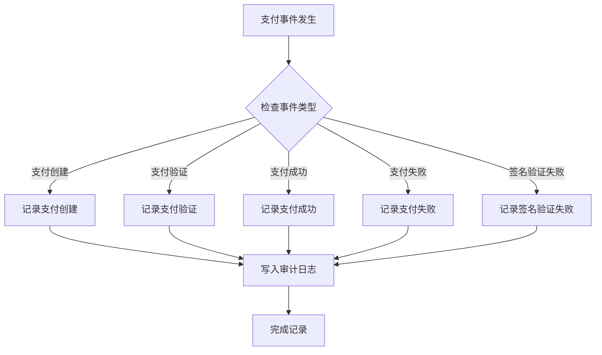

# 支付模型

<cite>
**本文档引用的文件**
- [backend/orders/models.py](file://backend/orders/models.py)
- [backend/orders/payment_service.py](file://backend/orders/payment_service.py)
- [backend/orders/views.py](file://backend/orders/views.py)
- [backend/orders/state_machine.py](file://backend/orders/state_machine.py)
- [backend/orders/serializers.py](file://backend/orders/serializers.py)
- [backend/orders/migrations/0005_payment.py](file://backend/orders/migrations/0005_payment.py)
- [backend/orders/urls.py](file://backend/orders/urls.py)
- [frontend/src/services/payment.ts](file://frontend/src/services/payment.ts)
- [backend/common/audit_logger.py](file://backend/common/audit_logger.py)
</cite>

## 目录
1. [概述](#概述)
2. [Payment模型架构](#payment模型架构)
3. [Order-Payment一对一关系](#order-payment一对一关系)
4. [支付状态管理](#支付状态管理)
5. [支付服务核心功能](#支付服务核心功能)
6. [前端支付服务](#前端支付服务)
7. [支付流程详解](#支付流程详解)
8. [安全审计机制](#安全审计机制)
9. [异常处理与监控](#异常处理与监控)
10. [最佳实践建议](#最佳实践建议)

## 概述

支付模型是电商业务小程序的核心组件之一，负责管理订单的支付流程。系统采用Payment模型与Order模型的一对一关系设计，确保每个订单只能有一个对应的支付记录，同时支持多种支付方式和完整的支付状态跟踪。

### 核心特性

- **一对一关系**：每个订单对应唯一的支付记录
- **多支付方式**：支持微信支付、支付宝、银行卡等多种支付方式
- **完整状态链**：从待支付到支付成功的完整状态管理
- **安全验证**：多重签名验证和防重复支付机制
- **审计追踪**：完整的支付日志和安全审计记录

## Payment模型架构

Payment模型定义了支付记录的数据结构和业务逻辑，包含以下核心字段：

**图表来源**
- [backend/orders/models.py](file://backend/orders/models.py#L186-L222)

### 核心字段详解

| 字段名 | 类型 | 描述 | 默认值 |
|--------|------|------|--------|
| `id` | BigAutoField | 主键ID | 自动生成 |
| `order` | ForeignKey | 关联的订单 | 必填 |
| `amount` | DecimalField | 支付金额 | 必填 |
| `method` | CharField | 支付方式 | 'wechat' |
| `status` | CharField | 支付状态 | 'init' |
| `created_at` | DateTimeField | 创建时间 | 自动设置 |
| `updated_at` | DateTimeField | 更新时间 | 自动更新 |
| `expires_at` | DateTimeField | 过期时间 | 必填 |
| `logs` | JSONField | 支付日志 | [] |

**章节来源**
- [backend/orders/models.py](file://backend/orders/models.py#L186-L222)

## Order-Payment一对一关系

系统采用Payment模型与Order模型的一对一关系设计，这种设计确保了支付流程的清晰性和数据一致性。

### 关系设计原理

**图表来源**
- [backend/orders/models.py](file://backend/orders/models.py#L186-L222)

### 关系优势

1. **数据完整性**：确保每个订单只有一个支付记录
2. **状态同步**：支付状态变化直接影响订单状态
3. **事务一致性**：支付和订单状态变更在同一事务中处理
4. **查询优化**：通过外键关联实现高效的查询性能

**章节来源**
- [backend/orders/models.py](file://backend/orders/models.py#L201-L202)

## 支付状态管理

Payment模型定义了完整的支付状态生命周期，支持从初始化到最终状态的各种转换。

### 支付状态枚举

**图表来源**
- [backend/orders/models.py](file://backend/orders/models.py#L192-L198)

### 状态转换规则

| 当前状态 | 允许转换到的状态 | 触发条件 |
|----------|------------------|----------|
| `init` | `processing`, `cancelled`, `expired` | 用户开始支付、手动取消、超时 |
| `processing` | `succeeded`, `failed`, `cancelled` | 支付回调、支付失败、用户取消 |
| `succeeded` | 无 | 终态，不可再转换 |
| `failed` | 无 | 终态，不可再转换 |
| `cancelled` | 无 | 终态，不可再转换 |
| `expired` | 无 | 终态，不可再转换 |

**章节来源**
- [backend/orders/models.py](file://backend/orders/models.py#L192-L198)

## 支付服务核心功能

PaymentService类提供了支付流程的核心业务逻辑，包括签名验证、金额校验、状态更新等功能。

### 签名验证机制

**图表来源**
- [backend/orders/payment_service.py](file://backend/orders/payment_service.py#L30-L68)

### 支付金额验证

系统实现了精确的金额验证机制，允许0.01元的误差范围以处理浮点数精度问题。

**章节来源**
- [backend/orders/payment_service.py](file://backend/orders/payment_service.py#L70-L103)

### 支付成功处理

**图表来源**
- [backend/orders/payment_service.py](file://backend/orders/payment_service.py#L106-L202)

**章节来源**
- [backend/orders/payment_service.py](file://backend/orders/payment_service.py#L106-L202)

## 前端支付服务

前端payment.ts服务提供了与后端API交互的完整接口，支持支付流程的各个阶段操作。

### 支付服务接口

| 方法名 | 功能描述 | 参数 | 返回值 |
|--------|----------|------|--------|
| `getPayments()` | 获取支付记录列表 | `params?: {order_id?, page?, page_size?}` | `Promise<PaginatedResponse<Payment>>` |
| `createPayment()` | 创建支付记录 | `data: {order_id, method?, amount?}` | `Promise<Payment>` |
| `getPaymentDetail()` | 获取支付详情 | `id: number` | `Promise<Payment>` |
| `startPayment()` | 开始支付 | `id: number` | `Promise<Payment>` |
| `succeedPayment()` | 支付成功 | `id: number` | `Promise<Payment>` |
| `failPayment()` | 支付失败 | `id: number` | `Promise<Payment>` |
| `cancelPayment()` | 取消支付 | `id: number` | `Promise<Payment>` |
| `expirePayment()` | 支付过期 | `id: number` | `Promise<Payment>` |

**章节来源**
- [frontend/src/services/payment.ts](file://frontend/src/services/payment.ts#L4-L52)

### 前端支付流程

**图表来源**
- [frontend/src/services/payment.ts](file://frontend/src/services/payment.ts#L4-L52)

## 支付流程详解

完整的支付流程包含创建支付、发起支付、处理回调和状态更新等多个环节。

### 支付创建流程

**图表来源**
- [backend/orders/views.py](file://backend/orders/views.py#L136-L217)

### 支付回调处理

系统支持多种支付提供商的回调处理，包括模拟回调和真实支付平台回调。

**图表来源**
- [backend/orders/views.py](file://backend/orders/views.py#L1133-L1294)

**章节来源**
- [backend/orders/views.py](file://backend/orders/views.py#L1133-L1294)

## 安全审计机制

系统实现了完善的审计日志机制，记录所有关键的支付操作和状态变更。

### 审计日志类型

| 日志事件 | 描述 | 记录内容 |
|----------|------|----------|
| `payment_created` | 支付创建 | payment_id, order_id, amount, user_id |
| `payment_verified` | 支付验证 | payment_id, transaction_id, user_id |
| `payment_succeeded` | 支付成功 | payment_id, order_id, amount, user_id |
| `payment_failed` | 支付失败 | payment_id, reason, user_id |
| `payment_refunded` | 支付退款 | payment_id, order_id, amount, reason, user_id |
| `signature_verification_failed` | 签名验证失败 | payment_id, provider, error |

### 审计日志记录流程

**图表来源**
- [backend/common/audit_logger.py](file://backend/common/audit_logger.py#L22-L135)

**章节来源**
- [backend/common/audit_logger.py](file://backend/common/audit_logger.py#L22-L135)

## 异常处理与监控

系统实现了多层次的异常处理和监控机制，确保支付流程的稳定性和可追溯性。

### 异常处理策略

1. **签名验证异常**：记录详细错误信息，拒绝恶意回调
2. **支付状态异常**：防止重复处理和非法状态转换
3. **数据库事务异常**：确保支付状态变更的原子性
4. **网络通信异常**：提供重试机制和降级策略

### 监控指标

| 监控指标 | 描述 | 触发条件 |
|----------|------|----------|
| 支付成功率 | 支付成功的比例 | 成功/总支付数 |
| 回调响应时间 | 支付回调的平均响应时间 | 回调处理耗时 |
| 签名验证失败率 | 签名验证失败的比例 | 失败/总回调数 |
| 支付超时率 | 支付超时的比例 | 超时/总支付数 |

**章节来源**
- [backend/orders/payment_service.py](file://backend/orders/payment_service.py#L286-L292)

## 最佳实践建议

基于系统设计和实际应用经验，以下是支付模块的最佳实践建议：

### 开发建议

1. **支付超时设置**：合理设置支付超时时间（建议30分钟）
2. **幂等性设计**：确保支付操作的幂等性，防止重复处理
3. **异步处理**：支付回调采用异步处理，提高系统响应速度
4. **日志记录**：完整记录支付过程中的关键节点和异常信息

### 安全建议

1. **签名验证**：严格验证第三方支付回调的签名
2. **金额校验**：双重验证支付金额的一致性
3. **访问控制**：实施严格的权限控制和API限流
4. **数据加密**：敏感支付数据采用加密存储

### 运维建议

1. **监控告警**：建立完善的支付监控和告警机制
2. **备份恢复**：定期备份支付数据，制定应急恢复预案
3. **性能优化**：优化支付相关接口的性能和并发处理能力
4. **版本管理**：保持支付系统的版本更新和兼容性

通过以上设计和实践，系统能够提供安全、可靠、高效的支付服务，满足电商业务的需求。