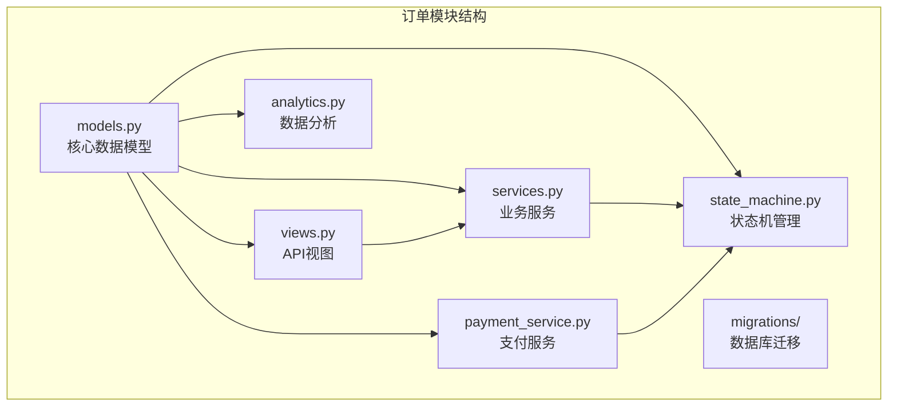
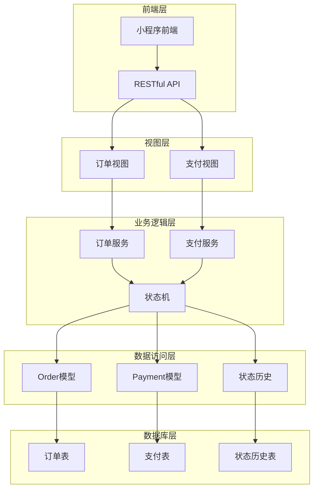
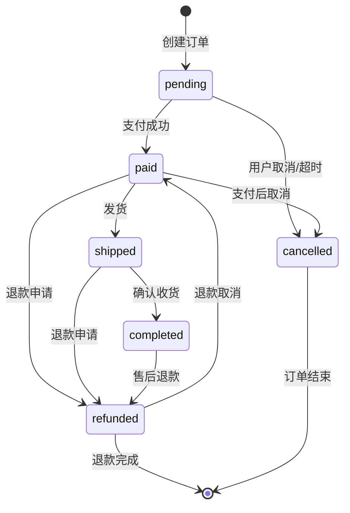
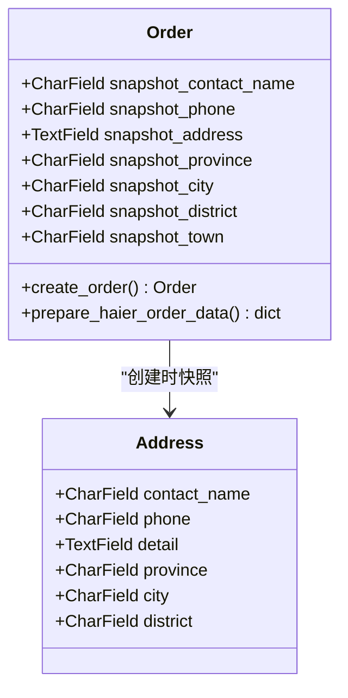
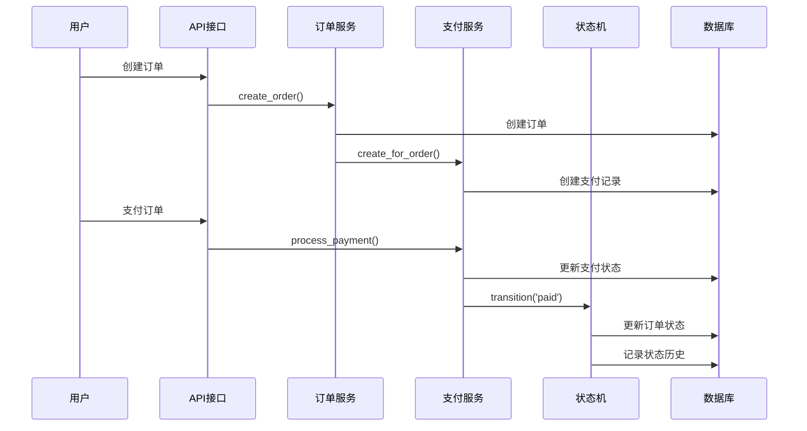
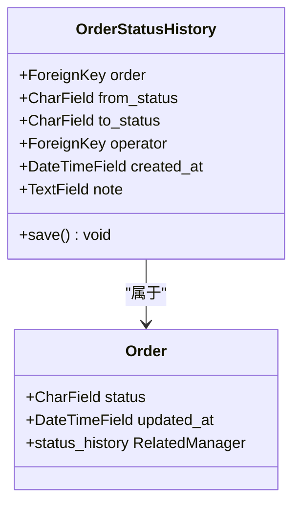
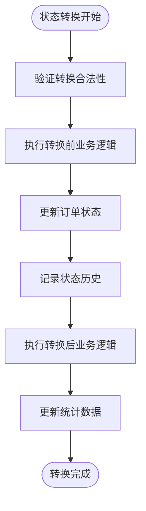
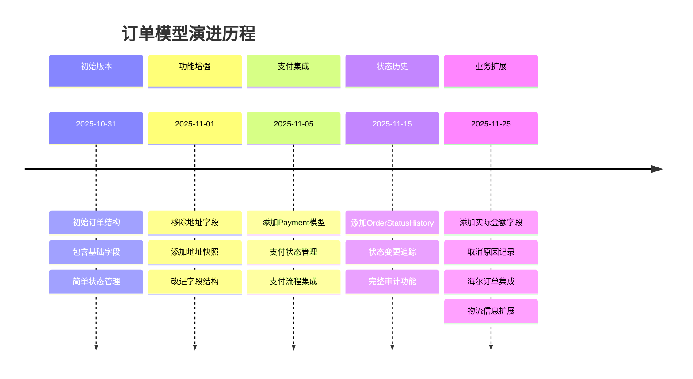
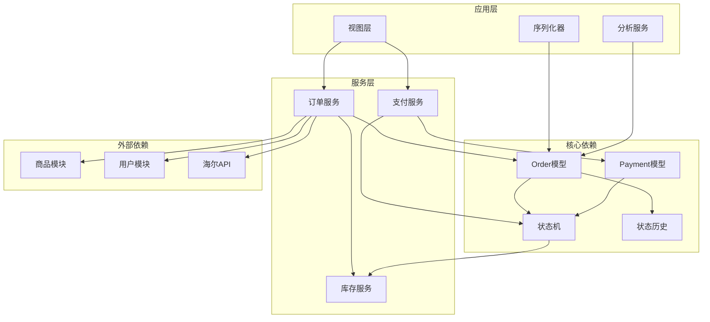

# 订单模型

<cite>
**本文档引用的文件**
- [models.py](file://backend/orders/models.py)
- [state_machine.py](file://backend/orders/state_machine.py)
- [services.py](file://backend/orders/services.py)
- [views.py](file://backend/orders/views.py)
- [payment_service.py](file://backend/orders/payment_service.py)
- [analytics.py](file://backend/orders/analytics.py)
- [0001_initial.py](file://backend/orders/migrations/0001_initial.py)
- [0005_payment.py](file://backend/orders/migrations/0005_payment.py)
- [0008_add_order_status_history.py](file://backend/orders/migrations/0008_add_order_status_history.py)
- [0009_order_actual_amount_order_cancel_reason_and_more.py](file://backend/orders/migrations/0009_order_actual_amount_order_cancel_reason_and_more.py)
- [0003_remove_order_address_order_snapshot_address_and_more.py](file://backend/orders/migrations/0003_remove_order_address_order_snapshot_address_and_more.py)
</cite>

## 目录
1. [简介](#简介)
2. [项目结构](#项目结构)
3. [核心组件](#核心组件)
4. [架构概览](#架构概览)
5. [详细组件分析](#详细组件分析)
6. [依赖关系分析](#依赖关系分析)
7. [性能考虑](#性能考虑)
8. [故障排除指南](#故障排除指南)
9. [结论](#结论)

## 简介

本文档详细描述了电商业务系统中的订单数据模型，重点分析Order模型的状态机设计与业务逻辑。该系统采用基于状态机的订单状态管理机制，确保订单状态流转的合法性和一致性，同时提供了完整的支付集成、地址快照、状态历史记录等功能。

## 项目结构

订单模块位于`backend/orders/`目录下，包含以下核心文件：



**图表来源**
- [models.py](file://backend/orders/models.py#L1-L322)
- [state_machine.py](file://backend/orders/state_machine.py#L1-L289)
- [services.py](file://backend/orders/services.py#L1-L500)

**章节来源**
- [models.py](file://backend/orders/models.py#L1-L322)
- [state_machine.py](file://backend/orders/state_machine.py#L1-L289)

## 核心组件

### Order模型核心字段

Order模型包含了完整的订单业务信息，主要核心字段包括：

| 字段名 | 类型 | 描述 | 用途 |
|--------|------|------|------|
| order_number | CharField | 订单号 | 唯一标识订单，自动生成 |
| status | CharField | 订单状态 | 当前订单状态，使用状态机控制 |
| total_amount | DecimalField | 总金额 | 订单原始总金额 |
| actual_amount | DecimalField | 实付金额 | 订单实际支付金额（包含折扣后） |
| discount_amount | DecimalField | 折扣金额 | 享受的折扣总额 |
| snapshot_* | 字段系列 | 地址快照 | 订单创建时的收货地址信息 |

### Payment模型设计

Payment模型与Order建立了一对一关系，专门负责支付相关的业务逻辑：

| 字段名 | 类型 | 描述 | 状态 |
|--------|------|------|------|
| amount | DecimalField | 支付金额 | 订单总金额 |
| method | CharField | 支付方式 | 微信、支付宝、银行卡 |
| status | CharField | 支付状态 | 待支付、支付中、成功、失败等 |
| expires_at | DateTimeField | 过期时间 | 支付有效期 |

**章节来源**
- [models.py](file://backend/orders/models.py#L13-L322)
- [models.py](file://backend/orders/models.py#L186-L234)

## 架构概览

系统采用分层架构设计，通过状态机确保业务逻辑的正确性：



**图表来源**
- [views.py](file://backend/orders/views.py#L1-L200)
- [services.py](file://backend/orders/services.py#L1-L500)
- [state_machine.py](file://backend/orders/state_machine.py#L1-L289)

## 详细组件分析

### Order模型状态机设计

Order模型实现了完整的状态机模式，定义了严格的订单状态转换规则：



**图表来源**
- [state_machine.py](file://backend/orders/state_machine.py#L33-L57)

#### 状态转换规则详解

系统定义了以下状态转换规则：

| 当前状态 | 允许转换到的状态 | 触发条件 |
|----------|------------------|----------|
| pending | paid, cancelled | 支付成功/用户取消/超时 |
| paid | shipped, refunding, cancelled | 发货/退款申请/支付后取消 |
| shipped | completed, refunding | 确认收货/退款申请 |
| completed | refunding | 售后退款 |
| refunding | refunded, paid | 退款完成/退款取消 |
| cancelled/refunded | 无 | 终态，不允许转换 |

**章节来源**
- [state_machine.py](file://backend/orders/state_machine.py#L33-L57)

### 订单地址快照机制

为了确保订单信息的完整性，系统实现了地址快照功能：



**图表来源**
- [models.py](file://backend/orders/models.py#L35-L42)
- [services.py](file://backend/orders/services.py#L282-L289)

#### 快照字段设计意图

地址快照字段的设计解决了以下业务问题：
- **历史追溯**：即使用户修改或删除地址，订单仍能显示原始收货信息
- **数据完整性**：确保订单创建时的地址信息不会因后续修改而丢失
- **合规要求**：满足电商交易的法律合规要求

**章节来源**
- [models.py](file://backend/orders/models.py#L35-L42)
- [services.py](file://backend/orders/services.py#L282-L289)

### Payment模型与订单集成

Payment模型与Order建立了紧密的关联关系：



**图表来源**
- [views.py](file://backend/orders/views.py#L136-L200)
- [payment_service.py](file://backend/orders/payment_service.py#L135-L207)
- [state_machine.py](file://backend/orders/state_machine.py#L95-L154)

#### 支付状态与订单状态同步

支付状态的变化会自动触发订单状态的更新：

| 支付状态 | 订单状态 | 触发条件 |
|----------|----------|----------|
| init | pending | 创建支付记录 |
| succeeded | paid | 支付成功回调 |
| failed | cancelled | 支付失败 |
| expired | cancelled | 支付超时 |

**章节来源**
- [payment_service.py](file://backend/orders/payment_service.py#L135-L207)

### 订单状态历史记录

OrderStatusHistory模型记录了订单状态的完整变更轨迹：



**图表来源**
- [models.py](file://backend/orders/models.py#L292-L322)

#### 状态历史记录机制

每次订单状态变更都会自动记录历史：



**图表来源**
- [state_machine.py](file://backend/orders/state_machine.py#L118-L154)

**章节来源**
- [models.py](file://backend/orders/models.py#L292-L322)
- [state_machine.py](file://backend/orders/state_machine.py#L118-L154)

### 数据库迁移演进

系统经历了多次数据库结构演进，以下是关键版本的演进过程：



**图表来源**
- [0001_initial.py](file://backend/orders/migrations/0001_initial.py#L1-L32)
- [0005_payment.py](file://backend/orders/migrations/0005_payment.py#L1-L33)
- [0008_add_order_status_history.py](file://backend/orders/migrations/0008_add_order_status_history.py#L1-L34)
- [0009_order_actual_amount_order_cancel_reason_and_more.py](file://backend/orders/migrations/0009_order_actual_amount_order_cancel_reason_and_more.py#L1-L130)

#### 关键演进节点

1. **2025-11-01：地址快照改进**
   - 移除了单一的`address`字段
   - 添加了详细的地址快照字段系列

2. **2025-11-25：业务功能扩展**
   - 添加`actual_amount`字段记录实付金额
   - 添加`cancel_reason`字段记录取消原因
   - 添加海尔订单相关字段
   - 扩展物流和安装信息字段

**章节来源**
- [0003_remove_order_address_order_snapshot_address_and_more.py](file://backend/orders/migrations/0003_remove_order_address_order_snapshot_address_and_more.py#L1-L32)
- [0009_order_actual_amount_order_cancel_reason_and_more.py](file://backend/orders/migrations/0009_order_actual_amount_order_cancel_reason_and_more.py#L1-L130)

### 订单查询与状态变更代码示例

#### 创建订单示例

```python
# 创建订单的典型流程
order = create_order(
    user=user,
    product_id=product_id,
    address_id=address_id,
    quantity=quantity,
    note=note
)
```

#### 状态变更示例

```python
# 使用状态机进行状态转换
from orders.state_machine import OrderStateMachine

try:
    updated_order = OrderStateMachine.transition(
        order=order,
        new_status='paid',
        operator=user,
        note='用户完成支付'
    )
except ValueError as e:
    # 处理状态转换失败
    logger.error(f"状态转换失败: {e}")
```

#### 支付处理示例

```python
# 支付成功后的状态更新
from orders.payment_service import PaymentService
from orders.state_machine import OrderStateMachine

# 处理支付回调
payment = PaymentService.process_payment_callback(
    payment_id=payment_id,
    transaction_id=transaction_id,
    operator=user
)

# 状态机会自动更新订单状态
```

**章节来源**
- [services.py](file://backend/orders/services.py#L219-L297)
- [state_machine.py](file://backend/orders/state_machine.py#L95-L154)
- [payment_service.py](file://backend/orders/payment_service.py#L135-L207)

## 依赖关系分析

系统各组件之间存在清晰的依赖关系：



**图表来源**
- [models.py](file://backend/orders/models.py#L1-L322)
- [state_machine.py](file://backend/orders/state_machine.py#L1-L289)
- [services.py](file://backend/orders/services.py#L1-L500)

### 组件耦合度分析

- **低耦合**：状态机独立于具体业务逻辑，可重用性强
- **高内聚**：相关功能集中在同一模块内，职责明确
- **松耦合**：通过接口和抽象层实现模块间的解耦

**章节来源**
- [models.py](file://backend/orders/models.py#L1-L322)
- [state_machine.py](file://backend/orders/state_machine.py#L1-L289)
- [services.py](file://backend/orders/services.py#L1-L500)

## 性能考虑

### 数据库索引优化

系统在Order模型中设置了多个复合索引：

| 索引字段 | 用途 | 性能提升 |
|----------|------|----------|
| status | 状态查询过滤 | 提升状态统计查询速度 |
| created_at | 时间范围查询 | 优化时间轴数据检索 |
| user | 用户订单查询 | 加速用户订单列表 |
| haier_order_no | 海尔订单查询 | 提升第三方系统集成效率 |
| haier_so_id | 子订单查询 | 优化海尔订单管理 |

### 缓存策略

系统实现了多层次的缓存策略：

1. **Redis缓存**：用于热点数据缓存
2. **数据库查询缓存**：用于聚合查询结果
3. **页面级缓存**：用于静态页面加速

### 并发控制

- **数据库行锁**：InventoryService使用`select_for_update()`防止库存超卖
- **事务隔离**：状态转换在事务中执行，确保数据一致性
- **幂等性设计**：支付回调和状态转换支持重复处理

## 故障排除指南

### 常见问题及解决方案

#### 1. 订单状态转换失败

**问题现象**：尝试更改订单状态时抛出`ValueError`

**排查步骤**：
```python
# 检查当前状态是否允许转换
from orders.state_machine import OrderStateMachine

allowed_states = OrderStateMachine.get_allowed_transitions(order.status)
print(f"当前状态: {order.status}")
print(f"允许转换到的状态: {allowed_states}")

# 检查转换是否合法
can_transition = OrderStateMachine.can_transition(order.status, new_status)
print(f"转换是否合法: {can_transition}")
```

**解决方案**：
- 确认订单状态符合转换规则
- 检查业务逻辑是否正确设置转换条件

#### 2. 支付状态不同步

**问题现象**：支付成功但订单状态未更新

**排查步骤**：
```python
# 检查支付记录状态
payment = order.payments.first()
print(f"支付状态: {payment.status}")
print(f"订单状态: {order.status}")

# 检查支付回调处理
from orders.payment_service import PaymentService
PaymentService.validate_payment_creation(order)
```

**解决方案**：
- 确认支付回调接口正常工作
- 检查状态机转换逻辑
- 验证事务提交机制

#### 3. 库存锁定失败

**问题现象**：创建订单时出现库存不足异常

**排查步骤**：
```python
# 检查商品库存
from catalog.models import Product
product = Product.objects.get(id=product_id)
print(f"当前库存: {product.stock}")

# 检查库存锁定状态
from orders.services import InventoryService
# 查看是否有未释放的库存锁定
```

**解决方案**：
- 确认库存数量充足
- 检查库存锁定释放逻辑
- 处理超时未支付的订单

**章节来源**
- [state_machine.py](file://backend/orders/state_machine.py#L60-L94)
- [payment_service.py](file://backend/orders/payment_service.py#L207-L220)
- [services.py](file://backend/orders/services.py#L332-L410)

## 结论

本文档全面分析了电商业务系统中的订单数据模型，重点阐述了以下核心特性：

### 主要优势

1. **状态机驱动的业务逻辑**：通过严格的状态转换规则确保订单状态的合法性
2. **完整的数据完整性保障**：地址快照机制确保历史数据的不可篡改性
3. **完善的审计跟踪**：状态历史记录提供完整的业务操作轨迹
4. **灵活的扩展能力**：模块化设计支持业务需求的快速迭代
5. **高性能的数据访问**：合理的索引设计和缓存策略

### 设计亮点

- **幂等性设计**：支付回调和状态转换支持重复处理
- **事务一致性**：关键业务操作在数据库事务中执行
- **并发安全保障**：数据库行锁防止库存超卖等并发问题
- **第三方系统集成**：海尔订单系统的无缝对接

### 未来发展方向

1. **智能推荐**：基于订单历史的个性化推荐
2. **预测分析**：基于历史数据的销售趋势预测
3. **自动化处理**：智能客服和自动化订单处理
4. **移动端优化**：小程序端的用户体验优化

该订单模型设计充分体现了现代电商系统对业务复杂性的应对能力和对未来发展的前瞻性规划，为构建稳定可靠的电商业务平台奠定了坚实的基础。