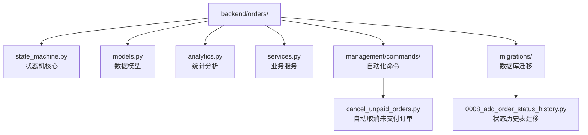
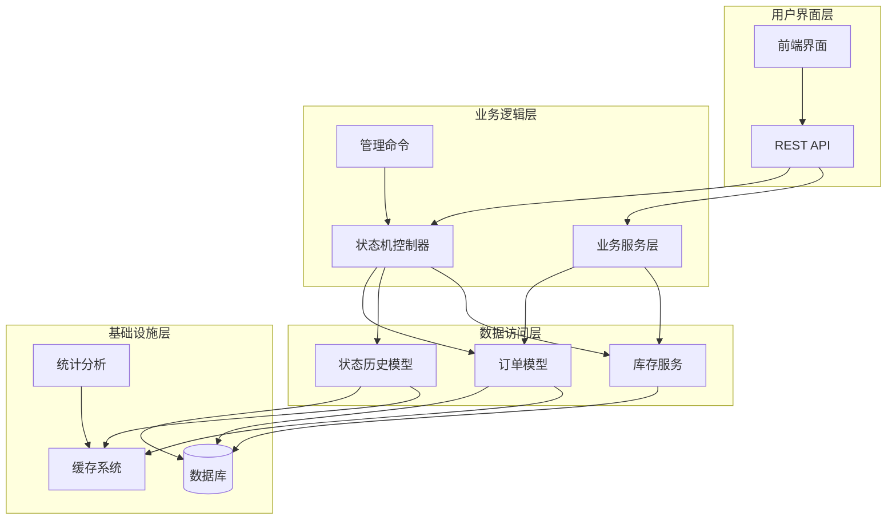
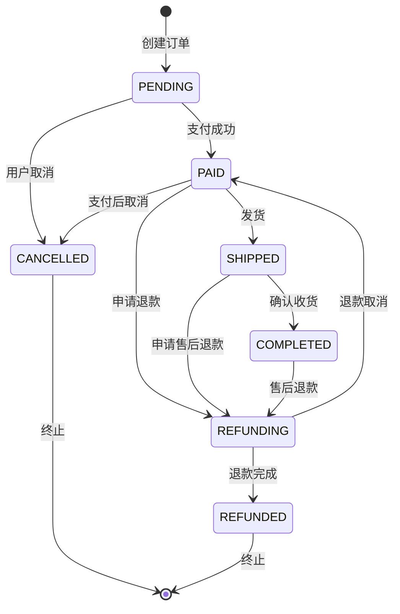
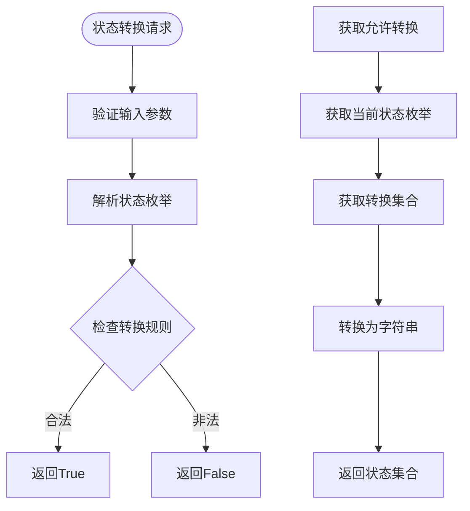
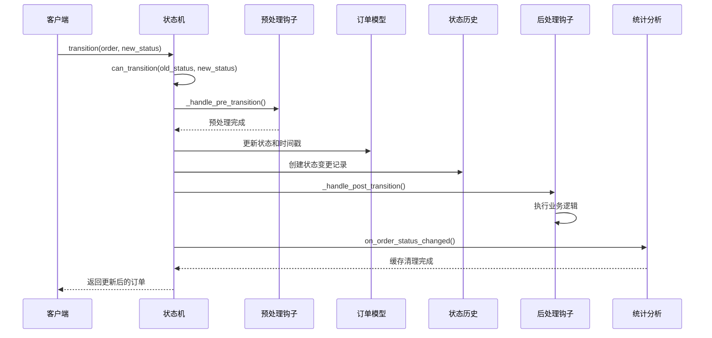
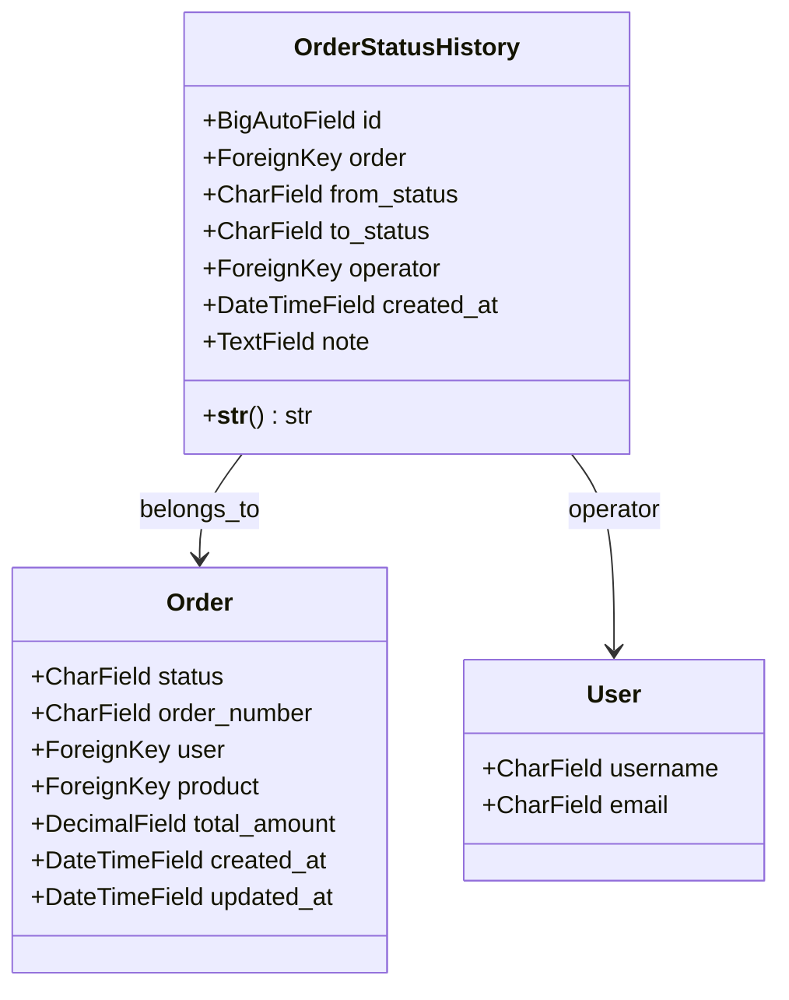
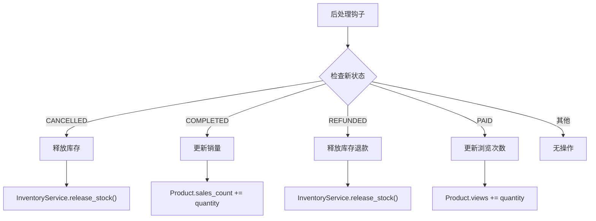
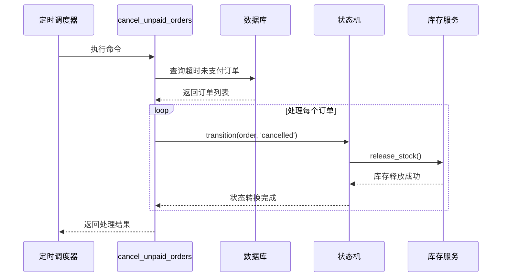
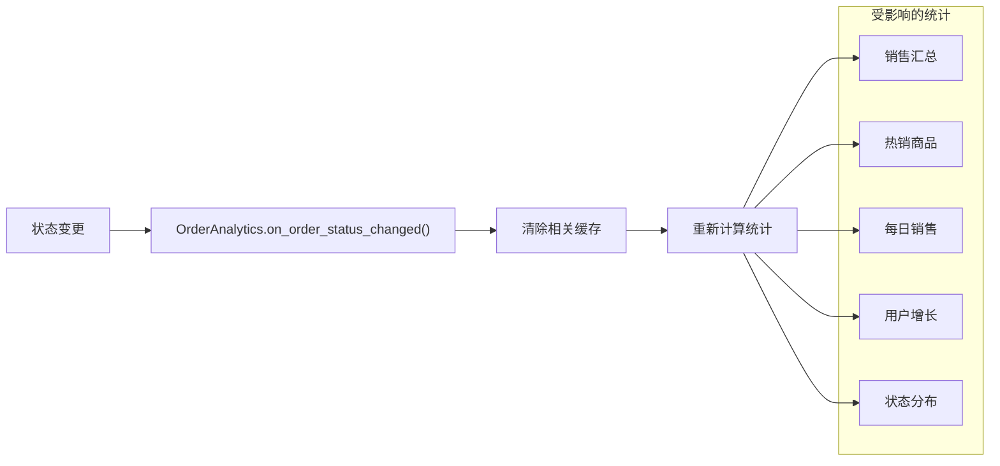
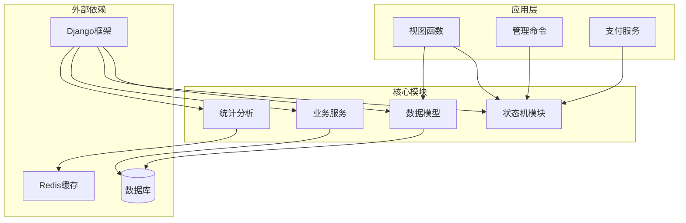

# 订单状态管理

<cite>
**本文档引用的文件**
- [state_machine.py](file://backend/orders/state_machine.py)
- [models.py](file://backend/orders/models.py)
- [cancel_unpaid_orders.py](file://backend/orders/management/commands/cancel_unpaid_orders.py)
- [analytics.py](file://backend/orders/analytics.py)
- [services.py](file://backend/orders/services.py)
- [0008_add_order_status_history.py](file://backend/orders/migrations/0008_add_order_status_history.py)
</cite>

## 目录
1. [概述](#概述)
2. [项目结构](#项目结构)
3. [核心组件](#核心组件)
4. [架构概览](#架构概览)
5. [详细组件分析](#详细组件分析)
6. [依赖关系分析](#依赖关系分析)
7. [性能考虑](#性能考虑)
8. [故障排除指南](#故障排除指南)
9. [结论](#结论)

## 概述

订单状态管理系统是电商核心业务的重要组成部分，负责维护订单在整个生命周期中的状态流转。本文档深入分析了基于状态机模式的订单状态管理实现，重点探讨了状态转换规则、历史记录机制、自动化处理流程以及监控统计功能。

该系统采用严格的有限状态机（FSM）设计，通过TRANSITIONS规则映射表约束合法状态转换，确保业务逻辑的一致性和数据完整性。同时，系统提供了完整的状态变更历史记录、预处理和后处理钩子机制，以及自动化状态变更的实践案例。

## 项目结构

订单状态管理模块位于`backend/orders/`目录下，主要包含以下核心文件：



**图表来源**
- [state_machine.py](file://backend/orders/state_machine.py#L1-L289)
- [models.py](file://backend/orders/models.py#L1-L322)
- [cancel_unpaid_orders.py](file://backend/orders/management/commands/cancel_unpaid_orders.py#L1-L117)

**章节来源**
- [state_machine.py](file://backend/orders/state_machine.py#L1-L50)
- [models.py](file://backend/orders/models.py#L1-L100)

## 核心组件

### 订单状态枚举

系统定义了七种核心订单状态，每种状态代表订单生命周期中的特定阶段：

| 状态 | 值 | 描述 | 允许的后续状态 |
|------|-----|------|----------------|
| PENDING | pending | 待支付 | paid, cancelled |
| PAID | paid | 待发货 | shipped, refunding, cancelled |
| SHIPPED | shipped | 待收货 | completed, refunding |
| COMPLETED | completed | 已完成 | refunding |
| CANCELLED | cancelled | 已取消 | 无 |
| REFUNDING | refunding | 退款中 | refunded, paid |
| REFUNDED | refunded | 已退款 | 无 |

### 状态机核心类

`OrderStateMachine`类是整个状态管理的核心，提供状态转换的验证和执行逻辑。

**章节来源**
- [state_machine.py](file://backend/orders/state_machine.py#L14-L57)

## 架构概览

订单状态管理系统采用分层架构设计，确保业务逻辑的清晰分离和可维护性：



**图表来源**
- [state_machine.py](file://backend/orders/state_machine.py#L25-L155)
- [models.py](file://backend/orders/models.py#L292-L322)
- [analytics.py](file://backend/orders/analytics.py#L16-L320)

## 详细组件分析

### TRANSITIONS规则映射表

TRANSITIONS规则映射表是状态机的核心约束机制，定义了所有合法的状态转换路径：



**图表来源**
- [state_machine.py](file://backend/orders/state_machine.py#L34-L57)

#### 规则设计原则

1. **业务合理性**：每个转换都符合实际业务流程
2. **不可逆性**：某些状态一旦达到就无法回退
3. **互斥性**：同一时间只能处于一种状态
4. **完整性**：覆盖所有可能的业务场景

**章节来源**
- [state_machine.py](file://backend/orders/state_machine.py#L34-L57)

### can_transition和get_allowed_transitions方法

这两个方法提供了状态转换的验证和查询功能：



**图表来源**
- [state_machine.py](file://backend/orders/state_machine.py#L59-L94)

#### 方法功能详解

- **can_transition**：检查从当前状态到目标状态的转换是否合法
- **get_allowed_transitions**：获取当前状态下所有允许的转换目标

**章节来源**
- [state_machine.py](file://backend/orders/state_machine.py#L59-L94)

### transition方法的执行流程

transition方法是状态转换的核心执行器，包含了完整的事务处理和业务逻辑：



**图表来源**
- [state_machine.py](file://backend/orders/state_machine.py#L96-L154)

#### 关键执行步骤

1. **合法性验证**：检查状态转换是否符合TRANSITIONS规则
2. **预处理钩子**：执行转换前的业务验证
3. **状态更新**：原子性地更新订单状态
4. **历史记录**：创建状态变更记录
5. **后处理钩子**：执行转换后的业务逻辑
6. **统计更新**：触发相关统计分析

**章节来源**
- [state_machine.py](file://backend/orders/state_machine.py#L96-L154)

### _order_status_history模型

OrderStatusHistory模型记录了所有状态变更的历史信息：



**图表来源**
- [models.py](file://backend/orders/models.py#L292-L322)

#### 字段说明

| 字段 | 类型 | 描述 | 约束 |
|------|------|------|------|
| id | BigAutoField | 主键 | 自动递增 |
| order | ForeignKey | 关联订单 | CASCADE删除 |
| from_status | CharField(20) | 原状态 | 必填 |
| to_status | CharField(20) | 新状态 | 必填 |
| operator | ForeignKey | 操作人 | SET_NULL |
| created_at | DateTimeField | 创建时间 | auto_now_add |
| note | TextField | 备注 | 可选 |

**章节来源**
- [models.py](file://backend/orders/models.py#L292-L322)

### 预处理和后处理钩子机制

#### _handle_pre_transition方法

预处理钩子目前为空实现，为未来的扩展预留接口：

```python
@classmethod
def _handle_pre_transition(cls, order, old_status: str, new_status: str, operator=None):
    """处理状态转换前的业务逻辑
    
    Args:
        order: Order对象
        old_status: 原状态
        new_status: 新状态
        operator: 操作人
    """
    # 可在此添加转换前的验证逻辑
    pass
```

#### _handle_post_transition方法

后处理钩子根据不同的状态转换执行相应的业务逻辑：



**图表来源**
- [state_machine.py](file://backend/orders/state_machine.py#L178-L210)

#### 具体业务逻辑实现

1. **订单取消处理**：
   - 调用InventoryService.release_stock()释放锁定的库存
   - 记录释放原因：order_cancelled

2. **订单完成处理**：
   - 更新Product.sales_count字段
   - 使用F()表达式避免并发问题

3. **退款完成处理**：
   - 释放与订单相关的库存
   - 记录释放原因：order_refunded

4. **支付成功处理**：
   - 预留接口，可用于发送通知等业务逻辑

**章节来源**
- [state_machine.py](file://backend/orders/state_machine.py#L178-L210)

### cancel_unpaid_orders命令的自动化实践

自动化命令展示了状态变更的实际应用场景：



**图表来源**
- [cancel_unpaid_orders.py](file://backend/orders/management/commands/cancel_unpaid_orders.py#L41-L117)

#### 命令功能特性

1. **超时检测**：基于created_at字段判断支付超时
2. **批量处理**：一次性处理多个超时订单
3. **事务保证**：使用@transaction.atomic确保一致性
4. **错误处理**：捕获并记录处理过程中的异常
5. **Dry-run模式**：支持模拟执行而不实际修改数据

**章节来源**
- [cancel_unpaid_orders.py](file://backend/orders/management/commands/cancel_unpaid_orders.py#L41-L117)

### OrderAnalytics统计分析集成

状态变更事件与统计分析系统的集成：



**图表来源**
- [state_machine.py](file://backend/orders/state_machine.py#L148-L152)
- [analytics.py](file://backend/orders/analytics.py#L301-L310)

#### 缓存管理策略

1. **缓存超时**：默认5分钟超时时间
2. **全量刷新**：状态变更时清除所有相关缓存
3. **智能优化**：仅在必要时重新计算统计数据

**章节来源**
- [analytics.py](file://backend/orders/analytics.py#L301-L310)

## 依赖关系分析

系统各组件之间的依赖关系展现了清晰的分层架构：



**图表来源**
- [state_machine.py](file://backend/orders/state_machine.py#L1-L15)
- [models.py](file://backend/orders/models.py#L1-L10)
- [analytics.py](file://backend/orders/analytics.py#L1-L15)

### 关键依赖点

1. **Django ORM**：提供数据持久化和查询功能
2. **事务管理**：确保状态转换的原子性
3. **缓存系统**：提升统计查询性能
4. **异步任务**：支持后台统计计算

**章节来源**
- [state_machine.py](file://backend/orders/state_machine.py#L1-L15)
- [models.py](file://backend/orders/models.py#L1-L10)

## 性能考虑

### 数据库优化策略

1. **索引设计**：
   - 订单状态索引：加速状态查询
   - 时间戳索引：优化时间范围查询
   - 复合索引：支持多字段查询

2. **查询优化**：
   - 使用select_related减少N+1查询
   - 批量操作减少数据库往返
   - 分页处理大数据集

3. **缓存策略**：
   - 统计数据缓存：减少重复计算
   - 状态历史缓存：提升查询速度
   - 内存优化：合理控制缓存大小

### 并发控制

1. **数据库行锁**：InventoryService使用select_for_update确保库存操作的原子性
2. **事务隔离**：使用原子事务保证状态转换的一致性
3. **乐观锁**：通过updated_at字段检测并发冲突

### 扩展性设计

1. **模块化架构**：便于功能扩展和维护
2. **钩子机制**：支持业务逻辑的灵活扩展
3. **配置化管理**：TRANSITIONS规则可动态调整

## 故障排除指南

### 常见问题及解决方案

#### 状态转换失败

**问题现象**：尝试转换状态时抛出ValueError异常

**排查步骤**：
1. 检查当前订单状态是否在TRANSITIONS规则中
2. 验证目标状态是否为允许的转换目标
3. 确认订单状态字段的数据完整性

**解决方案**：
```python
# 检查允许的转换
allowed = OrderStateMachine.get_allowed_transitions(current_status)
print(f"允许的转换: {allowed}")
```

#### 库存释放失败

**问题现象**：订单取消或退款时库存释放失败

**排查步骤**：
1. 检查商品是否存在且有效
2. 验证库存数量是否足够
3. 查看数据库连接和事务状态

**解决方案**：
```python
# 手动释放库存
try:
    InventoryService.release_stock(
        product_id=order.product_id,
        quantity=order.quantity,
        reason='manual_release'
    )
except Exception as e:
    logger.error(f"库存释放失败: {e}")
```

#### 状态历史记录缺失

**问题现象**：状态变更后没有创建对应的历史记录

**排查步骤**：
1. 检查OrderStatusHistory模型的创建权限
2. 验证数据库事务是否正常提交
3. 确认信号处理是否正确

**解决方案**：
```python
# 手动创建状态历史
OrderStatusHistory.objects.create(
    order=order,
    from_status=old_status,
    to_status=new_status,
    operator=operator,
    note=note
)
```

### 监控和调试

#### 日志记录

建议在关键位置添加日志记录：

```python
import logging
logger = logging.getLogger(__name__)

def transition(self, order, new_status, operator=None, note=''):
    logger.info(f"订单状态转换: {order.order_number} "
                f"从 {order.status} 到 {new_status} "
                f"操作人: {operator}")
```

#### 性能监控

监控关键指标：
- 状态转换响应时间
- 数据库查询耗时
- 缓存命中率
- 错误发生频率

**章节来源**
- [state_machine.py](file://backend/orders/state_machine.py#L118-L124)
- [services.py](file://backend/orders/services.py#L375-L408)

## 结论

订单状态管理系统通过精心设计的状态机模式，实现了业务逻辑的规范化和数据一致性的保障。系统的主要优势包括：

### 设计优势

1. **严格的状态约束**：TRANSITIONS规则确保了业务流程的合法性
2. **完整的审计跟踪**：OrderStatusHistory模型提供了完整的历史记录
3. **灵活的扩展机制**：钩子函数支持业务逻辑的动态扩展
4. **自动化处理能力**：cancel_unpaid_orders命令展示了系统的自动化潜力

### 技术特点

1. **事务安全性**：使用数据库事务保证状态转换的一致性
2. **并发控制**：通过数据库锁和事务隔离防止并发问题
3. **性能优化**：缓存机制和索引设计提升了系统性能
4. **监控集成**：与统计分析系统的无缝集成

### 应用价值

该系统不仅满足了当前的业务需求，还为未来的功能扩展奠定了坚实的基础。通过模块化的架构设计和清晰的职责分离，系统具备了良好的可维护性和可扩展性。

对于开发者而言，理解这套状态管理系统的设计理念和实现细节，有助于更好地维护现有功能并开发新的业务特性。同时，系统提供的自动化处理能力和监控集成，也为运维团队提供了强大的工具支持。