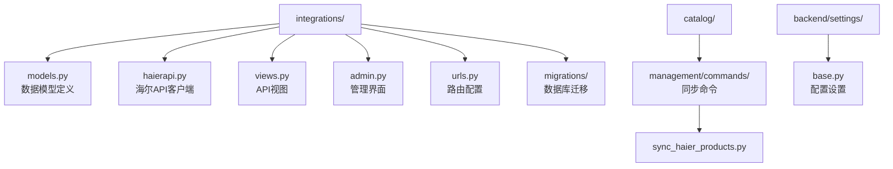
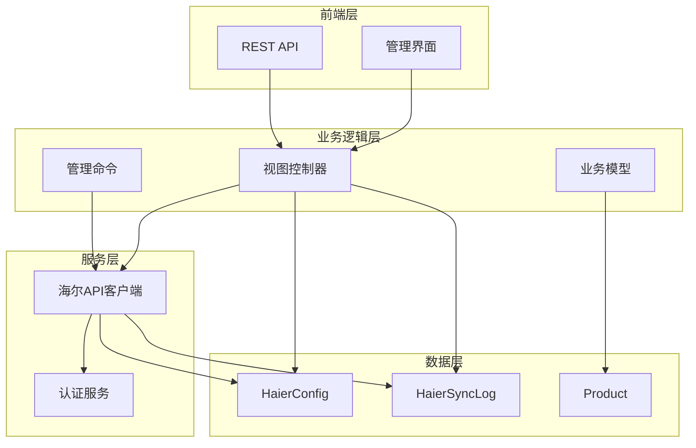
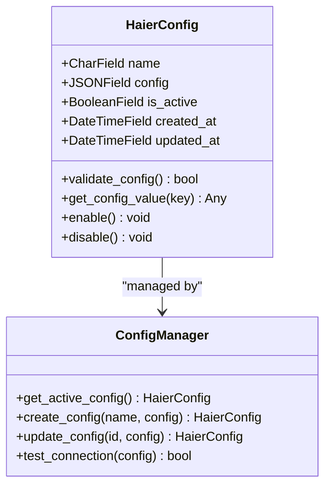
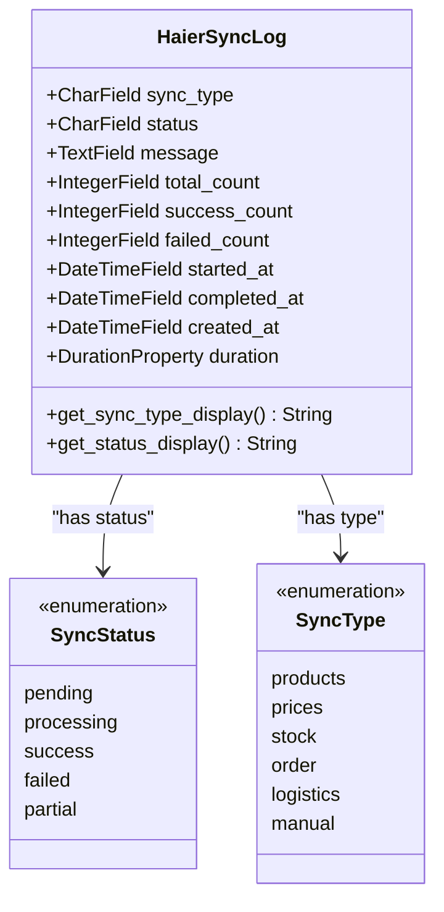
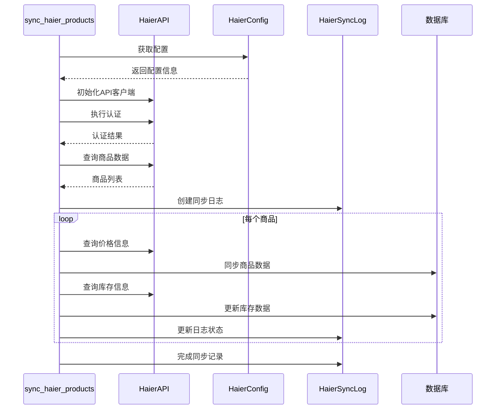
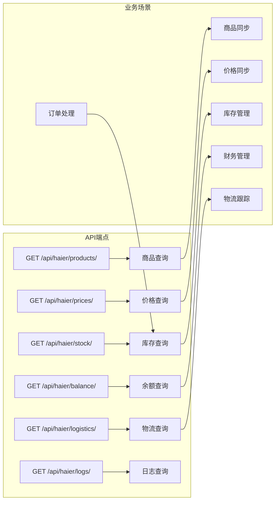
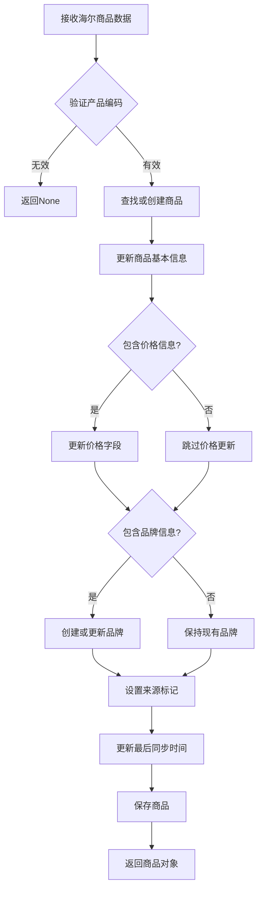
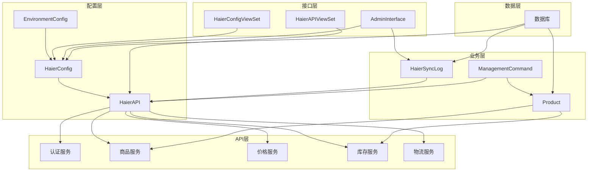

# 集成模型

<cite>
**本文档中引用的文件**
- [backend/integrations/models.py](file://backend/integrations/models.py)
- [backend/integrations/migrations/0002_haierconfig_haiersynclog_delete_supplierconfig_and_more.py](file://backend/integrations/migrations/0002_haierconfig_haiersynclog_delete_supplierconfig_and_more.py)
- [backend/catalog/management/commands/sync_haier_products.py](file://backend/catalog/management/commands/sync_haier_products.py)
- [backend/integrations/haierapi.py](file://backend/integrations/haierapi.py)
- [backend/integrations/admin.py](file://backend/integrations/admin.py)
- [backend/integrations/views.py](file://backend/integrations/views.py)
- [backend/integrations/urls.py](file://backend/integrations/urls.py)
- [backend/catalog/models.py](file://backend/catalog/models.py)
- [backend/backend/settings/base.py](file://backend/backend/settings/base.py)
</cite>

## 目录
1. [简介](#简介)
2. [项目结构](#项目结构)
3. [核心组件](#核心组件)
4. [架构概览](#架构概览)
5. [详细组件分析](#详细组件分析)
6. [依赖关系分析](#依赖关系分析)
7. [性能考虑](#性能考虑)
8. [故障排除指南](#故障排除指南)
9. [结论](#结论)

## 简介

本文档详细描述了与海尔系统集成的数据模型架构。该系统通过两个核心模型（HaierConfig和HaierSyncLog）实现了与海尔API的完整集成，支持商品同步、价格查询、库存管理、订单处理等多种业务场景。系统采用Django ORM设计，提供了完整的配置管理和日志记录功能，确保集成过程的可靠性和可追溯性。

## 项目结构

集成模块位于`backend/integrations/`目录下，包含以下关键文件：

**图表来源**
- [backend/integrations/models.py](file://backend/integrations/models.py#L1-L150)
- [backend/integrations/haierapi.py](file://backend/integrations/haierapi.py#L1-L214)
- [backend/catalog/management/commands/sync_haier_products.py](file://backend/catalog/management/commands/sync_haier_products.py#L1-L156)

**章节来源**
- [backend/integrations/models.py](file://backend/integrations/models.py#L1-L150)
- [backend/integrations/haierapi.py](file://backend/integrations/haierapi.py#L1-L214)

## 核心组件

系统的核心由两个主要模型组成：

### HaierConfig模型
负责存储海尔API的认证信息和配置参数，支持动态配置管理和多配置切换。

### HaierSyncLog模型  
记录所有海尔API数据同步操作的详细信息，提供完整的审计和故障排查功能。

**章节来源**
- [backend/integrations/models.py](file://backend/integrations/models.py#L4-L150)

## 架构概览

系统采用分层架构设计，清晰分离了配置管理、API通信、业务逻辑和数据持久化：

**图表来源**
- [backend/integrations/views.py](file://backend/integrations/views.py#L1-L327)
- [backend/integrations/haierapi.py](file://backend/integrations/haierapi.py#L10-L214)
- [backend/catalog/management/commands/sync_haier_products.py](file://backend/catalog/management/commands/sync_haier_products.py#L1-L156)

## 详细组件分析

### HaierConfig模型详细分析

HaierConfig模型是系统配置的核心，采用JSONField存储灵活的配置结构：

**图表来源**
- [backend/integrations/models.py](file://backend/integrations/models.py#L4-L47)
- [backend/integrations/views.py](file://backend/integrations/views.py#L36-L101)

#### 配置参数详解

| 参数名称 | 类型 | 必需 | 描述 | 默认值 |
|---------|------|------|------|--------|
| client_id | String | 是 | 海尔API客户端ID | - |
| client_secret | String | 是 | 海尔API客户端密钥 | - |
| token_url | String | 是 | OAuth2令牌获取地址 | https://openplat-test.haier.net/oauth2/auth |
| base_url | String | 是 | 海尔API基础URL | https://openplat-test.haier.net |
| customer_code | String | 是 | 客户编码 | - |
| send_to_code | String | 是 | 发送目标编码 | - |
| supplier_code | String | 否 | 供应商编码 | 1001 |
| password | String | 是 | 通用密码 | - |
| seller_password | String | 是 | 卖家密码 | - |

**章节来源**
- [backend/integrations/models.py](file://backend/integrations/models.py#L4-L47)
- [backend/integrations/haierapi.py](file://backend/integrations/haierapi.py#L10-L25)

### HaierSyncLog模型详细分析

HaierSyncLog模型提供完整的同步操作记录功能：

**图表来源**
- [backend/integrations/models.py](file://backend/integrations/models.py#L50-L149)

#### 日志记录结构详解

| 字段名称 | 类型 | 描述 | 索引 | 备注 |
|---------|------|------|------|------|
| sync_type | CharField | 同步类型 | 是 | 支持6种同步类型 |
| status | CharField | 同步状态 | 是 | 5种状态之一 |
| message | TextField | 详细消息 | - | 包含错误信息 |
| total_count | IntegerField | 总记录数 | - | 处理的总条目 |
| success_count | IntegerField | 成功记录数 | - | 成功处理的条目 |
| failed_count | IntegerField | 失败记录数 | - | 失败的条目 |
| started_at | DateTimeField | 开始时间 | - | 自动填充 |
| completed_at | DateTimeField | 完成时间 | - | 可为空 |
| created_at | DateTimeField | 创建时间 | 是 | 排序索引 |

**章节来源**
- [backend/integrations/models.py](file://backend/integrations/models.py#L50-L149)

### 海尔API同步机制分析

同步机制通过管理命令实现自动化：

**图表来源**
- [backend/catalog/management/commands/sync_haier_products.py](file://backend/catalog/management/commands/sync_haier_products.py#L50-L156)
- [backend/integrations/haierapi.py](file://backend/integrations/haierapi.py#L10-L214)

**章节来源**
- [backend/catalog/management/commands/sync_haier_products.py](file://backend/catalog/management/commands/sync_haier_products.py#L50-L156)

### API接口集成分析

系统提供RESTful API接口支持各种集成场景：

**图表来源**
- [backend/integrations/views.py](file://backend/integrations/views.py#L104-L326)
- [backend/integrations/urls.py](file://backend/integrations/urls.py#L1-L15)

**章节来源**
- [backend/integrations/views.py](file://backend/integrations/views.py#L104-L326)

### 商品同步流程分析

商品同步是系统的核心功能，通过Product模型的静态方法实现：

**图表来源**
- [backend/catalog/models.py](file://backend/catalog/models.py#L118-L178)

**章节来源**
- [backend/catalog/models.py](file://backend/catalog/models.py#L118-L178)

## 依赖关系分析

系统各组件之间的依赖关系如下：

**图表来源**
- [backend/integrations/models.py](file://backend/integrations/models.py#L1-L150)
- [backend/integrations/haierapi.py](file://backend/integrations/haierapi.py#L1-L214)
- [backend/catalog/models.py](file://backend/catalog/models.py#L1-L312)

**章节来源**
- [backend/integrations/models.py](file://backend/integrations/models.py#L1-L150)
- [backend/integrations/haierapi.py](file://backend/integrations/haierapi.py#L1-L214)

## 性能考虑

### 缓存策略
- API令牌自动缓存，避免重复认证
- 连接超时设置为30秒，防止长时间阻塞
- 分页查询支持大量数据处理

### 并发控制
- 数据库事务保证数据一致性
- 索引优化提升查询性能
- 异步处理支持大规模同步

### 监控指标
- 同步耗时计算（duration属性）
- 成功率统计
- 错误率监控

## 故障排除指南

### 常见问题及解决方案

#### 认证失败
**症状**: API调用返回401错误
**原因**: 
- 客户端凭据错误
- 令牌已过期
- 网络连接问题

**解决方法**:
1. 检查HaierConfig配置
2. 使用测试接口验证连接
3. 查看认证日志

#### 同步失败
**症状**: 商品同步中断
**原因**:
- 海尔API接口异常
- 数据格式不匹配
- 数据库约束冲突

**解决方法**:
1. 检查HaierSyncLog日志
2. 验证输入数据格式
3. 查看数据库错误信息

#### 性能问题
**症状**: 同步速度慢
**原因**:
- 网络延迟高
- 数据量过大
- 并发限制

**解决方法**:
1. 优化网络连接
2. 分批处理数据
3. 调整并发设置

**章节来源**
- [backend/integrations/views.py](file://backend/integrations/views.py#L60-L101)
- [backend/integrations/models.py](file://backend/integrations/models.py#L144-L149)

## 结论

该集成系统通过精心设计的数据模型和API架构，实现了与海尔系统的无缝集成。HaierConfig模型提供了灵活的配置管理，HaierSyncLog模型确保了完整的审计功能，而丰富的API接口支持了多种业务场景。系统具有良好的扩展性、可靠性和可维护性，能够满足企业级应用的需求。

关键优势：
- **模块化设计**: 清晰的职责分离
- **配置灵活**: JSONField支持动态配置
- **审计完善**: 完整的操作日志记录
- **接口丰富**: 支持多种集成场景
- **易于维护**: 标准化的开发模式