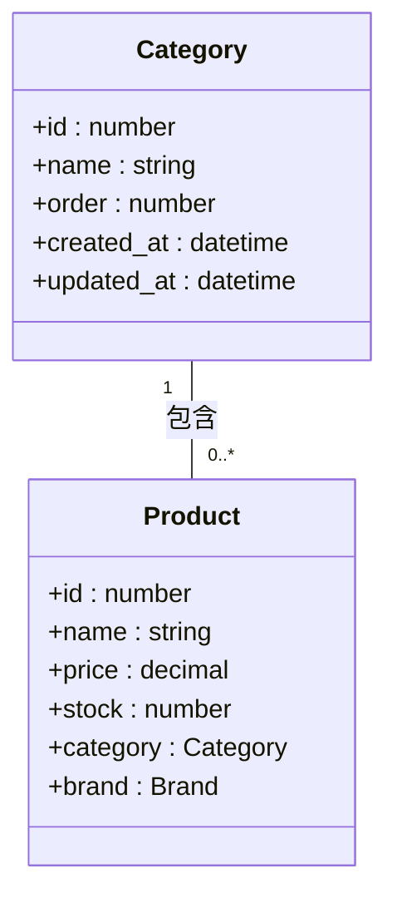
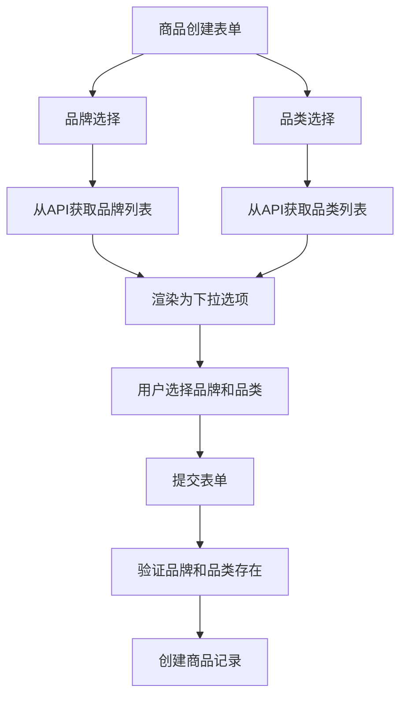
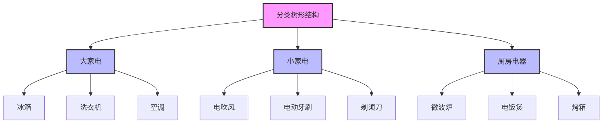
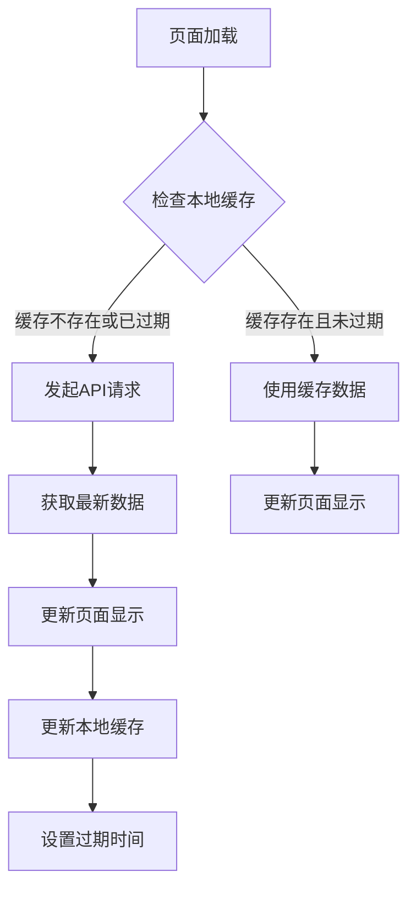

# 品牌与品类管理

<cite>
**本文档引用文件**  
- [Brands/index.tsx](file://merchant/src/pages/Brands/index.tsx)
- [Categories/index.tsx](file://merchant/src/pages/Categories/index.tsx)
- [api.ts](file://merchant/src/services/api.ts)
- [models.py](file://backend/catalog/models.py)
- [views.py](file://backend/catalog/views.py)
- [serializers.py](file://backend/catalog/serializers.py)
- [product.ts](file://frontend/src/services/product.ts)
- [storage.ts](file://frontend/src/utils/storage.ts)
</cite>

## 目录
1. [品牌管理界面设计](#品牌管理界面设计)
2. [品牌管理API实现](#品牌管理api实现)
3. [品类管理功能实现](#品类管理功能实现)
4. [商品创建表单中的数据引用](#商品创建表单中的数据引用)
5. [分类树形结构渲染示例](#分类树形结构渲染示例)
6. [数据缓存策略](#数据缓存策略)
7. [分类体系变更影响处理](#分类体系变更影响处理)

## 品牌管理界面设计

品牌管理界面提供了完整的品牌列表展示、创建、编辑和删除功能。界面采用Ant Design Pro组件库的ProTable和ModalForm组件构建，实现了现代化的管理界面。

品牌列表展示包含以下字段：
- **品牌名称**：支持搜索和筛选
- **Logo**：以图片形式展示，提升视觉识别
- **描述**：品牌详细信息展示
- **排序**：数字排序字段，支持排序功能
- **状态**：启用/禁用状态，以标签形式展示
- **创建时间**：日期时间格式展示

界面支持分页功能，默认每页显示20条记录，支持调整每页显示数量。工具栏提供"新增品牌"按钮，点击后弹出模态表单进行品牌创建。

编辑和删除操作通过操作列提供，编辑功能打开模态表单预填充当前品牌信息，删除功能通过Popconfirm组件确认操作，防止误删。

**Section sources**
- [Brands/index.tsx](file://merchant/src/pages/Brands/index.tsx#L1-L189)

## 品牌管理API实现

品牌管理API提供了createBrand、updateBrand和deleteBrand等核心功能的实现。

### createBrand实现
创建品牌API通过POST请求`/brands/`端点实现。前端调用`createBrand(values)`方法，其中values包含品牌名称、Logo URL、描述、排序和启用状态等字段。后端BrandViewSet接收请求并创建新的品牌记录。

### updateBrand实现
更新品牌API通过PATCH请求`/brands/{id}/`端点实现。前端调用`updateBrand(editingRecord.id, values)`方法，传递品牌ID和更新后的数据。后端BrandViewSet处理更新请求，确保数据完整性。

### deleteBrand实现
删除品牌API通过DELETE请求`/brands/{id}/`端点实现，特别实现了force_delete参数的级联删除策略。

```mermaid
sequenceDiagram
participant 前端 as 前端界面
participant 后端 as 后端API
participant 数据库 as 数据库
前端->>后端 : DELETE /brands/{id}/
后端->>数据库 : 查询品牌关联商品数量
数据库-->>后端 : 返回关联商品数量
alt 关联商品数量 > 0 且未强制删除
后端-->>前端 : 返回400错误，提示关联商品数量
前端->>前端 : 显示确认对话框"是否强制删除？"
前端->>后端 : DELETE /brands/{id}/?force_delete=true
end
alt 用户非管理员
后端-->>前端 : 返回403错误"权限不足"
end
else 正常删除或管理员强制删除
后端->>数据库 : 执行删除操作
数据库-->>后端 : 删除成功
后端-->>前端 : 返回204 No Content
end
```

**Diagram sources**
- [api.ts](file://merchant/src/services/api.ts#L20-L21)
- [views.py](file://backend/catalog/views.py#L634-L674)
- [Brands/index.tsx](file://merchant/src/pages/Brands/index.tsx#L13-L33)

**Section sources**
- [api.ts](file://merchant/src/services/api.ts#L17-L21)
- [views.py](file://backend/catalog/views.py#L589-L674)
- [models.py](file://backend/catalog/models.py#L21-L41)

## 品类管理功能实现

品类管理功能实现了多级分类结构的展示和管理，尽管数据库设计中已移除了父子层级关系，但保留了排序功能以支持自定义展示顺序。

品类管理界面与品牌管理类似，但功能相对简化，主要包含：
- **分类名称**：支持搜索功能
- **排序**：数字排序字段，支持排序功能

创建、编辑和删除功能的实现方式与品牌管理一致，通过ProTable和ModalForm组件实现。品类管理API包括createCategory、updateCategory和deleteCategory方法，分别对应品类的增删改操作。



**Diagram sources**
- [Categories/index.tsx](file://merchant/src/pages/Categories/index.tsx#L1-L134)
- [models.py](file://backend/catalog/models.py#L5-L19)
- [views.py](file://backend/catalog/views.py#L568-L587)

**Section sources**
- [Categories/index.tsx](file://merchant/src/pages/Categories/index.tsx#L1-L134)
- [models.py](file://backend/catalog/models.py#L5-L19)
- [views.py](file://backend/catalog/views.py#L568-L587)

## 商品创建表单中的数据引用

在商品创建表单中，品牌和品类数据通过下拉选择器的方式进行引用，确保数据的一致性和完整性。



前端通过并行请求获取品牌和分类数据，然后将数据映射为下拉选项。具体实现如下：

```typescript
<ProFormGroup>
  <ProFormSelect
    name="brand_id"
    label="品牌"
    rules={[{ required: true, message: '请选择品牌' }]}
    options={brands.map(item => ({ label: item.name, value: item.id }))}
    placeholder="请选择品牌"
    showSearch
    width="md"
  />
  
  <ProFormSelect
    name="category_id"
    label="分类"
    rules={[{ required: true, message: '请选择分类' }]}
    options={categories.map(item => ({ label: item.name, value: item.id }))}
    placeholder="请选择分类"
    showSearch
    width="md"
  />
</ProFormGroup>
```

**Diagram sources**
- [Products/index.tsx](file://merchant/src/pages/Products/index.tsx#L492-L508)
- [product.ts](file://frontend/src/services/product.ts#L41-L45)

**Section sources**
- [Products/index.tsx](file://merchant/src/pages/Products/index.tsx#L1-L511)
- [product.ts](file://frontend/src/services/product.ts#L35-L45)

## 分类树形结构渲染示例

尽管当前数据库设计为扁平化分类结构，但系统保留了扩展为树形结构的可能性。以下是分类树形结构的渲染示例：



虽然当前系统使用扁平化分类，但通过排序字段可以实现自定义的展示顺序。未来如需恢复树形结构，可通过添加parent字段和level字段来实现。

**Diagram sources**
- [models.py](file://backend/catalog/models.py#L5-L19)
- [0007_flatten_categories_remove_parent_level.py](file://backend/catalog/migrations/0007_flatten_categories_remove_parent_level.py#L1-L19)

## 数据缓存策略

系统实现了多层级的数据缓存策略，以提高页面加载性能和用户体验。

### 前端缓存策略
前端使用Storage工具类实现本地缓存，主要缓存品牌和分类数据：

```typescript
// 缓存键常量
export const CACHE_KEYS = {
  CATEGORIES: 'cache_categories',
  BRANDS: 'cache_brands',
  USER_INFO: 'cache_user_info'
}

// 缓存管理
Storage.set(CACHE_KEYS.CATEGORIES, data, 24 * 60 * 60 * 1000) // 缓存24小时
Storage.set(CACHE_KEYS.BRANDS, data, 24 * 60 * 60 * 1000) // 缓存24小时
```

### 缓存实现流程


### 后端缓存策略
后端在ProductSerializer中实现了折扣价格的缓存，减少数据库查询压力：

```python
# simple cache to reduce DB queries during listing/search
cache_key = f"discount:{user.id}:{obj.id}"
amount = cache.get(cache_key)
if amount is None:
    # 查询折扣信息
    cache.set(cache_key, amount, 60)  # 缓存60秒
```

缓存策略显著提升了系统性能，特别是对于频繁访问的品牌和分类数据，避免了重复的API请求。

**Diagram sources**
- [storage.ts](file://frontend/src/utils/storage.ts#L1-L44)
- [home/index.tsx](file://frontend/src/pages/home/index.tsx#L33-L63)
- [serializers.py](file://backend/catalog/serializers.py#L223-L245)

**Section sources**
- [storage.ts](file://frontend/src/utils/storage.ts#L1-L44)
- [home/index.tsx](file://frontend/src/pages/home/index.tsx#L33-L63)
- [serializers.py](file://backend/catalog/serializers.py#L223-L245)

## 分类体系变更影响处理

分类体系的变更会对现有商品产生重要影响，系统通过多种机制确保数据一致性和业务连续性。

### 数据库层面的约束
通过外键约束确保商品必须关联有效的分类：

```python
class Product(models.Model):
    category = models.ForeignKey(Category, on_delete=models.CASCADE, related_name='products', verbose_name='类别')
```

on_delete=models.CASCADE设置确保当分类被删除时，关联的商品也会被级联删除（在force_delete=true的情况下）。

### API层面的保护
BrandViewSet的destroy方法实现了删除保护机制：

1. **关联检查**：删除前检查品牌是否有关联商品
2. **用户提示**：如有关联商品，返回详细错误信息，包括关联商品数量
3. **强制删除**：仅管理员可执行强制删除，需通过force_delete参数明确指定
4. **权限验证**：确保只有管理员可执行强制删除操作

### 变更影响分析
分类体系变更可能产生的影响包括：

| 变更类型 | 影响范围 | 处理机制 |
|---------|---------|---------|
| 分类重命名 | 商品展示 | 直接更新，不影响商品数据 |
| 分类删除 | 关联商品 | 需先处理关联商品或强制删除 |
| 分类排序变更 | 前端展示顺序 | 重新加载数据，按新顺序展示 |
| 品牌状态变更 | 商品可见性 | 过滤查询，不影响商品数据 |

系统通过严格的API设计和前端交互，确保分类体系变更时能够妥善处理各种场景，保障数据完整性和用户体验。

**Section sources**
- [views.py](file://backend/catalog/views.py#L634-L674)
- [models.py](file://backend/catalog/models.py#L47-L48)
- [serializers.py](file://backend/catalog/serializers.py#L52-L55)