# 商品管理

<cite>
**本文档中引用的文件**
- [Products/index.tsx](file://merchant/src/pages/Products/index.tsx)
- [api.ts](file://merchant/src/services/api.ts)
- [ImageUpload/index.tsx](file://merchant/src/components/ImageUpload/index.tsx)
- [request.ts](file://merchant/src/utils/request.ts)
- [image.ts](file://merchant/src/utils/image.ts)
- [models.py](file://backend/catalog/models.py)
- [serializers.py](file://backend/catalog/serializers.py)
- [views.py](file://backend/catalog/views.py)
- [haierapi.py](file://backend/integrations/haierapi.py)
- [sync_haier_products.py](file://backend/catalog/management/commands/sync_haier_products.py)
- [api.md](file://api.md)
</cite>

## 目录
1. [简介](#简介)
2. [项目架构](#项目架构)
3. [商品列表页面](#商品列表页面)
4. [商品创建和编辑](#商品创建和编辑)
5. [图片上传组件](#图片上传组件)
6. [API接口设计](#api接口设计)
7. [海尔API集成](#海尔api集成)
8. [状态管理和业务逻辑](#状态管理和业务逻辑)
9. [错误处理机制](#错误处理机制)
10. [性能优化策略](#性能优化策略)
11. [总结](#总结)

## 简介

商品管理模块是基于React和Ant Design Pro构建的电商平台核心功能模块，负责商品的全生命周期管理。该模块提供了完整的商品列表展示、搜索筛选、创建编辑、图片上传以及与海尔API的深度集成能力。

### 核心特性
- **商品列表管理**：支持分页、搜索、筛选、排序的完整表格功能
- **商品创建编辑**：基于ModalForm的表单系统，包含丰富的商品属性
- **图片管理**：集成ImageUpload组件，支持主图和详情图的批量上传
- **海尔API集成**：自动同步海尔商品信息，支持价格、库存实时更新
- **状态管理**：完善的商品上下架、库存同步业务逻辑

## 项目架构

商品管理模块采用前后端分离架构，前端基于React + Ant Design Pro，后端使用Django REST Framework。

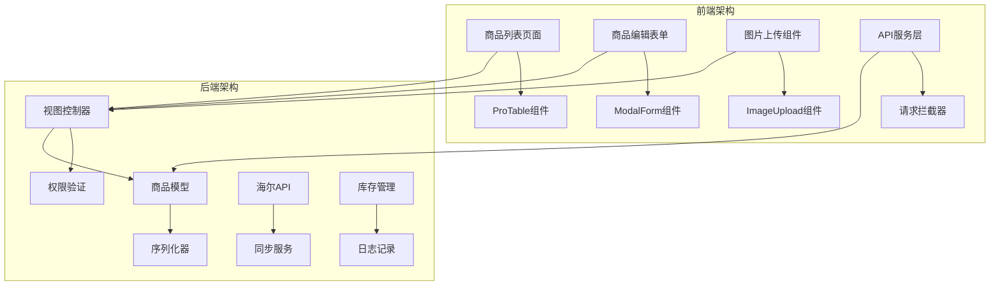

**图表来源**
- [Products/index.tsx](file://merchant/src/pages/Products/index.tsx#L1-L50)
- [api.ts](file://merchant/src/services/api.ts#L1-L30)
- [models.py](file://backend/catalog/models.py#L43-L110)

## 商品列表页面

商品列表页面是商品管理的核心入口，基于Ant Design Pro的ProTable组件构建，提供了强大的数据展示和交互功能。

### 表格列配置

商品列表包含以下核心列：

| 列名 | 数据字段 | 类型 | 功能描述 |
|------|----------|------|----------|
| 主图 | main_images | 图片 | 展示商品主图，支持缩略图显示 |
| 产品名称 | name | 文本 | 商品标题，支持单元格省略 |
| 品牌 | brand | 文本 | 品牌名称，支持筛选 |
| 分类 | category | 文本 | 商品分类，支持筛选 |
| 价格 | price | 数字 | 商品价格，格式化显示 |
| 库存 | stock | 数字 | 库存数量，红色标识缺货 |
| 状态 | is_active | 标签 | 上架/下架状态标识 |
| 销量 | sales_count | 数字 | 销售统计，支持排序 |
| 操作 | - | 按钮 | 编辑、删除功能 |

### 搜索和筛选功能

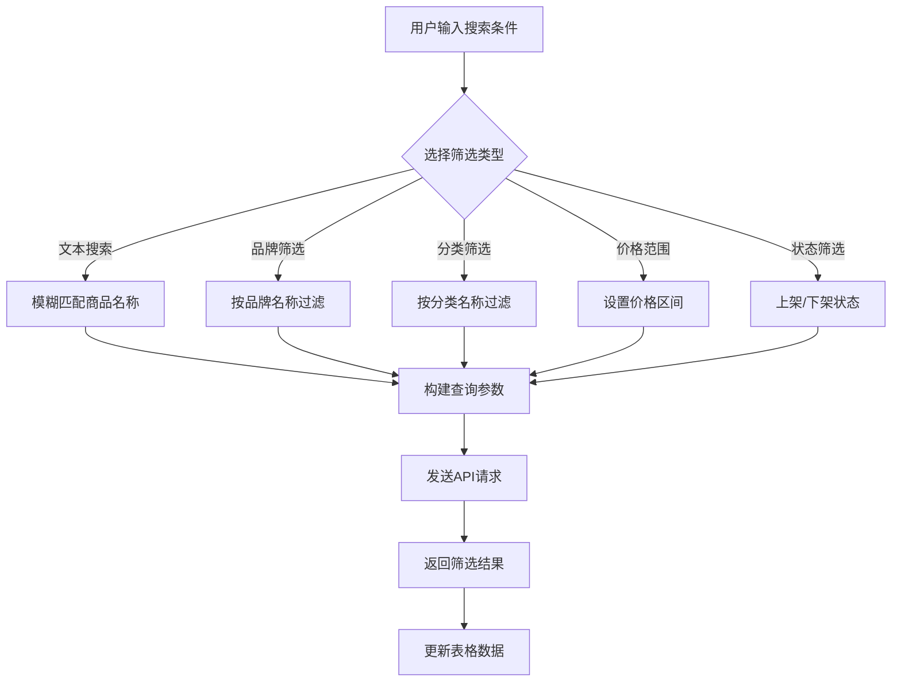

**图表来源**
- [Products/index.tsx](file://merchant/src/pages/Products/index.tsx#L313-L378)

### 分页和排序机制

系统支持灵活的分页和排序配置：

- **分页配置**：每页20条记录，支持快速跳转和页面大小切换
- **排序功能**：支持按价格、销量、创建时间等字段排序
- **缓存机制**：利用Ant Design Pro的内置缓存提升用户体验

**章节来源**
- [Products/index.tsx](file://merchant/src/pages/Products/index.tsx#L380-L410)

## 商品创建和编辑

商品创建和编辑功能基于Ant Design Pro的ModalForm组件实现，提供了完整的商品信息录入和管理能力。

### 表单布局设计

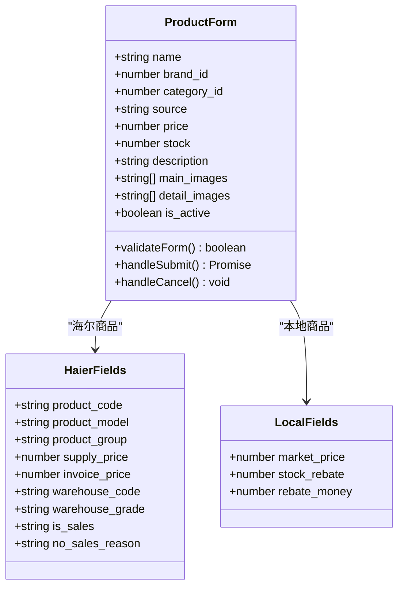

**图表来源**
- [Products/index.tsx](file://merchant/src/pages/Products/index.tsx#L483-L716)

### 表单验证规则

系统实现了严格的表单验证机制：

| 字段 | 验证规则 | 错误提示 |
|------|----------|----------|
| 产品名称 | 必填，长度限制 | 请输入产品名称 |
| 品牌 | 必选 | 请选择品牌 |
| 分类 | 必选 | 请选择分类 |
| 价格 | 必填，非负数，保留两位小数 | 请输入有效价格 |
| 库存 | 必填，非负整数 | 请输入库存数量 |
| 图片 | 文件类型检查，大小限制 | 图片格式不正确或过大 |

### 海尔商品特殊处理

对于海尔来源的商品，系统提供了特殊的处理逻辑：

- **只读字段**：海尔产品编码、型号、价格等字段在编辑时设为只读
- **自动同步**：海尔商品的价格、库存信息由系统自动同步更新
- **状态控制**：海尔商品的状态由API自动控制，不允许手动修改

**章节来源**
- [Products/index.tsx](file://merchant/src/pages/Products/index.tsx#L472-L716)

## 图片上传组件

ImageUpload组件是商品管理的重要组成部分，提供了专业级的图片上传和管理功能。

### 组件架构设计

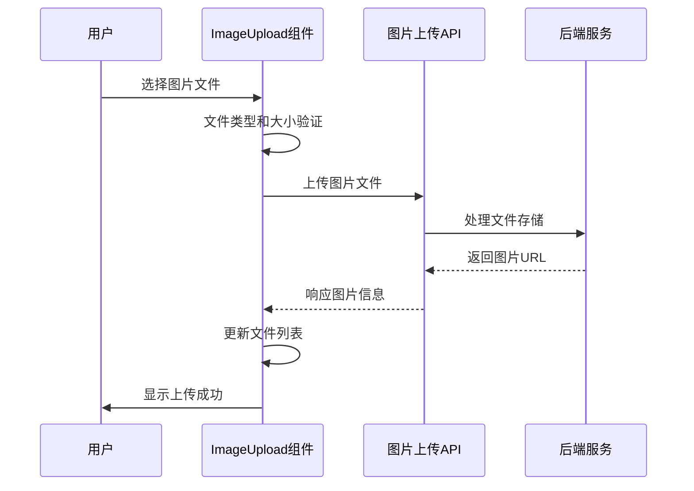

**图表来源**
- [ImageUpload/index.tsx](file://merchant/src/components/ImageUpload/index.tsx#L73-L122)

### 图片处理功能

ImageUpload组件具备以下核心功能：

| 功能 | 实现方式 | 限制 |
|------|----------|------|
| 文件验证 | 类型检查、大小限制 | 仅支持图片文件，最大20MB |
| 预览功能 | Modal弹窗预览 | 支持大图查看 |
| 批量上传 | 多文件选择 | 支持同时上传多个文件 |
| 实时更新 | 编辑时立即保存 | 上传或删除图片后自动同步 |
| 压缩优化 | 前端预处理 | 保持图片质量的同时减小体积 |

### 与后端的交互流程

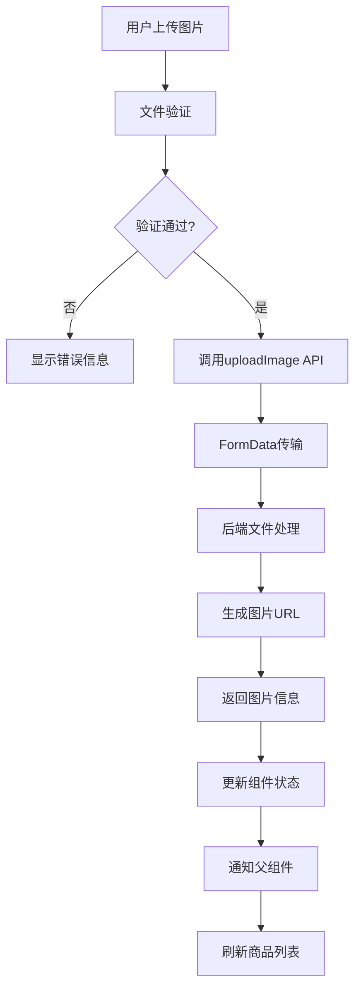

**图表来源**
- [ImageUpload/index.tsx](file://merchant/src/components/ImageUpload/index.tsx#L73-L122)
- [api.ts](file://merchant/src/services/api.ts#L36-L50)

**章节来源**
- [ImageUpload/index.tsx](file://merchant/src/components/ImageUpload/index.tsx#L1-L173)

## API接口设计

商品管理模块的API设计遵循RESTful原则，提供了完整的CRUD操作和特殊业务功能。

### 核心API接口

| 接口 | 方法 | 功能描述 | 参数 |
|------|------|----------|------|
| `/products/` | GET | 获取商品列表 | search, category, brand, price_range, page, page_size |
| `/products/` | POST | 创建新商品 | 商品基础信息和图片数据 |
| `/products/{id}/` | GET | 获取商品详情 | 商品ID |
| `/products/{id}/` | PUT/PATCH | 更新商品信息 | 商品ID和更新数据 |
| `/products/{id}/` | DELETE | 删除商品 | 商品ID |
| `/media-images/` | POST | 上传图片 | 文件和关联信息 |

### 请求响应格式

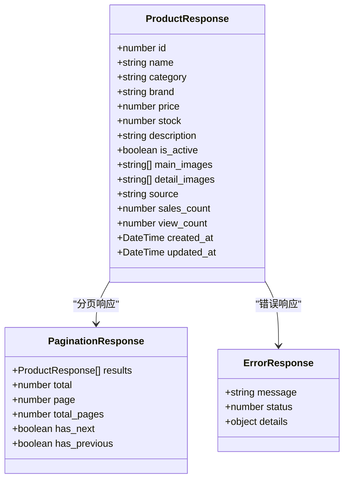

**图表来源**
- [api.ts](file://merchant/src/services/api.ts#L29-L34)
- [serializers.py](file://backend/catalog/serializers.py#L50-L84)

### 错误处理机制

系统实现了多层次的错误处理：

1. **网络层错误**：统一的请求拦截器处理网络异常
2. **业务层错误**：API返回标准化的错误信息
3. **UI层反馈**：友好的用户提示和错误恢复机制

**章节来源**
- [api.ts](file://merchant/src/services/api.ts#L1-L66)
- [request.ts](file://merchant/src/utils/request.ts#L1-L38)

## 海尔API集成

商品管理模块与海尔API的深度集成为商家提供了强大的供应链管理能力。

### 同步机制设计

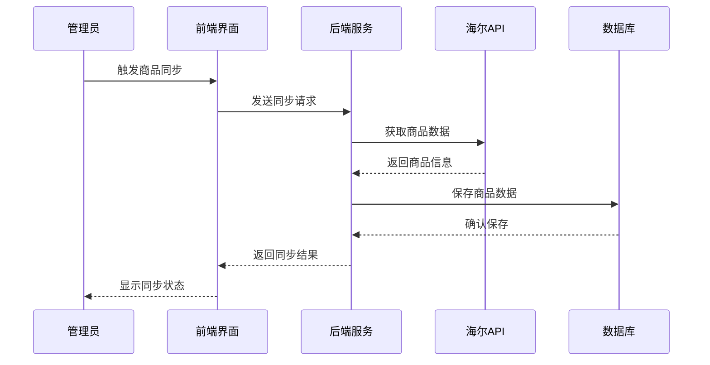

**图表来源**
- [sync_haier_products.py](file://backend/catalog/management/commands/sync_haier_products.py#L112-L142)
- [haierapi.py](file://backend/integrations/haierapi.py#L1-L50)

### 商品同步流程

系统支持多种同步类型：

| 同步类型 | 功能描述 | 更新内容 |
|----------|----------|----------|
| 商品同步 | 获取海尔商品基本信息 | 名称、描述、价格、图片等 |
| 价格同步 | 更新商品价格信息 | 供价、开票价、市场价 |
| 库存同步 | 实时更新库存数量 | 库存数量、仓库信息 |
| 订单推送 | 将订单推送到海尔系统 | 订单详情、物流信息 |

### 数据映射关系

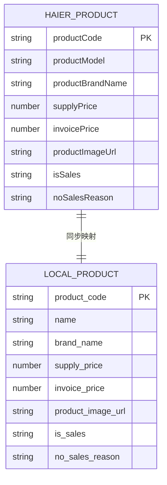

**图表来源**
- [models.py](file://backend/catalog/models.py#L118-L179)
- [views.py](file://backend/catalog/views.py#L464-L494)

**章节来源**
- [sync_haier_products.py](file://backend/catalog/management/commands/sync_haier_products.py#L112-L142)
- [haierapi.py](file://backend/integrations/haierapi.py#L1-L50)

## 状态管理和业务逻辑

商品管理模块实现了复杂的状态管理和业务逻辑处理。

### 商品状态流转

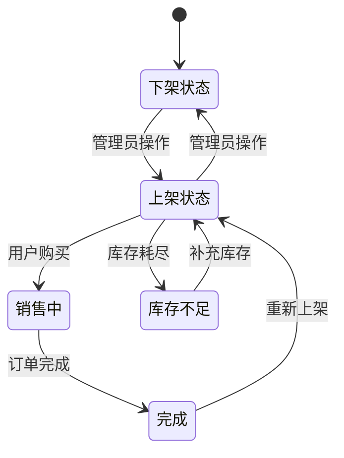

### 库存管理策略

系统实现了精细化的库存管理：

| 状态 | 描述 | 影响 |
|------|------|------|
| 库存充足 | stock > 0 | 商品可正常销售 |
| 库存紧张 | stock <= 10 | 显示库存告警 |
| 库存不足 | stock = 0 | 自动下架商品 |
| 库存同步 | last_sync_at | 记录最后同步时间 |

### 业务规则实现

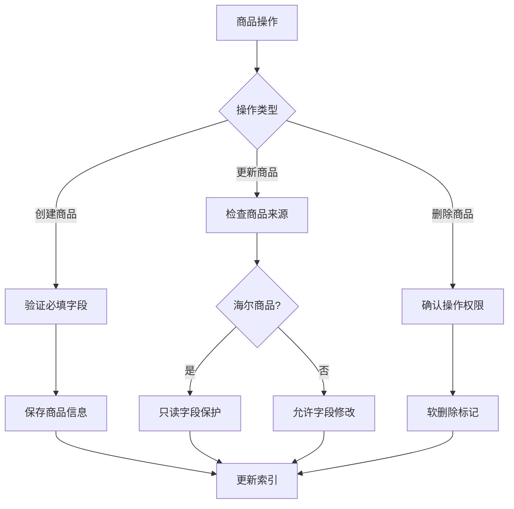

**图表来源**
- [models.py](file://backend/catalog/models.py#L84-L110)
- [views.py](file://backend/catalog/views.py#L464-L501)

**章节来源**
- [models.py](file://backend/catalog/models.py#L84-L312)
- [views.py](file://backend/catalog/views.py#L464-L501)

## 错误处理机制

商品管理模块实现了全面的错误处理机制，确保系统的稳定性和用户体验。

### 错误分类体系

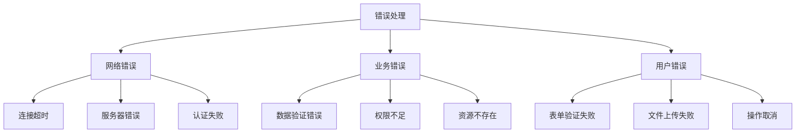

### 错误处理策略

| 错误类型 | 处理策略 | 用户体验 |
|----------|----------|----------|
| 网络异常 | 自动重试机制 | 显示加载状态 |
| 数据验证 | 实时校验提示 | 表单内错误提示 |
| 权限问题 | 跳转登录页面 | 友好错误提示 |
| 业务异常 | 详细错误信息 | 明确的操作指导 |

### 日志记录机制

系统实现了完整的日志记录：

- **操作日志**：记录所有商品操作的详细信息
- **错误日志**：捕获和记录系统错误
- **性能日志**：监控API响应时间和系统性能

**章节来源**
- [request.ts](file://merchant/src/utils/request.ts#L23-L37)
- [models.py](file://backend/catalog/models.py#L267-L312)

## 性能优化策略

商品管理模块采用了多种性能优化策略，确保良好的用户体验。

### 前端优化

1. **虚拟滚动**：大数据量表格的虚拟滚动实现
2. **懒加载**：图片和组件的懒加载机制
3. **缓存策略**：本地缓存常用数据
4. **防抖节流**：搜索和筛选的防抖处理

### 后端优化

1. **数据库索引**：为常用查询字段建立索引
2. **查询优化**：使用select_related和prefetch_related
3. **缓存机制**：Redis缓存热点数据
4. **异步处理**：图片上传和同步任务异步执行

### 性能监控

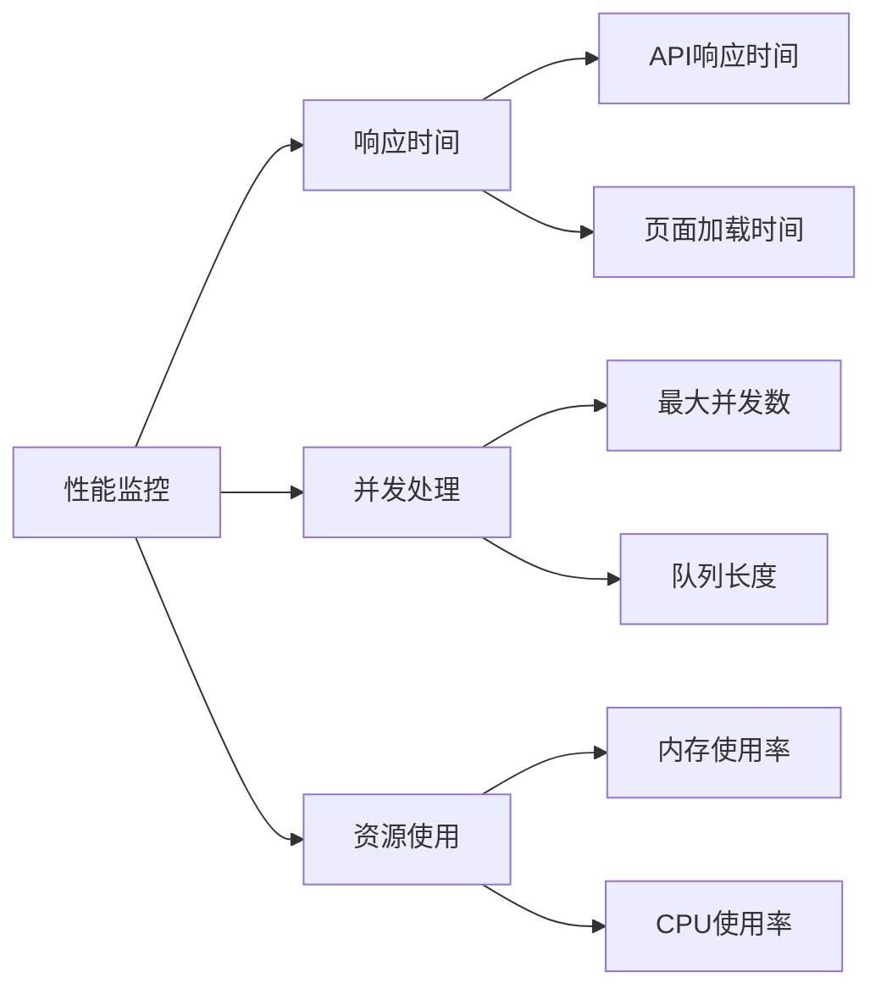

## 总结

商品管理模块是一个功能完整、架构清晰的电商核心功能模块。它成功地整合了前端React技术栈、后端Django框架以及第三方海尔API，为企业提供了强大的商品管理能力。

### 核心优势

1. **功能完整性**：涵盖了商品管理的全部核心功能
2. **用户体验优秀**：基于Ant Design Pro的现代化界面设计
3. **扩展性强**：模块化设计便于功能扩展
4. **稳定性高**：完善的错误处理和性能优化机制

### 技术特色

- **前后端分离**：清晰的职责划分和接口设计
- **API集成**：深度集成海尔API，实现供应链自动化
- **图片处理**：专业的图片上传和管理功能
- **状态管理**：完善的商品状态和业务逻辑处理

该模块为电商平台的商品管理提供了坚实的技术基础，能够满足现代电商业务对商品管理的各种需求。