# 商户管理后台

<cite>
**本文档引用的文件**
- [merchant/src/App.tsx](file://merchant/src/App.tsx)
- [merchant/src/main.tsx](file://merchant/src/main.tsx)
- [merchant/src/services/api.ts](file://merchant/src/services/api.ts)
- [merchant/src/utils/request.ts](file://merchant/src/utils/request.ts)
- [merchant/src/utils/auth.ts](file://merchant/src/utils/auth.ts)
- [merchant/src/pages/Products/index.tsx](file://merchant/src/pages/Products/index.tsx)
- [merchant/src/pages/Orders/index.tsx](file://merchant/src/pages/Orders/index.tsx)
- [merchant/src/pages/Users/index.tsx](file://merchant/src/pages/Users/index.tsx)
- [merchant/src/pages/Login/index.tsx](file://merchant/src/pages/Login/index.tsx)
- [merchant/src/components/Layout/index.tsx](file://merchant/src/components/Layout/index.tsx)
- [merchant/src/components/ImageUpload/index.tsx](file://merchant/src/components/ImageUpload/index.tsx)
- [merchant/package.json](file://merchant/package.json)
- [merchant/vite.config.ts](file://merchant/vite.config.ts)
</cite>

## 目录
1. [项目概述](#项目概述)
2. [技术架构](#技术架构)
3. [页面结构设计](#页面结构设计)
4. [核心组件分析](#核心组件分析)
5. [API调用机制](#api调用机制)
6. [权限控制逻辑](#权限控制逻辑)
7. [数据展示优化](#数据展示优化)
8. [实际代码示例](#实际代码示例)
9. [总结](#总结)

## 项目概述

商户管理后台是一个基于React + Ant Design Pro构建的企业级管理界面，采用现代化的前端技术栈，为商家提供全面的商品、订单、用户等业务管理功能。系统支持多角色权限管理，具备完善的CRUD操作能力和实时数据交互能力。

### 主要特性
- **响应式设计**：适配各种屏幕尺寸
- **权限控制**：基于角色的访问控制
- **实时数据**：支持实时数据更新和状态变更
- **图片管理**：完整的图片上传和管理功能
- **搜索筛选**：强大的搜索和筛选功能
- **状态管理**：统一的状态管理和错误处理

## 技术架构

### 前端技术栈

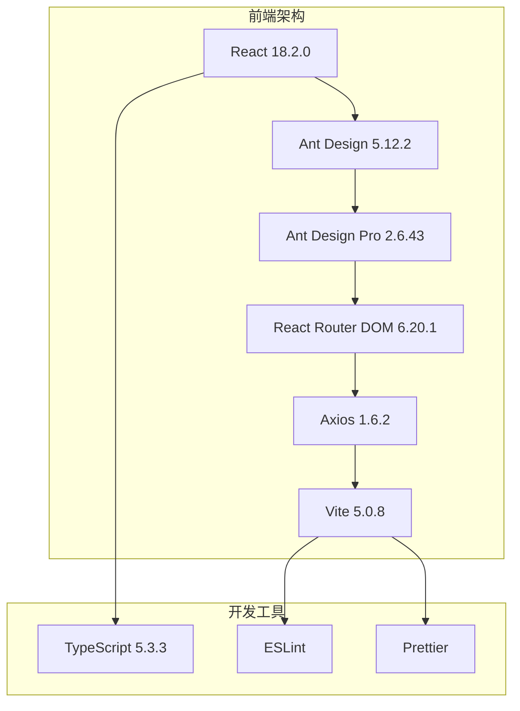

**图表来源**
- [merchant/package.json](file://merchant/package.json#L10-L25)
- [merchant/vite.config.ts](file://merchant/vite.config.ts#L1-L27)

### 项目结构

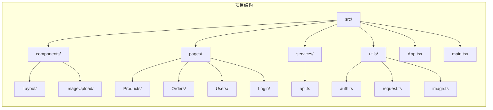

**节来源**
- [merchant/src/App.tsx](file://merchant/src/App.tsx#L1-L45)
- [merchant/src/main.tsx](file://merchant/src/main.tsx#L1-L17)

## 页面结构设计

### 导航布局

系统采用经典的侧边栏导航布局，包含以下主要页面：

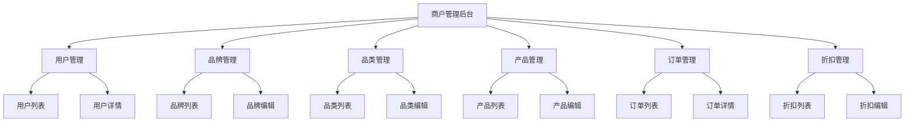

**图表来源**
- [merchant/src/components/Layout/index.tsx](file://merchant/src/components/Layout/index.tsx#L17-L24)

### 核心页面组件

每个页面都遵循统一的设计模式：

1. **列表页面**：使用ProTable组件展示数据
2. **编辑页面**：使用ModalForm组件进行数据编辑
3. **详情页面**：使用Drawer或Modal展示详细信息

**节来源**
- [merchant/src/pages/Products/index.tsx](file://merchant/src/pages/Products/index.tsx#L1-L50)
- [merchant/src/pages/Orders/index.tsx](file://merchant/src/pages/Orders/index.tsx#L1-L50)
- [merchant/src/pages/Users/index.tsx](file://merchant/src/pages/Users/index.tsx#L1-L50)

## 核心组件分析

### Ant Design组件使用

#### ProTable组件的应用

ProTable是系统的核心表格组件，广泛应用于各个管理页面：

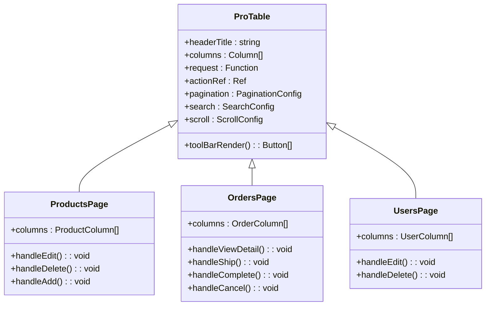

**图表来源**
- [merchant/src/pages/Products/index.tsx](file://merchant/src/pages/Products/index.tsx#L298-L410)
- [merchant/src/pages/Orders/index.tsx](file://merchant/src/pages/Orders/index.tsx#L336-L415)
- [merchant/src/pages/Users/index.tsx](file://merchant/src/pages/Users/index.tsx#L154-L227)

#### ModalForm组件的应用

ModalForm用于创建和编辑实体对象：

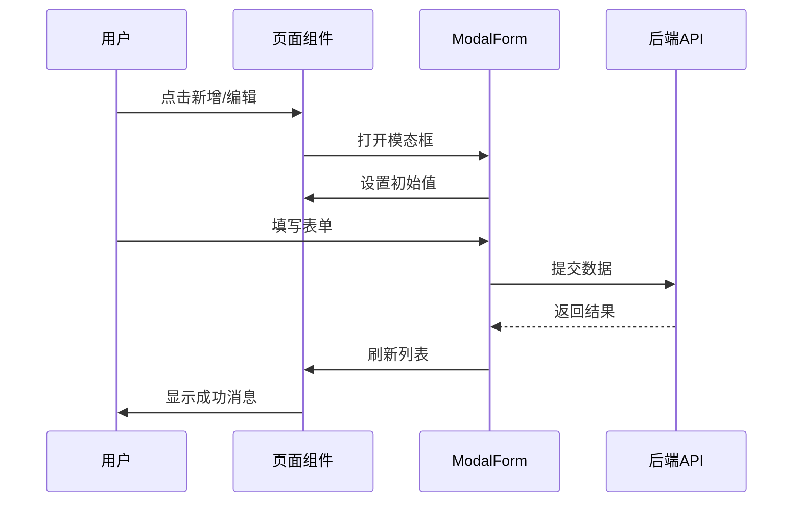

**图表来源**
- [merchant/src/pages/Products/index.tsx](file://merchant/src/pages/Products/index.tsx#L412-L471)
- [merchant/src/pages/Users/index.tsx](file://merchant/src/pages/Users/index.tsx#L229-L288)

#### ImageUpload组件的应用

专门用于图片上传和管理：

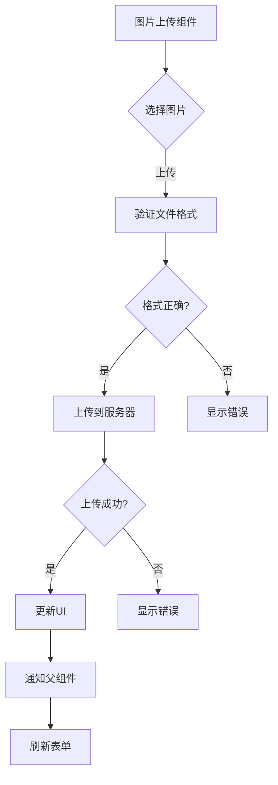

**图表来源**
- [merchant/src/components/ImageUpload/index.tsx](file://merchant/src/components/ImageUpload/index.tsx#L73-L122)

**节来源**
- [merchant/src/components/ImageUpload/index.tsx](file://merchant/src/components/ImageUpload/index.tsx#L1-L173)

## API调用机制

### 请求封装层

系统通过统一的请求封装层处理所有API调用：

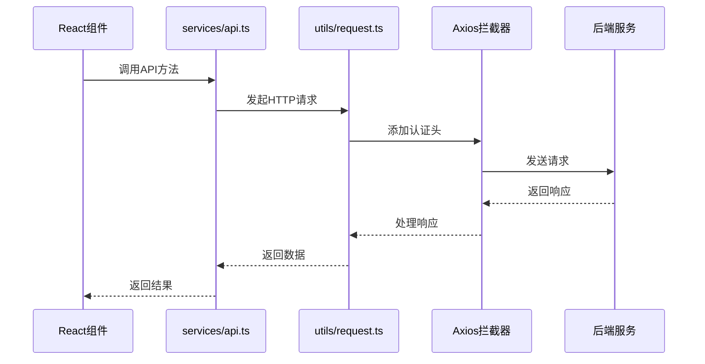

**图表来源**
- [merchant/src/services/api.ts](file://merchant/src/services/api.ts#L1-L66)
- [merchant/src/utils/request.ts](file://merchant/src/utils/request.ts#L1-L38)

### API方法分类

| 功能模块 | API方法 | 描述 |
|---------|---------|------|
| 用户管理 | getUsers, getUser, createUser, updateUser, deleteUser | 用户基本信息管理 |
| 品牌管理 | getBrands, createBrand, updateBrand, deleteBrand | 品牌信息维护 |
| 品类管理 | getCategories, createCategory, updateCategory, deleteCategory | 商品分类管理 |
| 产品管理 | getProducts, getProduct, createProduct, updateProduct, deleteProduct | 商品信息管理 |
| 订单管理 | getOrders, getOrder, shipOrder, completeOrder, cancelOrder | 订单状态管理 |
| 图片上传 | uploadImage | 图片资源上传 |
| 登录认证 | login | 用户身份验证 |

**节来源**
- [merchant/src/services/api.ts](file://merchant/src/services/api.ts#L1-L66)

### 错误处理机制

系统实现了完善的错误处理机制：

1. **认证失效处理**：401错误自动跳转登录页
2. **网络错误处理**：显示友好的错误提示
3. **业务错误处理**：根据具体错误类型给出相应提示

**节来源**
- [merchant/src/utils/request.ts](file://merchant/src/utils/request.ts#L23-L35)

## 权限控制逻辑

### 认证流程

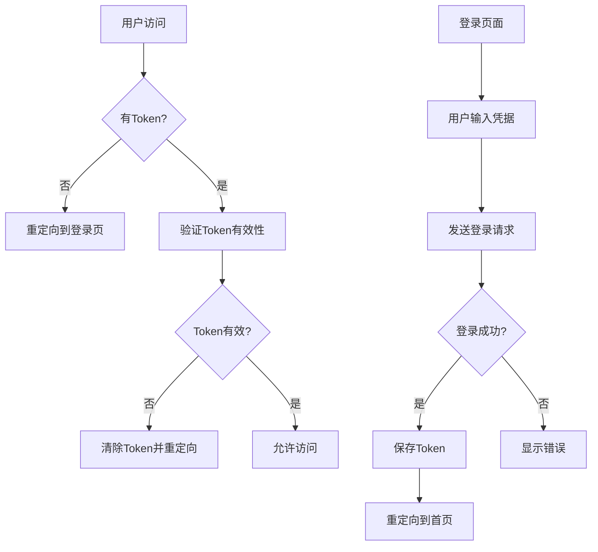

**图表来源**
- [merchant/src/utils/auth.ts](file://merchant/src/utils/auth.ts#L1-L14)
- [merchant/src/pages/Login/index.tsx](file://merchant/src/pages/Login/index.tsx#L11-L19)

### 路由保护

系统使用PrivateRoute组件保护需要认证的路由：

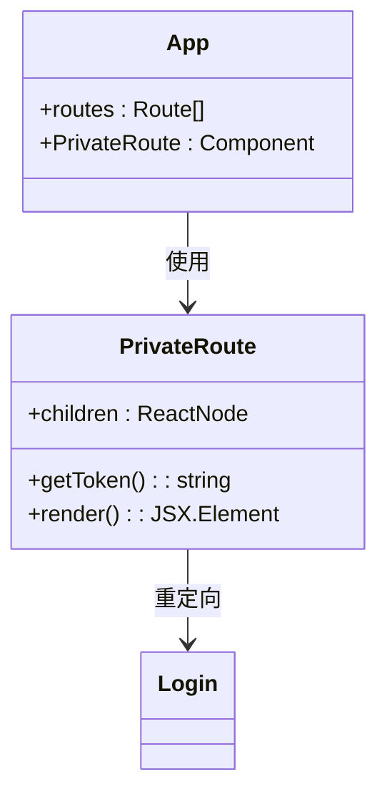

**图表来源**
- [merchant/src/App.tsx](file://merchant/src/App.tsx#L12-L14)

### 权限验证

系统通过Token机制验证用户身份和权限级别：

**节来源**
- [merchant/src/utils/auth.ts](file://merchant/src/utils/auth.ts#L1-L14)
- [merchant/src/App.tsx](file://merchant/src/App.tsx#L10-L14)

## 数据展示优化

### 分页功能

系统采用服务端分页，提升大数据量场景下的性能：

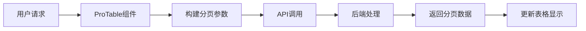

**图表来源**
- [merchant/src/pages/Products/index.tsx](file://merchant/src/pages/Products/index.tsx#L313-L380)

### 搜索和筛选

系统提供了丰富的搜索和筛选功能：

| 功能 | 实现方式 | 应用页面 |
|------|----------|----------|
| 关键词搜索 | 文本输入框 | Products, Orders, Users |
| 下拉筛选 | ProFormSelect | Products, Orders |
| 数字范围筛选 | ProFormDigit | Products |
| 日期范围筛选 | ProFormDatePicker | Orders |
| 多选筛选 | ProFormCheckbox | Products |

**节来源**
- [merchant/src/pages/Products/index.tsx](file://merchant/src/pages/Products/index.tsx#L313-L380)
- [merchant/src/pages/Orders/index.tsx](file://merchant/src/pages/Orders/index.tsx#L340-L397)

### 排序功能

支持多字段排序，提升数据浏览体验：

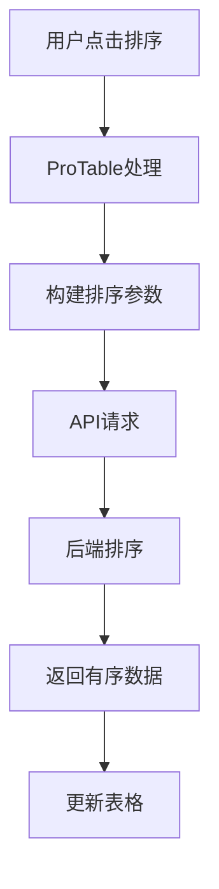

**图表来源**
- [merchant/src/pages/Products/index.tsx](file://merchant/src/pages/Products/index.tsx#L349-L356)

## 实际代码示例

### 商品列表页实现

商品管理页面展示了系统的完整功能：

#### 数据加载和表格配置

商品列表页面使用ProTable组件展示产品信息，包含以下核心功能：

1. **数据加载**：通过getProducts API获取产品数据
2. **搜索筛选**：支持按名称、品牌、分类、价格范围等条件筛选
3. **分页处理**：支持自定义每页显示数量
4. **排序功能**：支持按销量等字段排序

#### 编辑功能实现

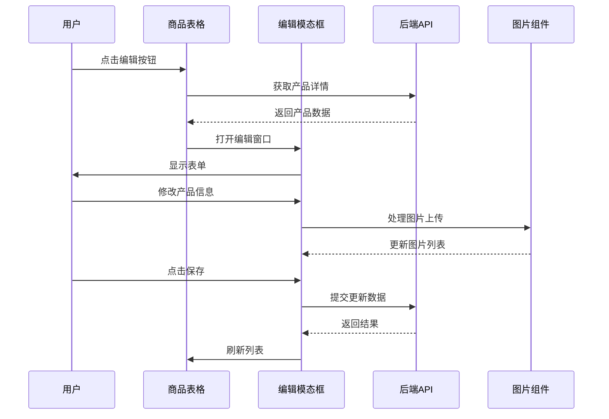

**图表来源**
- [merchant/src/pages/Products/index.tsx](file://merchant/src/pages/Products/index.tsx#L207-L246)
- [merchant/src/pages/Products/index.tsx](file://merchant/src/pages/Products/index.tsx#L412-L471)

#### 图片管理功能

商品管理中的图片上传功能具有以下特点：

1. **即时更新**：编辑时上传或删除图片会立即保存到数据库
2. **格式验证**：限制图片格式和大小
3. **预览功能**：支持图片预览和缩放
4. **数量限制**：主图最多5张，详情图最多10张

**节来源**
- [merchant/src/pages/Products/index.tsx](file://merchant/src/pages/Products/index.tsx#L272-L295)
- [merchant/src/components/ImageUpload/index.tsx](file://merchant/src/components/ImageUpload/index.tsx#L73-L122)

### 订单管理功能

订单管理页面展示了复杂业务流程的处理：

#### 订单状态流转

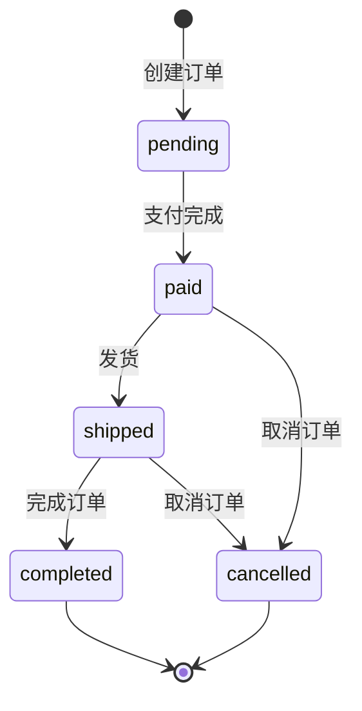

**图表来源**
- [merchant/src/pages/Orders/index.tsx](file://merchant/src/pages/Orders/index.tsx#L30-L48)

#### 海尔系统集成

系统支持与海尔ERP系统的集成：

1. **订单推送**：将订单推送到海尔系统
2. **物流查询**：查询海尔系统的物流信息
3. **状态同步**：保持订单状态的一致性

**节来源**
- [merchant/src/pages/Orders/index.tsx](file://merchant/src/pages/Orders/index.tsx#L70-L106)

### 用户管理功能

用户管理页面实现了基础的CRUD操作：

#### 权限管理

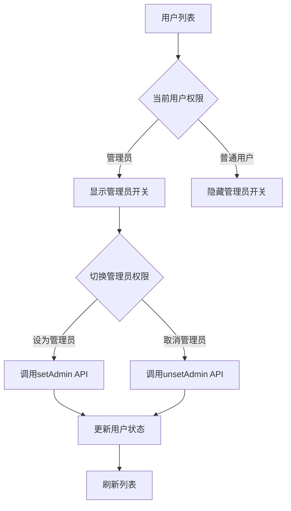

**图表来源**
- [merchant/src/pages/Users/index.tsx](file://merchant/src/pages/Users/index.tsx#L58-L71)

**节来源**
- [merchant/src/pages/Users/index.tsx](file://merchant/src/pages/Users/index.tsx#L1-L292)

## 总结

商户管理后台是一个功能完善、架构清晰的企业级管理平台。通过React + Ant Design Pro的技术组合，系统实现了：

### 技术优势

1. **现代化架构**：采用React 18最新特性，配合TypeScript提供类型安全
2. **组件化设计**：大量使用Ant Design Pro组件，提升开发效率
3. **统一API设计**：通过services层封装API调用，便于维护和扩展
4. **完善的权限控制**：基于Token的认证机制，确保数据安全

### 功能特色

1. **丰富的交互体验**：支持实时数据更新、即时反馈等功能
2. **强大的数据处理能力**：分页、搜索、筛选、排序等完整功能
3. **专业的图片管理**：支持图片上传、预览、批量操作
4. **业务流程完整**：涵盖商品、订单、用户等核心业务

### 扩展性

系统具有良好的扩展性，可以轻松添加新的管理页面和功能模块。通过统一的组件库和API设计，新功能的开发成本较低，维护也更加便捷。

这个商户管理后台为商家提供了专业、高效的管理工具，能够满足日常运营的各种需求，是现代电商系统的重要组成部分。