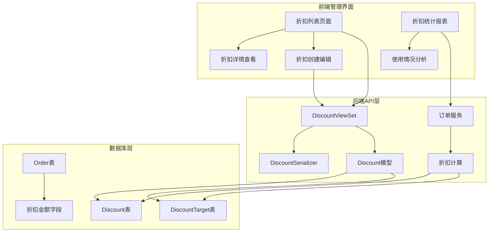
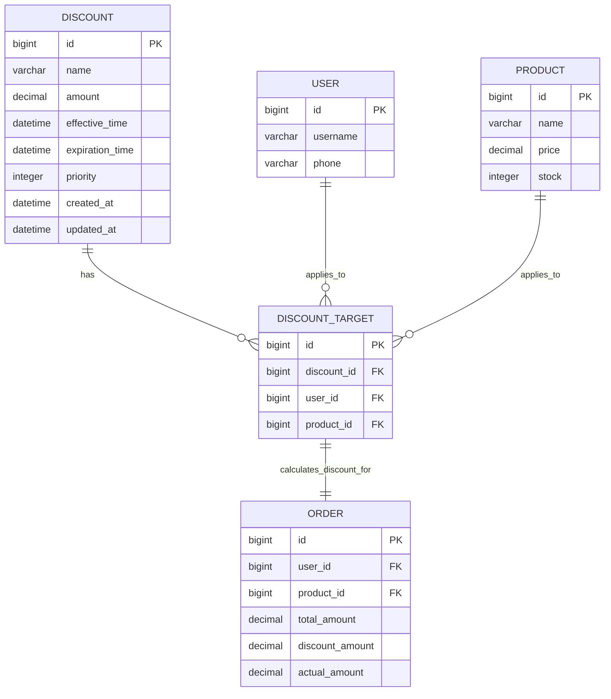
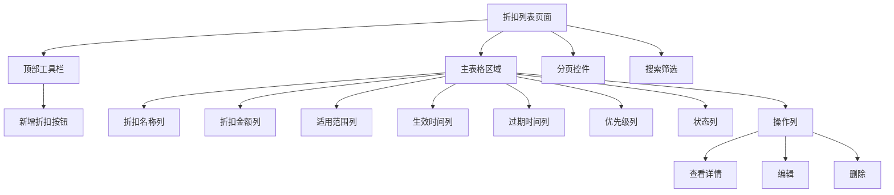
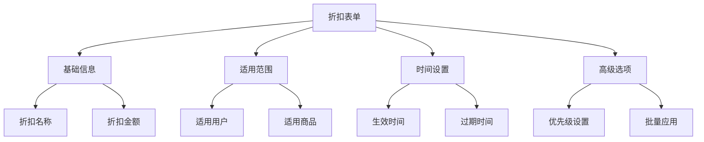
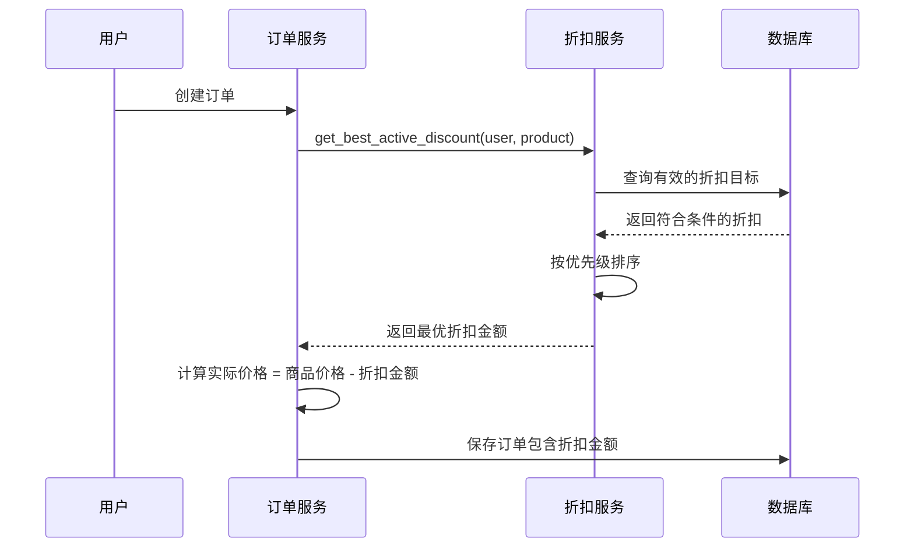
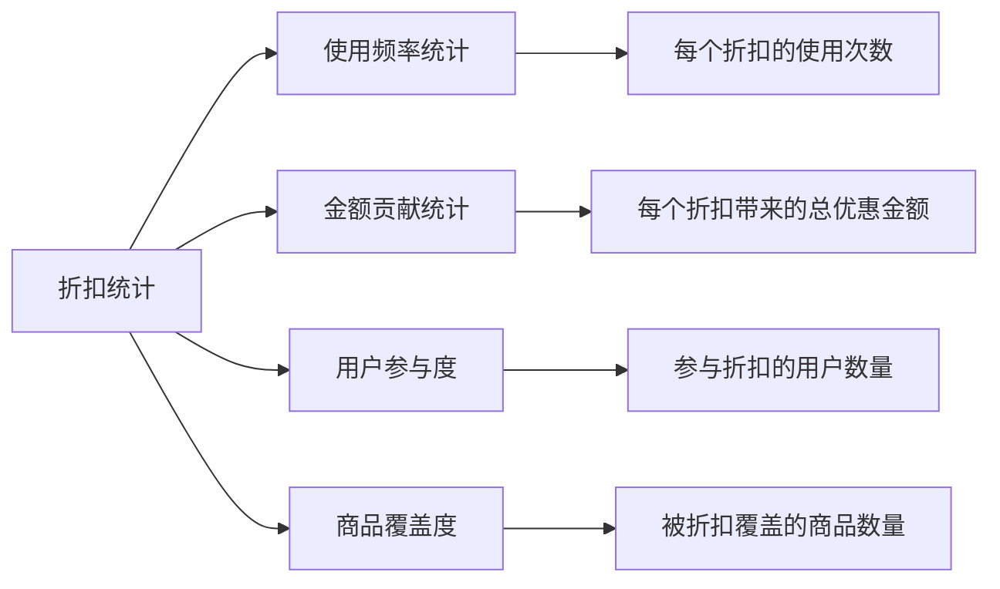

# 折扣管理模块详细文档

<cite>
**本文档引用的文件**
- [merchant/src/pages/Discounts/index.tsx](file://merchant/src/pages/Discounts/index.tsx)
- [backend/orders/models.py](file://backend/orders/models.py)
- [backend/orders/views.py](file://backend/orders/views.py)
- [backend/orders/serializers.py](file://backend/orders/serializers.py)
- [backend/orders/services.py](file://backend/orders/services.py)
- [backend/orders/urls.py](file://backend/orders/urls.py)
- [merchant/src/services/api.ts](file://merchant/src/services/api.ts)
- [api.md](file://api.md)
</cite>

## 目录
1. [概述](#概述)
2. [系统架构](#系统架构)
3. [折扣模型设计](#折扣模型设计)
4. [折扣列表页面](#折扣列表页面)
5. [折扣创建和编辑](#折扣创建和编辑)
6. [折扣计算机制](#折扣计算机制)
7. [API接口详解](#api接口详解)
8. [折扣使用统计](#折扣使用统计)
9. [最佳实践](#最佳实践)
10. [故障排除](#故障排除)

## 概述

折扣管理模块是电商平台的核心促销功能，负责管理各种类型的折扣活动，包括满减优惠、百分比折扣等。该模块提供了完整的折扣生命周期管理，从创建、配置、生效到统计分析的全流程支持。

### 主要功能特性

- **多维度折扣管理**：支持按用户、商品、品类设置不同类型的折扣
- **灵活的时间控制**：精确控制折扣的生效时间和过期时间
- **优先级排序**：支持多折扣叠加时的优先级控制
- **实时计算**：订单创建时自动计算最优折扣
- **统计分析**：提供详细的折扣使用情况统计

## 系统架构



**图表来源**
- [backend/orders/views.py](file://backend/orders/views.py#L974-L1087)
- [backend/orders/models.py](file://backend/orders/models.py#L237-L290)

## 折扣模型设计

### 核心数据结构

系统采用多对多关联的方式实现灵活的折扣适用范围控制：



**图表来源**
- [backend/orders/models.py](file://backend/orders/models.py#L237-L290)

### 关键字段说明

| 字段名 | 类型 | 说明 | 约束 |
|--------|------|------|------|
| `name` | CharField | 折扣名称，用于标识 | max_length=100 |
| `amount` | DecimalField | 折扣金额，固定减免金额 | validators=[MinValueValidator(0)] |
| `effective_time` | DateTimeField | 生效时间 | 不能为空 |
| `expiration_time` | DateTimeField | 过期时间 | 不能为空 |
| `priority` | IntegerField | 优先级，数值越大优先级越高 | default=0 |
| `created_at` | DateTimeField | 创建时间 | 自动生成 |
| `updated_at` | DateTimeField | 更新时间 | 自动生成 |

**章节来源**
- [backend/orders/models.py](file://backend/orders/models.py#L237-L266)

## 折扣列表页面

### 页面布局设计

折扣列表页面采用现代化的表格设计，提供完整的折扣管理功能：



**图表来源**
- [merchant/src/pages/Discounts/index.tsx](file://merchant/src/pages/Discounts/index.tsx#L66-L151)

### 状态显示机制

系统通过颜色标签直观显示折扣状态：

- **绿色标签**："生效中" - 当前时间在生效时间和过期时间之间
- **红色标签**："已失效" - 当前时间超出过期时间或未达到生效时间

### 分页和搜索功能

- **分页支持**：支持大数据量的分页加载
- **搜索功能**：支持按折扣名称模糊搜索
- **筛选条件**：支持按优先级精确筛选

**章节来源**
- [merchant/src/pages/Discounts/index.tsx](file://merchant/src/pages/Discounts/index.tsx#L154-L188)

## 折扣创建和编辑

### 表单设计

折扣创建和编辑采用统一的表单设计，支持多种折扣配置：



**图表来源**
- [merchant/src/pages/Discounts/index.tsx](file://merchant/src/pages/Discounts/index.tsx#L195-L298)

### 字段验证规则

| 字段 | 验证规则 | 错误提示 |
|------|----------|----------|
| 折扣名称 | 必填 | 请输入折扣名称 |
| 折扣金额 | 必填，>=0 | 请输入折扣金额 |
| 适用用户 | 必填，至少一个 | 请至少选择一个用户 |
| 适用商品 | 必填，至少一个 | 请至少选择一个商品 |
| 生效时间 | 必填 | 请选择生效时间 |
| 过期时间 | 必填 | 请选择过期时间 |

### 批量设置功能

系统支持通过API进行批量折扣设置，特别适用于为特定用户群体设置统一折扣：

```typescript
// 批量设置折扣的API调用示例
const batchSetDiscount = async (userId: number, productIds: number[], amount: number) => {
    const response = await axios.post('/discounts/batch_set/', {
        user_id: userId,
        product_ids: productIds,
        amount: amount,
        effective_time: new Date().toISOString(),
        expiration_time: new Date(Date.now() + 30 * 24 * 60 * 60 * 1000).toISOString(),
        priority: 1
    });
    return response.data;
};
```

**章节来源**
- [merchant/src/pages/Discounts/index.tsx](file://merchant/src/pages/Discounts/index.tsx#L195-L220)

## 折扣计算机制

### 计算流程



**图表来源**
- [backend/orders/services.py](file://backend/orders/services.py#L11-L41)
- [backend/orders/services.py](file://backend/orders/services.py#L258-L262)

### 折扣计算规则

1. **有效性检查**：确保当前时间在生效时间和过期时间之间
2. **优先级排序**：按优先级降序排列，相同优先级按更新时间降序
3. **金额限制**：折扣金额不超过商品原价
4. **缓存优化**：为频繁访问的折扣结果设置短期缓存

### 实际代码示例

```python
def get_best_active_discount(user, product):
    """获取用户对商品的最佳活跃折扣"""
    if not user or not user.is_authenticated:
        return 0
        
    # 构建缓存键
    cache_key = f"discount:{user.id}:{product.id}"
    
    # 尝试从缓存获取
    cached = cache.get(cache_key)
    if cached is not None:
        return cached
    
    # 查询有效的折扣
    now = timezone.now()
    discount_target = DiscountTarget.objects.select_related('discount').filter(
        user=user,
        product=product,
        discount__effective_time__lte=now,
        discount__expiration_time__gt=now,
    ).order_by('-discount__priority', '-discount__updated_at').first()
    
    # 计算折扣金额
    amount = discount_target.discount.amount if discount_target else 0
    amount = max(0, min(amount, product.price))  # 限制在合理范围内
    
    # 设置缓存（60秒）
    cache.set(cache_key, amount, 60)
    
    return amount
```

**章节来源**
- [backend/orders/services.py](file://backend/orders/services.py#L11-L41)

## API接口详解

### 核心API端点

| 端点 | 方法 | 权限 | 功能描述 |
|------|------|------|----------|
| `/discounts/` | GET | IsAuthenticated | 获取折扣列表 |
| `/discounts/` | POST | IsAdmin | 创建新折扣 |
| `/discounts/{id}/` | GET | IsAuthenticated | 获取折扣详情 |
| `/discounts/{id}/` | PATCH | IsAdmin | 更新折扣信息 |
| `/discounts/{id}/` | DELETE | IsAdmin | 删除折扣 |
| `/discounts/batch_set/` | POST | IsAdmin | 批量设置折扣 |
| `/discounts/query_user_products/` | GET | IsAuthenticated | 查询用户商品折扣 |

### 创建折扣API

```typescript
// 创建折扣的API调用
const createDiscount = async (discountData: {
    name: string;
    amount: number;
    user_ids: number[];
    product_ids: number[];
    effective_time: string;
    expiration_time: string;
    priority?: number;
}) => {
    const response = await axios.post('/discounts/', discountData);
    return response.data;
};
```

### 批量查询API

```typescript
// 查询用户对指定商品的折扣
const queryUserProductsDiscount = async (productIds: number[]) => {
    const response = await axios.get('/discounts/query_user_products/', {
        params: { product_ids: productIds.join(',') }
    });
    return response.data;
};
```

**章节来源**
- [api.md](file://api.md#L380-L421)
- [merchant/src/services/api.ts](file://merchant/src/services/api.ts#L61-L66)

## 折扣使用统计

### 统计维度

系统提供多维度的折扣使用情况统计：



### 关键指标

| 指标名称 | 计算方式 | 业务价值 |
|----------|----------|----------|
| 折扣使用率 | 已使用折扣次数 / 总发放次数 | 衡量折扣吸引力 |
| 平均折扣金额 | 总优惠金额 / 使用次数 | 评估折扣力度 |
| 用户转化率 | 使用折扣用户数 / 总用户数 | 衡量促销效果 |
| 商品覆盖率 | 参与折扣商品数 / 总商品数 | 评估促销覆盖面 |

### 实现原理

```python
class OrderAnalytics:
    @staticmethod
    def get_discount_usage_stats(start_date=None, end_date=None):
        """获取折扣使用统计"""
        filters = {}
        if start_date and end_date:
            filters['created_at__range'] = [start_date, end_date]
        
        # 按折扣分组统计
        stats = Order.objects.filter(**filters).values(
            'discount_amount'
        ).annotate(
            count=Count('id'),
            total_discount=Sum('discount_amount'),
            avg_discount=Avg('discount_amount')
        ).order_by('-total_discount')
        
        return list(stats)
```

**章节来源**
- [backend/orders/views.py](file://backend/orders/views.py#L1455-L1614)

## 最佳实践

### 折扣策略建议

1. **分层定价策略**
   - 基础折扣：针对新用户或首次购买
   - 会员折扣：针对VIP用户群体
   - 限时折扣：针对特定时间段或商品

2. **时间控制策略**
   ```python
   # 示例：设置不同时间段的折扣策略
   def set_seasonal_discounts():
       # 双十一期间
       create_discount(
           name="双十一特惠",
           amount=100,
           effective_time="2024-11-10T00:00:00Z",
           expiration_time="2024-11-12T23:59:59Z",
           priority=10
       )
       
       # 黑五促销
       create_discount(
           name="黑色星期五",
           amount=150,
           effective_time="2024-11-24T00:00:00Z",
           expiration_time="2024-11-26T23:59:59Z",
           priority=10
       )
   ```

3. **用户分群策略**
   ```python
   # 基于用户行为的个性化折扣
   def set_personalized_discounts(user_behavior):
       if user_behavior['purchase_frequency'] > 5:
           # 高频用户专属折扣
           create_discount(
               name=f"VIP用户专享-{user_behavior['user_id']}",
               amount=200,
               user_ids=[user_behavior['user_id']],
               product_ids=user_behavior['preferred_categories'],
               priority=20
           )
   ```

### 性能优化建议

1. **缓存策略**
   - 折扣计算结果缓存60秒
   - 用户折扣偏好缓存300秒
   - 商品折扣信息缓存1800秒

2. **数据库优化**
   - 为 `effective_time` 和 `expiration_time` 字段添加索引
   - 为 `priority` 字段添加索引以加速排序
   - 定期清理过期的折扣数据

3. **批量操作优化**
   ```python
   # 批量创建折扣目标
   def bulk_create_discount_targets(discount, user_ids, product_ids):
       targets = [
           DiscountTarget(discount=discount, user_id=uid, product_id=pid)
           for uid in user_ids for pid in product_ids
       ]
       DiscountTarget.objects.bulk_create(targets, ignore_conflicts=True)
   ```

## 故障排除

### 常见问题及解决方案

1. **折扣未生效**
   - 检查生效时间和过期时间是否正确
   - 确认用户和商品的适用范围设置
   - 验证折扣优先级设置

2. **折扣金额计算错误**
   - 检查折扣金额是否超过商品价格
   - 确认缓存是否过期
   - 验证数据库连接和查询性能

3. **批量设置失败**
   - 检查用户ID和商品ID的有效性
   - 确认数据库唯一约束冲突
   - 验证批量操作的事务完整性

### 调试工具

```python
# 折扣调试辅助函数
def debug_discount_effectiveness(discount_id):
    """调试折扣效果"""
    discount = Discount.objects.get(id=discount_id)
    
    print(f"折扣信息: {discount.name}")
    print(f"生效时间: {discount.effective_time}")
    print(f"过期时间: {discount.expiration_time}")
    print(f"优先级: {discount.priority}")
    
    # 检查适用范围
    targets = discount.targets.all()
    print(f"适用用户数量: {targets.values('user').distinct().count()}")
    print(f"适用商品数量: {targets.values('product').distinct().count()}")
    
    # 检查当前有效性
    now = timezone.now()
    is_active = discount.effective_time <= now < discount.expiration_time
    print(f"当前状态: {'生效中' if is_active else '已失效'}")
```

### 监控指标

- **折扣命中率**：计算折扣被实际使用的比例
- **平均计算时间**：监控折扣计算的性能
- **缓存命中率**：跟踪折扣缓存的效果
- **数据库查询次数**：监控折扣查询的效率

通过以上全面的折扣管理功能，系统能够为企业提供灵活、高效的促销管理解决方案，帮助提升销售业绩和用户满意度。