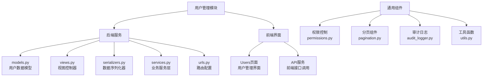
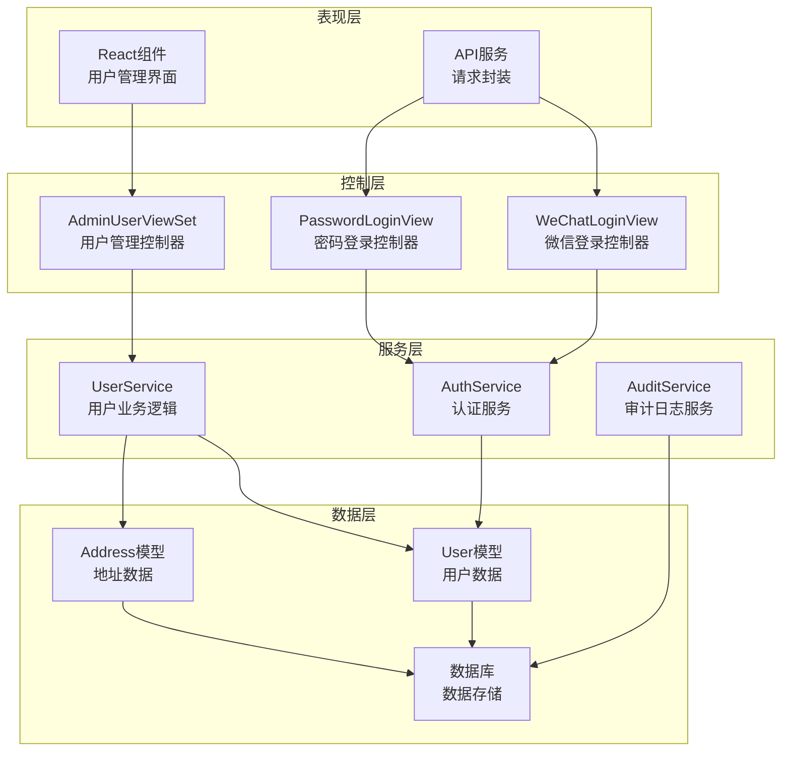
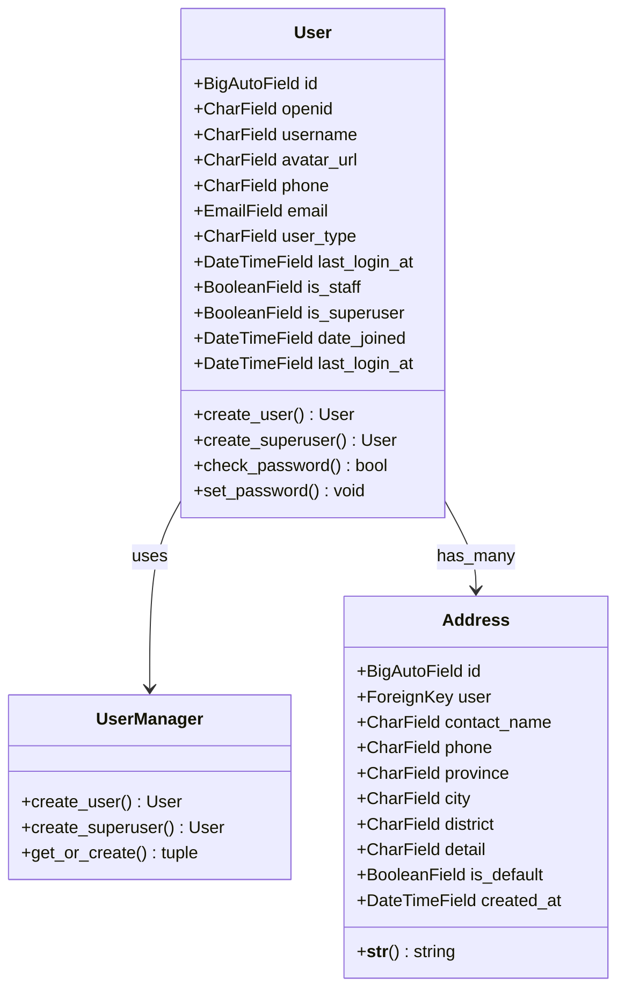
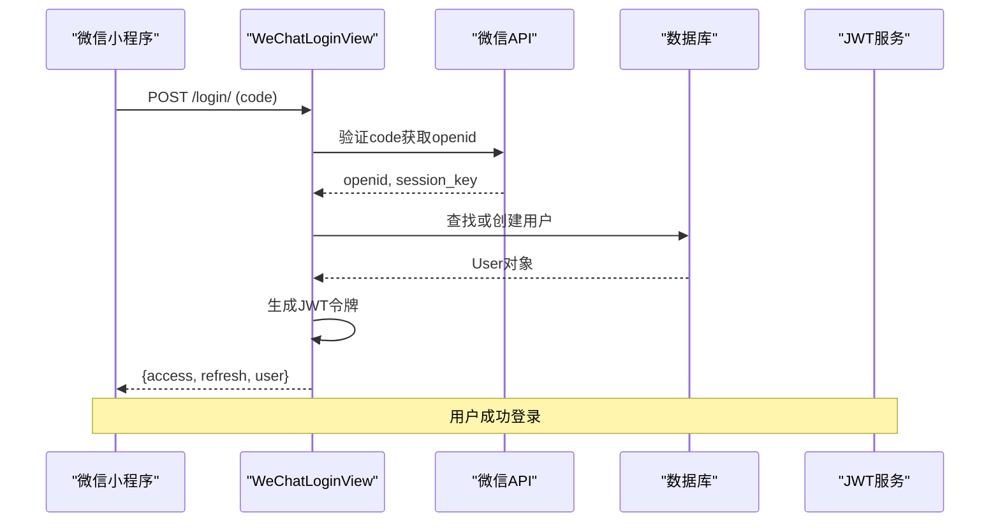
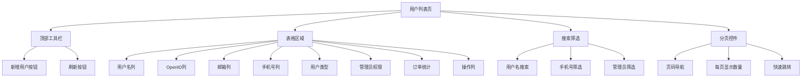
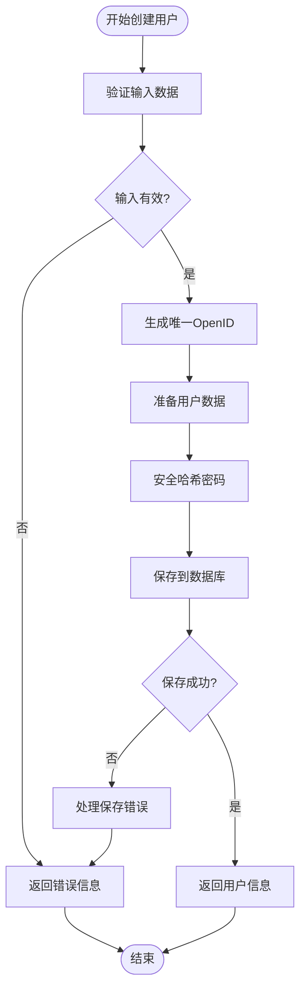
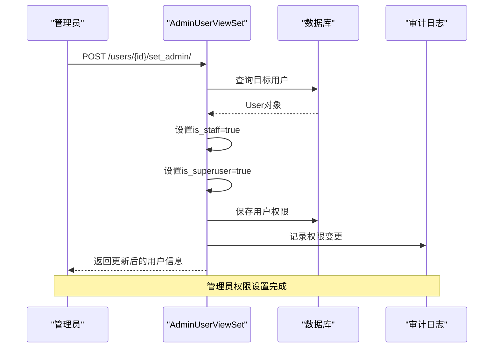
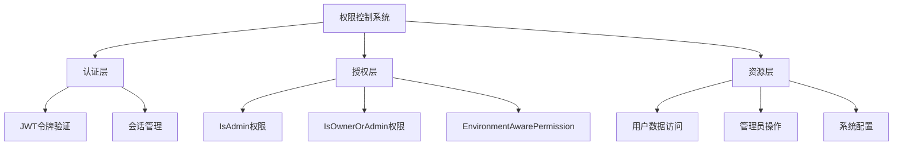
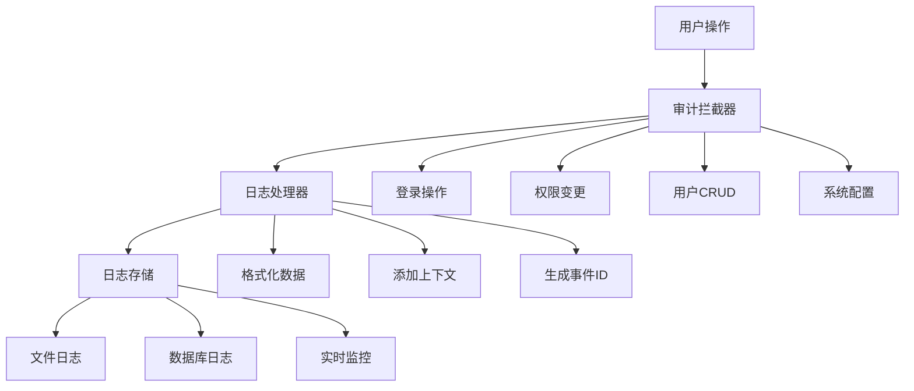

# 用户管理模块详细文档

<cite>
**本文档引用的文件**
- [backend/users/views.py](file://backend/users/views.py)
- [backend/users/models.py](file://backend/users/models.py)
- [backend/users/serializers.py](file://backend/users/serializers.py)
- [backend/users/services.py](file://backend/users/services.py)
- [backend/users/urls.py](file://backend/users/urls.py)
- [backend/common/permissions.py](file://backend/common/permissions.py)
- [backend/common/pagination.py](file://backend/common/pagination.py)
- [backend/common/audit_logger.py](file://backend/common/audit_logger.py)
- [backend/common/utils.py](file://backend/common/utils.py)
- [merchant/src/pages/Users/index.tsx](file://merchant/src/pages/Users/index.tsx)
- [frontend/src/services/user.ts](file://frontend/src/services/user.ts)
- [api.md](file://api.md)
</cite>

## 目录
1. [简介](#简介)
2. [项目结构](#项目结构)
3. [核心组件](#核心组件)
4. [架构概览](#架构概览)
5. [详细组件分析](#详细组件分析)
6. [用户列表页设计](#用户列表页设计)
7. [用户CRUD操作](#用户crud操作)
8. [管理员权限管理](#管理员权限管理)
9. [用户状态管理](#用户状态管理)
10. [数据脱敏处理](#数据脱敏处理)
11. [操作审计日志](#操作审计日志)
12. [性能考虑](#性能考虑)
13. [故障排除指南](#故障排除指南)
14. [结论](#结论)

## 简介

用户管理模块是电商业务小程序的核心功能之一，负责处理用户认证、授权、信息管理和后台用户管理等关键业务逻辑。该模块采用前后端分离架构，后端基于Django REST Framework构建，前端使用React技术栈，提供了完整的用户生命周期管理功能。

## 项目结构

用户管理模块在项目中的组织结构如下：



**图表来源**
- [backend/users/models.py](file://backend/users/models.py#L1-L95)
- [backend/users/views.py](file://backend/users/views.py#L1-L460)
- [backend/users/serializers.py](file://backend/users/serializers.py#L1-L92)
- [backend/users/services.py](file://backend/users/services.py#L1-L55)
- [backend/users/urls.py](file://backend/users/urls.py#L1-L18)

**章节来源**
- [backend/users/models.py](file://backend/users/models.py#L1-L95)
- [backend/users/views.py](file://backend/users/views.py#L1-L460)
- [backend/users/serializers.py](file://backend/users/serializers.py#L1-L92)
- [backend/users/services.py](file://backend/users/services.py#L1-L55)
- [backend/users/urls.py](file://backend/users/urls.py#L1-L18)

## 核心组件

用户管理模块包含以下核心组件：

### 数据模型层
- **User模型**：核心用户实体，支持微信小程序和管理员两种认证方式
- **Address模型**：用户收货地址管理
- **自定义UserManager**：提供用户创建和管理方法

### 视图层
- **WeChatLoginView**：微信小程序登录接口
- **PasswordLoginView**：管理员密码登录接口
- **AdminUserViewSet**：管理员用户管理接口
- **AddressViewSet**：地址管理接口

### 序列化层
- **UserSerializer**：用户数据序列化
- **UserProfileSerializer**：用户资料序列化
- **AddressSerializer**：地址数据序列化

### 服务层
- **用户认证服务**：登录、令牌生成
- **权限管理服务**：管理员权限控制
- **审计日志服务**：操作记录追踪

**章节来源**
- [backend/users/models.py](file://backend/users/models.py#L31-L95)
- [backend/users/views.py](file://backend/users/views.py#L22-L460)
- [backend/users/serializers.py](file://backend/users/serializers.py#L6-L92)
- [backend/users/services.py](file://backend/users/services.py#L1-L55)

## 架构概览

用户管理模块采用分层架构设计，确保职责分离和代码可维护性：



**图表来源**
- [backend/users/views.py](file://backend/users/views.py#L387-L460)
- [backend/users/services.py](file://backend/users/services.py#L1-L55)
- [backend/users/models.py](file://backend/users/models.py#L31-L95)

## 详细组件分析

### 用户数据模型

用户模型是整个用户管理模块的核心，支持多种认证方式和扩展功能：



**图表来源**
- [backend/users/models.py](file://backend/users/models.py#L31-L95)

#### 关键特性

1. **双认证支持**：同时支持微信小程序openid和传统用户名密码认证
2. **用户类型区分**：通过`user_type`字段区分微信用户和管理员用户
3. **权限体系**：继承Django的`PermissionsMixin`，支持标准的权限管理
4. **扩展字段**：包含头像、手机号、邮箱等用户基本信息

**章节来源**
- [backend/users/models.py](file://backend/users/models.py#L31-L95)

### 用户认证机制

系统提供两种主要的认证方式：

#### 微信小程序登录



**图表来源**
- [backend/users/views.py](file://backend/users/views.py#L23-L154)

#### 管理员密码登录

```mermaid
sequenceDiagram
participant Admin as "管理员"
participant Backend as "PasswordLoginView"
participant DB as "数据库"
param JWT as "JWT服务"
Admin->>Backend : POST /admin/login/ (username, password)
Backend->>DB : 验证用户凭据
DB-->>Backend : User对象
Backend->>Backend : 检查管理员权限
Backend->>JWT : 生成JWT令牌
Backend-->>Admin : {access, refresh, user}
Note over Admin,JWT : 管理员成功登录
```

**图表来源**
- [backend/users/views.py](file://backend/users/views.py#L161-L233)

**章节来源**
- [backend/users/views.py](file://backend/users/views.py#L23-L154)
- [backend/users/views.py](file://backend/users/views.py#L161-L233)

### 用户管理API接口

用户管理模块提供了完整的RESTful API接口：

| 接口路径 | 方法 | 权限要求 | 功能描述 |
|---------|------|----------|----------|
| `/api/users/` | GET | IsAdmin | 获取用户列表（支持搜索、筛选、分页） |
| `/api/users/` | POST | IsAdmin | 创建新用户 |
| `/api/users/{id}/` | GET | IsAdmin | 获取用户详情 |
| `/api/users/{id}/` | PUT/PATCH | IsAdmin | 更新用户信息 |
| `/api/users/{id}/` | DELETE | IsAdmin | 删除用户 |
| `/api/users/{id}/set_admin/` | POST | IsAdmin | 设置为管理员 |
| `/api/users/{id}/unset_admin/` | POST | IsAdmin | 取消管理员权限 |

**章节来源**
- [backend/users/views.py](file://backend/users/views.py#L387-L460)
- [api.md](file://api.md#L1064-L1071)

## 用户列表页设计

用户列表页是管理员进行用户管理的主要界面，提供了丰富的功能特性：

### 页面布局与功能



**图表来源**
- [merchant/src/pages/Users/index.tsx](file://merchant/src/pages/Users/index.tsx#L13-L149)

### 核心功能特性

#### 1. 用户信息展示
- **用户名**：显示用户的唯一标识
- **OpenID**：系统内部用户标识，支持复制功能
- **邮箱和手机号**：联系方式展示，支持搜索筛选
- **用户类型**：通过标签显示微信用户或管理员
- **统计信息**：订单总数、已完成订单数等

#### 2. 搜索与筛选功能
- **统一搜索**：支持用户名和OpenID的模糊匹配
- **手机号筛选**：按手机号进行精确筛选
- **管理员筛选**：按管理员权限状态筛选

#### 3. 分页机制
- **标准分页**：每页20条记录，支持自定义页大小
- **快速跳转**：支持直接跳转到指定页码
- **总记录数**：显示符合条件的总用户数量

**章节来源**
- [merchant/src/pages/Users/index.tsx](file://merchant/src/pages/Users/index.tsx#L13-L149)

## 用户CRUD操作

### 创建用户（createUser）

用户创建功能允许管理员添加新用户：



**图表来源**
- [backend/users/views.py](file://backend/users/views.py#L423-L444)

#### 实现特点
1. **OpenID自动生成**：未提供OpenID时自动生成唯一标识
2. **密码安全处理**：使用Django的安全哈希算法
3. **数据验证**：严格的输入验证和错误处理
4. **审计记录**：自动记录创建操作

### 更新用户（updateUser）

用户更新功能支持修改用户的基本信息：

#### 支持的更新字段
- 用户名（username）
- 头像URL（avatar_url）
- 手机号（phone）
- 邮箱（email）
- 管理员权限（is_staff）

#### 更新流程
1. **权限验证**：确保当前用户有管理员权限
2. **数据验证**：验证更新数据的有效性
3. **数据保存**：安全地保存更新后的数据
4. **缓存清理**：清除相关的缓存数据
5. **审计记录**：记录更新操作详情

### 删除用户（deleteUser）

用户删除功能采用软删除策略：

#### 删除策略
- **数据保留**：删除用户记录但保留相关数据
- **账户冻结**：标记用户为不可用状态
- **数据关联**：保留订单、地址等关联数据
- **审计追踪**：记录删除操作和原因

**章节来源**
- [backend/users/views.py](file://backend/users/views.py#L423-L444)
- [backend/users/views.py](file://backend/users/views.py#L423-L444)

## 管理员权限管理

管理员权限管理是用户管理模块的重要功能，提供了灵活的权限控制机制：

### 权限管理接口



**图表来源**
- [backend/users/views.py](file://backend/users/views.py#L446-L451)

### setAdmin接口

#### 功能描述
- **权限提升**：将普通用户提升为管理员
- **超级用户权限**：同时设置超级用户权限
- **即时生效**：权限变更立即生效

#### 安全考虑
1. **权限验证**：只有管理员可以执行此操作
2. **审计记录**：记录每次权限变更
3. **幂等性**：重复调用不会产生副作用
4. **回滚机制**：可通过unsetAdmin撤销权限

### unsetAdmin接口

#### 功能描述
- **权限降级**：移除管理员权限
- **权限清理**：同时清除超级用户权限
- **状态重置**：恢复为普通用户状态

#### 实现细节
```python
# 取消管理员权限的实现逻辑
user.is_staff = False
user.is_superuser = False
user.save()
```

### 权限控制机制

系统采用多层次的权限控制：



**图表来源**
- [backend/common/permissions.py](file://backend/common/permissions.py#L101-L123)

**章节来源**
- [backend/users/views.py](file://backend/users/views.py#L446-L459)
- [backend/common/permissions.py](file://backend/common/permissions.py#L101-L123)

## 用户状态管理

用户状态管理功能控制用户的启用和禁用状态：

### 状态控制机制

#### 用户状态字段
- **is_active**：用户账户激活状态
- **last_login_at**：最后登录时间
- **date_joined**：账户创建时间

#### 状态变更流程
1. **状态检查**：验证当前用户状态
2. **权限验证**：确认操作权限
3. **状态更新**：修改用户状态字段
4. **审计记录**：记录状态变更历史
5. **通知机制**：发送状态变更通知

### 用户启用/禁用功能

#### 启用用户
- **条件检查**：验证用户数据完整性
- **权限恢复**：恢复所有相关权限
- **状态更新**：设置is_active=True
- **登录限制**：解除登录限制

#### 禁用用户
- **数据保护**：保留用户数据不被删除
- **权限回收**：回收所有用户权限
- **状态更新**：设置is_active=False
- **登录阻止**：阻止用户登录系统

**章节来源**
- [backend/users/models.py](file://backend/users/models.py#L31-L95)

## 数据脱敏处理

用户管理模块对敏感信息实施严格的数据脱敏策略：

### 敏感信息识别

#### 包含脱敏的信息类别
1. **手机号**：部分隐藏中间数字
2. **邮箱地址**：域名部分保留，用户名部分脱敏
3. **OpenID**：完全隐藏，仅在必要时显示
4. **密码**：绝不传输或显示明文
5. **个人身份信息**：身份证号等敏感信息不存储

### 脱敏策略实现

#### 前端脱敏显示
```typescript
// 手机号脱敏示例
function maskPhone(phone: string): string {
  return phone.replace(/(\d{3})\d{4}(\d{4})/, '$1****$2');
}

// 邮箱脱敏示例
function maskEmail(email: string): string {
  const [local, domain] = email.split('@');
  return `${local[0]}***@${domain}`;
}
```

#### 后端数据过滤
- **序列化器过滤**：在序列化过程中自动脱敏
- **API响应过滤**：确保敏感信息不泄露
- **日志记录过滤**：审计日志中脱敏处理

### 数据展示策略

#### 用户列表中的信息展示
| 字段 | 展示方式 | 脱敏规则 |
|------|----------|----------|
| 手机号 | 隐藏中间4位 | 138****1234 |
| 邮箱 | 域名保留 | u***@example.com |
| OpenID | 不显示 | 完全隐藏 |
| 密码 | 不传输 | 明文不存储 |

**章节来源**
- [merchant/src/pages/Users/index.tsx](file://merchant/src/pages/Users/index.tsx#L26-L34)

## 操作审计日志

用户管理模块实现了完善的审计日志系统，确保所有操作都有迹可循：

### 审计日志架构



**图表来源**
- [backend/common/audit_logger.py](file://backend/common/audit_logger.py#L22-L245)

### 审计日志内容

#### 用户管理操作日志
- **操作类型**：创建、读取、更新、删除
- **操作对象**：用户ID、用户名、OpenID
- **操作者**：管理员ID、IP地址
- **操作时间**：精确到毫秒的时间戳
- **操作结果**：成功、失败、部分成功
- **详细信息**：操作的具体参数和影响范围

#### 日志记录示例
```python
# 管理员权限变更日志
AuditLogger.log_admin_action(
    action='set_admin',
    resource_type='user',
    resource_id=user_id,
    admin_id=admin_id,
    details={
        'before': {'is_staff': False, 'is_superuser': False},
        'after': {'is_staff': True, 'is_superuser': True}
    }
)
```

### 审计日志查询

#### 查询维度
1. **时间范围**：支持按日期范围查询
2. **操作类型**：按具体操作类型筛选
3. **操作对象**：按用户或资源ID查询
4. **操作者**：按管理员账号查询

#### 查询接口
```python
# 审计日志查询示例
def query_audit_logs(start_time, end_time, operator_id=None):
    return AuditLog.objects.filter(
        timestamp__range=(start_time, end_time),
        operator_id=operator_id
    ).order_by('-timestamp')
```

**章节来源**
- [backend/common/audit_logger.py](file://backend/common/audit_logger.py#L22-L245)

## 性能考虑

### 缓存策略

#### 用户统计数据缓存
- **缓存键**：`user_stats_{user_id}`
- **缓存时间**：5分钟
- **缓存失效**：数据更新时主动清除

#### 分页查询优化
- **索引优化**：在常用查询字段上建立索引
- **查询限制**：防止大数据集查询
- **结果缓存**：缓存频繁查询的结果

### 数据库优化

#### 查询优化策略
1. **批量操作**：减少数据库连接次数
2. **索引优化**：在搜索字段上建立适当索引
3. **查询限制**：防止恶意查询导致性能问题
4. **连接池**：使用数据库连接池管理

#### 分页性能优化
- **COUNT查询优化**：使用更高效的计数方法
- **LIMIT/OFFSET优化**：避免大偏移量查询
- **游标分页**：对于大数据集使用游标分页

### 前端性能优化

#### 组件渲染优化
- **虚拟滚动**：大数据集使用虚拟滚动
- **懒加载**：按需加载用户数据
- **防抖处理**：搜索输入防抖处理
- **状态管理**：合理使用React状态

## 故障排除指南

### 常见问题及解决方案

#### 登录相关问题

**问题**：微信登录失败
- **原因**：微信API配置错误或网络问题
- **解决方案**：检查WECHAT_APPID和WECHAT_SECRET配置

**问题**：管理员登录提示权限不足
- **原因**：用户不是管理员或密码错误
- **解决方案**：确认用户具有管理员权限

#### 用户管理问题

**问题**：用户列表无法加载
- **原因**：权限不足或数据库连接问题
- **解决方案**：检查用户权限和数据库连接

**问题**：创建用户失败
- **原因**：必填字段缺失或数据验证失败
- **解决方案**：检查必填字段和数据格式

#### 权限管理问题

**问题**：无法设置管理员权限
- **原因**：当前用户权限不足
- **解决方案**：使用更高权限的管理员账户

**问题**：权限变更后立即生效
- **原因**：JWT令牌未及时更新
- **解决方案**：重新登录或刷新令牌

### 调试技巧

#### 日志分析
1. **启用调试模式**：查看详细的错误信息
2. **审计日志**：检查操作记录
3. **数据库查询日志**：分析查询性能

#### 性能监控
1. **响应时间监控**：跟踪API响应时间
2. **错误率监控**：监控操作成功率
3. **资源使用监控**：监控内存和CPU使用

**章节来源**
- [backend/users/views.py](file://backend/users/views.py#L23-L154)
- [backend/users/views.py](file://backend/users/views.py#L161-L233)

## 结论

用户管理模块作为电商业务小程序的核心功能，实现了完整的用户生命周期管理。通过采用分层架构设计、完善的权限控制、严格的数据脱敏和全面的操作审计，确保了系统的安全性、可靠性和可维护性。

### 主要优势

1. **安全性**：多重权限验证和数据脱敏保护
2. **可扩展性**：模块化设计便于功能扩展
3. **可维护性**：清晰的代码结构和完善的文档
4. **用户体验**：直观的管理界面和流畅的操作体验

### 未来改进方向

1. **性能优化**：进一步优化大数据集的处理性能
2. **功能增强**：增加用户行为分析和个性化推荐
3. **安全加固**：引入更高级的安全防护机制
4. **监控完善**：增强实时监控和告警能力

该用户管理模块为电商业务提供了坚实的基础支撑，能够满足当前业务需求并具备良好的扩展性，为未来的业务发展奠定了良好基础。