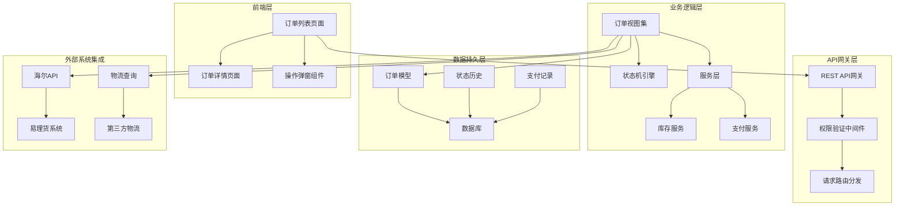
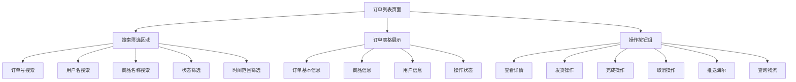
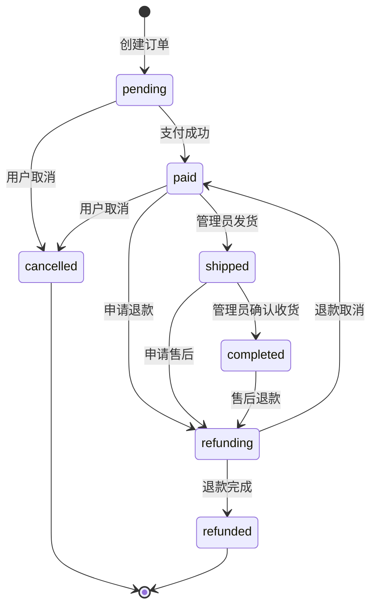
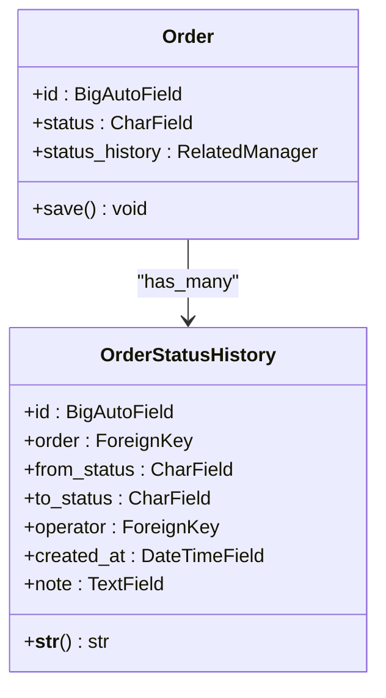
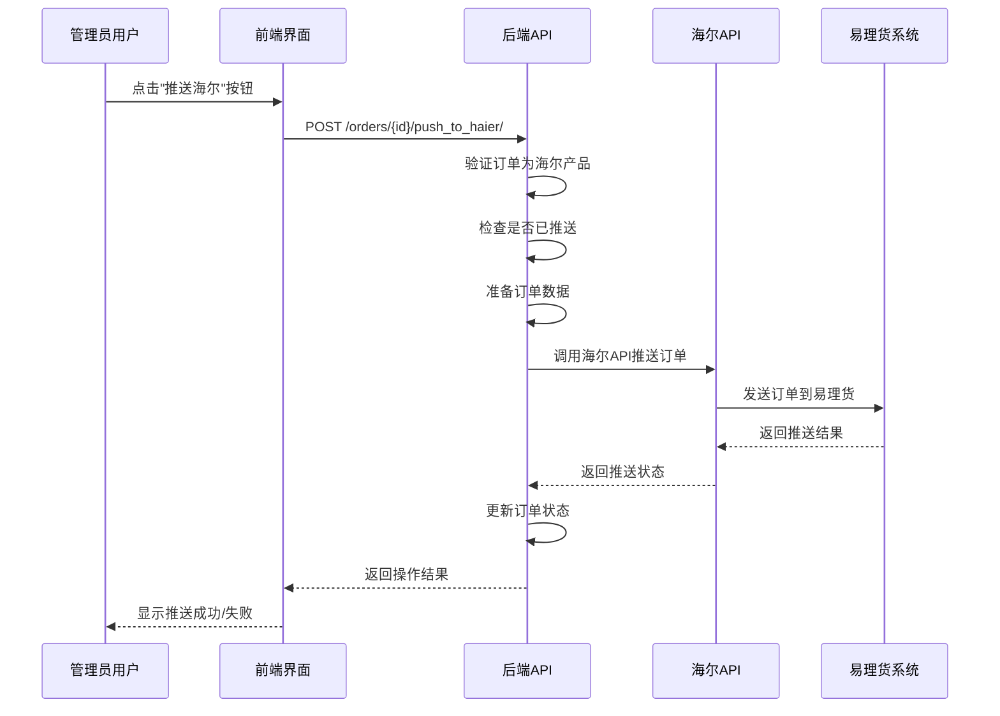
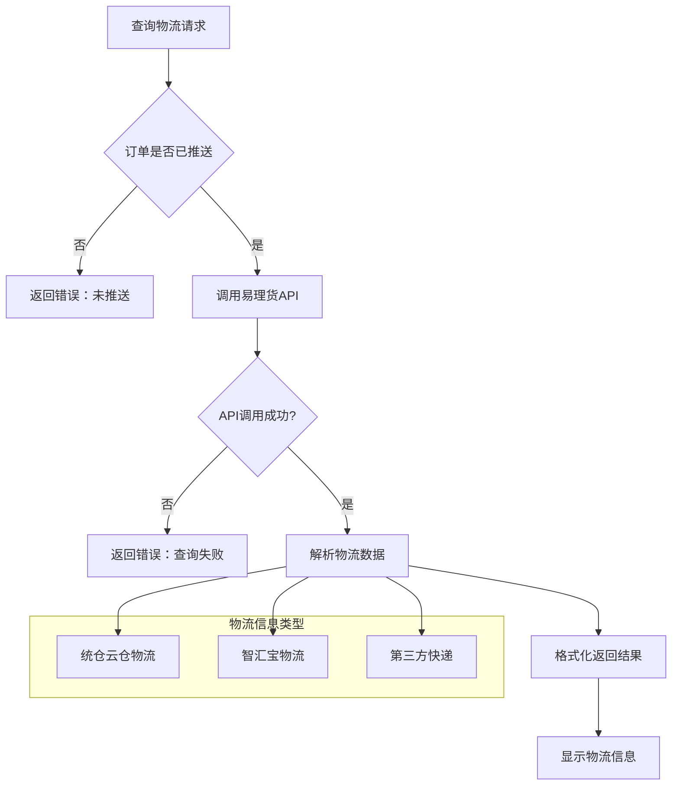
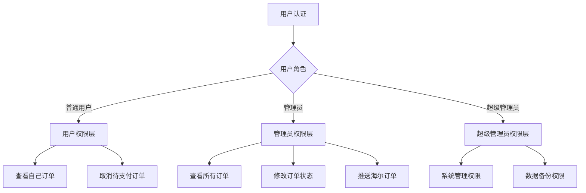
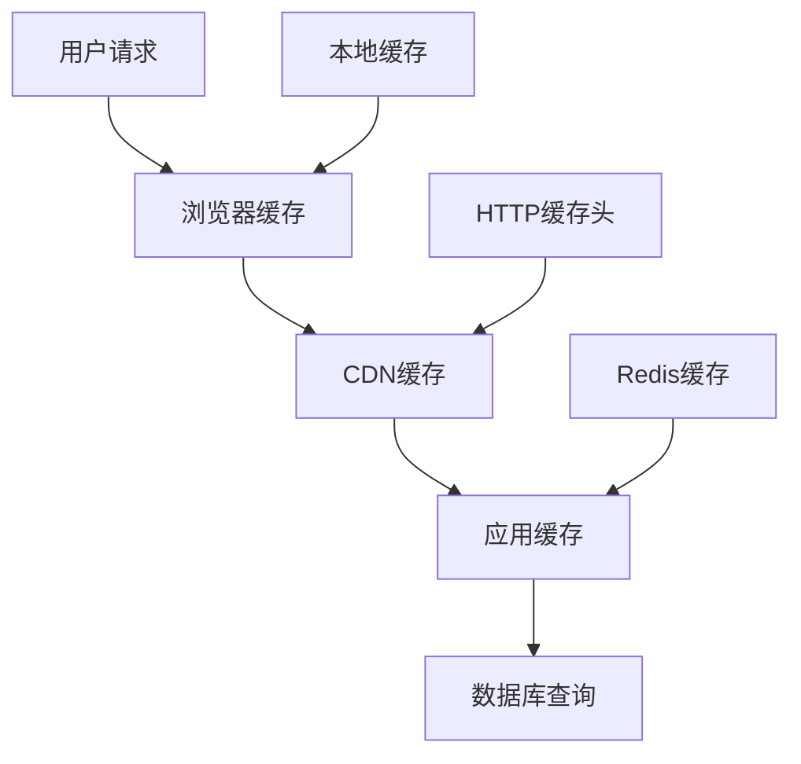

# 订单管理模块详细文档

<cite>
**本文档引用的文件**
- [merchant/src/pages/Orders/index.tsx](file://merchant/src/pages/Orders/index.tsx)
- [backend/orders/views.py](file://backend/orders/views.py)
- [backend/orders/models.py](file://backend/orders/models.py)
- [backend/orders/serializers.py](file://backend/orders/serializers.py)
- [backend/orders/state_machine.py](file://backend/orders/state_machine.py)
- [backend/orders/services.py](file://backend/orders/services.py)
- [backend/integrations/ylhapi.py](file://backend/integrations/ylhapi.py)
- [backend/common/permissions.py](file://backend/common/permissions.py)
- [merchant/src/services/api.ts](file://merchant/src/services/api.ts)
- [backend/orders/urls.py](file://backend/orders/urls.py)
</cite>

## 目录
1. [概述](#概述)
2. [系统架构](#系统架构)
3. [订单列表页面设计](#订单列表页面设计)
4. [订单状态管理](#订单状态管理)
5. [海尔系统集成](#海尔系统集成)
6. [权限控制系统](#权限控制系统)
7. [数据展示优化](#数据展示优化)
8. [API接口设计](#api接口设计)
9. [错误处理机制](#错误处理机制)
10. [性能优化策略](#性能优化策略)

## 概述

订单管理模块是电商业务系统的核心组件，负责处理从订单创建到完成的全流程管理。该模块采用前后端分离架构，前端使用React技术栈，后端基于Django REST Framework构建，实现了完整的订单生命周期管理功能。

### 核心功能特性

- **完整的订单状态流转**：支持待支付、已支付、已发货、已完成、已取消、退款中、已退款等状态
- **智能状态机管理**：确保订单状态转换的合法性和一致性
- **海尔系统深度集成**：支持海尔产品的订单推送和物流查询
- **权限分级控制**：区分普通用户和管理员的操作权限
- **实时数据展示**：提供丰富的订单信息展示和交互功能

## 系统架构



**图表来源**
- [backend/orders/views.py](file://backend/orders/views.py#L23-L30)
- [merchant/src/pages/Orders/index.tsx](file://merchant/src/pages/Orders/index.tsx#L1-L50)

## 订单列表页面设计

### 页面布局结构

订单列表页面采用现代化的表格设计，集成了ProTable组件，提供了丰富的交互功能和数据展示能力。



**图表来源**
- [merchant/src/pages/Orders/index.tsx](file://merchant/src/pages/Orders/index.tsx#L108-L228)

### 功能特性详解

#### 1. 订单状态筛选系统

系统支持多种订单状态的筛选和过滤：

| 状态类型 | 显示文本 | 颜色标识 | 功能权限 |
|---------|---------|---------|---------|
| pending | 待支付 | 橙色 | 用户可取消 |
| paid | 已支付 | 蓝色 | 管理员可发货 |
| shipped | 已发货 | 青色 | 管理员可完成 |
| completed | 已完成 | 绿色 | 不可操作 |
| cancelled | 已取消 | 红色 | 不可操作 |
| refunding | 退款中 | 紫色 | 不可操作 |
| refunded | 已退款 | 洋红色 | 不可操作 |

#### 2. 搜索功能实现

- **订单号模糊搜索**：支持部分匹配，提高查找效率
- **用户名精确匹配**：仅管理员可见，支持用户ID筛选
- **商品名称搜索**：支持商品名称的模糊匹配
- **时间范围筛选**：支持创建时间的精确范围查询

#### 3. 分页展示机制

采用虚拟滚动和懒加载技术，支持大数据量的高效展示：

- **默认每页显示20条记录**
- **支持快速跳转和页码选择**
- **实时总数统计和加载状态提示**

**章节来源**
- [merchant/src/pages/Orders/index.tsx](file://merchant/src/pages/Orders/index.tsx#L334-L410)

## 订单状态管理

### 状态机设计原理

订单状态管理采用状态机模式，确保状态转换的合法性和一致性。



**图表来源**
- [backend/orders/state_machine.py](file://backend/orders/state_machine.py#L33-L57)

### 状态转换规则

#### 允许的状态转换矩阵

| 当前状态 | 允许转换到的状态 |
|---------|----------------|
| pending | paid, cancelled |
| paid | shipped, refunding, cancelled |
| shipped | completed, refunding |
| completed | refunding |
| refunding | refunded, paid |
| cancelled | 无 |
| refunded | 无 |

#### 状态转换业务逻辑

每个状态转换都伴随着相应的业务处理：

- **支付成功**：释放库存，更新商品销量
- **发货操作**：记录物流信息，更新配送时间
- **订单完成**：确认收货，触发售后服务
- **订单取消**：释放锁定库存，记录取消原因

**章节来源**
- [backend/orders/state_machine.py](file://backend/orders/state_machine.py#L59-L154)

### 订单状态历史追踪

系统自动记录每次状态变更的详细信息：



**图表来源**
- [backend/orders/models.py](file://backend/orders/models.py#L292-L322)

**章节来源**
- [backend/orders/state_machine.py](file://backend/orders/state_machine.py#L136-L144)

## 海尔系统集成

### pushToHaier功能实现

海尔系统集成是订单管理模块的重要特色，支持海尔产品的订单推送和后续管理。

#### 订单推送流程



**图表来源**
- [backend/orders/views.py](file://backend/orders/views.py#L379-L487)
- [backend/integrations/ylhapi.py](file://backend/integrations/ylhapi.py#L174-L230)

#### 海尔订单数据准备

系统会自动准备符合海尔API规范的订单数据：

| 数据字段 | 来源 | 说明 |
|---------|------|------|
| sourceSystem | 固定值 | YOUR_SYSTEM |
| shopName | 用户输入 | 店铺名称 |
| sellerCode | 配置项 | 客户八码 |
| consigneeName | 订单快照 | 收货人姓名 |
| consigneeMobile | 订单快照 | 收货人电话 |
| onlineNo | 订单号 | 平台订单号 |
| soId | 自动生成 | 子订单号 |
| totalQty | 订单数量 | 总数量 |
| totalAmt | 订单金额 | 总金额 |
| createTime | 创建时间 | 时间戳 |

#### 推送业务规则

1. **产品来源验证**：只有海尔产品才能推送
2. **重复推送检查**：避免重复推送同一订单
3. **库存验证**：确保海尔产品库存充足
4. **数据格式校验**：确保推送数据符合API要求

**章节来源**
- [backend/orders/views.py](file://backend/orders/views.py#L379-L487)

### getHaierLogistics物流信息查询

#### 物流查询功能设计



**图表来源**
- [backend/orders/views.py](file://backend/orders/views.py#L489-L546)
- [backend/integrations/ylhapi.py](file://backend/integrations/ylhapi.py#L371-L406)

#### 物流信息展示

系统支持多种类型的物流信息展示：

1. **统仓云仓物流**：海尔自建仓储物流
2. **智汇宝物流**：海尔智慧物流平台
3. **第三方快递**：合作快递公司物流

**章节来源**
- [backend/orders/views.py](file://backend/orders/views.py#L489-L546)

## 权限控制系统

### 权限层次设计

系统采用分级权限控制，确保不同角色用户只能执行相应操作。



**图表来源**
- [backend/common/permissions.py](file://backend/common/permissions.py#L12-L67)

### 权限验证机制

#### 1. IsOwnerOrAdmin权限类

这是订单管理的核心权限控制类：

- **管理员权限**：`is_staff=True`的用户可以访问所有订单
- **用户权限**：普通用户只能访问自己的订单
- **对象级权限**：在具体操作时验证用户与订单的关联关系

#### 2. 操作权限映射

| 操作类型 | 权限要求 | 实现方式 |
|---------|---------|---------|
| 查看订单详情 | IsOwnerOrAdmin | 对象级权限验证 |
| 取消订单 | IsOwnerOrAdmin | 状态检查+权限验证 |
| 发货操作 | IsAdmin | 管理员权限验证 |
| 完成订单 | IsAdmin | 管理员权限验证 |
| 推送海尔 | IsAdmin | 管理员权限验证 |
| 查询物流 | IsAuthenticated | 认证用户权限 |

**章节来源**
- [backend/common/permissions.py](file://backend/common/permissions.py#L12-L67)
- [backend/orders/views.py](file://backend/orders/views.py#L98-L111)

### 安全防护措施

1. **CSRF保护**：所有POST/PUT/DELETE请求都包含CSRF令牌
2. **XSS防护**：前端组件自动转义HTML内容
3. **SQL注入防护**：使用ORM查询，避免原生SQL
4. **数据脱敏**：敏感信息在传输过程中加密

## 数据展示优化

### 金额格式化处理

系统采用统一的金额格式化策略：

```typescript
// 前端金额格式化示例
const formatAmount = (amount: number) => `¥${amount.toFixed(2)}`;
```

### 时间戳转换优化

- **本地化显示**：根据用户时区显示时间
- **相对时间**：显示"2小时前"等相对时间
- **精确时间**：鼠标悬停显示完整时间戳

### 数据表格优化

#### 1. 列宽自适应

```typescript
// 表格列配置示例
const columns = [
  { 
    title: '总金额', 
    dataIndex: 'total_amount', 
    hideInSearch: true, 
    width: 120,
    render: (amount: number) => `¥${amount}`,
  },
  { 
    title: '商品名称', 
    dataIndex: ['product', 'name'],
    ellipsis: true,
    hideInSearch: true,
  },
];
```

#### 2. 单元格溢出处理

- **省略号显示**：长文本自动截断并显示省略号
- **复制功能**：支持单元格内容一键复制
- **工具提示**：鼠标悬停显示完整内容

**章节来源**
- [merchant/src/pages/Orders/index.tsx](file://merchant/src/pages/Orders/index.tsx#L143-L144)
- [merchant/src/pages/Orders/index.tsx](file://merchant/src/pages/Orders/index.tsx#L123-L125)

## API接口设计

### 核心API接口

#### 1. 订单管理接口

| 接口路径 | 方法 | 权限 | 功能描述 |
|---------|------|------|---------|
| `/orders/` | GET | IsAuthenticated | 获取订单列表 |
| `/orders/` | POST | IsAuthenticated | 创建订单 |
| `/orders/{id}/` | GET | IsOwnerOrAdmin | 获取订单详情 |
| `/orders/{id}/cancel/` | PATCH | IsOwnerOrAdmin | 取消订单 |
| `/orders/{id}/ship/` | PATCH | IsAdmin | 发货操作 |
| `/orders/{id}/complete/` | PATCH | IsAdmin | 完成订单 |
| `/orders/{id}/push_to_haier/` | POST | IsAdmin | 推送海尔 |
| `/orders/{id}/haier_logistics/` | GET | IsAuthenticated | 查询物流 |

#### 2. 前端API封装

```typescript
// 前端API服务示例
export const apiServices = {
  getOrders: (params?: any) => request.get('/orders/', { params }),
  getOrder: (id: number) => request.get(`/orders/${id}/`),
  shipOrder: (id: number) => request.patch(`/orders/${id}/ship/`, {}),
  completeOrder: (id: number) => request.patch(`/orders/${id}/complete/`, {}),
  cancelOrder: (id: number) => request.patch(`/orders/${id}/cancel/`, {}),
  pushToHaier: (id: number, data?: any) => request.post(`/orders/${id}/push_to_haier/`, data || {}),
  getHaierLogistics: (id: number) => request.get(`/orders/${id}/haier_logistics/`),
};
```

**章节来源**
- [backend/orders/views.py](file://backend/orders/views.py#L23-L30)
- [merchant/src/services/api.ts](file://merchant/src/services/api.ts#L53-L59)

### 请求响应格式

#### 统一响应格式

```typescript
interface ApiResponse<T> {
  success: boolean;
  data?: T;
  error?: string;
  code?: number;
  message?: string;
}
```

#### 分页响应格式

```typescript
interface PaginatedResponse<T> {
  results?: T[];
  count?: number;
  total?: number;
  pagination?: {
    page: number;
    pageSize: number;
    total: number;
  };
}
```

**章节来源**
- [merchant/src/services/api.ts](file://merchant/src/services/api.ts#L53-L59)

## 错误处理机制

### 前端错误处理

#### 1. 异常捕获策略

```typescript
// 统一错误处理示例
const handleError = (error: any) => {
  const errorMessage = error?.response?.data?.detail || '操作失败，请稍后重试';
  message.error(errorMessage);
  console.error('API Error:', error);
};
```

#### 2. 错误分类处理

| 错误类型 | 处理策略 | 用户提示 |
|---------|---------|---------|
| 网络错误 | 自动重试 | "网络连接失败，请检查网络" |
| 权限错误 | 跳转登录 | "请重新登录后再试" |
| 参数错误 | 表单验证 | "请检查输入参数" |
| 业务错误 | 具体提示 | "库存不足，请重新下单" |

### 后端错误处理

#### 1. 异常类型定义

```python
# 异常处理示例
try:
    # 业务逻辑处理
    order = OrderStateMachine.transition(order, 'cancelled')
except ValueError as e:
    return Response({"detail": str(e)}, status=status.HTTP_400_BAD_REQUEST)
except Exception as e:
    return Response({"detail": f"操作失败: {str(e)}"}, 
                   status=status.HTTP_500_INTERNAL_SERVER_ERROR)
```

#### 2. 错误日志记录

系统自动记录详细的错误日志：

- **错误堆栈**：记录完整的异常堆栈信息
- **请求上下文**：记录请求参数和用户信息
- **时间戳**：记录错误发生的时间
- **IP地址**：记录客户端IP地址

**章节来源**
- [merchant/src/pages/Orders/index.tsx](file://merchant/src/pages/Orders/index.tsx#L30-L58)
- [backend/orders/views.py](file://backend/orders/views.py#L308-L330)

## 性能优化策略

### 数据库查询优化

#### 1. 索引策略

系统在订单模型中建立了多个复合索引：

```python
class Meta:
    indexes = [
        models.Index(fields=['status']),           # 状态查询优化
        models.Index(fields=['created_at']),       # 时间排序优化
        models.Index(fields=['user']),            # 用户查询优化
        models.Index(fields=['haier_order_no']),  # 海尔订单查询优化
        models.Index(fields=['haier_so_id']),     # 海尔子订单查询优化
    ]
```

#### 2. 查询优化技巧

- **预加载关联数据**：使用`select_related`和`prefetch_related`
- **批量查询**：避免N+1查询问题
- **分页查询**：限制单次查询数据量
- **缓存策略**：对频繁查询的数据进行缓存

### 前端性能优化

#### 1. 渲染优化

- **虚拟滚动**：大数据量表格使用虚拟滚动
- **懒加载**：图片和复杂组件按需加载
- **防抖节流**：搜索和筛选操作防抖处理

#### 2. 状态管理

- **局部状态**：合理使用React状态
- **全局状态**：使用Context或Redux管理共享状态
- **状态持久化**：重要状态本地存储

**章节来源**
- [backend/orders/models.py](file://backend/orders/models.py#L75-L81)
- [merchant/src/pages/Orders/index.tsx](file://merchant/src/pages/Orders/index.tsx#L334-L410)

### 缓存策略

#### 1. 多层缓存架构



#### 2. 缓存失效策略

- **定时刷新**：定期更新缓存数据
- **事件驱动**：数据变更时主动清除缓存
- **版本控制**：使用版本号控制缓存更新

## 总结

订单管理模块通过精心设计的架构和完善的功能实现，为企业提供了强大而灵活的订单管理解决方案。系统具备以下核心优势：

1. **完整的业务流程覆盖**：从订单创建到完成的全流程管理
2. **强大的扩展性**：模块化设计便于功能扩展和维护
3. **优秀的用户体验**：直观的界面设计和流畅的操作体验
4. **可靠的安全保障**：多层次的权限控制和安全防护
5. **高效的性能表现**：优化的查询和渲染策略

该模块不仅满足了当前业务需求，还为未来的功能扩展和系统升级奠定了坚实的基础。