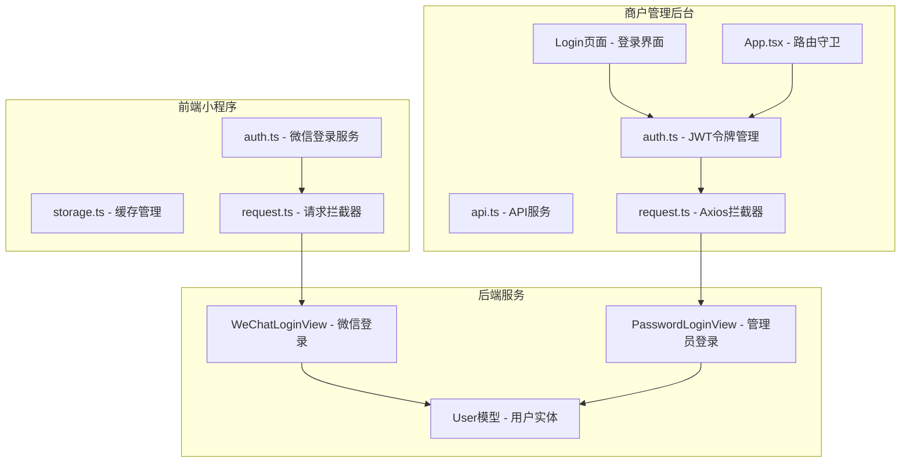
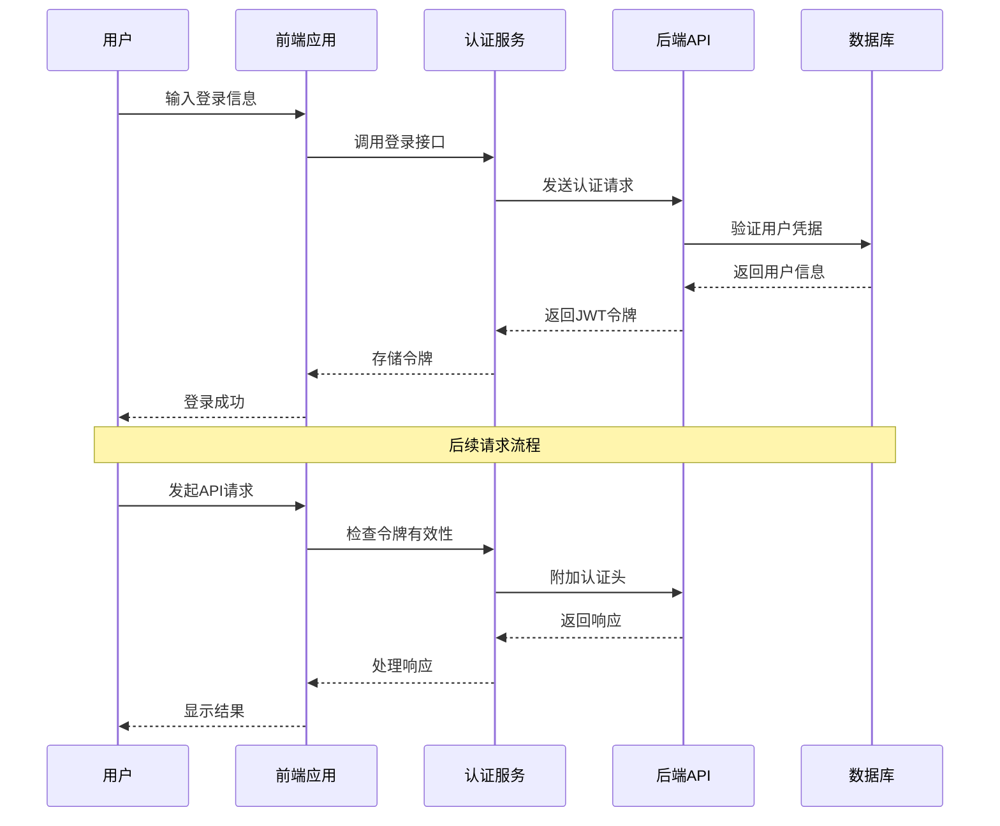
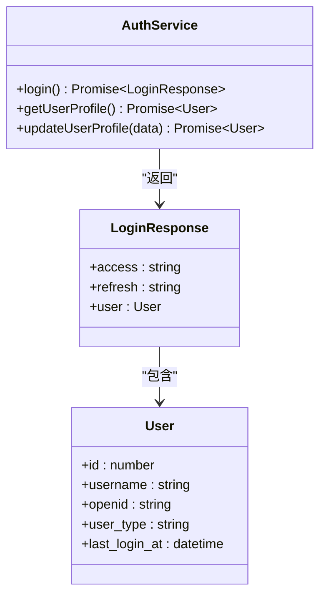
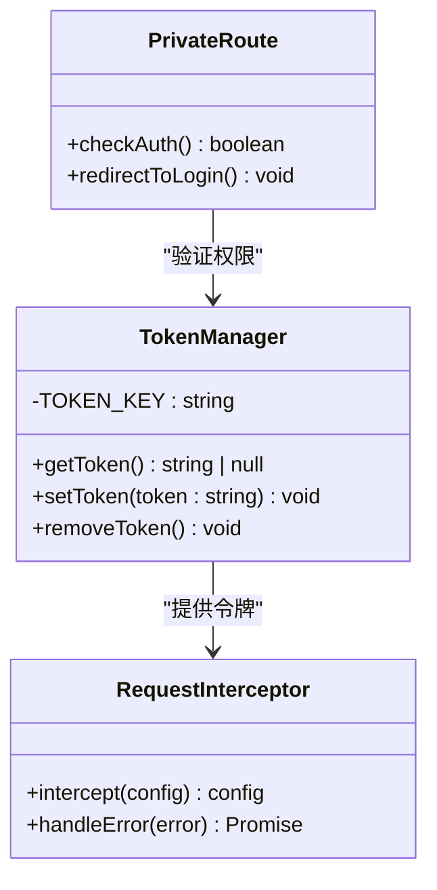
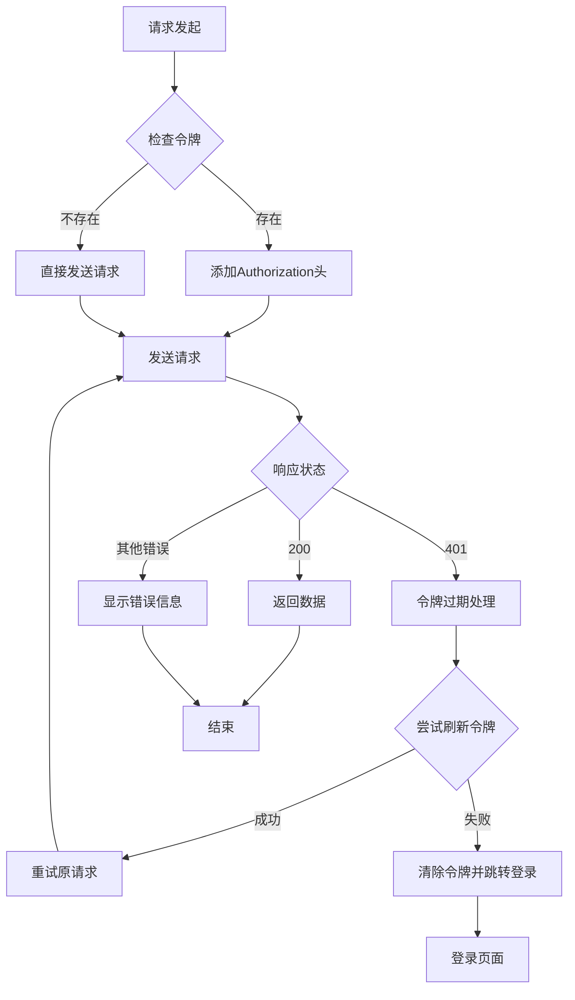
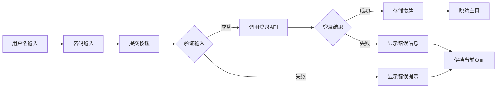
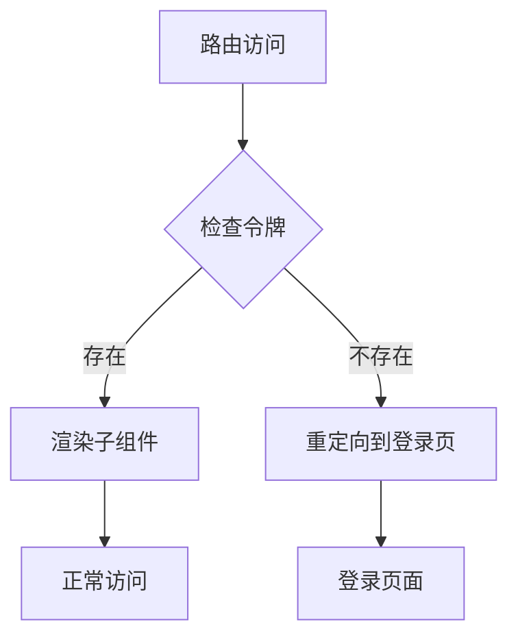
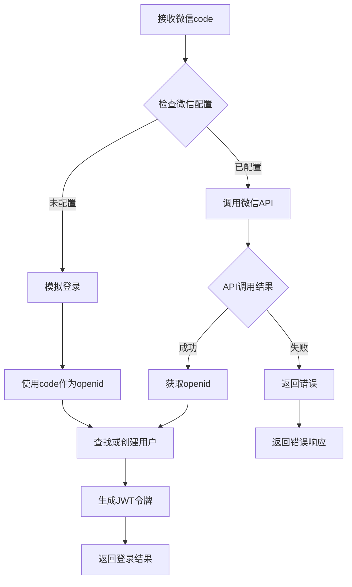
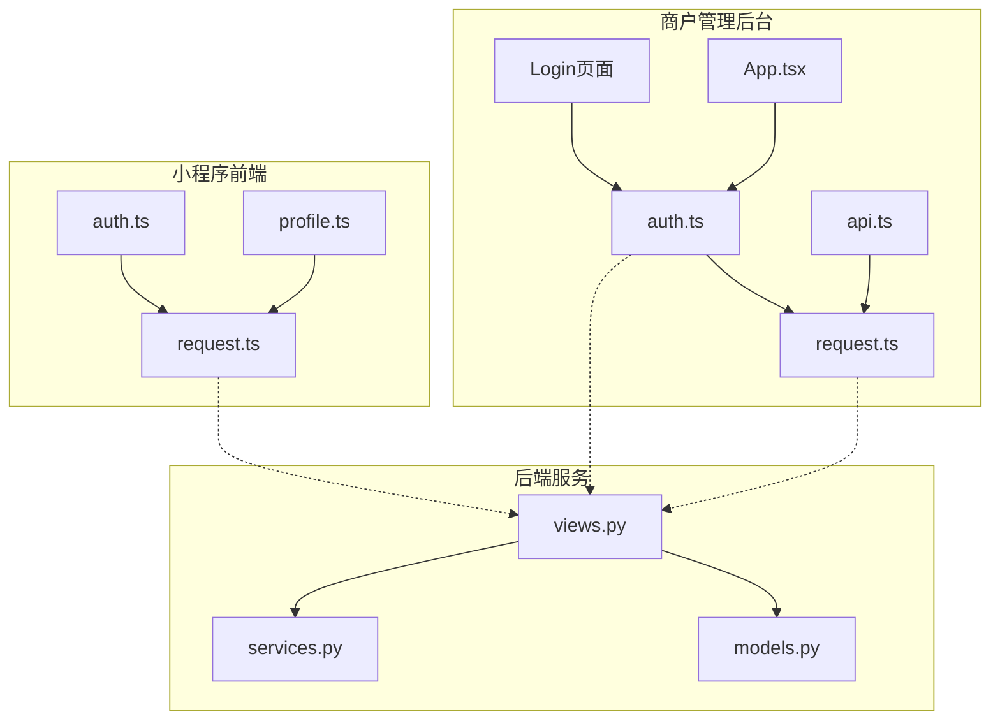

# 认证与权限

<cite>
**本文档引用的文件**
- [frontend/src/services/auth.ts](file://frontend/src/services/auth.ts)
- [merchant/src/utils/auth.ts](file://merchant/src/utils/auth.ts)
- [merchant/src/services/api.ts](file://merchant/src/services/api.ts)
- [frontend/src/utils/storage.ts](file://frontend/src/utils/storage.ts)
- [merchant/src/utils/request.ts](file://merchant/src/utils/request.ts)
- [merchant/src/pages/Login/index.tsx](file://merchant/src/pages/Login/index.tsx)
- [merchant/src/App.tsx](file://merchant/src/App.tsx)
- [merchant/vite.config.ts](file://merchant/vite.config.ts)
- [merchant/ENVIRONMENT.md](file://merchant/ENVIRONMENT.md)
- [frontend/src/utils/request.ts](file://frontend/src/utils/request.ts)
- [backend/users/views.py](file://backend/users/views.py)
- [backend/users/models.py](file://backend/users/models.py)
- [backend/users/services.py](file://backend/users/services.py)
</cite>

## 目录
1. [简介](#简介)
2. [项目结构](#项目结构)
3. [核心组件](#核心组件)
4. [架构概览](#架构概览)
5. [详细组件分析](#详细组件分析)
6. [依赖关系分析](#依赖关系分析)
7. [性能考虑](#性能考虑)
8. [故障排除指南](#故障排除指南)
9. [结论](#结论)

## 简介

本系统实现了完整的认证与权限管理机制，支持两种主要的登录方式：微信小程序登录和管理员用户名密码登录。系统采用JWT（JSON Web Token）技术实现无状态认证，通过localStorage进行令牌持久化存储，并提供了完善的会话管理和安全机制。

系统分为两个主要部分：
- **前端小程序**：基于Taro框架的微信小程序应用
- **商户管理后台**：基于React的Web管理界面

## 项目结构

**图表来源**
- [frontend/src/services/auth.ts](file://frontend/src/services/auth.ts#L1-L22)
- [merchant/src/utils/auth.ts](file://merchant/src/utils/auth.ts#L1-L14)
- [merchant/src/utils/request.ts](file://merchant/src/utils/request.ts#L1-L38)

**章节来源**
- [frontend/src/services/auth.ts](file://frontend/src/services/auth.ts#L1-L22)
- [merchant/src/utils/auth.ts](file://merchant/src/utils/auth.ts#L1-L14)
- [merchant/src/utils/request.ts](file://merchant/src/utils/request.ts#L1-L38)

## 核心组件

### 1. 微信小程序认证模块

微信小程序采用OAuth2.0授权码模式，通过微信官方API获取用户身份信息。

**主要特性：**
- 微信小程序登录流程
- 自动用户创建与更新
- 开发环境管理员快捷登录
- 会话状态管理

### 2. 商户管理后台认证模块

基于JWT的无状态认证，支持管理员用户登录和权限控制。

**主要特性：**
- 用户名密码登录
- JWT令牌管理
- 路由守卫机制
- 多标签页同步

### 3. 后端认证服务

提供RESTful API接口，支持多种认证方式和权限验证。

**主要特性：**
- 微信登录接口
- 管理员登录接口
- 用户权限管理
- 安全策略实施

**章节来源**
- [frontend/src/services/auth.ts](file://frontend/src/services/auth.ts#L1-L22)
- [merchant/src/utils/auth.ts](file://merchant/src/utils/auth.ts#L1-L14)
- [backend/users/views.py](file://backend/users/views.py#L21-L257)

## 架构概览

**图表来源**
- [frontend/src/services/auth.ts](file://frontend/src/services/auth.ts#L7-L10)
- [merchant/src/utils/request.ts](file://merchant/src/utils/request.ts#L10-L17)
- [backend/users/views.py](file://backend/users/views.py#L162-L233)

## 详细组件分析

### 微信小程序认证服务

#### 核心功能实现

微信小程序认证服务提供了完整的OAuth2.0登录流程，支持自动用户创建和权限管理。

**图表来源**
- [frontend/src/services/auth.ts](file://frontend/src/services/auth.ts#L5-L21)

#### 登录流程详解

1. **获取微信code**：通过Taro.login()获取临时授权码
2. **发送认证请求**：将code发送到后端进行验证
3. **用户信息获取**：获取用户的详细信息
4. **令牌存储**：将JWT令牌存储到本地缓存

**章节来源**
- [frontend/src/services/auth.ts](file://frontend/src/services/auth.ts#L7-L10)

### 商户管理后台认证模块

#### JWT令牌管理

商户管理后台采用localStorage存储JWT令牌，提供完整的令牌生命周期管理。

**图表来源**
- [merchant/src/utils/auth.ts](file://merchant/src/utils/auth.ts#L1-L14)
- [merchant/src/utils/request.ts](file://merchant/src/utils/request.ts#L10-L35)

#### 令牌存储策略

系统使用localStorage存储JWT令牌，具有以下特点：

- **安全性**：令牌存储在浏览器本地，避免跨域风险
- **持久性**：支持页面刷新后的状态保持
- **简单性**：无需复杂的加密处理
- **兼容性**：广泛支持各种浏览器环境

**章节来源**
- [merchant/src/utils/auth.ts](file://merchant/src/utils/auth.ts#L1-L14)

### 前端请求拦截器

#### Axios拦截器实现

**图表来源**
- [merchant/src/utils/request.ts](file://merchant/src/utils/request.ts#L10-L35)

#### 错误处理机制

系统实现了完善的错误处理机制：

1. **401未授权**：自动尝试刷新令牌，失败则跳转登录
2. **429请求过于频繁**：显示限流提示
3. **网络错误**：显示网络连接失败提示
4. **其他错误**：显示具体的错误信息

**章节来源**
- [merchant/src/utils/request.ts](file://merchant/src/utils/request.ts#L23-L35)

### 登录页面实现

#### 表单验证与用户体验

登录页面采用Ant Design组件库，提供良好的用户体验：

**图表来源**
- [merchant/src/pages/Login/index.tsx](file://merchant/src/pages/Login/index.tsx#L11-L19)

#### 表单验证规则

- **用户名验证**：必填项，不能为空
- **密码验证**：必填项，不能为空
- **错误提示**：提供明确的错误信息
- **加载状态**：防止重复提交

**章节来源**
- [merchant/src/pages/Login/index.tsx](file://merchant/src/pages/Login/index.tsx#L26-L30)

### 路由守卫机制

#### 私有路由保护

**图表来源**
- [merchant/src/App.tsx](file://merchant/src/App.tsx#L12-L14)

#### 多标签页同步

系统通过事件总线实现多标签页间的登录状态同步：

1. **登录事件**：触发`userLogin`事件通知其他标签页
2. **登出事件**：触发`userLogout`事件清理状态
3. **状态同步**：监听事件更新本地状态

**章节来源**
- [merchant/src/App.tsx](file://merchant/src/App.tsx#L12-L14)

### 后端认证服务

#### 微信登录实现

后端提供了完整的微信登录服务，支持多种登录模式：

**图表来源**
- [backend/users/views.py](file://backend/users/views.py#L58-L148)

#### 管理员登录实现

管理员登录提供了更严格的权限控制：

1. **用户名密码验证**：双重验证确保安全性
2. **权限检查**：验证用户是否具有管理员权限
3. **自动提升**：首次登录时自动提升为管理员
4. **安全策略**：限制非管理员用户的访问

**章节来源**
- [backend/users/views.py](file://backend/users/views.py#L162-L233)

## 依赖关系分析

### 前端依赖图

**图表来源**
- [merchant/src/utils/auth.ts](file://merchant/src/utils/auth.ts#L1-L14)
- [merchant/src/utils/request.ts](file://merchant/src/utils/request.ts#L1-L38)
- [frontend/src/services/auth.ts](file://frontend/src/services/auth.ts#L1-L22)

### 环境变量配置

#### VITE_BACKEND_ORIGIN配置

系统通过环境变量控制后端服务地址，支持开发和生产环境的不同配置：

| 环境 | 配置值 | 用途 |
|------|--------|------|
| 开发环境 | `http://127.0.0.1:8000` | 本地开发调试 |
| 生产环境 | `https://api.example.com` | 正式部署环境 |
| 测试环境 | `https://test.api.com` | 测试环境配置 |

**章节来源**
- [merchant/vite.config.ts](file://merchant/vite.config.ts#L6-L7)
- [merchant/ENVIRONMENT.md](file://merchant/ENVIRONMENT.md#L12-L14)

## 性能考虑

### 令牌缓存策略

1. **本地存储优化**：使用localStorage减少内存占用
2. **缓存失效**：实现令牌过期检测机制
3. **批量操作**：支持多个API请求的并发处理
4. **错误恢复**：提供自动重试和降级策略

### 网络优化

1. **请求合并**：减少不必要的网络请求
2. **响应缓存**：对静态数据进行缓存
3. **连接复用**：利用HTTP/2的多路复用特性
4. **压缩传输**：启用gzip压缩减少传输体积

## 故障排除指南

### 常见问题及解决方案

#### 1. 登录失败

**症状**：输入正确的用户名密码后无法登录
**原因**：
- 用户名或密码错误
- 用户没有管理员权限
- 系统无可用管理员账户

**解决方案**：
- 检查用户名密码是否正确
- 确认用户具有管理员权限
- 使用开发环境的快捷方式创建管理员账户

#### 2. 令牌过期

**症状**：登录后一段时间出现401错误
**原因**：
- JWT令牌过期
- 服务器时间不同步
- 令牌被意外删除

**解决方案**：
- 实现自动令牌刷新机制
- 检查服务器时间设置
- 验证localStorage存储状态

#### 3. 多标签页不同步

**症状**：在一个标签页登录后其他标签页未同步
**原因**：
- 缺少事件监听机制
- localStorage事件未正确处理

**解决方案**：
- 实现事件总线通信
- 监听localStorage变化事件
- 同步各标签页的状态

**章节来源**
- [merchant/src/utils/request.ts](file://merchant/src/utils/request.ts#L26-L30)
- [frontend/src/utils/request.ts](file://frontend/src/utils/request.ts#L94-L105)

### 安全最佳实践

#### 密码安全策略

1. **密码强度要求**：建议使用至少8位字符，包含大小写字母和数字
2. **传输加密**：所有认证请求必须使用HTTPS
3. **存储安全**：密码采用bcrypt算法加密存储
4. **防暴力破解**：实现登录频率限制和验证码机制

#### 会话管理

1. **令牌轮换**：定期更换访问令牌
2. **会话超时**：设置合理的会话过期时间
3. **并发控制**：限制同一账户的并发登录数量
4. **异地登录检测**：监控异常登录行为

## 结论

本认证与权限模块提供了完整的企业级解决方案，具有以下优势：

### 技术优势

1. **安全性**：采用JWT无状态认证，支持多种登录方式
2. **可扩展性**：模块化设计便于功能扩展和维护
3. **用户体验**：提供流畅的登录体验和错误处理机制
4. **跨平台支持**：同时支持小程序和Web管理后台

### 功能特性

1. **多重认证**：支持微信小程序和管理员登录
2. **权限控制**：细粒度的权限管理和路由保护
3. **状态同步**：多标签页间的状态同步机制
4. **错误处理**：完善的错误提示和恢复机制

### 改进建议

1. **增强安全性**：引入双因子认证和生物识别
2. **性能优化**：实现智能缓存和预加载机制
3. **监控告警**：添加登录行为监控和异常告警
4. **国际化支持**：提供多语言界面和错误提示

该认证系统为电商业务提供了可靠的安全保障，能够满足现代企业对用户认证和权限管理的需求。