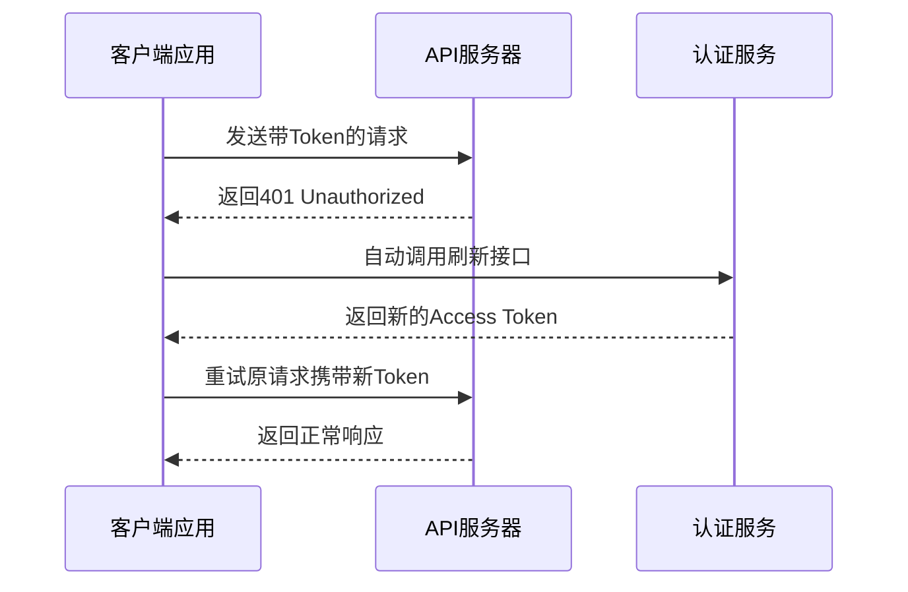
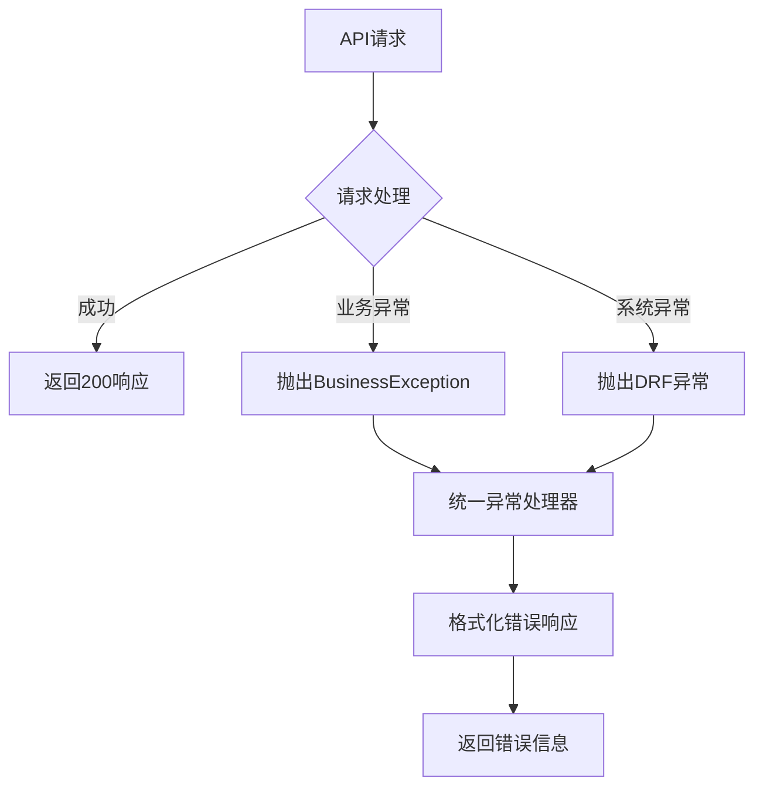

# 常见问题

<cite>
**本文档引用的文件**
- [backend/backend/settings/base.py](file://backend/backend/settings/base.py)
- [backend/common/exceptions.py](file://backend/common/exceptions.py)
- [backend/users/views.py](file://backend/users/views.py)
- [backend/orders/views.py](file://backend/orders/views.py)
- [backend/common/throttles.py](file://backend/common/throttles.py)
- [backend/catalog/models.py](file://backend/catalog/models.py)
- [frontend/src/services/auth.ts](file://frontend/src/services/auth.ts)
- [frontend/src/utils/request.ts](file://frontend/src/utils/request.ts)
- [merchant/src/services/api.ts](file://merchant/src/services/api.ts)
- [backend/backend/settings/production.py](file://backend/backend/settings/production.py)
- [backend/backend/settings/development.py](file://backend/backend/settings/development.py)
- [frontend/package.json](file://frontend/package.json)
- [frontend/project.config.json](file://frontend/project.config.json)
</cite>

## 目录
1. [认证相关问题](#认证相关问题)
2. [API调用常见错误](#api调用常见错误)
3. [数据库相关问题](#数据库相关问题)
4. [前端开发常见问题](#前端开发常见问题)
5. [部署和运维问题](#部署和运维问题)
6. [错误码解释和处理](#错误码解释和处理)

## 认证相关问题

### JWT令牌过期的处理方法

#### 问题描述
JWT访问令牌通常具有较短的有效期（默认7天），而刷新令牌有效期较长（默认30天）。当访问令牌过期时，API会返回401未授权错误。

#### 解决方案

**前端自动处理流程：**



**Token管理实现要点：**

1. **自动刷新机制**：在请求拦截器中检测401错误，自动尝试刷新Token
2. **刷新失败处理**：如果刷新也失败，清除本地Token并跳转登录页面
3. **并发请求处理**：确保多个并发请求不会同时触发Token刷新

**常见问题排查：**
- 检查Token存储是否正确（Taro Storage）
- 验证刷新接口路径和参数
- 确认服务器端JWT配置正确

**节源码**
- [frontend/src/utils/request.ts](file://frontend/src/utils/request.ts#L93-L104)

### 微信登录失败的排查步骤

#### 问题类型和解决方案

**1. 缺少code参数**
- **错误信息**：`Code is required`
- **解决方案**：确保调用`Taro.login()`获取code
- **代码示例**：[frontend/src/services/auth.ts](file://frontend/src/services/auth.ts#L8-L9)

**2. 微信API调用失败**
- **错误信息**：`Failed to connect to WeChat API`
- **排查步骤**：
  1. 检查微信小程序配置（appid和secret）
  2. 确认网络连接正常
  3. 验证域名配置是否正确

**3. 微信API返回错误**
- **错误信息**：包含errcode和errmsg的详细错误
- **常见错误码**：
  - `40029`：无效的code
  - `40001`：AppSecret错误
  - `45009`：频率限制

**4. 未配置微信凭证**
- **现象**：使用模拟登录模式
- **解决方案**：在生产环境配置正确的微信小程序凭证

**节源码**
- [backend/users/views.py](file://backend/users/views.py#L53-L118)

## API调用常见错误

### HTTP状态码详解

#### 401 未授权
**原因**：缺少有效的认证凭据或Token已过期
**解决方案**：
1. 检查请求头中的Authorization字段
2. 实现自动Token刷新机制
3. 验证Token格式和有效性

#### 403 禁止访问
**原因**：用户权限不足或未通过身份验证
**解决方案**：
1. 检查用户角色和权限
2. 验证API端点的权限配置
3. 确认用户是否被正确认证

#### 429 请求过于频繁
**原因**：触发了API限流机制
**解决方案**：
1. 实现客户端重试机制
2. 优化请求频率
3. 使用缓存减少不必要的请求

### 速率限制配置

系统实现了多层次的速率限制：

| 端点类型 | 匿名用户限制 | 已认证用户限制 | 特殊说明 |
|---------|-------------|---------------|----------|
| 通用API | 20次/分钟 | 100次/分钟 | 默认限制 |
| 登录接口 | 5次/分钟 | 5次/分钟 | 严格限制 |
| 支付接口 | 不适用 | 10次/分钟 | 防止滥用 |

**节源码**
- [backend/common/throttles.py](file://backend/common/throttles.py#L11-L78)

### 异常处理机制

系统提供了统一的异常处理和错误响应格式：



**错误响应格式：**
```json
{
  "success": false,
  "code": 400,
  "message": "错误描述",
  "error_code": "ERROR_CODE",
  "errors": {}  // 开发环境提供详细错误信息
}
```

**节源码**
- [backend/common/exceptions.py](file://backend/common/exceptions.py#L251-L308)

## 数据库相关问题

### 迁移冲突问题

#### 常见场景
1. **迁移文件冲突**：多个开发者同时修改模型导致迁移冲突
2. **数据库状态不一致**：本地数据库与迁移历史不匹配
3. **生产环境迁移失败**：大表迁移导致长时间锁定

#### 解决方案

**1. 迁移冲突预防**
- 使用`makemigrations --dry-run`预览迁移
- 合并前检查迁移文件内容
- 使用`migrate --plan`查看待执行迁移

**2. 迁移冲突修复**
```bash
# 回滚到特定迁移
python manage.py migrate <app_name> <migration_name>

# 删除冲突的迁移文件
rm <app_name>/migrations/<conflicting_migration>.py

# 重新生成迁移
python manage.py makemigrations <app_name>
```

**3. 大表迁移优化**
- 使用`atomic=False`禁用事务
- 分批处理数据
- 在低峰时段执行

### 查询性能优化

#### 索引策略

**核心表索引配置：**

| 表名 | 索引类型 | 字段 | 用途 |
|------|---------|------|------|
| orders_order | 复合索引 | user_id, created_at | 用户订单查询 |
| orders_order | 单列索引 | status | 状态过滤查询 |
| catalog_product | 复合索引 | category, is_active | 商品分类查询 |
| catalog_product | 单列索引 | brand_id | 品牌关联查询 |
| users_user | 单列索引 | openid | 微信用户查找 |

#### 查询优化技巧

**1. 避免N+1查询**
```python
# 优化前：每次循环都会执行查询
for order in orders:
    user = order.user  # N+1查询

# 优化后：使用select_related或prefetch_related
orders = Order.objects.select_related('user').all()
for order in orders:
    user = order.user  # 只执行一次查询
```

**2. 使用适当的查询集**
```python
# 优化前：全表扫描
Product.objects.filter(is_active=True)

# 优化后：利用索引
Product.objects.filter(is_active=True, stock__gt=0)
```

**3. 分页查询优化**
```python
# 使用分页避免大量数据加载
from django.core.paginator import Paginator
paginator = Paginator(Product.objects.all(), 20)
page = paginator.page(1)
```

**节源码**
- [backend/catalog/models.py](file://backend/catalog/models.py#L105-L113)

### 数据库配置

#### 开发环境vs生产环境

**开发环境特点：**
- 使用SQLite数据库
- DEBUG=True，便于调试
- 允许所有CORS源

**生产环境特点：**
- 使用PostgreSQL数据库
- DEBUG=False，提高安全性
- 严格的CORS配置

**节源码**
- [backend/backend/settings/development.py](file://backend/backend/settings/development.py#L1-L20)
- [backend/backend/settings/production.py](file://backend/backend/settings/production.py#L1-L35)

## 前端开发常见问题

### Taro小程序编译错误

#### 常见编译问题及解决方案

**1. Node.js版本不兼容**
- **错误信息**：`Node.js version not supported`
- **解决方案**：升级到Node.js 18+版本
- **验证命令**：`node --version`

**2. 依赖包安装失败**
- **错误信息**：`npm install failed`
- **解决方案**：
  ```bash
  # 清理缓存
  npm cache clean --force
  
  # 删除node_modules重新安装
  rm -rf node_modules package-lock.json
  npm install
  ```

**3. 平台特定编译错误**
- **解决方案**：检查平台配置和依赖版本一致性

#### 编译配置优化

**项目配置优化：**
- 关闭`compileHotReLoad`以提高编译速度
- 启用代码压缩和混淆
- 配置合适的打包选项

**节源码**
- [frontend/package.json](file://frontend/package.json#L12-L32)
- [frontend/project.config.json](file://frontend/project.config.json#L7-L25)

### 样式兼容性问题

#### CSS兼容性处理

**1. 小程序样式限制**
- 不支持某些CSS属性
- 需要使用小程序特定的样式语法

**2. 响应式设计**
- 使用相对单位（rem/em）
- 配置合适的视口设置

**3. 动画兼容性**
- 使用小程序提供的动画API
- 避免复杂的CSS动画

#### 样式最佳实践

**1. 组件化样式**
```scss
// 使用作用域避免样式污染
.my-component {
  &__title {
    font-size: 16px;
  }
  
  &__content {
    padding: 10px;
  }
}
```

**2. 主题变量**
```scss
$primary-color: #1890ff;
$font-size-base: 14px;

.text-primary {
  color: $primary-color;
  font-size: $font-size-base;
}
```

### 网络请求问题

#### 请求超时处理

**1. 超时配置**
```javascript
// 设置合理的超时时间
const TIMEOUT = 30000; // 30秒

const request = async (options) => {
  const controller = new AbortController();
  const timeoutId = setTimeout(() => controller.abort(), TIMEOUT);
  
  try {
    const response = await fetch(url, {
      ...options,
      signal: controller.signal
    });
    clearTimeout(timeoutId);
    return response;
  } catch (error) {
    clearTimeout(timeoutId);
    throw error;
  }
};
```

**2. 重试机制**
```javascript
const retryRequest = async (fn, retries = 3) => {
  try {
    return await fn();
  } catch (error) {
    if (retries > 0) {
      return retryRequest(fn, retries - 1);
    }
    throw error;
  }
};
```

**节源码**
- [frontend/src/utils/request.ts](file://frontend/src/utils/request.ts#L78-L132)

## 部署和运维问题

### Gunicorn进程管理

#### 生产环境部署配置

**1. Gunicorn启动命令**
```bash
# 基础启动
gunicorn backend.asgi:application \
  --bind 0.0.0.0:8000 \
  --workers 3 \
  --worker-class uvicorn.workers.UvicornWorker \
  --log-level info

# 带守护进程模式
gunicorn backend.asgi:application \
  --bind 0.0.0.0:8000 \
  --workers 3 \
  --daemon
```

**2. 进程监控配置**
```bash
# 使用supervisor管理进程
[program:electric-miniprogram]
command=gunicorn backend.asgi:application --bind 0.0.0.0:8000 --workers 3
directory=/path/to/project
user=www-data
autostart=true
autorestart=true
stderr_logfile=/var/log/electric-miniprogram.err.log
stdout_logfile=/var/log/electric-miniprogram.out.log
```

#### 性能调优

**1. 工作进程数配置**
- CPU密集型任务：`workers = CPU cores * 2 + 1`
- I/O密集型任务：`workers = CPU cores * 4`

**2. 内存管理**
- 设置合理的内存限制
- 监控内存使用情况
- 配置垃圾回收参数

### 服务监控

#### API监控配置

系统提供了内置的API监控功能：

**监控端点：**
- `/api/monitor/dashboard/` - 监控仪表板
- `/api/monitor/records/` - 监控记录
- `/api/monitor/statistics/` - 统计数据

**监控指标：**
- API响应时间
- 错误率统计
- 请求量趋势
- 数据库查询性能

#### 日志配置

**1. 日志级别配置**
```python
LOGGING = {
    'version': 1,
    'disable_existing_loggers': False,
    'formatters': {
        'verbose': {
            'format': '{levelname} {asctime} {module} {message}',
            'style': '{',
        },
    },
    'handlers': {
        'file': {
            'level': 'INFO',
            'class': 'logging.FileHandler',
            'filename': '/var/log/django/app.log',
            'formatter': 'verbose',
        },
    },
    'loggers': {
        'django': {
            'handlers': ['file'],
            'level': 'INFO',
            'propagate': True,
        },
    },
}
```

**2. 错误日志分析**
- 监控4xx和5xx错误
- 分析错误模式和趋势
- 设置告警阈值

### 安全配置

#### HTTPS配置

**1. SSL证书配置**
```nginx
server {
    listen 443 ssl;
    server_name your-domain.com;
    
    ssl_certificate /path/to/certificate.crt;
    ssl_certificate_key /path/to/private.key;
    
    # SSL优化
    ssl_protocols TLSv1.2 TLSv1.3;
    ssl_prefer_server_ciphers on;
    ssl_ciphers 'ECDHE-RSA-AES128-GCM-SHA256:ECDHE-RSA-AES256-GCM-SHA384';
}
```

**2. 安全头部**
```python
# 在settings.py中配置
SECURE_BROWSER_XSS_FILTER = True
SECURE_CONTENT_TYPE_NOSNIFF = True
SECURE_HSTS_SECONDS = 31536000
SECURE_HSTS_INCLUDE_SUBDOMAINS = True
```

#### CORS配置

**生产环境严格配置：**
```python
CORS_ALLOW_ALL_ORIGINS = False
CORS_ALLOWED_ORIGINS = [
    'https://yourdomain.com',
    'https://app.yourdomain.com',
]
CORS_ALLOW_CREDENTIALS = True
```

**节源码**
- [backend/backend/settings/production.py](file://backend/backend/settings/production.py#L24-L26)

## 错误码解释和处理

### 业务错误码

#### 订单相关错误

| 错误码 | 错误信息 | 原因 | 解决方案 |
|--------|----------|------|----------|
| INSUFFICIENT_STOCK | 库存不足 | 商品库存不足以满足购买数量 | 提示用户减少购买数量或选择其他商品 |
| INVALID_ORDER_STATUS | 订单状态转换不合法 | 尝试执行非法的订单状态变更 | 检查订单当前状态和允许的操作 |
| PAYMENT_VERIFICATION_FAILED | 支付验证失败 | 支付签名或金额验证失败 | 检查支付参数和签名算法 |
| DUPLICATE_PAYMENT | 重复支付 | 尝试处理已经成功的支付 | 检查支付状态，避免重复提交 |
| INVALID_PAYMENT_AMOUNT | 支付金额不匹配 | 支付金额与订单金额不符 | 确认订单金额计算正确 |

#### 用户相关错误

| 错误码 | 错误信息 | 原因 | 解决方案 |
|--------|----------|------|----------|
| SUPPLIER_API_ERROR | 供应商API调用失败 | 第三方供应商接口不可用 | 检查供应商配置和网络连接 |
| SUPPLIER_AUTH_FAILED | 供应商认证失败 | 供应商认证凭据无效 | 更新供应商认证信息 |
| RESOURCE_CONFLICT | 资源冲突 | 尝试删除有依赖关系的资源 | 先删除或解除相关依赖 |

**节源码**
- [backend/common/exceptions.py](file://backend/common/exceptions.py#L59-L244)

### 系统错误码

#### HTTP状态码映射

| HTTP状态码 | 描述 | 常见场景 | 处理建议 |
|------------|------|----------|----------|
| 400 | 请求错误 | 参数验证失败、数据格式错误 | 检查请求参数和数据格式 |
| 401 | 未授权 | Token过期或无效 | 触发Token刷新流程 |
| 403 | 禁止访问 | 权限不足 | 检查用户权限和角色 |
| 404 | 资源不存在 | 请求的资源不存在 | 提示用户资源已删除或不存在 |
| 429 | 请求过于频繁 | 触发速率限制 | 实现指数退避重试机制 |
| 500 | 服务器内部错误 | 代码异常、数据库连接失败 | 查看服务器日志，联系技术支持 |
| 502 | 网关错误 | 第三方服务不可用 | 检查第三方服务状态 |
| 503 | 服务不可用 | 服务暂时不可用 | 提示用户稍后重试 |

#### 错误处理最佳实践

**1. 客户端错误处理**
```javascript
// 统一错误处理
const handleError = (error) => {
  if (error.response) {
    const { status, data } = error.response;
    
    switch (status) {
      case 401:
        // Token过期处理
        handleTokenExpired();
        break;
      case 429:
        // 限流处理
        showToast('请求过于频繁，请稍后再试');
        break;
      case 500:
        // 服务器错误
        console.error('服务器错误:', data.message);
        break;
      default:
        showToast(data.message || '请求失败');
    }
  } else {
    showToast('网络错误，请检查您的网络连接');
  }
};
```

**2. 服务端错误处理**
```python
# 在中间件中捕获未处理异常
class ExceptionLoggingMiddleware:
    def __init__(self, get_response):
        self.get_response = get_response
    
    def __call__(self, request):
        try:
            response = self.get_response(request)
        except Exception as e:
            # 记录错误日志
            logger.error(f'Unhandled exception: {str(e)}', exc_info=True)
            # 返回友好的错误响应
            return JsonResponse({
                'success': False,
                'code': 500,
                'message': '服务器内部错误，请稍后重试'
            }, status=500)
        
        return response
```

**节源码**
- [backend/common/exceptions.py](file://backend/common/exceptions.py#L353-L396)

### 调试和诊断工具

#### 开发环境调试

**1. Django Debug Toolbar**
```python
# 在开发环境中启用
INSTALLED_APPS += ['debug_toolbar']
MIDDLEWARE += ['debug_toolbar.middleware.DebugToolbarMiddleware']
INTERNAL_IPS = ['127.0.0.1']
```

**2. SQL查询日志**
```python
# 在settings.py中配置
LOGGING = {
    'loggers': {
        'django.db.backends': {
            'level': 'DEBUG',
            'handlers': ['console'],
        }
    }
}
```

#### 生产环境监控

**1. 性能监控**
- 监控API响应时间
- 数据库查询性能
- 内存和CPU使用率

**2. 错误监控**
- 实时错误通知
- 错误趋势分析
- 用户影响评估

**3. 安全监控**
- 异常登录检测
- API滥用监控
- 安全事件告警

通过以上详细的常见问题解决方案，开发者可以快速定位和解决在使用系统过程中遇到的各种问题，提高开发效率和系统稳定性。