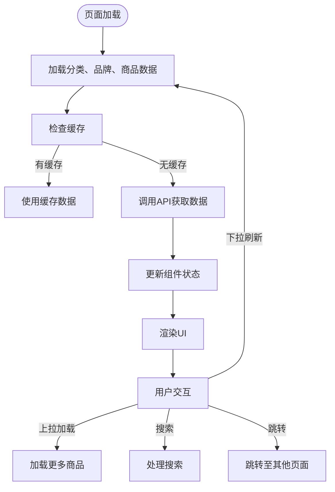
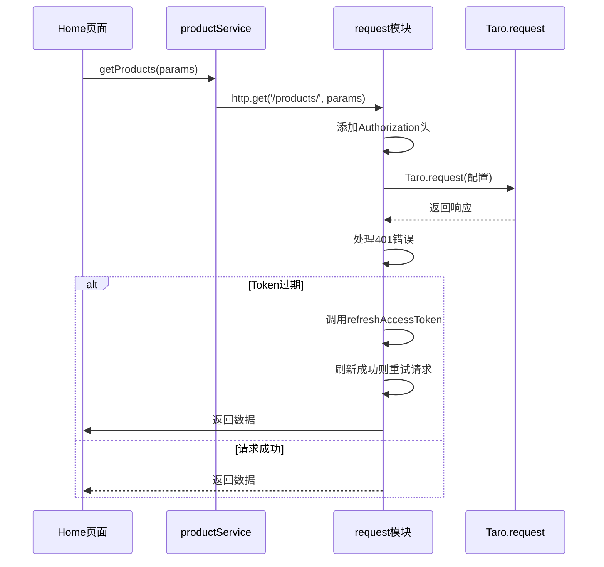

# 前端技术栈

<cite>
**本文档中引用的文件**  
- [package.json](file://frontend/package.json)
- [tsconfig.json](file://frontend/tsconfig.json)
- [babel.config.js](file://frontend/babel.config.js)
- [project.config.json](file://frontend/project.config.json)
- [config/index.ts](file://frontend/config/index.ts)
- [config/dev.ts](file://frontend/config/dev.ts)
- [config/prod.ts](file://frontend/config/prod.ts)
- [src/app.ts](file://frontend/src/app.ts)
- [src/app.config.ts](file://frontend/src/app.config.ts)
- [src/pages/home/index.tsx](file://frontend/src/pages/home/index.tsx)
- [src/services/product.ts](file://frontend/src/services/product.ts)
- [src/utils/request.ts](file://frontend/src/utils/request.ts)
- [src/types/index.ts](file://frontend/src/types/index.ts)
</cite>

## 目录
1. [简介](#简介)
2. [项目结构](#项目结构)
3. [核心组件](#核心组件)
4. [架构概述](#架构概述)
5. [详细组件分析](#详细组件分析)
6. [依赖分析](#依赖分析)
7. [性能考虑](#性能考虑)
8. [故障排除指南](#故障排除指南)
9. [结论](#结论)

## 简介
本文档详细说明了基于 Taro 4.1.8、React 18+、TypeScript 5.4+ 和 Vite 4+ 的前端技术栈。该技术组合用于开发支持多端小程序（如微信、支付宝、字节跳动等）的统一应用。Taro 框架作为跨平台开发核心，React 提供组件化 UI 构建能力，TypeScript 确保类型安全，Vite 显著提升开发构建体验。文档结合 `package.json` 中的依赖项，分析 `@tarojs/components`、`@tarojs/runtime` 等核心包的作用，并解释 Babel 配置如何支持现代 JavaScript 特性，以及 `tsconfig.json` 的类型检查配置。同时提供实际项目配置示例，展示 Taro 项目的结构与编译流程，并阐述该技术栈如何支持小程序的性能优化、热更新和跨平台兼容性。

## 项目结构
本项目采用典型的 Taro 框架目录结构，清晰地分离了源码、配置、资源和服务逻辑。核心源码位于 `/src` 目录下，包含页面、组件、服务、工具和类型定义。配置文件集中管理开发、生产环境及构建工具设置。

```mermaid
graph TD
A[/frontend] --> B[src]
A --> C[config]
A --> D[types]
A --> E[package.json]
A --> F[tsconfig.json]
A --> G[babel.config.js]
B --> H[pages]
B --> I[components]
B --> J[services]
B --> K[utils]
B --> L[app.ts]
B --> M[app.config.ts]
C --> N[index.ts]
C --> O[dev.ts]
C --> P[prod.ts]
```

**Diagram sources**  
- [src](file://frontend/src)
- [config](file://frontend/config)
- [types](file://frontend/types)

**Section sources**
- [package.json](file://frontend/package.json)

## 核心组件
项目的核心组件包括应用入口 `app.ts` 和 `app.config.ts`，它们定义了应用的全局行为和页面路由。`app.ts` 是 React 组件的根节点，使用 `@tarojs/taro` 提供的生命周期钩子（如 `useLaunch`）来响应小程序的启动事件。`app.config.ts` 则通过 `defineAppConfig` 定义了页面路径、窗口样式和底部标签栏等全局配置，是小程序多页面结构的基础。

**Section sources**
- [src/app.ts](file://frontend/src/app.ts)
- [src/app.config.ts](file://frontend/src/app.config.ts)

## 架构概述
该技术栈的架构是一个分层的、基于配置驱动的跨平台开发框架。Taro 框架位于核心，它利用 React 的组件模型和虚拟 DOM 概念，通过运行时（`@tarojs/runtime`）将 React 代码编译和适配到各个小程序平台的原生组件和 API。TypeScript 提供了贯穿整个开发流程的静态类型检查，Vite 作为构建工具，提供了快速的冷启动和热模块替换（HMR），极大地提升了开发效率。

```mermaid
graph TB
subgraph "开发层"
A[TSX/JSX] --> B[Taro 框架]
C[TypeScript] --> B
D[Vite] --> B
end
subgraph "Taro 核心"
B --> E[@tarojs/components]
B --> F[@tarojs/runtime]
B --> G[@tarojs/shared]
end
subgraph "目标平台"
E --> H[微信小程序]
E --> I[支付宝小程序]
E --> J[字节跳动小程序]
E --> K[H5]
end
style A fill:#f9f,stroke:#333
style C fill:#f9f,stroke:#333
style D fill:#f9f,stroke:#333
style H fill:#bbf,stroke:#333
style I fill:#bbf,stroke:#333
style J fill:#bbf,stroke:#333
style K fill:#bbf,stroke:#333
```

**Diagram sources**  
- [package.json](file://frontend/package.json#L41-L57)
- [babel.config.js](file://frontend/babel.config.js)
- [tsconfig.json](file://frontend/tsconfig.json)

## 详细组件分析

### 主页组件分析
`Home` 页面是应用的入口，它展示了典型的 Taro + React + TypeScript 组件的实现方式。该组件使用 React Hooks（`useState`, `useEffect`）管理状态和副作用，通过 `@tarojs/components` 导入的 `View`, `Swiper`, `Image`, `ScrollView` 等组件构建 UI，这些组件最终会被 Taro 编译成对应平台的原生组件。



**Diagram sources**  
- [src/pages/home/index.tsx](file://frontend/src/pages/home/index.tsx)

#### 服务与请求逻辑
`productService` 和 `request` 模块共同构成了应用的数据访问层。`productService` 定义了与商品相关的业务 API 接口，而 `request` 模块封装了底层的网络请求，实现了统一的错误处理、Token 认证和自动刷新机制。



**Diagram sources**  
- [src/services/product.ts](file://frontend/src/services/product.ts)
- [src/utils/request.ts](file://frontend/src/utils/request.ts)

### 类型定义分析
`types/index.ts` 文件集中定义了应用中使用的所有 TypeScript 接口，如 `User`, `Product`, `Order` 等。这确保了数据在组件、服务和 API 之间的流动具有明确的结构和类型安全，是 TypeScript 在项目中发挥价值的关键体现。

**Section sources**
- [src/types/index.ts](file://frontend/src/types/index.ts)

## 依赖分析
项目的依赖关系清晰地分为生产依赖和开发依赖。生产依赖（`dependencies`）包含了运行应用所必需的 Taro 核心包、React 及其运行时。开发依赖（`devDependencies`）则包含了构建、编译和代码质量检查工具。

```mermaid
erDiagram
TaroCore["Taro 核心"] {
string "@tarojs/taro"
string "@tarojs/runtime"
string "@tarojs/components"
string "@tarojs/shared"
}
Framework["框架"] {
string "react"
string "react-dom"
}
BuildTool["构建工具"] {
string "vite"
string "@tarojs/vite-runner"
string "babel-preset-taro"
}
DevTool["开发工具"] {
string "eslint"
string "stylelint"
string "husky"
string "typescript"
}
TaroCore ||--o{ Framework : "基于"
TaroCore }o--|| BuildTool : "使用"
BuildTool }o--|| DevTool : "集成"
```

**Diagram sources**  
- [package.json](file://frontend/package.json#L39-L85)

**Section sources**
- [package.json](file://frontend/package.json)

## 性能考虑
该技术栈在性能方面进行了多项优化。首先，Vite 的使用确保了开发环境下的极速启动和热更新。其次，在代码层面，通过 `Storage` 工具对分类、品牌等不常变动的数据进行本地缓存，减少了不必要的网络请求。此外，`tsconfig.json` 中的 `noUnusedLocals` 和 `noUnusedParameters` 配置有助于在编译时发现未使用的代码，从而在构建时进行更有效的代码压缩。

## 故障排除指南
当遇到问题时，可以参考以下常见问题的排查方向：
- **编译错误**：检查 `tsconfig.json` 的类型定义是否正确，或 `babel.config.js` 的配置是否有误。
- **网络请求失败**：检查 `request.ts` 中的 `BASE_URL` 环境变量是否配置正确，以及 Token 管理逻辑是否正常工作。
- **页面不显示**：确认 `app.config.ts` 中的页面路径是否正确注册，且对应的 `.config.ts` 文件存在。
- **样式不生效**：由于使用了 Sass，确保 `.scss` 文件的语法正确，并被正确引入。

**Section sources**
- [src/utils/request.ts](file://frontend/src/utils/request.ts#L3-L162)
- [tsconfig.json](file://frontend/tsconfig.json)
- [babel.config.js](file://frontend/babel.config.js)

## 结论
综上所述，该前端技术栈以 Taro 4.1.8 为核心，成功整合了 React 18+、TypeScript 5.4+ 和 Vite 4+ 的优势，构建了一个高效、类型安全且易于维护的跨平台小程序开发环境。通过合理的项目结构、清晰的依赖管理和强大的工具链支持，该技术栈不仅能够实现一次开发、多端部署的目标，还能有效保障应用的性能和稳定性，为后续的功能迭代和优化奠定了坚实的基础。