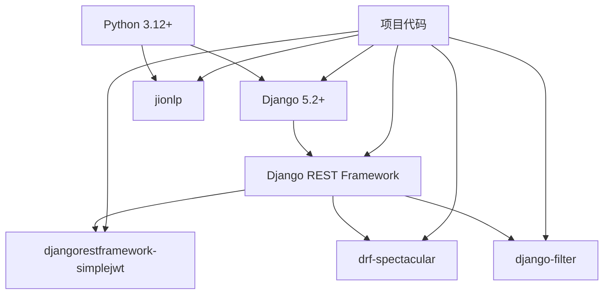
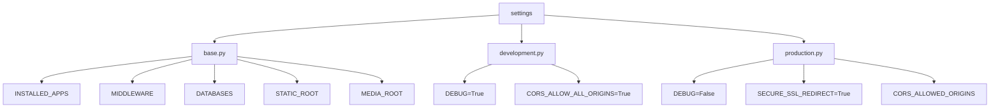
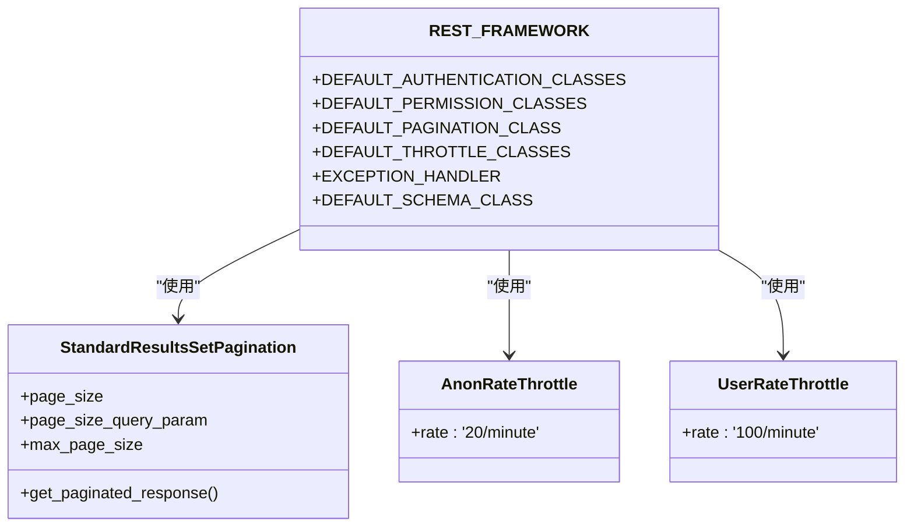
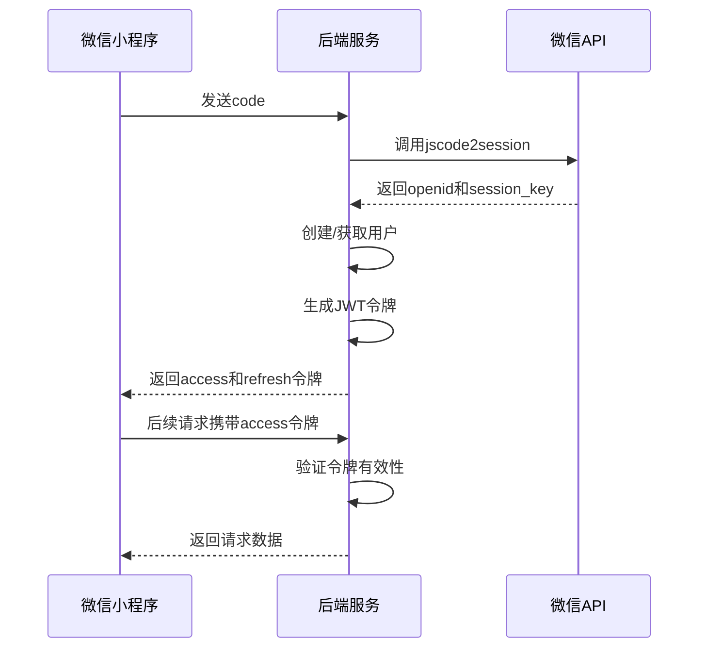
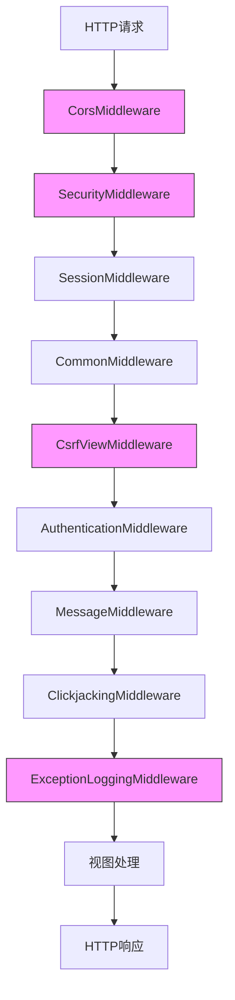
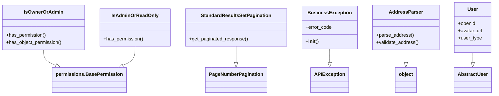

# 后端技术栈

<cite>
**本文档引用的文件**   
- [pyproject.toml](file://backend/pyproject.toml)
- [base.py](file://backend/backend/settings/base.py)
- [development.py](file://backend/backend/settings/development.py)
- [production.py](file://backend/backend/settings/production.py)
- [permissions.py](file://backend/common/permissions.py)
- [pagination.py](file://backend/common/pagination.py)
- [exceptions.py](file://backend/common/exceptions.py)
- [address_parser.py](file://backend/common/address_parser.py)
- [users/models.py](file://backend/users/models.py)
- [catalog/views.py](file://backend/catalog/views.py)
- [orders/views.py](file://backend/orders/views.py)
- [users/views.py](file://backend/users/views.py)
- [integrations/views.py](file://backend/integrations/views.py)
</cite>

## 目录
1. [技术栈概述](#技术栈概述)
2. [核心依赖与版本要求](#核心依赖与版本要求)
3. [Django框架配置](#djangoframework配置)
4. [REST框架配置](#rest框架配置)
5. [JWT认证机制](#jwt认证机制)
6. [API文档生成](#api文档生成)
7. [中间件与CORS配置](#中间件与cors配置)
8. [数据库连接配置](#数据库连接配置)
9. [自定义组件与工具](#自定义组件与工具)
10. [技术选型理由](#技术选型理由)

## 技术栈概述

本项目采用现代化的Python后端技术栈，以Django为核心Web框架，结合Django REST Framework构建RESTful API接口。技术栈包括Python 3.12+、Django 5.2+、Django REST Framework、djangorestframework-simplejwt和drf-spectacular等关键组件，形成了一个功能完整、安全可靠、易于维护的后端系统。

系统架构采用分层设计，包括核心框架层、API服务层、业务逻辑层和数据访问层。通过合理的配置和扩展，实现了用户认证、权限控制、数据验证、异常处理、API文档生成等关键功能。项目还集成了外部API服务，如海尔和YLH系统，实现了商品同步、订单推送和物流查询等业务需求。

**Section sources**
- [pyproject.toml](file://backend/pyproject.toml)
- [base.py](file://backend/backend/settings/base.py)

## 核心依赖与版本要求

项目的核心依赖在pyproject.toml文件中明确定义，确保了版本的兼容性和稳定性。主要依赖包括：

- **Python**: 要求版本3.12或更高，利用了Python 3.12的新特性和性能优化
- **Django**: 版本5.2.7或更高，作为核心Web框架提供MVC架构支持
- **Django REST Framework (DRF)**: 版本3.16.1或更高，用于构建RESTful API接口
- **djangorestframework-simplejwt**: 版本5.5.1或更高，实现JWT认证机制
- **drf-spectacular**: 版本0.27.0或更高，生成OpenAPI 3.0规范的API文档
- **django-filter**: 版本25.2或更高，提供API过滤功能
- **jionlp**: 版本1.5.27或更高，用于中文地址解析

这些依赖的选择基于其稳定性、社区支持和功能完整性。版本要求确保了项目能够利用最新的安全补丁和性能改进，同时避免了向后兼容性问题。



**Diagram sources **
- [pyproject.toml](file://backend/pyproject.toml)

**Section sources**
- [pyproject.toml](file://backend/pyproject.toml)

## Django框架配置

Django作为核心Web框架，在settings/base.py中进行了全面配置。配置文件采用了模块化设计，分为base.py（基础配置）、development.py（开发环境）和production.py（生产环境），实现了环境感知的配置管理。

关键配置包括：
- **INSTALLED_APPS**: 注册了simpleui、rest_framework、drf_spectacular等核心应用
- **MIDDLEWARE**: 配置了CORS中间件、安全中间件、会话中间件等
- **DATABASES**: 数据库配置通过EnvironmentConfig类动态获取
- **STATIC_ROOT** 和 **MEDIA_ROOT**: 定义了静态文件和媒体文件的存储路径
- **CACHES**: 配置了本地内存缓存，生产环境可覆盖为分布式缓存

开发环境和生产环境的配置差异主要体现在安全性设置上。开发环境允许所有CORS来源，便于本地开发调试；生产环境则严格限制CORS来源，启用HSTS等安全头，确保系统安全。



**Diagram sources **
- [base.py](file://backend/backend/settings/base.py)
- [development.py](file://backend/backend/settings/development.py)
- [production.py](file://backend/backend/settings/production.py)

**Section sources**
- [base.py](file://backend/backend/settings/base.py)
- [development.py](file://backend/backend/settings/development.py)
- [production.py](file://backend/backend/settings/production.py)

## REST框架配置

Django REST Framework的配置在settings/base.py的REST_FRAMEWORK字典中定义，是API行为的核心。配置包括认证、权限、分页、节流等多个方面，确保了API的一致性和安全性。

关键配置项：
- **DEFAULT_AUTHENTICATION_CLASSES**: 使用JWTAuthentication实现无状态认证
- **DEFAULT_PERMISSION_CLASSES**: 默认允许任何用户访问，具体视图可覆盖
- **DEFAULT_PAGINATION_CLASS**: 使用自定义的StandardResultsSetPagination
- **DEFAULT_THROTTLE_CLASSES**: 配置了匿名和用户级别的请求节流
- **EXCEPTION_HANDLER**: 使用自定义的异常处理器
- **DEFAULT_SCHEMA_CLASS**: 设置为drf_spectacular的AutoSchema

分页配置返回了丰富的元数据，包括总记录数、当前页码、总页数等，便于前端实现分页控件。节流配置在生产环境中启用，防止API被滥用，开发环境中禁用以便调试。



**Diagram sources **
- [base.py](file://backend/backend/settings/base.py)
- [pagination.py](file://backend/common/pagination.py)

**Section sources**
- [base.py](file://backend/backend/settings/base.py)
- [pagination.py](file://backend/common/pagination.py)

## JWT认证机制

JWT认证通过djangorestframework-simplejwt实现，在settings/base.py中配置了SIMPLE_JWT字典。该机制提供了安全的无状态用户认证，适用于前后端分离的应用架构。

核心配置：
- **ACCESS_TOKEN_LIFETIME**: 访问令牌有效期为7天
- **REFRESH_TOKEN_LIFETIME**: 刷新令牌有效期为30天
- 使用Bearer方案进行令牌传递

认证流程通过WeChatLoginView和PasswordLoginView实现。微信小程序用户通过code换取openid，系统创建或获取用户后返回JWT令牌；管理员用户通过用户名密码登录，验证通过后返回JWT令牌。令牌包含用户信息，前端在后续请求中通过Authorization头传递。



**Diagram sources **
- [base.py](file://backend/backend/settings/base.py)
- [users/views.py](file://backend/users/views.py)

**Section sources**
- [base.py](file://backend/backend/settings/base.py)
- [users/views.py](file://backend/users/views.py)

## API文档生成

API文档通过drf-spectacular生成，配置在settings/base.py的SPECTACULAR_SETTINGS字典中。该工具自动生成符合OpenAPI 3.0规范的API文档，提供交互式界面和多种格式导出。

主要配置：
- **TITLE**: API文档标题为"E-Commerce API"
- **DESCRIPTION**: 描述电商平台系统的API
- **VERSION**: 版本号为1.0.0
- **SERVE_PERMISSIONS**: 允许任何用户访问文档
- **SCHEMA_PATH_PREFIX**: API路径前缀为/api/v1
- **TAGS**: 定义了产品、分类、订单、用户等标签

在视图中使用@extend_schema装饰器添加详细的API文档信息，包括操作ID、参数描述、请求体示例等。这使得生成的文档不仅包含基本的路由信息，还包括业务逻辑的详细说明，极大提高了API的可理解性和可用性。

```mermaid
graph TD
A[视图代码] --> B[@extend_schema]
B --> C[drf-spectacular]
C --> D[OpenAPI Schema]
D --> E[Swagger UI]
D --> F[Redoc]
D --> G[OpenAPI JSON]
E --> H[交互式文档]
F --> I[静态文档]
G --> J[第三方工具集成]
```

**Diagram sources **
- [base.py](file://backend/backend/settings/base.py)
- [catalog/views.py](file://backend/catalog/views.py)

**Section sources**
- [base.py](file://backend/backend/settings/base.py)
- [catalog/views.py](file://backend/catalog/views.py)

## 中间件与CORS配置

中间件配置在settings/base.py的MIDDLEWARE列表中，定义了请求处理的管道。关键中间件包括：
- **CorsMiddleware**: 处理跨域资源共享，开发环境允许所有来源，生产环境限制特定来源
- **SecurityMiddleware**: 提供安全头设置，如HSTS、X-Frame-Options等
- **SessionMiddleware**: 管理用户会话
- **CsrfViewMiddleware**: 防止跨站请求伪造攻击
- **AuthenticationMiddleware**: 处理用户认证
- **ExceptionLoggingMiddleware**: 自定义异常日志中间件

CORS配置通过CORS_ALLOW_CREDENTIALS、CORS_ALLOW_HEADERS等设置控制跨域行为。开发环境中使用CORS_ALLOW_ALL_ORIGINS=True简化开发；生产环境中通过CORS_ALLOWED_ORIGINS精确控制允许的来源，确保安全性。



**Diagram sources **
- [base.py](file://backend/backend/settings/base.py)
- [development.py](file://backend/backend/settings/development.py)
- [production.py](file://backend/backend/settings/production.py)

**Section sources**
- [base.py](file://backend/backend/settings/base.py)
- [development.py](file://backend/backend/settings/development.py)
- [production.py](file://backend/backend/settings/production.py)

## 数据库连接配置

数据库连接配置通过EnvironmentConfig类实现环境感知的动态配置。在settings/development.py和settings/production.py中，通过get_database_config()方法获取数据库配置。

开发环境使用SQLite或通过环境变量配置的数据库，便于本地开发；生产环境强制要求配置有效的数据库连接，确保系统稳定性。这种设计使得开发、测试和生产环境可以使用不同的数据库配置，而无需修改代码。

数据库配置通常包括主机、端口、数据库名、用户名和密码等信息，通过环境变量注入，避免了敏感信息硬编码在代码中，提高了安全性。

**Section sources**
- [development.py](file://backend/backend/settings/development.py)
- [production.py](file://backend/backend/settings/production.py)

## 自定义组件与工具

项目包含多个自定义组件和工具，增强了系统的功能性和可维护性：

- **自定义权限类**: 在common/permissions.py中定义了IsOwnerOrAdmin、IsAdminOrReadOnly等权限类，实现细粒度的访问控制
- **自定义分页类**: 在common/pagination.py中定义了多种分页策略，满足不同场景的需求
- **自定义异常处理**: 在common/exceptions.py中实现了统一的异常处理器，提供一致的错误响应格式
- **地址解析服务**: 在common/address_parser.py中集成jionlp，实现中文地址的智能识别和拆分
- **用户模型扩展**: 在users/models.py中扩展了Django的User模型，支持微信用户和管理员用户

这些自定义组件遵循了Django的扩展机制，通过继承和重写实现了特定业务需求，同时保持了代码的可读性和可维护性。



**Diagram sources **
- [permissions.py](file://backend/common/permissions.py)
- [pagination.py](file://backend/common/pagination.py)
- [exceptions.py](file://backend/common/exceptions.py)
- [address_parser.py](file://backend/common/address_parser.py)
- [users/models.py](file://backend/users/models.py)

**Section sources**
- [permissions.py](file://backend/common/permissions.py)
- [pagination.py](file://backend/common/pagination.py)
- [exceptions.py](file://backend/common/exceptions.py)
- [address_parser.py](file://backend/common/address_parser.py)
- [users/models.py](file://backend/users/models.py)

## 技术选型理由

技术选型基于以下考虑：

1. **Python 3.12+**: 最新的Python版本提供了更好的性能和新特性，如模式匹配、异常组等，提高了开发效率和代码质量。

2. **Django 5.2+**: 作为成熟的Python Web框架，Django提供了完整的MVC架构、ORM、管理界面等特性，适合构建复杂的Web应用。

3. **Django REST Framework**: 在Django基础上提供了构建RESTful API的完整解决方案，包括序列化、视图、认证、权限等，大大简化了API开发。

4. **djangorestframework-simplejwt**: 轻量级的JWT实现，与DRF无缝集成，提供安全的无状态认证机制，适合移动端和前后端分离应用。

5. **drf-spectacular**: 生成高质量的OpenAPI文档，支持Swagger UI和Redoc，提供交互式API测试界面，极大提高了API的可发现性和可用性。

6. **django-filter**: 提供强大的API过滤功能，支持复杂的查询条件，满足了电商平台的搜索和筛选需求。

7. **jionlp**: 专门针对中文的自然语言处理库，提供了准确的地址解析功能，解决了中文地址处理的难题。

版本兼容性方面，所有依赖都选择了最新的稳定版本，并通过pyproject.toml锁定版本范围，确保了依赖的稳定性和安全性。这种技术栈组合既保证了系统的现代性和性能，又兼顾了稳定性和可维护性。

**Section sources**
- [pyproject.toml](file://backend/pyproject.toml)
- [base.py](file://backend/backend/settings/base.py)