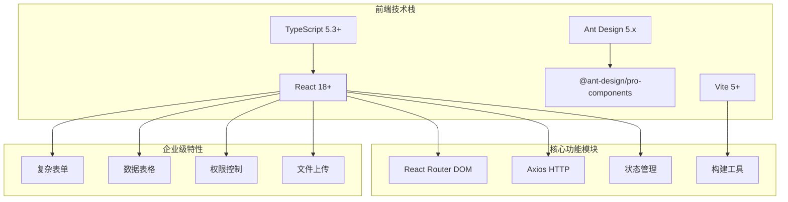
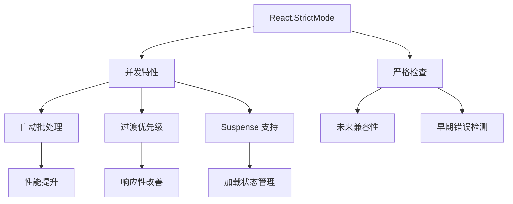
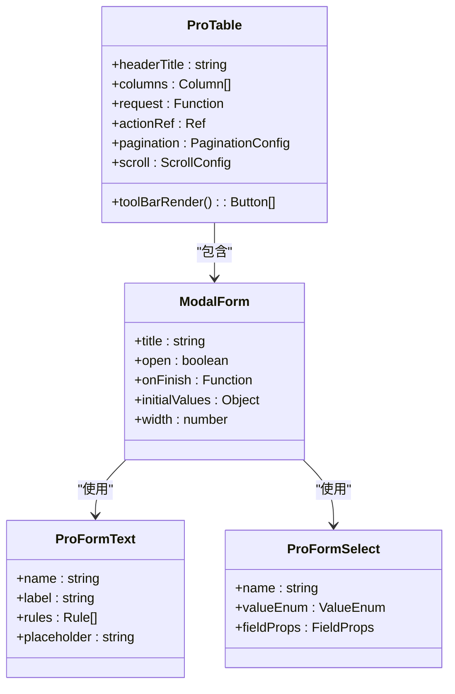
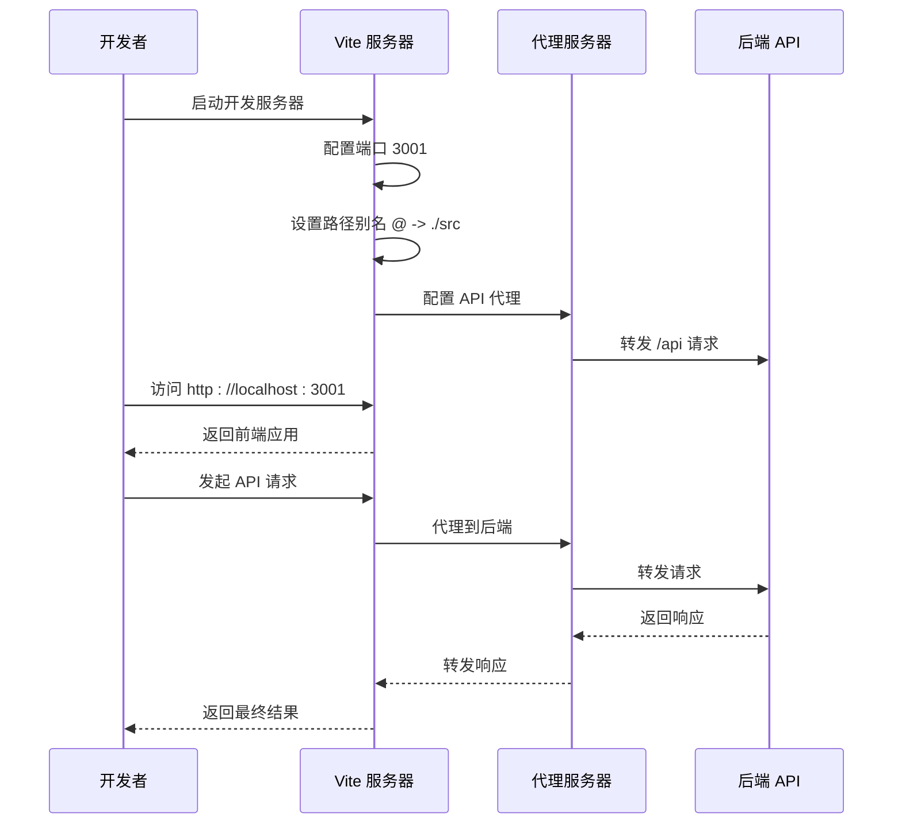
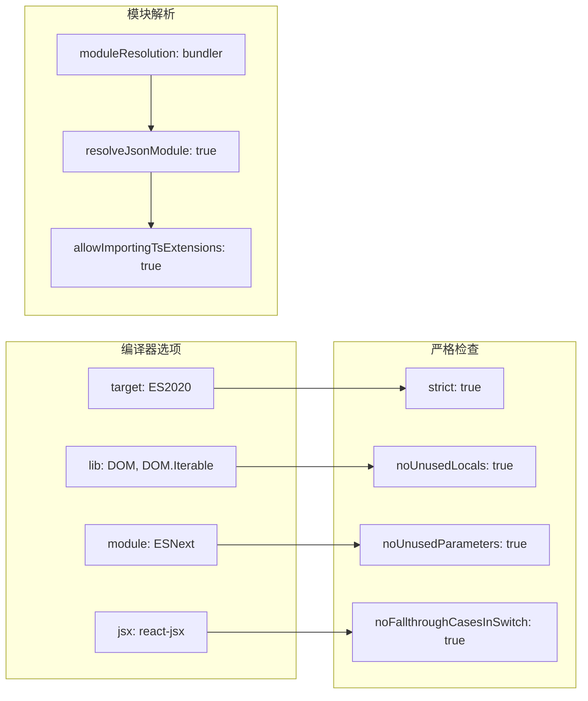
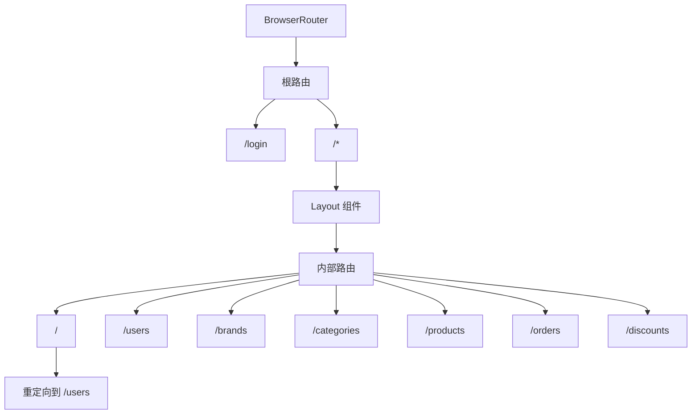
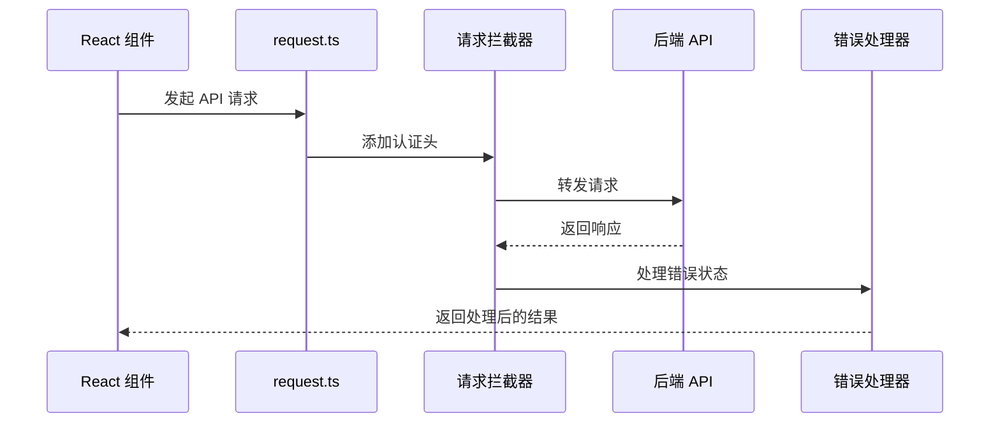

# 商户管理后台技术栈

<cite>
**本文档引用的文件**
- [merchant/package.json](file://merchant/package.json)
- [merchant/vite.config.ts](file://merchant/vite.config.ts)
- [merchant/main.tsx](file://merchant/src/main.tsx)
- [merchant/src/App.tsx](file://merchant/src/App.tsx)
- [merchant/tsconfig.json](file://merchant/tsconfig.json)
- [merchant/tsconfig.node.json](file://merchant/tsconfig.node.json)
- [merchant/src/components/Layout/index.tsx](file://merchant/src/components/Layout/index.tsx)
- [merchant/src/pages/Users/index.tsx](file://merchant/src/pages/Users/index.tsx)
- [merchant/src/pages/Products/index.tsx](file://merchant/src/pages/Products/index.tsx)
- [merchant/src/pages/Orders/index.tsx](file://merchant/src/pages/Orders/index.tsx)
- [merchant/src/services/api.ts](file://merchant/src/services/api.ts)
- [merchant/src/utils/request.ts](file://merchant/src/utils/request.ts)
- [merchant/src/utils/auth.ts](file://merchant/src/utils/auth.ts)
- [merchant/src/components/ImageUpload/index.tsx](file://merchant/src/components/ImageUpload/index.tsx)
</cite>

## 目录
1. [项目概述](#项目概述)
2. [技术栈架构](#技术栈架构)
3. [核心依赖分析](#核心依赖分析)
4. [React 18+ 架构基础](#react-18-架构基础)
5. [Ant Design Pro 组件库](#ant-design-pro-组件库)
6. [Vite 5+ 构建工具](#vite-5-构建工具)
7. [TypeScript 5.3+ 类型系统](#typescript-53-类型系统)
8. [应用初始化与路由配置](#应用初始化与路由配置)
9. [企业级功能实现](#企业级功能实现)
10. [性能优化策略](#性能优化策略)
11. [总结](#总结)

## 项目概述

商户管理后台是一个基于现代前端技术栈的企业级管理平台，采用 React 18+ 作为核心框架，结合 Ant Design Pro 提供丰富的 UI 组件，以及 Vite 5+ 作为现代化构建工具。该技术栈专为企业级应用场景设计，支持复杂的表单处理、数据表格、权限控制等核心功能需求。

## 技术栈架构

**图表来源**
- [merchant/package.json](file://merchant/package.json#L10-L25)
- [merchant/vite.config.ts](file://merchant/vite.config.ts#L1-L27)

**章节来源**
- [merchant/package.json](file://merchant/package.json#L1-L27)
- [merchant/vite.config.ts](file://merchant/vite.config.ts#L1-L27)

## 核心依赖分析

### 主要生产依赖

| 依赖包 | 版本 | 功能描述 | 技术价值 |
|--------|------|----------|----------|
| `react` | ^18.2.0 | 核心前端框架 | 支持并发特性和严格模式 |
| `react-dom` | ^18.2.0 | React DOM 渲染器 | 服务端渲染和客户端激活 |
| `antd` | ^5.12.2 | 企业级 UI 设计语言 | 提供完整的组件库 |
| `@ant-design/pro-components` | ^2.6.43 | 专业版 Ant Design 组件 | 高级业务组件 |
| `react-router-dom` | ^6.20.1 | 路由管理 | 客户端路由解决方案 |
| `axios` | ^1.6.2 | HTTP 请求库 | 异步数据交互 |

### 开发依赖

| 依赖包 | 版本 | 功能描述 | 技术价值 |
|--------|------|----------|----------|
| `typescript` | ^5.3.3 | 类型检查 | 编译时类型安全 |
| `vite` | ^5.0.8 | 构建工具 | 快速开发和构建 |
| `@vitejs/plugin-react` | ^4.2.1 | React 插件 | Vite React 支持 |
| `@types/react` | ^18.2.43 | React 类型定义 | 开发时类型提示 |
| `@types/react-dom` | ^18.2.17 | React DOM 类型定义 | DOM 操作类型安全 |

**章节来源**
- [merchant/package.json](file://merchant/package.json#L10-L25)

## React 18+ 架构基础

### 并发特性与严格模式

React 18+ 带来了多项革命性改进，为商户管理后台提供了强大的架构基础：

**图表来源**
- [merchant/src/main.tsx](file://merchant/src/main.tsx#L8-L15)

### 应用入口点架构

应用的初始化过程体现了 React 18+ 的最佳实践：

1. **严格模式启用**：通过 `React.StrictMode` 启用开发时的额外检查
2. **国际化配置**：使用 `zhCN` 本地化配置
3. **主题提供者**：通过 `ConfigProvider` 提供统一的主题配置
4. **应用容器**：使用 `AntApp` 作为应用根容器

**章节来源**
- [merchant/src/main.tsx](file://merchant/src/main.tsx#L1-L17)

## Ant Design Pro 组件库

### Pro Components 生态系统

Ant Design Pro 提供了一套完整的业务组件解决方案，专门针对管理后台场景进行了优化：

**图表来源**
- [merchant/src/pages/Users/index.tsx](file://merchant/src/pages/Users/index.tsx#L1-L50)
- [merchant/src/pages/Products/index.tsx](file://merchant/src/pages/Products/index.tsx#L1-L50)

### 企业级组件特性

#### 1. ProTable - 高级数据表格

ProTable 是 Ant Design Pro 的核心组件，提供了以下企业级特性：

- **内置分页**：自动处理分页逻辑和状态管理
- **搜索功能**：支持多种搜索条件和筛选器
- **工具栏**：提供导出、刷新、密度调整等操作
- **响应式布局**：自适应不同屏幕尺寸
- **列固定**：支持左侧和右侧列固定

#### 2. ModalForm - 模态框表单

ModalForm 将表单验证、提交和错误处理封装在一个组件中：

- **自动验证**：基于 Ant Design 表单的验证规则
- **异步提交**：支持异步数据提交和加载状态
- **错误处理**：统一的错误提示和重试机制
- **初始值管理**：智能的表单状态管理

**章节来源**
- [merchant/src/pages/Users/index.tsx](file://merchant/src/pages/Users/index.tsx#L152-L238)
- [merchant/src/pages/Products/index.tsx](file://merchant/src/pages/Products/index.tsx#L400-L500)

## Vite 5+ 构建工具

### 开发服务器配置

Vite 5+ 提供了现代化的开发体验，通过配置实现了高效的开发工作流：

**图表来源**
- [merchant/vite.config.ts](file://merchant/vite.config.ts#L5-L27)

### 构建优化配置

Vite 的配置体现了现代前端工程的最佳实践：

1. **路径别名**：通过 `@` 别名简化模块导入
2. **插件系统**：使用 React 插件提供 JSX 转换支持
3. **代理配置**：开发环境下的 API 代理
4. **环境变量**：支持多环境配置

**章节来源**
- [merchant/vite.config.ts](file://merchant/vite.config.ts#L1-L27)

## TypeScript 5.3+ 类型系统

### 类型配置架构

TypeScript 5.3+ 提供了更严格的类型检查和更好的开发体验：

**图表来源**
- [merchant/tsconfig.json](file://merchant/tsconfig.json#L2-L21)

### 类型安全优势

TypeScript 5.3+ 在商户管理后台中提供了以下优势：

1. **编译时类型检查**：在构建时捕获类型错误
2. **智能代码补全**：提供准确的 IDE 支持
3. **重构安全性**：确保代码修改不会破坏类型关系
4. **文档化能力**：类型定义本身就是良好的代码文档

**章节来源**
- [merchant/tsconfig.json](file://merchant/tsconfig.json#L1-L26)
- [merchant/tsconfig.node.json](file://merchant/tsconfig.node.json#L1-L11)

## 应用初始化与路由配置

### 路由架构设计

应用采用了嵌套路由结构，结合权限控制实现安全的访问管理：

**图表来源**
- [merchant/src/App.tsx](file://merchant/src/App.tsx#L16-L44)

### 权限控制机制

应用实现了基于 Token 的权限控制系统：

1. **私有路由保护**：通过 `PrivateRoute` 组件保护受限制的路由
2. **Token 验证**：检查本地存储中的认证 Token
3. **自动重定向**：未认证用户自动跳转到登录页面
4. **登出功能**：清除 Token 并重定向到登录页面

**章节来源**
- [merchant/src/App.tsx](file://merchant/src/App.tsx#L1-L45)
- [merchant/src/utils/auth.ts](file://merchant/src/utils/auth.ts#L1-L14)

## 企业级功能实现

### 数据管理与交互

#### 1. HTTP 请求封装

应用通过 Axios 实现了统一的 HTTP 请求处理：

**图表来源**
- [merchant/src/utils/request.ts](file://merchant/src/utils/request.ts#L1-L38)

#### 2. 文件上传组件

ImageUpload 组件展示了复杂的企业级文件处理功能：

- **多文件上传**：支持批量图片上传
- **实时预览**：上传过程中的图片预览功能
- **即时更新**：上传完成后立即更新产品信息
- **错误处理**：完善的错误提示和重试机制

**章节来源**
- [merchant/src/utils/request.ts](file://merchant/src/utils/request.ts#L1-L38)
- [merchant/src/components/ImageUpload/index.tsx](file://merchant/src/components/ImageUpload/index.tsx#L1-L173)

### 复杂表单处理

#### 用户管理表单

用户管理页面展示了 Pro Components 在复杂表单场景中的应用：

1. **动态验证**：根据编辑模式动态调整验证规则
2. **关联数据**：品牌和分类的动态加载
3. **状态管理**：复杂的表单状态和提交流程
4. **错误处理**：统一的错误提示和用户反馈

#### 产品管理表单

产品管理页面体现了更复杂的数据处理需求：

- **多字段关联**：品牌、分类、图片等多维度数据
- **条件渲染**：根据产品来源显示不同的字段
- **图片管理**：主图和详情图的独立管理
- **价格计算**：多个价格字段的联动计算

**章节来源**
- [merchant/src/pages/Users/index.tsx](file://merchant/src/pages/Users/index.tsx#L250-L292)
- [merchant/src/pages/Products/index.tsx](file://merchant/src/pages/Products/index.tsx#L420-L520)

### 数据表格优化

#### 性能优化策略

1. **虚拟滚动**：处理大量数据时的性能优化
2. **懒加载**：按需加载品牌和分类数据
3. **缓存机制**：避免重复的 API 调用
4. **防抖处理**：搜索和筛选的性能优化

#### 交互体验

1. **列固定**：重要信息的视觉突出
2. **操作按钮**：便捷的行内操作
3. **批量操作**：支持多选和批量处理
4. **导出功能**：数据导出和打印支持

**章节来源**
- [merchant/src/pages/Users/index.tsx](file://merchant/src/pages/Users/index.tsx#L152-L227)
- [merchant/src/pages/Products/index.tsx](file://merchant/src/pages/Products/index.tsx#L400-L430)

## 性能优化策略

### 构建优化

1. **Tree Shaking**：Vite 自动移除未使用的代码
2. **代码分割**：按路由进行代码分割
3. **资源压缩**：自动的资源压缩和优化
4. **缓存策略**：浏览器缓存和 CDN 优化

### 运行时优化

1. **React.memo**：组件级别的性能优化
2. **useMemo/useCallback**：避免不必要的重新计算
3. **Suspense**：异步组件的加载优化
4. **Profiler**：性能监控和分析

### 网络优化

1. **请求合并**：减少网络请求数量
2. **缓存策略**：智能的数据缓存机制
3. **错误重试**：网络异常的自动重试
4. **加载状态**：清晰的用户反馈

## 总结

商户管理后台技术栈展现了现代前端开发的最佳实践：

### 技术优势

1. **React 18+**：提供了并发特性和严格模式，确保应用的稳定性和性能
2. **Ant Design Pro**：专业的业务组件库，大幅提升了开发效率
3. **Vite 5+**：现代化的构建工具，提供了快速的开发体验
4. **TypeScript 5.3+**：编译时类型检查，提高了代码质量和可维护性

### 企业级特性

1. **复杂表单**：支持多字段、多步骤的复杂业务场景
2. **数据表格**：高性能的数据展示和交互
3. **权限控制**：完善的认证和授权机制
4. **文件上传**：企业级的文件处理能力

### 开发体验

1. **热重载**：快速的开发迭代
2. **类型安全**：编译时的错误检测
3. **代码质量**：统一的编码规范和最佳实践
4. **团队协作**：清晰的组件接口和文档

这套技术栈不仅满足了商户管理后台的功能需求，更为未来的扩展和维护奠定了坚实的基础。通过合理的技术选型和架构设计，实现了高效、稳定、可维护的企业级应用解决方案。