# 技术栈与依赖

<cite>
**本文档引用的文件**
- [backend/pyproject.toml](file://backend/pyproject.toml)
- [backend/backend/settings/base.py](file://backend/backend/settings/base.py)
- [backend/backend/settings/development.py](file://backend/backend/settings/development.py)
- [backend/backend/settings/production.py](file://backend/backend/settings/production.py)
- [backend/backend/urls.py](file://backend/backend/urls.py)
- [backend/catalog/serializers.py](file://backend/catalog/serializers.py)
- [backend/users/views.py](file://backend/users/views.py)
- [backend/orders/views.py](file://backend/orders/views.py)
- [frontend/package.json](file://frontend/package.json)
- [frontend/tsconfig.json](file://frontend/tsconfig.json)
- [frontend/config/index.ts](file://frontend/config/index.ts)
- [frontend/src/services/product.ts](file://frontend/src/services/product.ts)
- [merchant/package.json](file://merchant/package.json)
- [merchant/tsconfig.json](file://merchant/tsconfig.json)
- [merchant/vite.config.ts](file://merchant/vite.config.ts)
- [merchant/src/services/api.ts](file://merchant/src/services/api.ts)
</cite>

## 目录
1. [概述](#概述)
2. [后端技术栈](#后端技术栈)
3. [前端技术栈](#前端技术栈)
4. [商户管理后台技术栈](#商户管理后台技术栈)
5. [技术架构概览](#技术架构概览)
6. [依赖关系分析](#依赖关系分析)
7. [版本要求详解](#版本要求详解)
8. [技术集成方案](#技术集成方案)
9. [性能优化考虑](#性能优化考虑)
10. [总结](#总结)

## 概述

本项目采用现代化的全栈技术架构，包含三个主要组成部分：后端Web服务、移动端小程序前端和商户管理后台。整体技术栈体现了企业级应用的最佳实践，具有良好的扩展性和维护性。

## 后端技术栈

### 核心框架与版本要求

后端采用Python 3.12+作为主要编程语言，基于Django 5.2+构建Web应用框架，提供稳定可靠的服务器端解决方案。

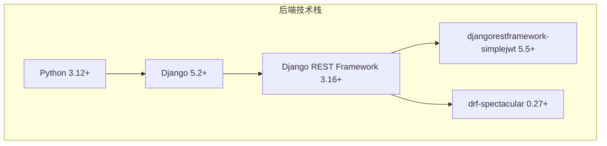

**图表来源**
- [backend/pyproject.toml](file://backend/pyproject.toml#L6-L18)
- [backend/backend/settings/base.py](file://backend/backend/settings/base.py#L12-L29)

### Django REST Framework配置

Django REST Framework作为构建RESTful API的核心组件，在项目中承担着重要的角色：

#### REST_FRAMEWORK配置详解

项目通过详细的REST_FRAMEWORK配置实现了完整的API功能：

| 配置项 | 值 | 说明 |
|--------|-----|------|
| DEFAULT_AUTHENTICATION_CLASSES | JWTAuthentication | 使用JWT进行身份认证 |
| DEFAULT_PERMISSION_CLASSES | AllowAny | 默认允许所有请求（可根据需要调整） |
| DEFAULT_RENDERER_CLASSES | JSONRenderer | 使用JSON格式渲染响应 |
| DEFAULT_THROTTLE_CLASSES | AnonRateThrottle, UserRateThrottle | 匿名和用户级别的速率限制 |
| DEFAULT_PAGINATION_CLASS | StandardResultsSetPagination | 标准结果集分页 |
| PAGE_SIZE | 20 | 每页默认20条记录 |
| EXCEPTION_HANDLER | custom_exception_handler | 自定义异常处理器 |
| DEFAULT_SCHEMA_CLASS | AutoSchema | 自动生成API文档结构 |

#### JWT认证配置

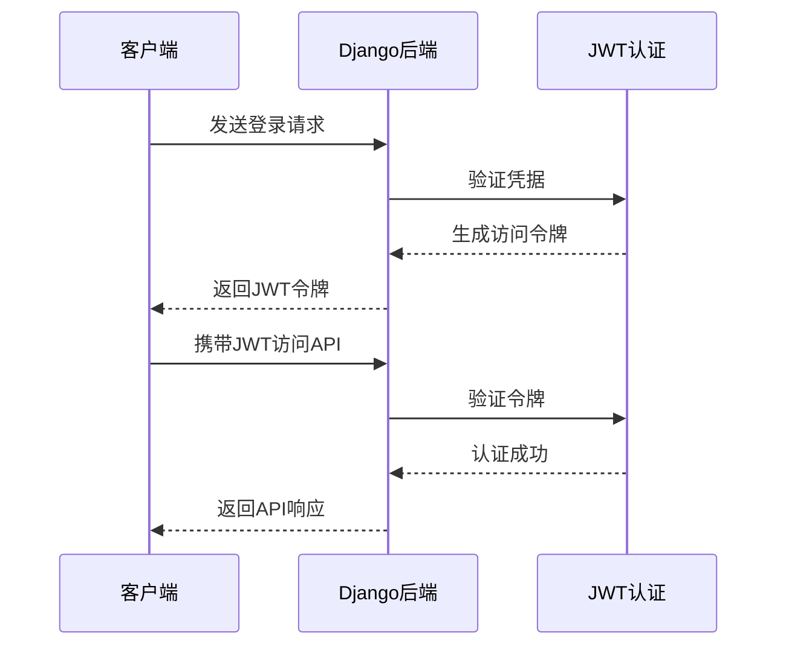

**图表来源**
- [backend/backend/settings/base.py](file://backend/backend/settings/base.py#L33-L58)
- [backend/backend/settings/base.py](file://backend/backend/settings/base.py#L142-L146)

#### API文档生成

drf-spectacular提供了强大的API文档生成功能：

| 文档类型 | 端点 | 说明 |
|----------|------|------|
| Swagger UI | `/api/docs/` | Web界面的交互式API文档 |
| ReDoc | `/api/redoc/` | Redoc格式的API文档 |
| OpenAPI Schema | `/api/schema/` | 原始OpenAPI规范 |

**节来源**
- [backend/backend/settings/base.py](file://backend/backend/settings/base.py#L65-L140)
- [backend/backend/urls.py](file://backend/backend/urls.py#L30-L33)

### 数据库与存储

项目支持多种数据库后端，包括SQLite（开发）、PostgreSQL（生产）等主流数据库系统。文件存储采用灵活的配置机制，支持本地存储和云存储服务。

## 前端技术栈

### Taro多端开发框架

前端采用Taro 4.1.8作为跨平台开发框架，支持一次开发，多端部署的目标。

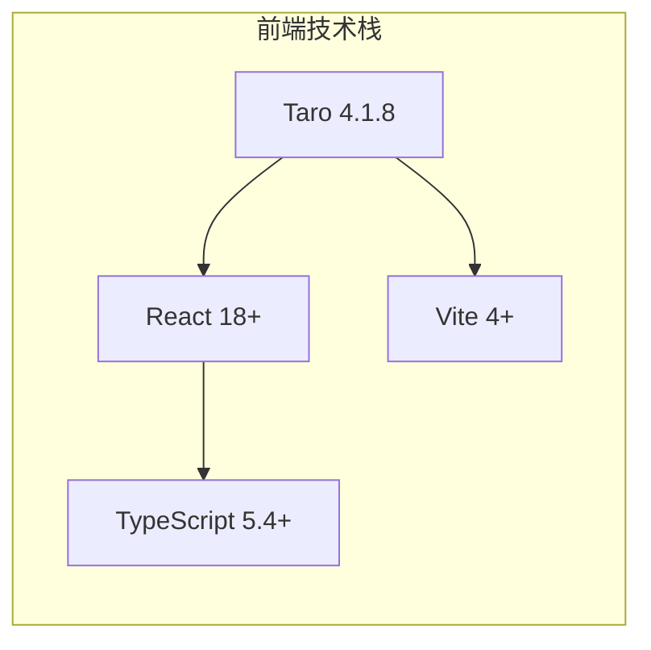

**图表来源**
- [frontend/package.json](file://frontend/package.json#L40-L58)
- [frontend/tsconfig.json](file://frontend/tsconfig.json#L1-L31)

### 多端支持能力

Taro框架提供了广泛的平台支持：

| 平台 | 版本 | 说明 |
|------|------|------|
| 微信小程序 | 4.1.8 | 主要目标平台 |
| 支付宝小程序 | 4.1.8 | 电商支付场景 |
| 百度智能小程序 | 4.1.8 | 搜索引擎入口 |
| 字节跳动小程序 | 4.1.8 | 社交媒体平台 |
| QQ小程序 | 4.1.8 | 腾讯生态 |
| 快应用 | 4.1.8 | 原生应用体验 |
| H5网页 | 4.1.8 | Web兼容性 |
| React Native | 4.1.8 | 原生移动应用 |

### TypeScript强类型支持

TypeScript 5.4+提供了强大的类型检查和开发体验：

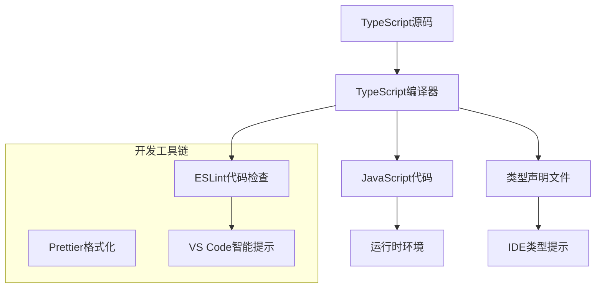

**图表来源**
- [frontend/tsconfig.json](file://frontend/tsconfig.json#L1-L31)

### Vite构建工具

Vite 4+作为现代化的构建工具，提供了快速的开发服务器和高效的生产构建：

| 功能特性 | 说明 |
|----------|------|
| 热模块替换 | 开发时快速更新 |
| ES模块支持 | 更快的冷启动 |
| 代码分割 | 按需加载 |
| 生产优化 | Tree shaking和压缩 |

**节来源**
- [frontend/package.json](file://frontend/package.json#L75-L86)
- [frontend/config/index.ts](file://frontend/config/index.ts#L1-L91)

## 商户管理后台技术栈

### React + Ant Design Pro组合

商户管理后台采用React 18+配合Ant Design Pro构建专业的管理界面。

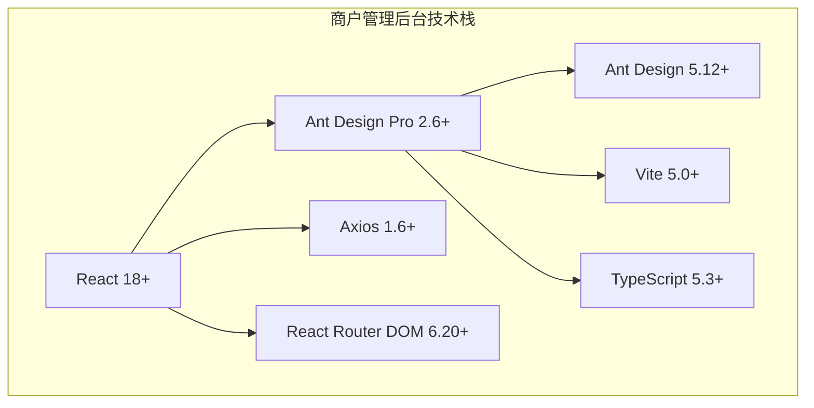

**图表来源**
- [merchant/package.json](file://merchant/package.json#L11-L18)
- [merchant/tsconfig.json](file://merchant/tsconfig.json#L1-L26)

### Ant Design Pro功能特性

Ant Design Pro提供了丰富的管理界面组件：

| 组件类别 | 主要组件 | 功能描述 |
|----------|----------|----------|
| 表格组件 | ProTable | 高级表格，支持分页、排序、筛选 |
| 表单组件 | ProForm | 表单布局和验证 |
| 导航组件 | ProLayout | 响应式布局和菜单 |
| 数据可视化 | ProCharts | 图表和统计面板 |
| 权限控制 | Access | 基于角色的权限管理 |

### API通信层

商户管理后台通过统一的API服务层与后端交互：

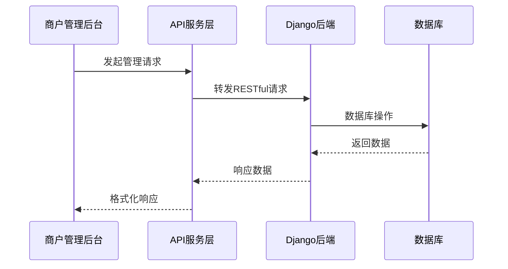

**图表来源**
- [merchant/src/services/api.ts](file://merchant/src/services/api.ts#L1-L66)

**节来源**
- [merchant/package.json](file://merchant/package.json#L1-L27)
- [merchant/vite.config.ts](file://merchant/vite.config.ts#L1-L27)

## 技术架构概览

### 整体架构设计

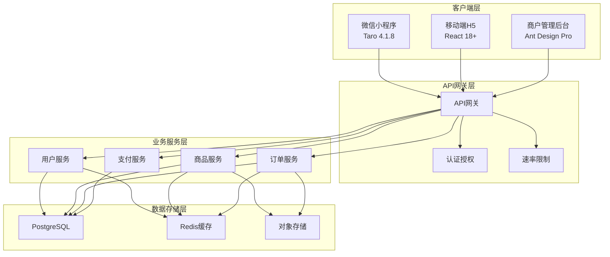

### 数据流架构

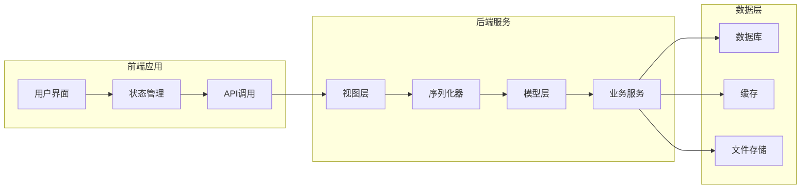

## 依赖关系分析

### 后端依赖层次

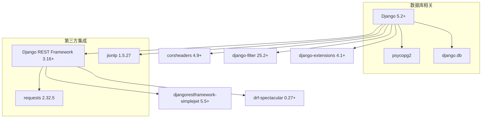

**图表来源**
- [backend/pyproject.toml](file://backend/pyproject.toml#L6-L18)

### 前端依赖关系

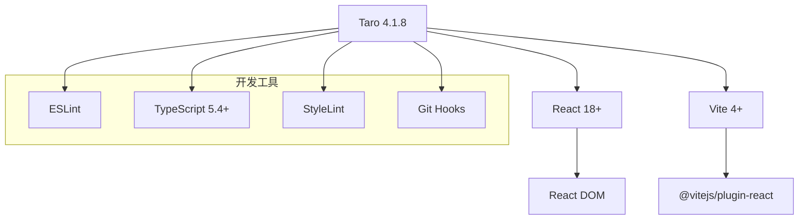

**图表来源**
- [frontend/package.json](file://frontend/package.json#L40-L86)

### 商户管理后台依赖

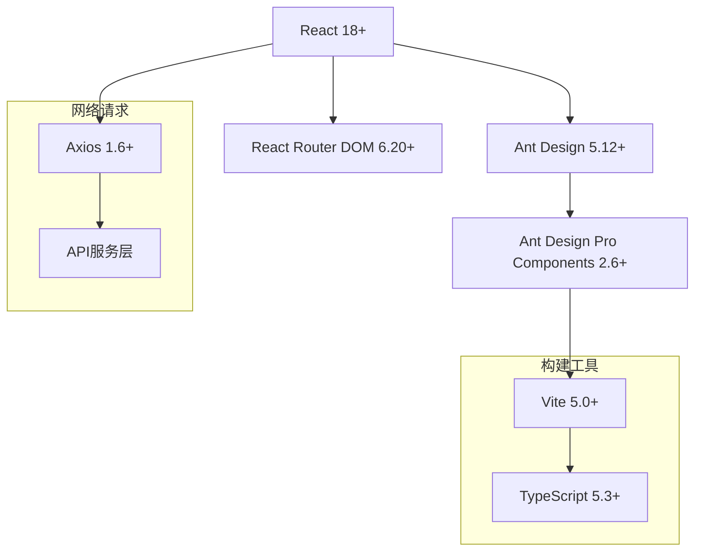

**图表来源**
- [merchant/package.json](file://merchant/package.json#L11-L26)

## 版本要求详解

### Python生态系统版本要求

| 组件 | 最低版本 | 推荐版本 | 说明 |
|------|----------|----------|------|
| Python | 3.12+ | 3.12.x | 新特性支持和性能优化 |
| Django | 5.2+ | 5.2.7 | 最新稳定版，长期支持 |
| Django REST Framework | 3.16+ | 3.16.1 | API构建和文档生成 |
| djangorestframework-simplejwt | 5.5+ | 5.5.1 | JWT认证支持 |
| drf-spectacular | 0.27+ | 0.27.0 | OpenAPI文档生成 |

### 前端生态系统版本要求

| 组件 | 最低版本 | 推荐版本 | 说明 |
|------|----------|----------|------|
| Node.js | 16+ | 18+ | V8引擎性能和ES模块支持 |
| TypeScript | 5.0+ | 5.4+ | 类型安全和开发体验 |
| React | 18.0+ | 18.2+ | 新并发特性和性能优化 |
| Vite | 4.0+ | 4.2+ | 现代化构建工具 |
| Taro | 4.0+ | 4.1.8 | 多端开发框架 |

### 商户管理后台版本要求

| 组件 | 最低版本 | 推荐版本 | 说明 |
|------|----------|----------|------|
| Node.js | 16+ | 18+ | 构建工具和开发环境 |
| TypeScript | 5.0+ | 5.3+ | 类型系统和IDE支持 |
| Vite | 5.0+ | 5.0.8 | 构建速度和开发体验 |
| React | 18.0+ | 18.2+ | 用户界面框架 |

**节来源**
- [backend/pyproject.toml](file://backend/pyproject.toml#L6-L18)
- [frontend/package.json](file://frontend/package.json#L56-L58)
- [merchant/package.json](file://merchant/package.json#L15-L16)

## 技术集成方案

### Django Settings配置集成

Django的settings配置展现了完整的RESTful API架构：

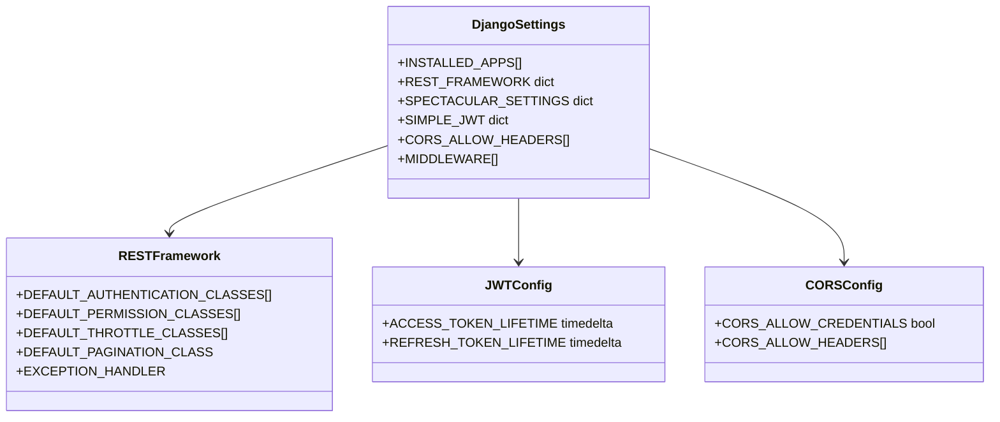

**图表来源**
- [backend/backend/settings/base.py](file://backend/backend/settings/base.py#L33-L140)

### API服务集成模式

前后端通过标准化的RESTful API进行通信：

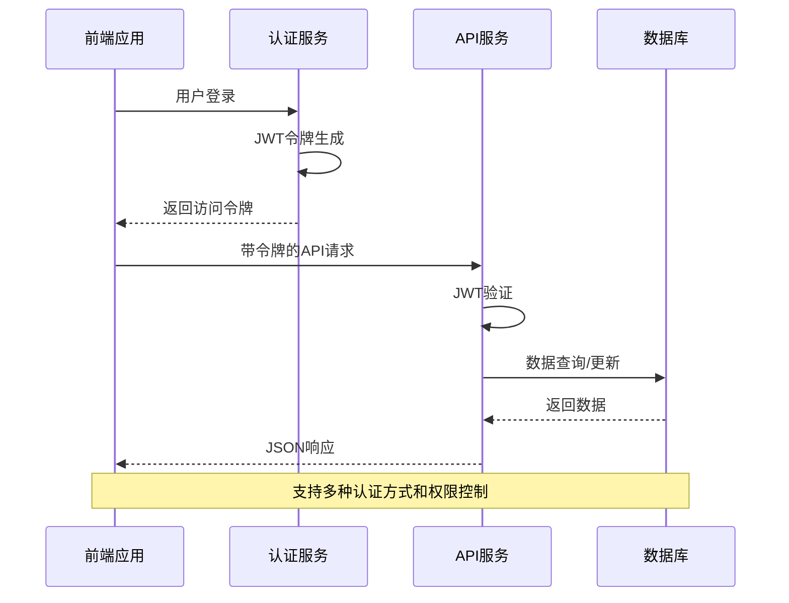

**图表来源**
- [frontend/src/services/product.ts](file://frontend/src/services/product.ts#L1-L64)
- [merchant/src/services/api.ts](file://merchant/src/services/api.ts#L1-L66)

### 状态管理集成

商户管理后台的状态管理模式：

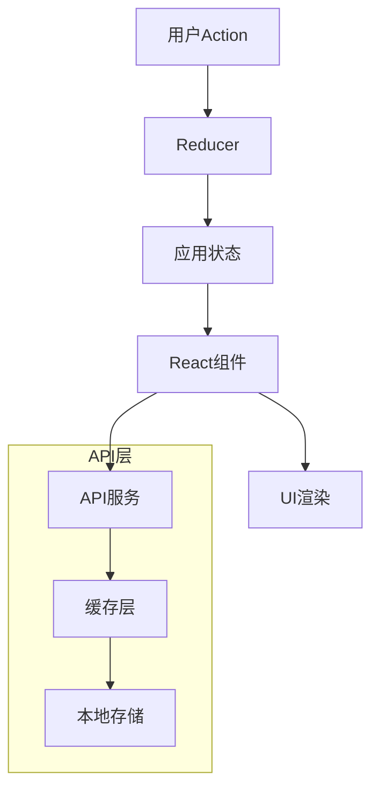

**节来源**
- [backend/backend/settings/base.py](file://backend/backend/settings/base.py#L33-L140)
- [frontend/src/services/product.ts](file://frontend/src/services/product.ts#L1-L64)
- [merchant/src/services/api.ts](file://merchant/src/services/api.ts#L1-L66)

## 性能优化考虑

### 后端性能优化策略

1. **数据库优化**
   - 使用select_related和prefetch_related减少查询次数
   - 实施适当的索引策略
   - 使用缓存减少数据库负载

2. **API性能**
   - 实施速率限制防止滥用
   - 使用分页处理大量数据
   - 实现条件缓存和ETag支持

3. **静态资源**
   - 静态文件CDN加速
   - 压缩和Gzip传输
   - 浏览器缓存策略

### 前端性能优化

1. **构建优化**
   - 代码分割和懒加载
   - Tree shaking消除死代码
   - 压缩和优化资源

2. **运行时优化**
   - React.memo和PureComponent
   - 虚拟滚动处理大数据集
   - 防抖和节流处理用户输入

### 商户管理后台优化

1. **组件优化**
   - 使用ProComponents提高开发效率
   - 实施合理的权限控制
   - 优化表格和表单渲染

2. **网络优化**
   - 请求合并和批处理
   - 错误重试机制
   - 离线数据缓存

## 总结

本项目的技术栈选择体现了现代Web开发的最佳实践：

### 技术优势

1. **后端**：Django + DRF提供了成熟稳定的Web框架，支持快速开发和企业级部署
2. **前端**：Taro多端开发降低了维护成本，React生态系统提供了丰富的组件库
3. **管理后台**：Ant Design Pro简化了管理界面的开发，提高了开发效率
4. **API设计**：RESTful架构和OpenAPI文档确保了接口的标准化和可维护性

### 扩展性考虑

- 模块化架构便于功能扩展
- 微服务友好的API设计
- 云原生部署准备
- 国际化和本地化支持

### 维护性保障

- 完整的类型系统支持
- 严格的代码质量控制
- 自动化测试覆盖
- 详细的API文档

这种技术栈组合为企业级电商系统提供了坚实的技术基础，能够支持业务的快速发展和扩展需求。