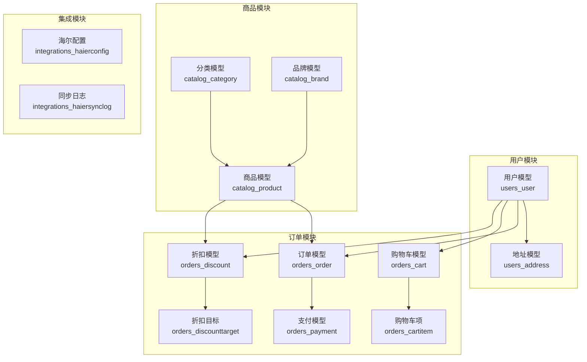
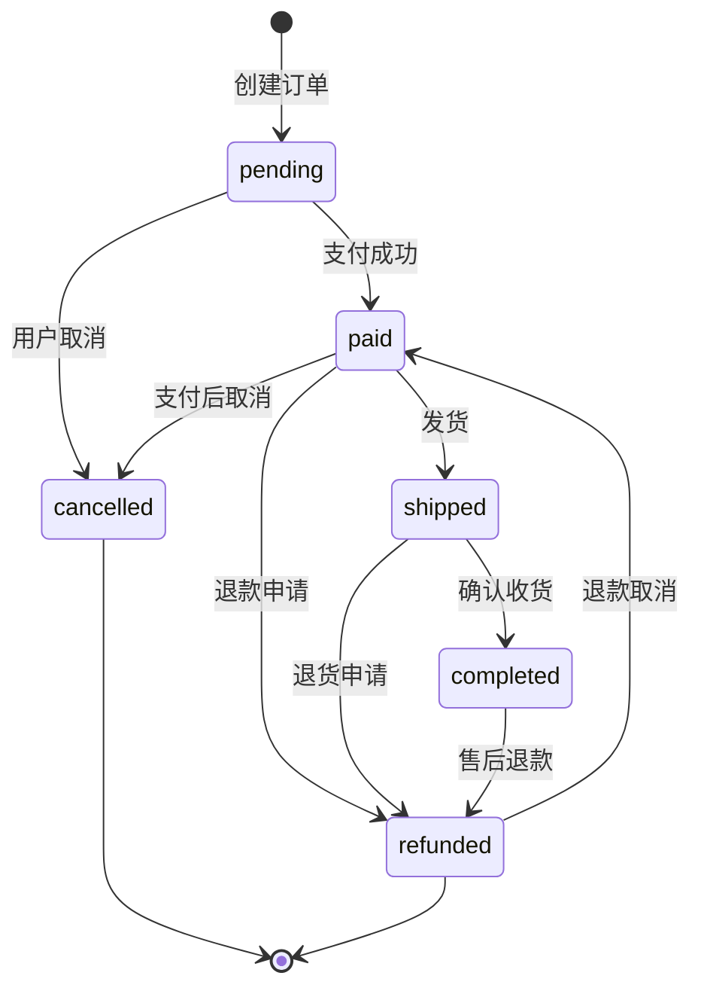
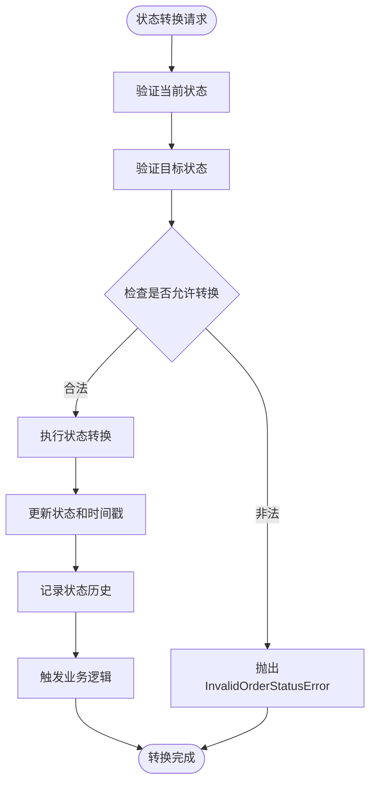
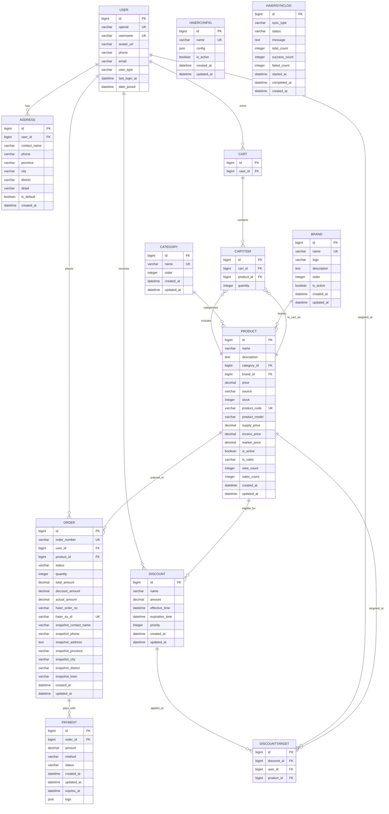

# 数据库设计

<cite>
**本文档引用的文件**
- [backend/users/models.py](file://backend/users/models.py)
- [backend/catalog/models.py](file://backend/catalog/models.py)
- [backend/orders/models.py](file://backend/orders/models.py)
- [backend/integrations/models.py](file://backend/integrations/models.py)
- [backend/users/migrations/0009_user_last_login_at_user_user_type_alter_user_openid.py](file://backend/users/migrations/0009_user_last_login_at_user_user_type_alter_user_openid.py)
- [backend/orders/migrations/0004_alter_order_order_number_and_more.py](file://backend/orders/migrations/0004_alter_order_order_number_and_more.py)
- [backend/catalog/migrations/0015_product_source.py](file://backend/catalog/migrations/0015_product_source.py)
- [backend/orders/state_machine.py](file://backend/orders/state_machine.py)
- [backend/orders/services.py](file://backend/orders/services.py)
- [backend/orders/management/commands/cancel_unpaid_orders.py](file://backend/orders/management/commands/cancel_unpaid_orders.py)
- [DEVELOPER_GUIDE.md](file://DEVELOPER_GUIDE.md)
</cite>

## 目录
1. [概述](#概述)
2. [核心数据模型](#核心数据模型)
3. [用户模型详解](#用户模型详解)
4. [商品模型详解](#商品模型详解)
5. [订单模型详解](#订单模型详解)
6. [第三方集成模型](#第三方集成模型)
7. [数据验证规则](#数据验证规则)
8. [数据库索引策略](#数据库索引策略)
9. [数据生命周期管理](#数据生命周期管理)
10. [实体关系图](#实体关系图)
11. [最佳实践建议](#最佳实践建议)

## 概述

本电商业务小程序采用基于Django ORM的数据库设计方案，支持微信小程序用户体系、海尔智能家电API集成，以及完整的电商交易流程。数据库设计遵循以下核心原则：

- **模块化设计**：按功能领域划分模型，便于维护和扩展
- **数据完整性**：通过外键约束和业务规则确保数据一致性
- **性能优化**：合理设计索引策略，支持高频查询场景
- **可扩展性**：预留扩展点，支持未来功能增长

## 核心数据模型

系统包含四个核心业务模块的数据模型：

**图表来源**
- [backend/users/models.py](file://backend/users/models.py#L31-L95)
- [backend/catalog/models.py](file://backend/catalog/models.py#L5-L312)
- [backend/orders/models.py](file://backend/orders/models.py#L13-L322)
- [backend/integrations/models.py](file://backend/integrations/models.py#L4-L150)

## 用户模型详解

### User模型字段定义

User模型是系统的核心身份认证实体，支持微信小程序和管理员两种用户类型：

| 字段名 | 类型 | 约束 | 描述 |
|--------|------|------|------|
| id | BigAutoField | 主键 | 自增主键 |
| openid | CharField(64) | 唯一、可空 | 微信小程序用户标识 |
| username | CharField(150) | 唯一、默认生成 | 用户名，支持UUID格式 |
| avatar_url | URLField(200) | 默认Gravatar | 用户头像URL |
| phone | CharField(20) | 可空 | 手机号码 |
| email | EmailField | 可空 | 电子邮箱 |
| user_type | CharField(20) | 枚举选择 | 用户类型：wechat/admin |
| last_login_at | DateTimeField | 可空 | 最后登录时间 |

### 用户类型设计

系统支持双认证机制：
- **微信用户**：通过openid识别，用于小程序用户
- **管理员**：通过username识别，用于后台管理系统

### 地址模型设计

Address模型为用户提供收货地址管理功能：

| 字段名 | 类型 | 约束 | 描述 |
|--------|------|------|------|
| id | BigAutoField | 主键 | 自增主键 |
| user | ForeignKey | 外键关联 | 关联用户 |
| contact_name | CharField(50) | 必填 | 联系人姓名 |
| phone | CharField(20) | 必填 | 联系电话 |
| province | CharField(20) | 必填 | 省份 |
| city | CharField(20) | 必填 | 城市 |
| district | CharField(20) | 必填 | 区县 |
| detail | CharField(200) | 必填 | 详细地址 |
| is_default | BooleanField | 默认false | 是否默认地址 |
| created_at | DateTimeField | 自动生成 | 创建时间 |

**章节来源**
- [backend/users/models.py](file://backend/users/models.py#L31-L95)

## 商品模型详解

### Product模型结构

Product模型是商品管理的核心实体，支持本地商品和海尔商品两种来源：

| 字段名 | 类型 | 约束 | 描述 |
|--------|------|------|------|
| id | BigAutoField | 主键 | 自增主键 |
| name | CharField(200) | 必填 | 商品名称 |
| description | TextField | 可空 | 商品描述 |
| category | ForeignKey | 外键关联 | 商品分类 |
| brand | ForeignKey | 外键关联 | 商品品牌 |
| price | Decimal(10,2) | 验证器限制 | 商品价格 |
| source | CharField(20) | 枚举选择 | 商品来源：local/haier |
| stock | PositiveIntegerField | 默认0 | 库存数量 |
| product_code | CharField(50) | 唯一、可空 | 海尔产品编码 |
| product_model | CharField(100) | 默认空 | 海尔产品型号 |
| supply_price | Decimal(10,2) | 可空 | 供应价格 |
| invoice_price | Decimal(10,2) | 可空 | 开票价格 |
| market_price | Decimal(10,2) | 可空 | 市场价格 |
| is_active | BooleanField | 默认true | 是否上架 |
| is_sales | CharField(1) | 默认'1' | 是否可采购 |
| view_count | PositiveIntegerField | 默认0 | 浏览次数 |
| sales_count | PositiveIntegerField | 默认0 | 销售数量 |

### 分类和品牌模型

Category和Brand模型提供商品分类和品牌管理：

**Category模型特性**：
- 支持树形结构（通过flatten_categories迁移实现）
- 可排序的类别列表
- 创建和更新时间戳

**Brand模型特性**：
- 品牌Logo支持
- 可启用/禁用的品牌状态
- 排序和搜索优化

### 商品来源策略

系统支持两种商品来源：
- **Local商品**：本地维护的商品，完全由系统管理
- **Haier商品**：来自海尔API的商品，支持实时同步

**章节来源**
- [backend/catalog/models.py](file://backend/catalog/models.py#L43-L312)

## 订单模型详解

### Order模型设计

Order模型是订单管理的核心实体，支持完整的电商交易流程：

| 字段名 | 类型 | 约束 | 描述 |
|--------|------|------|------|
| id | BigAutoField | 主键 | 自增主键 |
| order_number | CharField(100) | 唯一、自动生成 | 订单编号 |
| user | ForeignKey | 外键关联 | 关联用户 |
| product | ForeignKey | 外键关联 | 关联商品 |
| status | CharField(20) | 枚举选择 | 订单状态 |
| quantity | PositiveIntegerField | 默认1 | 商品数量 |
| total_amount | Decimal(10,2) | 必填 | 总金额 |
| discount_amount | Decimal(10,2) | 默认0 | 折扣金额 |
| actual_amount | Decimal(10,2) | 默认0 | 实付金额 |
| created_at | DateTimeField | 自动生成 | 创建时间 |
| updated_at | DateTimeField | 自动生成 | 更新时间 |

### 订单状态流转

系统采用状态机模式管理订单状态流转：

**图表来源**
- [backend/orders/state_machine.py](file://backend/orders/state_machine.py#L34-L57)

### 海尔订单集成

Order模型支持与海尔系统的深度集成：

| 字段名 | 类型 | 描述 |
|--------|------|------|
| haier_order_no | CharField(100) | 海尔订单号 |
| haier_so_id | CharField(100) | 海尔子订单号（唯一） |
| haier_status | CharField(20) | 海尔订单状态 |

### 支付和物流信息

Order模型包含完整的支付和物流跟踪信息：

- **支付信息**：支付方式、支付状态、支付时间
- **物流信息**：物流公司、物流单号、发货单号、SN码
- **配送信息**：配送时间、安装时间、送装一体标识

**章节来源**
- [backend/orders/models.py](file://backend/orders/models.py#L13-L322)

## 第三方集成模型

### HaierConfig模型

HaierConfig模型管理海尔API的配置信息：

| 字段名 | 类型 | 描述 |
|--------|------|------|
| id | BigAutoField | 主键 |
| name | CharField(50) | 配置名称（默认haier） |
| config | JSONField | 配置信息（client_id、client_secret等） |
| is_active | BooleanField | 是否启用 |
| created_at | DateTimeField | 创建时间 |
| updated_at | DateTimeField | 更新时间 |

### HaierSyncLog模型

HaierSyncLog模型记录所有海尔API同步操作：

| 字段名 | 类型 | 描述 |
|--------|------|------|
| id | BigAutoField | 主键 |
| sync_type | CharField(20) | 同步类型 |
| status | CharField(20) | 同步状态 |
| message | TextField | 同步消息 |
| total_count | IntegerField | 总记录数 |
| success_count | IntegerField | 成功记录数 |
| failed_count | IntegerField | 失败记录数 |
| started_at | DateTimeField | 开始时间 |
| completed_at | DateTimeField | 完成时间 |

**章节来源**
- [backend/integrations/models.py](file://backend/integrations/models.py#L4-L150)

## 数据验证规则

### 订单状态验证

系统通过状态机确保订单状态流转的合法性：

**图表来源**
- [backend/orders/state_machine.py](file://backend/orders/state_machine.py#L118-L144)

### 库存验证规则

系统在多个环节验证库存充足性：
- **下单前验证**：检查商品库存是否足够
- **支付后锁定**：锁定库存直到订单完成
- **取消订单释放**：释放锁定的库存
- **退款后释放**：退款完成后释放库存

### 支付超时控制

系统提供自动取消未支付订单的功能：

- **超时时间**：默认30分钟
- **自动清理**：定期扫描并取消超时订单
- **库存释放**：取消订单时自动释放锁定库存

**章节来源**
- [backend/orders/state_machine.py](file://backend/orders/state_machine.py#L1-L289)
- [backend/orders/management/commands/cancel_unpaid_orders.py](file://backend/orders/management/commands/cancel_unpaid_orders.py#L1-L117)

## 数据库索引策略

### 核心索引设计

系统采用多层次索引策略优化查询性能：

#### 用户模块索引
- **users_user_openid**：唯一索引，加速微信用户查找
- **users_user_username**：唯一索引，加速用户名查询
- **users_address_user_id**：普通索引，加速用户地址查询

#### 商品模块索引
- **catalog_product_category_id**：普通索引，加速分类查询
- **catalog_product_brand_id**：普通索引，加速品牌查询
- **catalog_product_product_code**：唯一索引，加速海尔商品匹配
- **catalog_product_is_active**：普通索引，加速商品筛选
- **catalog_product_sales_count**：降序索引，加速热销商品排序

#### 订单模块索引
- **orders_order_order_number**：唯一索引，保证订单号唯一性
- **orders_order_status**：普通索引，加速状态查询
- **orders_order_user_id**：普通索引，加速用户订单查询
- **orders_order_haier_so_id**：唯一索引，加速海尔订单匹配

### 复合索引策略

系统设计了多个复合索引来优化复杂查询：

| 表名 | 索引字段 | 用途 |
|------|----------|------|
| catalog_product | is_active, -sales_count | 筛选上架商品并按销量排序 |
| catalog_product | category, is_active | 按分类筛选上架商品 |
| catalog_product | brand, is_active | 按品牌筛选上架商品 |
| orders_order | user_id, created_at | 按用户查询订单历史 |
| orders_order | status, created_at | 按状态查询订单列表 |

### 索引监控和优化

系统持续监控索引使用情况，定期分析查询计划，优化索引策略以提升整体性能。

**章节来源**
- [DEVELOPER_GUIDE.md](file://DEVELOPER_GUIDE.md#L618-L644)

## 数据生命周期管理

### 订单归档策略

系统实施分层的数据生命周期管理：

#### 实时数据层
- **活跃订单**：保存在orders_order表，支持实时查询和操作
- **支付记录**：保存在orders_payment表，支持支付状态跟踪
- **状态历史**：保存在orders_orderstatushistory表，支持状态追溯

#### 归档数据层
- **历史订单**：超过一定期限的订单数据定期归档
- **统计数据**：每日/每月销售统计定期归档
- **日志数据**：系统日志按月归档，保留3-5年

#### 清理策略
- **未支付订单**：30分钟超时自动清理
- **已取消订单**：保留30天后清理
- **已完成订单**：保留1年，之后归档

### 数据保留政策

| 数据类型 | 保留期限 | 归档策略 | 清理条件 |
|----------|----------|----------|----------|
| 订单数据 | 1年 | 按月归档 | 超过1年且已归档 |
| 支付数据 | 1年 | 按月归档 | 超过1年且已归档 |
| 用户数据 | 永久 | 不归档 | 用户主动注销 |
| 系统日志 | 6个月 | 按季度清理 | 超过6个月 |

### 性能监控

系统实施以下监控指标：
- **查询响应时间**：监控慢查询，及时优化
- **索引使用率**：分析索引效果，优化索引策略
- **数据增长趋势**：预测存储需求，规划扩容

**章节来源**
- [backend/orders/management/commands/cancel_unpaid_orders.py](file://backend/orders/management/commands/cancel_unpaid_orders.py#L51-L80)

## 实体关系图

### 完整ER图

**图表来源**
- [backend/users/models.py](file://backend/users/models.py#L31-L95)
- [backend/catalog/models.py](file://backend/catalog/models.py#L5-L312)
- [backend/orders/models.py](file://backend/orders/models.py#L13-L322)
- [backend/integrations/models.py](file://backend/integrations/models.py#L4-L150)

## 最佳实践建议

### 数据库设计原则

1. **规范化设计**：遵循数据库范式，避免数据冗余
2. **外键约束**：使用外键确保数据完整性
3. **索引优化**：根据查询模式设计索引
4. **分区策略**：对大表实施分区管理

### 性能优化建议

1. **查询优化**：
   - 使用select_related和prefetch_related减少查询次数
   - 避免N+1查询问题
   - 合理使用缓存机制

2. **索引策略**：
   - 定期分析查询计划，优化索引
   - 避免过度索引导致写入性能下降
   - 使用复合索引优化复杂查询

3. **数据分片**：
   - 按用户ID或时间进行数据分片
   - 实施读写分离提升并发能力

### 安全考虑

1. **数据加密**：
   - 敏感信息（如支付信息）加密存储
   - 使用HTTPS传输敏感数据

2. **访问控制**：
   - 实施最小权限原则
   - 定期审计数据库访问日志

3. **备份策略**：
   - 实施定期备份
   - 测试恢复流程
   - 保持异地备份

### 监控和维护

1. **性能监控**：
   - 监控查询响应时间
   - 跟踪索引使用效率
   - 分析数据库连接池使用情况

2. **容量规划**：
   - 监控数据增长趋势
   - 预测存储需求
   - 规划扩容时机

3. **维护任务**：
   - 定期重建索引
   - 清理过期数据
   - 优化数据库配置

通过遵循这些最佳实践，可以确保数据库系统的高性能、高可用性和良好的可维护性，为电商业务提供稳定可靠的数据基础设施。