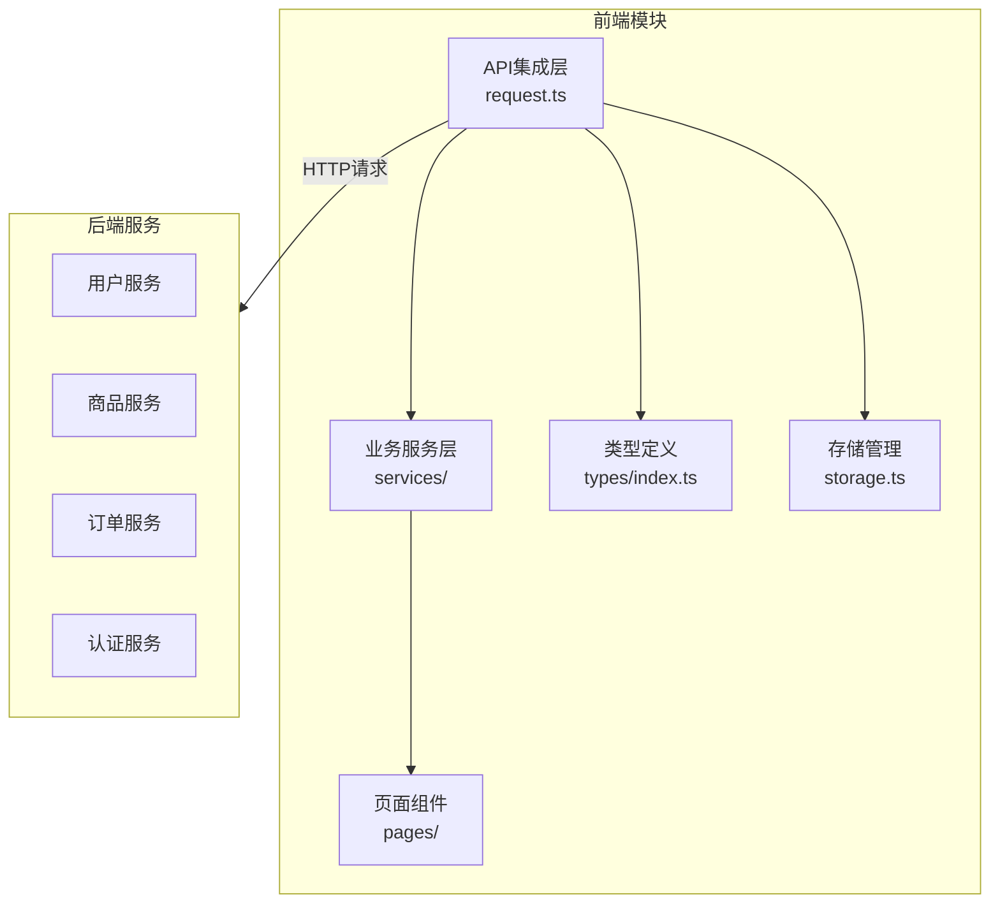
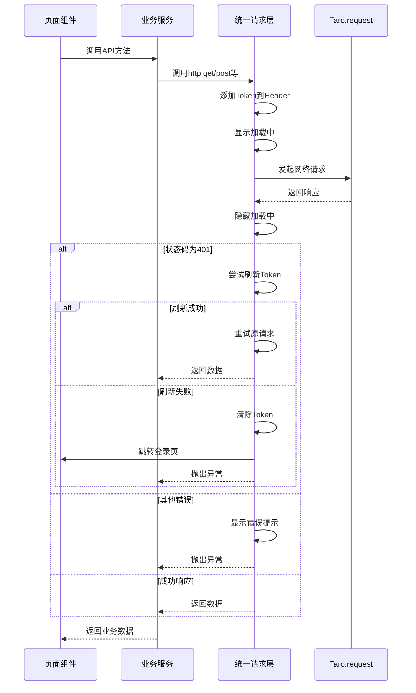
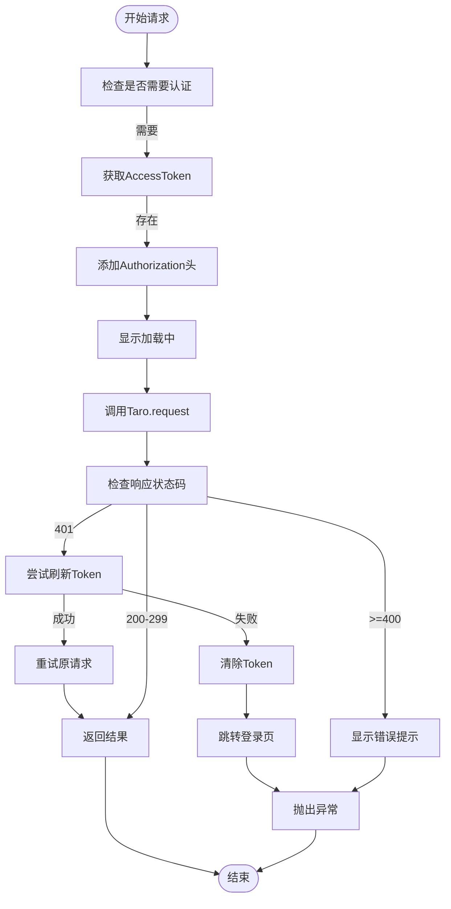
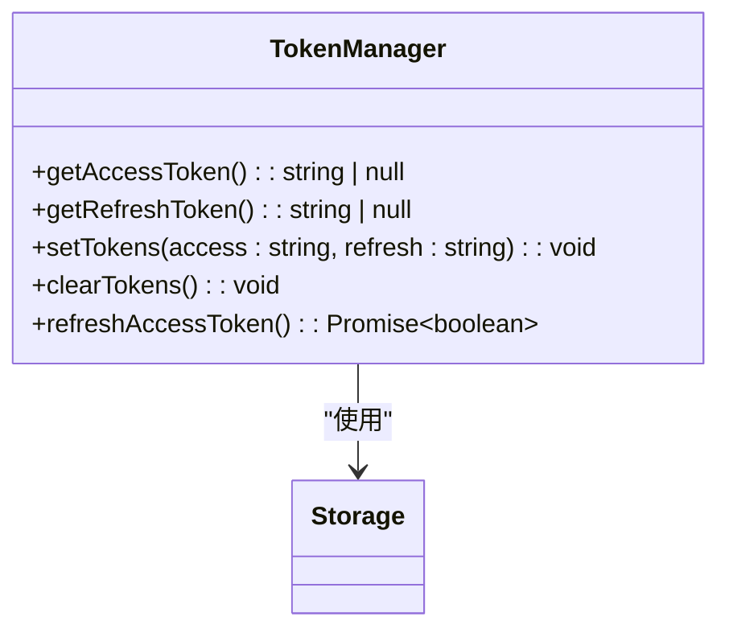
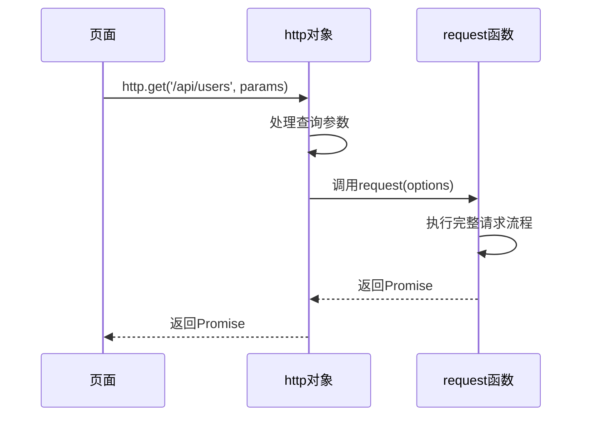
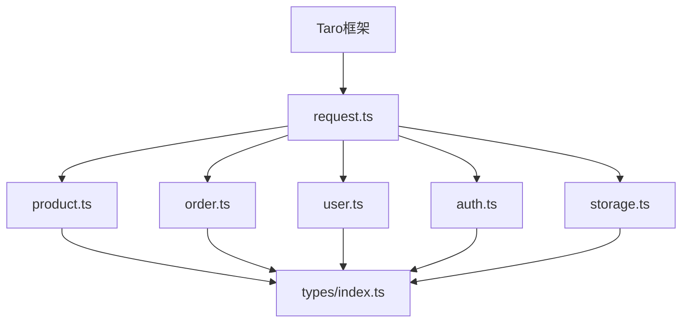

# API集成层

<cite>
**本文档引用的文件**  
- [request.ts](file://frontend/src/utils/request.ts)
- [storage.ts](file://frontend/src/utils/storage.ts)
- [auth.ts](file://frontend/src/services/auth.ts)
- [user.ts](file://frontend/src/services/user.ts)
- [product.ts](file://frontend/src/services/product.ts)
- [order.ts](file://frontend/src/services/order.ts)
- [category.ts](file://frontend/src/services/category.ts)
- [index.ts](file://frontend/src/types/index.ts)
- [home/index.tsx](file://frontend/src/pages/home/index.tsx)
- [order-list/index.tsx](file://frontend/src/pages/order-list/index.tsx)
- [api.md](file://api.md)
</cite>

## 目录
1. [简介](#简介)
2. [项目结构](#项目结构)
3. [核心组件](#核心组件)
4. [架构概述](#架构概述)
5. [详细组件分析](#详细组件分析)
6. [依赖分析](#依赖分析)
7. [性能考虑](#性能考虑)
8. [故障排除指南](#故障排除指南)
9. [结论](#结论)

## 简介
本项目为一个电商类小程序，包含前端用户端、商户管理后台和后端服务。API集成层主要位于前端项目中，通过统一的请求封装机制实现与后端API的通信。该机制基于Taro框架的网络请求能力，提供了Token管理、自动刷新、错误处理、加载状态控制等核心功能，为各业务模块提供了一致且可靠的API调用接口。

## 项目结构
前端项目采用模块化设计，API集成层位于`src/utils/request.ts`，通过`http`对象提供便捷的HTTP方法。各业务服务（用户、商品、订单等）在`src/services/`目录下封装具体的API调用。类型定义统一在`src/types/index.ts`中管理。请求过程中结合了本地存储（Storage）进行缓存优化，提升了用户体验和性能。



**图源**
- [request.ts](file://frontend/src/utils/request.ts)
- [product.ts](file://frontend/src/services/product.ts)
- [order.ts](file://frontend/src/services/order.ts)

**本节来源**
- [request.ts](file://frontend/src/utils/request.ts)
- [product.ts](file://frontend/src/services/product.ts)
- [order.ts](file://frontend/src/services/order.ts)

## 核心组件
API集成层的核心是`request.ts`文件中的统一请求封装机制。它通过`request`函数处理所有HTTP请求，内置了Token认证、401错误处理、自动刷新令牌、加载状态管理和网络异常处理。`TokenManager`对象负责JWT令牌的存储、刷新和清除。`http`对象提供了`get`、`post`等便捷方法，简化了API调用。各业务服务模块基于此封装，构建了具体的API调用方法。

**本节来源**
- [request.ts](file://frontend/src/utils/request.ts#L1-L162)
- [storage.ts](file://frontend/src/utils/storage.ts#L1-L45)

## 架构概述
API集成层采用分层架构，上层为业务服务模块，中层为统一请求封装，底层为Taro框架的网络API。请求流程包括：参数处理、Token注入、发起请求、响应处理、错误处理和结果返回。对于401未授权错误，会自动尝试刷新令牌并重试原请求，实现了无感刷新。整个架构设计注重可维护性、一致性和用户体验。



**图源**
- [request.ts](file://frontend/src/utils/request.ts#L62-L133)
- [auth.ts](file://frontend/src/services/auth.ts#L1-L22)

**本节来源**
- [request.ts](file://frontend/src/utils/request.ts#L1-L162)

## 详细组件分析

### 统一请求封装分析
`request.ts`文件实现了完整的请求封装机制，包括请求拦截、响应处理和错误管理。

#### 请求封装核心逻辑


**图源**
- [request.ts](file://frontend/src/utils/request.ts#L62-L133)

**本节来源**
- [request.ts](file://frontend/src/utils/request.ts#L1-L162)

### Token管理机制分析
`TokenManager`对象实现了JWT令牌的完整生命周期管理。

#### TokenManager类图


**图源**
- [request.ts](file://frontend/src/utils/request.ts#L20-L58)
- [storage.ts](file://frontend/src/utils/storage.ts#L4-L37)

**本节来源**
- [request.ts](file://frontend/src/utils/request.ts#L20-L58)

### 便捷方法实现原理
`http`对象提供了`get`、`post`等便捷方法，简化了API调用。

#### 便捷方法调用流程


**图源**
- [request.ts](file://frontend/src/utils/request.ts#L136-L161)

**本节来源**
- [request.ts](file://frontend/src/utils/request.ts#L136-L161)

### 业务服务模块集成
各业务模块基于统一请求层构建具体的API调用方法。

#### 业务服务调用示例
```mermaid
classDiagram
class productService {
+getProducts(params) : Promise~ProductListResponse~
+getProductDetail(id) : Promise~Product~
+getCategories() : Promise~Category[]~
+getBrands() : Promise~Brand[]~
}
class orderService {
+createOrder(data) : Promise~CreateOrderResponse~
+getMyOrders(params) : Promise~PaginatedResponse~Order~~
+getOrderDetail(id) : Promise~Order~
+cancelOrder(id) : Promise~Order~
}
class userService {
+getProfile() : Promise~User~
+updateProfile(data) : Promise~User~
+getStatistics() : Promise~{orders_count : number}~
}
productService --> http : "使用"
orderService --> http : "使用"
userService --> http : "使用"
http --> request : "使用"
```

**图源**
- [product.ts](file://frontend/src/services/product.ts#L1-L64)
- [order.ts](file://frontend/src/services/order.ts#L1-L47)
- [user.ts](file://frontend/src/services/user.ts#L1-L20)

**本节来源**
- [product.ts](file://frontend/src/services/product.ts#L1-L64)
- [order.ts](file://frontend/src/services/order.ts#L1-L47)
- [user.ts](file://frontend/src/services/user.ts#L1-L20)

## 依赖分析
API集成层依赖于Taro框架的核心模块（@tarojs/taro），用于网络请求和本地存储。各业务服务模块依赖于统一请求层和类型定义。请求层本身依赖于Taro的存储API进行Token管理。整个依赖关系清晰，层次分明，便于维护和测试。



**图源**
- [request.ts](file://frontend/src/utils/request.ts)
- [product.ts](file://frontend/src/services/product.ts)
- [order.ts](file://frontend/src/services/order.ts)
- [user.ts](file://frontend/src/services/user.ts)
- [storage.ts](file://frontend/src/utils/storage.ts)

**本节来源**
- [request.ts](file://frontend/src/utils/request.ts)
- [product.ts](file://frontend/src/services/product.ts)
- [order.ts](file://frontend/src/services/order.ts)
- [user.ts](file://frontend/src/services/user.ts)
- [storage.ts](file://frontend/src/utils/storage.ts)

## 性能考虑
API集成层在性能方面做了多项优化。通过`Storage`工具类实现了数据缓存，避免了重复请求。在`home`页面中，分类和品牌数据被缓存24小时，显著减少了网络请求。请求过程中有加载状态提示，提升了用户体验。GET请求的参数处理考虑了undefined和null值的过滤，确保了URL的整洁性。错误处理机制避免了因网络问题导致的界面卡死。

**本节来源**
- [home/index.tsx](file://frontend/src/pages/home/index.tsx#L33-L44)
- [storage.ts](file://frontend/src/utils/storage.ts#L1-L37)
- [request.ts](file://frontend/src/utils/request.ts#L79-L92)

## 故障排除指南
开发者在使用API集成层时可能遇到的问题及解决方案：

1. **Token刷新失败**：检查`/token/refresh/`接口是否正常，确保`refresh_token`有效且未过期。
2. **请求401后未跳转登录**：确认`TokenManager.clearTokens()`执行正常，检查页面跳转逻辑。
3. **GET请求参数未正确编码**：确认`http.get`方法正确处理了特殊字符的编码。
4. **加载状态未正确隐藏**：检查`try-catch-finally`块确保`Taro.hideLoading()`总能执行。
5. **类型定义不匹配**：核对后端API响应结构与前端类型定义的一致性。

**本节来源**
- [request.ts](file://frontend/src/utils/request.ts#L94-L104)
- [home/index.tsx](file://frontend/src/pages/home/index.tsx#L82-L87)
- [order-list/index.tsx](file://frontend/src/pages/order-list/index.tsx#L59-L66)

## 结论
本项目的API集成层设计合理，功能完整。通过统一的请求封装，实现了认证管理、错误处理、加载状态控制等核心功能，为上层业务提供了稳定可靠的接口。Token自动刷新机制提升了用户体验，避免了频繁登录。各业务模块基于此封装，代码复用率高，维护成本低。建议未来可以增加请求缓存、批量请求等高级功能，进一步优化性能。