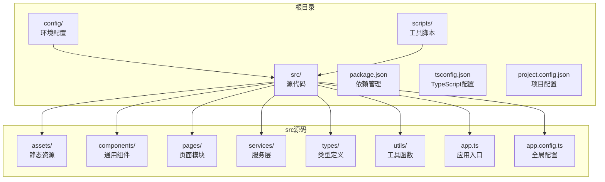
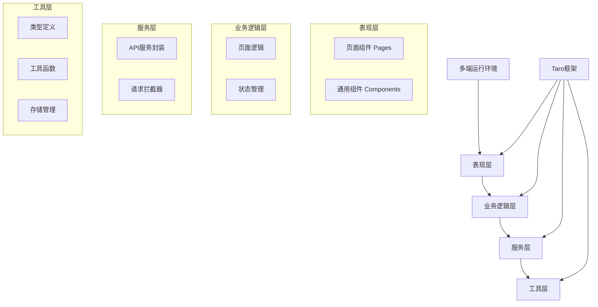
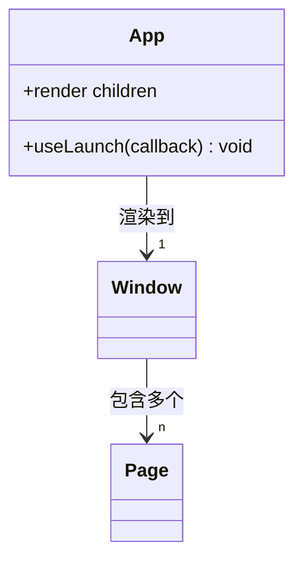
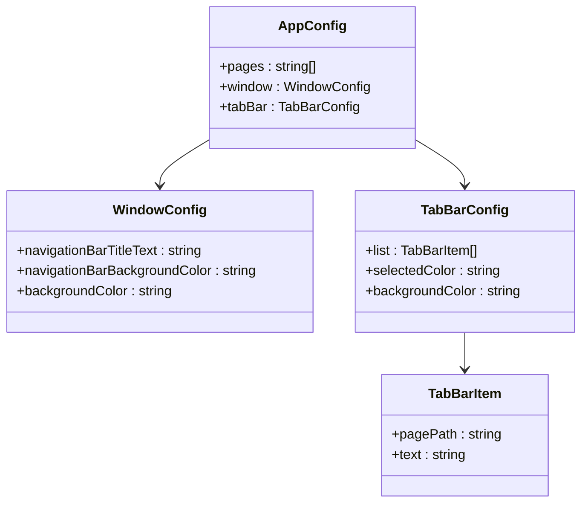
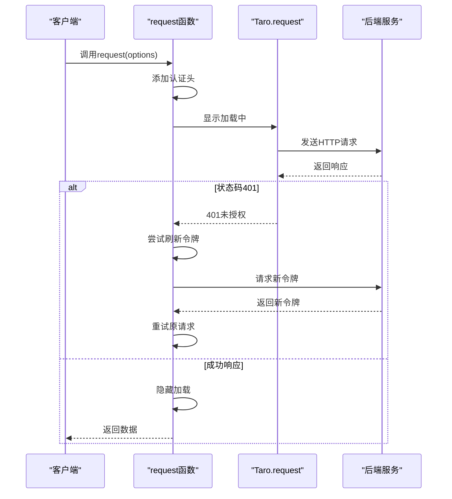
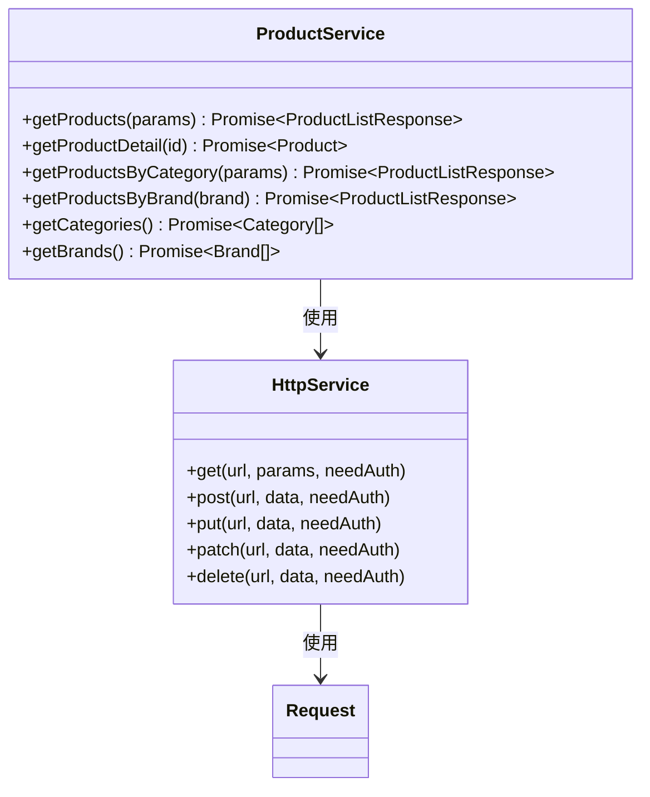
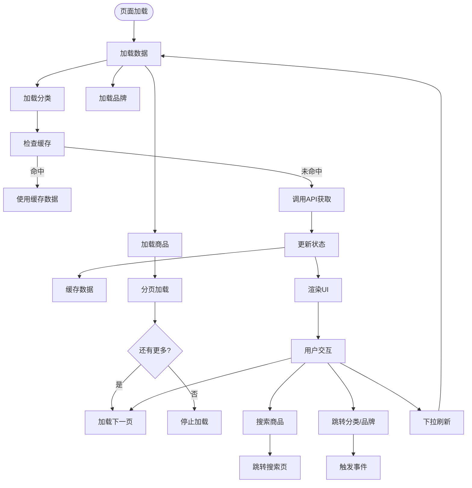
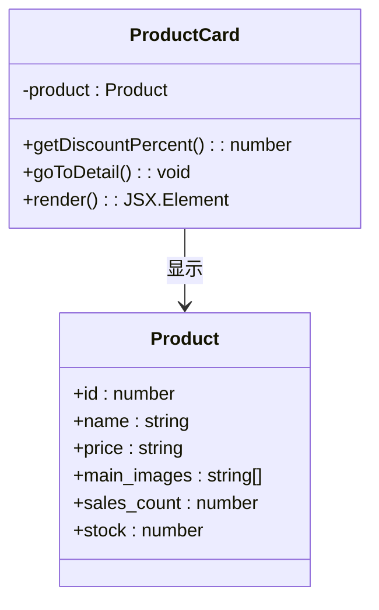
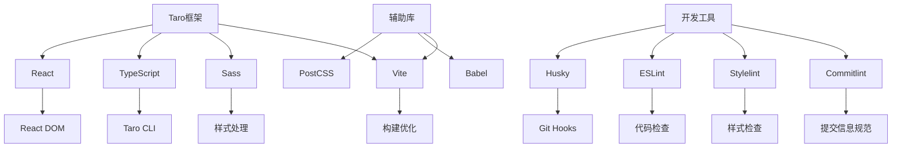

# 前端用户端概述

<cite>
**本文档引用的文件**
- [app.ts](file://frontend/src/app.ts)
- [app.config.ts](file://frontend/src/app.config.ts)
- [package.json](file://frontend/package.json)
- [tsconfig.json](file://frontend/tsconfig.json)
- [project.config.json](file://frontend/project.config.json)
- [request.ts](file://frontend/src/utils/request.ts)
- [product.ts](file://frontend/src/services/product.ts)
- [cart.ts](file://frontend/src/services/cart.ts)
- [index.ts](file://frontend/src/types/index.ts)
- [home/index.tsx](file://frontend/src/pages/home/index.tsx)
- [ProductCard/index.tsx](file://frontend/src/components/ProductCard/index.tsx)
- [index.ts](file://frontend/config/index.ts)
- [dev.ts](file://frontend/config/dev.ts)
- [prod.ts](file://frontend/config/prod.ts)
- [generate-placeholder-images.js](file://frontend/scripts/generate-placeholder-images.js)
</cite>

## 目录
1. [简介](#简介)
2. [项目结构](#项目结构)
3. [核心组件](#核心组件)
4. [架构概述](#架构概述)
5. [详细组件分析](#详细组件分析)
6. [依赖分析](#依赖分析)
7. [性能考虑](#性能考虑)
8. [故障排除指南](#故障排除指南)
9. [结论](#结论)

## 简介
本文档全面介绍了家电商城小程序前端的技术架构和功能实现。该前端基于 Taro 框架构建，支持微信小程序、支付宝小程序和 H5 多端运行。系统采用 React 和 TypeScript 技术栈，实现了组件化开发模式和跨平台兼容性。文档将深入解析项目结构、路由配置、服务层封装、状态管理以及构建流程中的高级特性，为开发者提供从入门到精通的完整技术视图。

## 项目结构

家电商城前端采用标准的 Taro 项目结构，组织清晰且模块化程度高。项目根目录包含配置文件、脚本工具和源代码目录，其中 `src` 目录是主要的开发区域。

**图示来源**
- [project.config.json](file://frontend/project.config.json#L1-L40)
- [tsconfig.json](file://frontend/tsconfig.json#L1-L31)

**本节来源**
- [frontend/project.config.json](file://frontend/project.config.json#L1-L40)
- [frontend/tsconfig.json](file://frontend/tsconfig.json#L1-L31)

## 核心组件

前端系统的核心组件包括应用入口、全局配置、服务层封装和类型定义。`app.ts` 作为应用的根组件，负责初始化应用生命周期；`app.config.ts` 定义了页面路由和全局窗口样式；`services` 目录下的模块封装了所有 API 调用；`types/index.ts` 提供了统一的类型定义，确保类型安全。

**本节来源**
- [frontend/src/app.ts](file://frontend/src/app.ts#L1-L18)
- [frontend/src/app.config.ts](file://frontend/src/app.config.ts#L1-L50)
- [frontend/src/types/index.ts](file://frontend/src/types/index.ts#L1-L144)
- [frontend/src/services/product.ts](file://frontend/src/services/product.ts#L1-L64)

## 架构概述

家电商城前端采用分层架构设计，各层职责分明，耦合度低。整体架构分为表现层、业务逻辑层、服务层和工具层，通过 Taro 框架实现多端适配。

**图示来源**
- [frontend/src/app.ts](file://frontend/src/app.ts#L1-L18)
- [frontend/src/app.config.ts](file://frontend/src/app.config.ts#L1-L50)
- [frontend/src/utils/request.ts](file://frontend/src/utils/request.ts#L1-L162)

## 详细组件分析

### 应用入口与配置分析

#### 应用入口实现
应用入口 `app.ts` 采用函数式组件形式，通过 Taro 的 `useLaunch` 钩子监听应用启动事件。组件接收 `children` 属性并直接渲染，这是 Taro 应用的标准模式。

**图示来源**
- [frontend/src/app.ts](file://frontend/src/app.ts#L1-L18)

#### 全局配置分析
`app.config.ts` 文件定义了应用的全局配置，包括页面路由、窗口样式和底部导航栏。页面列表按照功能模块组织，底部导航栏配置了首页、分类、购物车和我的四个主要入口。

**图示来源**
- [frontend/src/app.config.ts](file://frontend/src/app.config.ts#L1-L50)

**本节来源**
- [frontend/src/app.ts](file://frontend/src/app.ts#L1-L18)
- [frontend/src/app.config.ts](file://frontend/src/app.config.ts#L1-L50)

### 服务层与工具函数分析

#### 请求服务封装
`request.ts` 文件实现了完整的 HTTP 请求封装，包含基础 URL 配置、认证令牌管理、请求拦截和错误处理。系统采用 Bearer Token 认证机制，并实现了自动刷新访问令牌的功能。

**图示来源**
- [frontend/src/utils/request.ts](file://frontend/src/utils/request.ts#L1-L162)

#### 产品服务实现
`product.ts` 文件封装了商品相关的所有 API 调用，通过 `http` 工具类提供简洁的接口。服务层与类型系统紧密结合，确保类型安全。

**图示来源**
- [frontend/src/services/product.ts](file://frontend/src/services/product.ts#L1-L64)
- [frontend/src/utils/request.ts](file://frontend/src/utils/request.ts#L136-L161)

**本节来源**
- [frontend/src/utils/request.ts](file://frontend/src/utils/request.ts#L1-L162)
- [frontend/src/services/product.ts](file://frontend/src/services/product.ts#L1-L64)
- [frontend/src/services/cart.ts](file://frontend/src/services/cart.ts#L1-L45)

### 页面与组件分析

#### 首页实现分析
`home/index.tsx` 实现了商城首页，包含搜索栏、轮播图、分类导航、品牌专区和商品列表等模块。页面采用函数式组件和 Hooks 实现状态管理。

**图示来源**
- [frontend/src/pages/home/index.tsx](file://frontend/src/pages/home/index.tsx#L1-L200)

#### 商品卡片组件
`ProductCard` 组件实现了商品展示卡片，包含图片、名称、价格和销量等信息。组件具有良好的可复用性和响应式设计。

**图示来源**
- [frontend/src/components/ProductCard/index.tsx](file://frontend/src/components/ProductCard/index.tsx#L1-L85)
- [frontend/src/types/index.ts](file://frontend/src/types/index.ts#L20-L40)

**本节来源**
- [frontend/src/pages/home/index.tsx](file://frontend/src/pages/home/index.tsx#L1-L200)
- [frontend/src/components/ProductCard/index.tsx](file://frontend/src/components/ProductCard/index.tsx#L1-L85)

## 依赖分析

前端项目的依赖关系清晰，通过 `package.json` 进行统一管理。项目依赖主要分为核心框架、开发工具和辅助库三类。

**图示来源**
- [frontend/package.json](file://frontend/package.json#L1-L88)

**本节来源**
- [frontend/package.json](file://frontend/package.json#L1-L88)
- [frontend/.eslintrc](file://frontend/.eslintrc)
- [frontend/stylelint.config.mjs](file://frontend/stylelint.config.mjs)
- [frontend/commitlint.config.mjs](file://frontend/commitlint.config.mjs)

## 性能考虑

项目在性能优化方面采取了多项措施，包括代码分割、懒加载、数据缓存和资源优化。通过 Taro 的配置系统，可以针对不同环境进行优化设置。

在生产环境中，H5 端可以启用预渲染插件来提升首屏加载速度，同时支持使用打包分析工具来优化体积。服务层实现了数据缓存机制，减少重复的网络请求，提升用户体验。

**本节来源**
- [frontend/config/prod.ts](file://frontend/config/prod.ts#L1-L34)
- [frontend/src/utils/storage.ts](file://frontend/src/utils/storage.ts)
- [frontend/src/pages/home/index.tsx](file://frontend/src/pages/home/index.tsx#L35-L38)

## 故障排除指南

### 常见问题及解决方案

#### 环境配置问题
当开发环境与生产环境行为不一致时，检查 `config/index.ts` 中的环境判断逻辑。确保 `dev.ts` 和 `prod.ts` 配置正确加载。

**本节来源**
- [frontend/config/index.ts](file://frontend/config/index.ts#L84-L89)
- [frontend/config/dev.ts](file://frontend/config/dev.ts#L1-L8)
- [frontend/config/prod.ts](file://frontend/config/prod.ts#L1-L34)

#### 请求认证问题
当出现 401 错误且无法自动刷新令牌时，检查 `request.ts` 中的令牌管理逻辑。确保 `refreshAccessToken` 方法正确实现，并验证后端接口的兼容性。

**本节来源**
- [frontend/src/utils/request.ts](file://frontend/src/utils/request.ts#L39-L58)
- [frontend/src/utils/request.ts](file://frontend/src/utils/request.ts#L94-L105)

#### 构建失败问题
当多端构建失败时，检查 `package.json` 中的构建脚本。确保目标平台的插件已正确安装，并验证 `project.config.json` 中的配置。

**本节来源**
- [frontend/package.json](file://frontend/package.json#L13-L32)
- [frontend/project.config.json](file://frontend/project.config.json#L1-L40)

## 结论

家电商城小程序前端是一个结构良好、功能完整的跨端应用。通过 Taro 框架实现了微信小程序、支付宝小程序和 H5 的多端统一开发，采用 React 和 TypeScript 技术栈确保了代码质量和开发效率。项目具有清晰的分层架构、完善的类型系统、健壮的错误处理机制和丰富的开发工具支持。

系统亮点包括：基于 Sass 的样式策略、Taro 内置的状态管理、完整的请求拦截器实现、多环境配置支持、Husky 代码校验和占位图片生成脚本。这些特性共同构成了一个现代化、可维护的前端应用，既适合初学者学习，也能满足经验丰富的开发者的需求。