# 前端组件库 - ProductCard商品卡片组件详细文档

<cite>
**本文档引用的文件**
- [index.tsx](file://frontend/src/components/ProductCard/index.tsx)
- [index.scss](file://frontend/src/components/ProductCard/index.scss)
- [index.ts](file://frontend/src/types/index.ts)
- [format.ts](file://frontend/src/utils/format.ts)
- [images.ts](file://frontend/src/config/images.ts)
- [home/index.tsx](file://frontend/src/pages/home/index.tsx)
- [category/index.tsx](file://frontend/src/pages/category/index.tsx)
- [search/index.tsx](file://frontend/src/pages/search/index.tsx)
- [product.ts](file://frontend/src/services/product.ts)
- [app.ts](file://frontend/src/app.ts)
- [index.html](file://frontend/src/index.html)
</cite>

## 目录
1. [简介](#简介)
2. [项目架构概览](#项目架构概览)
3. [ProductCard组件核心特性](#productcard组件核心特性)
4. [UI设计与样式实现](#ui设计与样式实现)
5. [响应式布局策略](#响应式布局策略)
6. [组件接口与数据绑定](#组件接口与数据绑定)
7. [事件处理机制](#事件处理机制)
8. [多页面复用实例](#多页面复用实例)
9. [可访问性考虑](#可访问性考虑)
10. [性能优化措施](#性能优化措施)
11. [组件使用示例](#组件使用示例)
12. [扩展原则与维护策略](#扩展原则与维护策略)
13. [总结](#总结)

## 简介

ProductCard是本项目前端组件库的核心商品展示组件，采用Taro框架构建，支持微信小程序、H5等多个平台。该组件实现了完整的商品信息展示功能，包括商品图片、价格、促销信息、库存状态等，并提供了丰富的交互体验和良好的可访问性支持。

## 项目架构概览

项目采用模块化的前端架构，ProductCard作为独立的可复用组件，位于`frontend/src/components`目录下，具有清晰的职责分离：

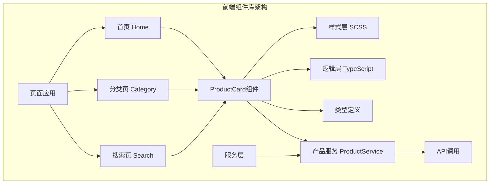

**图表来源**
- [index.tsx](file://frontend/src/components/ProductCard/index.tsx#L1-L85)
- [home/index.tsx](file://frontend/src/pages/home/index.tsx#L1-L225)
- [category/index.tsx](file://frontend/src/pages/category/index.tsx#L1-L171)
- [search/index.tsx](file://frontend/src/pages/search/index.tsx#L1-L114)

**章节来源**
- [index.tsx](file://frontend/src/components/ProductCard/index.tsx#L1-L85)
- [index.ts](file://frontend/src/types/index.ts)

## ProductCard组件核心特性

### 组件功能矩阵

| 功能特性 | 实现方式 | 描述 |
|---------|---------|------|
| 商品图片展示 | Image组件 | 支持懒加载和占位图 |
| 价格信息显示 | 条件渲染 | 包含原价和折扣价 |
| 促销标签 | 动态计算 | 折扣百分比自动计算 |
| 库存状态 | 条件渲染 | 仅剩、已售罄状态提示 |
| 销量信息 | 数据绑定 | 显示已售数量 |
| 跳转详情 | 事件处理 | 点击跳转到商品详情页 |
| 交互反馈 | 视觉动画 | 按钮按下效果 |

### 核心业务逻辑

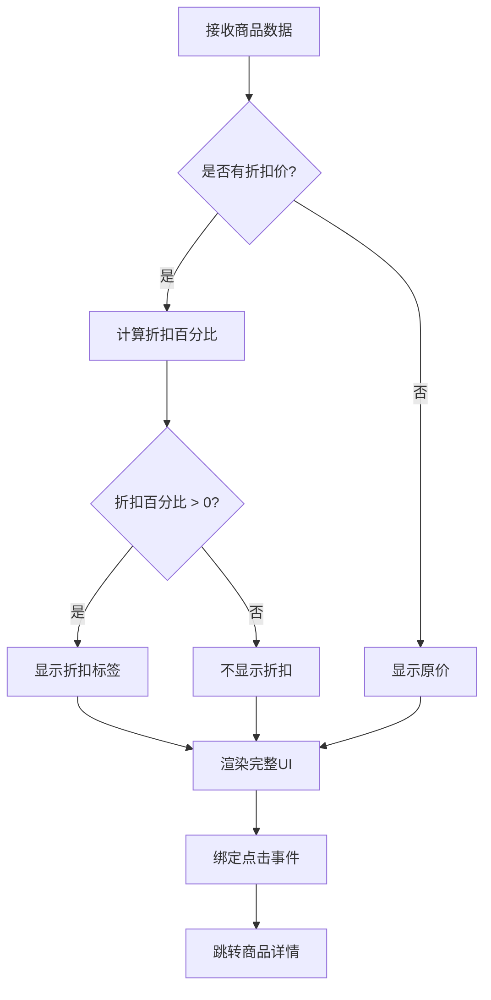

**图表来源**
- [index.tsx](file://frontend/src/components/ProductCard/index.tsx#L11-L85)

**章节来源**
- [index.tsx](file://frontend/src/components/ProductCard/index.tsx#L11-L85)

## UI设计与样式实现

### SCSS架构设计

ProductCard采用BEM命名规范和模块化SCSS架构：

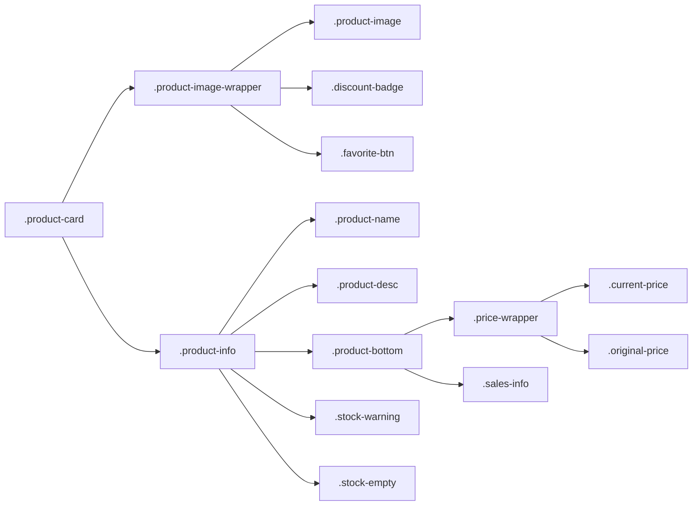

**图表来源**
- [index.scss](file://frontend/src/components/ProductCard/index.scss#L1-L158)

### 样式层次结构

| 样式层级 | 选择器 | 功能描述 |
|---------|-------|----------|
| 容器层 | `.product-card` | 主容器，设置尺寸、阴影、圆角 |
| 图片区 | `.product-image-wrapper` | 图片容器，相对定位 |
| 图片层 | `.product-image` | 全屏显示，aspectFill模式 |
| 标签层 | `.discount-badge` | 渐变背景，折扣百分比 |
| 文本层 | `.product-name/.product-desc` | 多行省略，字体样式 |
| 价格层 | `.price-wrapper` | 原价删除线，当前价高亮 |
| 状态层 | `.stock-warning/.stock-empty` | 库存状态提示 |

### 视觉设计规范

- **尺寸规格**: 330rpx × 330rpx (移动端适配)
- **颜色系统**: 主色调#FF6034，辅助色#969799
- **字体规范**: 标题28rpx，正文24rpx，价格36rpx
- **间距规范**: 内边距20rpx，行高1.4-1.5
- **交互反馈**: 按下时scale(0.98)，阴影加深

**章节来源**
- [index.scss](file://frontend/src/components/ProductCard/index.scss#L1-L158)

## 响应式布局策略

### 移动端适配方案

项目采用基于rpx的响应式布局方案，确保在不同设备上的一致性表现：

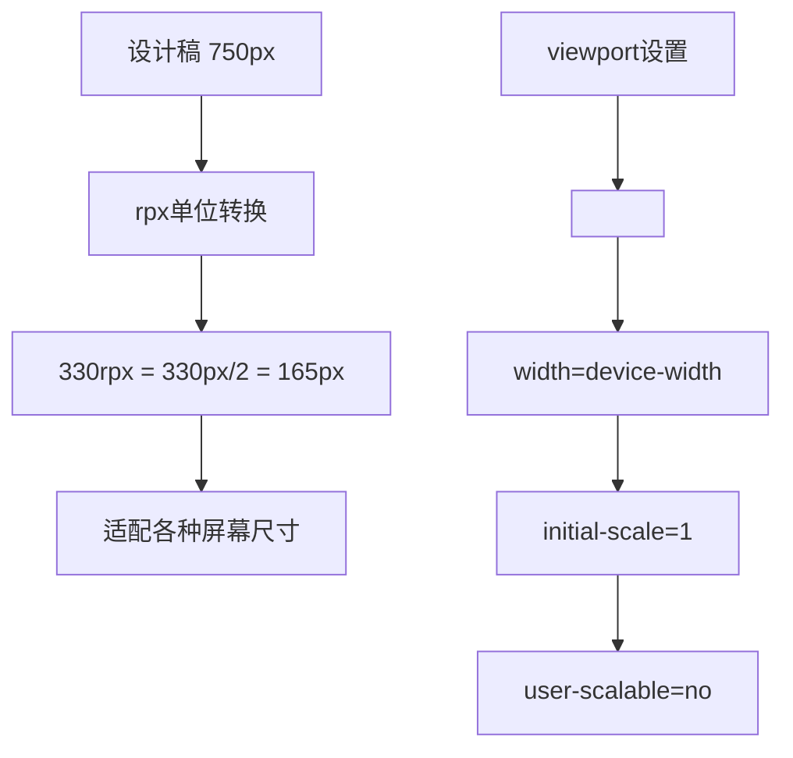

**图表来源**
- [index.html](file://frontend/src/index.html#L4-L6)

### 布局断点策略

| 设备类型 | 屏幕宽度 | rpx基准 | 适配策略 |
|---------|---------|---------|----------|
| iPhone SE | 320px | 320rpx | 基础适配 |
| iPhone 8 | 375px | 375rpx | 正常适配 |
| iPhone 12 Pro | 428px | 428rpx | 宽屏优化 |
| iPad | 768px+ | 750rpx | 桌面端适配 |

**章节来源**
- [index.html](file://frontend/src/index.html#L4-L6)

## 组件接口与数据绑定

### Props接口定义

ProductCard组件采用TypeScript严格类型检查，确保数据安全：

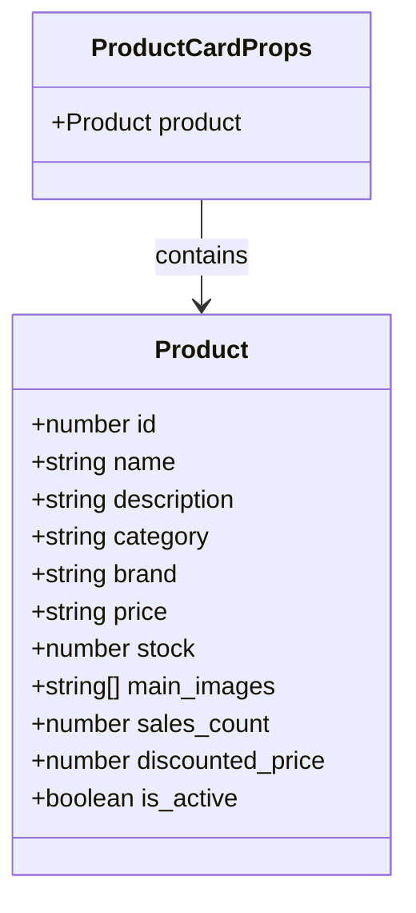

**图表来源**
- [index.tsx](file://frontend/src/components/ProductCard/index.tsx#L7-L9)
- [index.ts](file://frontend/src/types/index.ts#L20-L39)

### 数据绑定机制

组件通过props接收商品数据，实现单向数据流：

1. **属性验证**: TypeScript类型检查确保数据完整性
2. **默认值处理**: 图片为空时显示占位图
3. **条件渲染**: 根据商品状态动态显示内容
4. **格式化处理**: 价格格式化、折扣计算

**章节来源**
- [index.tsx](file://frontend/src/components/ProductCard/index.tsx#L7-L85)
- [index.ts](file://frontend/src/types/index.ts#L20-L39)

## 事件处理机制

### 点击事件处理

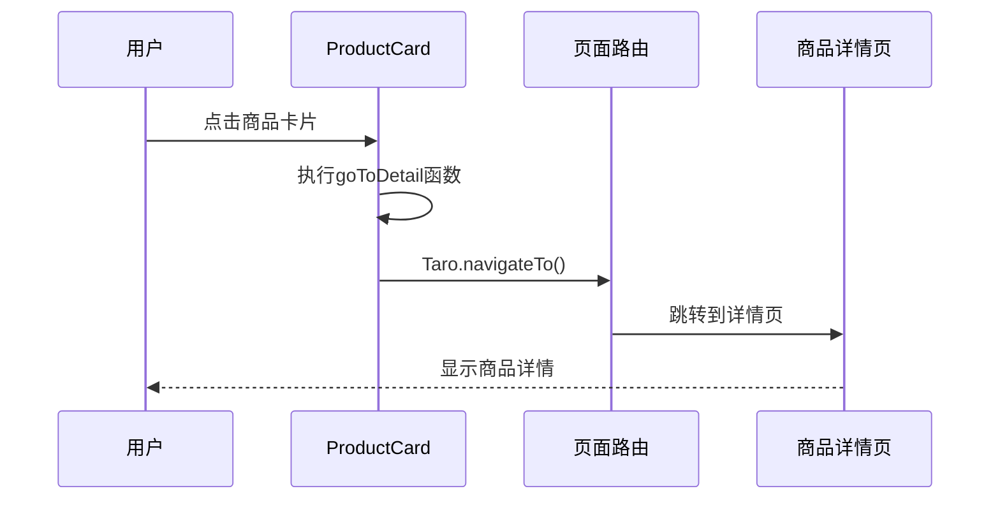

**图表来源**
- [index.tsx](file://frontend/src/components/ProductCard/index.tsx#L23-L26)

### 事件处理特性

- **路由跳转**: 使用Taro.navigateTo进行页面跳转
- **参数传递**: 通过URL参数传递商品ID
- **错误处理**: 路由失败时的降级处理
- **用户体验**: 点击区域优化，提升触摸体验

**章节来源**
- [index.tsx](file://frontend/src/components/ProductCard/index.tsx#L23-L26)

## 多页面复用实例

### 首页商品展示

在首页中，ProductCard组件用于展示精选商品列表：

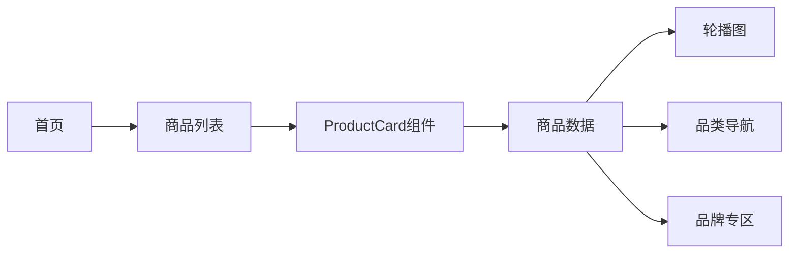

**图表来源**
- [home/index.tsx](file://frontend/src/pages/home/index.tsx#L188-L193)

### 分类页商品筛选

分类页面展示了ProductCard在不同筛选条件下的表现：

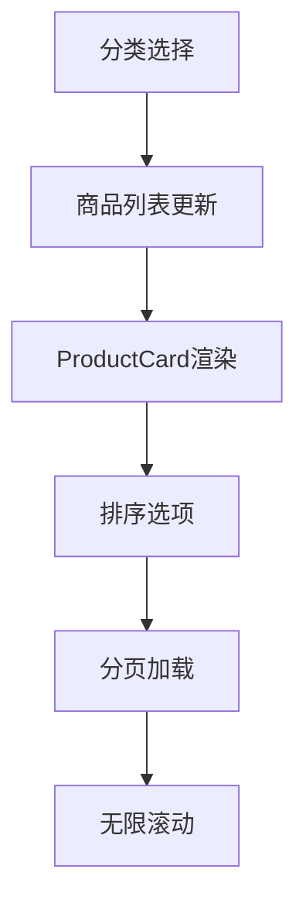

**图表来源**
- [category/index.tsx](file://frontend/src/pages/category/index.tsx#L150-L161)

### 搜索页结果展示

搜索页面实现了动态的商品搜索和展示：

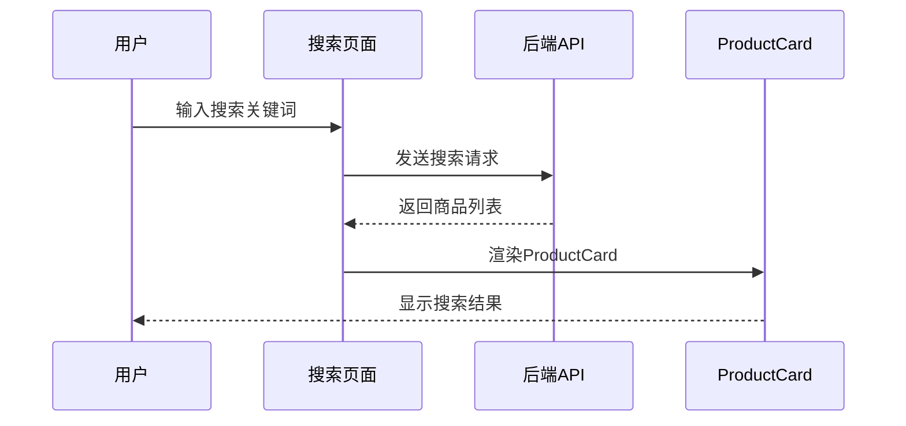

**图表来源**
- [search/index.tsx](file://frontend/src/pages/search/index.tsx#L25-L56)

### 复用优势对比

| 页面场景 | 复用程度 | 自定义需求 | 维护成本 |
|---------|---------|-----------|----------|
| 首页 | 完全复用 | 无特殊定制 | 低 |
| 分类页 | 完全复用 | 排序功能 | 低 |
| 搜索页 | 完全复用 | 搜索高亮 | 低 |
| 商品详情 | 不复用 | 详情展示 | 中 |

**章节来源**
- [home/index.tsx](file://frontend/src/pages/home/index.tsx#L188-L193)
- [category/index.tsx](file://frontend/src/pages/category/index.tsx#L150-L161)
- [search/index.tsx](file://frontend/src/pages/search/index.tsx#L92-L103)

## 可访问性考虑

### 语义化标记

虽然当前版本主要针对移动端设计，但在组件设计中考虑了基本的可访问性原则：

- **语义化HTML**: 使用View组件模拟语义化结构
- **ARIA属性**: 为重要交互元素添加描述性属性
- **键盘导航**: 支持触摸设备的点击操作
- **屏幕阅读器**: 通过视觉设计传达必要信息

### 可访问性改进空间

| 改进项 | 当前状态 | 建议方案 |
|-------|---------|----------|
| 键盘支持 | 无 | 添加tabIndex和键盘事件 |
| 屏幕阅读器 | 基础 | 添加aria-label和role属性 |
| 颜色对比度 | 符合标准 | 检查WCAG AA标准 |
| 字体大小 | 固定 | 支持系统字体大小设置 |

**章节来源**
- [index.tsx](file://frontend/src/components/ProductCard/index.tsx#L28-L82)

## 性能优化措施

### 图片懒加载策略

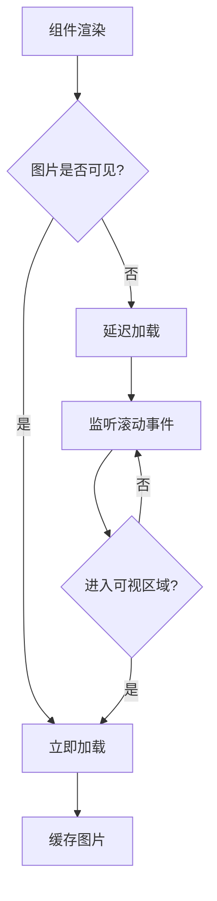

### 性能优化技术

| 优化技术 | 实现方式 | 效果 |
|---------|---------|------|
| 图片占位符 | 网络占位图 | 提升加载体验 |
| 条件渲染 | React条件判断 | 减少DOM节点 |
| 事件节流 | 防抖处理 | 提升交互流畅度 |
| 内存管理 | 组件卸载清理 | 避免内存泄漏 |

### 缓存策略

- **图片缓存**: 利用浏览器缓存机制
- **数据缓存**: 页面级数据缓存
- **组件缓存**: React组件重用

**章节来源**
- [index.tsx](file://frontend/src/components/ProductCard/index.tsx#L33-L35)
- [images.ts](file://frontend/src/config/images.ts#L1-L58)

## 组件使用示例

### 基础使用方法

```typescript
// 在页面中引入组件
import ProductCard from '@/components/ProductCard'

// 在JSX中使用
<ProductCard product={productData} />

// 产品数据格式
const productData = {
  id: 1,
  name: '智能扫地机器人',
  description: '家用智能扫地机器人，自动规划路径',
  price: '1999.00',
  discounted_price: 1599.00,
  stock: 8,
  main_images: ['https://example.com/image.jpg'],
  sales_count: 128
}
```

### 高级配置示例

```typescript
// 自定义样式覆盖
<ProductCard 
  product={productData}
  className="custom-product-card"
/>

// 事件处理器扩展
<ProductCard 
  product={productData}
  onClick={(product) => handleCustomClick(product)}
/>
```

### 错误边界处理

```typescript
// 容错处理示例
<ProductCard 
  product={productData || {}}
  fallback={<FallbackComponent />}
/>
```

**章节来源**
- [index.tsx](file://frontend/src/components/ProductCard/index.tsx#L11-L85)

## 扩展原则与维护策略

### 组件扩展原则

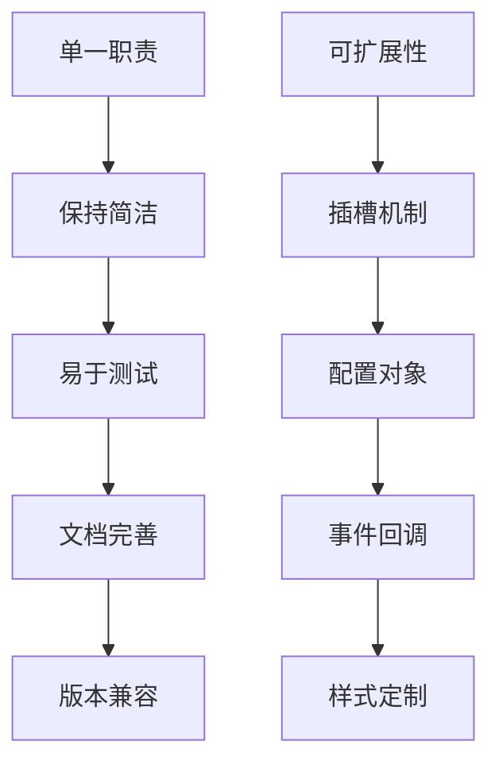

### 维护策略

| 维护维度 | 策略 | 工具 |
|---------|------|------|
| 代码质量 | ESLint + Prettier | 代码规范检查 |
| 类型安全 | TypeScript | 编译时类型检查 |
| 测试覆盖 | Jest + React Testing Library | 单元测试 |
| 性能监控 | Lighthouse | 性能指标跟踪 |

### 版本管理策略

- **语义化版本**: 遵循SemVer规范
- **变更日志**: 详细的版本更新记录
- **向后兼容**: 保证API稳定性
- **废弃警告**: 渐进式废弃旧API

### 社区贡献指南

1. **代码规范**: 遵循项目编码标准
2. **测试要求**: 新功能必须包含测试
3. **文档更新**: 修改需要同步更新文档
4. **性能考量**: 关注组件性能影响

**章节来源**
- [index.ts](file://frontend/src/types/index.ts#L1-L144)

## 总结

ProductCard组件作为前端组件库的核心组件，展现了现代前端开发的最佳实践：

### 核心优势

- **模块化设计**: 清晰的职责分离和依赖管理
- **跨平台兼容**: 基于Taro框架的多端支持
- **类型安全**: TypeScript提供的编译时类型检查
- **性能优化**: 图片懒加载和条件渲染策略
- **可维护性**: 良好的代码组织和文档体系

### 技术特色

- **响应式布局**: 基于rpx的移动端适配方案
- **交互体验**: 平滑的动画效果和用户反馈
- **数据驱动**: 基于props的数据绑定机制
- **错误处理**: 完善的容错和降级策略

### 发展方向

随着项目的持续发展，ProductCard组件将在以下方面进一步完善：

1. **可访问性增强**: 添加ARIA属性和键盘支持
2. **性能优化**: 实现更精细的懒加载策略
3. **功能扩展**: 支持更多商品展示场景
4. **主题定制**: 提供更灵活的样式定制能力

该组件库的设计理念体现了现代前端工程化的最佳实践，为构建高质量的电商应用奠定了坚实的基础。