# 页面结构

<cite>
**本文档引用的文件**
- [app.config.ts](file://frontend/src/app.config.ts)
- [home/index.tsx](file://frontend/src/pages/home/index.tsx)
- [category/index.tsx](file://frontend/src/pages/category/index.tsx)
- [cart/index.tsx](file://frontend/src/pages/cart/index.tsx)
- [profile/index.tsx](file://frontend/src/pages/profile/index.tsx)
- [order-confirm/index.tsx](file://frontend/src/pages/order-confirm/index.tsx)
- [order-detail/index.tsx](file://frontend/src/pages/order-detail/index.tsx)
- [address-list/index.tsx](file://frontend/src/pages/address-list/index.tsx)
- [search/index.tsx](file://frontend/src/pages/search/index.tsx)
- [brand/index.tsx](file://frontend/src/pages/brand/index.tsx)
</cite>

## 目录
1. [项目结构](#项目结构)
2. [页面路由与tabBar配置](#页面路由与tabbar配置)
3. [核心页面架构](#核心页面架构)
4. [订单相关页面](#订单相关页面)
5. [地址管理页面](#地址管理页面)
6. [品牌页与搜索页](#品牌页与搜索页)
7. [页面生命周期与状态管理](#页面生命周期与状态管理)
8. [页面导航机制](#页面导航机制)
9. [初学者页面创建指南](#初学者页面创建指南)
10. [性能优化建议](#性能优化建议)
11. [常见问题解决方案](#常见问题解决方案)

## 项目结构

家电商城小程序采用Taro框架构建，实现了多端兼容的页面架构。项目前端代码位于`frontend/src`目录下，主要包含`pages`、`components`、`services`、`utils`等核心目录。

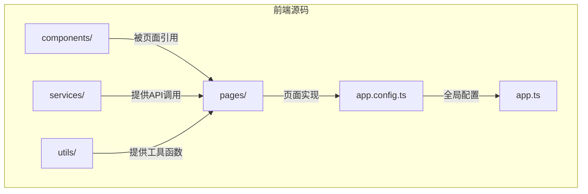

**Diagram sources**
- [app.config.ts](file://frontend/src/app.config.ts)
- [home/index.tsx](file://frontend/src/pages/home/index.tsx)

**Section sources**
- [app.config.ts](file://frontend/src/app.config.ts)
- [home/index.tsx](file://frontend/src/pages/home/index.tsx)

## 页面路由与tabBar配置

小程序的页面路由和tabBar导航结构在`app.config.ts`文件中定义，采用Taro框架的标准配置方式。

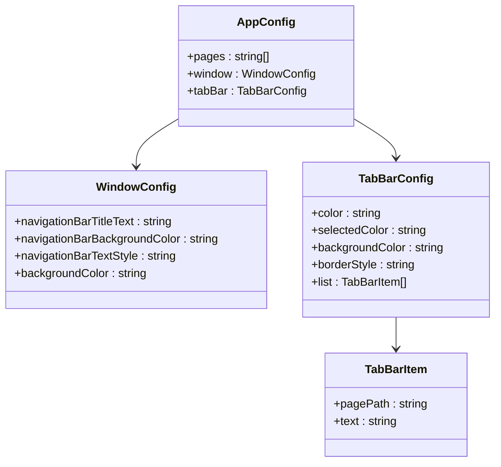

**Diagram sources**
- [app.config.ts](file://frontend/src/app.config.ts)

**Section sources**
- [app.config.ts](file://frontend/src/app.config.ts)

### 页面路由配置

`app.config.ts`中的`pages`数组定义了所有页面的路径，这些路径对应`src/pages`目录下的各个页面文件夹：

- `pages/home/index` - 首页
- `pages/category/index` - 分类页
- `pages/cart/index` - 购物车页
- `pages/profile/index` - 个人中心页
- `pages/product-detail/index` - 商品详情页
- `pages/order-list/index` - 订单列表页
- `pages/order-confirm/index` - 订单确认页
- `pages/order-detail/index` - 订单详情页
- `pages/address-list/index` - 地址列表页
- `pages/address-edit/index` - 地址编辑页
- `pages/profile-edit/index` - 个人资料编辑页
- `pages/search/index` - 搜索页
- `pages/brand/index` - 品牌页

### tabBar导航结构

tabBar配置定义了底部导航栏的四个主要入口：

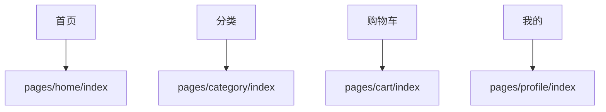

**Diagram sources**
- [app.config.ts](file://frontend/src/app.config.ts)

每个tabBar项对应一个页面路径和显示文本，选中状态的颜色为蓝色(`#1989FA`)，未选中状态为灰色(`#969799`)。

## 核心页面架构

### 首页

首页是用户进入小程序的第一个页面，承担着商品展示和导航的核心功能。

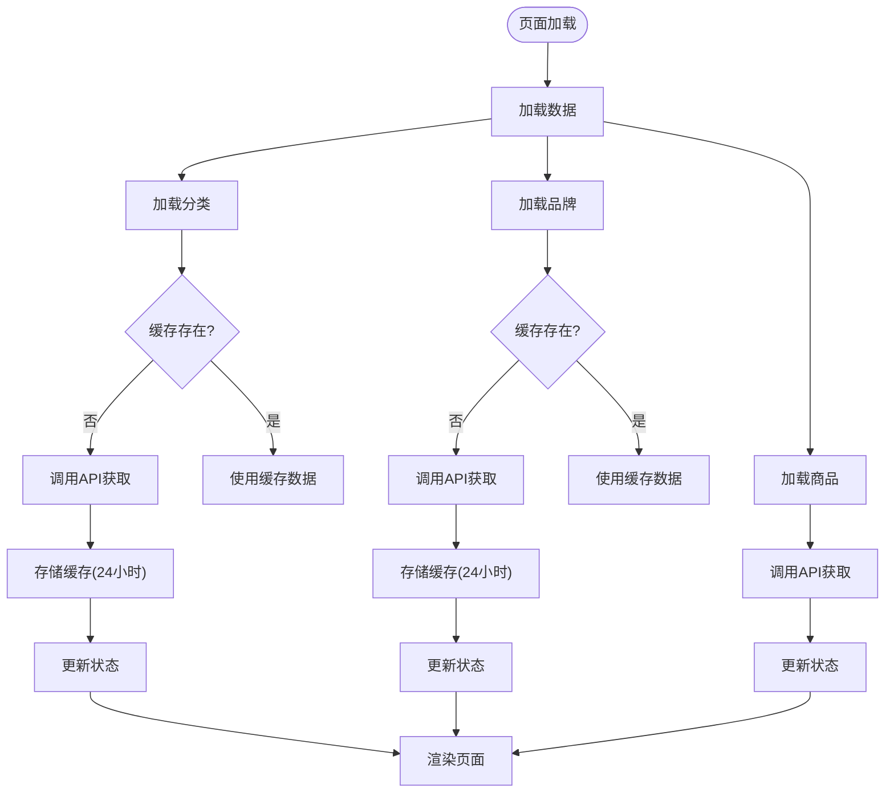

**Diagram sources**
- [home/index.tsx](file://frontend/src/pages/home/index.tsx)

**Section sources**
- [home/index.tsx](file://frontend/src/pages/home/index.tsx)

#### 首页布局设计

首页采用垂直滚动布局，包含以下主要区域：
1. **搜索栏**：位于顶部，提供商品搜索功能
2. **轮播图**：展示促销活动和推荐商品
3. **品类导航**：水平滚动展示商品分类
4. **品牌专区**：水平滚动展示合作品牌
5. **商品列表**：展示所有商品，支持分页加载

#### 首页功能实现

首页通过`useEffect`钩子在页面加载时并行加载分类、品牌和商品数据。为了提升性能，分类和品牌数据会进行本地缓存，有效期为24小时。

### 分类页

分类页采用经典的左右分栏布局，左侧为分类列表，右侧为商品展示。

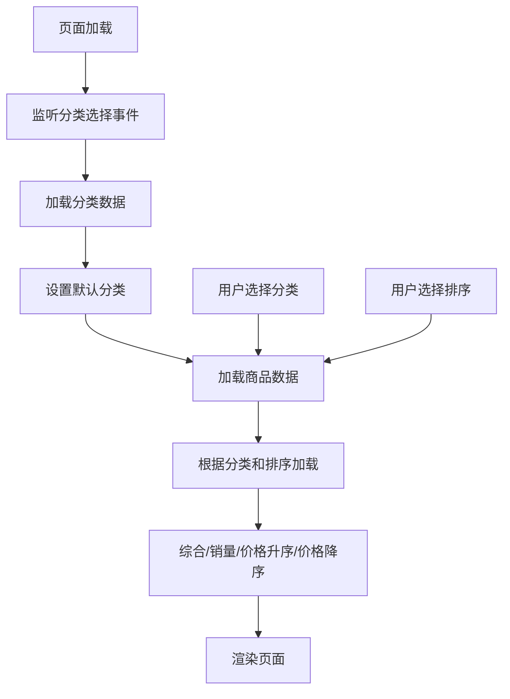

**Diagram sources**
- [category/index.tsx](file://frontend/src/pages/category/index.tsx)

**Section sources**
- [category/index.tsx](file://frontend/src/pages/category/index.tsx)

分类页通过Taro的事件中心(`Taro.eventCenter`)接收来自首页的分类选择事件，实现页面间的通信。

### 购物车页

购物车页管理用户的购物车状态，支持商品选择、数量调整和结算功能。

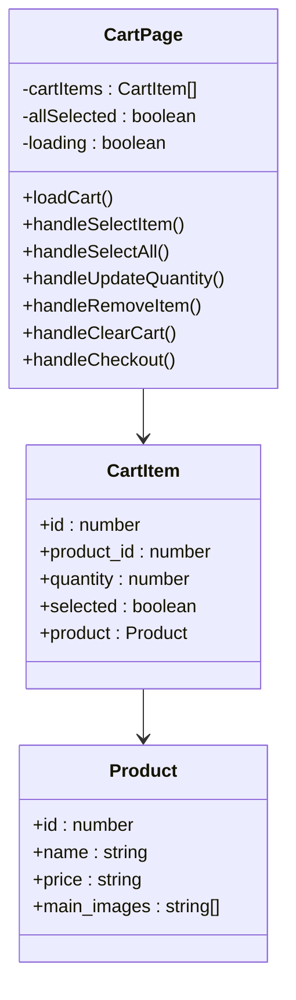

**Diagram sources**
- [cart/index.tsx](file://frontend/src/pages/cart/index.tsx)

**Section sources**
- [cart/index.tsx](file://frontend/src/pages/cart/index.tsx)

购物车页实现了复杂的商品状态管理，包括：
- 商品勾选状态保持
- 数量增减操作
- 单个商品删除
- 购物车清空
- 结算跳转

### 个人中心页

个人中心页是用户信息和订单管理的入口。

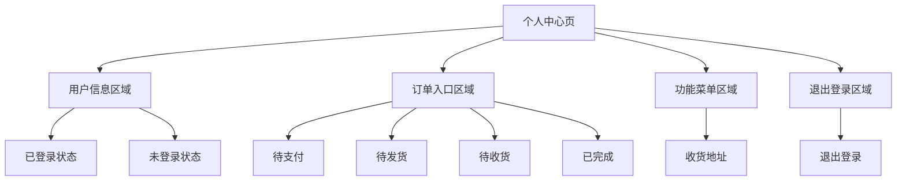

**Diagram sources**
- [profile/index.tsx](file://frontend/src/pages/profile/index.tsx)

**Section sources**
- [profile/index.tsx](file://frontend/src/pages/profile/index.tsx)

个人中心页根据用户登录状态显示不同内容，未登录时显示登录入口，已登录时显示用户信息和功能入口。

## 订单相关页面

### 订单列表页

订单列表页展示用户的所有订单，支持按状态筛选。

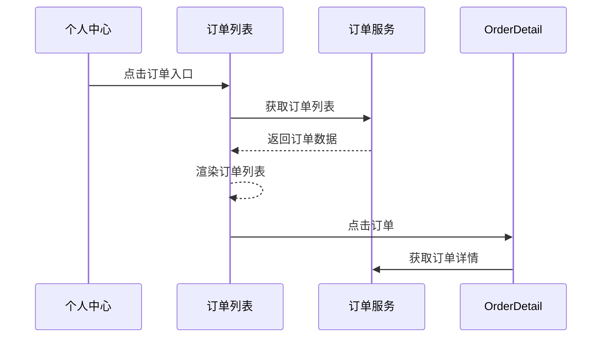

**Diagram sources**
- [order-list/index.config.ts](file://frontend/src/pages/order-list/index.config.ts)

**Section sources**
- [order-list/index.config.ts](file://frontend/src/pages/order-list/index.config.ts)

### 订单确认页

订单确认页是下单流程的关键环节，负责收集订单信息。

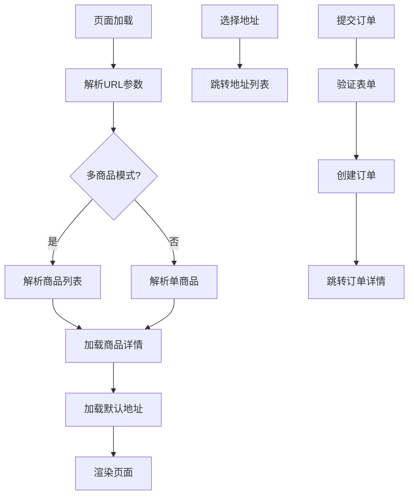

**Diagram sources**
- [order-confirm/index.tsx](file://frontend/src/pages/order-confirm/index.tsx)

**Section sources**
- [order-confirm/index.tsx](file://frontend/src/pages/order-confirm/index.tsx)

订单确认页支持两种模式：
1. **多商品模式**：从购物车跳转，传递商品列表
2. **单商品模式**：从商品详情页跳转，传递单个商品

### 订单详情页

订单详情页展示订单的完整信息，支持支付和取消操作。

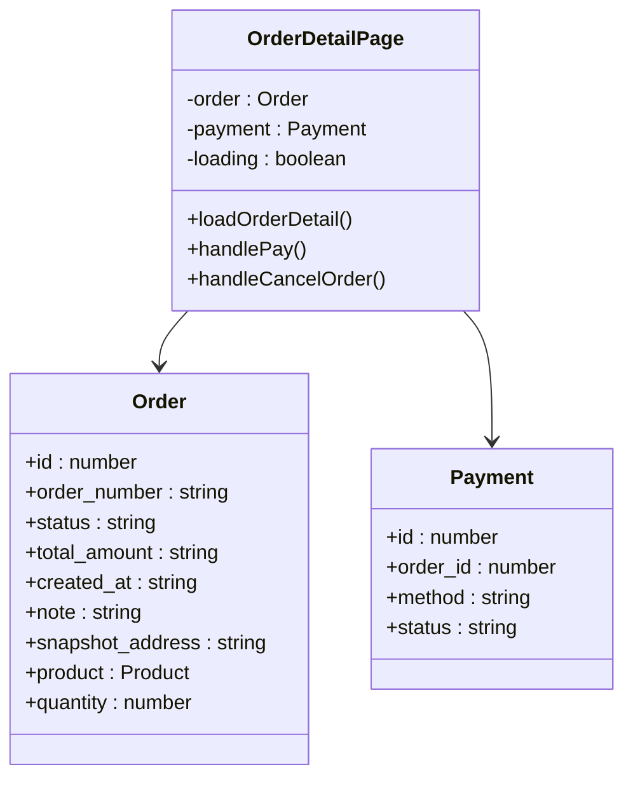

**Diagram sources**
- [order-detail/index.tsx](file://frontend/src/pages/order-detail/index.tsx)

**Section sources**
- [order-detail/index.tsx](file://frontend/src/pages/order-detail/index.tsx)

## 地址管理页面

地址管理页面提供收货地址的增删改查功能。

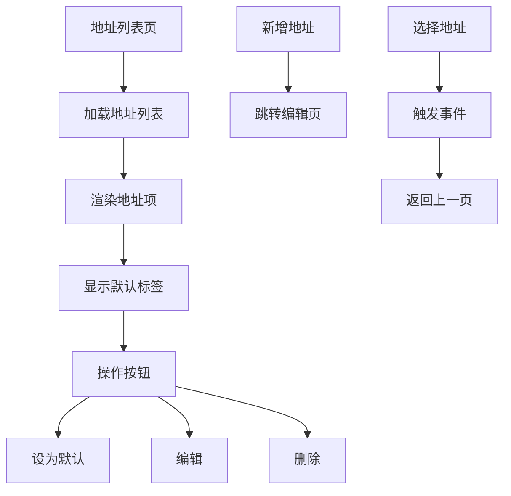

**Diagram sources**
- [address-list/index.tsx](file://frontend/src/pages/address-list/index.tsx)

**Section sources**
- [address-list/index.tsx](file://frontend/src/pages/address-list/index.tsx)

地址管理采用事件中心模式，当用户在订单确认页选择地址时，地址列表页通过`Taro.eventCenter.trigger`将选中的地址传递回去。

## 品牌页与搜索页

### 品牌页

品牌页展示特定品牌下的所有商品。

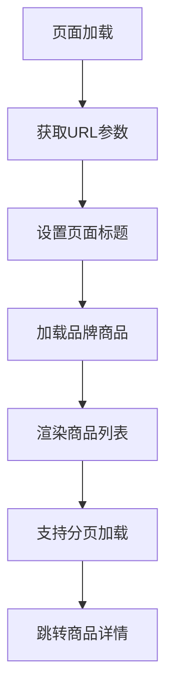

**Diagram sources**
- [brand/index.tsx](file://frontend/src/pages/brand/index.tsx)

**Section sources**
- [brand/index.tsx](file://frontend/src/pages/brand/index.tsx)

### 搜索页

搜索页提供商品搜索功能，支持关键词搜索和结果展示。

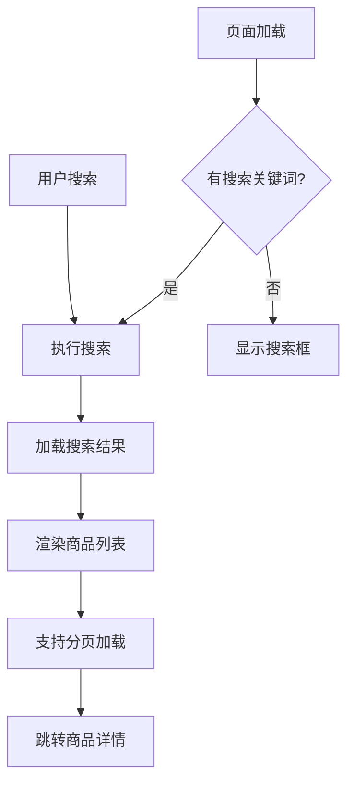

**Diagram sources**
- [search/index.tsx](file://frontend/src/pages/search/index.tsx)

**Section sources**
- [search/index.tsx](file://frontend/src/pages/search/index.tsx)

## 页面生命周期与状态管理

### 页面生命周期

Taro小程序页面遵循标准的生命周期钩子：

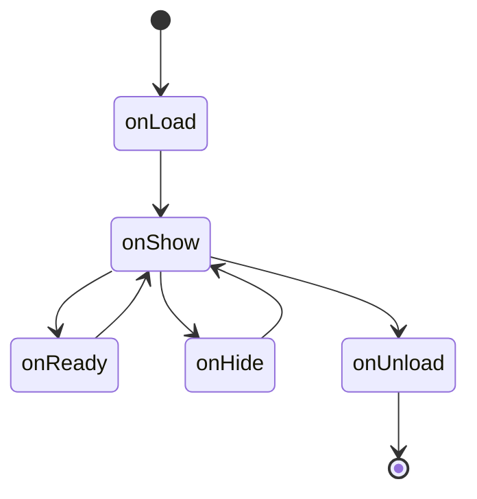

在实际代码中，主要使用`useEffect`和`useDidShow`钩子：
- `useEffect`：在组件挂载时执行，相当于`onLoad`
- `useDidShow`：在页面显示时执行，相当于`onShow`

### 状态管理

页面状态管理采用React Hooks模式：

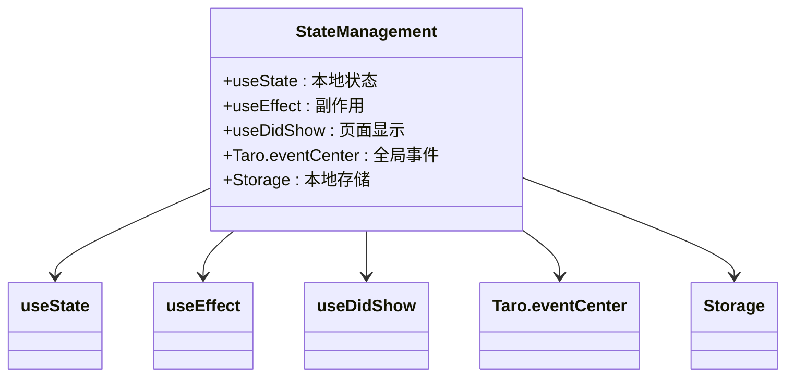

**Diagram sources**
- [home/index.tsx](file://frontend/src/pages/home/index.tsx)
- [cart/index.tsx](file://frontend/src/pages/cart/index.tsx)
- [profile/index.tsx](file://frontend/src/pages/profile/index.tsx)

**Section sources**
- [home/index.tsx](file://frontend/src/pages/home/index.tsx)
- [cart/index.tsx](file://frontend/src/pages/cart/index.tsx)
- [profile/index.tsx](file://frontend/src/pages/profile/index.tsx)

## 页面导航机制

小程序提供了多种页面导航方式：

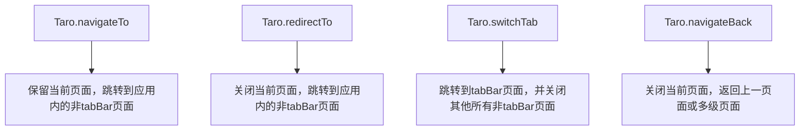

在实际应用中：
- 首页到分类页使用`switchTab`
- 商品详情页使用`navigateTo`
- 订单提交后使用`redirectTo`
- 地址选择后使用`navigateBack`

## 初学者页面创建指南

创建新页面的步骤：

1. **创建页面目录**：在`src/pages`下创建新目录
2. **创建页面文件**：添加`index.tsx`和`index.scss`文件
3. **创建配置文件**：添加`index.config.ts`文件
4. **注册页面**：在`app.config.ts`的`pages`数组中添加页面路径
5. **实现页面逻辑**：在`index.tsx`中编写页面代码

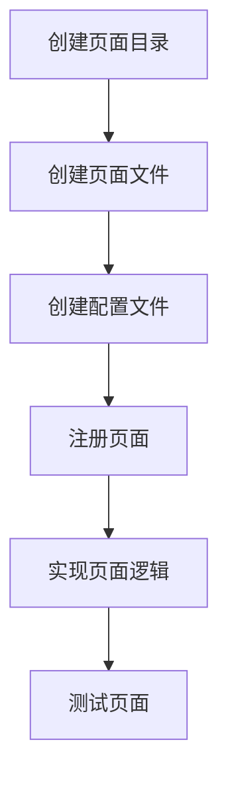

## 性能优化建议

### 数据加载优化
- 使用本地缓存减少API调用
- 实现分页加载避免一次性加载过多数据
- 使用`useMemo`和`useCallback`优化渲染性能

### 图片优化
- 使用合适的图片尺寸
- 实现图片懒加载
- 使用CDN加速图片加载

### 代码分割
- 按需加载服务模块
- 使用动态导入减少初始包大小
- 合理组织代码结构

## 常见问题解决方案

### 页面跳转参数传递
问题：如何在页面间传递复杂数据？
解决方案：使用`JSON.stringify`和`encodeURIComponent`对数据进行编码：

```typescript
// 传递方
const itemsParam = encodeURIComponent(JSON.stringify(items))
Taro.navigateTo({ url: `/pages/order-confirm/index?items=${itemsParam}` })

// 接收方
const params = instance.router?.params || {}
if (params.items) {
  const itemsData = JSON.parse(decodeURIComponent(params.items))
}
```

### 状态同步问题
问题：多个页面需要共享状态如何处理？
解决方案：使用Taro事件中心或全局状态管理：

```typescript
// 触发事件
Taro.eventCenter.trigger('userLogin')

// 监听事件
Taro.eventCenter.on('userLogin', () => {
  // 处理登录状态变化
})
```

### 循环引用问题
问题：页面间相互引用导致循环依赖？
解决方案：通过事件中心解耦，避免直接引用：

```typescript
// 而不是直接调用
// addressPage.setSelectedAddress(address)

// 使用事件中心
Taro.eventCenter.trigger('addressSelected', address)
```