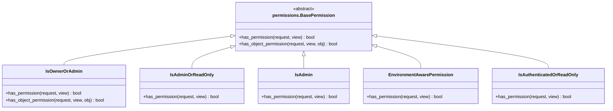

# 公共功能模块

<cite>
**本文档中引用的文件**  
- [permissions.py](file://backend/common/permissions.py)
- [pagination.py](file://backend/common/pagination.py)
- [throttles.py](file://backend/common/throttles.py)
- [responses.py](file://backend/common/responses.py)
- [exceptions.py](file://backend/common/exceptions.py)
- [logging_config.py](file://backend/common/logging_config.py)
- [users/views.py](file://backend/users/views.py)
- [orders/views.py](file://backend/orders/views.py)
- [catalog/views.py](file://backend/catalog/views.py)
</cite>

## 目录
1. [简介](#简介)
2. [权限管理](#权限管理)
3. [分页机制](#分页机制)
4. [限流控制](#限流控制)
5. [异常处理与统一响应](#异常处理与统一响应)
6. [日志配置](#日志配置)
7. [在视图中应用公共组件](#在视图中应用公共组件)
8. [常见问题与解决方案](#常见问题与解决方案)
9. [总结](#总结)

## 简介
本项目中的公共功能模块为整个系统提供了基础支持，涵盖了权限控制、分页、限流、异常处理、统一响应格式和日志记录等核心功能。这些模块通过DRF（Django Rest Framework）的扩展机制实现，确保了API的一致性、安全性和可维护性。公共功能模块位于`backend/common/`目录下，被各个业务模块（如用户、订单、商品）广泛引用。

## 权限管理
权限管理模块定义了多个自定义权限类，用于控制API端点的访问权限。这些权限类基于DRF的`BasePermission`实现，可以根据请求方法、用户角色和环境配置进行细粒度的访问控制。



**Diagram sources**
- [permissions.py](file://backend/common/permissions.py#L12-L189)

**Section sources**
- [permissions.py](file://backend/common/permissions.py#L12-L189)

### IsAdminOrReadOnly 权限类
`IsAdminOrReadOnly`权限类是最常用的权限之一，它允许所有用户进行读取操作（GET, HEAD, OPTIONS），但只有管理员用户（`is_staff=True`）才能进行写入操作（POST, PUT, PATCH, DELETE）。这非常适合用于商品目录等需要公开读取但仅限管理员编辑的资源。

```python
class IsAdminOrReadOnly(permissions.BasePermission):
    def has_permission(self, request, view):
        # 允许所有人进行读取操作
        if request.method in permissions.SAFE_METHODS:
            return True
        # 写入操作需要管理员权限
        return request.user and request.user.is_staff
```

在`catalog/views.py`中，`ProductViewSet`使用了此权限类，确保只有管理员可以创建、更新或删除商品。

**Section sources**
- [permissions.py](file://backend/common/permissions.py#L70-L99)
- [catalog/views.py](file://backend/catalog/views.py#L50)

### 其他权限类
- **`IsOwnerOrAdmin`**: 允许对象所有者或管理员访问。常用于用户个人数据（如订单、地址）。
- **`IsAdmin`**: 仅允许管理员访问。用于管理后台API。
- **`IsAuthenticatedOrReadOnly`**: 允许所有人读取，但写入操作需要认证。适用于评论等用户生成内容。
- **`EnvironmentAwarePermission`**: 在开发环境中放宽权限，生产环境中严格限制，便于开发调试。

## 分页机制
分页机制模块提供了多种预定义的分页器，以满足不同API端点的需求。所有分页器都继承自DRF的`PageNumberPagination`，并重写了`get_paginated_response`方法以返回符合前端期望的统一格式。


**Diagram sources**
- [pagination.py](file://backend/common/pagination.py#L8-L99)

**Section sources**
- [pagination.py](file://backend/common/pagination.py#L8-L99)

### 分页器类型
- **`StandardResultsSetPagination`**: 标准分页器，每页20条数据，适用于大多数列表接口。
- **`LargeResultsSetPagination`**: 大结果集分页器，每页100条数据，适用于需要返回大量数据的接口。
- **`SmallResultsSetPagination`**: 小结果集分页器，每页10条数据，适用于移动端或数据量较小的场景。

分页响应包含丰富的元数据，如`total`（总数）、`page`（当前页）、`total_pages`（总页数）、`has_next`和`has_previous`，方便前端实现分页控件。

## 限流控制
限流控制模块定义了针对不同敏感操作的自定义限流器，以防止暴力破解和滥用。这些限流器基于DRF的`UserRateThrottle`和`AnonRateThrottle`实现，并通过`scope`属性区分不同的限流策略。


**Diagram sources**
- [throttles.py](file://backend/common/throttles.py#L11-L78)

**Section sources**
- [throttles.py](file://backend/common/throttles.py#L11-L78)

### 限流规则
- **登录限流 (`login` scope)**: 认证用户和匿名用户均限制为5次/分钟，有效防止暴力破解。
- **支付限流 (`payment` scope)**: 认证用户限制为10次/分钟，保护支付接口。
- **匿名登录限流**: 专门针对未登录用户的登录尝试，同样使用`login` scope。
- **匿名支付限流**: 专门针对未登录用户的支付尝试，使用`payment` scope。

在`users/views.py`中，`WeChatLoginView`和`PasswordLoginView`都应用了`LoginRateThrottle`，确保登录接口的安全。

**Section sources**
- [throttles.py](file://backend/common/throttles.py#L11-L78)
- [users/views.py](file://backend/users/views.py#L43)

## 异常处理与统一响应
该模块提供了统一的异常处理机制和响应格式，确保所有API返回一致的JSON结构，提升前端处理的便利性和用户体验。

### 统一响应格式
响应分为成功和错误两种格式，均包含`success`、`code`、`message`字段。

**成功响应:**
```json
{
  "success": true,
  "code": 200,
  "message": "Operation successful",
  "data": {...},
  "pagination": {...}
}
```

**错误响应:**
```json
{
  "success": false,
  "code": 400,
  "message": "Error message",
  "errors": {...},
  "error_code": "BUSINESS_ERROR"
}
```

`StandardResponse`和`ErrorResponse`类提供了便捷的静态方法来创建这些响应。


**Diagram sources**
- [responses.py](file://backend/common/responses.py#L15-L322)

**Section sources**
- [responses.py](file://backend/common/responses.py#L15-L322)

### 自定义业务异常
`exceptions.py`文件定义了一系列自定义业务异常，如`InsufficientStockError`、`InvalidOrderStatusError`等。这些异常继承自`BusinessException`，具有明确的HTTP状态码、错误信息和错误代码（`error_code`），便于前端进行精确的错误处理。


**Diagram sources**
- [exceptions.py](file://backend/common/exceptions.py#L26-L211)

**Section sources**
- [exceptions.py](file://backend/common/exceptions.py#L26-L211)

### 统一异常处理器
`custom_exception_handler`函数是整个系统的异常处理中心。它捕获所有未处理的异常，将其格式化为统一的错误响应，并根据环境（开发/生产）决定是否暴露详细的错误信息。在生产环境中，500错误会返回通用的“服务器内部错误”消息，避免泄露敏感信息。

**Section sources**
- [exceptions.py](file://backend/common/exceptions.py#L251-L313)

## 日志配置
日志配置模块提供了集中化的日志管理方案，支持文件轮转、多级别日志和特定操作的审计日志。

### 日志配置特点
- **环境感知**: 开发环境记录`DEBUG`级别日志，生产环境为`INFO`级别。
- **文件轮转**: 使用`RotatingFileHandler`（Linux）或`TimedRotatingFileHandler`（Windows）进行日志文件轮转。
- **专用日志文件**:
  - `app.log`: 通用应用日志。
  - `error.log`: 错误日志，记录所有`ERROR`及以上级别的日志。
  - `payment_audit.log`: 支付审计日志，记录所有支付相关操作。
  - `api.log`: API请求日志，记录关键API调用。
  - `db_queries.log`: 数据库查询日志（仅开发环境）。

```mermaid
graph TD
A[Logger: backend] --> B[Handler: console]
A --> C[Handler: file (app.log)]
A --> D[Handler: error_file (error.log)]
E[Logger: payment_audit] --> B
E --> F[Handler: payment_audit (payment_audit.log)]
E --> D
G[Logger: api] --> B
G --> H[Handler: api (api.log)]
G --> D
```

**Diagram sources**
- [logging_config.py](file://backend/common/logging_config.py#L52-L285)

**Section sources**
- [logging_config.py](file://backend/common/logging_config.py#L30-L285)

### 审计日志工具
`audit_logger.py`提供了`AuditLogger`类和一系列便捷函数，用于记录关键业务操作，如支付创建、订单状态变更、用户登录等。这些日志被写入`payment_audit.log`，便于事后审计和问题追踪。

```python
# 记录支付成功
AuditLogger.log_payment_succeeded(payment_id, order_id, amount, user_id)
```

**Section sources**
- [audit_logger.py](file://backend/common/audit_logger.py#L22-L348)

## 在视图中应用公共组件
公共组件通过在视图类中设置`permission_classes`、`throttle_classes`等属性来应用。

### 权限应用示例
在`catalog/views.py`中，`ProductViewSet`使用`IsAdminOrReadOnly`权限，确保商品信息可以被公开访问，但修改操作仅限管理员。

```python
class ProductViewSet(viewsets.ModelViewSet):
    permission_classes = [IsAdminOrReadOnly]
    # ...
```

### 限流应用示例
在`users/views.py`中，登录视图应用了`LoginRateThrottle`。

```python
class WeChatLoginView(APIView):
    throttle_classes = [LoginRateThrottle]
    # ...
```

### 统一响应应用示例
在`orders/views.py`中，创建订单的视图逻辑中，虽然没有直接调用`StandardResponse`，但其返回的`Response`对象遵循了统一的格式。当抛出自定义异常（如`InsufficientStockError`）时，统一异常处理器会自动将其转换为标准错误响应。

**Section sources**
- [catalog/views.py](file://backend/catalog/views.py#L50)
- [users/views.py](file://backend/users/views.py#L43)
- [orders/views.py](file://backend/orders/views.py#L176-L200)

## 常见问题与解决方案
### 限流规则配置
**问题**: 如何修改登录接口的限流规则？
**解决方案**: 限流规则由`throttles.py`中的`scope`决定。具体的速率限制需要在Django的`settings.py`中配置`DEFAULT_THROTTLE_RATES`。例如：
```python
REST_FRAMEWORK = {
    'DEFAULT_THROTTLE_RATES': {
        'login': '5/min',
        'payment': '10/min'
    }
}
```

### 日志级别调整
**问题**: 如何在生产环境中开启DEBUG日志进行问题排查？
**解决方案**: 直接修改`logging_config.py`中的`get_logging_config`函数，将`default_level`和`django_level`设置为`'DEBUG'`。但请注意，这会产生大量日志，排查完毕后应立即恢复为`'INFO'`。

## 总结
本项目的公共功能模块设计精良，为系统提供了坚实的基础。通过自定义权限、分页、限流和异常处理，实现了API的标准化和安全性。统一的响应格式和完善的日志体系极大地提升了开发效率和可维护性。这些模块的解耦设计使得它们可以被轻松地复用和维护，是项目架构中的核心组成部分。