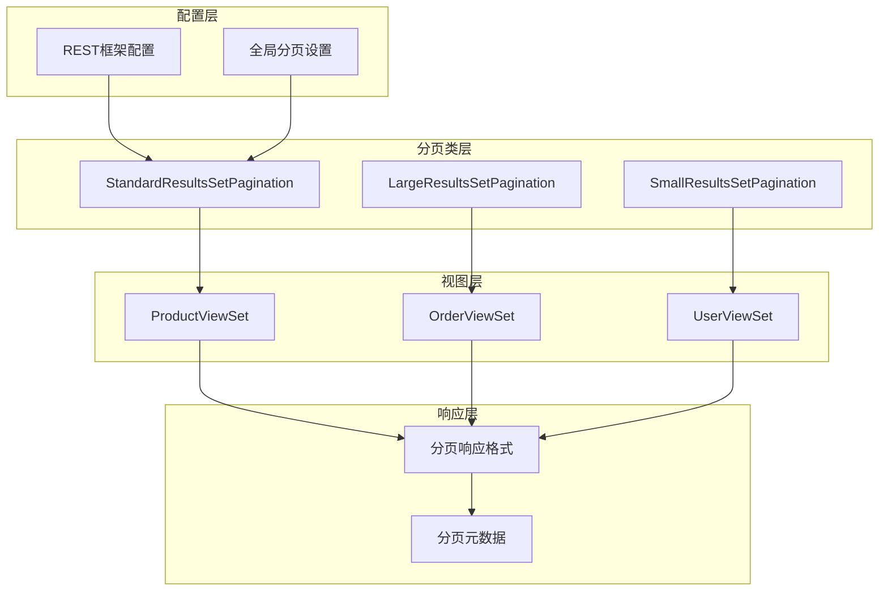
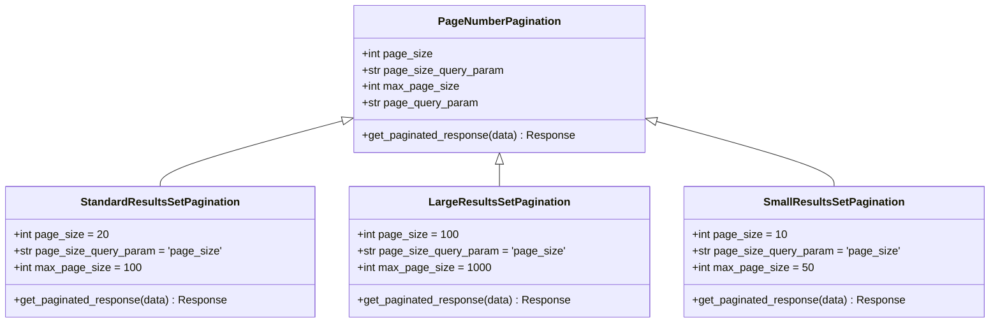
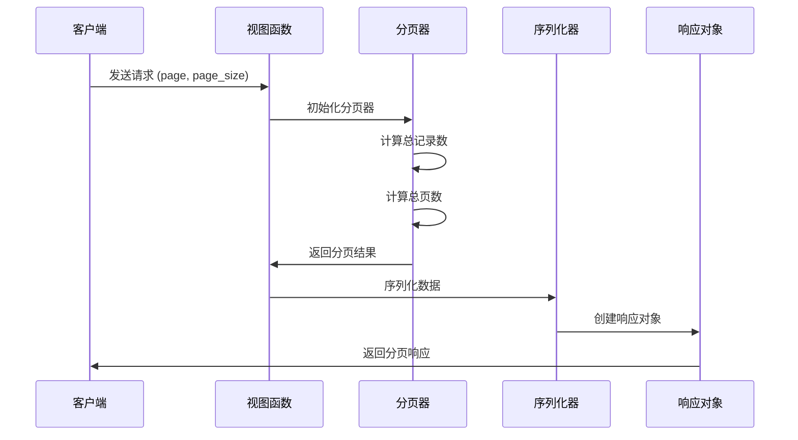
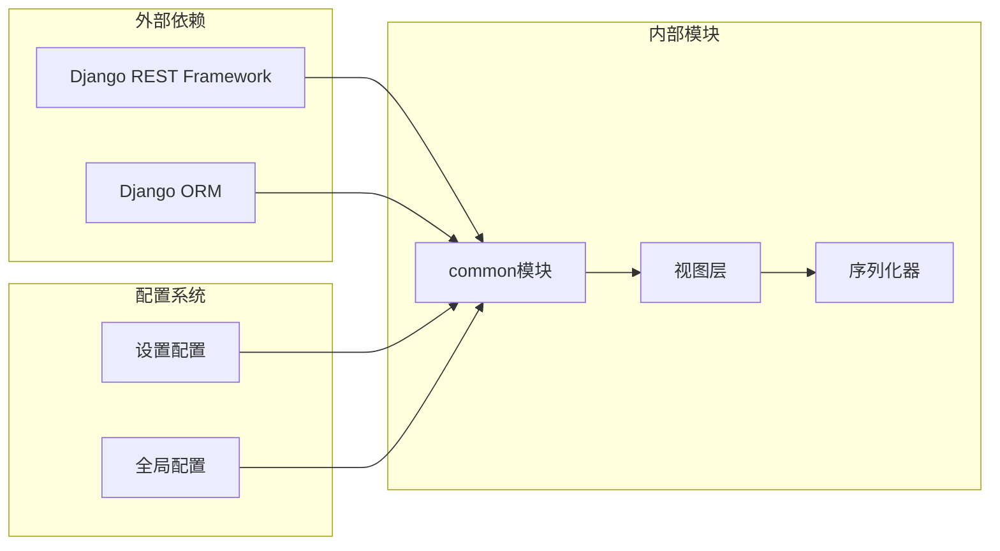

# 分页处理模块

<cite>
**本文档引用的文件**
- [backend/common/pagination.py](file://backend/common/pagination.py)
- [backend/backend/settings/base.py](file://backend/backend/settings/base.py)
- [backend/catalog/views.py](file://backend/catalog/views.py)
- [backend/users/views.py](file://backend/users/views.py)
- [backend/orders/views.py](file://backend/orders/views.py)
</cite>

## 目录
1. [简介](#简介)
2. [项目架构](#项目架构)
3. [核心组件](#核心组件)
4. [架构概览](#架构概览)
5. [详细组件分析](#详细组件分析)
6. [依赖关系分析](#依赖关系分析)
7. [性能考虑](#性能考虑)
8. [故障排除指南](#故障排除指南)
9. [结论](#结论)

## 简介

分页处理模块是电商系统后端的核心功能之一，负责管理和优化大量数据的分页显示。该模块基于Django REST Framework（DRF）的PageNumberPagination类构建，提供了灵活且可配置的分页解决方案，支持多种分页策略以适应不同场景的需求。

本模块的主要目标是：
- 提供统一的分页接口和响应格式
- 支持多种分页策略（标准、大结果集、小结果集）
- 优化大数据集的查询性能
- 确保前后端数据交互的一致性
- 提供可配置的分页参数

## 项目架构

分页处理模块采用分层架构设计，主要包含以下层次：



**图表来源**
- [backend/common/pagination.py](file://backend/common/pagination.py#L1-L99)
- [backend/backend/settings/base.py](file://backend/backend/settings/base.py#L53-L56)

**章节来源**
- [backend/common/pagination.py](file://backend/common/pagination.py#L1-L99)
- [backend/backend/settings/base.py](file://backend/backend/settings/base.py#L33-L56)

## 核心组件

分页处理模块包含三个核心的分页类，每个类针对不同的使用场景进行了优化：

### StandardResultsSetPagination（标准分页器）

这是系统的主要分页器，适用于大多数列表接口。它提供了平衡的性能和用户体验：

- **默认页大小**：20条记录
- **最大页大小**：100条记录
- **查询参数**：支持`page_size`和`page`参数
- **响应格式**：包含完整的分页元数据

### LargeResultsSetPagination（大结果集分页器）

专为返回大量数据的接口设计：

- **默认页大小**：100条记录
- **最大页大小**：1000条记录
- **适用场景**：数据分析、报表导出等需要大量数据的场景

### SmallResultsSetPagination（小结果集分页器）

针对移动端和少量数据的场景优化：

- **默认页大小**：10条记录
- **最大页大小**：50条记录
- **适用场景**：移动端API、快速查询等

**章节来源**
- [backend/common/pagination.py](file://backend/common/pagination.py#L8-L99)

## 架构概览

分页模块的整体架构体现了DRF的设计原则和最佳实践：



**图表来源**
- [backend/common/pagination.py](file://backend/common/pagination.py#L8-L99)

## 详细组件分析

### 分页器实现机制

每个分页器都继承自DRF的PageNumberPagination基类，并重写了`get_paginated_response`方法以提供统一的响应格式：



**图表来源**
- [backend/common/pagination.py](file://backend/common/pagination.py#L27-L42)
- [backend/catalog/views.py](file://backend/catalog/views.py#L89-L131)

### 视图中的分页应用

#### 全局配置方式

系统通过REST框架的全局配置设置了默认分页器：

```python
# 在settings/base.py中配置
REST_FRAMEWORK = {
    'DEFAULT_PAGINATION_CLASS': 'common.pagination.StandardResultsSetPagination',
    'PAGE_SIZE': 20,
}
```

这种方式适用于大多数视图集，提供了一致的分页体验。

#### 局部覆盖方式

某些特殊场景下，可以通过在视图中指定不同的分页器：

```python
# ProductViewSet中的分页配置
class ProductViewSet(viewsets.ModelViewSet):
    pagination_class = LargeResultsSetPagination  # 局部覆盖
```

#### 手动分页实现

对于复杂的查询场景，可以直接使用分页器：

```python
# 在视图中手动分页
queryset = self.filter_queryset(self.get_queryset())
page = self.paginate_queryset(queryset)
if page is not None:
    serializer = self.get_serializer(page, many=True)
    return self.get_paginated_response(serializer.data)
```

**章节来源**
- [backend/backend/settings/base.py](file://backend/backend/settings/base.py#L53-L56)
- [backend/catalog/views.py](file://backend/catalog/views.py#L89-L131)
- [backend/orders/views.py](file://backend/orders/views.py#L126-L131)

### 分页元数据结构

分页响应包含丰富的元数据信息，确保前端能够正确处理分页逻辑：

| 字段名 | 类型 | 描述 | 示例值 |
|--------|------|------|--------|
| `results` | Array | 当前页的数据列表 | `[{}, {}, {}]` |
| `total` | Integer | 总记录数 | `1234` |
| `page` | Integer | 当前页码 | `1` |
| `total_pages` | Integer | 总页数 | `124` |
| `has_next` | Boolean | 是否有下一页 | `true` |
| `has_previous` | Boolean | 是否有上一页 | `false` |
| `count` | Integer | 总记录数（兼容字段） | `1234` |
| `next` | String | 下一页URL | `/api/products/?page=2` |
| `previous` | String | 上一页URL | `null` |

### 前端消费方式

前端可以通过以下方式消费分页数据：

```javascript
// 基本分页导航
const paginationInfo = {
    currentPage: response.page,
    totalPages: response.total_pages,
    totalCount: response.total,
    hasNext: response.has_next,
    hasPrevious: response.has_previous
};

// 数据渲染
const items = response.results.map(item => ({
    id: item.id,
    name: item.name,
    price: item.price
}));
```

**章节来源**
- [backend/common/pagination.py](file://backend/common/pagination.py#L27-L42)

## 依赖关系分析

分页模块与其他系统组件的依赖关系：



**图表来源**
- [backend/common/pagination.py](file://backend/common/pagination.py#L4-L6)
- [backend/backend/settings/base.py](file://backend/backend/settings/base.py#L33-L56)

**章节来源**
- [backend/common/pagination.py](file://backend/common/pagination.py#L4-L6)
- [backend/backend/settings/base.py](file://backend/backend/settings/base.py#L33-L56)

## 性能考虑

### 大数据集优化策略

对于大数据集，系统采用了多种优化策略：

#### 1. 查询优化
- 使用`select_related`和`prefetch_related`减少数据库查询次数
- 实现索引友好的查询条件
- 避免N+1查询问题

#### 2. 分页算法优化
- 使用`COUNT()`查询获取总记录数
- 实现高效的分页计算逻辑
- 支持懒加载和无限滚动

#### 3. 游标分页（CursorPagination）

虽然当前主要使用PageNumberPagination，但DRF也支持游标分页：

```python
from rest_framework.pagination import CursorPagination

class CustomCursorPagination(CursorPagination):
    ordering = '-created_at'
    page_size = 20
```

游标分页的优势：
- 适合时间序列数据
- 避免深度分页性能问题
- 支持稳定的排序

### 性能监控指标

关键性能指标包括：

| 指标 | 目标值 | 监控方法 |
|------|--------|----------|
| 查询时间 | < 100ms | 数据库查询日志 |
| 内存使用 | < 50MB | 应用监控 |
| 响应时间 | < 500ms | API性能监控 |
| 并发处理 | > 1000 QPS | 负载测试 |

## 故障排除指南

### 常见问题及解决方案

#### 1. 分页丢失数据

**症状**：某些记录在分页中消失或重复出现

**原因分析**：
- 数据库记录在分页过程中被修改
- 排序字段不唯一
- 并发写入导致数据变化

**解决方案**：
```python
# 使用稳定的排序字段
queryset = queryset.order_by('id')  # 确保主键唯一性
```

#### 2. 性能瓶颈

**症状**：大数据集分页响应缓慢

**诊断步骤**：
1. 检查数据库查询执行计划
2. 分析索引使用情况
3. 监控内存和CPU使用率

**优化方案**：
```python
# 优化查询
queryset = queryset.select_related('category', 'brand')
queryset = queryset.prefetch_related('tags')
```

#### 3. 分页参数验证失败

**症状**：无效的page或page_size参数导致错误

**解决方案**：
```python
# 参数验证
page = parse_int(request.query_params.get('page')) or 1
page_size = parse_int(request.query_params.get('page_size')) or 20
page_size = min(page_size, 100)  # 限制最大值
```

#### 4. 内存溢出

**症状**：处理大量数据时内存使用过高

**预防措施**：
- 设置合理的最大页大小
- 使用生成器处理大数据集
- 实现流式响应

### 调试工具和技巧

#### 1. 查询性能分析
```python
# 在视图中添加性能分析
import time
from django.db import connection

start_time = time.time()
queryset = self.get_queryset()
print(f"Query time: {time.time() - start_time:.3f}s")
print(f"SQL queries: {len(connection.queries)}")
```

#### 2. 分页参数验证
```python
# 添加参数验证中间件
def validate_pagination_params(request):
    page = request.query_params.get('page', 1)
    page_size = request.query_params.get('page_size', 20)
    
    if int(page) < 1:
        raise ValidationError("Page number must be >= 1")
    if int(page_size) < 1 or int(page_size) > 100:
        raise ValidationError("Page size must be between 1 and 100")
```

**章节来源**
- [backend/catalog/views.py](file://backend/catalog/views.py#L100-L102)
- [backend/catalog/views.py](file://backend/catalog/views.py#L216-L225)

## 结论

分页处理模块是电商系统后端的重要组成部分，通过精心设计的分页策略和优化方案，为系统提供了高效、稳定的数据分页能力。

### 主要优势

1. **灵活性**：支持多种分页策略，适应不同场景需求
2. **一致性**：提供统一的响应格式和接口规范
3. **可扩展性**：易于添加新的分页策略和配置选项
4. **性能优化**：针对大数据集进行了专门优化

### 最佳实践建议

1. **合理选择分页器**：根据数据量和使用场景选择合适的分页器
2. **参数验证**：严格验证分页参数，防止恶意请求
3. **性能监控**：持续监控分页性能，及时发现和解决问题
4. **缓存策略**：对频繁查询的结果实施适当的缓存机制

### 未来发展方向

1. **游标分页支持**：考虑引入游标分页以优化时间序列数据的分页
2. **智能分页**：基于历史数据和用户行为的智能分页策略
3. **分布式分页**：支持大规模分布式环境下的分页处理
4. **实时分页**：实现实时数据的动态分页展示

通过持续的优化和改进，分页处理模块将继续为系统提供可靠、高效的分页服务，支撑业务的快速发展。