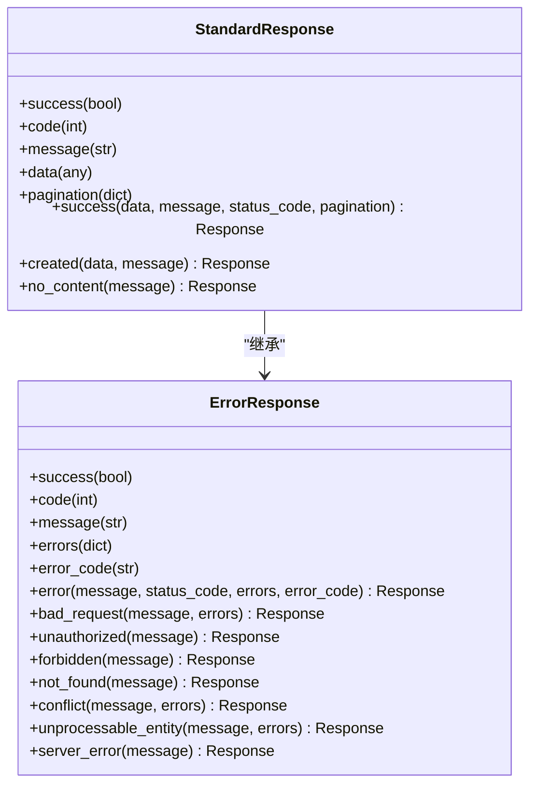
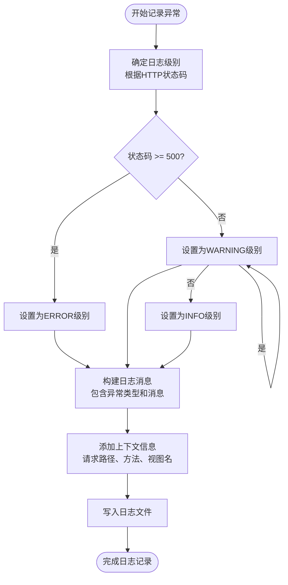
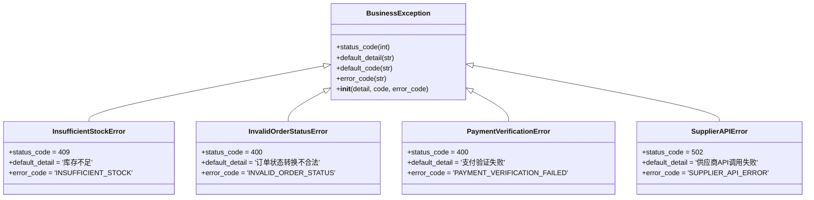

# 异常处理与响应模块

<cite>
**本文档引用的文件**   
- [responses.py](file://backend/common/responses.py)
- [exceptions.py](file://backend/common/exceptions.py)
- [base.py](file://backend/backend/settings/base.py)
- [logging_config.py](file://backend/common/logging_config.py)
- [views.py](file://backend/orders/views.py)
- [services.py](file://backend/orders/services.py)
</cite>

## 目录
1. [简介](#简介)
2. [统一异常处理机制](#统一异常处理机制)
3. [标准化响应格式](#标准化响应格式)
4. [异常日志记录最佳实践](#异常日志记录最佳实践)
5. [业务视图中的异常处理示例](#业务视图中的异常处理示例)
6. [异常分类体系扩展](#异常分类体系扩展)
7. [常见问题应对策略](#常见问题应对策略)
8. [总结](#总结)

## 简介
本项目采用Django REST Framework（DRF）构建API服务，通过自定义异常处理机制和标准化响应格式，确保所有API返回一致的错误结构。系统设计了统一的异常处理流程，包含自定义异常类、统一异常处理器、标准化响应封装和完善的日志记录机制。该架构不仅提高了API的可靠性和可维护性，还为前端开发提供了清晰的错误处理指导。

## 统一异常处理机制

系统通过DRF的`EXCEPTION_HANDLER`配置实现了统一的异常处理机制。在`base.py`文件中，配置了自定义异常处理器`common.exceptions.custom_exception_handler`，该处理器会拦截所有未被捕获的异常并进行规范化处理。

异常处理流程包括：
1. 捕获异常并记录详细日志
2. 根据异常类型提取错误信息
3. 构建标准化的错误响应
4. 在生产环境中隐藏敏感信息

自定义异常处理器会区分不同类型的异常，包括业务逻辑异常、验证异常和系统异常，并为每种类型提供适当的处理策略。对于未被DRF捕获的异常，系统还提供了备用处理机制，确保所有异常都能被妥善处理。

**Section sources**
- [base.py](file://backend/backend/settings/base.py#L55)
- [exceptions.py](file://backend/common/exceptions.py#L251)

## 标准化响应格式

系统通过`responses.py`文件中的`StandardResponse`和`ErrorResponse`类实现了标准化的响应格式。所有API响应都遵循统一的结构，包含`success`、`code`、`message`和`data/errors`字段。



**Diagram sources**
- [responses.py](file://backend/common/responses.py#L15)

`StandardResponse`类用于封装成功的API响应，提供了多种便捷方法如`success`、`created`和`no_content`，对应不同的HTTP状态码。`ErrorResponse`类则用于封装错误响应，提供了针对不同HTTP状态码的专用方法，如`bad_request`、`unauthorized`等。

响应格式设计考虑了实际使用场景，成功响应包含`data`字段用于返回业务数据，而错误响应则包含`errors`字段用于返回详细的错误信息。在生产环境中，详细的错误信息会被隐藏，以防止敏感信息泄露。

**Section sources**
- [responses.py](file://backend/common/responses.py#L15)

## 异常日志记录最佳实践

系统通过`logging_config.py`文件实现了完善的日志记录机制。日志配置根据环境（开发/生产）自动调整日志级别和输出格式，确保在不同环境下都能提供适当的调试信息。



**Diagram sources**
- [logging_config.py](file://backend/common/logging_config.py#L290)

日志记录的最佳实践包括：

1. **分层日志记录**：系统配置了多个日志处理器，包括控制台输出、应用日志文件、错误日志文件、支付审计日志和API请求日志。不同类型的日志被记录到不同的文件中，便于后续分析和监控。

2. **环境感知**：在开发环境中启用DEBUG级别日志，记录详细的调试信息；在生产环境中则使用INFO级别，减少日志量并保护敏感信息。

3. **上下文丰富**：日志记录时会包含请求路径、请求方法、视图名称和状态码等上下文信息，帮助快速定位问题。

4. **特殊日志处理**：支付操作和API请求有专门的日志记录器，便于审计和性能分析。

5. **文件轮转**：日志文件采用轮转机制，防止日志文件过大。在Windows系统上使用时间轮转，在其他系统上使用大小轮转。

**Section sources**
- [logging_config.py](file://backend/common/logging_config.py#L290)

## 业务视图中的异常处理示例

在实际业务代码中，异常处理机制被广泛应用。以订单模块为例，系统定义了多种业务异常类，如`InsufficientStockError`、`InvalidOrderStatusError`等，这些异常都继承自`BusinessException`基类。



**Diagram sources**
- [exceptions.py](file://backend/common/exceptions.py#L26)

在订单创建过程中，当库存不足时会抛出`InsufficientStockError`异常：

```python
try:
    with transaction.atomic():
        order = create_order(
            user=target_user,
            product_id=serializer.validated_data["product_id"],
            address_id=serializer.validated_data["address_id"],
            quantity=serializer.validated_data.get("quantity", 1),
            note=serializer.validated_data.get("note", ""),
        )
except ValueError as e:
    logger.warning(f'创建订单失败: {str(e)}')
    return Response({'detail': str(e)}, status=status.HTTP_400_BAD_REQUEST)
```

在供应商API调用失败时，会抛出`SupplierAPIError`异常：

```python
try:
    supplier.get_products()
except requests.RequestException as e:
    raise SupplierAPIError(
        detail=f'供应商API调用失败: {str(e)}'
    )
```

这些自定义异常不仅包含了适当的HTTP状态码，还提供了客户端可识别的错误代码（如`INSUFFICIENT_STOCK`），便于前端进行针对性的错误处理。

**Section sources**
- [views.py](file://backend/orders/views.py#L176)
- [exceptions.py](file://backend/common/exceptions.py#L59)

## 异常分类体系扩展

系统的异常分类体系设计具有良好的扩展性，开发者可以轻松添加新的异常类型。所有自定义业务异常都继承自`BusinessException`基类，该基类定义了异常处理的基本模式。

要扩展异常分类体系，只需创建新的异常类并继承`BusinessException`，然后设置适当的`status_code`、`default_detail`和`error_code`属性。例如，要添加一个新的"订单超时"异常：

```python
class OrderTimeoutError(BusinessException):
    """
    Raised when order payment times out.
    
    HTTP Status: 408 Request Timeout
    """
    
    status_code = status.HTTP_408_REQUEST_TIMEOUT
    default_detail = '订单支付超时'
    default_code = 'order_timeout'
    error_code = 'ORDER_TIMEOUT'
```

系统还提供了`ExceptionLoggingMiddleware`中间件，用于捕获和记录未被处理的异常。这个中间件应该添加到Django的`MIDDLEWARE`配置中，作为最后一道防线确保所有异常都能被记录。

异常处理机制支持环境感知的错误信息显示。在开发环境中，会显示详细的错误信息和堆栈跟踪，便于调试；在生产环境中，则会隐藏详细的错误信息，只显示通用的错误消息，防止敏感信息泄露。

**Section sources**
- [exceptions.py](file://backend/common/exceptions.py#L26)

## 常见问题应对策略

### 异常信息泄露
为防止异常信息泄露，系统采用了多种策略：
1. 在生产环境中，将500及以上状态码的错误消息替换为通用消息
2. 不在错误响应中暴露堆栈跟踪和内部实现细节
3. 对日志中的敏感信息进行过滤
4. 使用环境配置控制错误信息的详细程度

### 日志冗余
为避免日志冗余，系统采用了以下措施：
1. 根据HTTP状态码确定日志级别，避免将所有异常都记录为ERROR级别
2. 使用适当的日志格式，只记录必要的信息
3. 配置日志轮转和归档策略，防止日志文件过大
4. 为不同类型的日志使用不同的处理器和文件

### 性能影响
异常处理机制对性能的影响被控制在最小范围内：
1. 异常处理只在异常发生时执行，正常流程不受影响
2. 日志记录采用异步方式或在不影响主线程的情况下进行
3. 错误响应的构建过程简单高效
4. 使用缓存减少重复的日志处理开销

### 监控告警集成
系统设计考虑了与监控告警系统的集成：
1. 为关键异常类型分配唯一的`error_code`，便于监控系统识别和告警
2. 在支付等关键操作中使用专门的审计日志
3. 提供详细的上下文信息，便于故障排查
4. 支持将异常信息发送到外部监控服务

**Section sources**
- [exceptions.py](file://backend/common/exceptions.py#L277)
- [logging_config.py](file://backend/common/logging_config.py#L400)

## 总结
本项目的异常处理与响应模块通过统一的异常处理机制和标准化的响应格式，实现了API错误处理的一致性和可靠性。系统设计了完善的异常分类体系，支持业务逻辑异常的精细化管理。通过环境感知的错误信息显示和详细的日志记录，既满足了开发调试的需求，又保证了生产环境的安全性。异常处理机制具有良好的扩展性，便于添加新的异常类型和集成监控告警系统。整体设计遵循了最佳实践，为构建稳定可靠的API服务提供了坚实的基础。