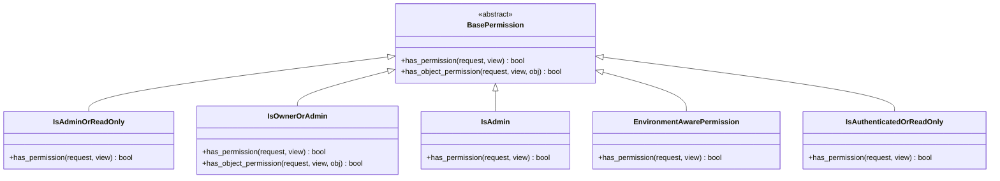

# 权限管理模块

<cite>
**本文档引用的文件**
- [permissions.py](file://backend/common/permissions.py)
- [views.py](file://backend/users/views.py)
- [views.py](file://backend/catalog/views.py)
- [views.py](file://backend/orders/views.py)
- [views.py](file://backend/integrations/views.py)
- [base.py](file://backend/backend/settings/base.py)
- [models.py](file://backend/users/models.py)
</cite>

## 目录
1. [简介](#简介)
2. [项目结构](#项目结构)
3. [核心权限类](#核心权限类)
4. [架构概览](#架构概览)
5. [详细组件分析](#详细组件分析)
6. [JWT认证体系集成](#jwt认证体系集成)
7. [视图层权限配置](#视图层权限配置)
8. [权限组合与逻辑](#权限组合与逻辑)
9. [HTTP方法差异化控制](#http方法差异化控制)
10. [故障排除指南](#故障排除指南)
11. [最佳实践](#最佳实践)
12. [总结](#总结)

## 简介

本权限管理模块是基于Django REST Framework (DRF)构建的企业级电商系统的核心安全组件。该模块提供了细粒度的访问控制策略，支持多种权限级别和场景需求，包括管理员权限、用户所有权控制、只读权限等。

### 主要特性

- **多层级权限控制**：支持管理员、普通用户、访客等不同权限级别
- **对象级权限**：基于用户所有权的对象访问控制
- **环境感知权限**：开发环境与生产环境的不同权限策略
- **JWT集成**：与JSON Web Token认证体系无缝集成
- **灵活配置**：支持函数视图和类视图的权限配置

## 项目结构

权限管理模块采用分层架构设计，主要分布在以下位置：


**图表来源**
- [permissions.py](file://backend/common/permissions.py#L1-L189)
- [views.py](file://backend/users/views.py#L1-L460)

**章节来源**
- [permissions.py](file://backend/common/permissions.py#L1-L189)
- [views.py](file://backend/users/views.py#L1-L460)

## 核心权限类

### IsAdminOrReadOnly 权限类

这是最常用的权限类之一，实现了读写分离的安全策略。

#### 实现机制


**图表来源**
- [permissions.py](file://backend/common/permissions.py#L70-L99)

#### 关键特性

1. **安全优先**：默认只允许读取操作
2. **管理员特权**：管理员用户拥有完全写入权限
3. **认证要求**：写入操作需要有效的用户认证

### IsOwnerOrAdmin 权限类

实现了基于所有权的对象级访问控制。

#### 对象权限验证流程


**图表来源**
- [permissions.py](file://backend/common/permissions.py#L12-L67)

#### 扩展性设计

该权限类支持多种对象所有权模式：
- 直接用户关联（`obj.user == request.user`）
- 关联对象所有权（通过`obj.order.user`访问）

### IsAdmin 权限类

严格的管理员权限控制，仅允许具有`is_staff=True`的用户访问。

### EnvironmentAwarePermission 权限类

环境感知的权限控制，根据运行环境动态调整权限策略。

#### 环境策略对比

| 环境类型 | 权限策略 | 适用场景 |
|---------|---------|---------|
| 开发环境 | 所有已认证用户均可访问 | 快速开发和测试 |
| 生产环境 | 严格的身份验证要求 | 正式部署环境 |

**章节来源**
- [permissions.py](file://backend/common/permissions.py#L1-L189)

## 架构概览

权限管理模块采用DRF的中间件架构，通过权限类链式处理请求。


**图表来源**
- [base.py](file://backend/backend/settings/base.py#L33-L40)
- [permissions.py](file://backend/common/permissions.py#L8-L189)

## 详细组件分析

### 自定义权限类实现

#### 权限类继承关系



**图表来源**
- [permissions.py](file://backend/common/permissions.py#L8-L189)

#### 权限验证方法详解

每个权限类都需要实现以下两个关键方法：

1. **`has_permission()`**：全局权限检查，适用于所有请求
2. **`has_object_permission()`**：对象级权限检查，仅在需要时调用

### 权限类应用场景

#### 产品管理权限配置

```python
# 商品列表和详情 - 公开访问
class ProductViewSet(viewsets.ModelViewSet):
    permission_classes = [IsAdminOrReadOnly]

# 品牌管理 - 管理员专用
class BrandViewSet(viewsets.ModelViewSet):
    permission_classes = [IsAdminOrReadOnly]

# 分类管理 - 管理员专用  
class CategoryViewSet(viewsets.ModelViewSet):
    permission_classes = [IsAdminOrReadOnly]
```

#### 订单管理权限配置

```python
# 订单管理 - 用户只能访问自己的订单
class OrderViewSet(viewsets.ModelViewSet):
    permission_classes = [IsOwnerOrAdmin]

# 支付管理 - 用户只能访问自己的支付记录
class PaymentViewSet(viewsets.ModelViewSet):
    permission_classes = [IsOwnerOrAdmin]
```

**章节来源**
- [views.py](file://backend/catalog/views.py#L29-L610)
- [views.py](file://backend/orders/views.py#L23-L800)

## JWT认证体系集成

### 认证配置

系统采用JWT（JSON Web Token）作为主要认证方式，与权限模块深度集成。

#### JWT配置要点

```python
# JWT令牌生命周期配置
SIMPLE_JWT = {
    'ACCESS_TOKEN_LIFETIME': timedelta(days=7),
    'REFRESH_TOKEN_LIFETIME': timedelta(days=30),
}

# 默认认证类配置
REST_FRAMEWORK = {
    'DEFAULT_AUTHENTICATION_CLASSES': [
        'rest_framework_simplejwt.authentication.JWTAuthentication',
    ],
}
```

### 认证流程集成


**图表来源**
- [base.py](file://backend/backend/settings/base.py#L142-L146)
- [base.py](file://backend/backend/settings/base.py#L33-L36)

### 登录接口权限配置

系统提供两种登录方式，均采用JWT认证：

#### 微信小程序登录

```python
# 允许匿名访问，关闭JWT认证
permission_classes = [permissions.AllowAny]
authentication_classes = []
```

#### 管理员密码登录

```python
# 允许匿名访问，但需要验证用户名密码
permission_classes = [permissions.AllowAny]
authentication_classes = []
```

**章节来源**
- [views.py](file://backend/users/views.py#L22-L190)
- [base.py](file://backend/backend/settings/base.py#L33-L40)

## 视图层权限配置

### 类视图权限配置

#### ModelViewSet权限配置

```python
# 基础权限配置模式
class MyViewSet(viewsets.ModelViewSet):
    permission_classes = [IsAdminOrReadOnly]
    
    # 可选：针对特定操作的权限配置
    @action(detail=True, methods=['post'], permission_classes=[IsAdmin])
    def special_action(self, request, pk=None):
        pass
```

#### ReadOnlyModelViewSet权限配置

```python
# 只读视图的权限配置
class ReadOnlyViewSet(viewsets.ReadOnlyModelViewSet):
    permission_classes = [permissions.AllowAny]  # 公开访问
```

### 函数视图权限配置

#### 基于装饰器的权限配置

```python
@api_view(['GET', 'POST'])
@permission_classes([IsAuthenticated])
def authenticated_view(request):
    pass

@api_view(['GET'])
@permission_classes([IsAdmin])
def admin_only_view(request):
    pass
```

#### 权限验证流程


**图表来源**
- [views.py](file://backend/users/views.py#L235-L247)

### 权限配置最佳实践

#### 1. 最小权限原则

```python
# 推荐：只赋予必要的权限
class UserViewSet(viewsets.ModelViewSet):
    permission_classes = [IsAuthenticated]  # 仅认证用户可访问
```

#### 2. 权限分离

```python
# 推荐：将不同操作的权限分开配置
class ProductViewSet(viewsets.ModelViewSet):
    @action(detail=False, methods=['get'], permission_classes=[permissions.AllowAny])
    def public_list(self, request):
        pass
        
    @action(detail=True, methods=['put'], permission_classes=[IsAdmin])
    def admin_update(self, request, pk=None):
        pass
```

**章节来源**
- [views.py](file://backend/catalog/views.py#L29-L610)
- [views.py](file://backend/orders/views.py#L23-L800)

## 权限组合与逻辑

### AND逻辑组合

DRF默认使用AND逻辑组合多个权限类，所有权限类必须通过才能访问。

```python
# 多重权限验证
class AdminUserViewSet(viewsets.ModelViewSet):
    permission_classes = [IsAuthenticated, IsAdmin]
```

#### 权限验证顺序


**图表来源**
- [views.py](file://backend/users/views.py#L388-L460)

### OR逻辑组合

虽然DRF不直接支持OR逻辑，但可以通过自定义权限类实现：

```python
class IsAdminOrAuthenticated(permissions.BasePermission):
    def has_permission(self, request, view):
        return request.user and request.user.is_authenticated or request.user.is_staff
```

### 权限组合应用场景

#### 1. 管理员专用功能

```python
# 管理员专用的操作
@action(detail=True, methods=['post'], permission_classes=[IsAdmin])
def promote_to_admin(self, request, pk=None):
    pass
```

#### 2. 用户专属功能

```python
# 用户只能操作自己的资源
@action(detail=True, methods=['patch'], permission_classes=[IsOwnerOrAdmin])
def update_profile(self, request, pk=None):
    pass
```

**章节来源**
- [views.py](file://backend/users/views.py#L388-L460)
- [views.py](file://backend/orders/views.py#L32-L800)

## HTTP方法差异化控制

### 安全方法与危险方法

系统根据HTTP方法的安全性自动应用不同的权限策略。

#### 方法分类表

| HTTP方法 | 安全方法 | 危险方法 | 权限策略示例 |
|---------|---------|---------|-------------|
| GET | ✓ | ✗ | 公开访问 |
| HEAD | ✓ | ✗ | 公开访问 |
| OPTIONS | ✓ | ✗ | 公开访问 |
| POST | ✗ | ✓ | 需要认证 |
| PUT | ✗ | ✓ | 需要认证 |
| PATCH | ✗ | ✓ | 需要认证 |
| DELETE | ✗ | ✓ | 需要认证 |

### 方法级别的权限配置

#### 1. 基于方法的权限控制

```python
class ProductViewSet(viewsets.ModelViewSet):
    def get_permissions(self):
        """
        根据HTTP方法动态分配权限
        """
        if self.action in ['list', 'retrieve']:
            # 公开访问
            return [permissions.AllowAny()]
        elif self.action in ['create', 'update', 'partial_update', 'destroy']:
            # 管理员权限
            return [IsAdmin()]
        else:
            # 默认权限
            return [IsAuthenticated()]
```

#### 2. 特定方法的权限配置

```python
class OrderViewSet(viewsets.ModelViewSet):
    @action(detail=True, methods=['patch'], permission_classes=[IsOwnerOrAdmin])
    def cancel(self, request, pk=None):
        """取消订单 - 用户或管理员可操作"""
        pass
    
    @action(detail=True, methods=['patch'], permission_classes=[IsAuthenticated])
    def ship(self, request, pk=None):
        """发货 - 仅管理员可操作"""
        pass
```

### 权限策略映射


**图表来源**
- [permissions.py](file://backend/common/permissions.py#L70-L99)
- [views.py](file://backend/orders/views.py#L307-L377)

**章节来源**
- [views.py](file://backend/catalog/views.py#L29-L610)
- [views.py](file://backend/orders/views.py#L23-L800)

## 故障排除指南

### 常见权限问题及解决方案

#### 1. 权限不生效

**症状**：设置了权限类但仍然可以访问受保护的资源

**排查步骤**：
```python
# 1. 检查权限类导入
from common.permissions import IsAdminOrReadOnly

# 2. 检查权限配置语法
class MyViewSet(viewsets.ModelViewSet):
    permission_classes = [IsAdminOrReadOnly]  # 注意方括号

# 3. 检查权限类实现
def has_permission(self, request, view):
    print(f"User: {request.user}, Authenticated: {request.user.is_authenticated}")
    return request.user and request.user.is_authenticated
```

**解决方案**：
- 确保正确导入权限类
- 检查权限类配置语法
- 添加调试日志验证权限逻辑

#### 2. 管理员权限异常

**症状**：管理员用户无法访问管理员功能

**排查流程**：
```python
# 调试管理员权限
def debug_admin_permission(request):
    print(f"User: {request.user}")
    print(f"is_staff: {getattr(request.user, 'is_staff', False)}")
    print(f"is_superuser: {getattr(request.user, 'is_superuser', False)}")
    print(f"User type: {getattr(request.user, 'user_type', 'unknown')}")
```

**解决方案**：
- 检查用户模型中的`is_staff`字段
- 验证用户是否正确设置为管理员
- 确认权限类的实现逻辑

#### 3. JWT认证失效

**症状**：JWT令牌无法正常工作

**排查步骤**：
```python
# 检查JWT配置
from rest_framework_simplejwt.authentication import JWTAuthentication

def debug_jwt_auth(request):
    authenticator = JWTAuthentication()
    try:
        validated_token = authenticator.get_validated_token(request.META.get('HTTP_AUTHORIZATION'))
        user = authenticator.get_user(validated_token)
        print(f"JWT User: {user}")
    except Exception as e:
        print(f"JWT Error: {e}")
```

**解决方案**：
- 检查JWT密钥配置
- 验证令牌格式和有效期
- 确认认证中间件配置

### 性能优化建议

#### 1. 权限缓存

```python
from django.core.cache import cache

class CachedPermission(permissions.BasePermission):
    def has_permission(self, request, view):
        cache_key = f'perm_cache:{request.user.id}:{view.__class__.__name__}'
        cached_result = cache.get(cache_key)
        
        if cached_result is not None:
            return cached_result
        
        # 执行权限检查
        result = self.check_permission(request, view)
        cache.set(cache_key, result, timeout=300)  # 5分钟缓存
        return result
```

#### 2. 权限预检查

```python
# 在视图开始前进行快速权限检查
class OptimizedViewSet(viewsets.ModelViewSet):
    def initial(self, request, *args, **kwargs):
        # 快速检查用户认证状态
        if not request.user.is_authenticated:
            raise exceptions.NotAuthenticated()
        super().initial(request, *args, **kwargs)
```

**章节来源**
- [permissions.py](file://backend/common/permissions.py#L1-L189)
- [views.py](file://backend/users/views.py#L22-L190)

## 最佳实践

### 权限设计原则

#### 1. 最小权限原则

```python
# 推荐：只赋予必要的权限
class UserViewSet(viewsets.ModelViewSet):
    permission_classes = [IsAuthenticated]  # 仅认证用户可访问
```

#### 2. 权限分离原则

```python
# 推荐：将不同操作的权限分开
class ProductViewSet(viewsets.ModelViewSet):
    @action(detail=False, methods=['get'], permission_classes=[permissions.AllowAny])
    def public_list(self, request):
        """公开访问的商品列表"""
    
    @action(detail=True, methods=['put'], permission_classes=[IsAdmin])
    def admin_update(self, request, pk=None):
        """管理员更新商品"""
```

#### 3. 环境适配原则

```python
# 推荐：根据环境调整权限策略
class SensitiveViewSet(viewsets.ModelViewSet):
    if EnvironmentConfig.is_production():
        permission_classes = [IsAdmin]
    else:
        permission_classes = [IsAuthenticated]
```

### 扩展自定义权限

#### 1. 基于角色的权限

```python
class HasRolePermission(permissions.BasePermission):
    def __init__(self, role):
        self.role = role
    
    def has_permission(self, request, view):
        return (hasattr(request.user, 'role') and 
                request.user.role == self.role)
```

#### 2. 基于时间的权限

```python
class TimeRestrictedPermission(permissions.BasePermission):
    def __init__(self, start_hour=9, end_hour=17):
        self.start_hour = start_hour
        self.end_hour = end_hour
    
    def has_permission(self, request, view):
        current_hour = timezone.now().hour
        return self.start_hour <= current_hour < self.end_hour
```

#### 3. 动态权限系统

```python
class DynamicPermission(permissions.BasePermission):
    def has_permission(self, request, view):
        # 从数据库获取动态权限配置
        user_permissions = UserPermission.objects.filter(user=request.user)
        action = view.action
        
        return any(p.action == action for p in user_permissions)
```

### 监控和审计

#### 1. 权限访问日志

```python
import logging

class AuditedPermission(permissions.BasePermission):
    def has_permission(self, request, view):
        result = self.check_permission(request, view)
        
        logger = logging.getLogger('permissions')
        logger.info(f"Permission check: {request.user} -> {view.__class__.__name__} -> {result}")
        
        return result
```

#### 2. 权限异常监控

```python
from django.core.exceptions import PermissionDenied

class MonitoredPermission(permissions.BasePermission):
    def has_permission(self, request, view):
        try:
            result = self.check_permission(request, view)
            if not result:
                # 记录权限拒绝事件
                self.log_permission_denied(request, view)
            return result
        except Exception as e:
            # 记录权限检查异常
            self.log_permission_error(request, view, e)
            raise
    
    def log_permission_denied(self, request, view):
        # 发送告警或记录到监控系统
        pass
```

**章节来源**
- [permissions.py](file://backend/common/permissions.py#L1-L189)

## 总结

本权限管理模块为Django REST Framework应用提供了全面而灵活的访问控制解决方案。通过自定义权限类、JWT认证集成、以及多层次的权限配置，系统能够满足企业级应用的各种安全需求。

### 核心优势

1. **灵活性**：支持多种权限策略和组合方式
2. **安全性**：基于最小权限原则的设计
3. **可扩展性**：易于扩展和定制
4. **易维护性**：清晰的权限配置和文档

### 未来发展方向

1. **细粒度权限**：支持更细粒度的权限控制
2. **权限自动化**：基于用户行为的动态权限调整
3. **权限可视化**：提供权限配置的可视化界面
4. **权限审计**：增强权限使用的审计和监控能力

通过合理运用本权限管理模块，开发者可以构建安全可靠的企业级Web应用，确保数据和功能的安全访问。