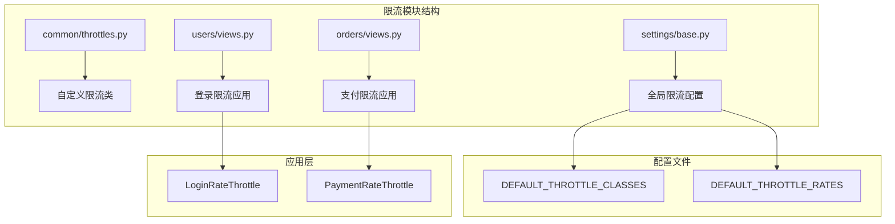
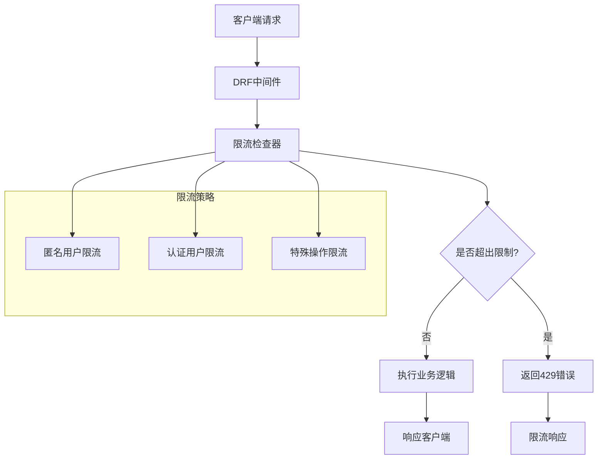
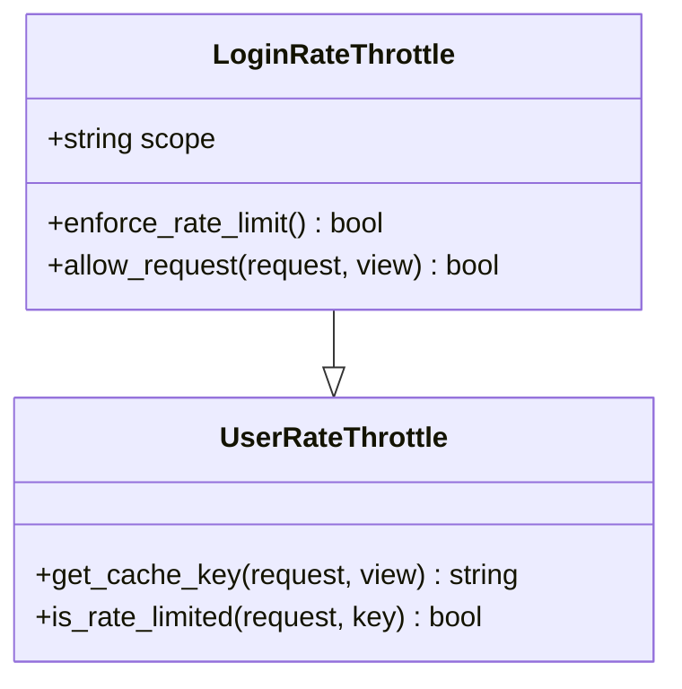
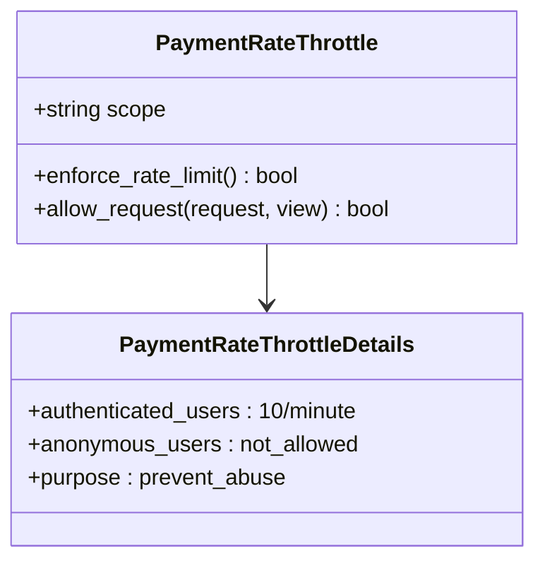
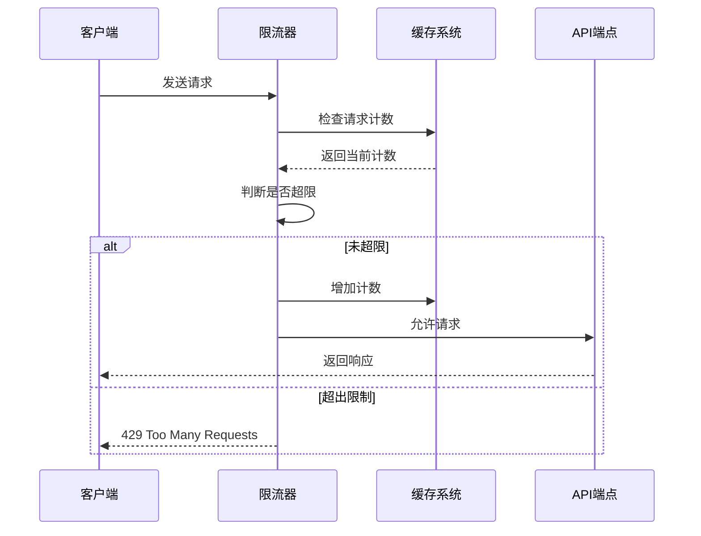
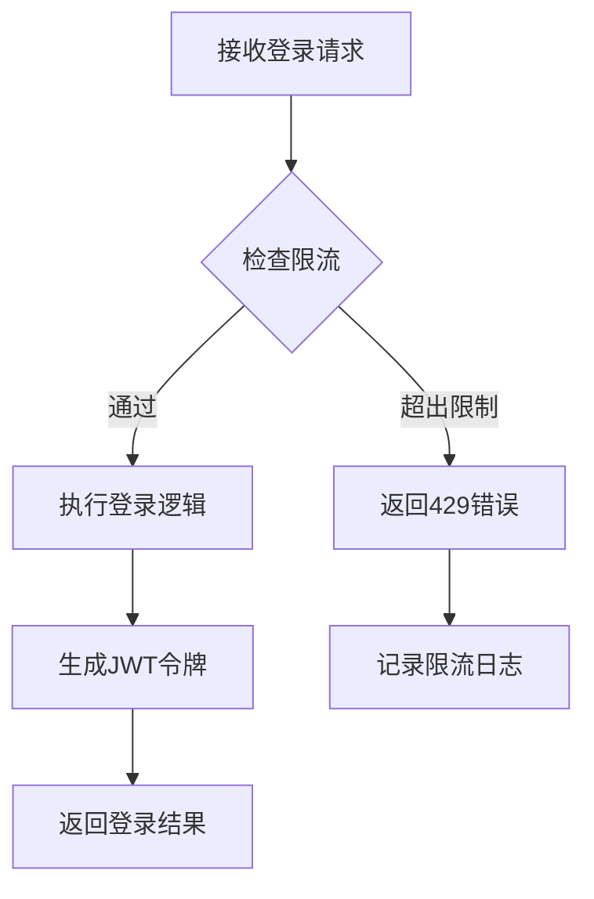
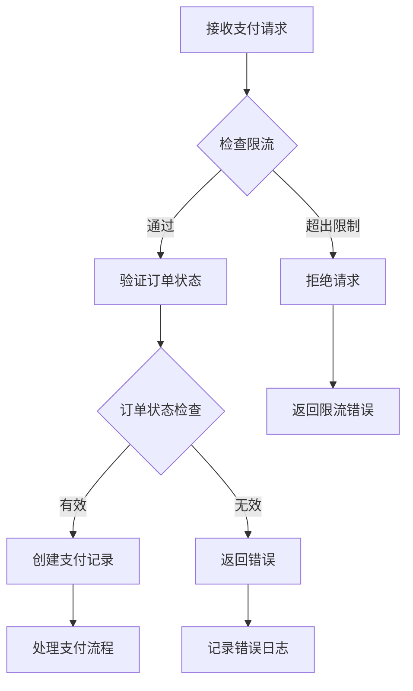
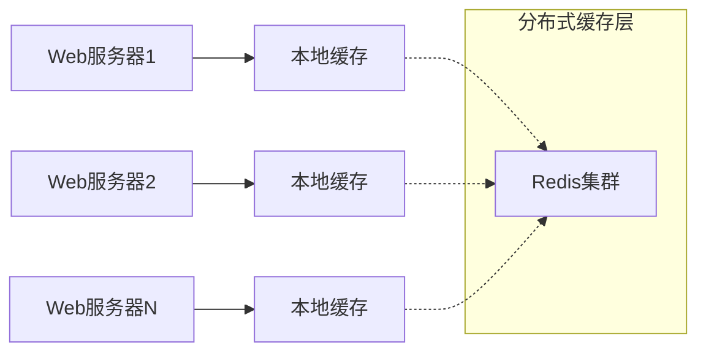
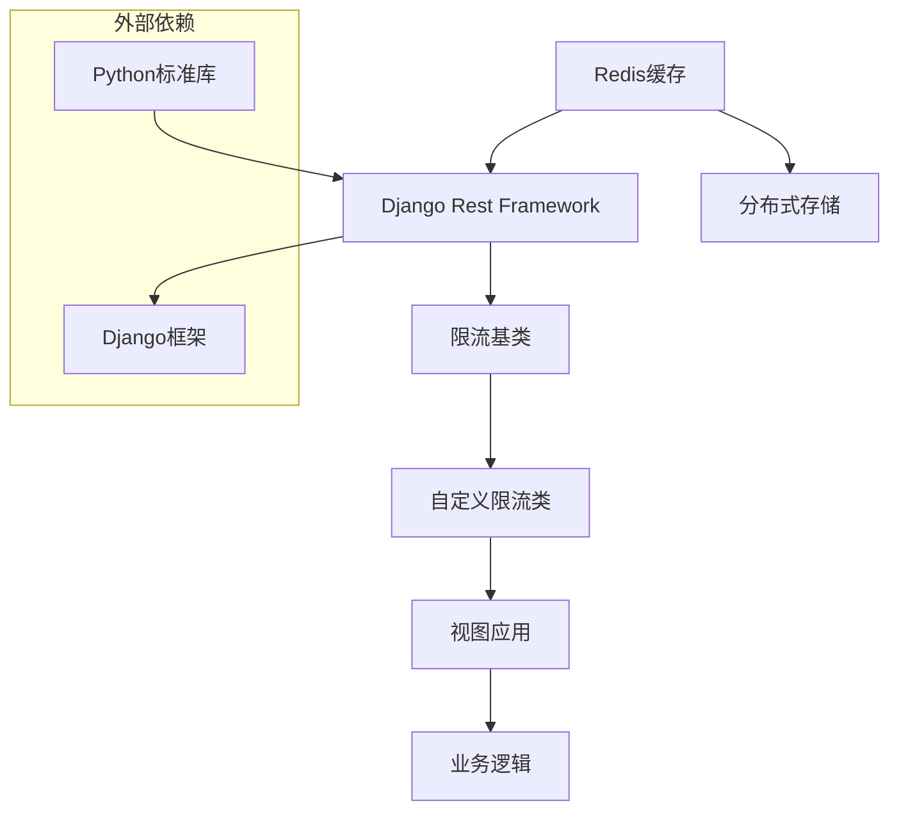

# 请求限流模块

<cite>
**本文档中引用的文件**
- [backend/common/throttles.py](file://backend/common/throttles.py)
- [backend/backend/settings/base.py](file://backend/backend/settings/base.py)
- [backend/users/views.py](file://backend/users/views.py)
- [backend/orders/views.py](file://backend/orders/views.py)
- [backend/users/services.py](file://backend/users/services.py)
- [backend/backend/settings/production.py](file://backend/backend/settings/production.py)
- [backend/backend/settings/development.py](file://backend/backend/settings/development.py)
- [backend/pyproject.toml](file://backend/pyproject.toml)
</cite>

## 目录
1. [简介](#简介)
2. [项目结构](#项目结构)
3. [核心组件](#核心组件)
4. [架构概览](#架构概览)
5. [详细组件分析](#详细组件分析)
6. [依赖关系分析](#依赖关系分析)
7. [性能考虑](#性能考虑)
8. [故障排除指南](#故障排除指南)
9. [结论](#结论)

## 简介

本文档详细介绍了Electric Miniprogram项目中的请求限流模块。该模块基于Django Rest Framework (DRF) 的限流机制，提供了多层次、可定制的API访问控制策略，有效防止滥用和DDoS攻击，确保系统的稳定性和安全性。

限流模块的核心目标是：
- 防止恶意用户通过高频请求攻击系统
- 保护敏感操作（如登录、支付）免受暴力破解
- 提供灵活的速率控制策略
- 支持分布式部署场景

## 项目结构

限流模块在项目中的组织结构如下：

**图表来源**
- [backend/common/throttles.py](file://backend/common/throttles.py#L1-L78)
- [backend/backend/settings/base.py](file://backend/backend/settings/base.py#L33-L62)

**章节来源**
- [backend/common/throttles.py](file://backend/common/throttles.py#L1-L78)
- [backend/backend/settings/base.py](file://backend/backend/settings/base.py#L1-L263)

## 核心组件

### 自定义限流类

项目实现了四个专门的限流类，每个都针对特定的业务场景进行了优化：

1. **LoginRateThrottle**: 登录接口专用限流
2. **PaymentRateThrottle**: 支付相关接口专用限流  
3. **AnonLoginRateThrottle**: 匿名用户登录限流
4. **AnonPaymentRateThrottle**: 匿名用户支付限流

### 速率限制表达式

系统支持多种时间粒度的速率限制表达式：

| 表达式格式 | 示例 | 含义 |
|-----------|------|------|
| `{数字}/{时间单位}` | `5/minute` | 每分钟最多5次请求 |
| `{数字}/hour` | `100/hour` | 每小时最多100次请求 |
| `{数字}/day` | `1000/day` | 每天最多1000次请求 |

**章节来源**
- [backend/common/throttles.py](file://backend/common/throttles.py#L11-L77)
- [backend/backend/settings/base.py](file://backend/backend/settings/base.py#L48-L53)

## 架构概览

限流模块采用分层架构设计，从底层到顶层包括：

**图表来源**
- [backend/backend/settings/base.py](file://backend/backend/settings/base.py#L44-L47)
- [backend/common/throttles.py](file://backend/common/throttles.py#L11-L77)

## 详细组件分析

### 自定义限流策略实现

#### LoginRateThrottle - 登录限流策略

**图表来源**
- [backend/common/throttles.py](file://backend/common/throttles.py#L11-L30)

LoginRateThrottle的特点：
- **严格限制**: 匿名和认证用户均为5次/分钟
- **防暴力破解**: 有效防止登录尝试的暴力攻击
- **统一策略**: 对所有登录场景应用相同限制

#### PaymentRateThrottle - 支付限流策略

**图表来源**
- [backend/common/throttles.py](file://backend/common/throttles.py#L32-L52)

PaymentRateThrottle的设计原则：
- **更严格的限制**: 认证用户10次/分钟
- **匿名访问禁用**: 支付操作必须经过身份验证
- **防止重复支付**: 保护用户免受意外重复支付的影响

#### 匿名用户限流策略

**图表来源**
- [backend/common/throttles.py](file://backend/common/throttles.py#L54-L77)

**章节来源**
- [backend/common/throttles.py](file://backend/common/throttles.py#L11-L77)

### 限流配置与应用

#### 全局限流配置

系统在基础设置中定义了默认的限流策略：

| 配置项 | 值 | 说明 |
|--------|-----|------|
| DEFAULT_THROTTLE_CLASSES | AnonRateThrottle, UserRateThrottle | 默认启用的限流类 |
| anon | 20/minute | 匿名用户的默认速率限制 |
| user | 100/minute | 认证用户的默认速率限制 |
| login | 5/minute | 登录操作的特殊限制 |
| payment | 10/minute | 支付操作的特殊限制 |

#### 视图级别限流应用

##### 登录接口限流

**图表来源**
- [backend/users/views.py](file://backend/users/views.py#L41-L43)

##### 支付接口限流

**图表来源**
- [backend/orders/views.py](file://backend/orders/views.py#L794-L795)

**章节来源**
- [backend/backend/settings/base.py](file://backend/backend/settings/base.py#L44-L53)
- [backend/users/views.py](file://backend/users/views.py#L41-L43)
- [backend/orders/views.py](file://backend/orders/views.py#L794-L795)

### 分布式限流支持

#### Redis缓存集成

虽然当前项目主要使用本地内存缓存，但系统架构支持分布式缓存：

#### 多维度限流策略

系统支持基于以下维度的限流：

1. **用户维度**: 基于用户ID的限流
2. **IP维度**: 基于客户端IP的限流  
3. **API维度**: 基于不同API端点的限流
4. **时间维度**: 不同时段的不同限制

**章节来源**
- [backend/backend/settings/base.py](file://backend/backend/settings/base.py#L215-L221)

## 依赖关系分析

限流模块的依赖关系图：

**图表来源**
- [backend/pyproject.toml](file://backend/pyproject.toml#L8-L18)
- [backend/common/throttles.py](file://backend/common/throttles.py#L8)

**章节来源**
- [backend/pyproject.toml](file://backend/pyproject.toml#L1-L23)
- [backend/common/throttles.py](file://backend/common/throttles.py#L8)

## 性能考虑

### 缓存策略优化

1. **本地缓存**: 开发环境中使用内存缓存，性能优异
2. **分布式缓存**: 生产环境可通过Redis实现分布式限流
3. **缓存失效**: 合理设置缓存过期时间，避免内存泄漏

### 限流算法效率

- **滑动窗口算法**: 支持精确的时间窗口控制
- **令牌桶算法**: 平滑处理突发流量
- **漏桶算法**: 保证请求的均匀性

### 监控与告警

系统应监控以下指标：
- 限流触发频率
- 缓存命中率
- 平均响应时间
- 异常请求模式

## 故障排除指南

### 常见问题及解决方案

#### 限流误触发

**问题描述**: 正常用户被错误地限流

**解决方案**:
1. 检查限流阈值设置是否过于严格
2. 验证缓存配置是否正确
3. 检查用户标识是否唯一

#### 跨服务限流不一致

**问题描述**: 在负载均衡环境下，不同服务器的限流状态不一致

**解决方案**:
1. 使用Redis等分布式缓存
2. 统一用户标识策略
3. 实现限流状态同步机制

#### 限流配置失效

**问题描述**: 设置的限流规则没有生效

**排查步骤**:
1. 检查是否正确应用了限流装饰器
2. 验证配置文件中的限流设置
3. 确认中间件加载顺序

**章节来源**
- [backend/common/throttles.py](file://backend/common/throttles.py#L11-L77)

## 结论

Electric Miniprogram项目的请求限流模块提供了全面而灵活的API保护机制。通过自定义限流策略、合理的配置管理和良好的扩展性设计，该模块能够有效应对各种流量威胁，确保系统的稳定运行。

### 主要优势

1. **多层次保护**: 从全局到具体端点的全方位限流
2. **灵活配置**: 支持多种时间粒度和限流策略
3. **易于扩展**: 良好的代码结构便于添加新的限流类型
4. **性能优化**: 基于缓存的高效实现

### 最佳实践建议

1. **合理设置阈值**: 根据业务特点调整限流参数
2. **监控关键指标**: 建立完善的限流监控体系
3. **定期评估策略**: 根据实际使用情况优化限流配置
4. **准备应急预案**: 制定限流异常的处理预案

通过持续的优化和完善，该限流模块将为项目的安全稳定运行提供强有力的保障。