# 家电商城后端系统概述

<cite>
**本文档引用的文件**
- [backend/backend/settings/base.py](file://backend/backend/settings/base.py)
- [backend/backend/urls.py](file://backend/backend/urls.py)
- [backend/catalog/views.py](file://backend/catalog/views.py)
- [backend/users/views.py](file://backend/users/views.py)
- [backend/orders/views.py](file://backend/orders/views.py)
- [backend/common/permissions.py](file://backend/common/permissions.py)
- [backend/common/throttles.py](file://backend/common/throttles.py)
- [backend/common/pagination.py](file://backend/common/pagination.py)
- [backend/integrations/urls.py](file://backend/integrations/urls.py)
- [backend/catalog/urls.py](file://backend/catalog/urls.py)
- [backend/catalog/models.py](file://backend/catalog/models.py)
- [backend/users/models.py](file://backend/users/models.py)
- [backend/orders/models.py](file://backend/orders/models.py)
- [backend/integrations/models.py](file://backend/integrations/models.py)
</cite>

## 目录
1. [系统简介](#系统简介)
2. [技术架构](#技术架构)
3. [核心模块分析](#核心模块分析)
4. [认证与授权机制](#认证与授权机制)
5. [API设计与文档](#api设计与文档)
6. [数据流与集成](#数据流与集成)
7. [性能优化策略](#性能优化策略)
8. [错误处理与监控](#错误处理与监控)
9. [部署与运维](#部署与运维)
10. [总结](#总结)

## 系统简介

家电商城后端系统是一个基于Django REST Framework构建的企业级电商平台，专门为微信小程序和商户管理后台提供API服务。系统采用现代化的微服务架构设计，支持商品管理、用户认证、订单处理、支付集成等核心业务功能。

### 主要特性

- **多用户认证体系**：支持微信小程序OAuth和传统用户名密码登录
- **智能权限控制**：基于角色的访问控制（RBAC），支持读写分离
- **高性能API设计**：RESTful架构，支持分页、过滤、排序
- **实时数据同步**：与海尔ERP系统集成，实现商品、价格、库存实时同步
- **完善的限流机制**：针对不同操作类型实施差异化速率限制
- **自动化文档生成**：基于drf-spectacular的API文档系统

## 技术架构

### 整体架构图

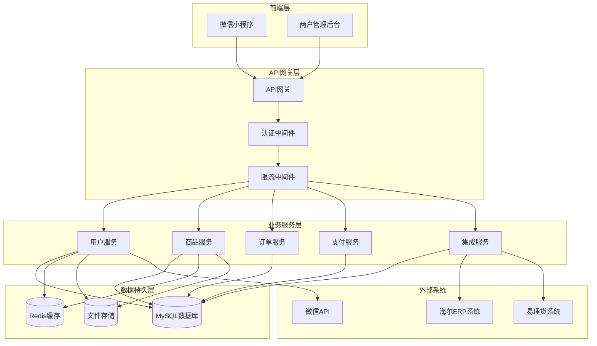

**架构图来源**
- [backend/backend/settings/base.py](file://backend/backend/settings/base.py#L11-L30)
- [backend/backend/urls.py](file://backend/backend/urls.py#L24-L48)

### 核心技术栈

| 组件 | 技术选择 | 版本要求 | 用途说明 |
|------|----------|----------|----------|
| Web框架 | Django | 5.2+ | 提供Web服务器和ORM支持 |
| API框架 | Django REST Framework | 3.14+ | 构建RESTful API |
| 认证机制 | JWT (SimpleJWT) | 5.2+ | 无状态认证方案 |
| 文档生成 | drf-spectacular | 0.24+ | 自动生成API文档 |
| 数据库 | MySQL | 8.0+ | 主数据存储 |
| 缓存 | Redis | 6.0+ | 会话和热点数据缓存 |
| 文件存储 | 自定义存储 | - | 商品图片和文档存储 |
| CORS | django-cors-headers | 4.0+ | 跨域资源共享支持 |

**章节来源**
- [backend/backend/settings/base.py](file://backend/backend/settings/base.py#L11-L30)

## 核心模块分析

### 商品目录模块 (Catalog)

商品目录模块是系统的核心业务模块，负责商品信息管理、分类管理和品牌管理。

#### 数据模型设计

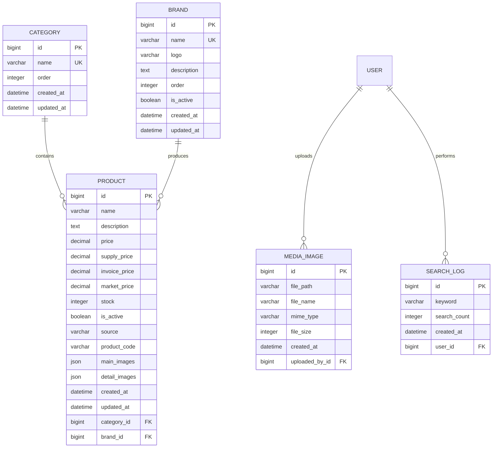

**图表来源**
- [backend/catalog/models.py](file://backend/catalog/models.py#L5-L200)
- [backend/users/models.py](file://backend/users/models.py#L77-L95)

#### 核心功能特性

1. **智能搜索系统**
   - 支持关键词模糊匹配
   - 多维度筛选（品类、品牌、价格区间）
   - 智能排序算法（销量、价格、浏览量、相关性）

2. **商品来源管理**
   - 本地商品：系统自主维护
   - 海尔商品：通过API实时同步
   - 混合管理模式

3. **媒体资源管理**
   - 安全的文件上传机制
   - 自动化的文件名生成
   - 支持多种图片格式转换

**章节来源**
- [backend/catalog/views.py](file://backend/catalog/views.py#L28-L800)

### 用户认证模块 (Users)

用户认证模块提供双重认证体系，支持微信小程序OAuth和传统用户名密码登录。

#### 认证流程图

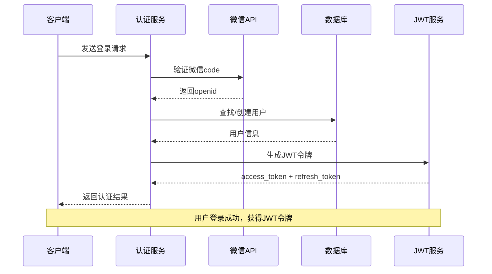

**图表来源**
- [backend/users/views.py](file://backend/users/views.py#L22-L154)

#### 双重认证机制

| 认证方式 | 适用场景 | 安全特性 | 性能特点 |
|----------|----------|----------|----------|
| 微信OAuth | 小程序用户 | 一次授权，长期有效 | 适合移动端应用 |
| 用户名密码 | 管理员后台 | 强密码策略，定期刷新 | 适合PC端管理 |

**章节来源**
- [backend/users/views.py](file://backend/users/views.py#L161-L233)

### 订单管理系统 (Orders)

订单管理系统实现了完整的电商订单生命周期管理，支持多种状态流转和复杂的业务规则。

#### 订单状态机

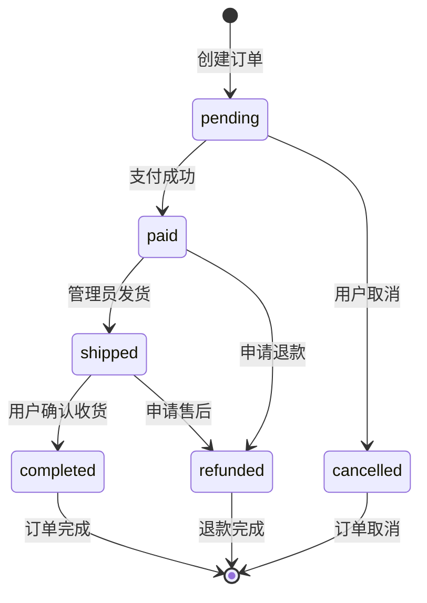

**图表来源**
- [backend/orders/models.py](file://backend/orders/models.py#L13-L22)

#### 核心业务功能

1. **订单创建与管理**
   - 支持单商品和批量订单
   - 自动计算优惠和税费
   - 智能库存扣减

2. **支付集成**
   - 微信支付原生支持
   - 支付状态实时同步
   - 重复支付防护

3. **物流跟踪**
   - 海尔ERP系统对接
   - 实时物流信息更新
   - 多渠道物流查询

**章节来源**
- [backend/orders/views.py](file://backend/orders/views.py#L23-L800)

## 认证与授权机制

### JWT认证体系

系统采用JWT（JSON Web Token）作为主要认证机制，提供无状态的认证解决方案。

#### JWT配置详解

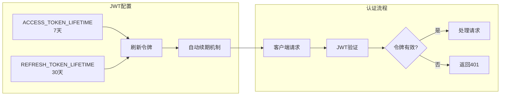

**图表来源**
- [backend/backend/settings/base.py](file://backend/backend/settings/base.py#L142-L146)

### 权限控制层次

系统实现了多层次的权限控制体系：

#### 权限类继承关系

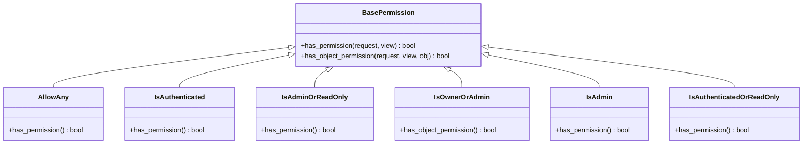

**图表来源**
- [backend/common/permissions.py](file://backend/common/permissions.py#L12-L189)

#### 权限应用场景

| 权限类 | 应用场景 | 访问控制 |
|--------|----------|----------|
| AllowAny | 公开API | 所有用户均可访问 |
| IsAuthenticated | 用户私有数据 | 已认证用户可访问 |
| IsAdminOrReadOnly | 管理界面 | 管理员完全访问，普通用户只读 |
| IsOwnerOrAdmin | 用户数据隔离 | 用户只能访问自己的数据，管理员可访问所有 |
| IsAdmin | 系统管理 | 仅管理员可访问 |

**章节来源**
- [backend/common/permissions.py](file://backend/common/permissions.py#L12-L189)

## API设计与文档

### RESTful设计原则

系统严格遵循RESTful API设计原则，提供一致且可预测的接口规范。

#### API版本管理

```mermaid
graph TD
A[API版本策略] --> B[向后兼容]
A --> C[语义化版本]
A --> D[废弃通知]
B --> E[现有端点继续支持]
C --> F[v1, v2等版本标识]
D --> G[提前公告废弃计划]
H[当前版本] --> I[API v1]
I --> J[/catalog/products]
I --> K[/api/v1/orders]
I --> L[/api/v1/users]
M[向后兼容端点] --> N[api/catalog/]
N --> O[保持原有路径]
```

**图表来源**
- [backend/backend/urls.py](file://backend/backend/urls.py#L35-L47)

### drf-spectacular文档系统

系统集成了drf-spectacular，自动生成高质量的API文档。

#### 文档特性

| 特性 | 描述 | 实现方式 |
|------|------|----------|
| 自动化生成 | 基于代码注解自动生成 | @extend_schema装饰器 |
| Swagger UI | 在线交互式文档 | SpectacularSwaggerView |
| Redoc支持 | 现代化文档界面 | SpectacularRedocView |
| 认证集成 | 支持JWT认证演示 | AUTHENTICATION_FLOWS配置 |
| 标签分类 | 按功能模块组织 | TAGS配置 |

#### API文档结构

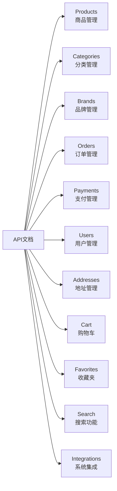

**图表来源**
- [backend/backend/settings/base.py](file://backend/backend/settings/base.py#L65-L140)

**章节来源**
- [backend/backend/settings/base.py](file://backend/backend/settings/base.py#L65-L140)
- [backend/backend/urls.py](file://backend/backend/urls.py#L24-L48)

## 数据流与集成

### 外部系统集成架构

系统与多个外部系统建立了深度集成，确保数据的一致性和实时性。

#### 集成系统关系图

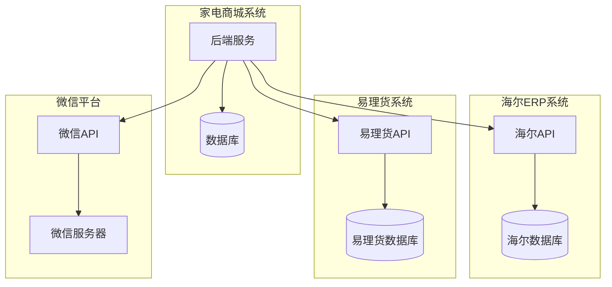

**图表来源**
- [backend/backend/settings/base.py](file://backend/backend/settings/base.py#L236-L263)

### 数据同步策略

#### 海尔商品数据同步

| 同步类型 | 触发条件 | 数据范围 | 同步频率 |
|----------|----------|----------|----------|
| 商品信息 | 新增商品时 | 基础商品信息 | 实时 |
| 价格信息 | 定时任务 | 价格、促销政策 | 每小时 |
| 库存信息 | 订单状态变更 | 库存数量、可用状态 | 实时 |
| 订单状态 | 海尔回调 | 订单状态、物流信息 | 实时 |

#### 数据同步流程

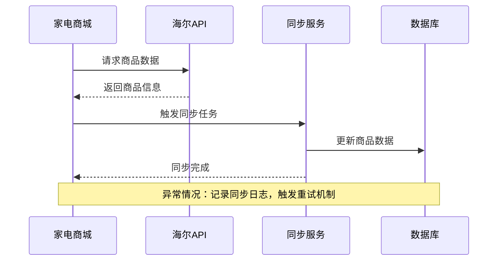

**图表来源**
- [backend/catalog/views.py](file://backend/catalog/views.py#L435-L565)

**章节来源**
- [backend/backend/settings/base.py](file://backend/backend/settings/base.py#L236-L263)
- [backend/integrations/models.py](file://backend/integrations/models.py#L1-L150)

## 性能优化策略

### 分页与查询优化

系统实现了多层次的性能优化策略，确保在大数据量下的良好性能。

#### 分页策略

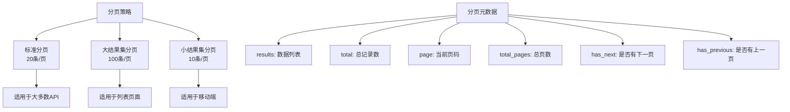

**图表来源**
- [backend/common/pagination.py](file://backend/common/pagination.py#L8-L99)

#### 查询优化技术

| 优化技术 | 应用场景 | 性能提升 |
|----------|----------|----------|
| select_related | 外键关联查询 | 减少N+1查询问题 |
| prefetch_related | 多对多关联查询 | 批量加载相关数据 |
| 索引优化 | 频繁查询字段 | 加速WHERE条件查询 |
| 缓存策略 | 热点数据 | 减少数据库访问 |
| 分页查询 | 大数据集展示 | 控制内存使用 |

### 限流机制

系统实现了差异化的限流策略，保护系统资源并防止恶意攻击。

#### 限流配置

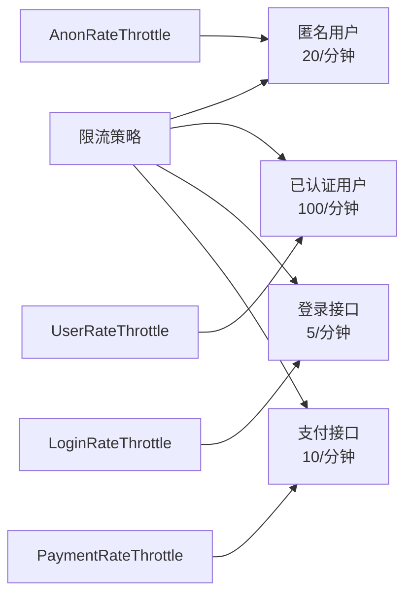

**图表来源**
- [backend/common/throttles.py](file://backend/common/throttles.py#L11-L78)

**章节来源**
- [backend/common/pagination.py](file://backend/common/pagination.py#L8-L99)
- [backend/common/throttles.py](file://backend/common/throttles.py#L11-L78)

## 错误处理与监控

### 异常处理机制

系统实现了统一的异常处理机制，提供清晰的错误信息和适当的HTTP状态码。

#### 异常处理流程

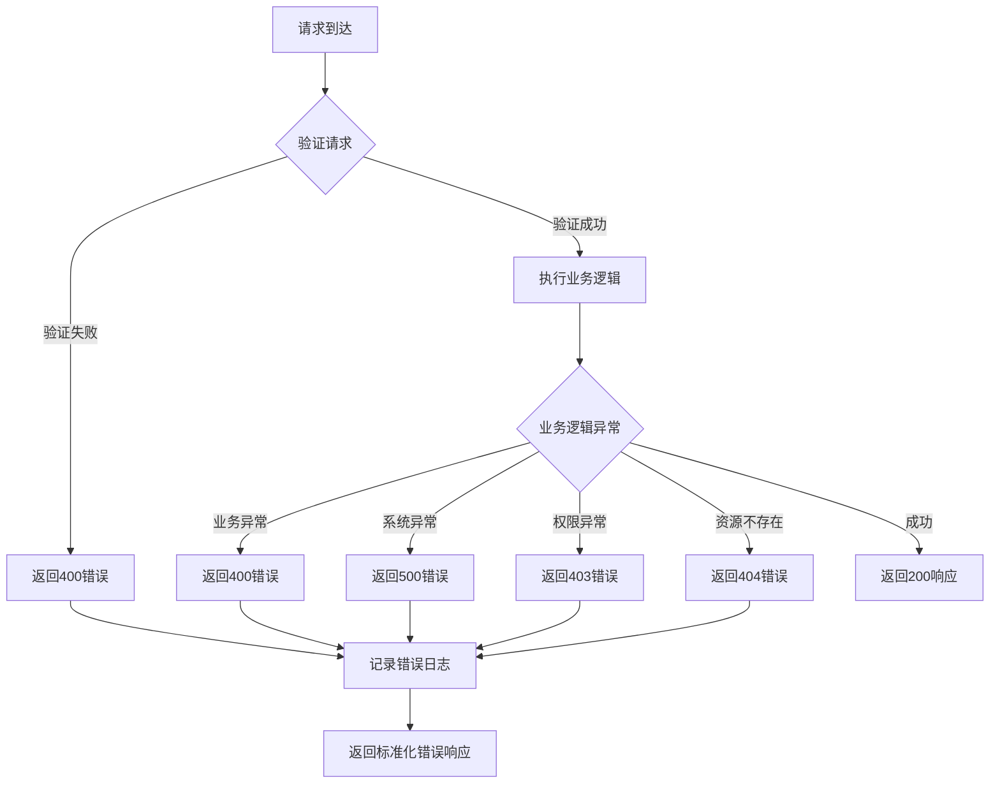

### 日志监控体系

| 监控层级 | 监控内容 | 记录级别 | 存储位置 |
|----------|----------|----------|----------|
| 应用层 | 业务操作日志 | INFO/WARNING | 应用日志文件 |
| 错误层 | 异常堆栈信息 | ERROR | 错误日志文件 |
| 性能层 | 接口响应时间 | DEBUG | 性能监控系统 |
| 安全日志 | 认证授权事件 | INFO | 安全日志文件 |

**章节来源**
- [backend/backend/settings/base.py](file://backend/backend/settings/base.py#L224-L226)

## 部署与运维

### 环境配置

系统支持多环境部署，包括开发、测试和生产环境。

#### 环境配置对比

| 配置项 | 开发环境 | 生产环境 | 说明 |
|--------|----------|----------|------|
| DEBUG | True | False | 调试模式开关 |
| ALLOWED_HOSTS | * | 域名列表 | 安全域名白名单 |
| SECRET_KEY | 随机生成 | 环境变量 | 密钥安全性 |
| DATABASES | SQLite | MySQL | 数据库类型 |
| STATICFILES_STORAGE | 默认 | CDN存储 | 静态文件优化 |
| CORS配置 | 允许所有 | 限制域名 | 跨域安全 |

### 健康检查

系统提供了完整的健康检查机制，支持容器化部署和云平台监控。

#### 健康检查端点

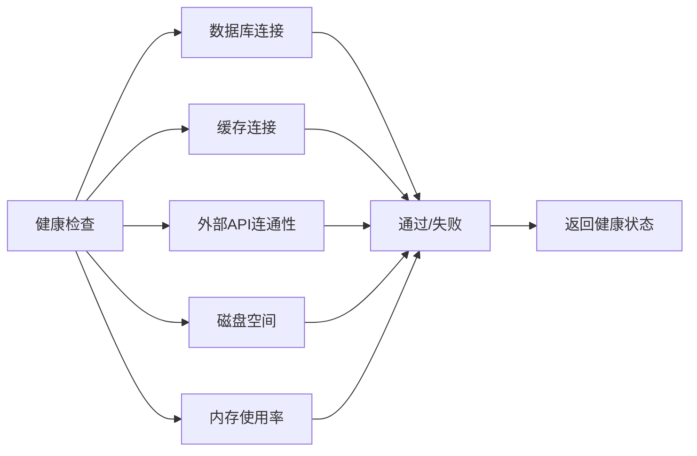

**章节来源**
- [backend/backend/settings/base.py](file://backend/backend/settings/base.py#L1-L263)
- [backend/backend/urls.py](file://backend/backend/urls.py#L27-L29)

## 总结

家电商城后端系统是一个功能完整、架构合理的电商平台解决方案。系统的主要优势包括：

### 技术优势

1. **现代化架构**：采用Django REST Framework构建，符合现代Web开发最佳实践
2. **完善的认证体系**：支持多种认证方式，满足不同场景需求
3. **智能权限控制**：基于角色的访问控制，确保数据安全
4. **高性能设计**：多层次性能优化，支持高并发访问
5. **自动化文档**：基于drf-spectacular的API文档系统

### 业务价值

1. **多渠道支持**：同时服务于微信小程序和商户管理后台
2. **实时数据同步**：与海尔ERP系统深度集成，确保数据一致性
3. **灵活扩展性**：模块化设计，便于功能扩展和维护
4. **稳定可靠性**：完善的错误处理和监控机制

### 发展方向

1. **微服务化改造**：将现有模块进一步拆分为独立的服务
2. **容器化部署**：基于Docker和Kubernetes的容器化部署
3. **API版本管理**：建立更加完善的API版本控制机制
4. **性能监控**：引入APM工具，实现更细粒度的性能监控

该系统为家电商城提供了坚实的技术基础，能够支撑业务的持续发展和扩展。