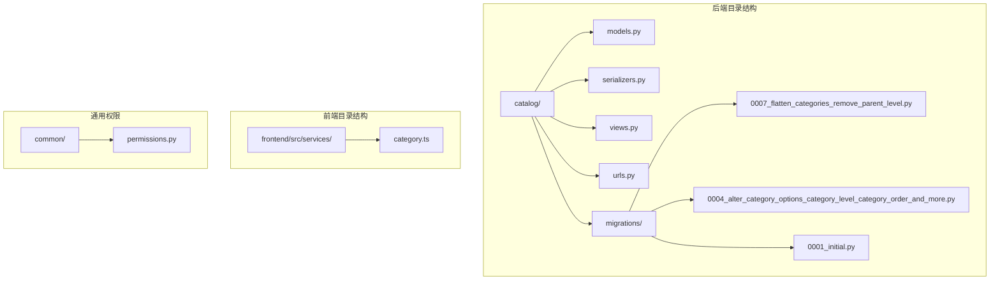
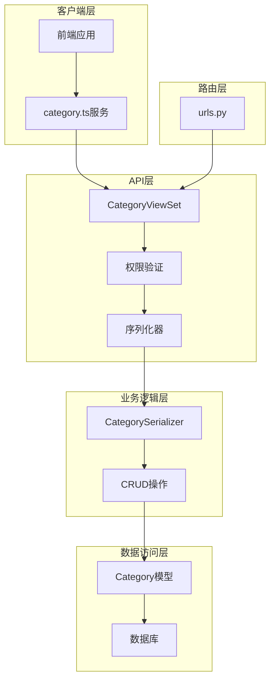
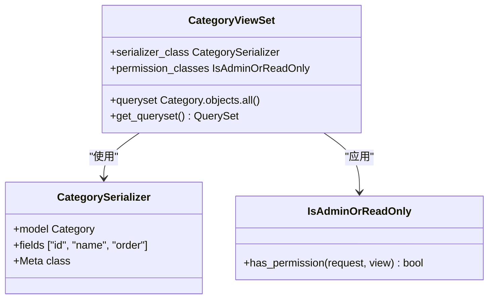
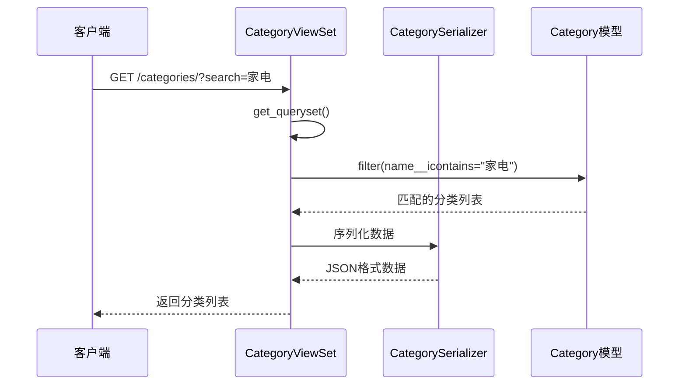
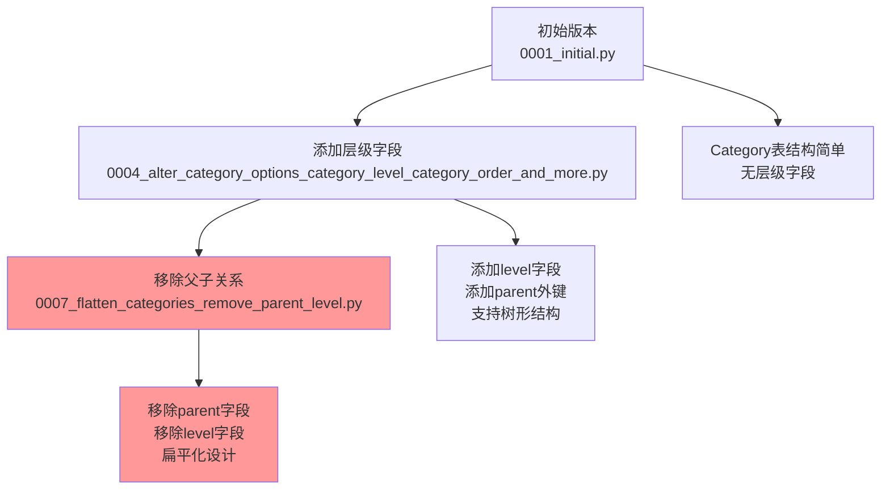
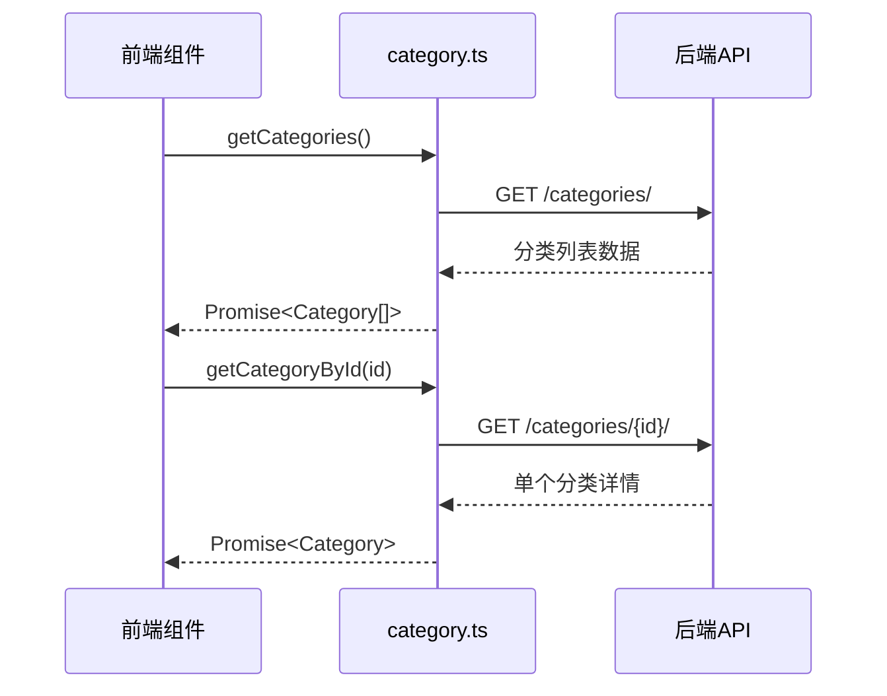
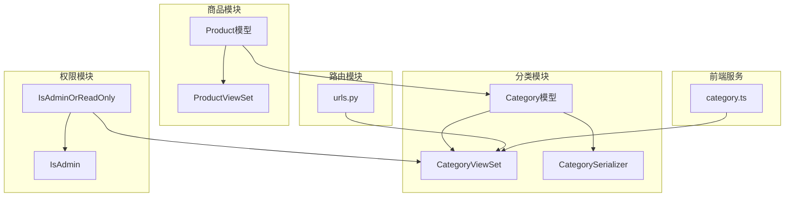

# 分类管理

<cite>
**本文档中引用的文件**
- [backend/catalog/models.py](file://backend/catalog/models.py)
- [backend/catalog/serializers.py](file://backend/catalog/serializers.py)
- [backend/catalog/views.py](file://backend/catalog/views.py)
- [backend/catalog/migrations/0007_flatten_categories_remove_parent_level.py](file://backend/catalog/migrations/0007_flatten_categories_remove_parent_level.py)
- [backend/catalog/migrations/0004_alter_category_options_category_level_category_order_and_more.py](file://backend/catalog/migrations/0004_alter_category_options_category_order_and_more.py)
- [backend/catalog/migrations/0001_initial.py](file://backend/catalog/migrations/0001_initial.py)
- [backend/catalog/urls.py](file://backend/catalog/urls.py)
- [backend/common/permissions.py](file://backend/common/permissions.py)
- [frontend/src/services/category.ts](file://frontend/src/services/category.ts)
</cite>

## 目录
1. [简介](#简介)
2. [项目结构](#项目结构)
3. [核心组件](#核心组件)
4. [架构概览](#架构概览)
5. [详细组件分析](#详细组件分析)
6. [依赖关系分析](#依赖关系分析)
7. [性能考虑](#性能考虑)
8. [故障排除指南](#故障排除指南)
9. [结论](#结论)

## 简介

分类管理是电商系统中的核心功能模块，负责组织和管理商品的分类体系。本文档详细介绍了基于Django框架的分类管理系统，包括Category模型的设计与实现、CRUD API接口、权限控制以及前端集成等方面的内容。

该系统采用扁平化的分类设计，通过专门的迁移脚本移除了传统的父子级关系，简化了分类结构的同时保持了良好的性能表现。

## 项目结构

分类管理模块位于`backend/catalog/`目录下，包含以下关键文件：

**图表来源**
- [backend/catalog/models.py](file://backend/catalog/models.py#L1-L312)
- [backend/catalog/serializers.py](file://backend/catalog/serializers.py#L1-L352)
- [backend/catalog/views.py](file://backend/catalog/views.py#L1-L980)
- [frontend/src/services/category.ts](file://frontend/src/services/category.ts#L1-L16)

**章节来源**
- [backend/catalog/models.py](file://backend/catalog/models.py#L1-L312)
- [backend/catalog/serializers.py](file://backend/catalog/serializers.py#L1-L352)
- [backend/catalog/views.py](file://backend/catalog/views.py#L1-L980)
- [backend/catalog/urls.py](file://backend/catalog/urls.py#L1-L15)

## 核心组件

### Category模型设计

Category模型是分类管理的核心数据结构，采用扁平化设计，主要包含以下字段：

| 字段名 | 类型 | 描述 | 默认值 | 约束 |
|--------|------|------|--------|------|
| id | BigAutoField | 主键标识符 | 自动生成 | 主键 |
| name | CharField | 分类名称 | '默认分类' | 长度最大100，唯一 |
| order | IntegerField | 排序权重 | 0 | 用于分类排序 |
| created_at | DateTimeField | 创建时间 | 自动设置 | 只读 |
| updated_at | DateTimeField | 更新时间 | 自动更新 | 只读 |

### 权限控制系统

系统实现了多层次的权限控制机制：

- **IsAdminOrReadOnly**: 允许所有用户读取，仅管理员可写入
- **IsAdmin**: 仅允许管理员访问
- **EnvironmentAwarePermission**: 基于环境的权限控制

**章节来源**
- [backend/catalog/models.py](file://backend/catalog/models.py#L5-L18)
- [backend/common/permissions.py](file://backend/common/permissions.py#L70-L100)

## 架构概览

分类管理系统采用RESTful API架构，遵循Django REST Framework的最佳实践：

**图表来源**
- [backend/catalog/views.py](file://backend/catalog/views.py#L567-L587)
- [backend/catalog/serializers.py](file://backend/catalog/serializers.py#L16-L20)
- [backend/catalog/urls.py](file://backend/catalog/urls.py#L6-L8)

## 详细组件分析

### CategoryViewSet实现

CategoryViewSet提供了完整的CRUD操作接口，继承自Django REST Framework的ModelViewSet：

**图表来源**
- [backend/catalog/views.py](file://backend/catalog/views.py#L567-L587)
- [backend/catalog/serializers.py](file://backend/catalog/serializers.py#L16-L20)
- [backend/common/permissions.py](file://backend/common/permissions.py#L70-L100)

#### 关键特性

1. **名称模糊搜索**: 通过`get_queryset()`方法实现`name__icontains`搜索
2. **排序功能**: 默认按`order`字段排序
3. **权限控制**: 应用`IsAdminOrReadOnly`权限

### 分类序列化器

CategorySerializer采用简洁的设计，只包含必要的字段：

**图表来源**
- [backend/catalog/views.py](file://backend/catalog/views.py#L580-L586)
- [backend/catalog/serializers.py](file://backend/catalog/serializers.py#L16-L20)

### 扁平化设计演进

分类系统经历了从层次化到扁平化的演进过程：

**图表来源**
- [backend/catalog/migrations/0001_initial.py](file://backend/catalog/migrations/0001_initial.py#L23-L37)
- [backend/catalog/migrations/0004_alter_category_options_category_level_category_order_and_more.py](file://backend/catalog/migrations/0004_alter_category_options_category_order_and_more.py#L14-L32)
- [backend/catalog/migrations/0007_flatten_categories_remove_parent_level.py](file://backend/catalog/migrations/0007_flatten_categories_remove_parent_level.py#L11-L18)

**章节来源**
- [backend/catalog/views.py](file://backend/catalog/views.py#L567-L587)
- [backend/catalog/serializers.py](file://backend/catalog/serializers.py#L16-L20)
- [backend/catalog/migrations/0007_flatten_categories_remove_parent_level.py](file://backend/catalog/migrations/0007_flatten_categories_remove_parent_level.py#L1-L19)

### 前端集成

前端通过专门的服务模块与后端API交互：

**图表来源**
- [frontend/src/services/category.ts](file://frontend/src/services/category.ts#L6-L14)

**章节来源**
- [frontend/src/services/category.ts](file://frontend/src/services/category.ts#L1-L16)

## 依赖关系分析

分类管理模块与其他系统组件存在以下依赖关系：

**图表来源**
- [backend/catalog/models.py](file://backend/catalog/models.py#L43-L47)
- [backend/catalog/views.py](file://backend/catalog/views.py#L567-L587)
- [backend/catalog/urls.py](file://backend/catalog/urls.py#L6-L8)

**章节来源**
- [backend/catalog/models.py](file://backend/catalog/models.py#L43-L47)
- [backend/catalog/views.py](file://backend/catalog/views.py#L567-L587)
- [backend/catalog/urls.py](file://backend/catalog/urls.py#L1-L15)

## 性能考虑

### 查询优化

1. **索引策略**: 在`order`字段上建立索引以加速排序查询
2. **预加载**: 使用`select_related`减少数据库查询次数
3. **缓存**: 对频繁访问的分类数据实施缓存策略

### 数据一致性

1. **级联删除**: 当删除分类时，系统会自动处理相关商品的分类引用
2. **事务管理**: 在批量操作中使用数据库事务确保数据完整性
3. **并发控制**: 通过数据库锁机制防止并发修改冲突

### 性能监控

系统提供了多种性能监控指标：
- 分类查询响应时间
- API调用频率统计
- 数据库查询执行计划分析

## 故障排除指南

### 常见问题及解决方案

#### 1. 分类删除时的级联操作

**问题**: 删除分类时出现外键约束错误

**解决方案**: 
- 系统自动处理相关商品的分类引用
- 如果需要强制删除，可通过API参数指定

#### 2. 分类排序不生效

**问题**: 修改分类顺序后排序结果不符合预期

**解决方案**:
- 检查`order`字段值是否正确设置
- 确认数据库索引已正确创建
- 清除相关缓存数据

#### 3. 模糊搜索性能问题

**问题**: 大量分类数据下的搜索响应缓慢

**解决方案**:
- 实施分页查询
- 优化数据库索引
- 考虑使用全文搜索引擎

### 调试技巧

1. **日志记录**: 启用详细的API调用日志
2. **数据库查询分析**: 使用Django Debug Toolbar监控SQL查询
3. **性能分析**: 利用Python的profiling工具分析瓶颈

**章节来源**
- [backend/catalog/views.py](file://backend/catalog/views.py#L580-L586)
- [backend/catalog/models.py](file://backend/catalog/models.py#L12-L15)

## 结论

分类管理模块展现了现代电商系统中数据模型设计的最佳实践。通过扁平化设计、完善的权限控制和高效的API接口，该系统在保证功能完整性的同时实现了良好的性能表现。

### 设计亮点

1. **简洁性**: 移除复杂的父子关系，简化了分类结构
2. **灵活性**: 支持动态排序和模糊搜索
3. **安全性**: 完善的权限控制机制
4. **可扩展性**: 模块化设计便于功能扩展

### 未来发展方向

1. **搜索优化**: 引入更高级的搜索算法
2. **缓存策略**: 实施多层缓存提升性能
3. **可视化管理**: 开发图形化的分类管理界面
4. **国际化支持**: 添加多语言分类名称支持

该分类管理系统为整个电商平台的商品组织和展示奠定了坚实的基础，是构建高质量电商平台的重要组成部分。