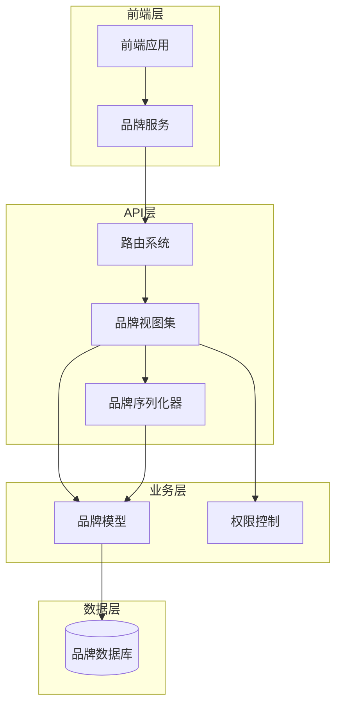
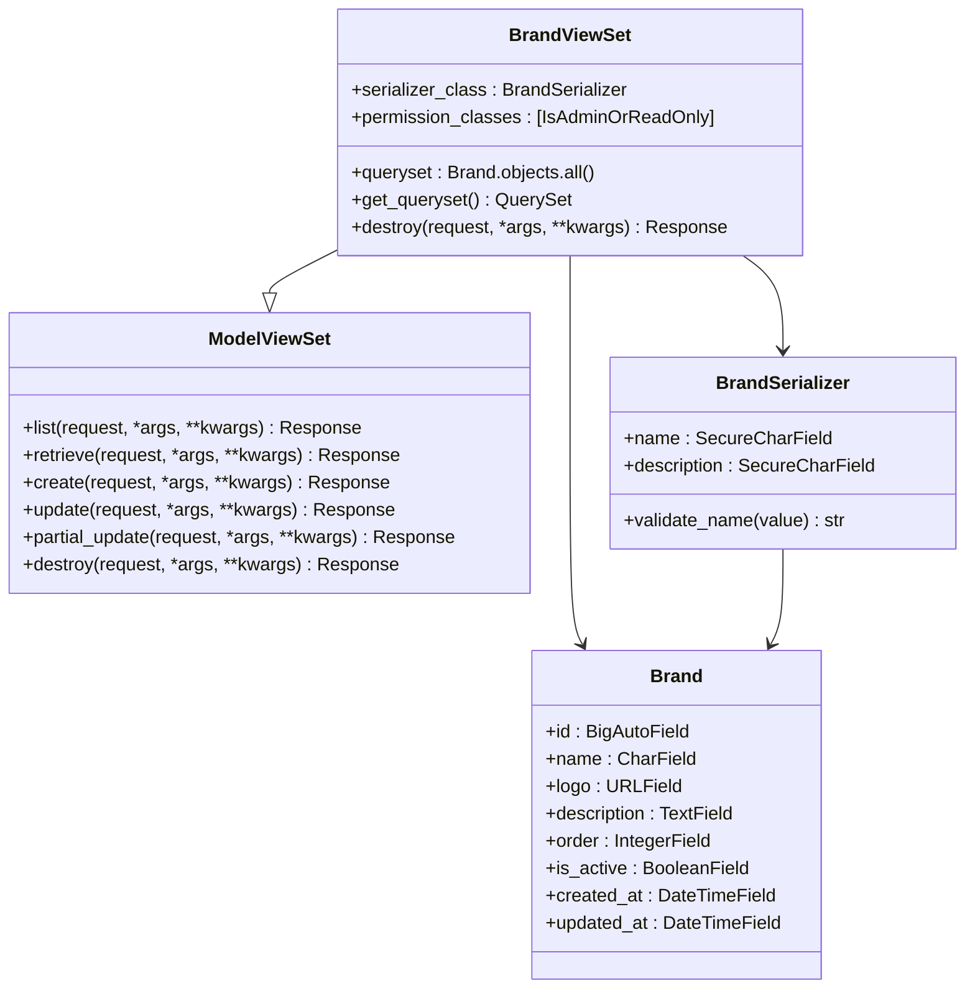
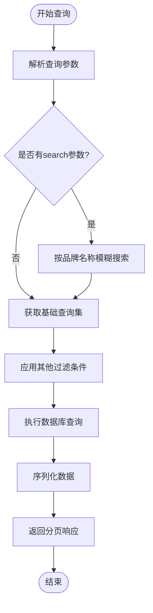
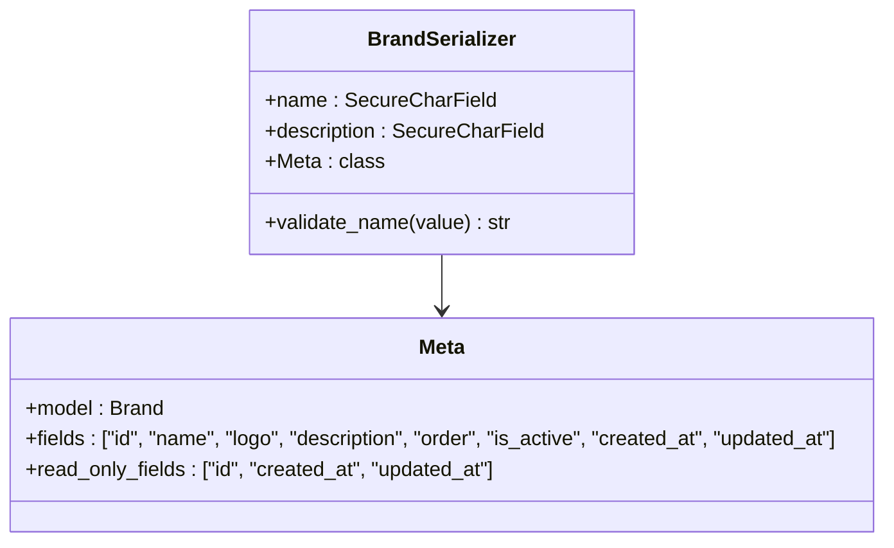
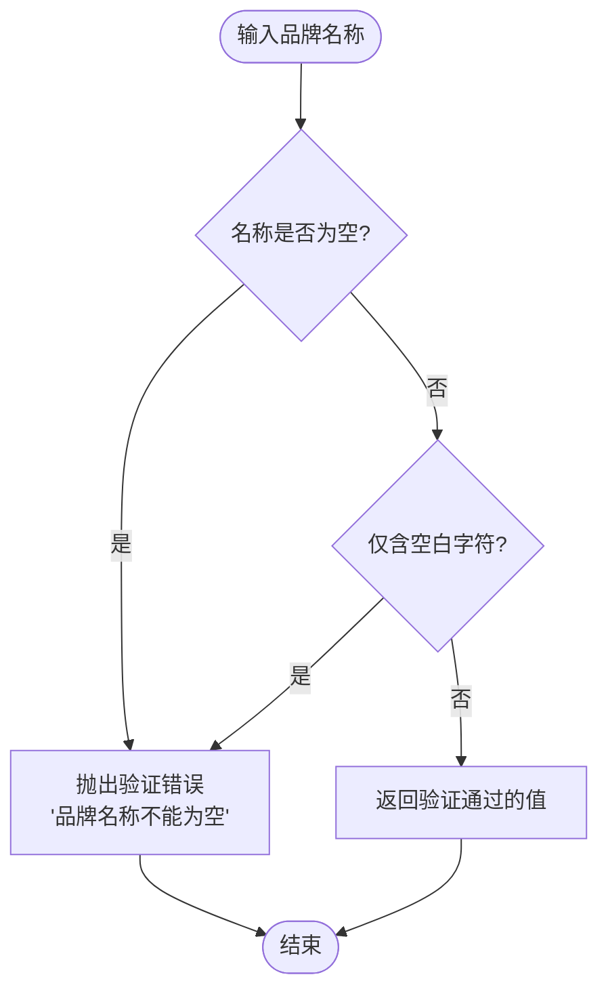
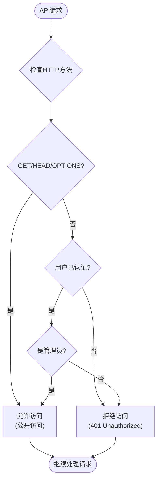
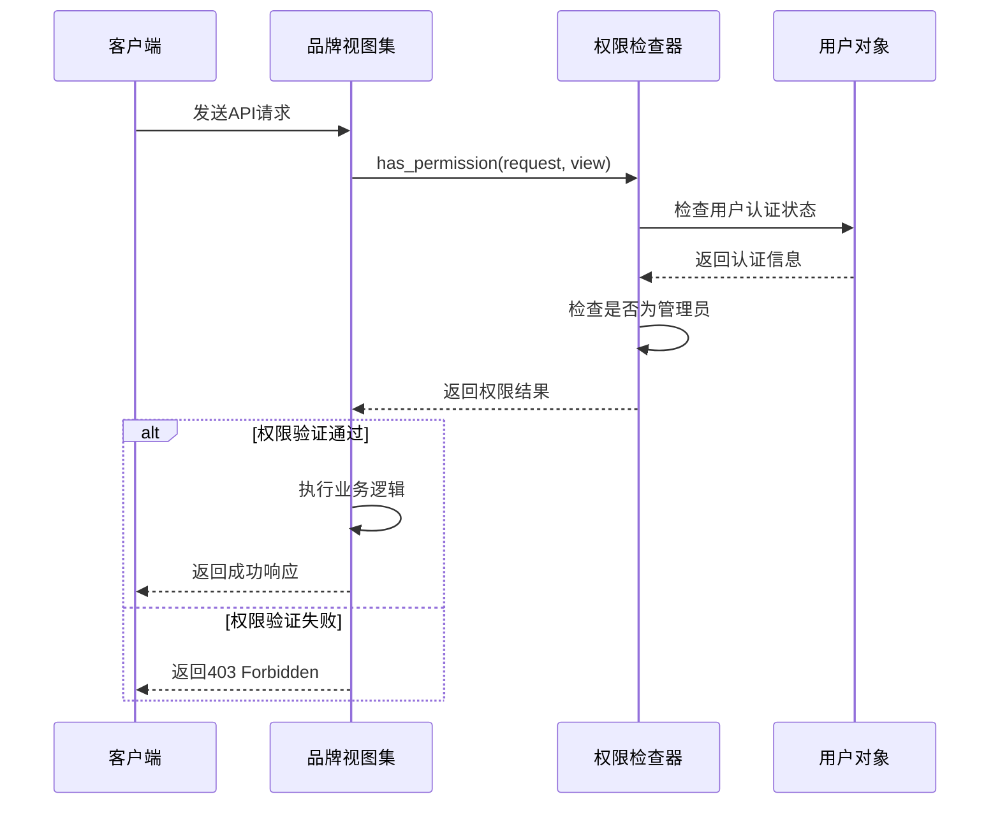
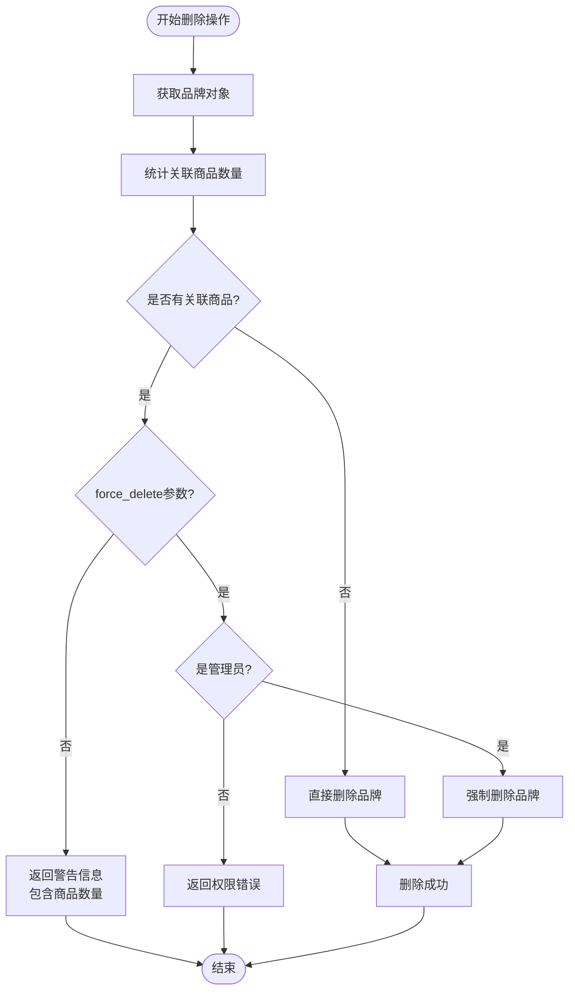
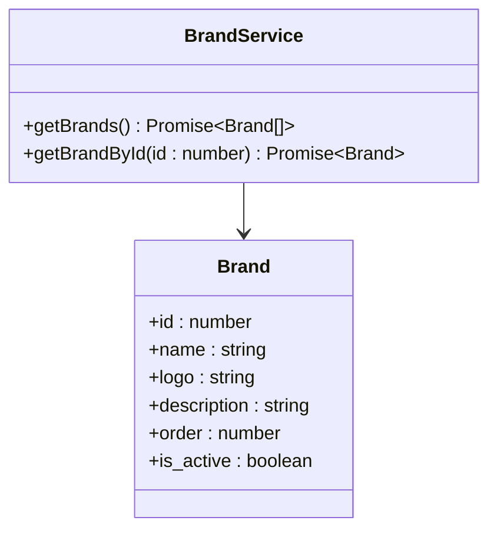
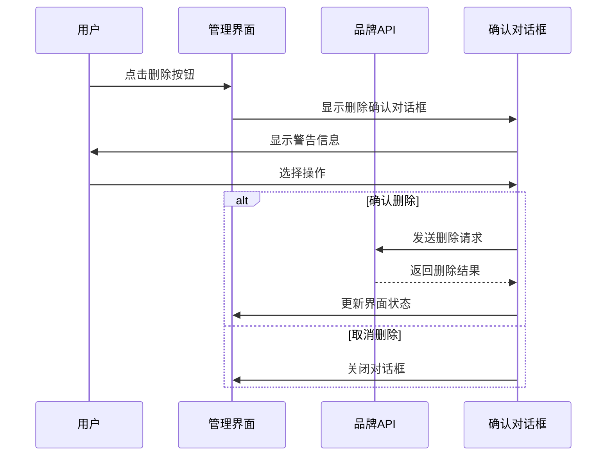

# 品牌API接口详细文档

<cite>
**本文档引用的文件**
- [backend/catalog/views.py](file://backend/catalog/views.py)
- [backend/catalog/serializers.py](file://backend/catalog/serializers.py)
- [backend/catalog/models.py](file://backend/catalog/models.py)
- [backend/catalog/urls.py](file://backend/catalog/urls.py)
- [backend/common/permissions.py](file://backend/common/permissions.py)
- [frontend/src/services/brand.ts](file://frontend/src/services/brand.ts)
- [frontend/src/types/index.ts](file://frontend/src/types/index.ts)
</cite>

## 目录
1. [简介](#简介)
2. [项目架构概览](#项目架构概览)
3. [核心组件分析](#核心组件分析)
4. [API接口详细说明](#api接口详细说明)
5. [序列化器详解](#序列化器详解)
6. [权限控制系统](#权限控制系统)
7. [删除保护机制](#删除保护机制)
8. [前端集成指南](#前端集成指南)
9. [常见问题与解决方案](#常见问题与解决方案)
10. [最佳实践建议](#最佳实践建议)

## 简介

品牌API接口是电商平台的核心功能模块之一，负责管理商品品牌的CRUD操作。该系统采用Django REST Framework构建，提供了完整的品牌管理功能，包括品牌创建、查询、更新、删除以及高级搜索功能。系统实现了严格的权限控制和数据保护机制，确保品牌数据的安全性和完整性。

## 项目架构概览



**图表来源**
- [backend/catalog/views.py](file://backend/catalog/views.py#L589-L675)
- [backend/catalog/serializers.py](file://backend/catalog/serializers.py#L22-L47)
- [backend/catalog/models.py](file://backend/catalog/models.py#L21-L41)

## 核心组件分析

### BrandViewSet - 品牌视图集

BrandViewSet是品牌API的核心控制器，继承自Django REST Framework的ModelViewSet，提供了完整的CRUD操作能力。



**图表来源**
- [backend/catalog/views.py](file://backend/catalog/views.py#L589-L675)
- [backend/catalog/serializers.py](file://backend/catalog/serializers.py#L22-L47)
- [backend/catalog/models.py](file://backend/catalog/models.py#L21-L41)

**章节来源**
- [backend/catalog/views.py](file://backend/catalog/views.py#L589-L675)
- [backend/catalog/serializers.py](file://backend/catalog/serializers.py#L22-L47)

## API接口详细说明

### HTTP方法与URL模式

| HTTP方法 | URL模式 | 功能描述 | 权限要求 |
|---------|---------|----------|----------|
| GET | `/api/brands/` | 获取品牌列表 | AllowAny - 公开访问 |
| GET | `/api/brands/{id}/` | 获取单个品牌详情 | AllowAny - 公开访问 |
| POST | `/api/brands/` | 创建新品牌 | IsAdminOrReadOnly - 仅管理员 |
| PUT | `/api/brands/{id}/` | 更新完整品牌信息 | IsAdminOrReadOnly - 仅管理员 |
| PATCH | `/api/brands/{id}/` | 部分更新品牌信息 | IsAdminOrReadOnly - 仅管理员 |
| DELETE | `/api/brands/{id}/` | 删除品牌 | IsAdminOrReadOnly - 仅管理员 |

### 列表查询功能

品牌列表查询支持多种过滤和搜索参数：



**图表来源**
- [backend/catalog/views.py](file://backend/catalog/views.py#L613-L625)

#### 查询参数说明

| 参数名 | 类型 | 描述 | 示例 |
|--------|------|------|------|
| `search` | String | 按品牌名称进行模糊搜索 | `?search=海尔` |
| `page` | Integer | 页码，默认为1 | `?page=2` |
| `page_size` | Integer | 每页结果数量，默认20，最大100 | `?page_size=50` |

#### 分页响应格式

```json
{
  "results": [
    {
      "id": 1,
      "name": "海尔",
      "logo": "https://example.com/logo.png",
      "description": "全球知名家电品牌",
      "order": 1,
      "is_active": true,
      "created_at": "2024-01-01T00:00:00Z",
      "updated_at": "2024-01-01T00:00:00Z"
    }
  ],
  "total": 10,
  "page": 1,
  "total_pages": 1,
  "has_next": false,
  "has_previous": false
}
```

**章节来源**
- [backend/catalog/views.py](file://backend/catalog/views.py#L613-L625)

## 序列化器详解

### BrandSerializer字段映射

BrandSerializer负责品牌数据的序列化和反序列化，实现了严格的数据验证和字段控制。



**图表来源**
- [backend/catalog/serializers.py](file://backend/catalog/serializers.py#L22-L47)

### 字段详细说明

| 字段名 | 类型 | 是否必填 | 默认值 | 描述 |
|--------|------|----------|--------|------|
| `id` | Integer | 否 | - | 品牌唯一标识符（只读） |
| `name` | String | 是 | - | 品牌名称，最大100字符 |
| `logo` | URL | 否 | "" | 品牌Logo图片URL |
| `description` | Text | 否 | "" | 品牌详细描述 |
| `order` | Integer | 否 | 0 | 显示顺序，数字越小越靠前 |
| `is_active` | Boolean | 否 | true | 是否启用该品牌 |
| `created_at` | DateTime | 否 | 自动生成 | 创建时间（只读） |
| `updated_at` | DateTime | 否 | 自动生成 | 最后更新时间（只读） |

### 只读字段设置

系统设置了严格的只读字段控制：
- `id`: 数据库自增主键，不允许修改
- `created_at`: 自动设置创建时间
- `updated_at`: 自动更新最后修改时间

### 字段验证规则

#### validate_name方法



**图表来源**
- [backend/catalog/serializers.py](file://backend/catalog/serializers.py#L43-L47)

**章节来源**
- [backend/catalog/serializers.py](file://backend/catalog/serializers.py#L22-L47)

## 权限控制系统

### IsAdminOrReadOnly权限类

系统采用IsAdminOrReadOnly权限类，实现了灵活的访问控制策略。



**图表来源**
- [backend/common/permissions.py](file://backend/common/permissions.py#L70-L98)

### 权限配置说明

| HTTP方法 | 权限级别 | 访问范围 | 说明 |
|----------|----------|----------|------|
| GET, HEAD, OPTIONS | 公开访问 | 所有用户 | 支持匿名访问 |
| POST, PUT, PATCH, DELETE | 管理员访问 | 仅管理员 | 写入操作需要管理员权限 |

### 权限验证流程



**图表来源**
- [backend/common/permissions.py](file://backend/common/permissions.py#L70-L98)

**章节来源**
- [backend/common/permissions.py](file://backend/common/permissions.py#L70-L98)

## 删除保护机制

### 删除保护逻辑详解

BrandViewSet的destroy方法实现了智能的删除保护机制，防止误删除有关联商品的品牌。



**图表来源**
- [backend/catalog/views.py](file://backend/catalog/views.py#L634-L674)

### 删除保护机制特性

#### 1. 关联商品检测
系统通过`instance.products.count()`检测品牌是否有关联商品，避免破坏数据完整性。

#### 2. 智能警告机制
当品牌有关联商品时，系统返回详细的错误信息：
- 错误类型：`无法删除品牌`
- 提示信息：包含具体的商品数量
- 建议操作：指导用户如何解决冲突
- 解决方案：提供force_delete参数的使用说明

#### 3. 强制删除权限控制
只有管理员用户才能使用force_delete参数强制删除：
- 普通用户尝试强制删除时返回403错误
- 管理员用户可以强制删除有关联商品的品牌

### 删除操作响应格式

#### 成功删除响应
```json
{
  "status": "success",
  "message": "品牌删除成功"
}
```

#### 删除保护警告响应
```json
{
  "error": "无法删除品牌",
  "message": "该品牌有 5 个关联商品，请先删除或转移这些商品",
  "associated_products_count": 5,
  "suggestion": "如需强制删除，请添加 ?force_delete=true 参数"
}
```

#### 强制删除权限错误响应
```json
{
  "error": "权限不足",
  "message": "只有管理员可以强制删除有关联商品的品牌"
}
```

**章节来源**
- [backend/catalog/views.py](file://backend/catalog/views.py#L634-L674)

## 前端集成指南

### 品牌服务接口

前端通过brandService与品牌API进行交互，提供了简洁的接口封装。



**图表来源**
- [frontend/src/services/brand.ts](file://frontend/src/services/brand.ts#L4-L15)
- [frontend/src/types/index.ts](file://frontend/src/types/index.ts#L59-L66)

### 基本API调用示例

#### 获取品牌列表
```typescript
// 基本调用
const brands = await brandService.getBrands();

// 带搜索参数的调用
const brands = await brandService.getBrands();
// URL: /api/brands/?search=海尔&page=1&page_size=20
```

#### 获取品牌详情
```typescript
const brand = await brandService.getBrandById(1);
// URL: /api/brands/1/
```

### 前端管理界面删除确认对话框

#### 实现建议



#### 删除确认对话框实现要点

1. **显示关联商品数量**：在对话框中明确告知用户该品牌关联的商品数量
2. **提供强制删除选项**：为管理员用户提供force_delete参数的选择
3. **权限检查提示**：向非管理员用户说明权限限制
4. **操作反馈**：提供清晰的操作结果反馈

**章节来源**
- [frontend/src/services/brand.ts](file://frontend/src/services/brand.ts#L4-L15)
- [frontend/src/types/index.ts](file://frontend/src/types/index.ts#L59-L66)

## 常见问题与解决方案

### 1. 品牌名称验证失败

**问题描述**：提交品牌时出现"品牌名称不能为空"错误

**解决方案**：
- 确保name字段不为空字符串
- 移除前后空白字符后再提交
- 检查字段长度是否超过100字符限制

### 2. 删除品牌时被阻止

**问题描述**：尝试删除品牌时收到关联商品数量警告

**解决方案**：
- 方法一：先删除或转移所有关联商品
- 方法二：如果是管理员，添加`?force_delete=true`参数
- 方法三：联系系统管理员协助处理

### 3. 权限不足错误

**问题描述**：非管理员用户无法执行写入操作

**解决方案**：
- 确认用户已登录且具有管理员权限
- 检查用户角色配置
- 联系系统管理员提升权限

### 4. 分页查询性能优化

**问题描述**：大量品牌数据查询时性能下降

**解决方案**：
- 使用适当的page_size参数
- 实施品牌名称索引优化
- 考虑添加更多过滤条件减少数据量

## 最佳实践建议

### 1. API调用最佳实践

#### 品牌创建
```typescript
// 推荐：使用批量创建而非逐个创建
const newBrands = [
  { name: "品牌A", logo: "url1", description: "描述A" },
  { name: "品牌B", logo: "url2", description: "描述B" }
];

// 注意：实际API可能需要逐个创建
for (const brand of newBrands) {
  await createBrand(brand);
}
```

#### 品牌搜索优化
```typescript
// 推荐：使用搜索参数而非全量查询
const searchBrands = async (keyword: string) => {
  const response = await http.get(`/brands/?search=${encodeURIComponent(keyword)}`);
  return response.results;
};
```

### 2. 前端状态管理

#### 品牌列表缓存策略
```typescript
// 实现本地缓存减少API调用
const useBrandCache = () => {
  const [brands, setBrands] = useState<Brand[]>([]);
  const [loading, setLoading] = useState(false);
  
  const fetchBrands = useCallback(async () => {
    if (loading) return;
    
    setLoading(true);
    try {
      const cachedBrands = localStorage.getItem('cachedBrands');
      if (cachedBrands) {
        setBrands(JSON.parse(cachedBrands));
      }
      
      const freshBrands = await brandService.getBrands();
      localStorage.setItem('cachedBrands', JSON.stringify(freshBrands));
      setBrands(freshBrands);
    } finally {
      setLoading(false);
    }
  }, []);
  
  return { brands, loading, fetchBrands };
};
```

### 3. 错误处理策略

#### 统一错误处理
```typescript
// 错误处理中间件
const handleBrandError = (error: any) => {
  if (error.response) {
    switch (error.response.status) {
      case 400:
        // 删除保护错误
        return {
          type: 'delete_protection',
          message: error.response.data.message,
          suggestion: error.response.data.suggestion
        };
      case 403:
        // 权限错误
        return {
          type: 'permission',
          message: '您没有权限执行此操作'
        };
      default:
        return {
          type: 'unknown',
          message: '发生未知错误'
        };
    }
  }
  return {
    type: 'network',
    message: '网络连接失败'
  };
};
```

### 4. 性能优化建议

#### 1. 查询优化
- 使用适当的索引提高搜索性能
- 实施分页避免一次性加载过多数据
- 考虑添加品牌活跃状态过滤

#### 2. 缓存策略
- 对品牌列表实施客户端缓存
- 使用CDN加速品牌Logo图片加载
- 实施合理的缓存失效策略

#### 3. 批量操作
- 对于大量品牌操作考虑批量API
- 实施异步处理避免阻塞界面

通过遵循这些最佳实践，可以构建高效、稳定的品牌管理功能，为用户提供优秀的使用体验。