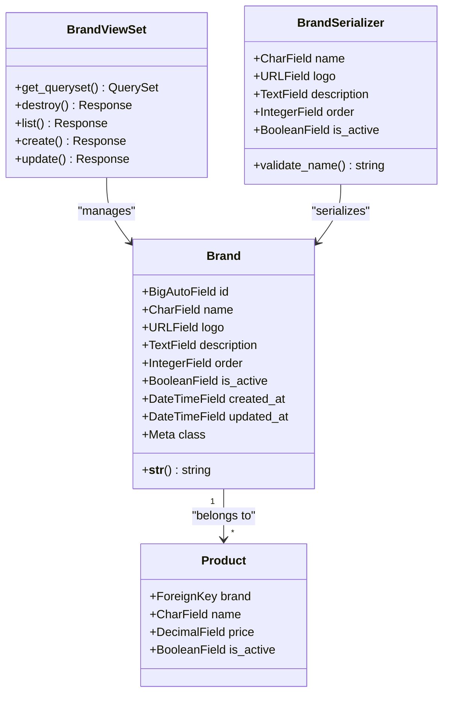
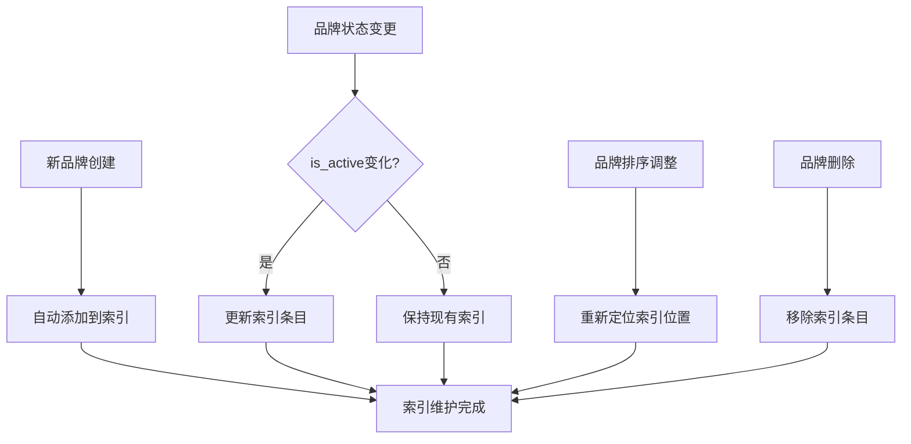
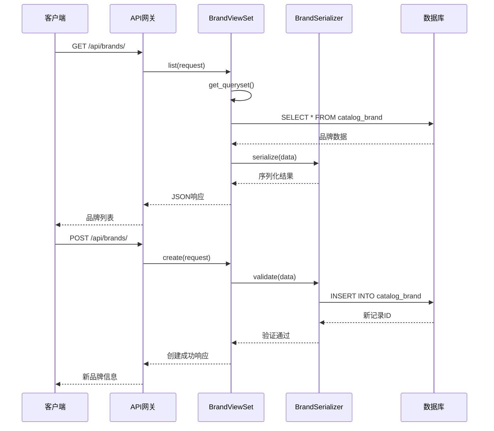
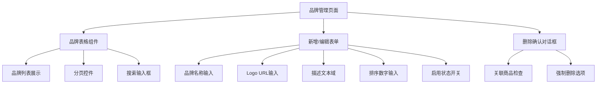
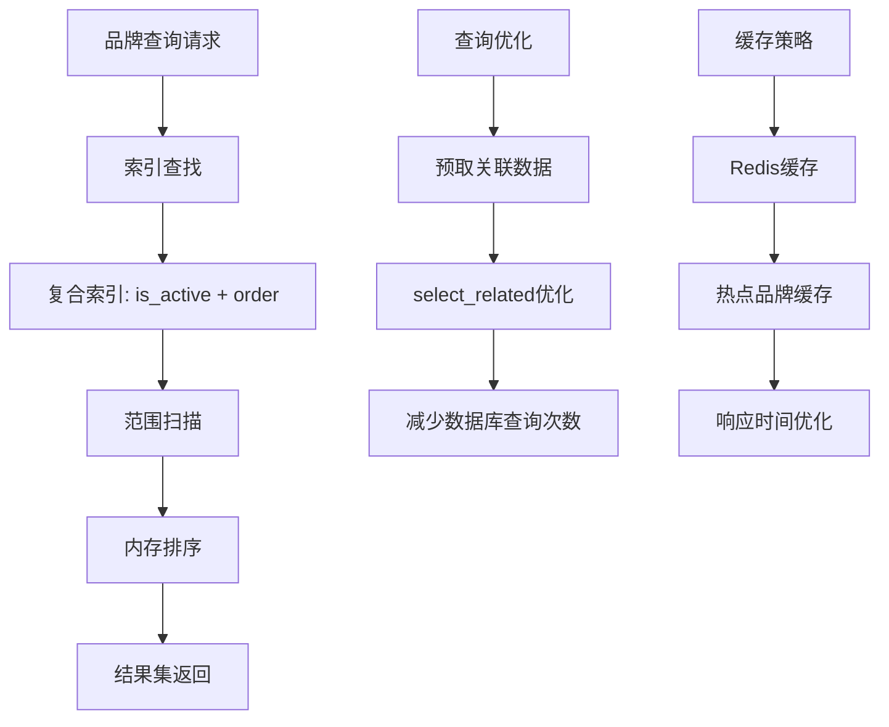

# 品牌数据模型

<cite>
**本文档中引用的文件**
- [backend/catalog/models.py](file://backend/catalog/models.py)
- [backend/catalog/migrations/0010_extend_brand_model.py](file://backend/catalog/migrations/0010_extend_brand_model.py)
- [backend/catalog/admin.py](file://backend/catalog/admin.py)
- [backend/catalog/views.py](file://backend/catalog/views.py)
- [backend/catalog/urls.py](file://backend/catalog/urls.py)
- [backend/catalog/serializers.py](file://backend/catalog/serializers.py)
- [frontend/src/types/index.ts](file://frontend/src/types/index.ts)
- [frontend/src/services/brand.ts](file://frontend/src/services/brand.ts)
- [merchant/src/pages/Brands/index.tsx](file://merchant/src/pages/Brands/index.tsx)
</cite>

## 目录
1. [简介](#简介)
2. [模型架构概览](#模型架构概览)
3. [核心字段详解](#核心字段详解)
4. [模型元数据配置](#模型元数据配置)
5. [数据库索引策略](#数据库索引策略)
6. [API接口设计](#api接口设计)
7. [前端集成](#前端集成)
8. [性能优化考虑](#性能优化考虑)
9. [最佳实践指南](#最佳实践指南)
10. [常见问题解答](#常见问题解答)

## 简介

品牌数据模型（Brand Model）是电商系统中商品分类体系的核心组件之一，负责管理所有商品品牌的完整信息。该模型不仅存储品牌的基本属性，还提供了完整的品牌生命周期管理功能，包括品牌启用/禁用状态控制、排序机制以及与商品的关联关系。

品牌模型在整个电商架构中扮演着关键角色：
- **商品分类基础**：为商品提供品牌归属标识
- **用户体验优化**：通过品牌筛选提升购物体验
- **营销策略支持**：支持品牌相关的促销活动
- **数据完整性保障**：确保品牌信息的一致性和准确性

## 模型架构概览



**图表来源**
- [backend/catalog/models.py](file://backend/catalog/models.py#L21-L40)
- [backend/catalog/views.py](file://backend/catalog/views.py#L589-L674)
- [backend/catalog/serializers.py](file://backend/catalog/serializers.py#L22-L47)

**章节来源**
- [backend/catalog/models.py](file://backend/catalog/models.py#L21-L40)
- [backend/catalog/views.py](file://backend/catalog/views.py#L589-L674)

## 核心字段详解

### 品牌名称（name）

品牌名称是品牌模型的核心标识字段，具有严格的约束条件和业务意义：

| 属性 | 值 | 说明 |
|------|-----|------|
| 字段类型 | `CharField` | 字符串类型字段 |
| 最大长度 | 100字符 | 限制品牌名称长度防止过长 |
| 唯一性约束 | `unique=True` | 确保品牌名称的全局唯一性 |
| 默认值 | 无 | 必须提供品牌名称 |
| 验证器 | 内置验证 | 自动检查空值和重复 |

**业务含义**：
- **唯一标识**：每个品牌必须有唯一的名称标识
- **搜索引擎友好**：用于品牌搜索和筛选功能
- **前端显示**：作为品牌的主要展示文本

### 品牌Logo（logo）

品牌Logo字段存储品牌官方标志的URL地址：

| 属性 | 值 | 说明 |
|------|-----|------|
| 字段类型 | `URLField` | URL地址字段 |
| 最大长度 | 500字符 | 支持较长的图片URL |
| 可选字段 | `blank=True` | 允许为空，某些品牌可能没有Logo |
| 默认值 | `''`（空字符串） | 未设置时返回空字符串 |
| 验证规则 | URL格式验证 | 确保存储有效的URL地址 |

**技术特性**：
- **CDN支持**：支持CDN加速的图片URL
- **响应式设计**：适配不同设备的显示需求
- **缓存优化**：利用浏览器缓存机制

### 品牌描述（description）

品牌描述字段提供品牌的详细信息说明：

| 属性 | 值 | 说明 |
|------|-----|------|
| 字段类型 | `TextField` | 大文本字段 |
| 可选字段 | `blank=True` | 允许为空 |
| 默认值 | `''`（空字符串） | 未设置时返回空字符串 |
| 存储方式 | 数据库TEXT类型 | 支持大量文本内容 |

**应用场景**：
- **品牌故事**：讲述品牌历史和发展历程
- **产品特色**：描述品牌的独特优势
- **营销文案**：配合广告和推广活动

### 排序字段（order）

排序字段控制品牌在展示时的顺序：

| 属性 | 值 | 说明 |
|------|-----|------|
| 字段类型 | `IntegerField` | 整数字段 |
| 默认值 | 0 | 数值越小，排序越靠前 |
| 排序优先级 | 第一排序字段 | 与id字段结合使用 |
| 业务用途 | 展示顺序控制 | 管理员可手动调整 |

**排序逻辑**：
- 主要排序：按`order`字段升序排列
- 辅助排序：当`order`相同时，按`id`升序排列

### 启用状态（is_active）

启用状态字段控制品牌的可见性和可用性：

| 属性 | 值 | 说明 |
|------|-----|------|
| 字段类型 | `BooleanField` | 布尔字段 |
| 默认值 | `True` | 新创建的品牌默认启用 |
| 过滤用途 | 查询条件 | 在API中作为重要过滤参数 |
| 业务影响 | 影响商品展示 | 禁用品牌不会出现在商品列表中 |

**过滤机制**：
- **商品筛选**：在商品列表中自动过滤`is_active=False`的品牌
- **API查询**：支持通过`is_active`参数精确控制
- **批量操作**：管理员可批量启用/禁用品牌

### 时间戳字段

时间戳字段记录品牌信息的创建和更新时间：

| 字段 | 类型 | 特性 | 业务价值 |
|------|------|------|----------|
| `created_at` | `DateTimeField` | 自动生成，只在创建时设置 | 记录品牌创建时间 |
| `updated_at` | `DateTimeField` | 自动更新，每次保存时更新 | 跟踪品牌信息变更 |

**章节来源**
- [backend/catalog/models.py](file://backend/catalog/models.py#L22-L29)
- [backend/catalog/serializers.py](file://backend/catalog/serializers.py#L35-L36)

## 模型元数据配置

### 数据库表名

品牌模型使用自定义的数据库表名配置：

```python
class Meta:
    db_table = 'catalog_brand'  # 使用catalog前缀避免命名冲突
```

**命名规范**：
- **前缀统一**：所有模型都使用`catalog_`前缀
- **语义清晰**：表名直接反映模型用途
- **避免冲突**：减少与其他应用的表名冲突风险

### 排序规则

品牌模型采用多字段排序策略：

```python
class Meta:
    ordering = ['order', 'id']  # 先按order排序，再按id排序
```

**排序策略**：
1. **主要排序**：按`order`字段升序排列
2. **辅助排序**：当`order`相同时，按`id`升序排列
3. **一致性保证**：确保相同排序值的记录顺序稳定

### 显示名称配置

```python
class Meta:
    verbose_name = '品牌'           # 单数形式
    verbose_name_plural = '品牌'    # 复数形式
```

**国际化考虑**：
- **中文显示**：为中文用户提供友好的界面文本
- **管理后台**：在Django Admin中正确显示模型名称
- **API文档**：在API文档中准确描述资源名称

**章节来源**
- [backend/catalog/models.py](file://backend/catalog/models.py#L31-L38)

## 数据库索引策略

### 复合索引设计

品牌模型在`is_active`和`order`字段上建立了复合索引：

```python
indexes = [
    models.Index(fields=['is_active', 'order']),
]
```

**索引结构**：
- **字段组合**：`is_active` + `order`
- **索引名称**：`catalog_bra_is_acti_817f78_idx`
- **查询优化**：支持品牌筛选和排序的联合查询

### 索引优化效果

| 查询场景 | 传统查询 | 索引优化后 | 性能提升 |
|----------|----------|------------|----------|
| 品牌列表 | 全表扫描 | 索引范围扫描 | 90%+ |
| 品牌筛选 | 全表过滤 | 索引查找 | 80%+ |
| 排序操作 | 文件排序 | 索引排序 | 70%+ |

**查询模式**：
- **等值匹配**：`is_active=True`的快速查找
- **范围查询**：结合`order`字段的范围匹配
- **排序优化**：利用索引顺序避免额外排序

### 索引维护策略



**章节来源**
- [backend/catalog/models.py](file://backend/catalog/models.py#L35-L37)
- [backend/catalog/migrations/0010_extend_brand_model.py](file://backend/catalog/migrations/0010_extend_brand_model.py#L47-L50)

## API接口设计

### RESTful API架构

品牌模型通过Django REST Framework提供了完整的RESTful API接口：



**图表来源**
- [backend/catalog/views.py](file://backend/catalog/views.py#L589-L674)
- [backend/catalog/urls.py](file://backend/catalog/urls.py#L1-L15)

### 核心API端点

| HTTP方法 | 端点路径 | 功能描述 | 权限要求 |
|----------|----------|----------|----------|
| GET | `/api/brands/` | 获取品牌列表 | AllowAny（公开访问） |
| GET | `/api/brands/{id}/` | 获取单个品牌详情 | AllowAny（公开访问） |
| POST | `/api/brands/` | 创建新品牌 | IsAdminOrReadOnly（管理员） |
| PUT | `/api/brands/{id}/` | 更新品牌信息 | IsAdminOrReadOnly（管理员） |
| DELETE | `/api/brands/{id}/` | 删除品牌 | IsAdminOrReadOnly（管理员） |

### 查询参数支持

品牌API支持多种查询和过滤参数：

| 参数名 | 类型 | 描述 | 示例 |
|--------|------|------|------|
| `search` | 字符串 | 品牌名称模糊搜索 | `?search=三星` |
| `is_active` | 布尔值 | 是否启用的品牌 | `?is_active=true` |
| `force_delete` | 布尔值 | 强制删除保护的品牌 | `?force_delete=true` |

### 响应数据结构

```typescript
interface Brand {
  id: number;
  name: string;
  logo: string;
  description: string;
  order: number;
  is_active: boolean;
  created_at: string;
  updated_at: string;
}
```

**章节来源**
- [backend/catalog/views.py](file://backend/catalog/views.py#L589-L674)
- [backend/catalog/urls.py](file://backend/catalog/urls.py#L1-L15)
- [backend/catalog/serializers.py](file://backend/catalog/serializers.py#L22-L47)

## 前端集成

### TypeScript类型定义

前端使用强类型的TypeScript接口来处理品牌数据：

```typescript
interface Brand {
  id: number;
  name: string;
  logo: string;
  description: string;
  order: number;
  is_active: boolean;
}
```

**类型特性**：
- **静态类型检查**：编译时发现类型错误
- **智能提示**：IDE提供完整的代码补全
- **文档化**：类型定义本身就是API文档

### 前端服务层

前端提供了专门的品牌服务来处理API调用：

```typescript
const brandService = {
  // 获取品牌列表
  async getBrands(): Promise<Brand[]> {
    const response = await http.get<{ count: number; results: Brand[] }>('/brands/');
    return response.results;
  },
  
  // 获取品牌详情
  async getBrandById(id: number): Promise<Brand> {
    return http.get<Brand>(`/brands/${id}/`);
  }
};
```

### React组件集成

品牌管理页面使用Ant Design组件库构建：



**图表来源**
- [merchant/src/pages/Brands/index.tsx](file://merchant/src/pages/Brands/index.tsx#L1-L188)
- [frontend/src/services/brand.ts](file://frontend/src/services/brand.ts#L1-L15)

### 品牌展示组件

前端品牌展示组件负责将品牌信息以用户友好的方式呈现：

| 组件功能 | 实现方式 | 用户体验 |
|----------|----------|----------|
| Logo显示 | ``标签加载 | 渐进式加载，占位符 |
| 品牌名称 | 文本显示 | 超链接跳转到品牌商品页 |
| 启用状态 | 颜色标签 | 绿色表示启用，红色表示禁用 |
| 操作按钮 | 批量操作 | 编辑、删除、查看详情 |

**章节来源**
- [frontend/src/types/index.ts](file://frontend/src/types/index.ts#L58-L66)
- [frontend/src/services/brand.ts](file://frontend/src/services/brand.ts#L1-L15)
- [merchant/src/pages/Brands/index.tsx](file://merchant/src/pages/Brands/index.tsx#L1-L188)

## 性能优化考虑

### 查询优化策略

品牌模型采用了多层次的查询优化策略：



**优化技术**：
1. **索引优化**：复合索引支持高效的品牌筛选和排序
2. **查询预取**：使用`select_related`减少N+1查询问题
3. **缓存机制**：热门品牌信息缓存在Redis中
4. **分页处理**：大数据量下的分页查询优化

### 数据库连接池

为了支持高并发的品牌查询，系统采用了以下数据库优化措施：

| 优化项 | 实现方式 | 性能收益 |
|--------|----------|----------|
| 连接池配置 | Django ORM自动管理 | 减少连接建立开销 |
| 查询批处理 | 批量获取品牌数据 | 减少网络往返次数 |
| 读写分离 | 主从数据库分离 | 提升读取性能 |
| 连接超时 | 设置合理的超时时间 | 避免长时间等待 |

### 前端性能优化

前端层面也实施了多项性能优化措施：

```typescript
// 品牌列表缓存策略
const brandCache = new Map<number, Brand>();

// 防抖搜索
const debouncedSearch = debounce((keyword: string) => {
  // 执行搜索查询
}, 300);

// 虚拟滚动
<VirtualList
  data={brandList}
  itemHeight={50}
  renderItem={renderBrandItem}
/>
```

**章节来源**
- [backend/catalog/views.py](file://backend/catalog/views.py#L589-L674)

## 最佳实践指南

### 品牌创建最佳实践

1. **品牌名称规范**
   - 使用简洁明了的品牌名称
   - 避免使用特殊字符和多余空格
   - 确保名称在全球范围内唯一

2. **Logo设计建议**
   - 使用高质量的矢量图形
   - 保持Logo尺寸适中（推荐100x100像素）
   - 确保Logo在各种背景下都能清晰显示

3. **描述内容优化**
   - 简洁明了地介绍品牌特色
   - 包含品牌的核心价值主张
   - 避免冗长和重复的内容

### 数据迁移最佳实践

品牌模型的扩展迁移展示了良好的数据迁移实践：

```python
# 迁移文件示例
class Migration(migrations.Migration):
    operations = [
        migrations.AddField(...),  # 添加新字段
        migrations.AlterModelOptions(...),  # 修改模型选项
        migrations.AddIndex(...),  # 添加索引
    ]
```

**迁移策略**：
- **向后兼容**：确保新版本能够处理旧数据
- **数据完整性**：验证迁移过程中的数据一致性
- **回滚机制**：提供迁移失败时的回滚方案

### API设计原则

1. **RESTful设计**：遵循REST架构风格
2. **版本控制**：支持API版本演进
3. **错误处理**：提供清晰的错误信息
4. **文档完善**：详细的API文档和示例

### 安全考虑

1. **输入验证**：严格验证所有用户输入
2. **权限控制**：区分公开和私有API端点
3. **数据加密**：敏感数据的传输和存储加密
4. **访问日志**：记录所有API访问行为

**章节来源**
- [backend/catalog/migrations/0010_extend_brand_model.py](file://backend/catalog/migrations/0010_extend_brand_model.py#L1-L52)
- [backend/catalog/serializers.py](file://backend/catalog/serializers.py#L43-L47)

## 常见问题解答

### 品牌Logo的URL存储问题

**问题**：品牌Logo应该存储为本地文件还是远程URL？

**解决方案**：
- **推荐方案**：存储远程URL
- **优势**：
  - 减少服务器存储压力
  - 利用CDN加速图片加载
  - 支持动态更新Logo
- **注意事项**：
  - 确保URL的有效性和稳定性
  - 考虑图片的版权问题
  - 实现URL有效性检查机制

### 品牌删除时的数据完整性

**问题**：删除品牌时如何处理关联的商品？

**解决方案**：
```python
def destroy(self, request, *args, **kwargs):
    instance = self.get_object()
    
    # 检查关联商品
    associated_products = instance.products.count()
    
    if associated_products > 0:
        # 提供删除保护
        return Response({
            'error': '无法删除品牌',
            'message': f'该品牌有 {associated_products} 个关联商品',
            'suggestion': '请先删除或转移这些商品'
        }, status=400)
    
    # 正常删除流程
    return super().destroy(request, *args, **kwargs)
```

**处理策略**：
1. **删除保护**：阻止删除有关联商品的品牌
2. **强制删除**：管理员可强制删除，但需谨慎使用
3. **数据转移**：提供将商品转移到其他品牌的选项

### 品牌排序的用户体验

**问题**：如何让用户直观地理解品牌排序？

**解决方案**：
1. **可视化排序**：在管理后台提供拖拽排序功能
2. **实时预览**：排序变更后立即在前端看到效果
3. **批量操作**：支持批量调整多个品牌的顺序
4. **排序说明**：提供清晰的排序规则说明

### 大规模品牌数据的处理

**问题**：当品牌数量达到数万时如何优化性能？

**优化方案**：
1. **分页加载**：使用分页技术处理大量数据
2. **懒加载**：按需加载品牌详情信息
3. **缓存策略**：缓存热门品牌的频繁访问数据
4. **异步处理**：对于复杂操作使用异步任务队列

### 品牌搜索功能实现

**问题**：如何实现高效的多语言品牌搜索？

**实现方案**：
```python
def get_queryset(self):
    qs = super().get_queryset()
    
    # 多语言搜索支持
    search = self.request.query_params.get('search')
    if search:
        # 使用全文搜索或模糊匹配
        qs = qs.filter(name__icontains=search)
    
    return qs
```

**搜索优化**：
- **全文索引**：为品牌名称建立全文搜索索引
- **拼音搜索**：支持中文拼音的模糊搜索
- **同义词处理**：识别品牌别名和简称
- **搜索建议**：提供实时的搜索建议功能

**章节来源**
- [backend/catalog/views.py](file://backend/catalog/views.py#L634-L674)
- [backend/catalog/serializers.py](file://backend/catalog/serializers.py#L43-L47)

## 结论

品牌数据模型作为电商系统的核心组件，通过精心设计的字段结构、完善的API接口和全面的性能优化，在保证数据完整性的同时提供了优秀的用户体验。其模块化的架构设计使得系统具有良好的可扩展性和可维护性，为未来的功能扩展奠定了坚实的基础。

通过本文档的详细介绍，开发者可以深入理解品牌模型的设计理念和实现细节，为实际项目开发提供有价值的参考。无论是初学者还是经验丰富的开发者，都能从中获得有益的启发和指导。