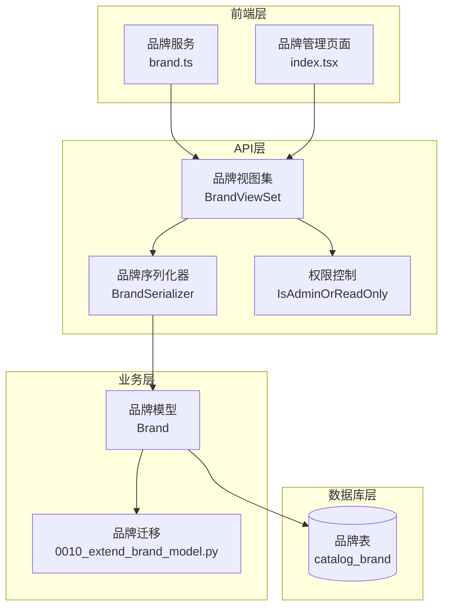
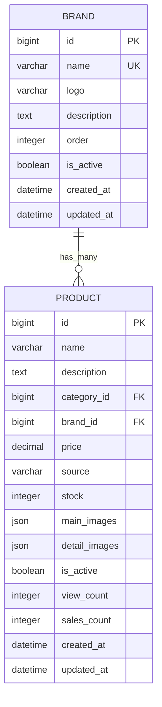
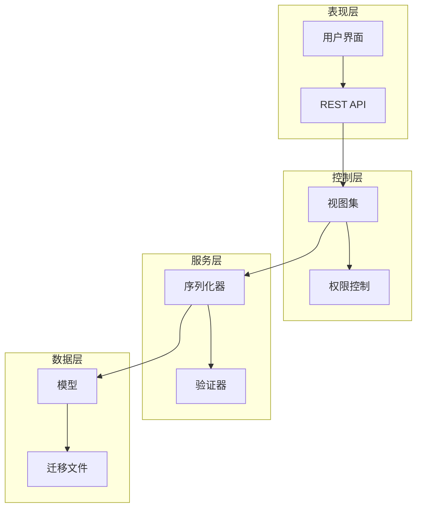
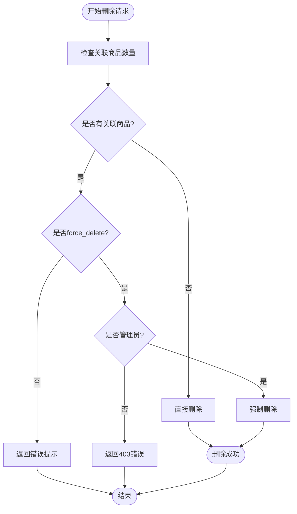
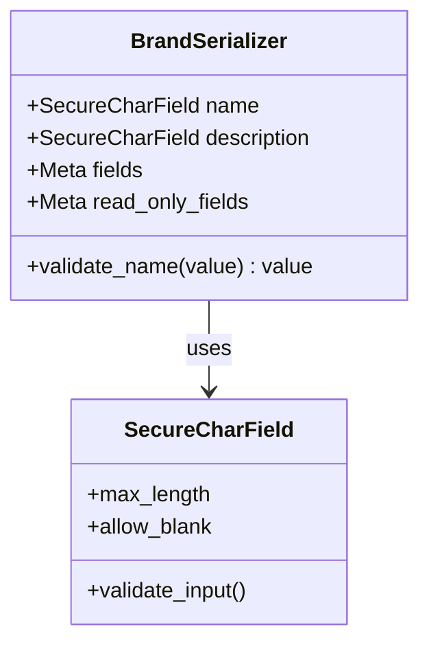
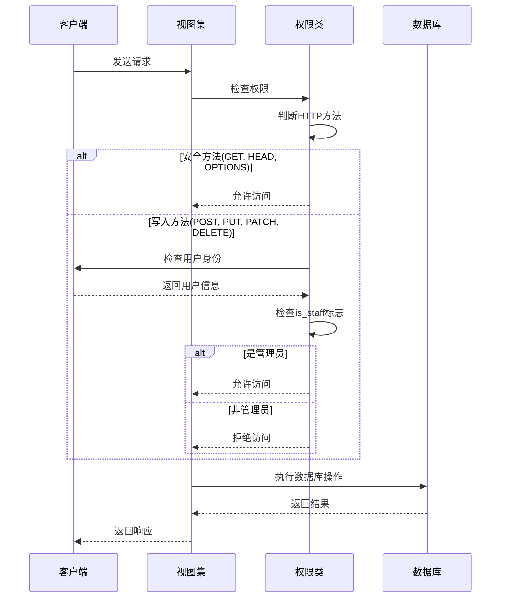
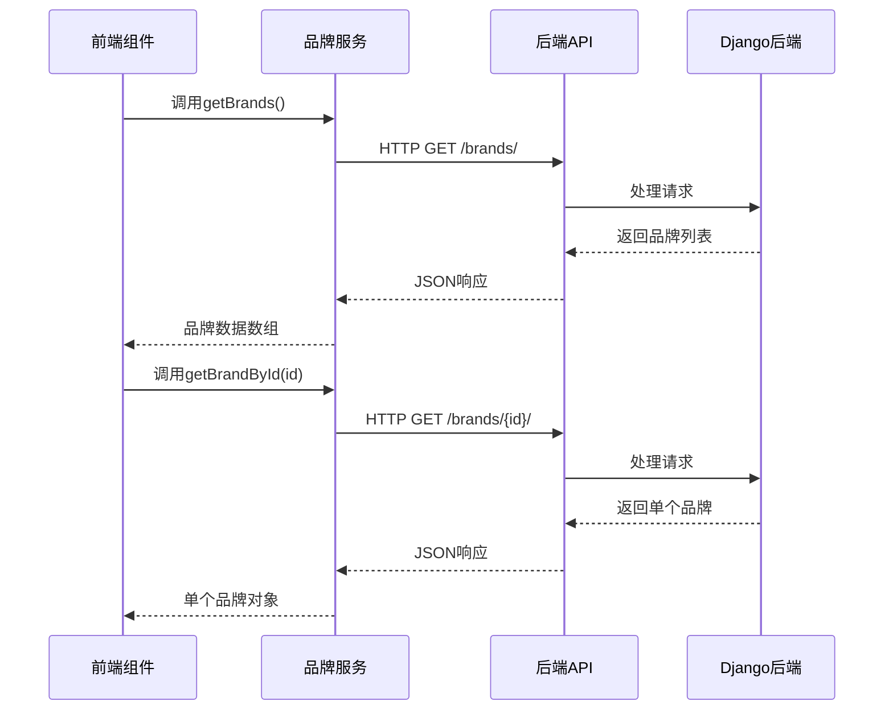
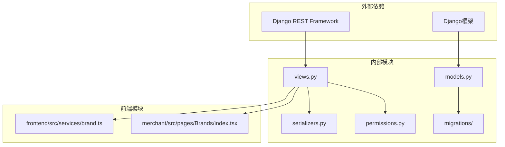

# 品牌管理

<cite>
**本文档引用的文件**
- [models.py](file://backend/catalog/models.py)
- [serializers.py](file://backend/catalog/serializers.py)
- [views.py](file://backend/catalog/views.py)
- [permissions.py](file://backend/common/permissions.py)
- [0010_extend_brand_model.py](file://backend/catalog/migrations/0010_extend_brand_model.py)
- [urls.py](file://backend/catalog/urls.py)
- [brand.ts](file://frontend/src/services/brand.ts)
- [index.tsx](file://merchant/src/pages/Brands/index.tsx)
</cite>

## 目录
1. [简介](#简介)
2. [项目结构](#项目结构)
3. [核心组件](#核心组件)
4. [架构概览](#架构概览)
5. [详细组件分析](#详细组件分析)
6. [依赖关系分析](#依赖关系分析)
7. [性能考虑](#性能考虑)
8. [故障排除指南](#故障排除指南)
9. [结论](#结论)

## 简介

品牌管理是电商系统中的核心功能模块，负责管理商品的品牌信息。本文档详细介绍了品牌模型的设计与实现，包括品牌字段定义、外键关系、CRUD API接口、权限控制以及数据完整性保护机制。

品牌管理系统提供了完整的品牌生命周期管理功能，包括品牌创建、编辑、删除以及与商品的关联管理。系统采用Django REST Framework构建，提供了RESTful API接口，并实现了严格的数据完整性保护机制。

## 项目结构

品牌管理功能分布在多个模块中，形成了清晰的分层架构：



**图表来源**
- [models.py](file://backend/catalog/models.py#L21-L40)
- [views.py](file://backend/catalog/views.py#L589-L675)
- [serializers.py](file://backend/catalog/serializers.py#L22-L47)

**章节来源**
- [models.py](file://backend/catalog/models.py#L1-L312)
- [views.py](file://backend/catalog/views.py#L1-L980)

## 核心组件

### Brand模型设计

Brand模型是品牌管理的核心数据结构，包含了品牌的基本属性和业务逻辑：

| 字段名称 | 数据类型 | 长度限制 | 默认值 | 描述 |
|---------|---------|---------|--------|------|
| id | BigAutoField | - | - | 主键标识符 |
| name | CharField | 100 | - | 品牌名称（唯一） |
| logo | URLField | 500 | '' | 品牌Logo链接 |
| description | TextField | - | '' | 品牌描述 |
| order | IntegerField | - | 0 | 显示排序 |
| is_active | BooleanField | - | True | 是否启用 |
| created_at | DateTimeField | - | auto | 创建时间 |
| updated_at | DateTimeField | - | auto | 更新时间 |

### 外键关系设计

品牌与商品之间存在一对多的外键关系，这种设计确保了数据的一致性和完整性：



**图表来源**
- [models.py](file://backend/catalog/models.py#L21-L40)
- [models.py](file://backend/catalog/models.py#L43-L116)

**章节来源**
- [models.py](file://backend/catalog/models.py#L21-L40)

## 架构概览

品牌管理系统采用分层架构设计，确保了代码的可维护性和扩展性：



**图表来源**
- [views.py](file://backend/catalog/views.py#L589-L675)
- [serializers.py](file://backend/catalog/serializers.py#L22-L47)
- [permissions.py](file://backend/common/permissions.py#L70-L98)

## 详细组件分析

### BrandViewSet实现

BrandViewSet是品牌管理的主要API控制器，继承自Django REST Framework的ModelViewSet：

#### 核心功能特性

1. **权限控制**：应用IsAdminOrReadOnly权限，允许公开读取但限制写入操作
2. **搜索功能**：支持按品牌名称进行模糊搜索
3. **保护删除**：实现智能删除逻辑，防止误删有关联商品的品牌
4. **强制删除**：管理员可通过force_delete参数强制删除

#### 删除保护机制



**图表来源**
- [views.py](file://backend/catalog/views.py#L634-L674)

#### API接口规范

| 接口路径 | 方法 | 功能 | 权限要求 |
|---------|------|------|----------|
| `/brands/` | GET | 获取品牌列表 | 公开访问 |
| `/brands/` | POST | 创建新品牌 | 管理员 |
| `/brands/{id}/` | GET | 获取品牌详情 | 公开访问 |
| `/brands/{id}/` | PUT/PATCH | 更新品牌信息 | 管理员 |
| `/brands/{id}/` | DELETE | 删除品牌 | 管理员 |

**章节来源**
- [views.py](file://backend/catalog/views.py#L589-L675)

### BrandSerializer序列化器

BrandSerializer负责品牌数据的序列化和反序列化，提供了完整的数据验证和转换功能：

#### 字段定义与验证



**图表来源**
- [serializers.py](file://backend/catalog/serializers.py#L22-L47)

#### 字段验证规则

1. **name字段验证**：
   - 必填字段
   - 最大长度100字符
   - 不能为空字符串（去除空白字符后）
   - 唯一性约束

2. **description字段验证**：
   - 可选字段
   - 支持空字符串
   - 安全字符过滤

3. **只读字段设置**：
   - id：自动分配的主键
   - created_at：自动记录创建时间
   - updated_at：自动更新时间戳

**章节来源**
- [serializers.py](file://backend/catalog/serializers.py#L22-L47)

### 权限控制系统

系统采用多层次的权限控制策略：

#### IsAdminOrReadOnly权限



**图表来源**
- [permissions.py](file://backend/common/permissions.py#L70-L98)

**章节来源**
- [permissions.py](file://backend/common/permissions.py#L70-L98)

### 前端集成

#### 品牌服务接口

前端通过专门的服务模块与后端API交互：



**图表来源**
- [brand.ts](file://frontend/src/services/brand.ts#L1-L16)

#### 商户管理界面

商户管理界面提供了完整的品牌管理功能：

1. **表格展示**：显示品牌基本信息、状态和操作按钮
2. **搜索功能**：支持按品牌名称搜索
3. **状态筛选**：可按启用/禁用状态筛选
4. **编辑功能**：支持新建和编辑品牌信息
5. **删除保护**：智能删除提示和强制删除选项

**章节来源**
- [index.tsx](file://merchant/src/pages/Brands/index.tsx#L1-L189)

## 依赖关系分析

品牌管理系统的依赖关系体现了良好的分层架构设计：



**图表来源**
- [models.py](file://backend/catalog/models.py#L1-L5)
- [views.py](file://backend/catalog/views.py#L1-L18)
- [serializers.py](file://backend/catalog/serializers.py#L1-L13)

**章节来源**
- [models.py](file://backend/catalog/models.py#L1-L312)
- [views.py](file://backend/catalog/views.py#L1-L980)
- [serializers.py](file://backend/catalog/serializers.py#L1-L352)

## 性能考虑

### 数据库优化

1. **索引设计**：
   - `is_active, order`复合索引：优化品牌列表查询
   - `created_at`索引：支持时间相关查询
   - `name`唯一索引：确保品牌名称唯一性

2. **查询优化**：
   - 使用select_related预加载关联数据
   - 实现分页机制，避免大量数据传输
   - 支持条件查询，减少不必要的数据检索

3. **缓存策略**：
   - 品牌列表数据可考虑缓存
   - 商品数量统计可使用缓存避免频繁查询

### API性能优化

1. **批量操作**：支持批量创建、更新和删除
2. **数据压缩**：对大型响应进行压缩传输
3. **CDN加速**：品牌Logo图片可使用CDN加速

## 故障排除指南

### 常见问题及解决方案

#### 1. 品牌删除失败

**问题描述**：尝试删除品牌时返回错误提示

**可能原因**：
- 品牌有关联商品
- 用户权限不足
- 网络连接问题

**解决方案**：
```bash
# 检查关联商品数量
GET /brands/{id}/?force_delete=true

# 强制删除（管理员权限）
DELETE /brands/{id}/?force_delete=true
```

#### 2. 品牌Logo显示异常

**问题描述**：品牌Logo无法正常显示

**可能原因**：
- Logo URL无效
- 图片格式不支持
- CDN配置问题

**解决方案**：
1. 验证图片URL的有效性
2. 确认图片格式为常见的Web格式（JPEG、PNG、GIF）
3. 检查CDN配置和缓存设置

#### 3. 品牌搜索无结果

**问题描述**：按品牌名称搜索时无匹配结果

**可能原因**：
- 搜索参数格式错误
- 数据库索引问题
- 字符编码问题

**解决方案**：
1. 确保搜索参数使用正确的URL编码
2. 检查数据库索引是否正确建立
3. 验证字符编码设置

**章节来源**
- [views.py](file://backend/catalog/views.py#L634-L674)
- [serializers.py](file://backend/catalog/serializers.py#L43-L47)

## 结论

品牌管理系统是一个设计完善、功能完整的电商核心模块。通过合理的架构设计、严格的权限控制和完善的保护机制，确保了品牌数据的安全性和系统的稳定性。

### 主要优势

1. **数据完整性**：通过外键关系和保护删除机制，确保品牌与商品数据的一致性
2. **安全性**：采用多层次权限控制，防止未授权操作
3. **易用性**：提供直观的前端界面和完整的API接口
4. **可扩展性**：模块化设计便于功能扩展和维护

### 改进建议

1. **性能优化**：考虑引入Redis缓存品牌数据
2. **监控告警**：添加品牌操作的日志记录和异常监控
3. **国际化支持**：为多语言环境准备品牌名称的国际化支持
4. **批量操作**：增强批量导入导出功能

品牌管理系统为电商平台提供了坚实的品牌管理基础，支持商家高效地管理商品品牌信息，提升用户体验和运营效率。