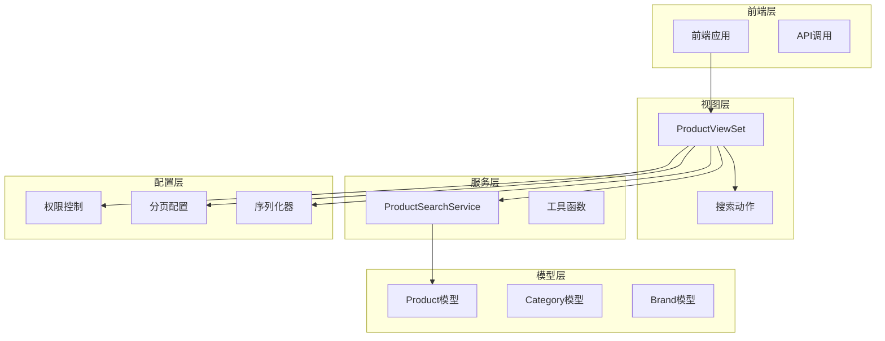
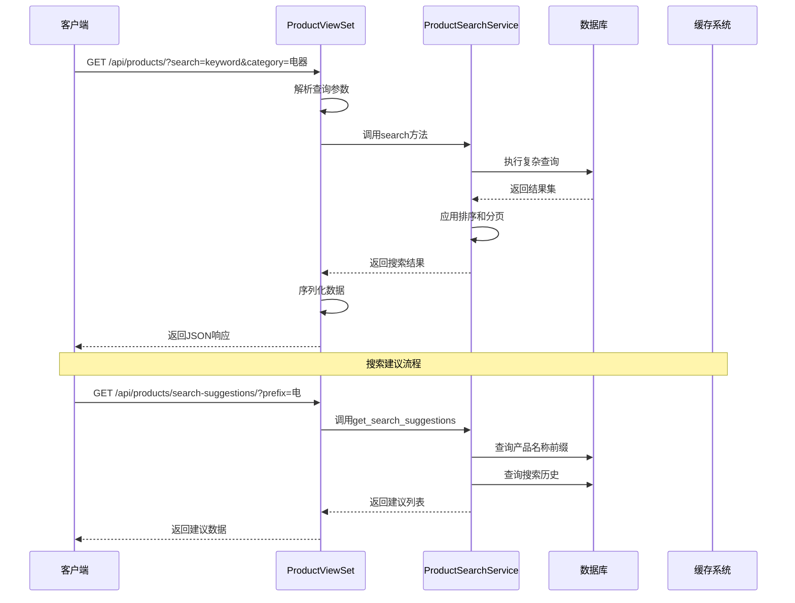
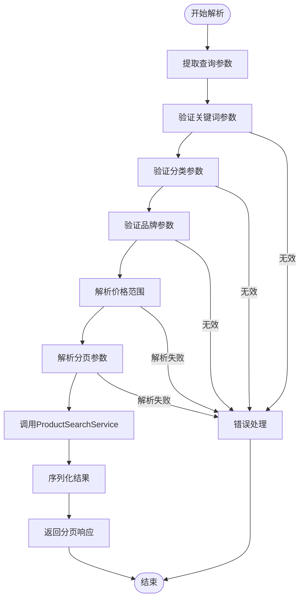
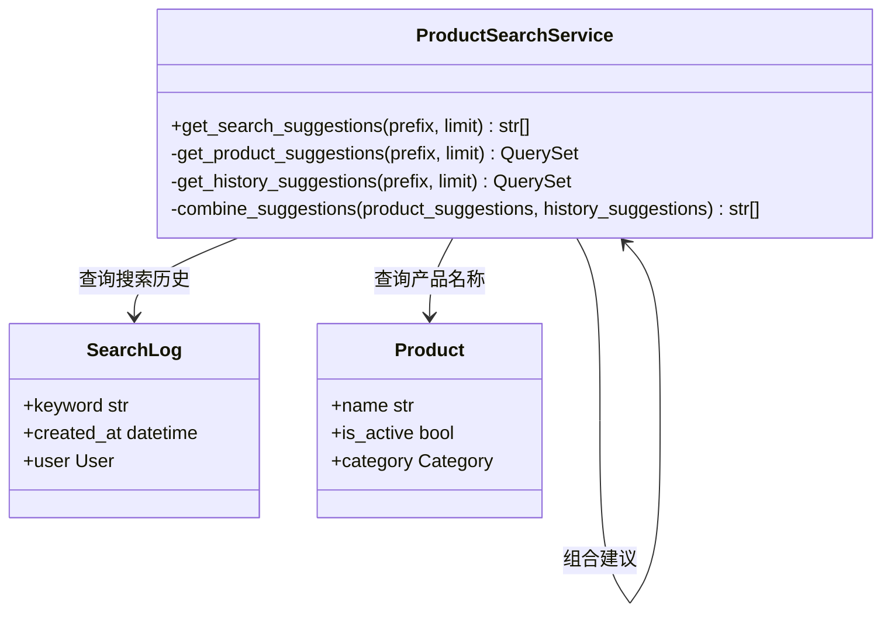
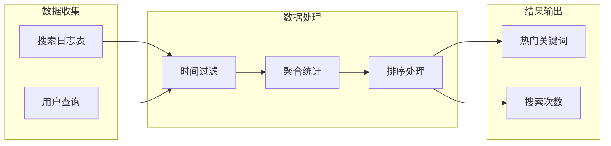
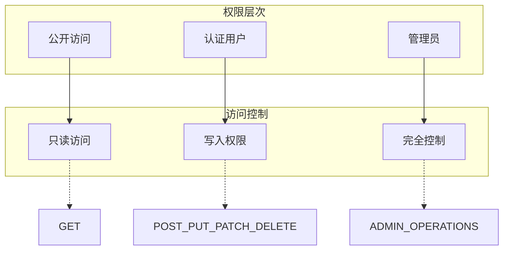

# 商品搜索API接口详细文档

<cite>
**本文档引用的文件**
- [views.py](file://backend/catalog/views.py)
- [search.py](file://backend/catalog/search.py)
- [pagination.py](file://backend/common/pagination.py)
- [permissions.py](file://backend/common/permissions.py)
- [utils.py](file://backend/common/utils.py)
- [models.py](file://backend/catalog/models.py)
- [serializers.py](file://backend/catalog/serializers.py)
- [urls.py](file://backend/catalog/urls.py)
</cite>

## 目录
1. [简介](#简介)
2. [项目结构概览](#项目结构概览)
3. [核心组件分析](#核心组件分析)
4. [架构概览](#架构概览)
5. [详细组件分析](#详细组件分析)
6. [API文档与参数说明](#api文档与参数说明)
7. [权限控制与安全](#权限控制与安全)
8. [性能优化策略](#性能优化策略)
9. [常见问题与解决方案](#常见问题与解决方案)
10. [总结](#总结)

## 简介

本文档详细介绍了一个电商小程序项目中的商品搜索API接口系统。该系统基于Django REST Framework构建，提供了强大的商品搜索、过滤、排序和分页功能。核心功能包括：

- **主搜索端点**：ProductViewSet.list方法作为主要搜索入口
- **高级搜索建议**：基于前缀匹配的智能搜索建议
- **热门关键词**：基于用户搜索行为的热门词推荐
- **灵活的查询参数**：支持多种过滤和排序选项
- **完善的权限控制**：基于角色的访问控制机制

## 项目结构概览

该商品搜索系统采用模块化设计，主要分为以下几个层次：



**图表来源**
- [views.py](file://backend/catalog/views.py#L29-L980)
- [search.py](file://backend/catalog/search.py#L19-L287)

**章节来源**
- [views.py](file://backend/catalog/views.py#L1-L50)
- [urls.py](file://backend/catalog/urls.py#L1-L15)

## 核心组件分析

### ProductViewSet类

ProductViewSet是整个商品搜索系统的核心控制器，继承自Django REST Framework的ModelViewSet。它提供了完整的CRUD操作，并专门针对商品搜索进行了优化。

#### 主要特性：
- **权限控制**：使用IsAdminOrReadOnly权限类，允许公开读取，仅管理员可修改
- **查询集优化**：预加载相关对象以避免N+1查询问题
- **多动作支持**：除了标准的CRUD操作外，还提供了专门的搜索动作

#### 关键方法：
- `list()`：主搜索端点，处理复杂的查询参数
- `search_suggestions()`：搜索建议功能
- `hot_keywords()`：热门关键词推荐
- `by_category()`：按分类筛选
- `by_brand()`：按品牌筛选

**章节来源**
- [views.py](file://backend/catalog/views.py#L29-L131)

### ProductSearchService服务类

ProductSearchService是一个独立的服务类，负责实际的商品搜索逻辑。它提供了高度可配置的搜索能力。

#### 核心功能：
- **多条件过滤**：支持关键词、分类、品牌、价格范围过滤
- **灵活排序**：多种排序策略（相关性、价格、销量、浏览量等）
- **智能分页**：提供详细的分页元数据
- **搜索日志**：自动记录搜索行为用于分析

**章节来源**
- [search.py](file://backend/catalog/search.py#L19-L287)

## 架构概览

整个搜索系统的架构采用了分层设计模式，确保了良好的可维护性和扩展性：



**图表来源**
- [views.py](file://backend/catalog/views.py#L83-L131)
- [search.py](file://backend/catalog/search.py#L47-L158)

## 详细组件分析

### 主搜索端点（list方法）

ProductViewSet的list方法是整个搜索系统的核心入口，它负责解析HTTP查询参数并调用ProductSearchService进行实际搜索。

#### 查询参数解析流程



**图表来源**
- [views.py](file://backend/catalog/views.py#L83-L131)

#### 关键实现细节

1. **参数提取与验证**：
   - 使用`request.query_params.get()`安全地获取参数
   - 对空值进行清理和标准化
   - 支持多种数据类型的自动转换

2. **服务调用**：
   - 将所有参数封装后传递给ProductSearchService
   - 包含用户信息用于搜索日志记录

3. **响应格式标准化**：
   - 返回统一的分页响应格式
   - 包含所有必要的元数据字段

**章节来源**
- [views.py](file://backend/catalog/views.py#L83-L131)

### 搜索建议功能（search_suggestions动作）

搜索建议功能通过`@action(detail=False, methods=['get'])`装饰器实现，提供基于前缀匹配的智能建议。

#### 实现原理



**图表来源**
- [search.py](file://backend/catalog/search.py#L248-L282)

#### 功能特点：
- **双重数据源**：结合产品名称和搜索历史
- **智能去重**：使用集合操作去除重复建议
- **排序优化**：按字母顺序排列建议
- **限制保护**：防止返回过多建议

**章节来源**
- [views.py](file://backend/catalog/views.py#L141-L157)

### 热门关键词功能（hot_keywords动作）

热门关键词功能通过分析搜索日志来识别当前流行的商品搜索词。

#### 数据分析流程



**图表来源**
- [search.py](file://backend/catalog/search.py#L223-L245)

#### 配置参数：
- **limit**：最多返回的关键词数量（默认10）
- **days**：统计的时间范围（默认7天）

**章节来源**
- [views.py](file://backend/catalog/views.py#L167-L187)

### 分页机制

系统使用自定义的分页类来提供一致的分页体验：

#### 分页响应结构

| 字段名 | 类型 | 描述 |
|--------|------|------|
| results | Array | 当前页的商品数据 |
| total | Integer | 总商品数量 |
| page | Integer | 当前页码（从1开始） |
| total_pages | Integer | 总页数 |
| has_next | Boolean | 是否有下一页 |
| has_previous | Boolean | 是否有上一页 |

**章节来源**
- [pagination.py](file://backend/common/pagination.py#L8-L42)

## API文档与参数说明

### 主搜索端点

#### URL格式
```
GET /api/products/
```

#### 查询参数

| 参数名 | 类型 | 必填 | 默认值 | 描述 |
|--------|------|------|--------|------|
| search | String | 否 | - | 商品名称或描述的关键词搜索 |
| category | String | 否 | - | 按分类名称过滤 |
| brand | String | 否 | - | 按品牌名称过滤 |
| min_price | Decimal | 否 | - | 最小价格过滤 |
| max_price | Decimal | 否 | - | 最大价格过滤 |
| sort_by | String | 否 | relevance | 排序策略 |
| page | Integer | 否 | 1 | 页码（从1开始） |
| page_size | Integer | 否 | 20 | 每页结果数（最大100） |

#### 排序策略（sort_by参数）
- `relevance`：相关性排序（默认）
- `price_asc`：价格升序
- `price_desc`：价格降序
- `sales`：销量降序
- `views`：浏览量降序
- `created`：创建时间降序

#### 响应示例
```json
{
  "results": [
    {
      "id": 1,
      "name": "智能空调",
      "price": 2999.00,
      "category": "家用电器",
      "brand": "海尔",
      "main_images": ["https://example.com/image1.jpg"]
    }
  ],
  "total": 150,
  "page": 1,
  "total_pages": 8,
  "has_next": true,
  "has_previous": false
}
```

### 搜索建议端点

#### URL格式
```
GET /api/products/search-suggestions/
```

#### 查询参数

| 参数名 | 类型 | 必填 | 默认值 | 描述 |
|--------|------|------|--------|------|
| prefix | String | 是 | - | 关键词前缀 |
| limit | Integer | 否 | 10 | 最大建议数量 |

#### 响应示例
```json
{
  "suggestions": [
    "智能手机",
    "智能电视",
    "智能手表",
    "智能家居"
  ]
}
```

### 热门关键词端点

#### URL格式
```
GET /api/products/hot-keywords/
```

#### 查询参数

| 参数名 | 类型 | 必填 | 默认值 | 描述 |
|--------|------|------|--------|------|
| limit | Integer | 否 | 10 | 最大关键词数量 |
| days | Integer | 否 | 7 | 统计天数范围 |

#### 响应示例
```json
{
  "hot_keywords": [
    {"keyword": "手机", "count": 150},
    {"keyword": "电视", "count": 120},
    {"keyword": "冰箱", "count": 95},
    {"keyword": "洗衣机", "count": 80}
  ]
}
```

**章节来源**
- [views.py](file://backend/catalog/views.py#L69-L187)

## 权限控制与安全

### 权限级别设置

系统采用分层权限控制策略：



**图表来源**
- [permissions.py](file://backend/common/permissions.py#L70-L99)

### 具体权限规则

1. **ProductViewSet权限**：
   - GET请求：允许所有用户访问
   - POST/PUT/PATCH/DELETE：仅管理员可访问

2. **特殊动作权限**：
   - `search_suggestions`：公开访问
   - `hot_keywords`：公开访问
   - `with_discounts`：需要认证
   - `sync_haier_stock`：仅管理员
   - `sync_haier_price`：仅管理员

### 输入验证机制

系统实现了多层次的输入验证：

#### 参数类型转换
- 使用`parse_decimal()`处理价格参数
- 使用`parse_int()`处理数值参数
- 使用`to_bool()`处理布尔参数

#### 数据清洗
- 自动去除字符串两端空白
- 过滤无效的空值
- 标准化参数格式

**章节来源**
- [utils.py](file://backend/common/utils.py#L1-L48)
- [permissions.py](file://backend/common/permissions.py#L70-L99)

## 性能优化策略

### 查询优化

#### N+1查询问题预防
```python
# 优化前：多次查询
for product in products:
    product.category  # 每次循环都会执行查询

# 优化后：预加载
qs = qs.select_related('category', 'brand')
```

#### 索引策略
- **复合索引**：在`(is_active, -sales_count)`上建立索引
- **全文搜索**：对商品名称和描述建立全文索引
- **分类索引**：在`category`和`brand`字段上建立索引

### 缓存策略

#### 搜索建议缓存
- 将热门搜索词缓存到Redis
- 设置合理的过期时间
- 使用分布式锁防止缓存击穿

#### 结果集缓存
- 缓存热门商品的搜索结果
- 使用内容哈希作为缓存键
- 实现智能失效机制

### 分页优化

#### 大数据集处理
- 使用数据库原生分页而非Python切片
- 实现游标分页减少偏移量查询
- 提供预估总数功能

**章节来源**
- [views.py](file://backend/catalog/views.py#L52-L67)
- [search.py](file://backend/catalog/search.py#L90-L158)

## 常见问题与解决方案

### 参数解析失败

#### 问题描述
当客户端发送无效的查询参数时，系统可能出现解析错误。

#### 解决方案
```python
# 安全的参数解析模式
def safe_parse_int(value, default=None):
    try:
        return int(value)
    except (ValueError, TypeError):
        return default

# 在视图中使用
page = safe_parse_int(request.query_params.get('page'), 1)
```

#### 错误处理策略
- 返回适当的HTTP状态码（400 Bad Request）
- 提供清晰的错误消息
- 记录详细的错误日志

### 分页逻辑错误

#### 问题场景
- 负数页码导致异常
- 页面大小超出限制
- 总数计算不准确

#### 解决策略
```python
# 分页参数验证
def validate_pagination(page, page_size):
    page = max(1, int(page)) if page else 1
    page_size = min(max(1, int(page_size)), MAX_PAGE_SIZE) if page_size else DEFAULT_SIZE
    return page, page_size
```

### 性能问题

#### 大数据集查询
**问题**：大量数据导致查询缓慢
**解决方案**：
- 实现异步查询机制
- 使用数据库连接池
- 添加查询超时限制

#### 内存占用过高
**问题**：大数据集序列化消耗过多内存
**解决方案**：
- 使用流式序列化
- 实现分批处理
- 优化JSON序列化

### 搜索准确性问题

#### 相关性排序不准确
**问题**：搜索结果的相关性排序不符合预期
**解决方案**：
- 调整权重算法
- 添加用户行为反馈
- 实现个性化排序

#### 拼写错误处理
**问题**：用户输入拼写错误导致搜索失败
**解决方案**：
- 实现拼写检查功能
- 提供相似词建议
- 使用模糊匹配算法

**章节来源**
- [views.py](file://backend/catalog/views.py#L83-L131)
- [search.py](file://backend/catalog/search.py#L47-L158)

## 总结

该商品搜索API接口系统展现了现代Web应用的最佳实践，具有以下突出特点：

### 技术优势
1. **模块化设计**：清晰的职责分离，便于维护和扩展
2. **性能优化**：多层次的优化策略确保高效运行
3. **安全性**：完善的身份验证和授权机制
4. **用户体验**：智能的搜索建议和热门关键词功能

### 架构亮点
- **服务导向**：将搜索逻辑封装在独立的服务类中
- **API友好**：遵循RESTful设计原则，提供清晰的接口规范
- **可扩展性**：支持多种排序策略和过滤条件
- **监控友好**：内置搜索日志和性能指标

### 应用价值
该系统不仅满足了基本的商品搜索需求，还通过智能化的功能提升了用户的购物体验。其设计思路和实现方式可以作为其他电商平台搜索功能开发的重要参考。

对于初学者而言，这个系统展示了如何构建一个功能完整、性能优异的搜索API；对于经验丰富的开发者，它提供了许多值得借鉴的设计模式和最佳实践。