# 商品搜索功能详细文档

<cite>
**本文档引用的文件**
- [search.py](file://backend/catalog/search.py)
- [views.py](file://backend/catalog/views.py)
- [models.py](file://backend/catalog/models.py)
- [serializers.py](file://backend/catalog/serializers.py)
- [urls.py](file://backend/catalog/urls.py)
- [index.tsx](file://frontend/src/pages/search/index.tsx)
</cite>

## 目录
1. [简介](#简介)
2. [系统架构概览](#系统架构概览)
3. [核心组件分析](#核心组件分析)
4. [ProductSearchService 实现详解](#productsearchservice-实现详解)
5. [搜索日志与分析](#搜索日志与分析)
6. [前端搜索界面](#前端搜索界面)
7. [性能优化策略](#性能优化策略)
8. [常见问题与解决方案](#常见问题与解决方案)
9. [最佳实践指南](#最佳实践指南)
10. [总结](#总结)

## 简介

本电商小程序的商品搜索功能是一个高度优化的综合搜索系统，支持关键词搜索、多维度过滤和智能排序。系统采用分层架构设计，从前端到后端再到数据库，每个环节都经过精心优化以提供最佳的用户体验和搜索性能。

核心特性包括：
- **智能关键词搜索**：支持模糊匹配和相关性排序
- **多维度过滤**：按分类、品牌、价格区间进行精确筛选
- **多样化排序**：支持相关性、价格、销量、创建时间等多种排序策略
- **搜索分析**：实时记录搜索行为，生成热门关键词报告
- **智能建议**：基于历史搜索和商品名称提供搜索建议

## 系统架构概览


**图表来源**
- [views.py](file://backend/catalog/views.py#L29-L131)
- [search.py](file://backend/catalog/search.py#L19-L287)

## 核心组件分析

### 组件关系图

```mermaid
classDiagram
class ProductSearchService {
+DEFAULT_PAGE_SIZE : int
+MAX_PAGE_SIZE : int
+VALID_SORT_OPTIONS : set
+search(keyword, category, brand, min_price, max_price, sort_by, page, page_size, user) Dict
+get_search_suggestions(prefix, limit) List[str]
+get_hot_keywords(limit, days) List[Dict]
-_apply_sorting(queryset, sort_by, keyword) queryset
-_log_search(keyword, user) None
}
class ProductViewSet {
+list(request) Response
+search_suggestions(request) Response
+hot_keywords(request) Response
+get_queryset() queryset
}
class Product {
+name : str
+description : str
+price : Decimal
+category : Category
+brand : Brand
+is_active : bool
+sales_count : int
+view_count : int
+created_at : datetime
}
class SearchLog {
+keyword : str
+user : User
+created_at : datetime
}
ProductSearchService --> Product : "查询"
ProductSearchService --> SearchLog : "记录"
ProductViewSet --> ProductSearchService : "调用"
ProductViewSet --> Product : "序列化"
```



**图表来源**
- [search.py](file://backend/catalog/search.py#L19-L287)
- [views.py](file://backend/catalog/views.py#L29-L131)
- [models.py](file://backend/catalog/models.py#L43-L113)

**章节来源**
- [search.py](file://backend/catalog/search.py#L1-L287)
- [views.py](file://backend/catalog/views.py#L1-L131)
- [models.py](file://backend/catalog/models.py#L1-L312)

## ProductSearchService 实现详解

### 核心搜索方法

ProductSearchService 的 `search` 方法是整个搜索系统的核心，它实现了复杂的查询构建和结果处理逻辑。

#### 方法签名与参数

```python
@classmethod
def search(
    cls,
    keyword: Optional[str] = None,
    category: Optional[str] = None,
    brand: Optional[str] = None,
    min_price: Optional[Decimal] = None,
    max_price: Optional[Decimal] = None,
    sort_by: str = 'relevance',
    page: int = 1,
    page_size: int = DEFAULT_PAGE_SIZE,
    user=None,
) -> Dict[str, Any]:
```

#### 关键实现细节

1. **参数验证与预处理**
   - 验证排序选项的有效性
   - 限制页面大小防止滥用
   - 处理空值和无效输入

2. **查询构建流程**
   ```mermaid
flowchart TD
A[开始搜索] --> B[初始化查询集]
B --> C{是否有关键词?}
C --> |是| D[应用关键词搜索]
C --> |否| E[应用其他过滤条件]
D --> F[记录搜索日志]
F --> E
E --> G{是否有分类过滤?}
G --> |是| H[应用分类过滤]
G --> |否| I{是否有品牌过滤?}
H --> I
I --> |是| J[应用品牌过滤]
I --> |否| K{是否有价格范围?}
J --> K
K --> |是| L[应用价格过滤]
K --> |否| M[应用排序]
L --> M
M --> N[分页处理]
N --> O[返回结果]
```

**图表来源**
- [search.py](file://backend/catalog/search.py#L47-L158)

3. **关键词搜索实现**
   - 支持产品名称和描述的模糊匹配
   - 使用 `icontains` 进行不区分大小写的搜索
   - 自动记录搜索关键词用于分析

4. **过滤器链式调用**
   - 分类过滤：`category__name__iexact`
   - 品牌过滤：`brand__name__iexact`
   - 价格范围：`price__gte` 和 `price__lte`

5. **排序策略矩阵**

| 排序类型 | 字段组合 | 说明 |
|---------|---------|------|
| relevance | name_match, sales_count, created_at | 关键词相关性优先，次选销量和创建时间 |
| price_asc | price | 价格升序排列 |
| price_desc | -price | 价格降序排列 |
| sales | -sales_count, -created_at | 销量优先，同销量按创建时间排序 |
| views | -view_count, -created_at | 浏览量优先，同浏览量按创建时间排序 |
| created | -created_at | 最新创建的商品优先 |

**章节来源**
- [search.py](file://backend/catalog/search.py#L47-L202)

### 辅助API实现

#### 搜索建议功能

```python
@classmethod
def get_search_suggestions(cls, prefix: str, limit: int = 10) -> List[str]:
    """
    获取基于关键词前缀的搜索建议
    """
```

**实现特点：**
- 结合商品名称和搜索历史生成建议
- 使用 `istartswith` 进行前缀匹配
- 结果去重并排序
- 支持自定义建议数量限制

#### 热门关键词分析

```python
@classmethod
def get_hot_keywords(cls, limit: int = 10, days: int = 7) -> List[Dict[str, Any]]:
    """
    获取最近时间段内的热门搜索关键词
    """
```

**数据分析流程：**


**图表来源**
- [search.py](file://backend/catalog/search.py#L223-L245)
- [views.py](file://backend/catalog/views.py#L167-L187)

**章节来源**
- [search.py](file://backend/catalog/search.py#L223-L283)

## 搜索日志与分析

### SearchLog 模型设计

SearchLog 模型专门用于记录用户的搜索行为，为后续的搜索分析和推荐系统提供数据支撑。

#### 数据结构设计

| 字段名 | 类型 | 约束 | 说明 |
|-------|------|------|------|
| id | BigAutoField | 主键 | 唯一标识符 |
| keyword | CharField(200) | 必填 | 搜索关键词 |
| user | ForeignKey | 可选 | 用户关联（匿名用户为NULL） |
| created_at | DateTimeField | 自动生成 | 搜索时间戳 |

#### 索引策略

```python
indexes = [
    models.Index(fields=['keyword', '-created_at'], name='catalog_sea_keyword_423038_idx'),
    models.Index(fields=['user', '-created_at'], name='catalog_sea_user_id_fe3765_idx'),
    models.Index(fields=['-created_at'], name='catalog_sea_created_c65b25_idx'),
]
```

### 搜索分析价值

1. **热门关键词发现**
   - 识别用户兴趣点
   - 优化商品分类和标签
   - 指导营销活动策划

2. **搜索行为模式**
   - 用户搜索习惯分析
   - 搜索路径优化
   - 搜索体验改进

3. **个性化推荐**
   - 基于搜索历史的推荐
   - 相关商品推荐
   - 营销内容推送

**章节来源**
- [models.py](file://backend/catalog/models.py#L232-L261)
- [search.py](file://backend/catalog/search.py#L204-L222)

## 前端搜索界面

### 用户交互流程


**图表来源**
- [index.tsx](file://frontend/src/pages/search/index.tsx#L25-L56)
- [views.py](file://backend/catalog/views.py#L83-L131)

### 前端实现特点

1. **响应式搜索**
   - 实时关键词建议
   - 防抖处理减少请求频率
   - 加载状态指示

2. **分页加载**
   - 滚动到底部自动加载
   - 无刷新追加新内容
   - 空状态友好提示

3. **错误处理**
   - 搜索失败提示
   - 网络异常处理
   - 数据加载状态管理

**章节来源**
- [index.tsx](file://frontend/src/pages/search/index.tsx#L1-L114)

## 性能优化策略

### 数据库索引优化

#### 产品表关键索引

```python
# 产品表索引策略
indexes = [
    models.Index(fields=['is_active', '-sales_count'], name='catalog_pro_is_acti_93f887_idx'),
    models.Index(fields=['is_active', '-view_count'], name='catalog_pro_is_acti_1e9dfc_idx'),
    models.Index(fields=['category', 'is_active'], name='catalog_pro_categor_891fe8_idx'),
    models.Index(fields=['brand', 'is_active'], name='catalog_pro_brand_i_ca0f3c_idx'),
    models.Index(fields=['-created_at'], name='catalog_pro_created_eee82f_idx'),
    models.Index(fields=['price'], name='catalog_pro_price_2d2a4c_idx'),
]
```

#### 搜索日志表索引

```python
# 搜索日志索引策略
indexes = [
    models.Index(fields=['keyword', '-created_at'], name='catalog_sea_keyword_423038_idx'),
    models.Index(fields=['user', '-created_at'], name='catalog_sea_user_id_fe3765_idx'),
    models.Index(fields=['-created_at'], name='catalog_sea_created_c65b25_idx'),
]
```

### 查询优化技术

1. **查询集优化**
   - 使用 `select_related` 预加载关联对象
   - 避免 N+1 查询问题
   - 合理使用 `prefetch_related`

2. **缓存策略**
   - 热门关键词结果缓存
   - 搜索建议缓存
   - 分页结果缓存

3. **分页优化**
   - 使用 Django 内置的 `Paginator`
   - 避免大偏移量查询
   - 合理设置页面大小限制

### 性能监控指标

| 指标类型 | 监控内容 | 优化目标 |
|---------|---------|---------|
| 响应时间 | API 响应时间 | < 200ms |
| 吞吐量 | 并发请求数 | > 1000 QPS |
| 错误率 | 搜索失败率 | < 1% |
| 资源使用 | CPU/Memory | < 80% |

**章节来源**
- [models.py](file://backend/catalog/models.py#L105-L113)
- [views.py](file://backend/catalog/views.py#L52-L67)

## 常见问题与解决方案

### 搜索性能瓶颈

#### 问题：大数据量下的搜索慢

**原因分析：**
- 缺少适当的数据库索引
- 查询条件过于复杂
- 分页偏移量过大

**解决方案：**
1. 添加复合索引
   ```sql
   CREATE INDEX idx_search_query ON catalog_product (is_active, category_id, brand_id, price);
   ```

2. 优化查询条件
   - 限制搜索范围
   - 使用更精确的过滤条件
   - 实现搜索结果缓存

3. 分页优化
   - 使用游标分页替代偏移分页
   - 设置合理的页面大小上限

#### 问题：内存占用过高

**原因分析：**
- 单次查询返回过多数据
- 缺少必要的数据过滤
- 对象序列化效率低

**解决方案：**
1. 实现流式查询
2. 使用 `values()` 或 `values_list()` 减少对象创建
3. 优化序列化过程

### 关键词分析问题

#### 问题：热门关键词统计不准确

**原因分析：**
- 时间窗口设置不合理
- 重复搜索未去重
- 异常搜索记录影响统计

**解决方案：**
1. 实现搜索去重机制
2. 设置合理的统计时间窗口
3. 过滤异常搜索记录

#### 问题：搜索建议不准确

**原因分析：**
- 建议来源单一
- 缺少上下文信息
- 建议质量评估缺失

**解决方案：**
1. 多源建议融合
2. 上下文感知建议
3. 建议质量评分系统

### 用户体验优化

#### 问题：搜索结果相关性差

**解决方案：**
1. 实现基于机器学习的相关性排序
2. 引入用户行为反馈机制
3. 优化关键词匹配算法

#### 问题：搜索结果加载缓慢

**解决方案：**
1. 实现搜索结果预加载
2. 使用 Web Workers 处理搜索逻辑
3. 优化前端渲染性能

## 最佳实践指南

### 开发最佳实践

1. **参数验证**
   ```python
   # 前端参数验证示例
   def validate_search_params(params):
       # 验证关键词长度
       if params.get('keyword') and len(params['keyword']) > 50:
           raise ValueError('关键词过长')
       
       # 验证价格范围
       if params.get('min_price') and params.get('max_price'):
           if float(params['min_price']) > float(params['max_price']):
               raise ValueError('价格范围无效')
   ```

2. **错误处理**
   ```python
   try:
       results = ProductSearchService.search(**search_params)
   except ValueError as e:
       return Response({'error': str(e)}, status=400)
   except Exception as e:
       logger.error(f'Search failed: {e}')
       return Response({'error': '搜索服务暂时不可用'}, status=500)
   ```

3. **日志记录**
   ```python
   def log_search_performance(keyword, duration, result_count):
       logger.info(f'Search: "{keyword}" took {duration:.2f}s, found {result_count} results')
   ```

### 运维最佳实践

1. **监控告警**
   - 搜索响应时间监控
   - 搜索成功率监控
   - 数据库查询性能监控

2. **容量规划**
   - 预估搜索流量增长
   - 数据库容量评估
   - 缓存容量规划

3. **故障恢复**
   - 搜索服务降级策略
   - 数据库连接池管理
   - 缓存失效处理

### 安全最佳实践

1. **输入过滤**
   - SQL 注入防护
   - XSS 攻击防护
   - 敏感词过滤

2. **访问控制**
   - 搜索频率限制
   - 异常行为检测
   - 黑名单机制

3. **数据保护**
   - 用户隐私保护
   - 搜索记录脱敏
   - 数据备份策略

## 总结

本电商小程序的商品搜索功能通过精心设计的分层架构和优化策略，实现了高性能、高可用的搜索服务。系统的主要优势包括：

1. **全面的功能覆盖**：支持关键词搜索、多维度过滤、多样化排序
2. **优秀的性能表现**：通过索引优化、查询优化和缓存策略确保快速响应
3. **完善的分析能力**：通过搜索日志实现用户行为分析和趋势预测
4. **良好的用户体验**：提供实时搜索建议和流畅的分页体验

未来发展方向：
- 引入全文搜索引擎（如 Elasticsearch）提升搜索能力
- 实现基于 AI 的智能推荐和搜索优化
- 构建更完善的搜索分析和运营工具
- 优化移动端搜索体验和性能

通过持续的优化和迭代，这个搜索系统将为用户提供更加智能、高效的购物体验，同时为企业提供有价值的用户洞察和运营支持。