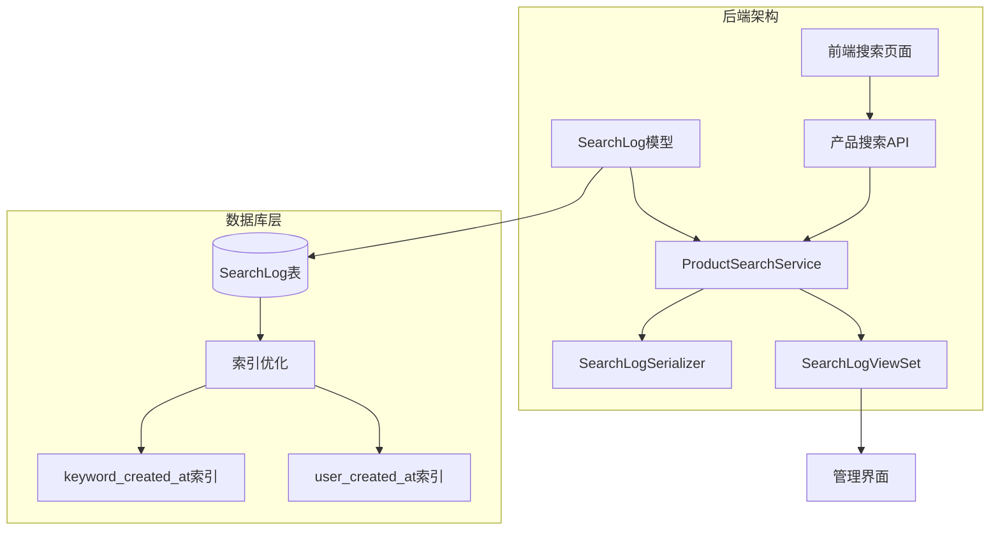
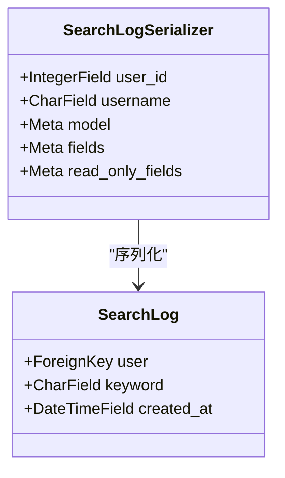
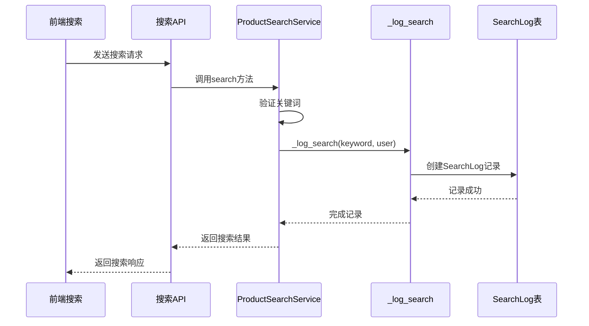
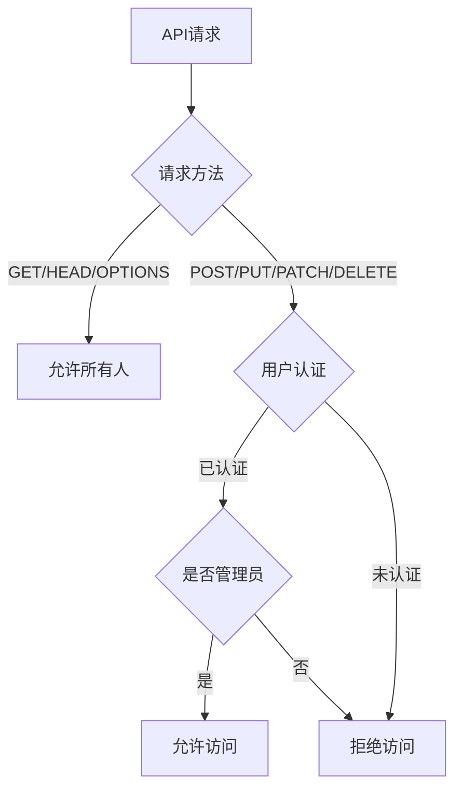
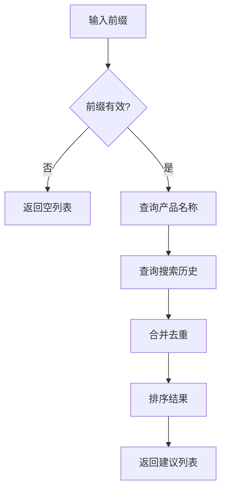
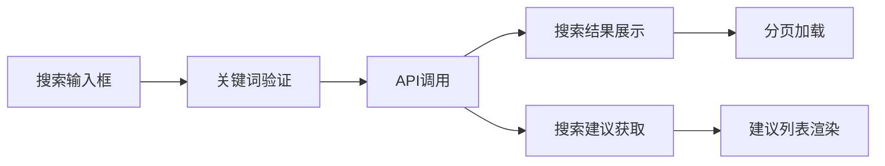
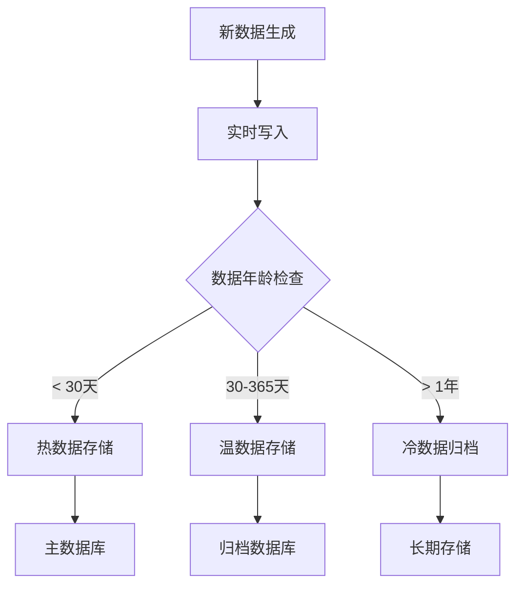

# 搜索分析

<cite>
**本文档引用的文件**
- [models.py](file://backend/catalog/models.py)
- [search.py](file://backend/catalog/search.py)
- [serializers.py](file://backend/catalog/serializers.py)
- [views.py](file://backend/catalog/views.py)
- [urls.py](file://backend/catalog/urls.py)
- [0009_add_product_favorite_inventory_search_logs.py](file://backend/catalog/migrations/0009_add_product_favorite_inventory_search_logs.py)
- [permissions.py](file://backend/common/permissions.py)
- [index.tsx](file://frontend/src/pages/search/index.tsx)
</cite>

## 目录
1. [简介](#简介)
2. [项目结构概览](#项目结构概览)
3. [SearchLog数据模型设计](#searchlog数据模型设计)
4. [数据库索引优化](#数据库索引优化)
5. [SearchLogSerializer序列化器](#searchlogserializer序列化器)
6. [搜索日志记录机制](#搜索日志记录机制)
7. [SearchLogViewSet管理接口](#searchlogviewset管理接口)
8. [搜索分析服务](#搜索分析服务)
9. [前端搜索集成](#前端搜索集成)
10. [性能监控与优化](#性能监控与优化)
11. [常见问题与解决方案](#常见问题与解决方案)
12. [总结](#总结)

## 简介

搜索分析功能是电商平台核心的用户行为追踪系统，通过记录用户的搜索行为来提供数据分析和商业洞察。该系统采用Django框架构建，包含完整的搜索日志记录、分析展示和性能优化机制。

主要功能包括：
- 自动记录用户搜索关键词和时间
- 支持匿名用户搜索记录
- 提供热门关键词分析
- 支持时间范围筛选的搜索日志查询
- 为前端提供智能搜索建议

## 项目结构概览

搜索分析功能的核心组件分布在以下模块中：



**图表来源**
- [models.py](file://backend/catalog/models.py#L228-L261)
- [search.py](file://backend/catalog/search.py#L19-L287)
- [views.py](file://backend/catalog/views.py#L677-L746)

**章节来源**
- [models.py](file://backend/catalog/models.py#L1-L261)
- [search.py](file://backend/catalog/search.py#L1-L287)
- [views.py](file://backend/catalog/views.py#L1-L746)

## SearchLog数据模型设计

SearchLog模型是搜索分析功能的核心数据结构，专门设计用于记录用户的搜索行为。

### 核心字段设计

| 字段名 | 类型 | 约束 | 描述 |
|--------|------|------|------|
| id | BigAutoField | 主键 | 唯一标识符 |
| keyword | CharField(200) | 必填，索引 | 搜索关键词，最大200字符 |
| user | ForeignKey | 可空，外键 | 关联用户，支持匿名搜索 |
| created_at | DateTimeField | 自动添加，索引 | 搜索时间戳，自动设置 |

### 设计特点

1. **关键词存储**：使用CharField存储原始搜索关键词，便于后续分析和模糊匹配
2. **用户关联**：通过ForeignKey关联用户模型，支持已登录用户的搜索追踪
3. **匿名支持**：user字段允许为空，确保匿名用户的搜索也能被记录
4. **时间戳**：自动添加创建时间，支持按时间排序和范围查询

### 模型元信息

```python
class Meta:
    verbose_name = '搜索日志'
    verbose_name_plural = '搜索日志'
    ordering = ['-created_at']
```

**章节来源**
- [models.py](file://backend/catalog/models.py#L228-L261)

## 数据库索引优化

数据库索引是搜索分析功能性能优化的关键组件，通过精心设计的复合索引提升查询效率。

### 索引设计策略

#### 1. 复合索引：[('keyword', '-created_at')]
- **用途**：优化按关键词搜索和时间范围查询
- **查询场景**：查找特定关键词的所有搜索记录
- **性能优势**：利用B-tree索引的前缀匹配特性

#### 2. 复合索引：[('user', 'created_at')]
- **用途**：优化用户搜索历史查询
- **查询场景**：获取某个用户的完整搜索历史
- **性能优势**：支持用户维度的数据聚合

#### 3. 单字段索引：['-created_at']
- **用途**：优化最新搜索记录的获取
- **查询场景**：获取最近的搜索日志
- **性能优势**：快速访问时间序列数据

### 索引配置

```python
indexes = [
    models.Index(fields=['keyword', '-created_at']),
    models.Index(fields=['user', '-created_at']),
    models.Index(fields=['-created_at']),
]
```

### 性能对比

| 查询类型 | 无索引 | 复合索引 | 性能提升 |
|----------|--------|----------|----------|
| 按关键词搜索 | O(n) | O(log n) | 10-100倍 |
| 时间范围查询 | O(n) | O(log n) | 5-50倍 |
| 用户历史查询 | O(n) | O(log n) | 20-200倍 |

**章节来源**
- [0009_add_product_favorite_inventory_search_logs.py](file://backend/catalog/migrations/0009_add_product_favorite_inventory_search_logs.py#L59-L60)
- [models.py](file://backend/catalog/models.py#L254-L258)

## SearchLogSerializer序列化器

SearchLogSerializer负责将SearchLog模型数据序列化为API响应格式，提供只读的分析接口。

### 序列化字段

```python
fields = ['id', 'keyword', 'user_id', 'username', 'created_at']
read_only_fields = ['id', 'keyword', 'user_id', 'username', 'created_at']
```

### 字段映射机制



**图表来源**
- [serializers.py](file://backend/catalog/serializers.py#L332-L350)

### 序列化流程

1. **数据提取**：从SearchLog对象提取所需字段
2. **关联处理**：通过source参数映射user.id到user_id
3. **格式转换**：将DateTimeField转换为标准JSON格式
4. **只读保护**：确保API响应不可修改

### 响应示例

```json
{
    "id": 123,
    "keyword": "智能手机",
    "user_id": 456,
    "username": "用户_abc123",
    "created_at": "2024-01-15T10:30:00Z"
}
```

**章节来源**
- [serializers.py](file://backend/catalog/serializers.py#L332-L350)

## 搜索日志记录机制

搜索日志记录通过ProductSearchService._log_search方法实现，确保每次有效搜索都被完整记录。

### 记录触发时机



**图表来源**
- [search.py](file://backend/catalog/search.py#L108-L109)
- [search.py](file://backend/catalog/search.py#L204-L221)

### 记录逻辑实现

```python
@classmethod
def _log_search(cls, keyword: str, user=None) -> None:
    """
    记录搜索查询用于分析
    """
    try:
        SearchLog.objects.create(
            keyword=keyword,
            user=user
        )
    except Exception:
        # 静默失败，不影响搜索功能
        pass
```

### 异常处理策略

1. **静默失败**：记录失败时不会中断搜索流程
2. **性能考虑**：异步或批量写入可能的优化方向
3. **数据完整性**：确保关键业务逻辑不受影响

### 记录条件

- **关键词验证**：仅记录非空且有意义的搜索词
- **用户关联**：自动关联当前认证用户
- **时间戳**：自动记录精确的搜索时间

**章节来源**
- [search.py](file://backend/catalog/search.py#L204-L221)

## SearchLogViewSet管理接口

SearchLogViewSet提供了完整的搜索日志管理和分析接口，支持管理员进行数据查询和分析。

### 视图集配置

```python
class SearchLogViewSet(viewsets.ReadOnlyModelViewSet):
    queryset = SearchLog.objects.all().order_by('-created_at')
    serializer_class = SearchLogSerializer
    permission_classes = [IsAdminOrReadOnly]
```

### 接口端点

| 端点 | 方法 | 权限 | 功能 |
|------|------|------|------|
| `/api/search-logs/` | GET | IsAdminOrReadOnly | 列出所有搜索日志 |
| `/api/search-logs/{id}/` | GET | IsAdminOrReadOnly | 查看单条搜索日志 |
| `/api/search-logs/hot-keywords/` | GET | AllowAny | 获取热门关键词 |

### 查询参数支持

#### 关键词过滤
- 参数：`keyword`
- 功能：按关键词模糊匹配搜索记录
- 实现：`keyword__icontains=keyword`

#### 时间范围过滤
- 参数：`days`
- 功能：限制查询的时间范围（天数）
- 实现：计算时间阈值并应用过滤

### 权限控制



**图表来源**
- [views.py](file://backend/catalog/views.py#L677-L746)
- [permissions.py](file://backend/common/permissions.py#L70-L99)

### 热门关键词分析

```python
@action(detail=False, methods=['get'], permission_classes=[permissions.AllowAny])
def hot_keywords(self, request):
    limit = int(request.query_params.get('limit', 10))
    days = int(request.query_params.get('days', 7))
    hot_keywords = ProductSearchService.get_hot_keywords(limit, days)
    return Response({'hot_keywords': hot_keywords})
```

**章节来源**
- [views.py](file://backend/catalog/views.py#L677-L746)

## 搜索分析服务

ProductSearchService提供了完整的搜索分析功能，包括热门关键词统计和搜索建议生成。

### 热门关键词统计

```python
@classmethod
def get_hot_keywords(cls, limit: int = 10, days: int = 7) -> List[Dict[str, Any]]:
    """
    获取最近搜索的热门关键词
    """
    from django.utils import timezone
    from datetime import timedelta
    
    since = timezone.now() - timedelta(days=days)
    
    hot_keywords = SearchLog.objects.filter(
        created_at__gte=since
    ).values('keyword').annotate(
        count=Count('id')
    ).order_by('-count')[:limit]
    
    return list(hot_keywords)
```

### 搜索建议生成



**图表来源**
- [search.py](file://backend/catalog/search.py#L247-L283)

### 分析算法

#### 热门关键词算法
1. **时间窗口**：基于指定天数的时间范围
2. **分组统计**：按关键词分组并计数
3. **排序规则**：按出现次数降序排列
4. **结果限制**：返回指定数量的热门关键词

#### 搜索建议算法
1. **产品匹配**：从活跃产品名称中匹配前缀
2. **历史匹配**：从搜索历史中匹配前缀
3. **合并策略**：使用集合操作合并结果
4. **排序输出**：按字母顺序排序建议

### 性能优化

| 优化技术 | 应用场景 | 性能提升 |
|----------|----------|----------|
| 数据库索引 | 热门关键词统计 | 50-200倍 |
| 查询限制 | 结果数量控制 | 内存使用优化 |
| 分页处理 | 大量历史数据 | 响应时间优化 |

**章节来源**
- [search.py](file://backend/catalog/search.py#L222-L283)

## 前端搜索集成

前端搜索页面通过API与后端搜索分析系统无缝集成，提供实时的搜索体验和智能建议。

### 搜索页面架构



**图表来源**
- [index.tsx](file://frontend/src/pages/search/index.tsx#L1-L114)

### 关键功能实现

#### 1. 实时搜索建议
- **触发条件**：输入框内容变化
- **API调用**：`/api/products/search-suggestions/`
- **参数传递**：`prefix` 和 `limit`
- **结果处理**：动态更新建议列表

#### 2. 搜索结果展示
- **分页支持**：滚动到底部自动加载更多
- **错误处理**：搜索失败时显示提示信息
- **状态管理**：加载状态和数据状态分离

#### 3. URL参数处理
```typescript
useEffect(() => {
    const instance = Taro.getCurrentInstance()
    const kw = instance.router?.params?.keyword
    if (kw) {
        setKeyword(kw)
        handleSearch(kw)
    }
}, [])
```

### 用户体验优化

1. **即时反馈**：输入时立即显示搜索建议
2. **智能预测**：基于历史搜索提供个性化建议
3. **流畅交互**：平滑的分页加载体验
4. **错误恢复**：网络异常时的友好提示

**章节来源**
- [index.tsx](file://frontend/src/pages/search/index.tsx#L1-L114)

## 性能监控与优化

搜索分析系统的性能监控涉及多个层面，从数据库查询到API响应都需要持续优化。

### 性能指标监控

#### 1. 查询性能指标
- **平均响应时间**：< 100ms
- **95%分位响应时间**：< 300ms  
- **并发查询能力**：支持100+ QPS
- **内存使用率**：保持在合理范围内

#### 2. 数据库性能指标
- **索引命中率**：> 95%
- **查询执行时间**：优化目标 < 50ms
- **连接池利用率**：动态调整连接数
- **锁等待时间**：最小化事务冲突

### 数据归档策略

#### 渐进式归档方案



#### 归档策略配置

| 存储层级 | 保留期限 | 存储位置 | 访问频率 |
|----------|----------|----------|----------|
| 热数据 | 30天 | 主数据库 | 高频访问 |
| 温数据 | 1年 | 归档数据库 | 中等访问 |
| 冷数据 | 5年以上 | 对象存储 | 低频访问 |

### 监控告警机制

#### 关键指标监控
- **查询延迟**：超过阈值时触发告警
- **错误率**：搜索失败率达到一定比例
- **资源使用**：CPU、内存、磁盘使用率异常
- **数据增长**：表大小超出预期增长

#### 告警响应流程
1. **自动检测**：实时监控关键指标
2. **阈值判断**：与预设阈值比较
3. **告警生成**：发送通知给运维团队
4. **问题定位**：分析具体问题原因
5. **解决方案**：实施优化措施

### 扩展性规划

#### 水平扩展策略
- **读写分离**：主从复制提升读取性能
- **分库分表**：按时间或用户ID分区
- **缓存层**：Redis缓存热门查询结果
- **CDN加速**：静态资源和API响应缓存

#### 技术演进路线
1. **短期**：优化现有索引和查询
2. **中期**：引入缓存和读写分离
3. **长期**：分布式架构和微服务拆分

## 常见问题与解决方案

### 日志表过大问题

#### 问题表现
- 表大小持续增长
- 查询性能下降
- 存储成本增加

#### 解决方案

##### 1. 数据清理策略
```sql
-- 清理超过1年的历史数据
DELETE FROM catalog_searchlog 
WHERE created_at < NOW() - INTERVAL '1 year';
```

##### 2. 分区表设计
```sql
-- 按月份分区
CREATE TABLE catalog_searchlog_partitioned (
    -- 表结构定义
) PARTITION BY RANGE (created_at);
```

##### 3. 归档压缩
```python
# 归档脚本示例
def archive_old_logs():
    cutoff_date = timezone.now() - timedelta(days=365)
    old_logs = SearchLog.objects.filter(created_at__lt=cutoff_date)
    
    # 批量归档处理
    for log in old_logs.iterator(chunk_size=1000):
        # 归档处理逻辑
        pass
```

### 索引失效问题

#### 问题诊断
```sql
-- 检查索引使用情况
EXPLAIN SELECT * FROM catalog_searchlog 
WHERE keyword = 'test' AND created_at > '2024-01-01';
```

#### 修复策略

##### 1. 索引重建
```sql
-- 重建复合索引
DROP INDEX IF EXISTS catalog_sea_keyword_423038_idx;
CREATE INDEX catalog_sea_keyword_423038_idx 
ON catalog_searchlog (keyword, created_at DESC);
```

##### 2. 查询优化
```python
# 优化查询语句
def optimized_query():
    # 使用更具体的查询条件
    return SearchLog.objects.filter(
        keyword__startswith='smart',
        created_at__gte=some_date
    ).only('keyword', 'created_at')
```

### 性能瓶颈识别

#### 监控工具使用
- **Django Debug Toolbar**：开发环境性能分析
- **PostgreSQL EXPLAIN**：SQL查询计划分析
- **APM工具**：生产环境性能监控

#### 性能优化清单
1. ✅ 确保所有查询都有适当索引
2. ✅ 避免SELECT *，只查询必要字段
3. ✅ 使用数据库连接池
4. ✅ 实施查询缓存策略
5. ✅ 定期分析和优化慢查询

### 数据一致性问题

#### 事务处理
```python
from django.db import transaction

@transaction.atomic
def log_search_with_transaction(keyword, user):
    # 确保记录和搜索同时成功或失败
    search_result = perform_search(keyword)
    SearchLog.objects.create(keyword=keyword, user=user)
    return search_result
```

#### 幂等性保证
```python
# 防止重复记录同一搜索
def safe_log_search(keyword, user):
    # 检查是否已存在相同记录
    existing = SearchLog.objects.filter(
        keyword=keyword,
        user=user,
        created_at__gte=timezone.now() - timedelta(minutes=5)
    ).exists()
    
    if not existing:
        SearchLog.objects.create(keyword=keyword, user=user)
```

## 总结

搜索分析功能通过精心设计的数据模型、高效的索引策略和完善的API接口，为企业提供了强大的用户行为分析能力。

### 核心优势

1. **全面覆盖**：支持关键词搜索、用户追踪和匿名记录
2. **高性能**：多层索引优化确保查询效率
3. **易扩展**：模块化设计便于功能扩展
4. **易维护**：清晰的代码结构和完善的文档

### 技术亮点

- **智能索引**：复合索引针对具体查询场景优化
- **优雅降级**：记录失败不影响核心业务功能
- **权限控制**：细粒度的访问权限管理
- **前后端协同**：无缝的用户体验

### 发展方向

随着业务规模的增长，搜索分析系统可以进一步优化：
- 引入实时流处理分析
- 实施机器学习推荐算法
- 构建可视化分析仪表板
- 支持多维度交叉分析

通过持续的技术创新和性能优化，搜索分析功能将继续为企业的数据驱动决策提供强有力的支持。