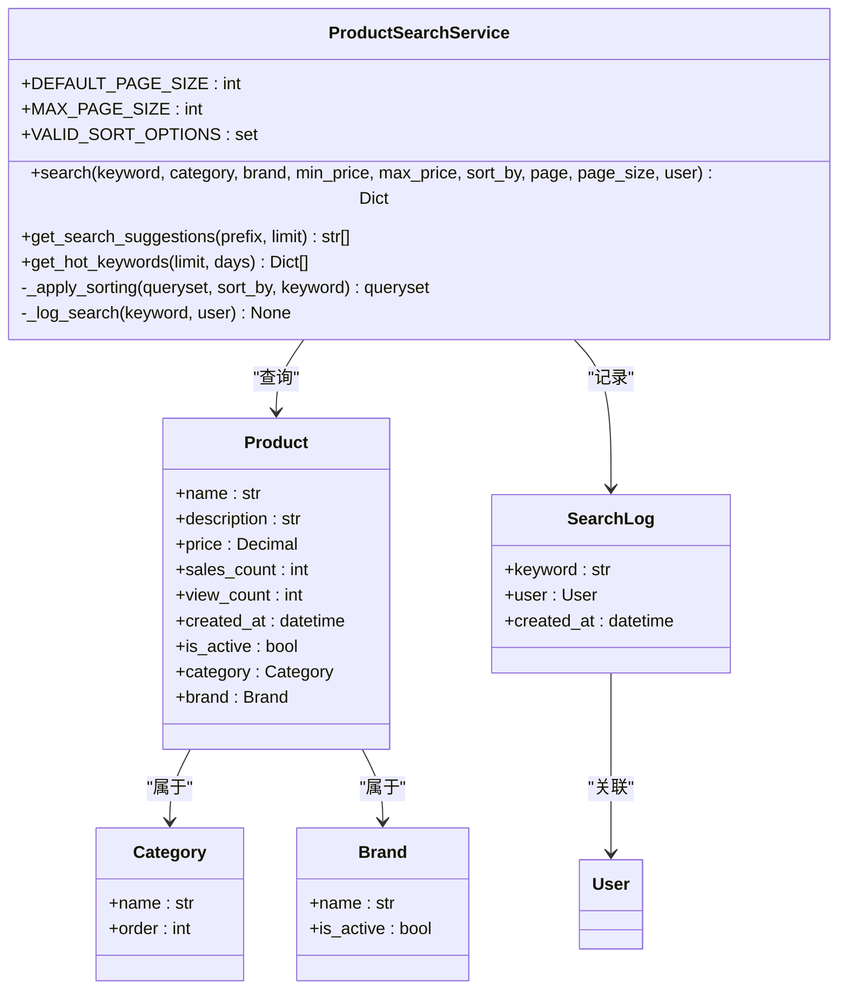
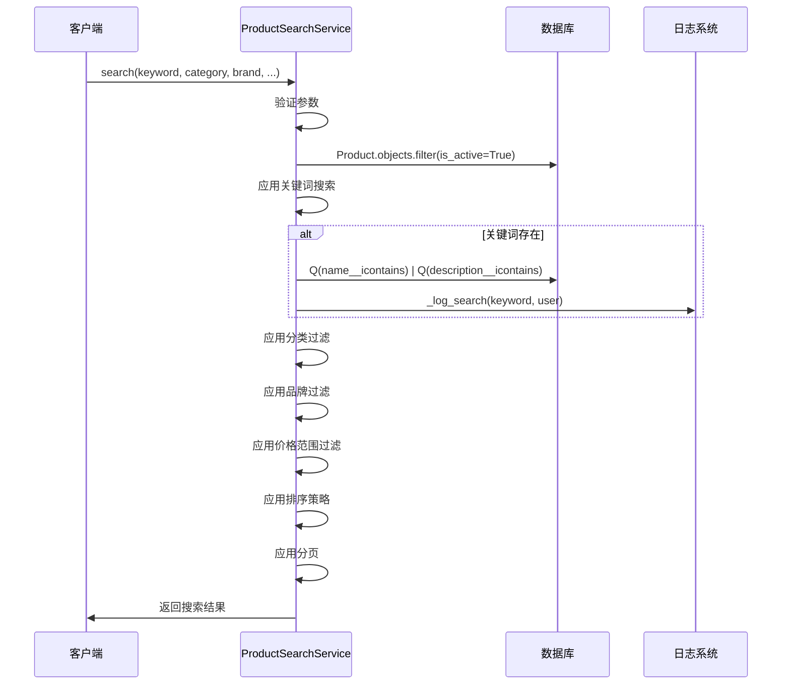
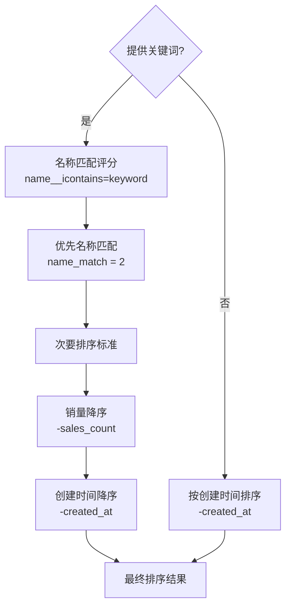
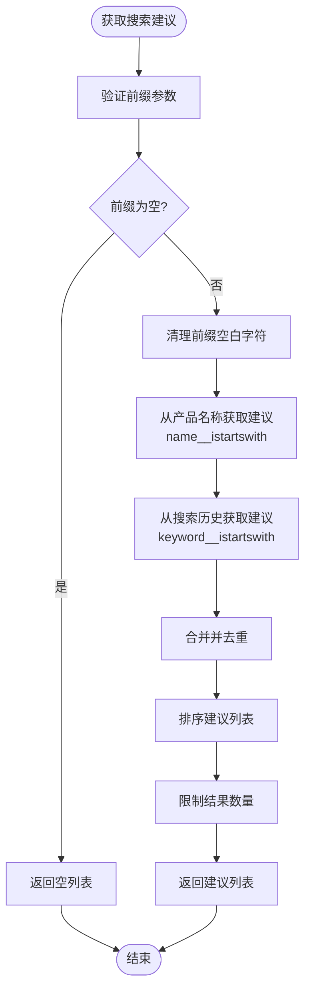
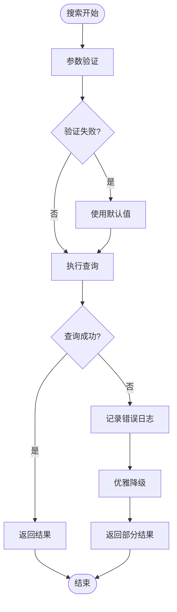
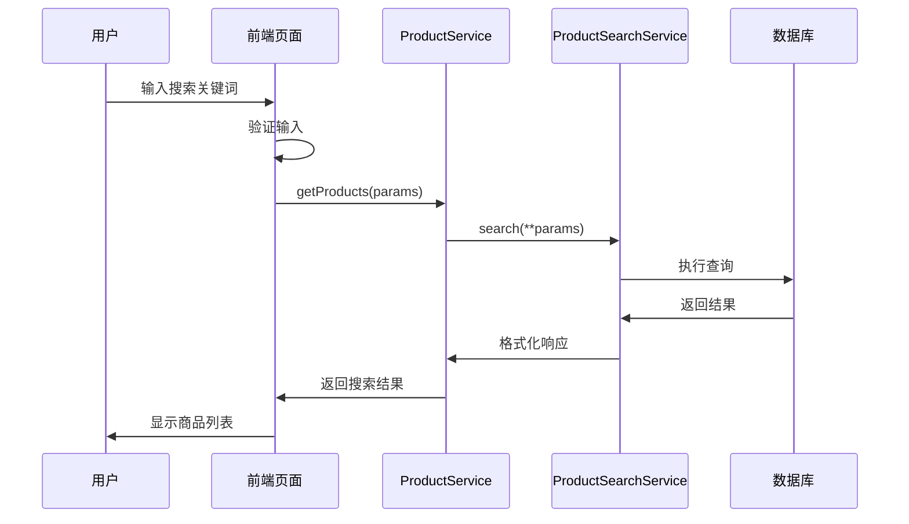

# ProductSearchService 详细文档

<cite>
**本文档引用的文件**
- [search.py](file://backend/catalog/search.py)
- [models.py](file://backend/catalog/models.py)
- [views.py](file://backend/catalog/views.py)
- [index.tsx](file://frontend/src/pages/search/index.tsx)
- [utils.py](file://backend/common/utils.py)
- [logging_config.py](file://backend/common/logging_config.py)
- [exceptions.py](file://backend/common/exceptions.py)
</cite>

## 目录
1. [简介](#简介)
2. [服务架构概览](#服务架构概览)
3. [核心功能详解](#核心功能详解)
4. [搜索方法深度解析](#搜索方法深度解析)
5. [排序策略实现](#排序策略实现)
6. [搜索建议与热门关键词](#搜索建议与热门关键词)
7. [性能优化与数据库索引](#性能优化与数据库索引)
8. [错误处理与日志记录](#错误处理与日志记录)
9. [前端集成与调用流程](#前端集成与调用流程)
10. [常见问题与最佳实践](#常见问题与最佳实践)

## 简介

ProductSearchService是电商系统中商品搜索的核心服务，提供了完整的商品检索、过滤和排序功能。该服务采用Django ORM构建，支持关键词模糊搜索、多维度过滤、多种排序策略，并具备完善的搜索日志分析能力。

### 主要特性

- **关键词搜索**：支持商品名称和描述的模糊匹配
- **多维过滤**：按分类、品牌、价格范围进行精确筛选
- **智能排序**：提供相关性、价格、销量、创建时间等多种排序方式
- **分页支持**：完整的分页机制，支持自定义页面大小
- **搜索分析**：实时记录搜索行为，生成热门关键词报告
- **搜索建议**：基于前缀匹配的产品名称和历史搜索建议

## 服务架构概览



**图表来源**
- [search.py](file://backend/catalog/search.py#L19-L287)
- [models.py](file://backend/catalog/models.py#L43-L312)

## 核心功能详解

### 关键词搜索机制

ProductSearchService的核心是`search`方法，它构建了一个灵活的Django查询集来处理各种搜索条件：

```mermaid
flowchart TD
Start([开始搜索]) --> ValidateSort["验证排序选项"]
ValidateSort --> ValidatePageSize["验证页面大小"]
ValidatePageSize --> ActiveProducts["筛选活跃商品"]
ActiveProducts --> HasKeyword{"是否有关键词?"}
HasKeyword --> |是| KeywordSearch["关键词搜索<br/>name__icontains & description__icontains"]
HasKeyword --> |否| CategoryFilter["分类过滤"]
KeywordSearch --> LogSearch["记录搜索日志"]
LogSearch --> CategoryFilter
CategoryFilter --> HasCategory{"是否有分类?"}
HasCategory --> |是| ApplyCategory["应用分类过滤<br/>category__name__iexact"]
HasCategory --> |否| BrandFilter["品牌过滤"]
ApplyCategory --> BrandFilter
BrandFilter --> HasBrand{"是否有品牌?"}
HasBrand --> |是| ApplyBrand["应用品牌过滤<br/>brand__name__iexact"]
HasBrand --> |否| PriceFilter["价格范围过滤"]
ApplyBrand --> PriceFilter
PriceFilter --> HasMinPrice{"是否有最低价?"}
HasMinPrice --> |是| ApplyMinPrice["应用最低价过滤<br/>price__gte"]
HasMinPrice --> |否| HasMaxPrice{"是否有最高价?"}
ApplyMinPrice --> HasMaxPrice
HasMaxPrice --> |是| ApplyMaxPrice["应用最高价过滤<br/>price__lte"]
HasMaxPrice --> |否| ApplySorting["应用排序"]
ApplyMaxPrice --> ApplySorting
ApplySorting --> HasKeyword2{"是否有关键词?"}
HasKeyword2 --> |是| RelevanceSort["相关性排序<br/>优先名称匹配"]
HasKeyword2 --> |否| DateSort["按创建时间排序"]
RelevanceSort --> ApplyPagination["应用分页"]
DateSort --> ApplyPagination
ApplyPagination --> ReturnResults["返回搜索结果"]
ReturnResults --> End([结束])
```



**图表来源**
- [search.py](file://backend/catalog/search.py#L47-L158)

### 过滤器实现

服务支持四种主要的过滤器：

| 过滤器类型 | 实现方式 | 数据库查询 | 用途 |
|-----------|---------|-----------|------|
| 关键词搜索 | `icontains` | `Q(name__icontains=keyword) \| Q(description__icontains=keyword)` | 在商品名称和描述中进行模糊匹配 |
| 分类过滤 | `iexact` | `category__name__iexact=category` | 精确匹配分类名称（不区分大小写） |
| 品牌过滤 | `iexact` | `brand__name__iexact=brand` | 精确匹配品牌名称（不区分大小写） |
| 价格范围 | `gte/lte` | `price__gte=min_price & price__lte=max_price` | 筛选指定价格区间内的商品 |

**章节来源**
- [search.py](file://backend/catalog/search.py#L100-L133)

## 搜索方法深度解析

### 方法签名与参数

`search`方法提供了全面的搜索控制参数：

```python
@classmethod
def search(
    cls,
    keyword: Optional[str] = None,
    category: Optional[str] = None,
    brand: Optional[str] = None,
    min_price: Optional[Decimal] = None,
    max_price: Optional[Decimal] = None,
    sort_by: str = 'relevance',
    page: int = 1,
    page_size: int = DEFAULT_PAGE_SIZE,
    user=None,
) -> Dict[str, Any]:
```

### 参数验证与处理

服务实现了多层次的参数验证：

1. **排序选项验证**：确保`sort_by`参数在允许的范围内
2. **页面大小限制**：防止滥用，默认值20，最大值100
3. **价格转换异常处理**：优雅处理价格参数的格式错误
4. **空值处理**：自动忽略无效的空字符串参数

### 查询集构建流程



**图表来源**
- [search.py](file://backend/catalog/search.py#L47-L158)

**章节来源**
- [search.py](file://backend/catalog/search.py#L47-L158)

## 排序策略实现

### 支持的排序选项

ProductSearchService提供了六种排序策略：

| 排序选项 | 数据库字段 | 排序方向 | 适用场景 |
|---------|-----------|---------|----------|
| `relevance` | 名称匹配度 | 降序 | 关键词搜索时优先匹配名称 |
| `price_asc` | `price` | 升序 | 价格从低到高排列 |
| `price_desc` | `price` | 降序 | 价格从高到低排列 |
| `sales` | `sales_count` | 降序 | 销量最高的商品优先 |
| `created` | `created_at` | 降序 | 最新上架的商品优先 |
| `views` | `view_count` | 降序 | 浏览量最多的商品优先 |

### 相关性排序算法

当提供关键词时，服务使用智能的相关性排序：



**图表来源**
- [search.py](file://backend/catalog/search.py#L161-L201)

### 排序策略的具体实现

相关性排序使用Django的`Case`和`When`表达式：

```python
queryset = queryset.annotate(
    name_match=Case(
        When(name__icontains=keyword, then=Value(2)),
        default=Value(1),
        output_field=IntegerField()
    )
).order_by('-name_match', '-sales_count', '-created_at')
```

这种实现确保：
- 名称完全匹配的商品获得最高优先级
- 描述匹配的商品次之
- 销量和创建时间作为次要排序依据

**章节来源**
- [search.py](file://backend/catalog/search.py#L161-L201)

## 搜索建议与热门关键词

### 搜索建议功能

`get_search_suggestions`方法提供了智能的搜索建议：



**图表来源**
- [search.py](file://backend/catalog/search.py#L248-L282)

### 热门关键词分析

`get_hot_keywords`方法通过聚合查询分析搜索行为：

```python
hot_keywords = SearchLog.objects.filter(
    created_at__gte=since
).values('keyword').annotate(
    count=Count('id')
).order_by('-count')[:limit]
```

这种方法的优势：
- **时间窗口过滤**：只分析最近的搜索行为
- **聚合统计**：计算每个关键词的出现频率
- **排序优化**：按热度降序排列
- **限制结果**：避免返回过多数据

**章节来源**
- [search.py](file://backend/catalog/search.py#L248-L282)

## 性能优化与数据库索引

### 数据库索引策略

ProductSearchService依赖于精心设计的数据库索引来保证查询性能：

#### Product模型索引

| 索引字段 | 类型 | 用途 | 性能影响 |
|---------|------|------|----------|
| `is_active` | 单字段 | 快速筛选活跃商品 | 减少扫描行数 |
| `is_active, -sales_count` | 复合索引 | 销量排序查询 | 覆盖索引 |
| `is_active, -view_count` | 复合索引 | 浏览量排序查询 | 覆盖索引 |
| `category, is_active` | 复合索引 | 分类过滤查询 | 高效过滤 |
| `brand, is_active` | 复合索引 | 品牌过滤查询 | 高效过滤 |
| `-created_at` | 单字段 | 创建时间排序 | 快速排序 |
| `product_code` | 单字段 | 唯一标识查询 | 极快查找 |

#### SearchLog模型索引

| 索引字段 | 类型 | 用途 | 性能影响 |
|---------|------|------|----------|
| `keyword, -created_at` | 复合索引 | 搜索历史查询 | 高效范围查询 |
| `user, -created_at` | 复合索引 | 用户搜索行为分析 | 个性化推荐 |
| `-created_at` | 单字段 | 时间序列查询 | 快速时间过滤 |

### 查询优化技巧

1. **选择性过滤优先**：先应用最具有选择性的过滤器
2. **覆盖索引利用**：尽量让查询走索引而不访问表数据
3. **查询计划分析**：定期检查EXPLAIN输出优化查询
4. **缓存策略**：对热门搜索结果实施缓存

**章节来源**
- [models.py](file://backend/catalog/models.py#L105-L113)

## 错误处理与日志记录

### 异常处理机制

ProductSearchService实现了多层次的错误处理：



**图表来源**
- [search.py](file://backend/catalog/search.py#L86-L95)

### 日志记录策略

服务采用结构化日志记录：

1. **搜索日志记录**：每次关键词搜索都会记录到`SearchLog`表
2. **异常捕获**：搜索过程中的异常会被捕获并记录
3. **性能监控**：查询耗时会被记录用于性能分析
4. **用户行为分析**：记录用户的搜索习惯和偏好

### 错误恢复机制

- **价格转换异常**：价格参数格式错误时忽略该过滤器
- **搜索日志失败**：日志记录失败时不中断搜索流程
- **数据库连接异常**：数据库连接问题时返回空结果而非抛出异常

**章节来源**
- [search.py](file://backend/catalog/search.py#L204-L221)
- [exceptions.py](file://backend/common/exceptions.py#L251-L503)

## 前端集成与调用流程

### 前端搜索页面架构



**图表来源**
- [index.tsx](file://frontend/src/pages/search/index.tsx#L25-L50)
- [views.py](file://backend/catalog/views.py#L83-L131)

### 前端调用示例

前端通过`productService.getProducts`方法调用搜索服务：

```typescript
const handleSearch = async (kw?: string, pageNum = 1) => {
  const searchKeyword = kw || keyword
  if (!searchKeyword.trim()) {
    Taro.showToast({ title: '请输入搜索关键词', icon: 'none' })
    return
  }
  
  setSearching(true)
  try {
    const res = await productService.getProducts({
      search: searchKeyword,
      page: pageNum,
      page_size: 20
    })
    
    if (pageNum === 1) {
      setProducts(res.results)
    } else {
      setProducts([...products, ...res.results])
    }
    setHasMore(res.has_next || false)
    setPage(pageNum)
  } catch (error) {
    Taro.showToast({ title: '搜索失败', icon: 'none' })
  } finally {
    setSearching(false)
  }
}
```

### 分页加载机制

前端实现了智能的无限滚动加载：

1. **初始加载**：用户输入关键词后立即加载第一页
2. **滚动触发**：用户滚动到底部时自动加载下一页
3. **状态管理**：跟踪加载状态、是否有更多数据
4. **错误处理**：加载失败时提供重试机制

**章节来源**
- [index.tsx](file://frontend/src/pages/search/index.tsx#L25-L50)

## 常见问题与最佳实践

### 性能瓶颈分析

#### 搜索性能优化

1. **索引优化**
   - 确保所有常用查询字段都有适当的索引
   - 使用复合索引覆盖多条件查询
   - 定期分析查询执行计划

2. **查询优化**
   - 避免SELECT *
   - 使用select_related预加载关联对象
   - 实施查询缓存策略

3. **内存管理**
   - 控制单次查询返回的结果数量
   - 实施分页机制防止内存溢出
   - 使用生成器处理大量数据

#### 高并发处理

1. **连接池配置**
   - 合理设置数据库连接池大小
   - 实施连接超时和重试机制
   - 监控连接池使用情况

2. **缓存策略**
   - 缓存热门搜索结果
   - 实施Redis缓存层
   - 设置合理的缓存过期时间

3. **负载均衡**
   - 实施读写分离
   - 使用CDN加速静态资源
   - 部署多个应用实例

### 开发最佳实践

#### 代码质量

1. **参数验证**
   ```python
   # 好的做法：严格的参数验证
   try:
       page_size = int(page_size)
       page_size = min(max(page_size, 1), cls.MAX_PAGE_SIZE)
   except (ValueError, TypeError):
       page_size = cls.DEFAULT_PAGE_SIZE
   ```

2. **异常处理**
   ```python
   # 好的做法：优雅的异常处理
   try:
       SearchLog.objects.create(keyword=keyword, user=user)
   except Exception:
       # 静默失败，不影响主流程
       pass
   ```

3. **日志记录**
   ```python
   # 好的做法：结构化的日志记录
   logger.info('搜索完成', extra={
       'keyword': keyword,
       'result_count': len(results),
       'execution_time': execution_time
   })
   ```

#### 测试策略

1. **单元测试**
   - 测试各种参数组合
   - 验证边界条件处理
   - 模拟异常情况

2. **集成测试**
   - 测试完整的搜索流程
   - 验证前后端交互
   - 性能基准测试

3. **压力测试**
   - 模拟高并发搜索
   - 测试数据库连接池
   - 验证缓存效果

### 监控与维护

#### 关键指标监控

1. **查询性能指标**
   - 平均查询响应时间
   - 查询超时率
   - 数据库连接使用率

2. **业务指标**
   - 搜索成功率
   - 热门关键词变化
   - 用户搜索行为分析

3. **系统健康指标**
   - 内存使用情况
   - CPU使用率
   - 磁盘I/O性能

#### 维护任务

1. **定期优化**
   - 分析慢查询日志
   - 更新数据库索引
   - 清理历史搜索数据

2. **容量规划**
   - 监控数据增长趋势
   - 预估存储需求
   - 规划硬件升级

3. **安全维护**
   - 定期备份搜索日志
   - 监控异常访问模式
   - 更新安全配置

通过遵循这些最佳实践，可以确保ProductSearchService在生产环境中稳定高效地运行，为用户提供优质的搜索体验。