# 商品目录模块

<cite>
**本文档引用的文件**
- [backend/catalog/models.py](file://backend/catalog/models.py)
- [backend/catalog/views.py](file://backend/catalog/views.py)
- [backend/catalog/serializers.py](file://backend/catalog/serializers.py)
- [backend/catalog/search.py](file://backend/catalog/search.py)
- [backend/catalog/admin.py](file://backend/catalog/admin.py)
- [backend/catalog/urls.py](file://backend/catalog/urls.py)
- [backend/common/permissions.py](file://backend/common/permissions.py)
- [backend/catalog/management/commands/sync_haier_products.py](file://backend/catalog/management/commands/sync_haier_products.py)
- [backend/integrations/haierapi.py](file://backend/integrations/haierapi.py)
- [frontend/src/services/product.ts](file://frontend/src/services/product.ts)
- [frontend/src/pages/product-detail/index.tsx](file://frontend/src/pages/product-detail/index.tsx)
- [merchant/src/pages/Products/index.tsx](file://merchant/src/pages/Products/index.tsx)
</cite>

## 目录
1. [简介](#简介)
2. [项目结构](#项目结构)
3. [核心模型设计](#核心模型设计)
4. [架构概览](#架构概览)
5. [详细组件分析](#详细组件分析)
6. [搜索与过滤机制](#搜索与过滤机制)
7. [权限控制](#权限控制)
8. [API文档](#api文档)
9. [前端集成](#前端集成)
10. [性能优化](#性能优化)
11. [常见问题与解决方案](#常见问题与解决方案)
12. [总结](#总结)

## 简介

商品目录模块是电商平台的核心功能之一，负责管理商品、分类、品牌等基础数据，提供强大的搜索、过滤和排序功能。该模块采用Django REST Framework构建，支持本地商品管理和海尔API集成，具备完善的权限控制和性能优化机制。

### 主要特性

- **多源商品管理**：支持本地商品和海尔商品的统一管理
- **智能搜索**：基于关键词的模糊搜索和多维度过滤
- **灵活排序**：支持按价格、销量、浏览量等多种策略排序
- **权限控制**：基于IsAdminOrReadOnly的访问控制机制
- **API文档**：使用drf-spectacular自动生成API文档
- **库存同步**：定时同步海尔商品的库存和价格信息

## 项目结构

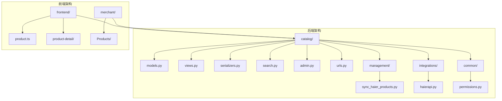

**图表来源**
- [backend/catalog/models.py](file://backend/catalog/models.py#L1-L312)
- [backend/catalog/views.py](file://backend/catalog/views.py#L1-L980)
- [backend/catalog/urls.py](file://backend/catalog/urls.py#L1-L15)

**章节来源**
- [backend/catalog/models.py](file://backend/catalog/models.py#L1-L312)
- [backend/catalog/views.py](file://backend/catalog/views.py#L1-L980)
- [backend/catalog/urls.py](file://backend/catalog/urls.py#L1-L15)

## 核心模型设计

### Product模型

Product模型是整个商品目录的核心，设计了丰富的字段来支持本地商品和海尔商品的管理需求。

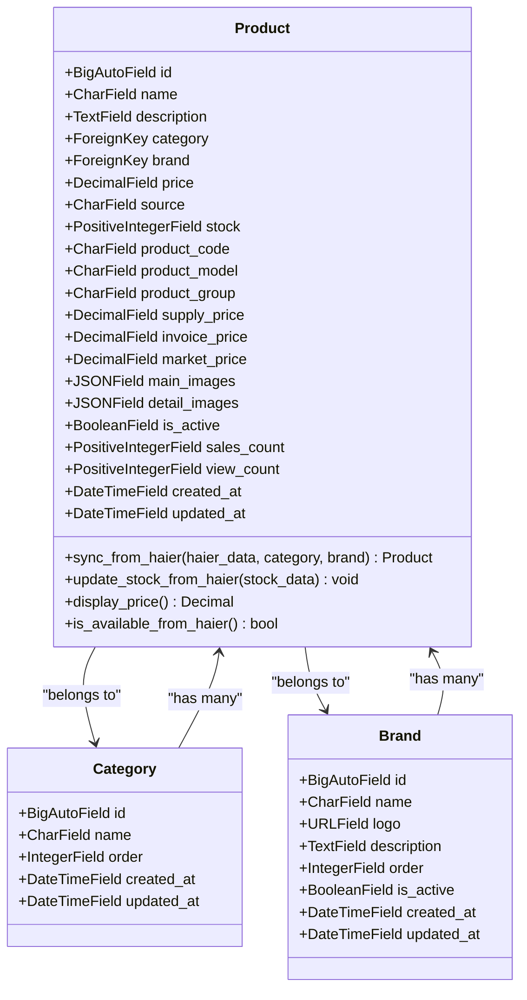

**图表来源**
- [backend/catalog/models.py](file://backend/catalog/models.py#L43-L312)

#### 字段设计说明

| 字段类型 | 字段名 | 用途 | 约束 |
|---------|--------|------|------|
| CharField | name | 商品名称 | max_length=200 |
| TextField | description | 商品描述 | 可为空 |
| ForeignKey | category | 所属分类 | CASCADE删除 |
| ForeignKey | brand | 所属品牌 | CASCADE删除 |
| DecimalField | price | 商品价格 | max_digits=10, decimal_places=2 |
| CharField | source | 商品来源 | local/haier |
| PositiveIntegerField | stock | 库存数量 | 默认0 |
| JSONField | main_images | 主图列表 | JSON格式存储 |
| JSONField | detail_images | 详情图列表 | JSON格式存储 |
| BooleanField | is_active | 是否上架 | 默认True |

#### 海尔商品特殊字段

| 字段类型 | 字段名 | 用途 | 数据来源 |
|---------|--------|------|----------|
| CharField | product_code | 海尔产品编码 | 海尔API |
| CharField | product_model | 海尔产品型号 | 海尔API |
| CharField | product_group | 海尔产品组 | 海尔API |
| DecimalField | supply_price | 普通供价 | 海尔API |
| DecimalField | invoice_price | 开票价 | 海尔API |
| DecimalField | market_price | 市场价 | 海尔API |
| CharField | is_sales | 是否可采 | 海尔API |

**章节来源**
- [backend/catalog/models.py](file://backend/catalog/models.py#L43-L312)

### Category和Brand模型

这两个模型相对简单，但设计了合理的索引和排序机制：

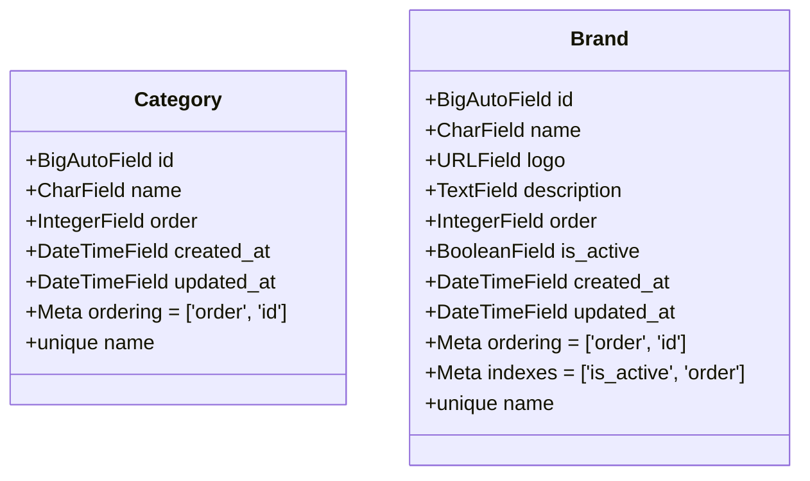

**图表来源**
- [backend/catalog/models.py](file://backend/catalog/models.py#L5-L41)

**章节来源**
- [backend/catalog/models.py](file://backend/catalog/models.py#L5-L41)

## 架构概览

商品目录模块采用分层架构设计，清晰分离了数据层、业务逻辑层和表现层：

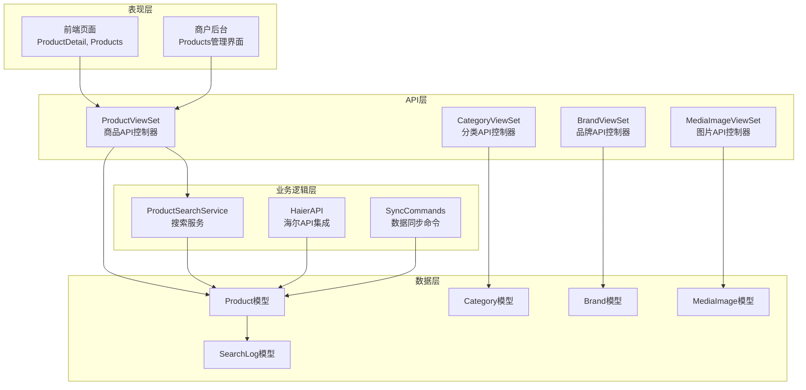

**图表来源**
- [backend/catalog/views.py](file://backend/catalog/views.py#L29-L980)
- [backend/catalog/search.py](file://backend/catalog/search.py#L19-L287)
- [backend/catalog/urls.py](file://backend/catalog/urls.py#L1-L15)

**章节来源**
- [backend/catalog/views.py](file://backend/catalog/views.py#L29-L980)
- [backend/catalog/search.py](file://backend/catalog/search.py#L19-L287)
- [backend/catalog/urls.py](file://backend/catalog/urls.py#L1-L15)

## 详细组件分析

### ProductViewSet - 商品API控制器

ProductViewSet是商品管理的核心控制器，提供了完整的CRUD操作和高级搜索功能：

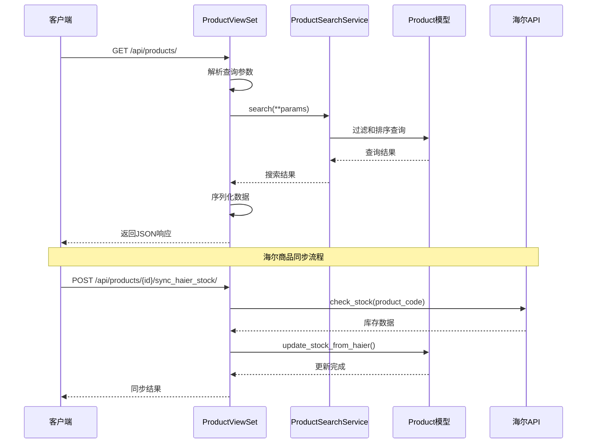

**图表来源**
- [backend/catalog/views.py](file://backend/catalog/views.py#L29-L980)

#### 核心功能特性

| 功能 | 实现方式 | 查询参数 |
|------|----------|----------|
| 基础列表 | ProductSearchService | search, category, brand, min_price, max_price |
| 高级排序 | _apply_sorting方法 | sort_by: relevance, price_asc, price_desc, sales, created, views |
| 分页支持 | Paginator类 | page, page_size |
| 搜索建议 | get_search_suggestions | prefix, limit |
| 热门关键词 | get_hot_keywords | limit, days |
| 推荐商品 | recommendations | type, limit, category_id |

**章节来源**
- [backend/catalog/views.py](file://backend/catalog/views.py#L29-L980)

### ProductSearchService - 搜索服务

ProductSearchService提供了强大的搜索和过滤能力：

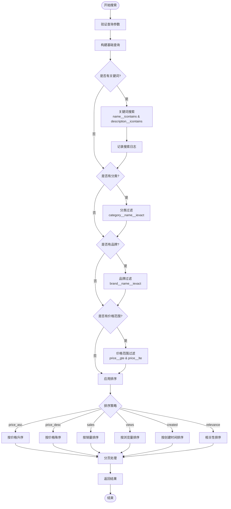

**图表来源**
- [backend/catalog/search.py](file://backend/catalog/search.py#L47-L287)

#### 排序策略详解

| 排序类型 | 实现逻辑 | 适用场景 |
|----------|----------|----------|
| relevance | 基于关键词匹配度排序 | 关键词搜索时 |
| price_asc | 按价格升序排列 | 价格敏感用户 |
| price_desc | 按价格降序排列 | 高端商品筛选 |
| sales | 按销量降序排列 | 热销商品推荐 |
| views | 按浏览量降序排列 | 流行商品发现 |
| created | 按创建时间降序排列 | 最新商品浏览 |

**章节来源**
- [backend/catalog/search.py](file://backend/catalog/search.py#L47-L287)

### 序列化器设计

ProductSerializer采用了复杂而灵活的设计来处理不同类型的图片和价格计算：

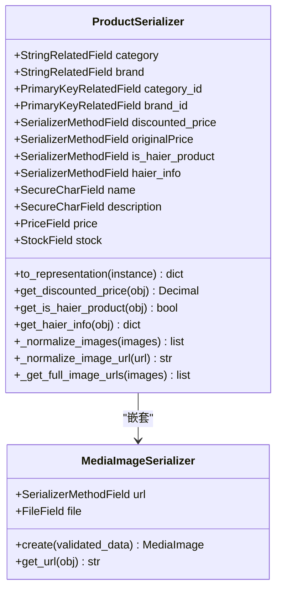

**图表来源**
- [backend/catalog/serializers.py](file://backend/catalog/serializers.py#L50-L352)

#### 图片处理逻辑

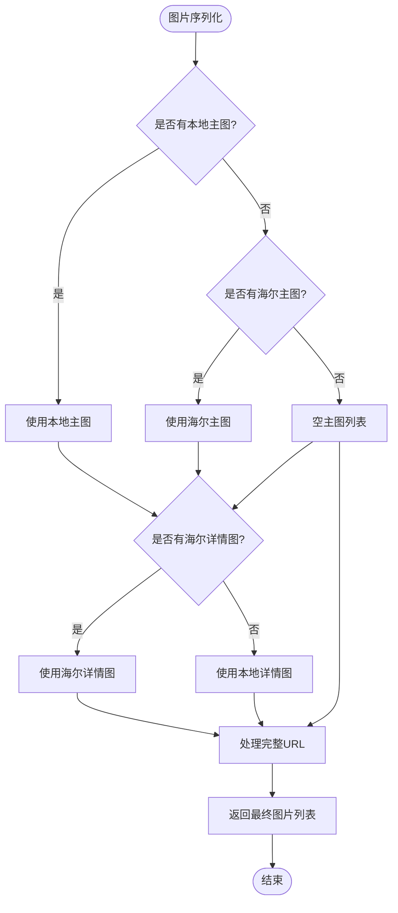

**图表来源**
- [backend/catalog/serializers.py](file://backend/catalog/serializers.py#L122-L156)

**章节来源**
- [backend/catalog/serializers.py](file://backend/catalog/serializers.py#L50-L352)

## 搜索与过滤机制

### 查询参数处理

ProductViewSet支持丰富的查询参数来满足不同的搜索需求：

| 参数名 | 类型 | 描述 | 示例 |
|--------|------|------|------|
| search | string | 关键词搜索 | ?search=冰箱 |
| category | string | 分类过滤 | ?category=家电 |
| brand | string | 品牌过滤 | ?brand=海尔 |
| min_price | decimal | 最小价格 | ?min_price=100 |
| max_price | decimal | 最大价格 | ?max_price=5000 |
| sort_by | string | 排序策略 | ?sort_by=sales |
| page | integer | 页码 | ?page=2 |
| page_size | integer | 每页数量 | ?page_size=20 |

### 海尔商品同步机制

系统提供了完整的海尔商品同步功能，支持定时任务和手动触发：

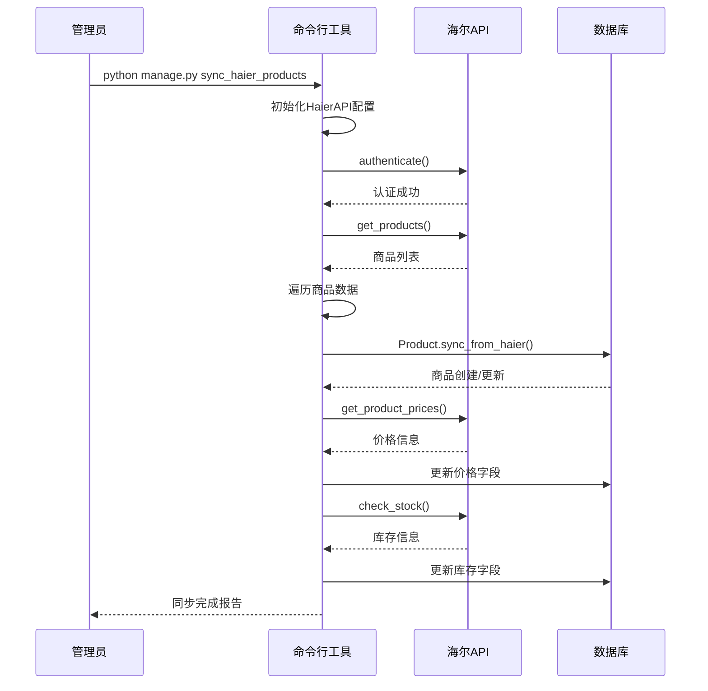

**图表来源**
- [backend/catalog/management/commands/sync_haier_products.py](file://backend/catalog/management/commands/sync_haier_products.py#L13-L156)

**章节来源**
- [backend/catalog/views.py](file://backend/catalog/views.py#L29-L980)
- [backend/catalog/search.py](file://backend/catalog/search.py#L47-L287)
- [backend/catalog/management/commands/sync_haier_products.py](file://backend/catalog/management/commands/sync_haier_products.py#L13-L156)

## 权限控制

### IsAdminOrReadOnly权限

该权限类实现了读写分离的安全控制：

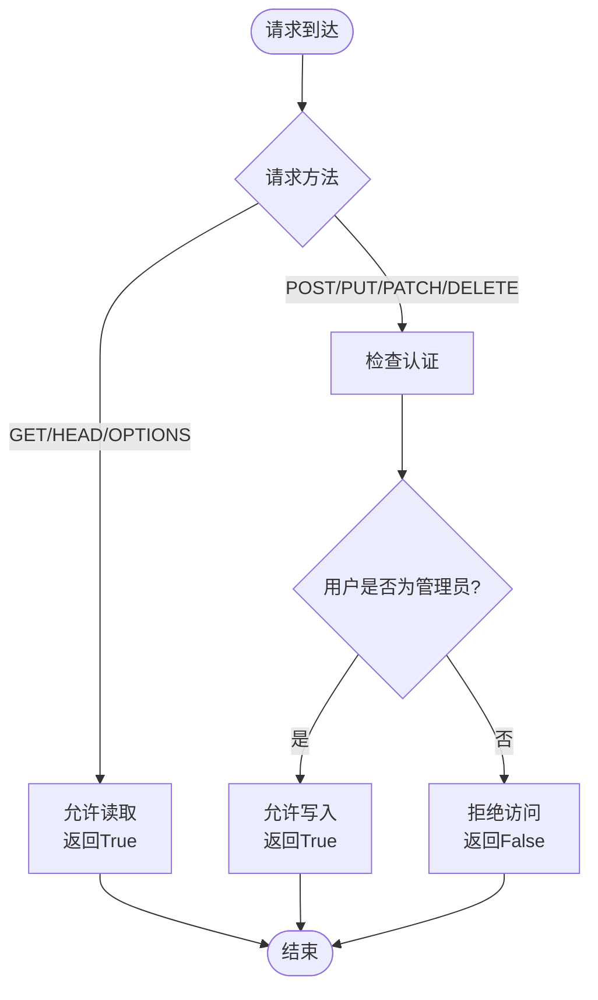

**图表来源**
- [backend/common/permissions.py](file://backend/common/permissions.py#L70-L100)

#### 权限配置

| 视图集 | GET | POST | PUT | PATCH | DELETE |
|--------|-----|------|-----|-------|--------|
| ProductViewSet | ✅ 公开访问 | ❌ 仅管理员 | ❌ 仅管理员 | ❌ 仅管理员 | ❌ 仅管理员 |
| CategoryViewSet | ✅ 公开访问 | ❌ 仅管理员 | ❌ 仅管理员 | ❌ 仅管理员 | ❌ 仅管理员 |
| BrandViewSet | ✅ 公开访问 | ❌ 仅管理员 | ❌ 仅管理员 | ❌ 仅管理员 | ❌ 仅管理员 |
| MediaImageViewSet | ✅ 公开访问 | ❌ 仅认证用户 | ❌ 仅认证用户 | ❌ 仅认证用户 | ❌ 仅认证用户 |

**章节来源**
- [backend/common/permissions.py](file://backend/common/permissions.py#L70-L100)
- [backend/catalog/views.py](file://backend/catalog/views.py#L29-L980)

## API文档

### drf-spectacular集成

系统使用drf-spectacular自动生成API文档，支持OpenAPI规范：

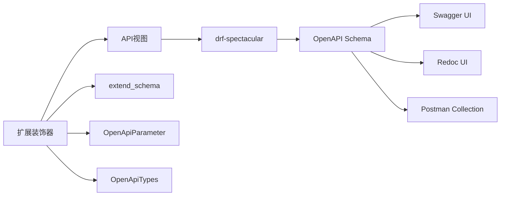

**图表来源**
- [backend/catalog/views.py](file://backend/catalog/views.py#L29-L980)

### 主要API端点

| 端点 | 方法 | 描述 | 权限 |
|------|------|------|------|
| /api/products/ | GET | 获取商品列表 | AllowAny |
| /api/products/ | POST | 创建商品 | IsAdminOrReadOnly |
| /api/products/{id}/ | GET | 获取商品详情 | AllowAny |
| /api/products/{id}/ | PUT/PATCH | 更新商品 | IsAdminOrReadOnly |
| /api/products/{id}/ | DELETE | 删除商品 | IsAdminOrReadOnly |
| /api/categories/ | GET/POST | 分类管理 | IsAdminOrReadOnly |
| /api/brands/ | GET/POST | 品牌管理 | IsAdminOrReadOnly |
| /api/media-images/ | GET/POST | 图片上传 | IsAuthenticatedOrReadOnly |

**章节来源**
- [backend/catalog/views.py](file://backend/catalog/views.py#L29-L980)
- [backend/catalog/urls.py](file://backend/catalog/urls.py#L1-L15)

## 前端集成

### 前端服务层

前端通过专门的服务层与后端API交互：

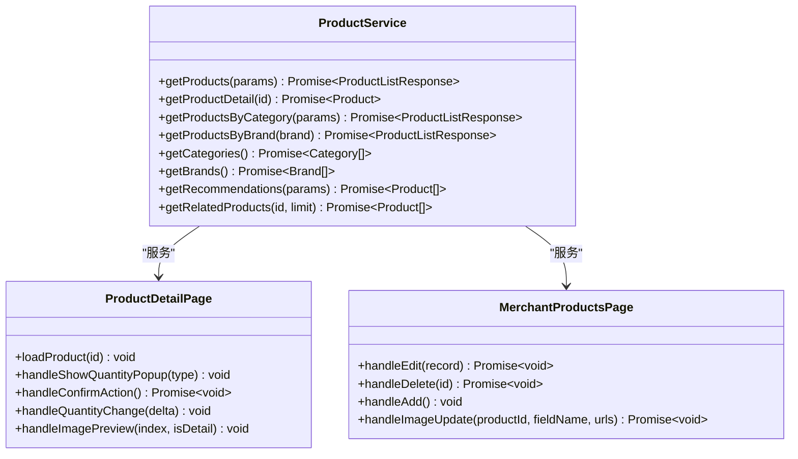

**图表来源**
- [frontend/src/services/product.ts](file://frontend/src/services/product.ts#L1-L64)
- [frontend/src/pages/product-detail/index.tsx](file://frontend/src/pages/product-detail/index.tsx#L1-L311)
- [merchant/src/pages/Products/index.tsx](file://merchant/src/pages/Products/index.tsx#L1-L720)

### 响应格式

API返回的标准响应格式：

```typescript
interface ProductListResponse {
  results: Product[];
  total: number;
  page: number;
  total_pages: number;
  has_next: boolean;
  has_previous: boolean;
}

interface Product {
  id: number;
  name: string;
  description: string;
  price: number;
  discounted_price: number;
  originalPrice: number;
  main_images: string[];
  detail_images: string[];
  category: string;
  brand: string;
  stock: number;
  sales_count: number;
  view_count: number;
  is_active: boolean;
  is_haier_product: boolean;
  haier_info: HaierInfo | null;
}
```

**章节来源**
- [frontend/src/services/product.ts](file://frontend/src/services/product.ts#L1-L64)
- [frontend/src/pages/product-detail/index.tsx](file://frontend/src/pages/product-detail/index.tsx#L1-L311)
- [merchant/src/pages/Products/index.tsx](file://merchant/src/pages/Products/index.tsx#L1-L720)

## 性能优化

### 数据库优化

1. **索引设计**
   - Product模型：`is_active`, `-sales_count`, `-view_count`, `category`, `brand`, `-created_at`
   - Brand模型：`is_active`, `order`
   - SearchLog模型：`keyword`, `user`, `-created_at`

2. **查询优化**
   - 使用`select_related`预加载关联对象
   - 实现批量查询减少数据库访问
   - 使用缓存减少重复计算

3. **分页优化**
   - 支持大数量数据的高效分页
   - 内存友好的分页算法

### 缓存策略

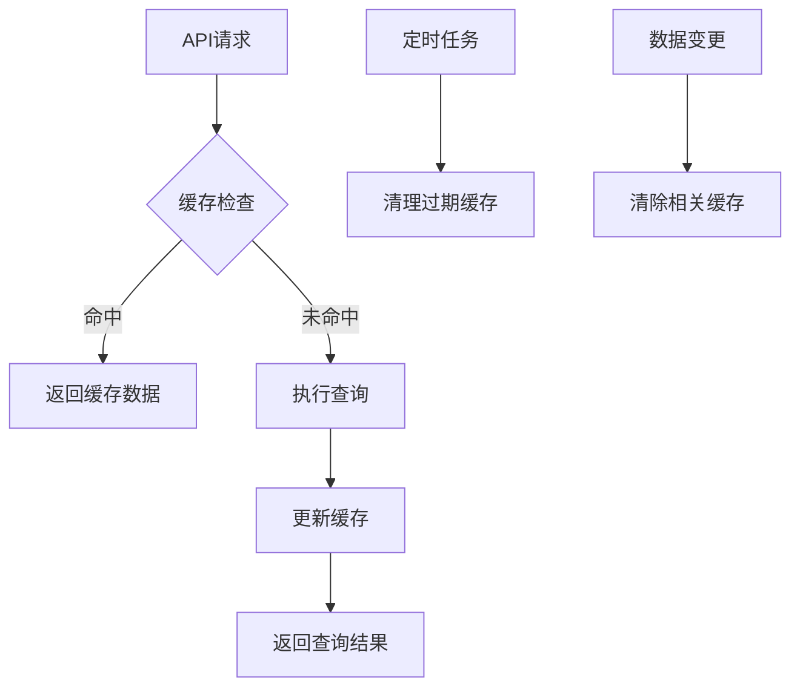

### 图片处理优化

- 支持多种图片格式转换
- 自动压缩和尺寸调整
- CDN加速和缓存策略

## 常见问题与解决方案

### 搜索性能优化

**问题**：大量商品数据下的搜索性能下降

**解决方案**：
1. 实现全文搜索引擎（如Elasticsearch）
2. 添加搜索结果缓存
3. 优化数据库索引
4. 实现搜索建议功能

### 分类层级管理

**问题**：复杂的分类层级导致查询困难

**解决方案**：
1. 使用树形结构存储分类
2. 实现递归查询优化
3. 添加分类缓存机制

### 库存同步延迟

**问题**：海尔商品库存同步存在延迟

**解决方案**：
1. 实现异步任务队列
2. 添加库存变更通知
3. 优化API调用频率

### 图片管理挑战

**问题**：大量图片存储和访问效率低

**解决方案**：
1. 使用CDN加速图片访问
2. 实现图片懒加载
3. 添加图片压缩和格式转换

## 总结

商品目录模块是一个功能完整、设计精良的电商平台核心功能。它成功地整合了本地商品管理和第三方API集成，提供了强大的搜索、过滤和排序功能。通过合理的权限控制、性能优化和前端集成，为用户提供了一致且高效的购物体验。

### 主要优势

1. **灵活性**：支持多种商品来源和管理方式
2. **性能**：通过索引、缓存和优化查询保证高性能
3. **安全性**：完善的权限控制和数据验证
4. **可扩展性**：模块化设计便于功能扩展
5. **易用性**：清晰的API设计和完善的文档

### 技术亮点

- **多源商品管理**：本地商品与海尔商品的无缝集成
- **智能搜索**：基于关键词的相关性搜索和多维度过滤
- **权限控制**：基于角色的细粒度访问控制
- **API设计**：RESTful风格的API和自动生成的文档
- **前端集成**：完整的前后端分离架构

该模块为电商平台提供了坚实的基础，能够支撑大规模的商品管理和用户交互需求。