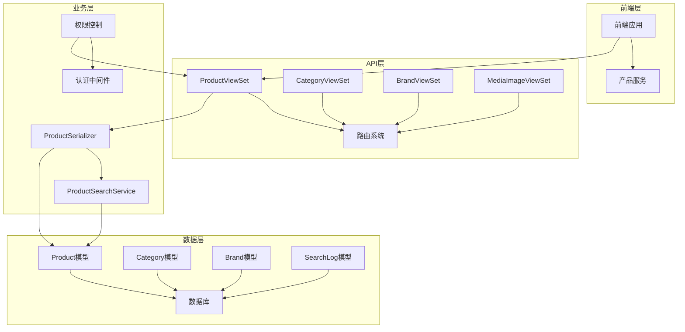
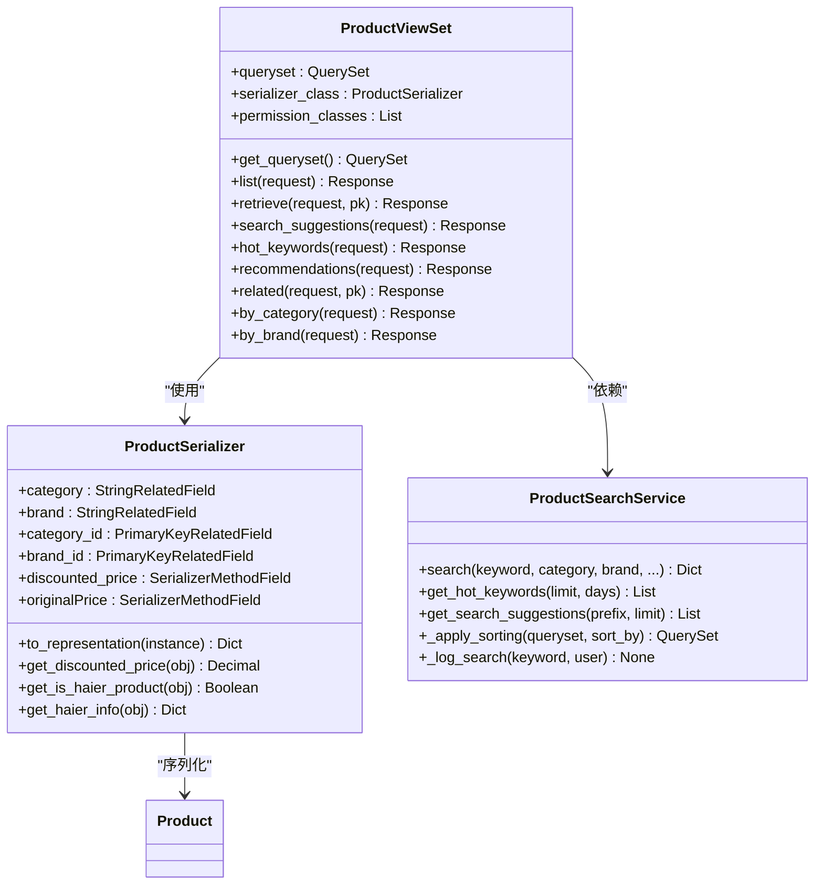
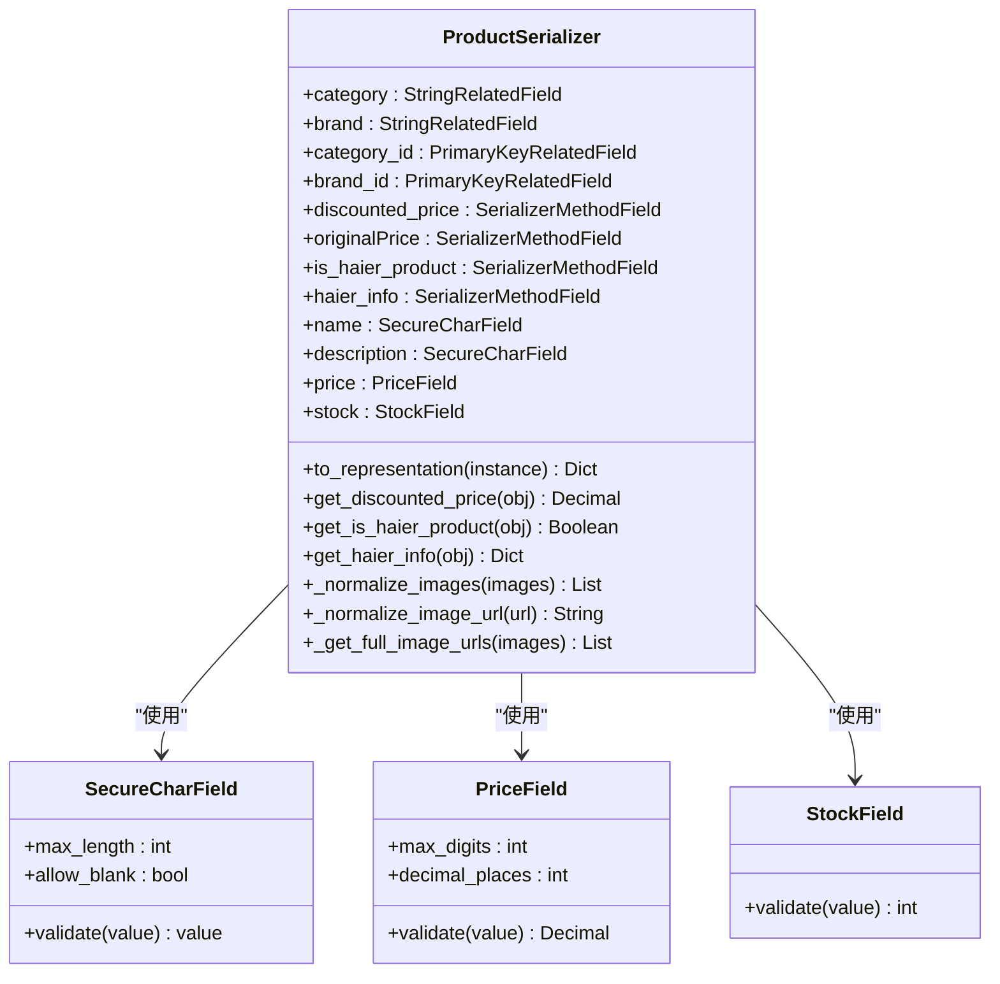
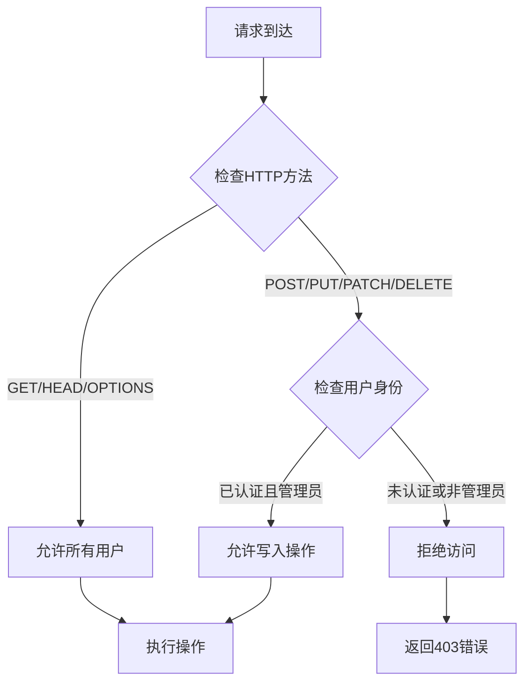
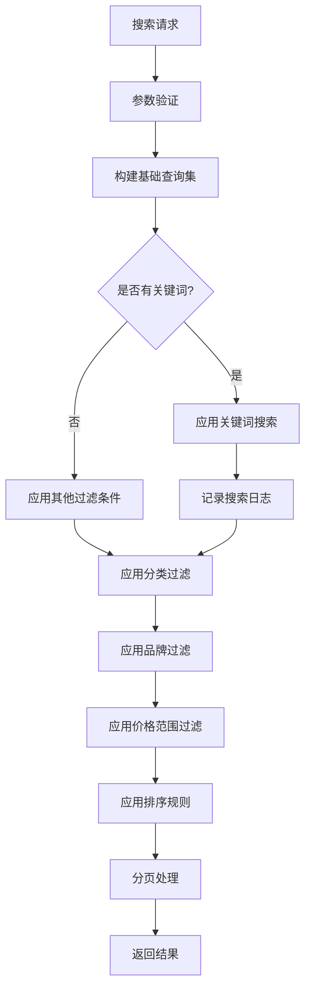
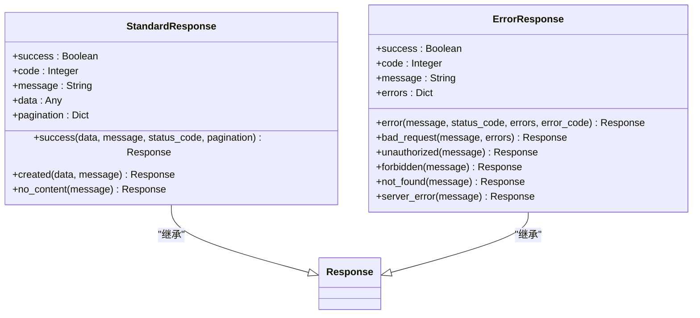

# 商品API接口文档

<cite>
**本文档引用的文件**
- [backend/catalog/views.py](file://backend/catalog/views.py)
- [backend/catalog/serializers.py](file://backend/catalog/serializers.py)
- [backend/catalog/models.py](file://backend/catalog/models.py)
- [backend/catalog/urls.py](file://backend/catalog/urls.py)
- [backend/catalog/search.py](file://backend/catalog/search.py)
- [backend/common/permissions.py](file://backend/common/permissions.py)
- [backend/common/pagination.py](file://backend/common/pagination.py)
- [backend/common/responses.py](file://backend/common/responses.py)
- [backend/common/utils.py](file://backend/common/utils.py)
- [frontend/src/services/product.ts](file://frontend/src/services/product.ts)
</cite>

## 目录
1. [简介](#简介)
2. [项目架构概览](#项目架构概览)
3. [核心组件分析](#核心组件分析)
4. [标准RESTful接口](#标准restful接口)
5. [自定义Action接口](#自定义action接口)
6. [数据序列化与验证](#数据序列化与验证)
7. [权限控制机制](#权限控制机制)
8. [搜索与过滤功能](#搜索与过滤功能)
9. [响应格式与分页](#响应格式与分页)
10. [常见问题与解决方案](#常见问题与解决方案)
11. [最佳实践指南](#最佳实践指南)

## 简介

本文档详细介绍了一个基于Django REST Framework的电商商品API接口系统。该系统提供了完整的商品管理功能，包括商品列表、详情查看、搜索过滤、推荐算法等核心功能。系统采用RESTful设计原则，支持多种查询参数和自定义操作，为前端应用提供了丰富而灵活的商品数据访问能力。

## 项目架构概览

系统采用模块化架构设计，主要包含以下核心模块：



**图表来源**
- [backend/catalog/views.py](file://backend/catalog/views.py#L29-L30)
- [backend/catalog/urls.py](file://backend/catalog/urls.py#L1-L15)

**章节来源**
- [backend/catalog/views.py](file://backend/catalog/views.py#L29-L30)
- [backend/catalog/urls.py](file://backend/catalog/urls.py#L1-L15)

## 核心组件分析

### ProductViewSet - 商品控制器

ProductViewSet是商品API的核心控制器，继承自Django REST Framework的ModelViewSet，提供了完整的CRUD操作和自定义功能。



**图表来源**
- [backend/catalog/views.py](file://backend/catalog/views.py#L29-L30)
- [backend/catalog/serializers.py](file://backend/catalog/serializers.py#L50-L85)
- [backend/catalog/search.py](file://backend/catalog/search.py#L19-L287)

**章节来源**
- [backend/catalog/views.py](file://backend/catalog/views.py#L29-L30)
- [backend/catalog/serializers.py](file://backend/catalog/serializers.py#L50-L85)

## 标准RESTful接口

### 列表接口 (GET /api/products/)

**URL模式**: `/api/products/`

**HTTP方法**: GET

**功能描述**: 获取商品列表，支持高级搜索和过滤

**查询参数**:

| 参数名 | 类型 | 描述 | 示例值 |
|--------|------|------|--------|
| search | string | 关键词搜索（产品名称和描述） | "冰箱" |
| category | string | 按分类筛选 | "家电" |
| brand | string | 按品牌筛选 | "海尔" |
| min_price | decimal | 最小价格过滤 | 100.00 |
| max_price | decimal | 最大价格过滤 | 5000.00 |
| sort_by | string | 排序策略 | "price_asc" |
| page | integer | 页码 | 1 |
| page_size | integer | 每页数量 | 20 |

**排序选项**:
- `relevance`: 相关性排序（默认）
- `price_asc`: 价格升序
- `price_desc`: 价格降序
- `sales`: 销量排序
- `created`: 创建时间排序
- `views`: 浏览量排序

**响应格式**:
```json
{
  "results": [...],
  "total": 100,
  "page": 1,
  "total_pages": 5,
  "has_next": true,
  "has_previous": false
}
```

### 详情接口 (GET /api/products/{id}/)

**URL模式**: `/api/products/{id}/`

**HTTP方法**: GET

**功能描述**: 获取单个商品的详细信息

**认证要求**: 公开访问

**响应格式**:
```json
{
  "id": 1,
  "name": "海尔智能冰箱",
  "description": "...",
  "price": 2999.00,
  "discounted_price": 2799.00,
  "originalPrice": 2999.00,
  "stock": 10,
  "category": "家电",
  "brand": "海尔",
  "main_images": ["https://example.com/image1.jpg"],
  "detail_images": ["https://example.com/detail1.jpg"],
  "is_haier_product": true,
  "haier_info": {...}
}
```

### 创建接口 (POST /api/products/)

**URL模式**: `/api/products/`

**HTTP方法**: POST

**功能描述**: 创建新商品

**认证要求**: 管理员权限

**请求体格式**:
```json
{
  "name": "新商品名称",
  "description": "商品描述",
  "price": 999.99,
  "category_id": 1,
  "brand_id": 1,
  "stock": 100,
  "main_images": [],
  "detail_images": []
}
```

### 更新接口 (PUT/PATCH /api/products/{id}/)

**URL模式**: `/api/products/{id}/`

**HTTP方法**: PUT/PATCH

**功能描述**: 更新商品信息

**认证要求**: 管理员权限

**章节来源**
- [backend/catalog/views.py](file://backend/catalog/views.py#L83-L131)
- [backend/catalog/views.py](file://backend/catalog/views.py#L387-L396)

## 自定义Action接口

### 搜索建议接口 (GET /api/products/search_suggestions/)

**URL模式**: `/api/products/search_suggestions/`

**HTTP方法**: GET

**功能描述**: 获取搜索关键词建议

**查询参数**:

| 参数名 | 类型 | 必填 | 描述 | 默认值 |
|--------|------|------|------|--------|
| prefix | string | 是 | 关键词前缀 | - |
| limit | integer | 否 | 最大建议数量 | 10 |

**响应格式**:
```json
{
  "suggestions": ["冰箱", "智能冰箱", "双门冰箱"]
}
```

### 热门关键词接口 (GET /api/products/hot_keywords/)

**URL模式**: `/api/products/hot_keywords/`

**HTTP方法**: GET

**功能描述**: 获取热门搜索关键词

**查询参数**:

| 参数名 | 类型 | 必填 | 描述 | 默认值 |
|--------|------|------|------|--------|
| limit | integer | 否 | 关键词数量限制 | 10 |
| days | integer | 否 | 统计天数范围 | 7 |

**响应格式**:
```json
{
  "hot_keywords": [
    {"keyword": "冰箱", "count": 150},
    {"keyword": "洗衣机", "count": 120},
    {"keyword": "空调", "count": 100}
  ]
}
```

### 推荐商品接口 (GET /api/products/recommendations/)

**URL模式**: `/api/products/recommendations/`

**HTTP方法**: GET

**功能描述**: 获取商品推荐

**查询参数**:

| 参数名 | 类型 | 必填 | 描述 | 默认值 |
|--------|------|------|------|--------|
| type | string | 否 | 推荐类型 | "popular" |
| limit | integer | 否 | 推荐数量 | 10 |
| category_id | integer | 否 | 分类ID | - |

**推荐类型**:
- `popular`: 热销商品（默认）
- `trending`: 趋势商品
- `category`: 分类推荐

**响应格式**:
```json
[
  {
    "id": 1,
    "name": "热销商品1",
    "price": 999.00,
    "discounted_price": 899.00
  }
]
```

### 相关商品接口 (GET /api/products/{id}/related/)

**URL模式**: `/api/products/{id}/related/`

**HTTP方法**: GET

**功能描述**: 获取相关商品（同分类）

**查询参数**:

| 参数名 | 类型 | 必填 | 描述 | 默认值 |
|--------|------|------|------|--------|
| limit | integer | 否 | 相关商品数量 | 10 |

**响应格式**:
```json
[
  {
    "id": 2,
    "name": "同类商品2",
    "price": 1299.00
  }
]
```

### 按分类获取商品 (GET /api/products/by_category/)

**URL模式**: `/api/products/by_category/`

**HTTP方法**: GET

**功能描述**: 按分类获取商品列表

**查询参数**:

| 参数名 | 类型 | 必填 | 描述 | 默认值 |
|--------|------|------|------|--------|
| category | string | 是 | 分类名称 | - |
| sort_by | string | 否 | 排序方式 | "relevance" |
| page | integer | 否 | 页码 | 1 |
| page_size | integer | 否 | 每页数量 | 20 |

### 按品牌获取商品 (GET /api/products/by_brand/)

**URL模式**: `/api/products/by_brand/`

**HTTP方法**: GET

**功能描述**: 按品牌获取商品列表

**查询参数**:

| 参数名 | 类型 | 必填 | 描述 | 默认值 |
|--------|------|------|------|--------|
| brand | string | 是 | 品牌名称 | - |
| sort_by | string | 否 | 排序方式 | "relevance" |
| page | integer | 否 | 页码 | 1 |
| page_size | integer | 否 | 每页数量 | 20 |

**章节来源**
- [backend/catalog/views.py](file://backend/catalog/views.py#L141-L157)
- [backend/catalog/views.py](file://backend/catalog/views.py#L167-L187)
- [backend/catalog/views.py](file://backend/catalog/views.py#L337-L385)
- [backend/catalog/views.py](file://backend/catalog/views.py#L404-L433)
- [backend/catalog/views.py](file://backend/catalog/views.py#L202-L263)
- [backend/catalog/views.py](file://backend/catalog/views.py#L265-L326)

## 数据序列化与验证

### ProductSerializer - 商品序列化器

ProductSerializer负责商品数据的序列化和反序列化，处理复杂的关联字段和计算属性。



**图表来源**
- [backend/catalog/serializers.py](file://backend/catalog/serializers.py#L50-L85)

### 关联字段处理

#### category_id 和 brand_id 字段

这两个字段允许通过ID设置关联关系，而不是直接嵌套对象：

```python
# 在请求中使用
{
  "name": "商品名称",
  "category_id": 1,  # 直接使用分类ID
  "brand_id": 2,     # 直接使用品牌ID
  "price": 999.99
}
```

#### 图片URL处理

to_representation方法实现了智能的图片URL转换：

1. **主图处理**: 优先使用本地上传的图片，其次使用海尔图片
2. **详情图处理**: 优先使用海尔拉页URL，其次使用本地详情图
3. **URL标准化**: 将相对路径转换为完整URL

### 价格逻辑处理

#### 折扣价计算

```python
def get_discounted_price(self, obj: Product):
    """获取折扣价，考虑用户优惠券和会员价"""
    request = self.context.get('request')
    user = getattr(request, 'user', None)
    
    # 使用display_price作为基础价格
    base_price = obj.display_price if hasattr(obj, 'display_price') else obj.price
    
    if not user or not user.is_authenticated:
        return base_price
    
    # 缓存优化，减少数据库查询
    cache_key = f"discount:{user.id}:{obj.id}"
    amount = cache.get(cache_key)
    
    if amount is None:
        # 查询用户可用的优惠券
        amount = self._get_user_discount(obj, user)
        cache.set(cache_key, amount, 60)
    
    return max(0, base_price - amount)
```

#### 原价和现价逻辑

```python
def get_originalPrice(self, obj: Product):
    """获取原价（市场价或普通价格）"""
    if obj.market_price:
        return obj.market_price
    return obj.price

def get_discounted_price(self, obj: Product):
    """获取折扣价"""
    # 优先使用供价，其次使用普通价格
    return obj.supply_price or obj.price
```

**章节来源**
- [backend/catalog/serializers.py](file://backend/catalog/serializers.py#L50-L85)
- [backend/catalog/serializers.py](file://backend/catalog/serializers.py#L122-L250)

## 权限控制机制

### IsAdminOrReadOnly 权限类

这是系统的主要权限控制类，实现了读写分离的安全策略：



**图表来源**
- [backend/common/permissions.py](file://backend/common/permissions.py#L70-L99)

### 权限配置

在ProductViewSet中应用权限控制：

```python
class ProductViewSet(viewsets.ModelViewSet):
    queryset = Product.objects.all()
    serializer_class = ProductSerializer
    permission_classes = [IsAdminOrReadOnly]
```

### 特殊权限场景

#### 管理员专用接口

某些接口需要更严格的权限控制：

```python
@action(detail=True, methods=['post'], permission_classes=[IsAdmin])
def sync_haier_stock(self, request, pk=None):
    """海尔库存同步 - 仅管理员可访问"""
    pass
```

#### 认证用户专用接口

```python
@action(detail=False, methods=['get'], permission_classes=[IsAuthenticated])
def with_discounts(self, request):
    """获取带折扣的商品 - 需要登录"""
    pass
```

**章节来源**
- [backend/common/permissions.py](file://backend/common/permissions.py#L70-L99)
- [backend/catalog/views.py](file://backend/catalog/views.py#L189-L190)

## 搜索与过滤功能

### ProductSearchService - 搜索服务

搜索服务提供了强大的全文搜索和多维度过滤功能：



**图表来源**
- [backend/catalog/search.py](file://backend/catalog/search.py#L47-L158)

### 搜索功能特性

#### 关键词搜索

支持产品名称和描述的模糊匹配：

```python
# 支持的搜索模式
queryset = queryset.filter(
    Q(name__icontains=keyword) | 
    Q(description__icontains=keyword)
)
```

#### 多维度过滤

```python
# 分类过滤
if category and category.strip():
    queryset = queryset.filter(category__name__iexact=category.strip())

# 品牌过滤  
if brand and brand.strip():
    queryset = queryset.filter(brand__name__iexact=brand.strip())

# 价格范围过滤
if min_price is not None:
    queryset = queryset.filter(price__gte=min_price)
if max_price is not None:
    queryset = queryset.filter(price__lte=max_price)
```

#### 智能排序

支持多种排序策略：

```python
VALID_SORT_OPTIONS = {
    'relevance',      # 关键词相关性
    'price_asc',      # 价格升序
    'price_desc',     # 价格降序
    'sales',          # 销量排序
    'created',        # 创建时间
    'views',          # 浏览量
}
```

### 搜索日志分析

系统自动记录搜索行为，用于分析和优化：

```python
@classmethod
def _log_search(cls, keyword: str, user=None) -> None:
    """记录搜索查询用于分析"""
    try:
        SearchLog.objects.create(
            keyword=keyword,
            user=user
        )
    except Exception:
        # 记录失败时静默处理
        pass
```

**章节来源**
- [backend/catalog/search.py](file://backend/catalog/search.py#L47-L158)
- [backend/catalog/search.py](file://backend/catalog/search.py#L204-L221)

## 响应格式与分页

### 统一响应格式

系统采用统一的响应格式，确保前后端交互的一致性：



**图表来源**
- [backend/common/responses.py](file://backend/common/responses.py#L15-L322)

### 分页响应结构

分页接口返回标准化的分页信息：

```json
{
  "results": [...],           // 当前页数据
  "total": 1000,             // 总记录数
  "page": 1,                 // 当前页码
  "total_pages": 50,         // 总页数
  "has_next": true,          // 是否有下一页
  "has_previous": false,     // 是否有上一页
  "count": 1000,             // 兼容字段
  "next": "/api/products/?page=2",  // 下一页链接
  "previous": null           // 上一页链接
}
```

### 分页配置

系统提供了三种分页策略：

#### 标准分页 (StandardResultsSetPagination)
- 默认每页20条
- 最大100条
- 适用于大多数列表接口

#### 大数据量分页 (LargeResultsSetPagination)
- 默认每页100条
- 最大1000条
- 适用于导出等大数据场景

#### 小数据量分页 (SmallResultsSetPagination)
- 默认每页10条
- 最大50条
- 适用于移动端或特殊场景

**章节来源**
- [backend/common/responses.py](file://backend/common/responses.py#L15-L322)
- [backend/common/pagination.py](file://backend/common/pagination.py#L8-L99)

## 常见问题与解决方案

### 搜索功能实现问题

#### 问题1: 搜索性能优化

**症状**: 大量商品时搜索响应缓慢

**解决方案**:
1. 使用数据库索引优化查询
2. 实现搜索缓存机制
3. 添加搜索结果预聚合

```python
# 在Product模型中添加索引
class Meta:
    indexes = [
        models.Index(fields=['name', 'description']),
        models.Index(fields=['is_active', 'sales_count']),
    ]
```

#### 问题2: 关键词匹配不准确

**症状**: 搜索结果与预期不符

**解决方案**:
1. 实现拼音搜索支持
2. 添加同义词匹配
3. 使用搜索引擎（如Elasticsearch）

### 响应数据格式化问题

#### 问题3: 图片URL显示异常

**症状**: 前端显示的图片URL不正确

**解决方案**:
1. 在序列化器中统一处理URL
2. 使用绝对URL确保跨域兼容
3. 实现CDN地址映射

```python
def _get_full_image_urls(self, images):
    """将图片URL转换为完整URL"""
    if not images:
        return []
    
    request = self.context.get('request')
    result = []
    
    for img_url in images:
        if not img_url:
            continue
        
        if img_url.startswith('http://') or img_url.startswith('https://'):
            result.append(img_url)
        elif request:
            result.append(request.build_absolute_uri(img_url))
        else:
            result.append(img_url)
    
    return result
```

#### 问题4: 价格显示不一致

**症状**: 折扣价和原价显示错误

**解决方案**:
1. 明确价格字段含义
2. 实现价格计算逻辑
3. 添加价格缓存机制

```python
@property
def display_price(self):
    """显示价格（优先使用供价，其次使用普通价格）"""
    return self.supply_price or self.price
```

### 权限控制问题

#### 问题5: 管理员权限误判

**症状**: 正式用户被拒绝访问

**解决方案**:
1. 检查用户认证状态
2. 验证管理员标识
3. 添加权限调试日志

```python
def has_permission(self, request, view):
    # 开发环境允许所有认证用户
    if not EnvironmentConfig.is_production():
        return request.user and request.user.is_authenticated
    
    # 生产环境严格验证
    return request.user and request.user.is_staff
```

**章节来源**
- [backend/catalog/serializers.py](file://backend/catalog/serializers.py#L158-L178)
- [backend/catalog/models.py](file://backend/catalog/models.py#L196-L200)
- [backend/common/permissions.py](file://backend/common/permissions.py#L126-L158)

## 最佳实践指南

### API调用示例

#### 基础商品列表查询

```javascript
// 获取商品列表
const products = await productService.getProducts({
  page: 1,
  page_size: 20,
  sort_by: 'sales',
  search: '冰箱',
  category: '家电',
  brand: '海尔'
});
```

#### 推荐商品获取

```javascript
// 获取热门推荐
const popular = await productService.getRecommendations({
  type: 'popular',
  limit: 10
});

// 获取分类推荐
const categoryRecs = await productService.getRecommendations({
  type: 'category',
  category_id: 5,
  limit: 8
});
```

#### 商品详情获取

```javascript
// 获取商品详情
const product = await productService.getProductDetail(123);

// 获取相关商品
const related = await productService.getRelatedProducts(123, 5);
```

### 性能优化建议

#### 1. 查询优化

```python
# 使用select_related避免N+1查询
def get_queryset(self):
    qs = super().get_queryset()
    qs = qs.select_related('category', 'brand')  # 预加载关联对象
    return qs
```

#### 2. 缓存策略

```python
# 使用Redis缓存热门商品
@cache_cached(timeout=300)  # 5分钟缓存
def get_hot_keywords(self, limit=10, days=7):
    pass
```

#### 3. 分页优化

```python
# 配置合适的分页大小
class ProductViewSet(viewsets.ModelViewSet):
    pagination_class = StandardResultsSetPagination  # 20条/页
```

### 安全最佳实践

#### 1. 输入验证

```python
# 使用专门的字段类型进行验证
class ProductSerializer(serializers.ModelSerializer):
    name = SecureCharField(max_length=200)  # 防止XSS攻击
    price = PriceField(max_digits=10, decimal_places=2)  # 精确的价格验证
    stock = StockField()  # 合理的库存验证
```

#### 2. 权限控制

```python
# 严格的权限控制
class ProductViewSet(viewsets.ModelViewSet):
    permission_classes = [IsAdminOrReadOnly]  # 读写分离
    
    @action(detail=True, methods=['post'], permission_classes=[IsAdmin])
    def sync_haier_stock(self, request, pk=None):
        """管理员专用接口"""
        pass
```

#### 3. 错误处理

```python
# 统一的错误处理
from common.responses import ErrorResponse

def handle_api_errors(func):
    def wrapper(*args, **kwargs):
        try:
            return func(*args, **kwargs)
        except ValidationError as e:
            return ErrorResponse.bad_request(errors=e.detail)
        except Exception as e:
            return ErrorResponse.server_error(str(e))
    return wrapper
```

### 前端集成指南

#### 1. 请求封装

```typescript
// 请求拦截器
http.interceptors.request.use(config => {
  const token = localStorage.getItem('token');
  if (token && config.headers) {
    config.headers.Authorization = `Bearer ${token}`;
  }
  return config;
});

// 响应拦截器
http.interceptors.response.use(response => {
  if (response.data.success !== undefined) {
    return response.data.data;
  }
  return response.data;
});
```

#### 2. 错误处理

```typescript
// 统一错误处理
http.get('/products/')
  .then(data => {
    // 处理成功响应
  })
  .catch(error => {
    if (error.code === 401) {
      // 未授权，跳转登录
      window.location.href = '/login';
    } else if (error.code === 403) {
      // 权限不足
      showToast('无访问权限');
    } else {
      // 其他错误
      showToast('网络错误，请稍后重试');
    }
  });
```

#### 3. 缓存策略

```typescript
// 商品列表缓存
const productCache = new Map();

async function getCachedProducts(params) {
  const cacheKey = JSON.stringify(params);
  
  if (productCache.has(cacheKey)) {
    return productCache.get(cacheKey);
  }
  
  const data = await productService.getProducts(params);
  productCache.set(cacheKey, data);
  
  // 缓存5分钟
  setTimeout(() => productCache.delete(cacheKey), 5 * 60 * 1000);
  
  return data;
}
```

**章节来源**
- [frontend/src/services/product.ts](file://frontend/src/services/product.ts#L1-L64)
- [backend/catalog/views.py](file://backend/catalog/views.py#L52-L67)
- [backend/common/responses.py](file://backend/common/responses.py#L15-L322)