# 商品业务逻辑

<cite>
**本文档引用的文件**
- [models.py](file://backend/catalog/models.py)
- [views.py](file://backend/catalog/views.py)
- [haierapi.py](file://backend/integrations/haierapi.py)
- [sync_haier_products.py](file://backend/catalog/management/commands/sync_haier_products.py)
- [serializers.py](file://backend/catalog/serializers.py)
- [permissions.py](file://backend/common/permissions.py)
- [search.py](file://backend/catalog/search.py)
- [state_machine.py](file://backend/orders/state_machine.py)
- [analytics.py](file://backend/orders/analytics.py)
</cite>

## 目录
1. [简介](#简介)
2. [项目结构概览](#项目结构概览)
3. [核心数据模型](#核心数据模型)
4. [商品管理业务流程](#商品管理业务流程)
5. [海尔API集成](#海尔api集成)
6. [商品状态管理](#商品状态管理)
7. [销售统计与浏览统计](#销售统计与浏览统计)
8. [权限控制与安全](#权限控制与安全)
9. [错误处理与日志记录](#错误处理与日志记录)
10. [性能优化策略](#性能优化策略)
11. [常见问题与解决方案](#常见问题与解决方案)
12. [总结](#总结)

## 简介

本文档详细介绍了电动小程序项目中的商品业务逻辑，重点阐述了商品管理的核心业务流程，包括商品的创建、更新、删除操作，以及与海尔API的深度集成。系统采用Django框架构建，实现了完整的商品生命周期管理，支持本地商品和海尔商品的统一管理，并提供了丰富的统计分析功能。

## 项目结构概览

商品业务模块位于`backend/catalog/`目录下，主要包含以下核心组件：

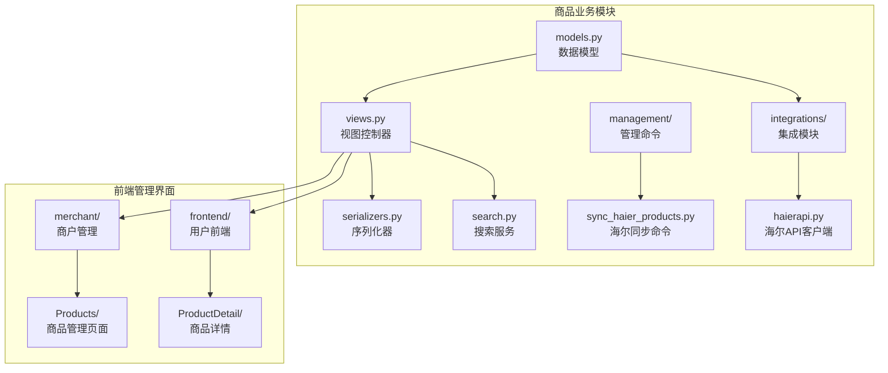

**图表来源**
- [models.py](file://backend/catalog/models.py#L1-L312)
- [views.py](file://backend/catalog/views.py#L1-L980)
- [haierapi.py](file://backend/integrations/haierapi.py#L1-L214)

## 核心数据模型

### Product 商品模型

商品模型是整个业务的核心，包含了商品的基本属性、状态信息和海尔API集成字段：

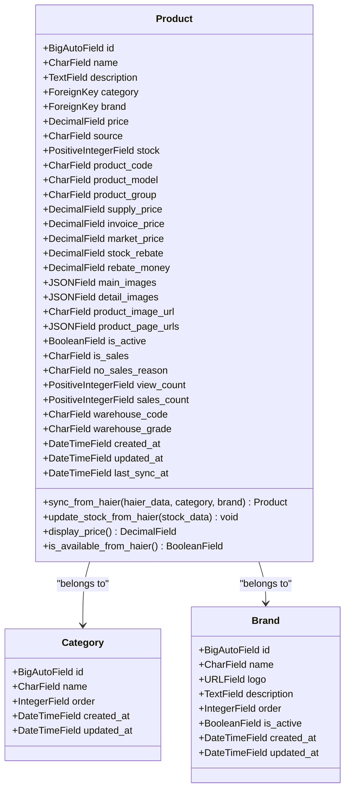

**图表来源**
- [models.py](file://backend/catalog/models.py#L43-L205)

### 关键字段说明

| 字段名 | 类型 | 描述 | 业务意义 |
|--------|------|------|----------|
| `source` | CharField | 商品来源 | 区分本地商品(SOURCE_LOCAL)和海尔商品(SOURCE_HAIER) |
| `is_active` | BooleanField | 是否上架 | 控制商品在前端的可见性 |
| `is_sales` | CharField | 海尔是否可采 | '1'表示可采，'0'表示不可采 |
| `sales_count` | PositiveIntegerField | 销售数量 | 统计商品销售情况 |
| `view_count` | PositiveIntegerField | 浏览次数 | 记录商品被查看的次数 |
| `stock` | PositiveIntegerField | 库存数量 | 当前可用库存 |
| `last_sync_at` | DateTimeField | 最后同步时间 | 记录与海尔API同步的时间 |

**章节来源**
- [models.py](file://backend/catalog/models.py#L43-L116)

## 商品管理业务流程

### 商品创建流程

商品创建遵循严格的业务规则，确保数据的一致性和完整性：

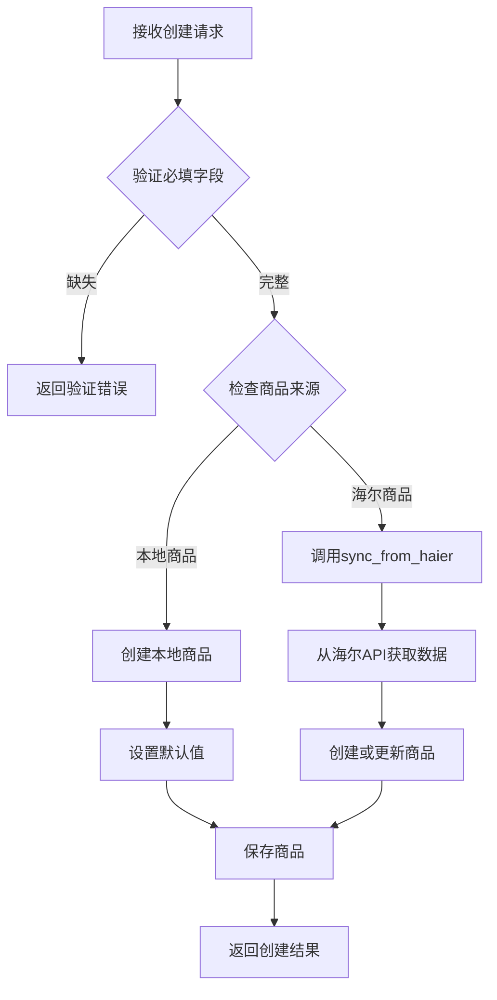

**图表来源**
- [views.py](file://backend/catalog/views.py#L48-L980)
- [models.py](file://backend/catalog/models.py#L118-L179)

### 商品更新流程

商品更新需要考虑不同来源商品的特殊处理需求：

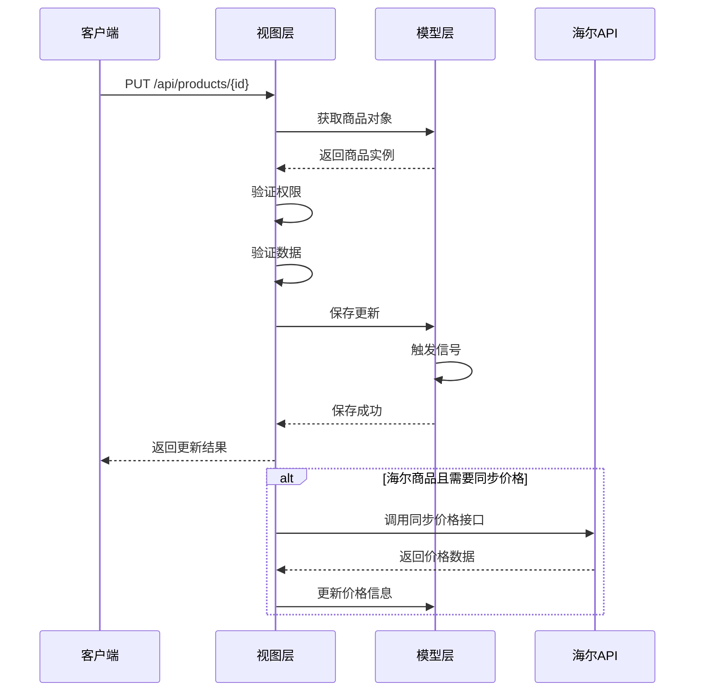

**图表来源**
- [views.py](file://backend/catalog/views.py#L48-L980)
- [models.py](file://backend/catalog/models.py#L181-L195)

### 商品删除流程

商品删除需要考虑关联关系和业务约束：

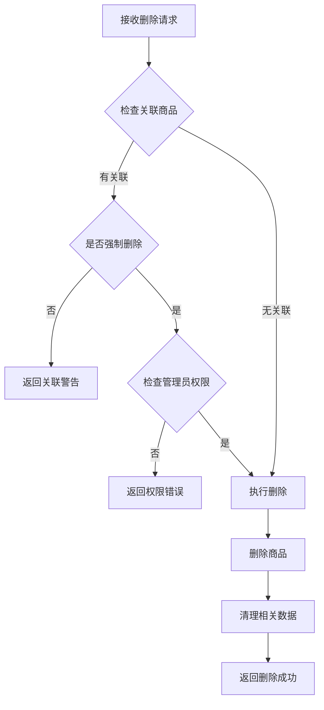

**图表来源**
- [views.py](file://backend/catalog/views.py#L646-L674)

**章节来源**
- [views.py](file://backend/catalog/views.py#L48-L980)

## 海尔API集成

### sync_from_haier 方法详解

`sync_from_haier` 是系统与海尔API集成的核心方法，负责从海尔API同步商品数据：

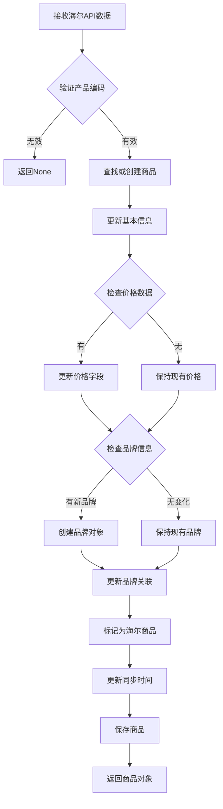

**图表来源**
- [models.py](file://backend/catalog/models.py#L118-L179)

### update_stock_from_haier 方法

该方法专门处理海尔商品的库存同步：

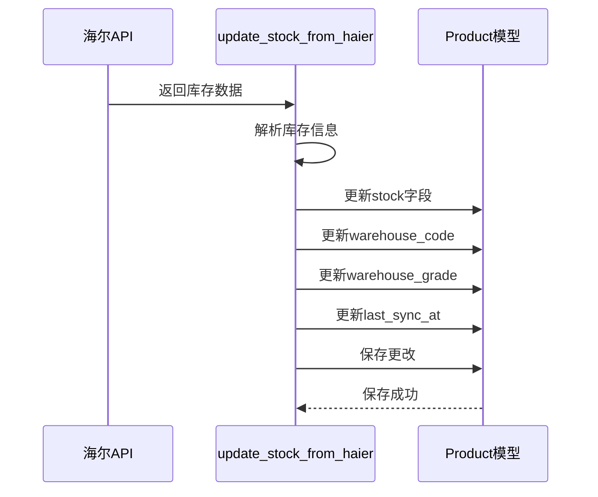

**图表来源**
- [models.py](file://backend/catalog/models.py#L181-L195)

### 管理接口实现

系统提供了两个专门的管理接口用于同步海尔商品信息：

| 接口名称 | URL路径 | 权限要求 | 功能描述 |
|----------|---------|----------|----------|
| sync_haier_stock | `/api/products/{id}/sync-haier-stock/` | IsAdmin | 同步指定海尔商品的库存信息 |
| sync_haier_price | `/api/products/{id}/sync-haier-price/` | IsAdmin | 同步指定海尔商品的价格信息 |

**章节来源**
- [models.py](file://backend/catalog/models.py#L118-L195)
- [views.py](file://backend/catalog/views.py#L435-L565)

## 商品状态管理

### 状态字段说明

商品状态管理涉及多个关键字段，每个字段都有特定的业务含义：

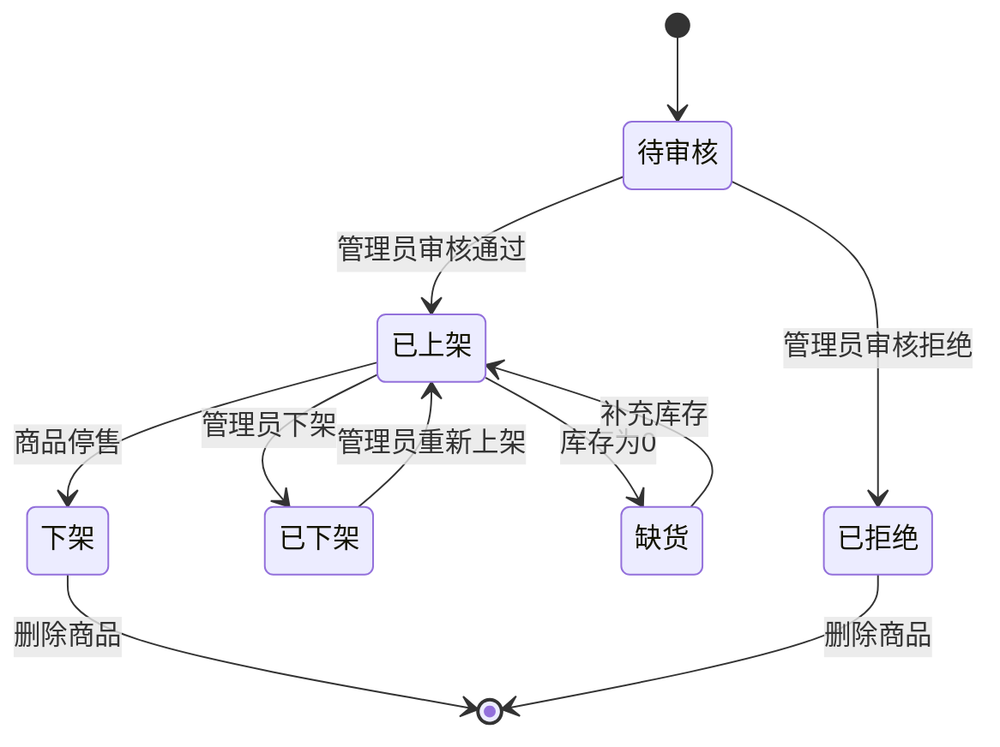

### is_active 字段控制

`is_active` 字段控制商品在前端的可见性：

- **True**: 商品正常显示，用户可以购买
- **False**: 商品隐藏，用户无法看到
- **应用场景**: 临时下架、维护期间、促销活动等

### is_sales 字段控制

`is_sales` 字段由海尔API提供，控制商品是否可采购：

- **'1'**: 可采，商品可以正常销售
- **'0'**: 不可采，商品暂停销售
- **no_sales_reason**: 不可采原因说明

**章节来源**
- [models.py](file://backend/catalog/models.py#L86-L89)

## 销售统计与浏览统计

### 统计字段设计

系统通过多个统计字段跟踪商品的表现：

| 字段名 | 类型 | 默认值 | 更新时机 | 业务用途 |
|--------|------|--------|----------|----------|
| `view_count` | PositiveIntegerField | 0 | 商品详情访问时 | 统计商品曝光度 |
| `sales_count` | PositiveIntegerField | 0 | 订单完成时 | 统计实际销售量 |
| `created_at` | DateTimeField | 自动 | 商品创建时 | 记录商品上线时间 |
| `updated_at` | DateTimeField | 自动 | 商品更新时 | 记录最后修改时间 |

### 统计更新机制

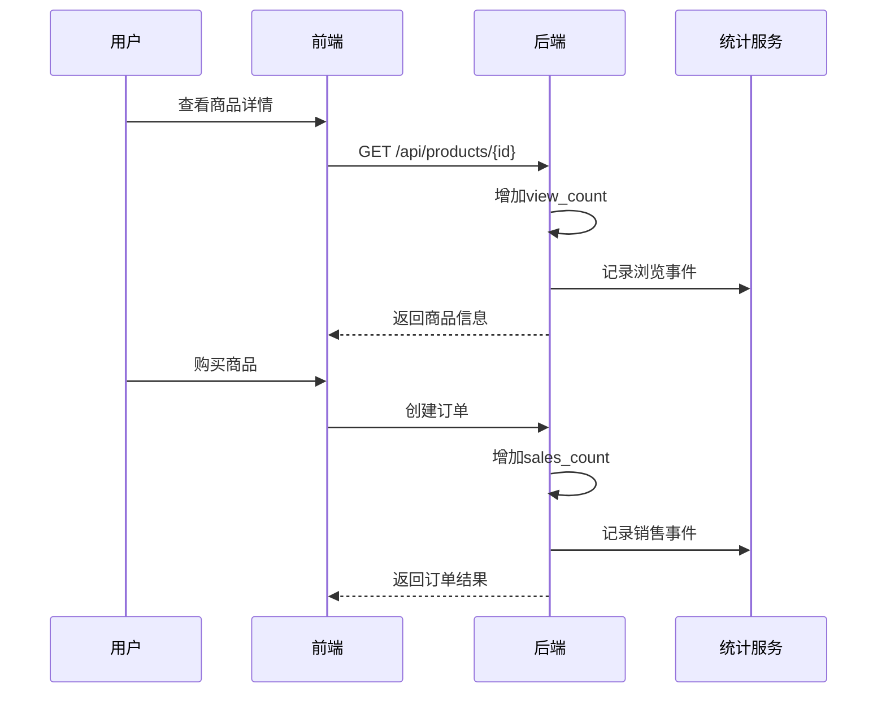

**图表来源**
- [views.py](file://backend/catalog/views.py#L363-L385)
- [analytics.py](file://backend/orders/analytics.py#L150-L321)

### 推荐算法

系统基于统计信息提供多种推荐策略：

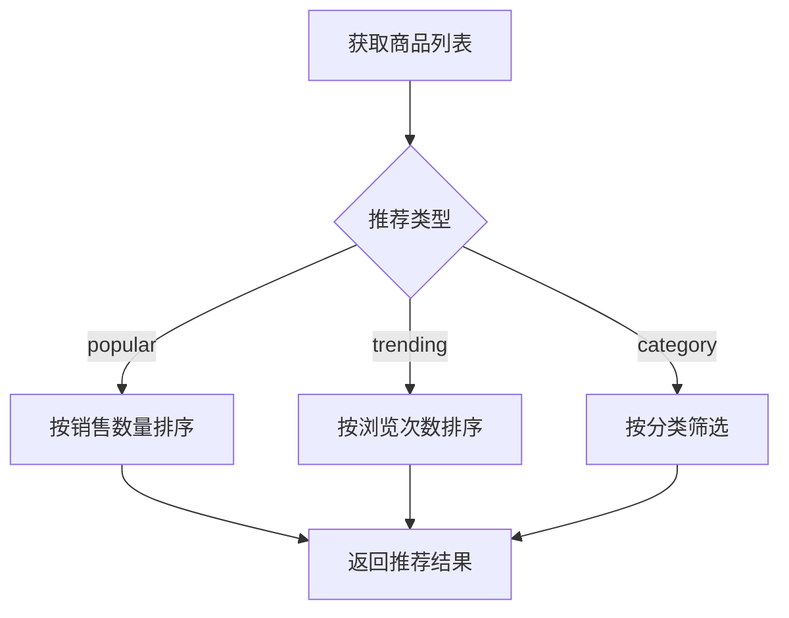

**图表来源**
- [views.py](file://backend/catalog/views.py#L363-L385)

**章节来源**
- [views.py](file://backend/catalog/views.py#L363-L385)
- [analytics.py](file://backend/orders/analytics.py#L150-L321)

## 权限控制与安全

### 权限层次结构

系统采用多层权限控制机制：

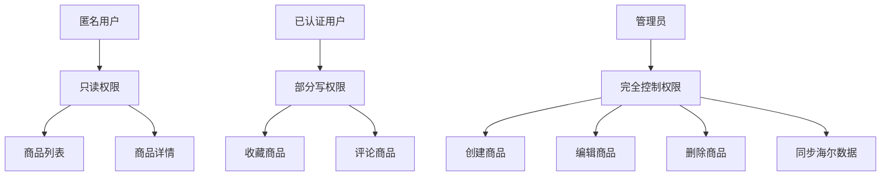

**图表来源**
- [permissions.py](file://backend/common/permissions.py#L70-L189)

### 具体权限规则

| 权限类 | GET | POST | PUT | PATCH | DELETE | 特殊要求 |
|--------|-----|------|-----|-------|--------|----------|
| IsAdminOrReadOnly | ✅ | ❌ | ❌ | ❌ | ❌ | 仅管理员可写 |
| IsAdmin | ✅ | ✅ | ✅ | ✅ | ✅ | 必须管理员 |
| IsAuthenticatedOrReadOnly | ✅ | ❌ | ❌ | ❌ | ❌ | 已认证用户可写 |

**章节来源**
- [permissions.py](file://backend/common/permissions.py#L70-L189)
- [views.py](file://backend/catalog/views.py#L29-L51)

## 错误处理与日志记录

### 异常处理策略

系统采用多层次的异常处理机制：

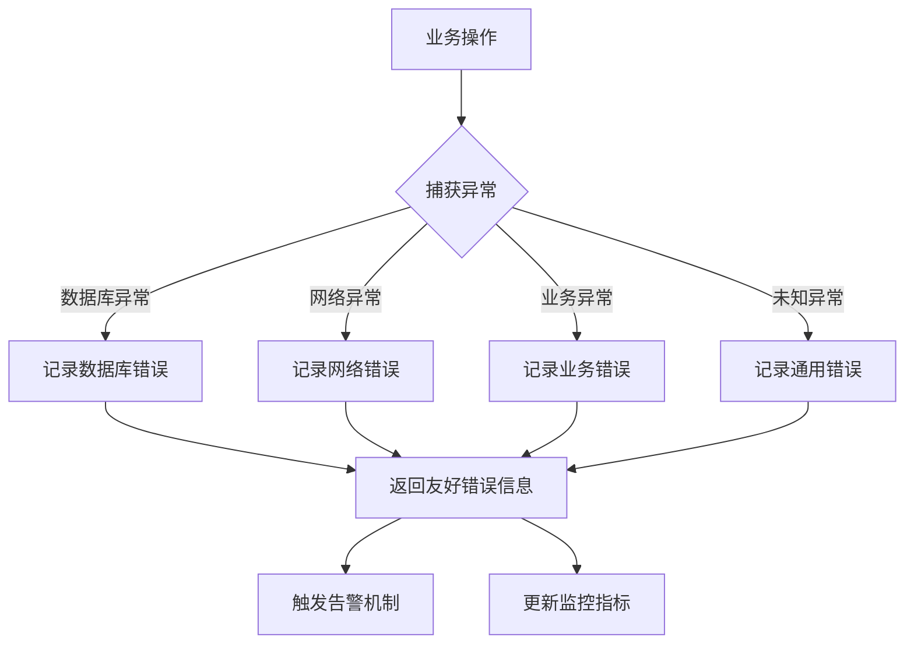

### 日志记录规范

系统在关键业务节点记录详细的日志信息：

| 日志级别 | 记录场景 | 示例信息 |
|----------|----------|----------|
| DEBUG | 详细操作过程 | "同步海尔商品: NQ0054000 成功" |
| INFO | 重要业务事件 | "商品创建: iPhone 15 Pro Max" |
| WARNING | 异常但可恢复 | "海尔API连接超时，重试中..." |
| ERROR | 严重错误 | "商品更新失败: 数据库约束违反" |
| CRITICAL | 系统级错误 | "海尔API认证失败，服务不可用" |

**章节来源**
- [views.py](file://backend/catalog/views.py#L487-L493)
- [sync_haier_products.py](file://backend/catalog/management/commands/sync_haier_products.py#L147-L151)

## 性能优化策略

### 查询优化

系统采用多种查询优化技术：

### 缓存策略

| 缓存类型 | 缓存内容 | 过期时间 | 更新触发 |
|----------|----------|----------|----------|
| 页面缓存 | 商品列表页 | 5分钟 | 商品更新时 |
| 数据缓存 | 热门商品 | 10分钟 | 销售统计变化 |
| 查询缓存 | 分类数据 | 永久 | 分类结构变化 |
| 用户缓存 | 用户统计数据 | 5分钟 | 用户行为变化 |

### 索引优化

商品模型的关键索引设计：

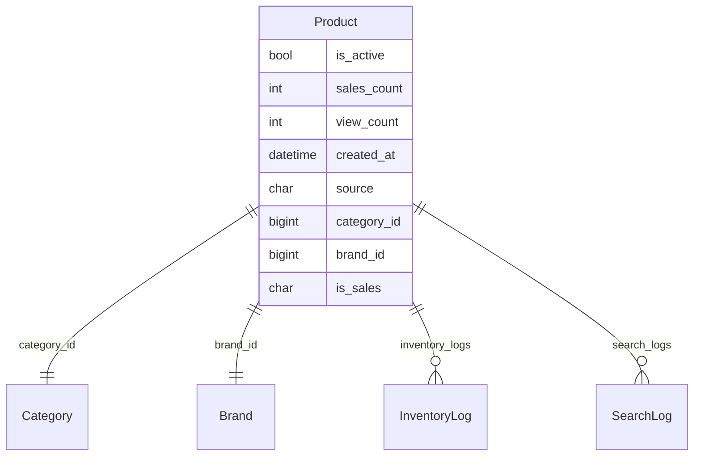

**图表来源**
- [models.py](file://backend/catalog/models.py#L105-L113)

**章节来源**
- [models.py](file://backend/catalog/models.py#L105-L113)
- [views.py](file://backend/catalog/views.py#L52-L67)

## 常见问题与解决方案

### 同步失败处理

当海尔API同步失败时，系统采用以下策略：

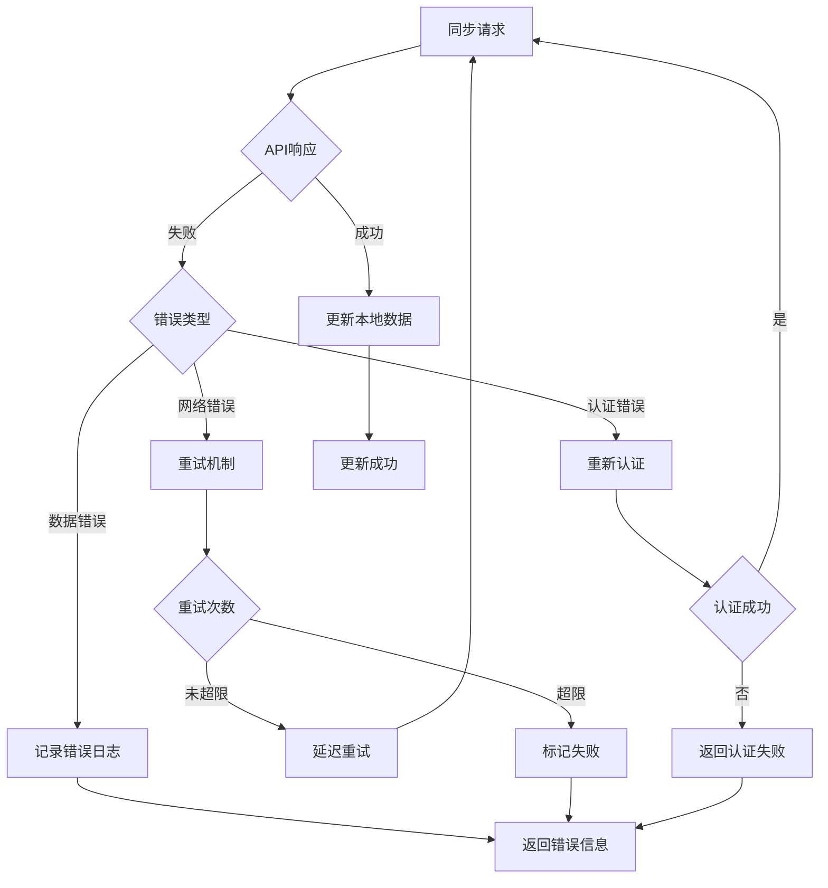

### 数据一致性维护

系统通过以下机制确保数据一致性：

| 一致性检查点 | 检查内容 | 处理方式 |
|-------------|----------|----------|
| 创建商品 | 产品编码唯一性 | 数据库约束 + 业务验证 |
| 更新库存 | 库存不能为负 | 业务逻辑 + 数据验证 |
| 同步价格 | 价格合理性 | 价格范围检查 |
| 删除商品 | 关联关系检查 | 级联删除 + 强制删除 |

### 性能瓶颈解决

针对常见的性能问题，系统提供了以下解决方案：

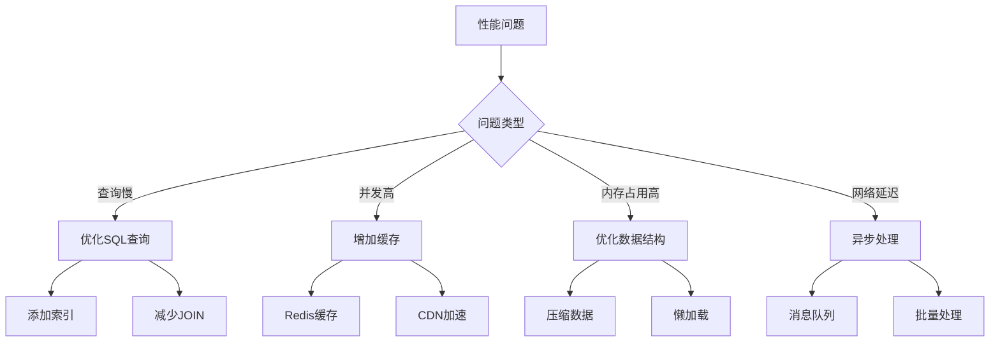

**章节来源**
- [views.py](file://backend/catalog/views.py#L487-L493)
- [sync_haier_products.py](file://backend/catalog/management/commands/sync_haier_products.py#L147-L151)

## 总结

电动小程序的商品业务逻辑设计体现了现代电商平台的最佳实践，通过以下特点实现了高效、稳定、可扩展的商品管理：

### 核心优势

1. **统一的商品模型**: 支持本地商品和海尔商品的统一管理，简化了业务逻辑
2. **完善的API集成**: 深度集成海尔API，实现了商品数据的实时同步
3. **灵活的状态管理**: 通过多个状态字段精确控制商品的上下架和销售状态
4. **丰富的统计分析**: 提供了全面的商品表现统计和智能推荐功能
5. **严格的安全控制**: 多层次的权限控制确保数据安全和业务合规

### 技术特色

- **异步处理**: 海尔API同步采用异步处理，提高系统响应速度
- **缓存策略**: 多级缓存机制显著提升查询性能
- **错误恢复**: 完善的错误处理和恢复机制保证系统稳定性
- **监控告警**: 全面的日志记录和监控体系便于问题定位和性能优化

### 发展方向

未来可以考虑以下优化方向：
- 增强AI推荐算法，提供更精准的商品推荐
- 扩展多渠道商品管理，支持更多第三方平台
- 优化移动端体验，提供更好的用户体验
- 加强数据分析能力，为运营决策提供更多支持

这套商品业务逻辑为电动小程序提供了坚实的基础，支撑着整个电商业务的稳定运行和发展。